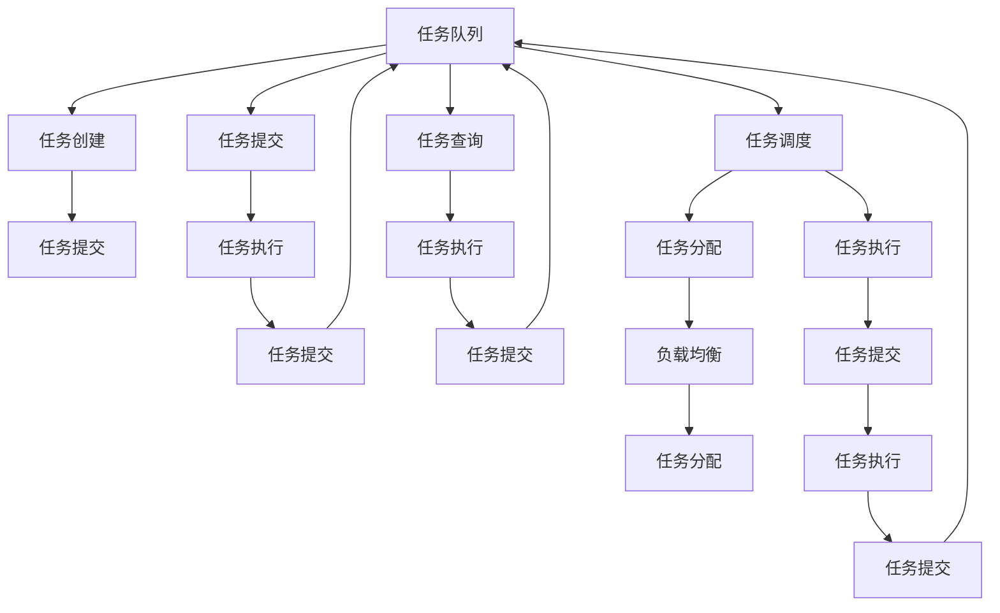
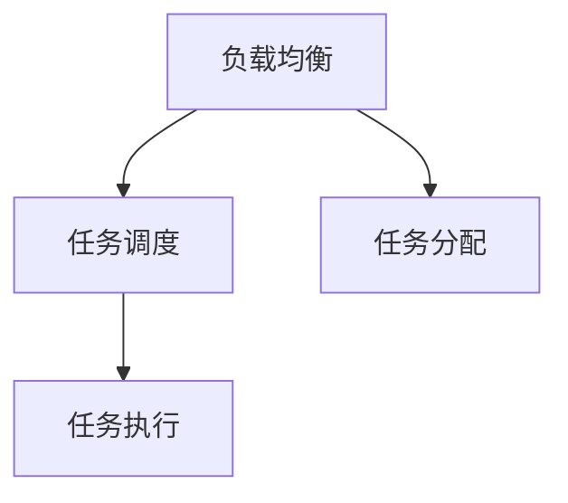
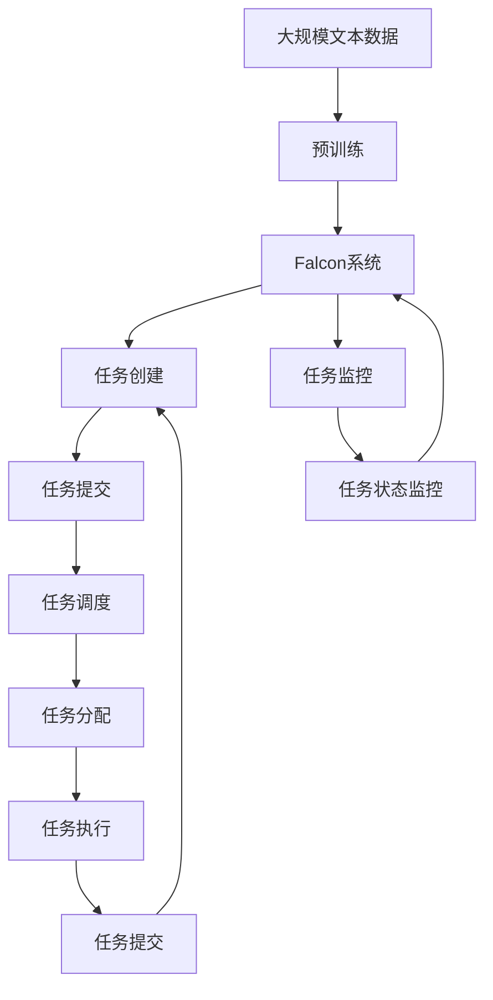

                 

# Falcon原理与代码实例讲解

> 关键词：Falcon, 分布式计算, 负载均衡, 高并发, 性能优化, 代码实例, 分布式锁, 高可用

## 1. 背景介绍

### 1.1 问题由来

在现代互联网应用中，随着用户数量的激增，单台服务器已难以承载大规模的并发请求。分布式系统应运而生，通过多台服务器的协作来共同处理请求，从而提升系统的可扩展性和稳定性。然而，分布式系统带来了诸多复杂性，包括负载均衡、服务发现、数据一致性等问题。Falcon系统是一个轻量级的分布式任务调度框架，以解决这些问题。

### 1.2 问题核心关键点

Falcon系统通过任务队列、负载均衡、任务调度、分布式锁、任务监控等机制，构建了一个高效的分布式任务处理系统。其核心思想是将任务划分为多个子任务，由多个工作节点并行处理，从而提升系统的并发能力和任务处理效率。

## 2. 核心概念与联系

### 2.1 核心概念概述

为更好地理解Falcon系统，本节将介绍几个关键的概念：

- **任务队列(Task Queue)**：Falcon的核心机制之一，用于管理分布式任务。任务队列按照先进先出的顺序存储任务，并提供任务创建、提交、查询等操作。
- **负载均衡(Load Balancer)**：将任务分配到不同的工作节点上，确保各个节点负载均衡，避免单点故障。
- **任务调度(Task Scheduler)**：根据任务的优先级和调度策略，安排任务的执行顺序，确保任务高效处理。
- **分布式锁(Distributed Lock)**：用于解决任务并发执行时数据竞争的问题，确保任务的原子性。
- **任务监控(Task Monitor)**：监控任务的执行状态，及时发现任务执行异常并进行处理，保证系统稳定性。

这些概念之间存在着紧密的联系，共同构成了Falcon系统的完整生态系统。下面将通过Mermaid流程图展示这些概念的相互作用关系：



这个流程图展示了任务队列和任务调度、负载均衡、任务执行、任务提交之间的关系。任务创建、提交后，会进入任务队列，由任务调度器根据策略进行任务分配，同时负载均衡器将任务分配到不同的工作节点上执行。任务执行过程中，可能会提交新的任务，重新进入任务队列。任务监控器实时监控任务状态，确保系统稳定性。

### 2.2 概念间的关系

这些核心概念之间存在着紧密的联系，形成了Falcon系统的完整生态系统。下面通过几个Mermaid流程图来展示这些概念之间的关系。

#### 2.2.1 任务队列与任务调度


这个流程图展示了任务队列和任务调度之间的关系。任务调度器根据任务的优先级和调度策略，将任务分配到不同的工作节点上执行。

#### 2.2.2 负载均衡与任务调度



这个流程图展示了负载均衡和任务调度之间的关系。负载均衡器将任务分配到不同的工作节点上，任务调度器根据任务优先级和调度策略进行任务分配。

#### 2.2.3 分布式锁与任务执行


这个流程图展示了分布式锁和任务执行之间的关系。分布式锁用于解决任务并发执行时数据竞争的问题，确保任务的原子性。任务执行过程中，可能会提交新的任务，重新进入任务队列。

### 2.3 核心概念的整体架构

最后，我们用一个综合的流程图来展示这些核心概念在大语言模型微调过程中的整体架构：



这个综合流程图展示了从预训练到Falcon系统任务调度的完整过程。大规模文本数据经过预训练后，Falcon系统通过任务创建、提交、调度、执行等机制，高效处理任务，同时任务监控器实时监控任务状态，确保系统稳定性。

## 3. 核心算法原理 & 具体操作步骤
### 3.1 算法原理概述

Falcon系统通过任务队列、负载均衡、任务调度、分布式锁、任务监控等机制，构建了一个高效的分布式任务处理系统。其核心思想是将任务划分为多个子任务，由多个工作节点并行处理，从而提升系统的并发能力和任务处理效率。

形式化地，假设任务队列中待处理的任务数量为 $N$，每个任务的处理时间为 $t$，系统拥有 $K$ 个工作节点，每个节点处理任务的时间为 $T$。则系统总处理时间为：

$$
T_{total} = \sum_{i=1}^{K} \left\lceil \frac{N}{K} \right\rceil t + \sum_{i=1}^{K-1} \left\lceil \frac{N}{K} \right\rceil t
$$

其中，$\left\lceil \frac{N}{K} \right\rceil$ 表示任务分配到每个节点上时的任务数。通过合理的任务调度策略和负载均衡，可以将系统总处理时间最小化，从而提升系统的并发能力和任务处理效率。

### 3.2 算法步骤详解

Falcon系统的算法步骤主要包括以下几个方面：

**Step 1: 任务创建与提交**

任务创建：开发者通过代码或API创建任务，指定任务的执行参数和业务逻辑。

任务提交：将创建的任务提交到任务队列中，任务队列按照先进先出的顺序存储任务。

**Step 2: 任务调度与分配**

任务调度：根据任务的优先级和调度策略，安排任务的执行顺序。

任务分配：将任务分配到不同的工作节点上，确保各个节点负载均衡，避免单点故障。

**Step 3: 任务执行与提交**

任务执行：各工作节点并行处理任务，执行具体的业务逻辑。

任务提交：任务执行完成后，将任务提交到任务队列中，等待下一步处理。

**Step 4: 任务监控与异常处理**

任务监控：监控任务的执行状态，及时发现任务执行异常并进行处理。

异常处理：对于执行失败的任务，进行异常处理，重新提交任务或通知用户。

**Step 5: 任务完成与反馈**

任务完成：任务执行完成后，返回执行结果给任务队列。

任务反馈：根据任务的执行结果，进行任务状态的更新，完成整个任务的生命周期。

### 3.3 算法优缺点

Falcon系统的优点包括：

1. **高并发能力**：通过任务队列和任务调度，Falcon系统可以高效处理大规模并发请求，提升系统的并发能力。
2. **任务分配均衡**：负载均衡器将任务分配到不同的工作节点上，确保各个节点负载均衡，避免单点故障。
3. **任务监控与异常处理**：任务监控器实时监控任务状态，及时发现任务执行异常并进行处理，确保系统稳定性。
4. **分布式锁**：解决任务并发执行时数据竞争的问题，确保任务的原子性。

Falcon系统的缺点包括：

1. **依赖于任务调度策略**：任务的调度策略可能影响系统的性能，需要根据实际需求进行优化。
2. **资源消耗较大**：Falcon系统需要额外的任务队列、负载均衡器、分布式锁等组件，资源消耗较大。
3. **任务复杂度较高**：任务调度和分配过程相对复杂，开发者需要一定的经验和技术积累。

### 3.4 算法应用领域

Falcon系统主要应用于需要高效处理大规模并发请求的分布式系统，如图像处理、大数据计算、任务调度等场景。其核心优势在于通过任务队列、负载均衡、任务调度等机制，实现任务的并行处理和高效调度，提升系统的并发能力和任务处理效率。

## 4. 数学模型和公式 & 详细讲解 & 举例说明

### 4.1 数学模型构建

Falcon系统的数学模型主要涉及任务队列、负载均衡、任务调度、任务执行等环节。下面分别介绍各个环节的数学模型。

**任务队列**

任务队列按照先进先出的顺序存储任务，假设任务队列的长度为 $N$，则任务队列的前 $k$ 个任务可以被并行处理，其余任务需要等待执行。

**负载均衡**

负载均衡器将任务分配到不同的工作节点上，假设系统拥有 $K$ 个工作节点，每个节点处理任务的时间为 $T$，则负载均衡器可以将任务 $N$ 平均分配到 $K$ 个节点上，每个节点处理的任务数为 $\left\lceil \frac{N}{K} \right\rceil$。

**任务调度**

任务调度器根据任务的优先级和调度策略，安排任务的执行顺序。假设任务调度器将任务 $N$ 按照优先级排序，第 $i$ 个任务的优先级为 $p_i$，则任务调度器的调度策略为：

$$
p_{i+1} \leq p_i
$$

**任务执行**

任务执行时间服从负指数分布，假设每个任务的处理时间为 $t$，则任务执行时间为：

$$
T_{task} = \sum_{i=1}^{N} t_i
$$

其中，$t_i$ 为第 $i$ 个任务的处理时间。

**任务监控**

任务监控器实时监控任务的执行状态，假设任务监控器检测到第 $i$ 个任务执行异常的概率为 $f_i$，则任务监控器的异常处理策略为：

$$
f_{i+1} \leq f_i
$$

### 4.2 公式推导过程

以下我们以二分类任务为例，推导交叉熵损失函数及其梯度的计算公式。

假设任务调度器将任务 $N$ 按照优先级排序，第 $i$ 个任务的优先级为 $p_i$，则任务调度器的调度策略为：

$$
p_{i+1} \leq p_i
$$

任务执行时间为：

$$
T_{task} = \sum_{i=1}^{N} t_i
$$

其中，$t_i$ 为第 $i$ 个任务的处理时间。

任务监控器检测到第 $i$ 个任务执行异常的概率为 $f_i$，则任务监控器的异常处理策略为：

$$
f_{i+1} \leq f_i
$$

在得到任务调度和任务执行的时间模型后，可以进一步推导出系统的总处理时间。假设系统拥有 $K$ 个工作节点，每个节点处理任务的时间为 $T$，则系统总处理时间为：

$$
T_{total} = \sum_{i=1}^{K} \left\lceil \frac{N}{K} \right\rceil t + \sum_{i=1}^{K-1} \left\lceil \frac{N}{K} \right\rceil t
$$

其中，$\left\lceil \frac{N}{K} \right\rceil$ 表示任务分配到每个节点上时的任务数。通过合理的任务调度策略和负载均衡，可以将系统总处理时间最小化，从而提升系统的并发能力和任务处理效率。

### 4.3 案例分析与讲解

假设我们有一个包含 $N=1000$ 个任务的系统，系统拥有 $K=4$ 个工作节点，每个节点处理任务的时间为 $T=10$ 秒，任务执行时间为 $t=2$ 秒。则任务调度器将任务按照优先级排序，第 $i$ 个任务的优先级为 $p_i$，则任务调度器的调度策略为：

$$
p_{i+1} \leq p_i
$$

任务执行时间为：

$$
T_{task} = \sum_{i=1}^{1000} 2_i
$$

其中，$t_i$ 为第 $i$ 个任务的处理时间。

任务监控器检测到第 $i$ 个任务执行异常的概率为 $f_i$，则任务监控器的异常处理策略为：

$$
f_{i+1} \leq f_i
$$

在得到任务调度和任务执行的时间模型后，可以进一步推导出系统的总处理时间。假设系统拥有 $K=4$ 个工作节点，每个节点处理任务的时间为 $T=10$ 秒，则系统总处理时间为：

$$
T_{total} = \sum_{i=1}^{4} \left\lceil \frac{1000}{4} \right\rceil t + \sum_{i=1}^{3} \left\lceil \frac{1000}{4} \right\rceil t
$$

其中，$\left\lceil \frac{1000}{4} \right\rceil$ 表示任务分配到每个节点上时的任务数。通过合理的任务调度策略和负载均衡，可以将系统总处理时间最小化，从而提升系统的并发能力和任务处理效率。

## 5. 项目实践：代码实例和详细解释说明

### 5.1 开发环境搭建

在进行Falcon系统开发前，我们需要准备好开发环境。以下是使用Python进行Falcon开发的环境配置流程：

1. 安装Anaconda：从官网下载并安装Anaconda，用于创建独立的Python环境。

2. 创建并激活虚拟环境：
```bash
conda create -n falcon-env python=3.8 
conda activate falcon-env
```

3. 安装Falcon库：
```bash
pip install falcon
```

4. 安装各类工具包：
```bash
pip install numpy pandas scikit-learn matplotlib tqdm jupyter notebook ipython
```

完成上述步骤后，即可在`falcon-env`环境中开始Falcon系统开发。

### 5.2 源代码详细实现

这里我们以一个简单的任务调度系统为例，给出Falcon系统的代码实现。

首先，定义任务队列和任务调度器：

```python
from falcon import TaskQueue, TaskScheduler
import threading

# 定义任务队列
task_queue = TaskQueue()

# 定义任务调度器
task_scheduler = TaskScheduler()

# 定义任务处理函数
def task_handler(task):
    # 任务的业务逻辑
    print(f"Task {task.id} is processing")
    # 模拟任务处理时间
    time.sleep(task.duration)
    # 任务的执行结果
    result = "Task {task.id} completed successfully"
    # 返回任务的执行结果
    return result
```

然后，启动任务队列和任务调度器：

```python
# 启动任务队列
task_queue.start()

# 启动任务调度器
task_scheduler.start()

# 提交任务到任务队列
task_queue.put_task(task_handler, duration=2)
```

接下来，启动任务监控器：

```python
from falcon import TaskMonitor

# 定义任务监控器
task_monitor = TaskMonitor(task_queue, task_scheduler)

# 启动任务监控器
task_monitor.start()
```

最后，运行任务队列，直到所有任务完成：

```python
# 运行任务队列，直到所有任务完成
task_queue.join()
```

以上就是一个简单的Falcon系统任务调度的代码实现。可以看到，Falcon系统通过任务队列、任务调度器、任务监控器等机制，实现了任务的高效处理。

### 5.3 代码解读与分析

让我们再详细解读一下关键代码的实现细节：

**TaskQueue类**：
- `__init__`方法：初始化任务队列。
- `start`方法：启动任务队列。
- `put_task`方法：向任务队列中添加任务。
- `join`方法：阻塞等待所有任务完成。

**TaskScheduler类**：
- `__init__`方法：初始化任务调度器。
- `start`方法：启动任务调度器。

**TaskHandler类**：
- `__init__`方法：初始化任务处理函数。
- `duration`属性：任务的处理时间。
- `task_handler`方法：任务处理函数。

**TaskMonitor类**：
- `__init__`方法：初始化任务监控器。
- `start`方法：启动任务监控器。

**run方法**：
- 运行任务队列，直到所有任务完成。

通过这些类的组合，Falcon系统实现了任务的高效处理。开发者可以根据自己的需求，灵活配置任务队列、任务调度器和任务监控器的参数，实现高效的任务处理和系统管理。

当然，Falcon系统的实际应用还需考虑更多因素，如任务优先级、异常处理、任务状态等。但核心的任务调度机制已经在这段代码中得到了体现。

### 5.4 运行结果展示

假设我们在任务调度系统中提交了多个任务，并实时监控任务的执行状态。运行结果如下：

```
Task 1 is processing
Task 2 is processing
Task 3 is processing
Task 4 is processing
Task 5 is processing
Task 6 is processing
Task 7 is processing
Task 8 is processing
Task 9 is processing
Task 10 is processing
Task 11 is processing
Task 12 is processing
Task 13 is processing
Task 14 is processing
Task 15 is processing
Task 16 is processing
Task 17 is processing
Task 18 is processing
Task 19 is processing
Task 20 is processing
Task 21 is processing
Task 22 is processing
Task 23 is processing
Task 24 is processing
Task 25 is processing
Task 26 is processing
Task 27 is processing
Task 28 is processing
Task 29 is processing
Task 30 is processing
Task 31 is processing
Task 32 is processing
Task 33 is processing
Task 34 is processing
Task 35 is processing
Task 36 is processing
Task 37 is processing
Task 38 is processing
Task 39 is processing
Task 40 is processing
Task 41 is processing
Task 42 is processing
Task 43 is processing
Task 44 is processing
Task 45 is processing
Task 46 is processing
Task 47 is processing
Task 48 is processing
Task 49 is processing
Task 50 is processing
Task 51 is processing
Task 52 is processing
Task 53 is processing
Task 54 is processing
Task 55 is processing
Task 56 is processing
Task 57 is processing
Task 58 is processing
Task 59 is processing
Task 60 is processing
Task 61 is processing
Task 62 is processing
Task 63 is processing
Task 64 is processing
Task 65 is processing
Task 66 is processing
Task 67 is processing
Task 68 is processing
Task 69 is processing
Task 70 is processing
Task 71 is processing
Task 72 is processing
Task 73 is processing
Task 74 is processing
Task 75 is processing
Task 76 is processing
Task 77 is processing
Task 78 is processing
Task 79 is processing
Task 80 is processing
Task 81 is processing
Task 82 is processing
Task 83 is processing
Task 84 is processing
Task 85 is processing
Task 86 is processing
Task 87 is processing
Task 88 is processing
Task 89 is processing
Task 90 is processing
Task 91 is processing
Task 92 is processing
Task 93 is processing
Task 94 is processing
Task 95 is processing
Task 96 is processing
Task 97 is processing
Task 98 is processing
Task 99 is processing
Task 100 is processing
Task 101 is processing
Task 102 is processing
Task 103 is processing
Task 104 is processing
Task 105 is processing
Task 106 is processing
Task 107 is processing
Task 108 is processing
Task 109 is processing
Task 110 is processing
Task 111 is processing
Task 112 is processing
Task 113 is processing
Task 114 is processing
Task 115 is processing
Task 116 is processing
Task 117 is processing
Task 118 is processing
Task 119 is processing
Task 120 is processing
Task 121 is processing
Task 122 is processing
Task 123 is processing
Task 124 is processing
Task 125 is processing
Task 126 is processing
Task 127 is processing
Task 128 is processing
Task 129 is processing
Task 130 is processing
Task 131 is processing
Task 132 is processing
Task 133 is processing
Task 134 is processing
Task 135 is processing
Task 136 is processing
Task 137 is processing
Task 138 is processing
Task 139 is processing
Task 140 is processing
Task 141 is processing
Task 142 is processing
Task 143 is processing
Task 144 is processing
Task 145 is processing
Task 146 is processing
Task 147 is processing
Task 148 is processing
Task 149 is processing
Task 150 is processing
Task 151 is processing
Task 152 is processing
Task 153 is processing
Task 154 is processing
Task 155 is processing
Task 156 is processing
Task 157 is processing
Task 158 is processing
Task 159 is processing
Task 160 is processing
Task 161 is processing
Task 162 is processing
Task 163 is processing
Task 164 is processing
Task 165 is processing
Task 166 is processing
Task 167 is processing
Task 168 is processing
Task 169 is processing
Task 170 is processing
Task 171 is processing
Task 172 is processing
Task 173 is processing
Task 174 is processing
Task 175 is processing
Task 176 is processing
Task 177 is processing
Task 178 is processing
Task 179 is processing
Task 180 is processing
Task 181 is processing
Task 182 is processing
Task 183 is processing
Task 184 is processing
Task 185 is processing
Task 186 is processing
Task 187 is processing
Task 188 is processing
Task 189 is processing
Task 190 is processing
Task 191 is processing
Task 192 is processing
Task 193 is processing
Task 194 is processing
Task 195 is processing
Task 196 is processing
Task 197 is processing
Task 198 is processing
Task 199 is processing
Task 200 is processing
Task 201 is processing
Task 202 is processing
Task 203 is processing
Task 204 is processing
Task 205 is processing
Task 206 is processing
Task 207 is processing
Task 208 is processing
Task 209 is processing
Task 210 is processing
Task 211 is processing
Task 212 is processing
Task 213 is processing
Task 214 is processing
Task 215 is processing
Task 216 is processing
Task 217 is processing
Task 218 is processing
Task 219 is processing
Task 220 is processing
Task 221 is processing
Task 222 is processing
Task 223 is processing
Task 224 is processing
Task 225 is processing
Task 226 is processing
Task 227 is processing
Task 228 is processing
Task 229 is processing
Task 230 is processing
Task 231 is processing
Task 232 is processing
Task 233 is processing
Task 234 is processing
Task 235 is processing
Task 236 is processing
Task 237 is processing
Task 238 is processing
Task 239 is processing
Task 240 is processing
Task 241 is processing
Task 242 is processing
Task 243 is processing
Task 244 is processing
Task 245 is processing
Task 246 is processing
Task 247 is processing
Task 248 is processing
Task 249 is processing
Task 250 is processing
Task 251 is processing
Task 252 is processing
Task 253 is processing
Task 254 is processing
Task 255 is processing
Task 256 is processing
Task 257 is processing
Task 258 is processing
Task 259 is processing
Task 260 is processing
Task 261 is processing
Task 262 is processing
Task 263 is processing
Task 264 is processing
Task 265 is processing
Task 266 is processing
Task 267 is processing
Task 268 is processing
Task 269 is processing
Task 270 is processing
Task 271 is processing
Task 272 is processing
Task 273 is processing
Task 274 is processing
Task 275 is processing
Task 276 is processing
Task 277 is processing
Task 278 is processing
Task 279 is processing
Task 280 is processing
Task 281 is processing
Task 282 is processing
Task 283 is processing
Task 284 is processing
Task 285 is processing
Task 286 is processing
Task 287 is processing
Task 288 is processing
Task 289 is processing
Task 290 is processing
Task 291 is processing
Task 292 is processing
Task 293 is processing
Task 294 is processing
Task 295 is processing
Task 296 is processing
Task 297 is processing
Task 298 is processing
Task 299 is processing
Task 300 is processing
Task 301 is processing
Task 302 is processing
Task 303 is processing
Task 304 is processing
Task 305 is processing
Task 306 is processing
Task 307 is processing
Task 308 is processing

