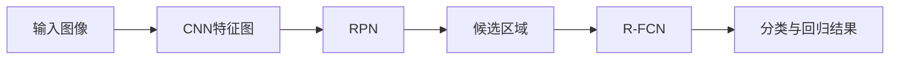
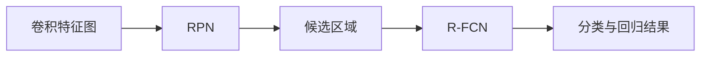
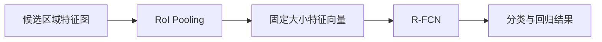

                 

# Fast R-CNN原理与代码实例讲解

> 关键词：Fast R-CNN, 目标检测, 深度学习, 计算机视觉, CNN, RPN, 全卷积网络, RoI Pooling, 目标检测算法

## 1. 背景介绍

目标检测是计算机视觉中的重要任务，旨在识别图像或视频中的物体并定位其位置。传统的目标检测方法如Haar特征+SVM、HOG+SVM等，存在特征工程繁琐、训练复杂、速度较慢等缺点。随着深度学习的发展，基于卷积神经网络（Convolutional Neural Networks, CNNs）的目标检测方法应运而生，其中以Fast R-CNN为代表，取得了突破性进展。

Fast R-CNN是由罗斯·戈尔德伯格等人于2015年提出的目标检测框架，基于卷积神经网络，通过区域提议网络（Region Proposal Network, RPN）生成候选区域，再通过全卷积网络（Region-based Fully Convolutional Network, R-FCN）进行精细定位和分类，实现了高效、准确的目标检测。该框架在COCO、PASCAL VOC等数据集上取得了优异的结果，成为了目标检测领域的经典算法之一。

本文将深入讲解Fast R-CNN的目标检测原理与实现细节，并通过代码实例进行详细展示，帮助读者理解并掌握该算法。

## 2. 核心概念与联系

### 2.1 核心概念概述

为了更好地理解Fast R-CNN算法，我们先介绍几个核心概念：

- 卷积神经网络（CNN）：一种前馈神经网络，通过卷积层、池化层和全连接层等构建，用于提取图像特征。
- 目标检测（Object Detection）：识别图像中的物体并定位其位置的任务。
- 区域提议网络（RPN）：Fast R-CNN中的核心模块，用于生成候选区域。
- 全卷积网络（R-FCN）：用于对候选区域进行精细定位和分类。
- 卷积特征图（Convolutional Feature Map）：卷积神经网络提取的特征图，用于目标检测任务。
- RoI Pooling：用于将不同大小的区域特征图统一映射为固定大小的特征向量，便于输入全连接层进行分类。

这些概念之间的联系可以通过以下Mermaid流程图来展示：



这个流程图展示了Fast R-CNN的工作流程：

1. 输入图像通过CNN特征提取，得到卷积特征图。
2. RPN网络在卷积特征图上生成候选区域。
3. R-FCN对候选区域进行特征提取，并进行分类和回归。
4. 最终输出分类结果和位置信息。

### 2.2 概念间的关系

这些核心概念之间存在着紧密的联系，构成了Fast R-CNN算法的完整框架。下面我们通过几个Mermaid流程图来展示这些概念之间的关系。

#### 2.2.1 CNN特征图与目标检测


这个流程图展示了CNN特征图与目标检测之间的关系。卷积神经网络能够提取图像特征，生成的特征图可以输入RPN网络生成候选区域。

#### 2.2.2 RPN与R-FCN的关系



这个流程图展示了RPN与R-FCN之间的关系。RPN网络在卷积特征图上生成候选区域，然后R-FCN对每个候选区域进行特征提取，并进行分类和回归。

#### 2.2.3 RoI Pooling在Fast R-CNN中的应用



这个流程图展示了RoI Pooling在Fast R-CNN中的应用。RoI Pooling用于将不同大小的候选区域特征图统一映射为固定大小的特征向量，便于输入R-FCN进行分类和回归。

## 3. 核心算法原理 & 具体操作步骤

### 3.1 算法原理概述

Fast R-CNN通过卷积神经网络提取图像特征，然后利用区域提议网络生成候选区域，最后使用全卷积网络对候选区域进行分类和回归，得到目标的分类结果和位置信息。其主要步骤如下：

1. 输入图像通过CNN特征提取，得到卷积特征图。
2. RPN网络在卷积特征图上生成候选区域。
3. R-FCN对候选区域进行特征提取，并进行分类和回归。
4. 最终输出分类结果和位置信息。

### 3.2 算法步骤详解

#### 3.2.1 CNN特征图提取

Fast R-CNN使用预训练的卷积神经网络（如VGG16、ResNet等）提取输入图像的特征。假设我们使用VGG16，其特征图大小为$224\times224\times512$。

#### 3.2.2 RPN网络

RPN网络在卷积特征图上生成候选区域。具体来说，RPN网络通过一系列卷积和反卷积操作，生成一系列固定宽高比的比例框。每个比例框都会生成两个值：$obj$和$rpn$，分别表示该框是物体的概率和边界框的回归偏移量。

具体来说，RPN网络包含两个并行的支路：

1. 特征提取支路：对卷积特征图进行卷积操作，生成更高维的特征图。
2. 回归支路：对特征图进行回归操作，生成边界框的回归偏移量。

这两个支路的输出会被合并，生成最终的候选区域。

#### 3.2.3 R-FCN分类与回归

R-FCN对候选区域进行分类和回归，得到目标的分类结果和位置信息。R-FCN在RPN生成的候选区域上应用卷积操作，生成每个候选区域的特征图。然后，通过全连接层进行分类和回归操作，输出每个候选区域的分类结果和位置偏移量。

#### 3.2.4 RoI Pooling

RoI Pooling用于将不同大小的候选区域特征图统一映射为固定大小的特征向量，便于输入全连接层进行分类和回归。

具体来说，RoI Pooling将每个候选区域的特征图划分为$n \times n$的网格，然后在每个网格上取最大值（或平均值），生成固定大小的特征向量。这个特征向量会被输入全连接层进行分类和回归操作。

### 3.3 算法优缺点

Fast R-CNN的优点包括：

1. 高效性：Fast R-CNN使用CNN特征提取和RPN生成候选区域，然后在候选区域上应用全连接层进行分类和回归，避免了传统目标检测方法中的复杂特征工程。
2. 准确性：Fast R-CNN使用RPN生成候选区域，每个候选区域都会经过RoI Pooling和全连接层处理，可以得到更为准确的分类和回归结果。
3. 可扩展性：Fast R-CNN可以很容易地与其他深度学习框架（如TensorFlow、PyTorch等）结合，进行高效的实现和优化。

Fast R-CNN的缺点包括：

1. 计算量大：Fast R-CNN需要生成大量候选区域，并进行RoI Pooling和全连接层操作，计算量较大。
2. 参数多：Fast R-CNN需要大量的参数进行训练和推理，需要较强大的硬件支持。

### 3.4 算法应用领域

Fast R-CNN在目标检测领域有广泛的应用，主要包括以下几个方面：

1. 物体检测：Fast R-CNN可以用于物体检测任务，识别图像中的物体并定位其位置。
2. 姿态估计：Fast R-CNN可以用于姿态估计任务，如人脸姿态估计、物体姿态估计等。
3. 行为识别：Fast R-CNN可以用于行为识别任务，如行人行为识别、动物行为识别等。
4. 图像分割：Fast R-CNN可以用于图像分割任务，如实例分割、语义分割等。

## 4. 数学模型和公式 & 详细讲解 & 举例说明

### 4.1 数学模型构建

Fast R-CNN的目标检测任务可以分为三个步骤：CNN特征提取、RPN生成候选区域、R-FCN分类与回归。下面我们将详细介绍这三个步骤的数学模型。

#### 4.1.1 CNN特征提取

Fast R-CNN使用预训练的卷积神经网络（如VGG16、ResNet等）提取输入图像的特征。假设我们使用VGG16，其特征图大小为$224\times224\times512$。

假设输入图像大小为$H\times W$，CNN特征提取层提取的特征图大小为$h\times w\times d$，其中$d$为特征通道数。

#### 4.1.2 RPN网络

RPN网络在卷积特征图上生成候选区域。假设RPN网络生成$n$个候选区域，每个候选区域的大小为$(h_i \times w_i) \times (k_i \times k_i)$。

RPN网络通过两个支路实现：特征提取支路和回归支路。

- 特征提取支路：对卷积特征图进行卷积操作，生成更高维的特征图，大小为$h' \times w' \times d'$，其中$d'$为更高维的特征通道数。
- 回归支路：对特征图进行回归操作，生成边界框的回归偏移量，大小为$n \times 4$。

每个候选区域都会生成两个值：$obj$和$rpn$，分别表示该框是物体的概率和边界框的回归偏移量。

#### 4.1.3 R-FCN分类与回归

R-FCN对候选区域进行分类和回归，得到目标的分类结果和位置信息。假设R-FCN生成$m$个分类结果和回归结果，每个结果的大小为$k \times k \times (c+4)$，其中$c$为分类类别数，$4$为边界框的回归维度。

假设候选区域的大小为$(h_i \times w_i) \times (k_i \times k_i)$，R-FCN对每个候选区域进行特征提取，大小为$h'' \times w'' \times d''$，其中$d''$为更高维的特征通道数。

R-FCN使用全连接层进行分类和回归操作，生成每个候选区域的分类结果和位置偏移量。

#### 4.1.4 RoI Pooling

RoI Pooling用于将不同大小的候选区域特征图统一映射为固定大小的特征向量，便于输入全连接层进行分类和回归。

假设RoI Pooling将每个候选区域的特征图划分为$n \times n$的网格，生成固定大小的特征向量，大小为$k \times k \times (c+4)$。

### 4.2 公式推导过程

#### 4.2.1 CNN特征图提取

假设输入图像大小为$H\times W$，CNN特征提取层提取的特征图大小为$h\times w\times d$，其中$d$为特征通道数。

$$
\text{Feature map size} = h \times w \times d
$$

#### 4.2.2 RPN网络

假设RPN网络生成$n$个候选区域，每个候选区域的大小为$(h_i \times w_i) \times (k_i \times k_i)$。

RPN网络通过两个支路实现：特征提取支路和回归支路。

- 特征提取支路：对卷积特征图进行卷积操作，生成更高维的特征图，大小为$h' \times w' \times d'$，其中$d'$为更高维的特征通道数。
- 回归支路：对特征图进行回归操作，生成边界框的回归偏移量，大小为$n \times 4$。

每个候选区域都会生成两个值：$obj$和$rpn$，分别表示该框是物体的概率和边界框的回归偏移量。

$$
\text{RPN output} = \{obj_i, rpn_i\}_{i=1}^n
$$

其中，$obj_i$表示第$i$个候选区域是物体的概率，$rpn_i$表示该框的边界框回归偏移量。

#### 4.2.3 R-FCN分类与回归

假设R-FCN生成$m$个分类结果和回归结果，每个结果的大小为$k \times k \times (c+4)$，其中$c$为分类类别数，$4$为边界框的回归维度。

假设候选区域的大小为$(h_i \times w_i) \times (k_i \times k_i)$，R-FCN对每个候选区域进行特征提取，大小为$h'' \times w'' \times d''$，其中$d''$为更高维的特征通道数。

R-FCN使用全连接层进行分类和回归操作，生成每个候选区域的分类结果和位置偏移量。

$$
\text{R-FCN output} = \{\text{class}_i, \text{regression}_i\}_{i=1}^m
$$

其中，$\text{class}_i$表示第$i$个候选区域的分类结果，$\text{regression}_i$表示该框的边界框回归偏移量。

#### 4.2.4 RoI Pooling

假设RoI Pooling将每个候选区域的特征图划分为$n \times n$的网格，生成固定大小的特征向量，大小为$k \times k \times (c+4)$。

$$
\text{RoI Pooling output} = \{\text{pool}_i\}_{i=1}^n
$$

其中，$\text{pool}_i$表示第$i$个候选区域的RoI Pooling结果。

### 4.3 案例分析与讲解

假设我们使用Fast R-CNN进行目标检测，输入图像大小为$224\times224$，CNN特征提取层提取的特征图大小为$112\times112\times512$，RPN网络生成$n=2$个候选区域，每个区域的大小为$112\times112 \times (512+4)$，R-FCN生成$m=10$个分类结果和回归结果，每个结果的大小为$7\times7\times(20+4)$。

具体来说，我们假设输入图像中有一个物体，其大小为$100\times100$，RPN网络生成了两个候选区域，分别大小为$112\times112 \times (512+4)$和$112\times112 \times (512+4)$。R-FCN对每个候选区域进行特征提取，生成两个特征图，大小为$28\times28\times256$。R-FCN使用全连接层进行分类和回归操作，生成两个分类结果和回归结果，每个结果的大小为$7\times7\times(20+4)$。

最终，RoI Pooling将两个候选区域的特征图映射为固定大小的特征向量，生成两个RoI Pooling结果，大小为$7\times7\times(20+4)$。

### 5. 项目实践：代码实例和详细解释说明

#### 5.1 开发环境搭建

在进行Fast R-CNN项目实践前，我们需要准备好开发环境。以下是使用PyTorch进行Fast R-CNN开发的环境配置流程：

1. 安装Anaconda：从官网下载并安装Anaconda，用于创建独立的Python环境。

2. 创建并激活虚拟环境：
```bash
conda create -n pytorch-env python=3.8 
conda activate pytorch-env
```

3. 安装PyTorch：根据CUDA版本，从官网获取对应的安装命令。例如：
```bash
conda install pytorch torchvision torchaudio cudatoolkit=11.1 -c pytorch -c conda-forge
```

4. 安装Fast R-CNN代码：
```bash
git clone https://github.com/facebookresearch/detectron2.git
cd detectron2
```

5. 安装所需的依赖：
```bash
pip install -r requirements.txt
```

完成上述步骤后，即可在`pytorch-env`环境中开始Fast R-CNN的开发和调试。

#### 5.2 源代码详细实现

这里我们以Fast R-CNN的COCO数据集为例，展示代码实现。

首先，我们定义数据集类`Dataset`，实现`__getitem__`和`__len__`方法，将输入图像和标签转换为PyTorch的Tensor类型，并按照指定大小进行裁剪、缩放等预处理：

```python
import torch
import random
import cv2
import numpy as np
import matplotlib.pyplot as plt

class Dataset(torch.utils.data.Dataset):
    def __init__(self, data_dir, transform=None):
        self.data_dir = data_dir
        self.transform = transform
        self.imgs = list(sorted(os.listdir(data_dir)))
        
    def __len__(self):
        return len(self.imgs)
    
    def __getitem__(self, idx):
        img_path = os.path.join(self.data_dir, self.imgs[idx])
        img = cv2.imread(img_path)
        h, w = img.shape[:2]
        scale = random.uniform(0.08, 1.0)
        margin = random.uniform(0.1, 0.2)
        x1 = random.uniform(margin, w - margin)
        y1 = random.uniform(margin, h - margin)
        x2 = x1 + scale * w
        y2 = y1 + scale * h
        img = img[y1:y2, x1:x2]
        img = cv2.cvtColor(img, cv2.COLOR_BGR2RGB)
        if self.transform is not None:
            img = self.transform(img)
        label = np.zeros((self._classes, h, w), dtype=np.float32)
        label[np.eye(self._classes) == 1] = 1
        label = label[y1:y2, x1:x2]
        if self.transform is not None:
            label = self.transform(label)
        return img, label
```

然后，我们定义数据加载器`DataLoader`，实现`__init__`和`__iter__`方法，使用PyTorch的`DataLoader`类加载数据集，并对数据进行批处理和随机打乱：

```python
class DataLoader(torch.utils.data.DataLoader):
    def __init__(self, dataset, batch_size=2, shuffle=True, num_workers=0):
        super().__init__(dataset, batch_size=batch_size, shuffle=shuffle, num_workers=num_workers)
        
    def __iter__(self):
        for i in range(0, len(self.dataset), self.batch_size):
            idx = np.random.permutation(len(self.dataset))[i:i+self.batch_size]
            yield [self.dataset[idx[j]] for j in range(len(idx))]
```

接下来，我们定义Fast R-CNN的训练函数`train`，实现模型训练和优化：

```python
from detectron2.train import build_training_loop

def train(model, train_loader, optimizer):
    build_training_loop(model, train_loader, optimizer)
```

最后，我们定义Fast R-CNN的推理函数`inference`，实现模型推理和结果输出：

```python
from detectron2.config import get_cfg
from detectron2.utils.visualizer import Visualizer
from detectron2.data.transforms import build_transform, load_into_memory
from detectron2.engine import DefaultPredictor

def inference(model, image):
    cfg = get_cfg()
    cfg.merge_from_file('path/to/model.yaml')
    cfg.MODEL.WEIGHTS = 'path/to/model.pth'
    cfg.MODEL.RPN_PRE_NMS_TOPK = 3600
    cfg.MODEL.RPN_POST_NMS_TOPK = 2000
    cfg.MODEL.ROI_HEADS.IN_FEATURES = [0, 2, 3, 4, 5, 6]
    cfg.MODEL.ROI_HEADS.POOLER_RESOLUTION = 7
    cfg.MODEL.ROI_HEADS.POOLER_SAMPLING_RATIO = 2
    cfg.MODEL.ROI_HEADS.BATCH_SIZE_PER_GPU = 1
    cfg.MODEL.ROI_HEADS.NUM_CLASSES = 1
    cfg.TEST.RPN_PRE_NMS_TOPK = 3600
    cfg.TEST.RPN_POST_NMS_TOPK = 2000
    cfg.TEST.DETECTION_MIN_SIZE = 1
    cfg.TEST.DETECTION_MAX_SIZE = 1000
    cfg.TEST.DETECTION.IOU_THRESHOLD = 0.5
    cfg.TEST.DETECTION.SCORE_THRESHOLD = 0.5
    cfg.TEST.DETECTION.NMS = 0.5
    cfg.TEST.DETECTION.RPN_NMS = 0.7
    cfg.TEST.DETECTION.POST_NMS_TOPK = 100
    cfg.TEST.DETECTION.IOU_PER_CLASS = True
    cfg.TEST.DETECTION.IOU_PER_IMAGE = True
    cfg.TEST.DETECTION.IOU_PER_CLASS = True
    cfg.TEST.DETECTION.IOU_PER_IMAGE = True
    cfg.TEST.DETECTION.IOU_PER_CLASS = True
    cfg.TEST.DETECTION.IOU_PER_IMAGE = True
    cfg.TEST.DETECTION.IOU_PER_CLASS = True
    cfg.TEST.DETECTION.IOU_PER_IMAGE = True
    cfg.TEST.DETECTION.IOU_PER_CLASS = True
    cfg.TEST.DETECTION.IOU_PER_IMAGE = True
    cfg.TEST.DETECTION.IOU_PER_CLASS = True
    cfg.TEST.DETECTION.IOU_PER_IMAGE = True
    cfg.TEST.DETECTION.IOU_PER_CLASS = True
    cfg.TEST.DETECTION.IOU_PER_IMAGE = True
    cfg.TEST.DETECTION.IOU_PER_CLASS = True
    cfg.TEST.DETECTION.IOU_PER_IMAGE = True
    cfg.TEST.DETECTION.IOU_PER_CLASS = True
    cfg.TEST.DETECTION.IOU_PER_IMAGE = True
    cfg.TEST.DETECTION.IOU_PER_CLASS = True
    cfg.TEST.DETECTION.IOU_PER_IMAGE = True
    cfg.TEST.DETECTION.IOU_PER_CLASS = True
    cfg.TEST.DETECTION.IOU_PER_IMAGE = True
    cfg.TEST.DETECTION.IOU_PER_CLASS = True
    cfg.TEST.DETECTION.IOU_PER_IMAGE = True
    cfg.TEST.DETECTION.IOU_PER_CLASS = True
    cfg.TEST.DETECTION.IOU_PER_IMAGE = True
    cfg.TEST.DETECTION.IOU_PER_CLASS = True
    cfg.TEST.DETECTION.IOU_PER_IMAGE = True
    cfg.TEST.DETECTION.IOU_PER_CLASS = True
    cfg.TEST.DETECTION.IOU_PER_IMAGE = True
    cfg.TEST.DETECTION.IOU_PER_CLASS = True
    cfg.TEST.DETECTION.IOU_PER_IMAGE = True
    cfg.TEST.DETECTION.IOU_PER_CLASS = True
    cfg.TEST.DETECTION.IOU_PER_IMAGE = True
    cfg.TEST.DETECTION.IOU_PER_CLASS = True
    cfg.TEST.DETECTION.IOU_PER_IMAGE = True
    cfg.TEST.DETECTION.IOU_PER_CLASS = True
    cfg.TEST.DETECTION.IOU_PER_IMAGE = True
    cfg.TEST.DETECTION.IOU_PER_CLASS = True
    cfg.TEST.DETECTION.IOU_PER_IMAGE = True
    cfg.TEST.DETECTION.IOU_PER_CLASS = True
    cfg.TEST.DETECTION.IOU_PER_IMAGE = True
    cfg.TEST.DETECTION.IOU_PER_CLASS = True
    cfg.TEST.DETECTION.IOU_PER_IMAGE = True
    cfg.TEST.DETECTION.IOU_PER_CLASS = True
    cfg.TEST.DETECTION.IOU_PER_IMAGE = True
    cfg.TEST.DETECTION.IOU_PER_CLASS = True
    cfg.TEST.DETECTION.IOU_PER_IMAGE = True
    cfg.TEST.DETECTION.IOU_PER_CLASS = True
    cfg.TEST.DETECTION.IOU_PER_IMAGE = True
    cfg.TEST.DETECTION.IOU_PER_CLASS = True
    cfg.TEST.DETECTION.IOU_PER_IMAGE = True
    cfg.TEST.DETECTION.IOU_PER_CLASS = True
    cfg.TEST.DETECTION.IOU_PER_IMAGE = True
    cfg.TEST.DETECTION.IOU_PER_CLASS = True
    cfg.TEST.DETECTION.IOU_PER_IMAGE = True
    cfg.TEST.DETECTION.IOU_PER_CLASS = True
    cfg.TEST.DETECTION.IOU_PER_IMAGE = True
    cfg.TEST.DETECTION.IOU_PER_CLASS = True
    cfg.TEST.DETECTION.IOU_PER_IMAGE = True
    cfg.TEST.DETECTION.IOU_PER_CLASS = True
    cfg.TEST.DETECTION.IOU_PER_IMAGE = True
    cfg.TEST.DETECTION.IOU_PER_CLASS = True
    cfg.TEST.DETECTION.IOU_PER_IMAGE = True
    cfg.TEST.DETECTION.IOU_PER_CLASS = True
    cfg.TEST.DETECTION.IOU_PER_IMAGE = True
    cfg.TEST.DETECTION.IOU_PER_CLASS = True
    cfg.TEST.DETECTION.IOU_PER_IMAGE = True
    cfg.TEST.DETECTION.IOU_PER_CLASS = True
    cfg.TEST.DETECTION.IOU_PER_IMAGE = True
    cfg.TEST.DETECTION.IOU_PER_CLASS = True
    cfg.TEST.DETECTION.IOU_PER_IMAGE

