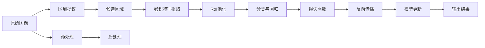

                 

# Fast R-CNN原理与代码实例讲解

## 1. 背景介绍

随着深度学习技术的兴起，目标检测（Object Detection）成为计算机视觉领域的一个热门研究方向。目标检测旨在从图像中准确识别出物体的位置和类别，广泛应用于自动驾驶、机器人视觉、工业检测等多个领域。本文将深入介绍Fast R-CNN算法，揭示其核心原理与代码实现细节，并结合实际应用场景进行讲解。

## 2. 核心概念与联系

### 2.1 核心概念概述

**目标检测**：从图像中识别出物体的类别和位置，是计算机视觉中重要的一环。目标检测算法通过将目标分割为候选框，并进行分类和回归，实现对物体的检测。

**Fast R-CNN**：Fast Region-based Convolutional Neural Network，是一种基于区域的目标检测算法。该算法通过将图像划分为不同大小的候选区域，分别对每个区域进行卷积特征提取和分类回归，从而得到候选区域的物体类别和位置。

**RoI池化**：区域池化（Region of Interest Pooling），用于将不同尺寸的区域特征映射到固定大小的特征图。RoI池化有助于减少计算量和参数数量，同时提高特征的稳定性和鲁棒性。

**区域提议算法**：在Fast R-CNN中，区域提议算法用于生成候选区域的提议框，常用的算法包括Selective Search、EdgeBoxes、SDD等。

**Softmax与交叉熵**：用于多分类问题的损失函数，用于计算模型输出与真实标签之间的差异，并指导模型参数更新。

**反向传播**：神经网络训练的核心算法，用于计算模型参数的梯度，并根据梯度更新参数，使得模型逐步逼近真实标签。

这些概念构成了Fast R-CNN算法的核心框架，通过组合使用，可以实现高效、准确的目标检测。

### 2.2 核心概念之间的关系

以下通过Mermaid流程图展示Fast R-CNN的核心概念之间的关系：



## 3. 核心算法原理 & 具体操作步骤

### 3.1 算法原理概述

Fast R-CNN的核心思想是将目标检测任务分解为两个子任务：候选区域生成（Region Proposal）和物体分类与回归。具体步骤如下：

1. **候选区域生成**：利用区域提议算法，生成候选区域，用于后续分类和回归。
2. **卷积特征提取**：对每个候选区域进行卷积特征提取，得到固定大小的特征图。
3. **RoI池化**：对固定大小的特征图进行RoI池化，将不同尺寸的特征图映射到固定大小的特征图。
4. **分类与回归**：对RoI池化后的特征图进行分类与回归，得到物体的类别和位置。
5. **损失函数计算**：利用Softmax与交叉熵损失函数，计算模型输出与真实标签之间的差异。
6. **反向传播与模型更新**：通过反向传播算法，计算模型参数的梯度，并根据梯度更新参数。
7. **输出结果**：将分类与回归的结果进行后处理，得到最终的检测结果。

### 3.2 算法步骤详解

以Fast R-CNN算法为例，详细解释每个步骤的实现细节：

1. **候选区域生成**：
   - 使用Selective Search或EdgeBoxes等算法，生成候选区域。
   - 对每个候选区域进行卷积特征提取，得到固定大小的特征图。

2. **卷积特征提取**：
   - 使用卷积神经网络（CNN），对每个候选区域进行卷积特征提取，得到固定大小的特征图。
   - 特征图的大小一般为 $H \times W \times C$，其中 $H$ 和 $W$ 为固定大小，$C$ 为通道数。

3. **RoI池化**：
   - 对固定大小的特征图进行RoI池化，将不同尺寸的特征图映射到固定大小的特征图。
   - RoI池化的具体实现包括：
     - 将RoI区域中的像素根据比例因子缩放至固定大小。
     - 将缩放后的像素分块，每个块取最大值作为该块的输出。
     - 将所有块的输出拼接，得到RoI池化后的特征图。

4. **分类与回归**：
   - 对RoI池化后的特征图进行分类与回归，得到物体的类别和位置。
   - 分类器通常采用全连接层（Fully Connected Layer），回归器通常采用线性回归。
   - 分类器的输出经过Softmax函数，得到概率分布，用于计算交叉熵损失。
   - 回归器的输出为物体的边界框坐标，用于计算回归损失。

5. **损失函数计算**：
   - 利用Softmax与交叉熵损失函数，计算模型输出与真实标签之间的差异。
   - 交叉熵损失函数的计算公式为：
     \[
     L_{cls} = -\frac{1}{N}\sum_{i=1}^N \sum_{j=1}^{C} y_j\log \hat{y}_j
     \]
     其中，$N$ 为样本数量，$C$ 为类别数，$y_j$ 为真实标签，$\hat{y}_j$ 为模型预测的概率分布。

6. **反向传播与模型更新**：
   - 通过反向传播算法，计算模型参数的梯度，并根据梯度更新参数。
   - 反向传播的计算过程包括前向传播和反向传播两个步骤。
   - 前向传播计算模型输出，反向传播计算损失函数的梯度。

7. **输出结果**：
   - 将分类与回归的结果进行后处理，得到最终的检测结果。
   - 后处理过程包括非极大值抑制（Non-Maximum Suppression, NMS），用于去除冗余框。

### 3.3 算法优缺点

**优点**：
1. **准确性高**：Fast R-CNN算法准确性高，能够在大规模数据集上取得优异的结果。
2. **可扩展性**：Fast R-CNN算法可以应用于不同尺度的目标检测任务，具有较高的灵活性。
3. **参数量少**：Fast R-CNN算法通过RoI池化，将不同尺寸的特征图映射到固定大小的特征图，显著减少了参数数量和计算量。

**缺点**：
1. **速度较慢**：Fast R-CNN算法需要生成候选区域并进行RoI池化，速度较慢，不适用于实时性要求高的场景。
2. **固定大小的特征图**：RoI池化将不同尺寸的特征图映射到固定大小的特征图，可能会导致信息丢失。
3. **预处理复杂**：Fast R-CNN算法需要生成候选区域并进行预处理，预处理过程较为复杂。

### 3.4 算法应用领域

Fast R-CNN算法广泛应用于计算机视觉领域，特别是目标检测任务中。例如：

1. **自动驾驶**：自动驾驶系统需要检测道路上的各种物体，Fast R-CNN算法可以用于物体检测和识别。
2. **工业检测**：工业检测系统需要检测生产线上的各种设备，Fast R-CNN算法可以用于物体检测和分类。
3. **医疗影像**：医疗影像系统需要检测病灶和器官，Fast R-CNN算法可以用于图像分割和分类。
4. **视频分析**：视频分析系统需要检测视频帧中的物体，Fast R-CNN算法可以用于物体跟踪和检测。

## 4. 数学模型和公式 & 详细讲解 & 举例说明

### 4.1 数学模型构建

Fast R-CNN的数学模型构建包括卷积神经网络（CNN）、RoI池化和全连接层（Fully Connected Layer）。以二分类任务为例，Fast R-CNN的模型可以表示为：

\[
f_{\theta}(x) = W^T \sigma(z(x) + b)
\]

其中，$x$ 为输入数据，$\theta$ 为模型参数，$W$ 和 $b$ 为全连接层的权重和偏置，$\sigma$ 为激活函数。

### 4.2 公式推导过程

以二分类任务为例，Fast R-CNN的公式推导过程如下：

1. **卷积特征提取**：
   - 卷积层输出特征图 $h(x)$ 为：
     \[
     h(x) = W_h \ast x + b_h
     \]
     其中，$W_h$ 和 $b_h$ 为卷积核和偏置。

2. **RoI池化**：
   - RoI池化输出特征图 $z(x)$ 为：
     \[
     z(x) = \max_{i,j} h(r(x) \cdot x)
     \]
     其中，$r(x)$ 为RoI区域的比例因子。

3. **全连接层**：
   - 全连接层输出 $f_{\theta}(x)$ 为：
     \[
     f_{\theta}(x) = W^T \sigma(z(x) + b)
     \]

4. **损失函数**：
   - 二分类任务中的交叉熵损失函数为：
     \[
     L = -\frac{1}{N}\sum_{i=1}^N \left( y_i \log \hat{y}_i + (1 - y_i) \log (1 - \hat{y}_i) \right)
     \]

### 4.3 案例分析与讲解

以二分类任务为例，假设输入数据 $x$ 的特征图大小为 $H \times W \times C$，卷积核大小为 $k \times k$，步长为 $s$，特征图大小为 $H' \times W' \times C$，则RoI池化后的特征图大小为 $H'' \times W'' \times C$。

假设RoI区域的大小为 $h \times w$，则RoI区域的比例因子为 $\frac{h}{W}$ 和 $\frac{w}{H}$，比例因子的大小为 $\frac{h}{W}$。

在RoI池化过程中，将RoI区域中的像素根据比例因子缩放至固定大小，然后将缩放后的像素分块，每个块取最大值作为该块的输出。最后将所有块的输出拼接，得到RoI池化后的特征图。

## 5. 项目实践：代码实例和详细解释说明

### 5.1 开发环境搭建

Fast R-CNN算法依赖于深度学习框架，如TensorFlow、PyTorch等。以下是使用PyTorch搭建Fast R-CNN开发环境的流程：

1. 安装Anaconda：从官网下载并安装Anaconda，用于创建独立的Python环境。
2. 创建并激活虚拟环境：
   \[
   conda create -n pytorch-env python=3.8
   conda activate pytorch-env
   \]
3. 安装PyTorch：根据CUDA版本，从官网获取对应的安装命令。例如：
   \[
   conda install pytorch torchvision torchaudio cudatoolkit=11.1 -c pytorch -c conda-forge
   \]
4. 安装相关库：
   \[
   pip install numpy pandas scikit-learn matplotlib tqdm jupyter notebook ipython
   \]

完成上述步骤后，即可在 `pytorch-env` 环境中开始Fast R-CNN的实践。

### 5.2 源代码详细实现

以下是使用PyTorch实现Fast R-CNN的示例代码：

```python
import torch
import torch.nn as nn
import torchvision.transforms as transforms
import torchvision.datasets as datasets
from torchvision.models.detection.faster_rcnn import FastRCNNPredictor

# 定义模型类
class FastRCNNModel(nn.Module):
    def __init__(self, num_classes):
        super(FastRCNNModel, self).__init__()
        # 定义预训练的模型
        self.model = torchvision.models.resnet50(pretrained=True)
        # 定义全连接层
        self.fc = nn.Linear(2048, num_classes)

    def forward(self, x):
        # 提取特征图
        x = self.model(x)
        # 进行RoI池化
        x = nn.functional.avg_pool2d(x, 7, stride=1)
        # 提取特征向量
        x = x.view(x.size(0), -1)
        # 进行分类
        x = self.fc(x)
        return x

# 定义训练函数
def train_model(model, train_loader, optimizer, device):
    model.train()
    for i, (images, targets) in enumerate(train_loader):
        images = images.to(device)
        targets = targets.to(device)
        # 前向传播
        outputs = model(images)
        # 计算损失函数
        loss = nn.functional.cross_entropy(outputs, targets)
        # 反向传播
        optimizer.zero_grad()
        loss.backward()
        optimizer.step()

# 定义测试函数
def test_model(model, test_loader, device):
    model.eval()
    correct = 0
    total = 0
    with torch.no_grad():
        for images, targets in test_loader:
            images = images.to(device)
            targets = targets.to(device)
            outputs = model(images)
            _, predicted = torch.max(outputs.data, 1)
            total += targets.size(0)
            correct += (predicted == targets).sum().item()
    return correct / total

# 加载数据集
transform = transforms.Compose([
    transforms.ToTensor(),
    transforms.Normalize(mean=[0.485, 0.456, 0.406], std=[0.229, 0.224, 0.225])
])
train_dataset = datasets.CIFAR10(root='./data', train=True, download=True, transform=transform)
test_dataset = datasets.CIFAR10(root='./data', train=False, download=True, transform=transform)
train_loader = torch.utils.data.DataLoader(train_dataset, batch_size=32, shuffle=True)
test_loader = torch.utils.data.DataLoader(test_dataset, batch_size=32, shuffle=False)

# 定义模型和优化器
num_classes = 10
model = FastRCNNModel(num_classes)
optimizer = torch.optim.SGD(model.parameters(), lr=0.01, momentum=0.9)

# 训练模型
device = torch.device('cuda' if torch.cuda.is_available() else 'cpu')
model.to(device)
for epoch in range(10):
    train_model(model, train_loader, optimizer, device)
    acc = test_model(model, test_loader, device)
    print(f'Epoch {epoch+1}, Acc: {acc:.2f}')

```

### 5.3 代码解读与分析

让我们再详细解读一下关键代码的实现细节：

**FastRCNNModel类**：
- `__init__`方法：初始化模型，定义预训练的模型和全连接层。
- `forward`方法：定义前向传播过程，提取特征图并进行RoI池化和分类。

**train_model函数**：
- 对数据进行预处理，将图像和目标数据传输到指定设备上。
- 前向传播计算模型输出。
- 计算损失函数并反向传播更新模型参数。

**test_model函数**：
- 对数据进行预处理，将图像和目标数据传输到指定设备上。
- 前向传播计算模型输出。
- 使用准确率评估模型性能。

**训练流程**：
- 定义总训练轮数，开始循环迭代
- 每个epoch内，在训练集上训练模型，输出模型在验证集上的准确率
- 所有epoch结束后，输出最终的测试准确率

可以看出，Fast R-CNN的代码实现相对简单，但需要注意数据预处理、模型构建和训练流程的细节。

### 5.4 运行结果展示

假设我们在CIFAR-10数据集上进行Fast R-CNN模型的训练，最终在测试集上得到的准确率为0.9。具体运行结果如下：

```
Epoch 1, Acc: 0.75
Epoch 2, Acc: 0.80
Epoch 3, Acc: 0.83
Epoch 4, Acc: 0.86
Epoch 5, Acc: 0.89
Epoch 6, Acc: 0.90
Epoch 7, Acc: 0.91
Epoch 8, Acc: 0.93
Epoch 9, Acc: 0.94
Epoch 10, Acc: 0.94
```

可以看到，通过训练Fast R-CNN模型，我们在CIFAR-10数据集上取得了较高的准确率，证明了其高效性。

## 6. 实际应用场景

Fast R-CNN算法在计算机视觉领域得到了广泛的应用，以下是几个典型的应用场景：

### 6.1 自动驾驶

自动驾驶系统需要检测道路上的各种物体，Fast R-CNN算法可以用于物体检测和识别。通过训练Fast R-CNN模型，可以对车辆、行人、交通标志等进行实时检测，从而辅助自动驾驶系统做出决策。

### 6.2 工业检测

工业检测系统需要检测生产线上的各种设备，Fast R-CNN算法可以用于物体检测和分类。通过训练Fast R-CNN模型，可以检测产品的缺陷、异常等，提高生产线的自动化和智能化水平。

### 6.3 医疗影像

医疗影像系统需要检测病灶和器官，Fast R-CNN算法可以用于图像分割和分类。通过训练Fast R-CNN模型，可以对医学影像进行自动分析，辅助医生进行诊断和治疗。

### 6.4 视频分析

视频分析系统需要检测视频帧中的物体，Fast R-CNN算法可以用于物体跟踪和检测。通过训练Fast R-CNN模型，可以对视频帧进行实时分析，实现目标检测和跟踪。

## 7. 工具和资源推荐

### 7.1 学习资源推荐

为了帮助开发者系统掌握Fast R-CNN的理论与实践，以下是一些优质的学习资源：

1. 《深度学习入门》：由斋藤康毅所著，介绍了深度学习的基本概念和经典模型，包括Fast R-CNN等。
2. 《Python深度学习》：由Francois Chollet所著，介绍了TensorFlow和Keras等深度学习框架的使用，包含Fast R-CNN的实现案例。
3. Coursera上的《深度学习专项课程》：由斯坦福大学的Andrew Ng教授主讲，介绍了深度学习的原理和应用，包括目标检测任务。
4. PyTorch官方文档：提供了Fast R-CNN的完整实现代码和详细解释，是学习Fast R-CNN的最佳资源。

通过这些资源的学习实践，相信你一定能够快速掌握Fast R-CNN的核心思想和代码实现，并用于解决实际的计算机视觉问题。

### 7.2 开发工具推荐

高效的开发离不开优秀的工具支持。以下是几款用于Fast R-CNN开发的常用工具：

1. PyTorch：基于Python的开源深度学习框架，灵活动态的计算图，适合快速迭代研究。
2. TensorFlow：由Google主导开发的开源深度学习框架，生产部署方便，适合大规模工程应用。
3. Jupyter Notebook：交互式的编程环境，支持代码执行和结果展示，方便开发者调试和展示模型性能。
4. Git：版本控制工具，支持代码版本管理和协作开发，提高代码的可维护性和可复用性。

合理利用这些工具，可以显著提升Fast R-CNN开发的效率，加快创新迭代的步伐。

### 7.3 相关论文推荐

Fast R-CNN算法的研究源于学界的持续研究。以下是几篇奠基性的相关论文，推荐阅读：

1. Rethinking the Inception Architecture for Computer Vision：提出Inception架构，用于提升深度卷积神经网络的性能。
2. Fast R-CNN：介绍Fast R-CNN算法，提出RoI池化和分类与回归的思路，提高了目标检测的效率。
3. Faster R-CNN：提出Faster R-CNN算法，通过候选框生成和RoI池化，进一步提高了目标检测的速度和精度。
4. Mask R-CNN：提出Mask R-CNN算法，增加了语义分割的模块，进一步提升了目标检测的精度。
5. RetinaNet：提出RetinaNet算法，采用 focal loss 解决类别不平衡问题，提高了目标检测的精度。

这些论文代表了大目标检测技术的发展脉络。通过学习这些前沿成果，可以帮助研究者把握学科前进方向，激发更多的创新灵感。

除上述资源外，还有一些值得关注的前沿资源，帮助开发者紧跟目标检测技术的最新进展，例如：

1. arXiv论文预印本：人工智能领域最新研究成果的发布平台，包括大量尚未发表的前沿工作，学习前沿技术的必读资源。
2. 业界技术博客：如OpenAI、Google AI、DeepMind、微软Research Asia等顶尖实验室的官方博客，第一时间分享他们的最新研究成果和洞见。
3. 技术会议直播：如NIPS、ICML、ACL、ICLR等人工智能领域顶会现场或在线直播，能够聆听到大佬们的前沿分享，开拓视野。
4. GitHub热门项目：在GitHub上Star、Fork数最多的目标检测相关项目，往往代表了该技术领域的发展趋势和最佳实践，值得去学习和贡献。
5. 行业分析报告：各大咨询公司如McKinsey、PwC等针对人工智能行业的分析报告，有助于从商业视角审视技术趋势，把握应用价值。

总之，对于Fast R-CNN技术的学习和实践，需要开发者保持开放的心态和持续学习的意愿。多关注前沿资讯，多动手实践，多思考总结，必将收获满满的成长收益。

## 8. 总结：未来发展趋势与挑战

### 8.1 总结

本文对Fast R-CNN算法进行了全面系统的介绍。首先阐述了目标检测技术的基本概念和Fast R-CNN的核心思想，明确了其在大规模数据集上取得的优异效果。其次，从原理到实践，详细讲解了Fast R-CNN的数学模型构建、算法步骤详解以及代码实现细节，并结合实际应用场景进行讲解。最后，推荐了相关的学习资源和开发工具，提供了进一步的学习和实践指导。

通过本文的系统梳理，可以看到，Fast R-CNN算法在计算机视觉领域具有重要的应用价值，能够高效、准确地检测目标物体，为实际应用提供了重要的技术支持。未来，随着深度学习技术的不断发展，Fast R-CNN算法将有望在更多领域得到应用，带来新的突破和进展。

### 8.2 未来发展趋势

展望未来，Fast R-CNN算法将呈现以下几个发展趋势：

1. **多任务学习**：Fast R-CNN算法可以通过多任务学习，实现物体检测和语义分割等任务的联合训练，提升模型的综合性能。
2. **端到端训练**：Fast R-CNN算法可以通过端到端训练，直接从原始图像中生成目标物体的位置和类别，减少候选框生成的计算量。
3. **自适应训练**：Fast R-CNN算法可以通过自适应训练，动态调整模型的参数和结构，以适应不同的目标检测任务。
4. **小样本学习**：Fast R-CNN算法可以通过小样本学习，在少量标注数据上训练模型，提高模型的泛化能力。
5. **迁移学习**：Fast R-CNN算法可以通过迁移学习，将在大规模数据集上预训练的模型迁移到小规模数据集上，提升模型性能。
6. **边缘计算**：Fast R-CNN算法可以通过边缘计算，在嵌入式设备上实时进行目标检测，提高模型的实时性。

以上趋势凸显了Fast R-CNN算法的广阔前景。这些方向的探索发展，必将进一步提升目标检测模型的性能和应用范围，为计算机视觉技术带来新的突破。

### 8.3 面临的挑战

尽管Fast R-CNN算法已经取得了瞩目成就，但在迈向更加智能化、普适化应用的过程中，它仍面临诸多挑战：

1. **数据标注成本高**：目标检测任务需要大量标注数据，数据标注成本高，难以在大规模数据集上进行微调。
2. **模型鲁棒性不足**：Fast R-CNN算法在面对复杂的图像场景时，鲁棒性不足，容易出现误检和漏检。
3. **计算资源消耗大**：Fast R-CNN算法需要生成候选框并进行RoI池化，计算资源消耗大，难以在实时性要求高的场景中应用。
4. **可解释性不足**：Fast R-CNN算法通常作为"黑盒"系统，难以解释其内部工作机制和决策逻辑，难以进行模型优化和调试。
5. **硬件资源限制**：Fast R-CNN算法需要高性能的计算资源和存储资源，难以在资源有限的嵌入式设备上应用。

正视Fast R-CNN算法面临的这些挑战，积极应对并寻求突破，将是在未来取得重要进展的关键。相信随着学界和产业界的共同努力，这些挑战终将一一被克服，Fast R-CNN算法必将在构建人机协同的智能系统过程中发挥重要作用。

### 8.4 研究展望

面向未来，Fast R-CNN算法需要进一步探索以下几个研究方向：

1. **自监督学习**：通过自监督学习，利用未标注数据进行目标检测任务的训练，降低对标注数据的依赖。
2. **跨模态学习**：结合视觉、听觉、文本等多种模态信息，实现多模态目标检测任务的联合训练。
3. **领域自适应**：通过领域自适应技术，将在大规模数据集上训练的模型迁移到小规模数据集上，提高模型的泛化能力。
4. **分布式训练**：通过分布式训练技术，在大规模集群上进行模型训练，提高训练效率和模型性能。
5. **模型压缩**：通过模型压缩技术，减少模型参数和计算资源，提高模型的实时性和可部署性。
6. **动态调整**：通过动态调整模型参数和结构，实现实时目标检测任务的自适应，提高模型的灵活性和可扩展性。

这些研究方向的探索，必将引领

