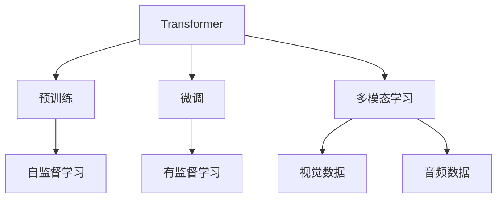
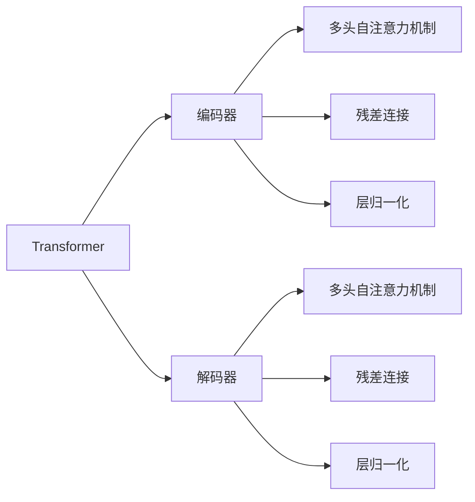
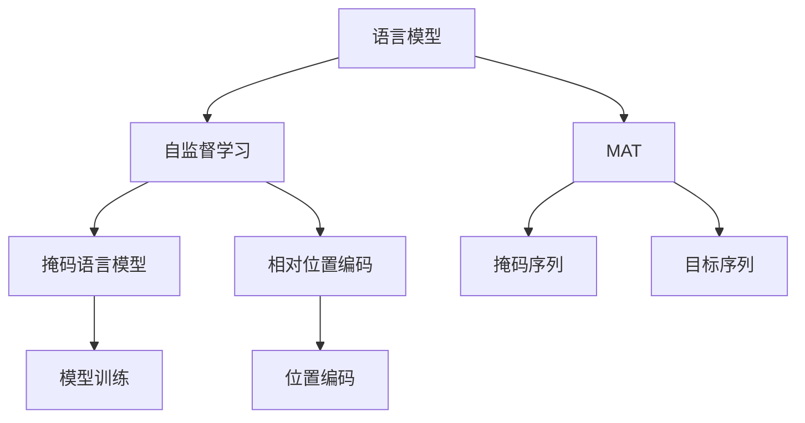
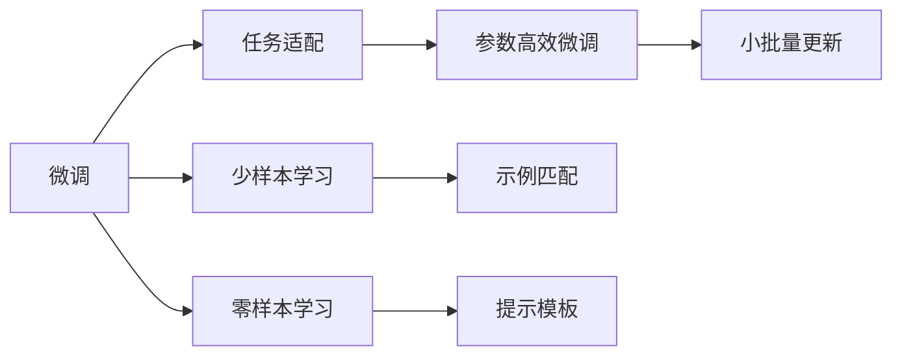

                 

# GPT-4原理与代码实例讲解

> 关键词：GPT-4,深度学习,自然语言处理(NLP),语言模型,Transformer,预训练,微调,大模型

## 1. 背景介绍

### 1.1 问题由来
近年来，深度学习技术在自然语言处理(NLP)领域取得了巨大的进展。尤其是基于Transformer架构的预训练语言模型，如GPT-2、GPT-3，通过在大规模无标签文本语料上进行预训练，学习到了丰富的语言知识和常识，使得模型在各种NLP任务上表现优异。然而，GPT-3模型尽管拥有1750亿参数，但在推理速度、可扩展性等方面仍存在较大的挑战，影响了其在实际应用中的部署和性能。

GPT-4作为GPT系列的最新一员，继承了GPT系列的优点，并在此基础上进行了多项改进和优化。本文将详细介绍GPT-4的原理和核心技术，并通过代码实例讲解其实现细节，帮助读者深入理解GPT-4的工作机制和应用潜力。

### 1.2 问题核心关键点
GPT-4的核心在于其使用了更高效的Transformer架构，并结合了多种先进技术，使得模型在推理速度、泛化能力、可扩展性等方面有了显著提升。本文将围绕以下几个关键点展开：

- GPT-4的Transformer架构特点
- GPT-4的预训练技术
- GPT-4的微调方法和技巧
- GPT-4在实际应用中的表现和优化

通过详细分析这些核心问题，能够帮助读者全面掌握GPT-4的工作原理和应用潜力。

## 2. 核心概念与联系

### 2.1 核心概念概述

为更好地理解GPT-4的工作原理，本节将介绍几个密切相关的核心概念：

- Transformer：一种基于注意力机制的神经网络架构，广泛应用于深度学习中的序列建模任务，如机器翻译、语音识别、NLP等。

- 预训练：指在大规模无标签文本语料上进行自监督学习，训练通用语言模型，使其能够学习到语言的通用表示。

- 微调：指在预训练模型的基础上，使用下游任务的少量标注数据，通过有监督学习优化模型在该任务上的性能。

- GPT-4：GPT-4是由OpenAI开发的新一代深度学习语言模型，继承了GPT系列的优点，并引入了多项改进，如提升推理速度、增强泛化能力、优化模型架构等。

- 多模态学习：GPT-4引入了视觉、音频等多模态数据，使得模型能够处理更加多样化的输入形式，提升其在多模态任务上的表现。

这些核心概念之间的逻辑关系可以通过以下Mermaid流程图来展示：



这个流程图展示了Transformer架构在预训练、微调和多模态学习中的作用和联系。预训练利用Transformer进行自监督学习，微调则在预训练的基础上进行有监督学习，多模态学习则拓展了Transformer的应用范围，使其能够处理视觉和音频等多种数据类型。

### 2.2 概念间的关系

这些核心概念之间存在着紧密的联系，形成了GPT-4的学习和应用框架。下面我们通过几个Mermaid流程图来展示这些概念之间的关系。

#### 2.2.1 GPT-4的Transformer架构



这个流程图展示了Transformer架构的核心组成部分。编码器和解码器通过多头自注意力机制和残差连接，进行信息的传递和更新。层归一化则用于控制梯度消失和爆炸问题，加速模型训练。

#### 2.2.2 GPT-4的预训练技术



这个流程图展示了GPT-4的预训练技术。语言模型通过掩码语言模型和相对位置编码进行自监督学习，逐步构建通用的语言表示。MAT（Mashup Attention Mechanism）则用于融合多种注意力机制，提高模型的泛化能力。

#### 2.2.3 GPT-4的微调方法和技巧



这个流程图展示了GPT-4的微调方法和技巧。微调通过任务适配、少样本学习、零样本学习等方法，在特定任务上进行优化。参数高效微调则通过冻结预训练参数，减少微调过程中不必要的计算和参数更新。

#### 2.2.4 多模态学习在GPT-4中的应用

```mermaid
graph TB
    A[多模态学习] --> B[视觉数据]
    A --> C[音频数据]
    B --> D[视觉编码器]
    B --> E[视觉嵌入]
    C --> F[音频编码器]
    C --> G[音频嵌入]
    D --> H[视觉特征]
    E --> I[视觉表示]
    F --> J[音频特征]
    G --> K[音频表示]
    H --> L[多模态嵌入]
    I --> M[多模态表示]
    J --> N[多模态特征]
    K --> O[多模态表示]
    L --> P[多模态解码器]
    M --> Q[多模态输出]
    N --> R[多模态表示]
    O --> S[多模态输出]
    P --> T[多模态训练]
    Q --> U[多模态输出]
    R --> V[多模态表示]
    S --> W[多模态输出]
    T --> X[多模态训练]
    U --> Y[多模态输出]
    V --> Z[多模态表示]
    W --> AA[多模态输出]
    X --> BB[多模态训练]
    Y --> CC[多模态输出]
    Z --> DD[多模态表示]
    AA --> EE[多模态输出]
    BB --> FF[多模态训练]
    CC --> GG[多模态输出]
    DD --> HH[多模态表示]
    EE --> II[多模态输出]
    FF --> JJ[多模态训练]
    GG --> KK[多模态输出]
    HH --> LL[多模态表示]
    II --> MM[多模态输出]
    JJ --> NN[多模态训练]
    KK --> OO[多模态输出]
    LL --> PP[多模态表示]
    MM --> QQ[多模态输出]
    NN --> RR[多模态训练]
    OO --> SS[多模态输出]
    PP --> TT[多模态训练]
    QQ --> UU[多模态输出]
    RR --> VV[多模态表示]
    SS --> WW[多模态输出]
    TT --> XX[多模态训练]
    UU --> YY[多模态输出]
    VV --> ZZ[多模态表示]
    WW --> AAA[多模态输出]
    XX --> BBB[多模态训练]
    YY --> CCC[多模态输出]
    ZZ --> DDD[多模态表示]
    AAA --> EEE[多模态输出]
    BBB --> FFF[多模态训练]
    CCB --> GGB[多模态输出]
    DDD --> HHH[多模态表示]
    EEE --> III[多模态输出]
    FFF --> JJJ[多模态训练]
    GGB --> KKC[多模态输出]
    HHH --> LLL[多模态表示]
    III --> MMC[多模态输出]
    JJJ --> NNN[多模态训练]
    KKC --> OOI[多模态输出]
    LLL --> PPC[多模态表示]
    MMC --> QQI[多模态输出]
    NNN --> RRC[多模态训练]
    OOI --> SSC[多模态输出]
    PPC --> TTD[多模态训练]
    QQI --> UUC[多模态输出]
    RRC --> VVV[多模态表示]
    SSC --> WWC[多模态输出]
    TTD --> XXX[多模态训练]
    UUC --> YYY[多模态输出]
    VVV --> ZZZ[多模态表示]
    WWC --> AAA[多模态输出]
    XXX --> BBB[多模态训练]
    YYY --> CCC[多模态输出]
    ZZZ --> DDD[多模态表示]
    AAA --> EEE[多模态输出]
    BBB --> FFF[多模态训练]
    CCC --> GGB[多模态输出]
    DDD --> HHH[多模态表示]
    EEE --> III[多模态输出]
    FFF --> JJJ[多模态训练]
    GGB --> KKC[多模态输出]
    HHH --> LLL[多模态表示]
    III --> MMC[多模态输出]
    JJJ --> NNN[多模态训练]
    KKC --> OOI[多模态输出]
    LLL --> PPC[多模态表示]
    MMC --> QQI[多模态输出]
    NNN --> RRC[多模态训练]
    OOI --> SSC[多模态输出]
    PPC --> TTD[多模态训练]
    QQI --> UUC[多模态输出]
    RRC --> VVV[多模态表示]
    SSC --> WWC[多模态输出]
    TTD --> XXX[多模态训练]
    UUC --> YYY[多模态输出]
    VVV --> ZZZ[多模态表示]
    WWC --> AAA[多模态输出]
    XXX --> BBB[多模态训练]
    YYY --> CCC[多模态输出]
    ZZZ --> DDD[多模态表示]
    AAA --> EEE[多模态输出]
    BBB --> FFF[多模态训练]
    CCC --> GGB[多模态输出]
    DDD --> HHH[多模态表示]
    EEE --> III[多模态输出]
    FFF --> JJJ[多模态训练]
    GGB --> KKC[多模态输出]
    HHH --> LLL[多模态表示]
    II

