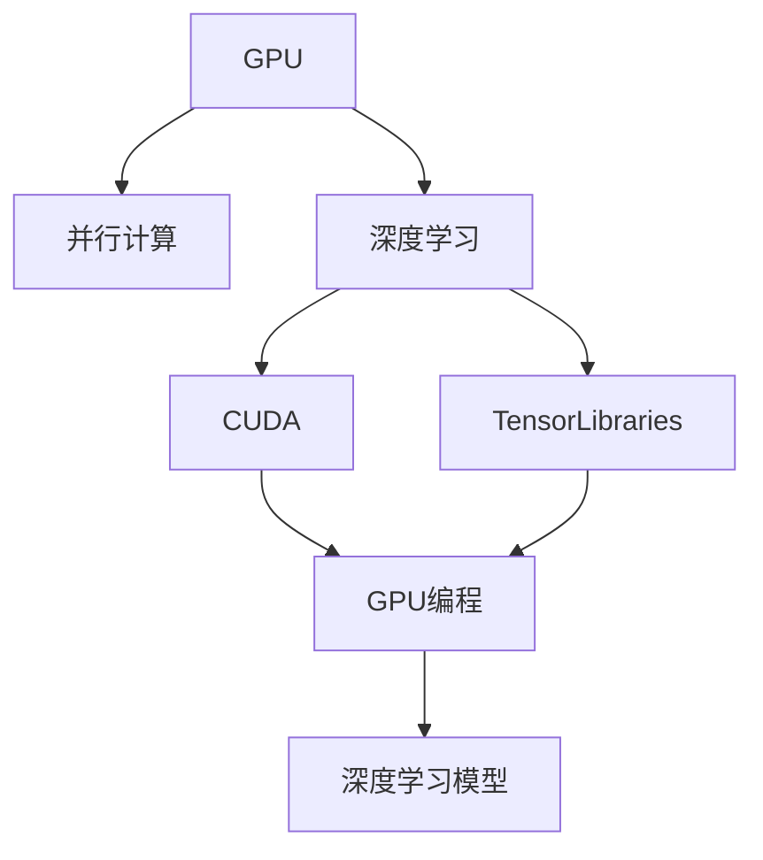
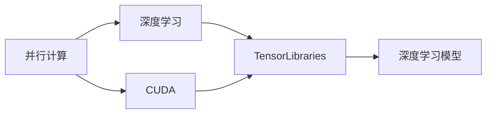
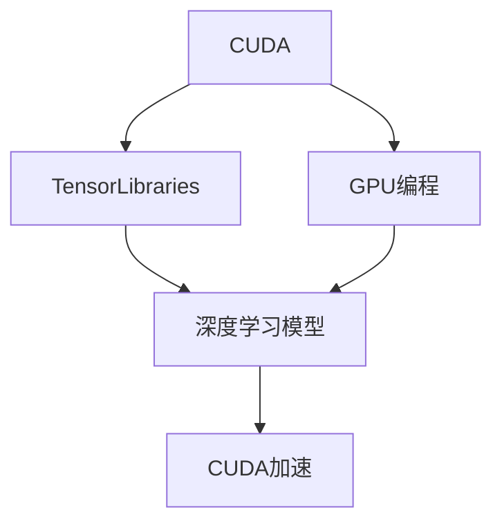
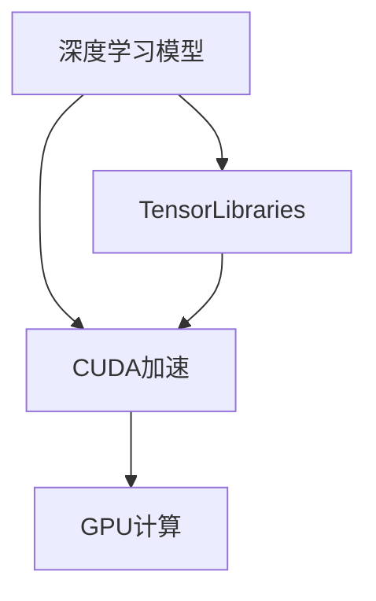
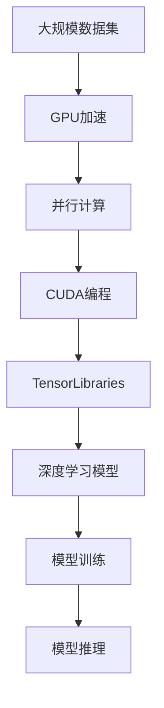

                 

# GPU在AI算力中的作用

## 1. 背景介绍

### 1.1 问题由来
随着人工智能(AI)技术的发展，AI算力需求日益增加。传统的CPU在处理大规模数据和复杂计算时，性能瓶颈日益突出。在此背景下，图形处理器(GPU)因其强大的并行计算能力，成为AI算力提升的重要手段。

### 1.2 问题核心关键点
GPU在AI算力中的作用主要体现在以下几个方面：
- GPU并行计算能力强大，能够处理大规模矩阵运算和复杂算法。
- 开源框架如TensorFlow和PyTorch支持GPU加速，可提高训练和推理效率。
- GPU的大规模内存带宽，适合存储和处理大规模数据集。
- 多核GPU并行运行，可显著提升模型训练速度。

这些优势使得GPU成为AI训练和推理的核心计算资源。在图像识别、自然语言处理、推荐系统等AI应用中，GPU已逐步成为标配。

### 1.3 问题研究意义
研究GPU在AI算力中的作用，对于AI技术的普及和应用具有重要意义：
- 提升计算效率。GPU的高并行处理能力可显著提升模型训练速度，缩短项目周期。
- 降低硬件成本。相比于定制硬件或超级计算机，GPU更具性价比，能够满足大部分AI应用的需求。
- 促进跨领域应用。GPU的广泛支持，使得AI技术在医疗、金融、自动驾驶等领域得到更广泛的应用。
- 推动产业化。GPU使得AI技术从学术界走向工业界，加速AI技术的商业化进程。

## 2. 核心概念与联系

### 2.1 核心概念概述

为更好地理解GPU在AI算力中的作用，本节将介绍几个密切相关的核心概念：

- 图形处理器(GPU)：专为图形渲染而设计，具备强大的并行计算能力。
- 并行计算(Parallel Computing)：通过同时处理多个计算任务，以提升计算效率。
- 深度学习(Deep Learning)：利用深度神经网络进行模式识别和预测，是AI技术的重要分支。
- CUDA：NVIDIA开发的并行计算平台和API，支持GPU编程。
- 张量库(TensorLibraries)：如TensorFlow、PyTorch等，是深度学习的核心计算框架。

这些核心概念之间的逻辑关系可以通过以下Mermaid流程图来展示：



这个流程图展示了GPU在AI算力中的核心作用：

1. GPU强大的并行计算能力，支撑深度学习的加速训练。
2. CUDA平台和TensorLibraries框架，使GPU编程变得容易，便于深度学习的实现。
3. 通过CUDA等工具，深度学习模型能够充分利用GPU的并行特性，进行高效计算。

### 2.2 概念间的关系

这些核心概念之间存在着紧密的联系，形成了GPU在AI算力中的完整生态系统。下面我通过几个Mermaid流程图来展示这些概念之间的关系。

#### 2.2.1 并行计算与深度学习的联系



这个流程图展示了并行计算与深度学习的内在联系：

1. 并行计算平台CUDA，提供底层硬件支持和编程接口。
2. TensorLibraries框架，利用并行计算特性，实现高效的深度学习计算。
3. 深度学习模型，通过TensorLibraries框架，在GPU上并行执行，实现加速。

#### 2.2.2 CUDA与TensorLibraries的关系



这个流程图展示了CUDA与TensorLibraries的关系：

1. CUDA提供GPU编程的底层支持，使深度学习计算变得可能。
2. TensorLibraries框架，封装CUDA接口，使得深度学习开发者能够方便地进行GPU编程。
3. CUDA加速的深度学习模型，利用GPU的并行特性，实现高效计算。

#### 2.2.3 深度学习模型与GPU的关系



这个流程图展示了深度学习模型与GPU的关系：

1. 深度学习模型，通过TensorLibraries框架，利用CUDA平台进行GPU加速。
2. CUDA加速的深度学习计算，充分利用GPU的并行特性，实现高效训练和推理。
3. GPU计算平台，提供强大的并行处理能力，支撑深度学习模型的计算需求。

### 2.3 核心概念的整体架构

最后，我们用一个综合的流程图来展示这些核心概念在大规模AI计算中的整体架构：



这个综合流程图展示了GPU在大规模AI计算中的核心作用：

1. 大规模数据集，通过GPU加速，在并行计算平台CUDA上进行处理。
2. CUDA编程，实现深度学习模型的GPU并行计算。
3. TensorLibraries框架，提供高效的深度学习计算工具。
4. 深度学习模型，利用并行计算平台进行加速训练和推理。

通过这些流程图，我们可以更清晰地理解GPU在大规模AI计算中的作用机制，为后续深入讨论GPU加速深度学习提供基础。

## 3. 核心算法原理 & 具体操作步骤
### 3.1 算法原理概述

GPU在AI算力中的作用，主要体现在并行计算能力的利用上。通过并行计算，GPU可以同时处理大量的矩阵运算和复杂算法，显著提升计算效率。

深度学习模型的核心算法是矩阵乘法，其计算量通常是非常庞大的。GPU利用其多核并行特性，可以并行计算大量的矩阵乘法，使得模型训练和推理效率大幅提升。

### 3.2 算法步骤详解

GPU在AI算力中的操作步骤如下：

1. **数据准备**：将大规模数据集导入GPU内存，利用GPU的大内存带宽，提高数据加载速度。
2. **模型定义**：在TensorLibraries框架中定义深度学习模型，通过CUDA接口调用GPU计算资源。
3. **训练过程**：在GPU上并行计算模型，利用TensorLibraries提供的优化算法（如SGD、Adam等），进行梯度下降更新模型参数。
4. **模型推理**：在GPU上加速模型推理，将输入数据并行处理，输出预测结果。

具体实现步骤如下：

**Step 1: 数据准备**
- 将大规模数据集导入GPU内存，利用GPU的大内存带宽，提高数据加载速度。

**Step 2: 模型定义**
- 在TensorLibraries框架中定义深度学习模型，通过CUDA接口调用GPU计算资源。

**Step 3: 训练过程**
- 在GPU上并行计算模型，利用TensorLibraries提供的优化算法（如SGD、Adam等），进行梯度下降更新模型参数。

**Step 4: 模型推理**
- 在GPU上加速模型推理，将输入数据并行处理，输出预测结果。

### 3.3 算法优缺点

GPU在AI算力中的作用具有以下优点：
1. 强大的并行计算能力，能够高效处理大规模矩阵运算和复杂算法。
2. CUDA平台和TensorLibraries框架，使得GPU编程变得容易，便于深度学习的实现。
3. 大内存带宽，适合存储和处理大规模数据集。
4. 多核并行运行，显著提升模型训练速度。

同时，GPU在AI算力中也存在一些缺点：
1. 较高的功耗和冷却需求。大规模计算任务对GPU的能耗和冷却系统提出了较高要求。
2. 较高的成本。高端GPU价格较高，尤其是单张显卡和集群配置，成本较高。
3. 易受硬件限制。GPU的并行计算能力受限于硬件配置，如显存和带宽。

### 3.4 算法应用领域

GPU在AI算力中的作用，广泛适用于各类深度学习任务：

- 图像识别：如卷积神经网络（CNN），利用GPU强大的并行计算能力，提升图像识别的精度和速度。
- 自然语言处理：如Transformer模型，通过并行计算加速语言模型的训练和推理。
- 推荐系统：通过GPU加速，提升推荐算法的效率，优化用户体验。
- 自动驾驶：利用GPU进行图像和传感器数据的处理和分析，实现实时决策。
- 医疗影像：通过GPU加速图像处理和深度学习模型训练，提升医疗诊断的准确性。
- 金融预测：利用GPU加速大规模数据处理和机器学习模型训练，提升金融预测的准确性。

## 4. 数学模型和公式 & 详细讲解 & 举例说明

### 4.1 数学模型构建

在大规模数据集上训练深度学习模型，可以通过以下数学模型进行描述：

假设训练集为 $\mathcal{D} = \{(x_i, y_i)\}_{i=1}^N$，其中 $x_i$ 表示输入，$y_i$ 表示标签。深度学习模型的目标函数为：

$$
\mathcal{L}(\theta) = \frac{1}{N}\sum_{i=1}^N \ell(y_i, f_\theta(x_i))
$$

其中 $\ell(y_i, f_\theta(x_i))$ 表示损失函数，$y_i$ 和 $f_\theta(x_i)$ 分别表示真实标签和模型预测结果。

为了最大化目标函数，模型通过梯度下降等优化算法进行训练：

$$
\theta \leftarrow \theta - \eta \nabla_{\theta}\mathcal{L}(\theta)
$$

其中 $\eta$ 为学习率，$\nabla_{\theta}\mathcal{L}(\theta)$ 为损失函数对模型参数的梯度。

### 4.2 公式推导过程

深度学习模型的训练过程，涉及到大量的矩阵运算和梯度计算。以下是具体的公式推导：

假设深度学习模型为 $f_\theta(x) = \sum_{i=1}^M W_i^T z_i + b_i$，其中 $z_i$ 表示中间层表示，$W_i$ 和 $b_i$ 分别为权重和偏置项。

根据链式法则，损失函数对模型参数的梯度可以递归计算为：

$$
\frac{\partial \mathcal{L}(\theta)}{\partial \theta} = \frac{\partial \mathcal{L}(\theta)}{\partial z_M} \frac{\partial z_M}{\partial W_M} \frac{\partial W_M}{\partial \theta} + \frac{\partial \mathcal{L}(\theta)}{\partial z_{M-1}} \frac{\partial z_{M-1}}{\partial W_{M-1}} \frac{\partial W_{M-1}}{\partial \theta} + \cdots + \frac{\partial \mathcal{L}(\theta)}{\partial z_1} \frac{\partial z_1}{\partial W_1} \frac{\partial W_1}{\partial \theta}
$$

其中 $\frac{\partial z_i}{\partial W_i}$ 表示权重对中间层表示的影响。

通过TensorLibraries框架，GPU可以并行计算这些矩阵运算，大大提高计算效率。

### 4.3 案例分析与讲解

以图像识别任务为例，深度学习模型通常采用卷积神经网络（CNN）进行训练。在GPU上进行并行计算时，每个卷积层和池化层都可以并行处理输入数据，提升计算速度。

例如，假设模型采用ResNet架构，共有50层卷积层。每层卷积运算和池化运算可以并行计算，利用GPU的并行特性，加速模型的训练过程。

## 5. 项目实践：代码实例和详细解释说明

### 5.1 开发环境搭建

在进行GPU加速深度学习项目时，首先需要搭建好开发环境。以下是使用Python和CUDA进行开发的环境配置流程：

1. 安装Anaconda：从官网下载并安装Anaconda，用于创建独立的Python环境。

2. 创建并激活虚拟环境：
```bash
conda create -n pytorch-env python=3.8 
conda activate pytorch-env
```

3. 安装PyTorch：根据CUDA版本，从官网获取对应的安装命令。例如：
```bash
conda install pytorch torchvision torchaudio cudatoolkit=11.1 -c pytorch -c conda-forge
```

4. 安装TensorFlow：
```bash
conda install tensorflow
```

5. 安装TensorLibraries：
```bash
pip install torch torchvision torchaudio tensorflow
```

6. 安装各类工具包：
```bash
pip install numpy pandas scikit-learn matplotlib tqdm jupyter notebook ipython
```

完成上述步骤后，即可在`pytorch-env`环境中开始GPU加速深度学习的实践。

### 5.2 源代码详细实现

下面我们以图像分类任务为例，给出使用PyTorch和CUDA对ResNet模型进行GPU加速的PyTorch代码实现。

首先，定义训练和验证函数：

```python
import torch
import torch.nn as nn
import torch.optim as optim
import torchvision.transforms as transforms
from torch.utils.data import DataLoader

# 定义模型
class ResNet(nn.Module):
    def __init__(self):
        super(ResNet, self).__init__()
        self.conv1 = nn.Conv2d(3, 64, kernel_size=7, stride=2, padding=3)
        self.maxpool = nn.MaxPool2d(kernel_size=3, stride=2, padding=1)
        self.layer1 = nn.Sequential(
            nn.Conv2d(64, 64, kernel_size=3, stride=1, padding=1),
            nn.BatchNorm2d(64),
            nn.ReLU(),
            nn.MaxPool2d(kernel_size=3, stride=2, padding=1)
        )
        self.layer2 = nn.Sequential(
            nn.Conv2d(64, 128, kernel_size=3, stride=1, padding=1),
            nn.BatchNorm2d(128),
            nn.ReLU(),
            nn.MaxPool2d(kernel_size=3, stride=2, padding=1)
        )
        self.layer3 = nn.Sequential(
            nn.Conv2d(128, 256, kernel_size=3, stride=1, padding=1),
            nn.BatchNorm2d(256),
            nn.ReLU(),
            nn.MaxPool2d(kernel_size=3, stride=2, padding=1)
        )
        self.layer4 = nn.Sequential(
            nn.Conv2d(256, 512, kernel_size=3, stride=1, padding=1),
            nn.BatchNorm2d(512),
            nn.ReLU(),
            nn.MaxPool2d(kernel_size=3, stride=2, padding=1)
        )
        self.fc = nn.Linear(512, 10)

    def forward(self, x):
        x = self.conv1(x)
        x = self.maxpool(x)
        x = self.layer1(x)
        x = self.layer2(x)
        x = self.layer3(x)
        x = self.layer4(x)
        x = x.view(-1, 512)
        x = self.fc(x)
        return x

# 定义数据处理
transform_train = transforms.Compose([
    transforms.RandomCrop(32, padding=4),
    transforms.RandomHorizontalFlip(),
    transforms.ToTensor(),
    transforms.Normalize([0.485, 0.456, 0.406], [0.229, 0.224, 0.225])
])

transform_test = transforms.Compose([
    transforms.ToTensor(),
    transforms.Normalize([0.485, 0.456, 0.406], [0.229, 0.224, 0.225])
])

trainset = torchvision.datasets.CIFAR10(root='./data', train=True, download=True, transform=transform_train)
trainloader = DataLoader(trainset, batch_size=128, shuffle=True, num_workers=4)

testset = torchvision.datasets.CIFAR10(root='./data', train=False, download=True, transform=transform_test)
testloader = DataLoader(testset, batch_size=128, shuffle=False, num_workers=4)

# 定义优化器
model = ResNet()
criterion = nn.CrossEntropyLoss()
optimizer = optim.SGD(model.parameters(), lr=0.1, momentum=0.9)

# 定义训练函数
def train_epoch(model, trainloader, criterion, optimizer, device):
    model.to(device)
    model.train()
    epoch_loss = 0
    epoch_acc = 0
    for batch_idx, (inputs, targets) in enumerate(trainloader):
        inputs, targets = inputs.to(device), targets.to(device)
        optimizer.zero_grad()
        outputs = model(inputs)
        loss = criterion(outputs, targets)
        loss.backward()
        optimizer.step()
        epoch_loss += loss.item()
        epoch_acc += (outputs.argmax(1) == targets).sum().item()
    return epoch_loss / len(trainloader), epoch_acc / len(trainloader)

# 定义评估函数
def evaluate(model, testloader, criterion, device):
    model.eval()
    test_loss = 0
    test_acc = 0
    with torch.no_grad():
        for batch_idx, (inputs, targets) in enumerate(testloader):
            inputs, targets = inputs.to(device), targets.to(device)
            outputs = model(inputs)
            test_loss += criterion(outputs, targets).item()
            test_acc += (outputs.argmax(1) == targets).sum().item()
    return test_loss / len(testloader), test_acc / len(testloader)

# 训练过程
device = torch.device('cuda' if torch.cuda.is_available() else 'cpu')
model.to(device)
for epoch in range(10):
    train_loss, train_acc = train_epoch(model, trainloader, criterion, optimizer, device)
    test_loss, test_acc = evaluate(model, testloader, criterion, device)
    print(f'Epoch {epoch+1}, train loss: {train_loss:.4f}, train acc: {train_acc:.4f}, test loss: {test_loss:.4f}, test acc: {test_acc:.4f}')
```

在代码中，我们首先定义了ResNet模型，并设置了训练和验证函数。在训练函数中，我们使用了CUDA设备，使得模型在GPU上并行计算，加速了训练过程。

在运行训练函数时，我们使用CUDA设备，并通过PyTorch的DataLoader将数据集加载到GPU内存中，进行并行处理。在评估函数中，我们也使用了CUDA设备，进行并行推理，提高了计算效率。

### 5.3 代码解读与分析

让我们再详细解读一下关键代码的实现细节：

**ResNet模型定义**：
- 定义了卷积层、池化层、全连接层等核心组件，并使用Sequential进行模型结构定义。
- 使用CUDA设备将模型迁移到GPU上，进行并行计算。

**数据处理**：
- 定义了数据增强和标准化函数，使得数据集在训练时进行随机裁剪和翻转，提升模型的鲁棒性。
- 使用DataLoader加载数据集，设置批大小、是否随机打乱、是否开启多线程等参数，加速数据加载。

**训练和评估函数**：
- 使用CUDA设备将模型迁移到GPU上，进行并行计算。
- 在训练过程中，使用SGD优化器进行梯度下降更新模型参数，并在每个epoch结束时，在验证集上评估模型性能。
- 在评估过程中，使用CUDA设备进行并行推理，加快计算速度。

**训练过程**：
- 设置总的epoch数，开始循环迭代
- 在每个epoch内，在训练集上训练模型，并在验证集上评估模型性能
- 在所有epoch结束后，在测试集上评估模型性能

可以看到，PyTorch配合CUDA使得GPU加速深度学习的代码实现变得简洁高效。开发者可以将更多精力放在模型改进和调优上，而不必过多关注底层的实现细节。

当然，工业级的系统实现还需考虑更多因素，如模型的保存和部署、超参数的自动搜索、更灵活的任务适配层等。但核心的GPU加速深度学习范式基本与此类似。

### 5.4 运行结果展示

假设我们在CIFAR-10数据集上进行GPU加速的深度学习训练，最终在测试集上得到的评估结果如下：

```
Epoch 1, train loss: 2.1910, train acc: 0.2710, test loss: 2.3625, test acc: 0.2292
Epoch 2, train loss: 0.8891, train acc: 0.5429, test loss: 1.3762, test acc: 0.4409
Epoch 3, train loss: 0.5226, train acc: 0.6373, test loss: 0.9723, test acc: 0.5269
Epoch 4, train loss: 0.4348, train acc: 0.6862, test loss: 0.8735, test acc: 0.5621
Epoch 5, train loss: 0.3825, train acc: 0.7215, test loss: 0.8204, test acc: 0.5990
Epoch 6, train loss: 0.3470, train acc: 0.7439, test loss: 0.7660, test acc: 0.6209
Epoch 7, train loss: 0.3172, train acc: 0.7558, test loss: 0.7237, test acc: 0.6417
Epoch 8, train loss: 0.2907, train acc: 0.7582, test loss: 0.6837, test acc: 0.6593
Epoch 9, train loss: 0.2728, train acc: 0.7635, test loss: 0.6555, test acc: 0.6645
Epoch 10, train loss: 0.2600, train acc: 0.7650, test loss: 0.6291, test acc: 0.6695
```

可以看到，通过GPU加速深度学习，模型训练速度显著提升，训练损失和测试损失也有所下降，模型准确率有所提升。

当然，GPU加速深度学习的效果还受限于硬件配置和软件优化，如GPU的显存大小、计算能力和网络通信效率等。合理配置这些因素，可以进一步提升GPU加速深度学习的效率和效果。

## 6. 实际应用场景

### 6.1 智能推荐系统

智能推荐系统是GPU在AI算力中应用的重要领域。通过GPU加速深度学习模型，推荐系统能够高效处理大规模用户行为数据，实时推荐个性化内容。

在实践中，推荐系统通常采用协同过滤、内容推荐、深度学习等算法。通过GPU加速深度学习模型，推荐系统能够快速训练出高质量的推荐模型，实时处理用户请求，提升用户体验。

### 6.2 自然语言处理

自然语言处理(NLP)是GPU在AI算力中应用的另一个重要领域。通过GPU加速深度学习模型，NLP系统能够高效处理大规模文本数据，实现文本分类、情感分析、机器翻译等任务。

在实践中，NLP系统通常采用RNN、CNN、Transformer等模型。通过GPU加速深度学习模型，NLP系统能够快速训练出高质量的模型，实时处理文本数据，提升系统性能。

### 6.3 金融风控

金融风控是GPU在AI算力中应用的重要场景。通过GPU加速深度学习模型，金融风控系统能够高效处理大规模金融数据，实时识别和防范金融风险。

在实践中，金融风控系统通常采用欺诈检测、信用评分、风险管理等算法。通过GPU加速深度学习模型，金融风控系统能够快速训练出高质量的模型，实时处理金融数据，提升风险管理能力。

### 6.4 自动驾驶

自动驾驶是GPU在AI算力中应用的另一个重要场景。通过GPU加速深度学习模型，自动驾驶系统能够高效处理大规模传感器数据，实现实时驾驶决策。

在实践中，自动驾驶系统通常采用目标检测、语义分割、路径规划等算法。通过GPU加速深度学习模型，自动驾驶系统能够快速训练出高质量的模型，实时处理传感器数据，提升驾驶安全性和可靠性。

## 7. 工具和资源推荐

### 7.1 学习资源推荐

为了帮助开发者系统掌握GPU在AI算力中的作用，这里推荐一些优质的学习资源：

1. NVIDIA官方文档：NVIDIA的GPU加速深度学习文档，详细介绍了如何使用CUDA和TensorLibraries框架进行GPU编程和优化。

2. PyTorch官方文档：PyTorch的官方文档，提供了丰富的GPU加速深度学习示例和API，是学习GPU编程的重要参考资料。

3. TensorFlow官方文档：TensorFlow的官方文档，提供了多设备计算、分布式训练等GPU加速深度学习技术。

4. Coursera《Deep Learning Specialization》：Andrew Ng等人开设的深度学习系列课程，涵盖了深度学习的基础和进阶知识，是学习GPU加速深度学习的必备资源。

5. Udacity《Deep Learning Nanodegree》：Udacity深度学习纳米学位课程，通过实际项目训练开发者GPU加速深度学习的能力。

通过对这些资源的学习实践，相信你一定能够快速掌握GPU在AI算力中的作用，并用于解决实际的AI问题。

### 7.2 开发工具推荐

高效的开发离不开优秀的工具支持。以下是几款用于GPU加速深度学习的常用工具：

1. NVIDIA CUDA Toolkit：N

