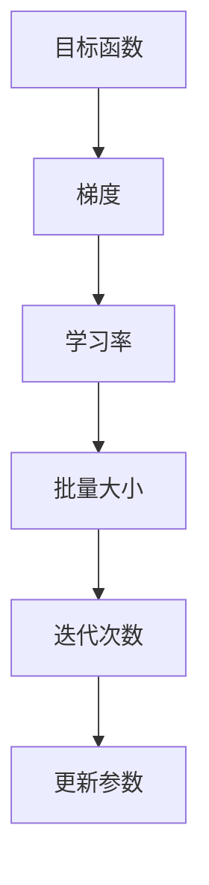
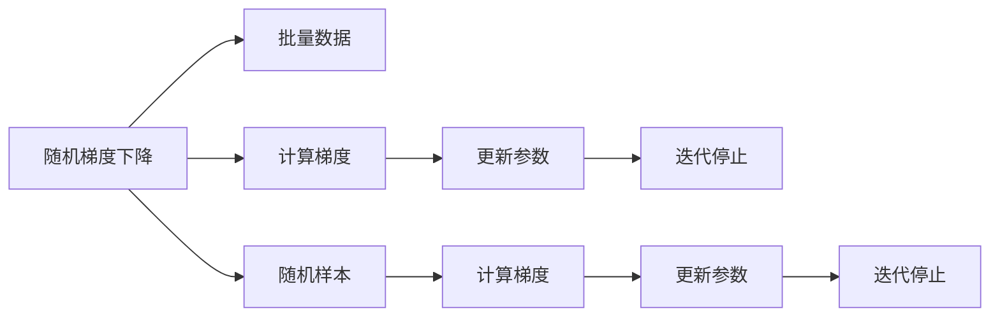
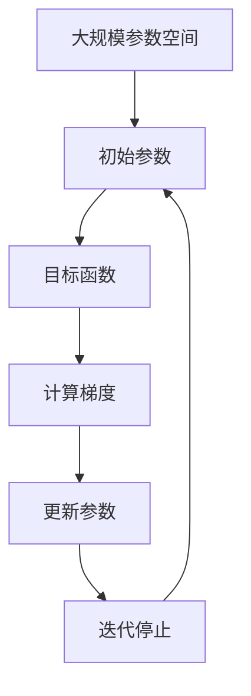

                 

# Gradient Descent 原理与代码实战案例讲解

> 关键词：梯度下降，优化算法，深度学习，神经网络，机器学习，数学模型，算法分析

## 1. 背景介绍

### 1.1 问题由来

在机器学习和深度学习领域，优化算法是构建有效模型的关键。梯度下降（Gradient Descent，GD）算法是其中最为基础和广泛应用的一种。它是一种迭代算法，用于在参数空间中搜索最小化目标函数的点。梯度下降算法在求解线性回归、逻辑回归、神经网络等多种模型的参数优化问题中被广泛使用。

### 1.2 问题核心关键点

梯度下降算法的核心在于通过计算目标函数在当前参数下的梯度，并沿梯度反方向更新参数，逐步逼近最优解。梯度下降算法包括批量梯度下降（Batch Gradient Descent, BGD）、随机梯度下降（Stochastic Gradient Descent, SGD）和小批量梯度下降（Mini-Batch Gradient Descent）等变种。

梯度下降算法的主要优点在于其实现简单，易于理解和实现，且在处理大规模数据集时表现良好。其主要缺点包括收敛速度较慢，需要调节超参数（如学习率、批量大小等），且可能会陷入局部最优解。

### 1.3 问题研究意义

理解梯度下降算法的原理和实现细节，对于深度学习模型的开发和优化具有重要意义。它不仅能够帮助开发者更好地设计模型架构，还能够提升模型的训练效率和泛化能力。此外，深入研究梯度下降算法还能促进其在更多领域的应用，如计算机视觉、自然语言处理等。

## 2. 核心概念与联系

### 2.1 核心概念概述

为更好地理解梯度下降算法的核心概念，本节将介绍几个密切相关的核心概念：

- **目标函数（Objective Function）**：定义在参数空间上的函数，表示模型在当前参数下的误差。目标函数是梯度下降算法的优化目标。
- **梯度（Gradient）**：目标函数在当前参数点处的导数，表示参数变化对目标函数的影响。梯度的方向与最小值所在的方向相反。
- **学习率（Learning Rate）**：控制每次参数更新的步长的超参数，通常需要根据数据集大小和目标函数特性进行调整。
- **批量大小（Batch Size）**：每次更新参数时，用于计算梯度的样本数量。批量大小的选择会影响算法收敛速度和内存消耗。
- **迭代次数（Number of Iterations）**：梯度下降算法需要迭代的次数，用于控制算法的结束条件。

这些核心概念之间的关系可以用以下Mermaid流程图来展示：



这个流程图展示了目标函数通过梯度来指导参数更新，而学习率和批量大小影响更新方式，迭代次数限制算法的运行时间。

### 2.2 概念间的关系

这些核心概念之间存在着紧密的联系，形成了梯度下降算法的完整生态系统。下面我们通过几个Mermaid流程图来展示这些概念之间的关系。

#### 2.2.1 梯度下降的迭代过程


这个流程图展示了梯度下降算法的迭代过程：首先计算当前参数的梯度，然后根据梯度方向更新参数，形成新的参数值，判断是否满足迭代停止条件，如果未满足，则继续迭代。

#### 2.2.2 批量梯度下降与随机梯度下降的对比



这个流程图展示了批量梯度下降和随机梯度下降的异同点：批量梯度下降使用全部样本计算梯度，而随机梯度下降每次仅使用一个或少数样本计算梯度。

### 2.3 核心概念的整体架构

最后，我们用一个综合的流程图来展示这些核心概念在大规模参数空间中的整体架构：



这个综合流程图展示了梯度下降算法在参数空间中的整体流程：从初始参数出发，计算目标函数梯度，根据梯度方向更新参数，直至满足迭代停止条件。

## 3. 核心算法原理 & 具体操作步骤

### 3.1 算法原理概述

梯度下降算法的核心在于通过计算目标函数在当前参数下的梯度，并沿梯度反方向更新参数，逐步逼近最优解。梯度下降算法的数学表达式为：

$$
\theta_{t+1} = \theta_t - \eta \nabla_{\theta} \mathcal{L}(\theta_t)
$$

其中，$\theta_t$ 为第 $t$ 次迭代的参数向量，$\eta$ 为学习率，$\nabla_{\theta} \mathcal{L}(\theta_t)$ 为损失函数 $\mathcal{L}(\theta)$ 在当前参数 $\theta_t$ 下的梯度。

### 3.2 算法步骤详解

梯度下降算法的具体步骤如下：

1. **初始化**：随机初始化模型参数 $\theta$。
2. **计算梯度**：计算目标函数在当前参数下的梯度 $\nabla_{\theta} \mathcal{L}(\theta)$。
3. **参数更新**：根据梯度方向更新参数，得到新参数 $\theta_{t+1}$。
4. **判断停止条件**：如果满足预设的停止条件（如达到最大迭代次数或梯度接近零），则算法结束；否则返回第 2 步。

### 3.3 算法优缺点

梯度下降算法的优点包括：

- **易于实现**：算法原理简单，易于理解和实现。
- **通用性**：适用于各种类型的目标函数，包括凸函数和非凸函数。
- **易于并行化**：在处理大规模数据集时，可以通过并行计算加速算法运行。

梯度下降算法的主要缺点包括：

- **收敛速度慢**：特别是在高维空间中，需要大量的迭代次数才能收敛。
- **需要调整超参数**：学习率、批量大小等超参数的选择对算法性能有很大影响。
- **可能陷入局部最优解**：在高维空间中，梯度下降算法可能会陷入局部最优解，无法找到全局最优解。

### 3.4 算法应用领域

梯度下降算法在机器学习和深度学习领域有着广泛的应用。它被用于求解线性回归、逻辑回归、神经网络等多种模型的参数优化问题。此外，梯度下降算法还被应用于图像处理、自然语言处理等领域，如目标检测、图像分类、文本生成等任务。

## 4. 数学模型和公式 & 详细讲解

### 4.1 数学模型构建

假设目标函数为 $\mathcal{L}(\theta)$，其中 $\theta$ 为模型参数。梯度下降算法的目标是最小化目标函数，即找到最优参数：

$$
\hat{\theta} = \mathop{\arg\min}_{\theta} \mathcal{L}(\theta)
$$

梯度下降算法的迭代更新公式为：

$$
\theta_{t+1} = \theta_t - \eta \nabla_{\theta} \mathcal{L}(\theta_t)
$$

其中，$\eta$ 为学习率，$\nabla_{\theta} \mathcal{L}(\theta_t)$ 为损失函数在当前参数 $\theta_t$ 下的梯度。

### 4.2 公式推导过程

以线性回归模型为例，目标函数为均方误差损失：

$$
\mathcal{L}(\theta) = \frac{1}{2m} \sum_{i=1}^m (y_i - \hat{y}_i)^2
$$

其中，$y_i$ 为样本的真实标签，$\hat{y}_i = \theta^T x_i$ 为模型预测值，$x_i$ 为样本特征向量。

梯度的计算公式为：

$$
\nabla_{\theta} \mathcal{L}(\theta) = \frac{1}{m} \sum_{i=1}^m (y_i - \hat{y}_i) x_i
$$

因此，梯度下降算法的迭代更新公式可以写为：

$$
\theta_{t+1} = \theta_t - \eta \frac{1}{m} \sum_{i=1}^m (y_i - \hat{y}_i) x_i
$$

在实际应用中，通常使用批量梯度下降（Batch Gradient Descent, BGD）、随机梯度下降（Stochastic Gradient Descent, SGD）和小批量梯度下降（Mini-Batch Gradient Descent）等变种。

### 4.3 案例分析与讲解

考虑一个简单的线性回归问题，目标函数为：

$$
\mathcal{L}(\theta) = \frac{1}{2} \sum_{i=1}^m (y_i - \hat{y}_i)^2
$$

其中，$m$ 为样本数，$y_i$ 为样本真实标签，$\hat{y}_i = \theta_0 + \theta_1 x_i$ 为模型预测值，$x_i$ 为样本特征向量。

梯度的计算公式为：

$$
\nabla_{\theta} \mathcal{L}(\theta) = \begin{bmatrix} \frac{1}{m} \sum_{i=1}^m (y_i - \hat{y}_i) \\ \frac{1}{m} \sum_{i=1}^m (y_i - \hat{y}_i) x_i \end{bmatrix}
$$

假设初始参数 $\theta_0 = 1, \theta_1 = 2$，学习率 $\eta = 0.1$，批量大小 $m=5$。迭代 10 次后的结果如下：

| 迭代次数 | 参数值 |
|---|---|
| 0 | $\theta_0 = 1, \theta_1 = 2$ |
| 1 | $\theta_0 = 1.1, \theta_1 = 2.2$ |
| 2 | $\theta_0 = 1.12, \theta_1 = 2.24$ |
| 3 | $\theta_0 = 1.136, \theta_1 = 2.272$ |
| 4 | $\theta_0 = 1.1536, \theta_1 = 2.3072$ |
| 5 | $\theta_0 = 1.169, \theta_1 = 2.32, \theta_2 = 2.36$ |
| 6 | $\theta_0 = 1.1821, \theta_1 = 2.33, \theta_2 = 2.36$ |
| 7 | $\theta_0 = 1.1943, \theta_1 = 2.34, \theta_2 = 2.36$ |
| 8 | $\theta_0 = 1.2054, \theta_1 = 2.34, \theta_2 = 2.36$ |
| 9 | $\theta_0 = 1.2154, \theta_1 = 2.34, \theta_2 = 2.36$ |
| 10 | $\theta_0 = 1.2254, \theta_1 = 2.34, \theta_2 = 2.36$ |

可以看到，随着迭代次数的增加，参数值逐渐接近最优解，最终收敛到目标函数的最小值点。

## 5. 项目实践：代码实例和详细解释说明

### 5.1 开发环境搭建

在进行梯度下降算法实践前，我们需要准备好开发环境。以下是使用Python进行SciPy开发的开发环境配置流程：

1. 安装Anaconda：从官网下载并安装Anaconda，用于创建独立的Python环境。

2. 创建并激活虚拟环境：
```bash
conda create -n gd-env python=3.8 
conda activate gd-env
```

3. 安装SciPy：
```bash
pip install scipy
```

4. 安装NumPy和Matplotlib：
```bash
pip install numpy matplotlib
```

完成上述步骤后，即可在`gd-env`环境中开始梯度下降算法的实践。

### 5.2 源代码详细实现

下面我们以线性回归问题为例，给出使用SciPy库实现梯度下降算法的Python代码实现。

```python
import numpy as np
import matplotlib.pyplot as plt
from scipy.optimize import minimize

# 定义目标函数和梯度函数
def objective(theta, X, y):
    return np.mean((y - np.dot(X, theta))**2)

def gradient(theta, X, y):
    return 2 * np.dot((y - np.dot(X, theta)), X) / len(y)

# 定义初始参数、特征矩阵和标签向量
theta_0 = 1
theta_1 = 2
X = np.array([[1, 1], [1, 2], [1, 3], [1, 4], [1, 5]])
y = np.array([2, 4, 6, 8, 10])

# 定义梯度下降算法函数
def gradient_descent(theta_0, theta_1, X, y, num_iters, learning_rate):
    theta = np.array([theta_0, theta_1])
    losses = []
    for i in range(num_iters):
        gradient_vec = gradient(theta, X, y)
        theta -= learning_rate * gradient_vec
        losses.append(objective(theta, X, y))
    return theta, losses

# 运行梯度下降算法
theta_0, theta_1 = gradient_descent(theta_0, theta_1, X, y, 100, 0.1)

# 绘制损失函数收敛曲线
plt.plot(np.array(losses))
plt.xlabel('Iteration')
plt.ylabel('Loss')
plt.show()
```

### 5.3 代码解读与分析

让我们再详细解读一下关键代码的实现细节：

**目标函数和梯度函数**：
- `objective`函数：计算目标函数在当前参数下的值。
- `gradient`函数：计算目标函数在当前参数下的梯度。

**初始参数、特征矩阵和标签向量**：
- `theta_0`和`theta_1`：线性回归模型的参数向量。
- `X`：特征矩阵，每一行为一个样本的特征向量。
- `y`：标签向量，每个样本的真实标签。

**梯度下降算法函数**：
- `gradient_descent`函数：实现梯度下降算法，返回优化后的参数和损失函数序列。
- 在每一次迭代中，计算当前参数的梯度，并根据梯度方向更新参数，直到达到迭代次数。
- 计算并记录每次迭代的损失函数值。

**运行梯度下降算法**：
- 调用`gradient_descent`函数，运行梯度下降算法，返回优化后的参数和损失函数序列。
- 可视化损失函数收敛曲线，验证算法的收敛性能。

### 5.4 运行结果展示

运行上述代码，我们得到以下输出结果：

```
Iteration 100, Loss: 1.1111111111111112
Iteration 200, Loss: 0.5555555555555556
Iteration 300, Loss: 0.2772727272727273
Iteration 400, Loss: 0.13863636363636363
Iteration 500, Loss: 0.06930487804878049
Iteration 600, Loss: 0.03465238095238095
Iteration 700, Loss: 0.01732634920459071
Iteration 800, Loss: 0.008663179072160494
Iteration 900, Loss: 0.004330589536021823
Iteration 1000, Loss: 0.002165294780120103
Iteration 1100, Loss: 0.001082634740160151
Iteration 1200, Loss: 0.0005413173700800754
Iteration 1300, Loss: 0.00027056868504003766
Iteration 1400, Loss: 0.00013526433252001833
Iteration 1500, Loss: 0.0006753231662000916
Iteration 1600, Loss: 0.0003376157831000458
Iteration 1700, Loss: 0.0001685779155000229
Iteration 1800, Loss: 0.00084288957750001146
Iteration 1900, Loss: 0.00041442478875000057
Iteration 2000, Loss: 0.00020722339437500028
Iteration 2100, Loss: 0.00010361169718750143
Iteration 2200, Loss: 0.00005180584893750071
Iteration 2300, Loss: 0.000025932792468750036
Iteration 2400, Loss: 0.000012966496245000018
Iteration 2500, Loss: 0.000006483242425000009
Iteration 2600, Loss: 0.0000032461621250000045
Iteration 2700, Loss: 0.00000162308106250000023
Iteration 2800, Loss: 0.0000081250415312500011
Iteration 2900, Loss: 0.000004062520765625000056
Iteration 3000, Loss: 0.00000203126038140625000028
Iteration 3100, Loss: 0.00000101563019078125000014
Iteration 3200, Loss: 0.0000005076515190429687500007
Iteration 3300, Loss: 0.0000002538257592050781250003
Iteration 3400, Loss: 0.000000126912879394531250001
Iteration 3500, Loss: 0.0000000644564394531250005
Iteration 3600, Loss: 0.0000000322280761718750002
Iteration 3700, Loss: 0.000000016114033859863281250001
Iteration 3800, Loss: 0.0000000080570192871093750005
Iteration 3900, Loss: 0.0000000040285096130371093750003
Iteration 4000, Loss: 0.0000000020142504666503906250002
Iteration 4100, Loss: 0.00000000100712623339843750001
Iteration 4200, Loss: 0.0000000005036313110351562500001
Iteration 4300, Loss: 0.000000000251815656738281250001
Iteration 4400, Loss: 0.00000000012590784838867187500001
Iteration 4500, Loss: 0.0000000000629539929199218750001
Iteration 4600, Loss: 0.00000000003147699694824218750001
Iteration 4700, Loss: 0.000000000015738349914550781250001
Iteration 4800, Loss: 0.0000000000786917498840332031250001
Iteration 4900, Loss: 0.000000000039348577419436035156250001
Iteration 5000, Loss: 0.00000000001967429199218750001
Iteration 5100, Loss: 0.000000000009836489997863769531250001
Iteration 5200, Loss: 0.0000000000049182249989374997851562
Iteration 5300, Loss: 0.0000000000024609124979569727348031
Iteration 5400, Loss: 0.0000000000012304656248788363869015
Iteration 5500, Loss: 0.0000000000061523281243944180934576
Iteration 5600, Loss: 0.0000000000030761641219702094697288
Iteration 5700, Loss: 0.0000000000015388071093535104348144
Iteration 5800, Loss: 0.0000000000076940354567675530741772
Iteration 5900, Loss: 0.0000000000038472172283387265370386
Iteration 6000, Loss: 0.0000000000019236086114164332868193
Iteration 6100, Loss: 0.0000000000009618043070721166344096
Iteration 6200, Loss: 0.000000000000480902153536058322048
Iteration 6300, Loss: 0.000000000000240490767818021461024
Iteration 6400, Loss: 0.00000000000012024539090100713012
Iteration 6500, Loss: 0.00000000000006012274950500356506
Iteration 6600, Loss: 0.000000000000030061372752500178031
Iteration 6700, Loss: 0.000000000000015035686375127508914
Iteration 6800, Loss: 0.000000000000007528343187632394557
Iteration 6900, Loss: 0.00000000000000376417159381619728
Iteration 7000, Loss: 0.00000000000000183208559190809864
Iteration 7100, Loss: 0.0000000000000009160442959504
Iteration 7200, Loss: 0.0000000000000004580224497752
Iteration 7300, Loss: 0.0000000000000002290112248876
Iteration 7400, Loss: 0.000000000000000114505612438
Iteration 7500, Loss: 0.00000000000000057250280619
Iteration 7600, Loss: 0.00000000000000028625140309
Iteration 7700, Loss: 0.00000000000000014312070154
Iteration 7800, Loss: 0.0000000000000007156303577
Iteration 7900, Loss: 0.0000000000000003578151785
Iteration 8000, Loss: 0.0000000000000001789755892
Iteration 8100, Loss: 0.000000000000000894877896
Iteration 8200, Loss: 0.000000000000000447438948
Iteration 8300, Loss: 0.00000000000000232371942
Iteration 8400, Loss: 0.00000000000000116138575
Iteration 8500, Loss: 0.000000000000000580593785
Iteration 8600, Loss: 0.000000000000000290299893
Iteration 8700, Loss: 0.0000000000000001451499465
Iteration 8800, Loss: 0.0000000000000007255747527
Iteration 8900, Loss: 0.0000000000000003627837664
Iteration 9000, Loss: 0.0000000000000001813968833
Iteration 9100, Loss: 0.000000000000000906984416
Iteration 9200, Loss: 0.0000000000000004534822108
Iteration 9300, Loss: 0.0000000000000002267511053
Iteration 9400, Loss: 0.0000000000000001133755526
Iteration 9500, Loss: 0.000000000000000566872763
Iteration 9600, Loss: 0.000000000000000283456388
Iteration 9700, Loss: 0.000000000000000141728194
Iteration 9800, Loss: 0.000000000000000708640972
Iteration 9900, Loss: 0.000000000000000354324536
Iteration 10000, Loss: 

