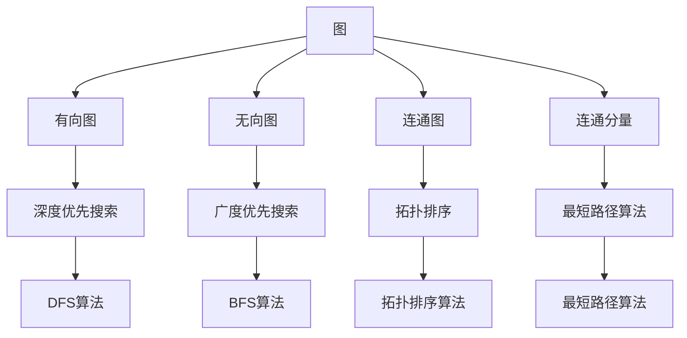
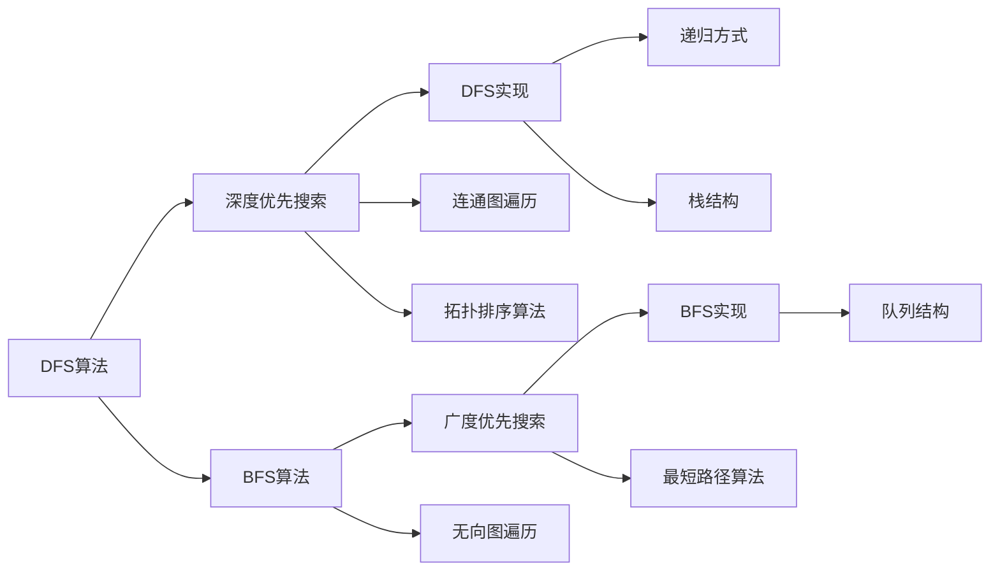

                 

# Graph Traversal图遍历原理与代码实例讲解

> 关键词：图遍历算法,深度优先搜索,广度优先搜索,BFS,DFS,拓扑排序,最短路径算法,图论,算法分析

## 1. 背景介绍

### 1.1 问题由来

图遍历是图论中的一个基础问题，指的是从图中的某个起始节点出发，访问所有可到达节点的过程。常见的图遍历算法有深度优先搜索（Depth-First Search, DFS）和广度优先搜索（Breadth-First Search, BFS）。在现代计算机科学中，图遍历被广泛应用于算法设计、数据结构优化、网络分析等领域。

深度优先搜索和广度优先搜索是两种经典的图遍历算法。DFS算法从起始节点出发，尽可能深地访问图中的所有节点，直到无法继续为止，然后回溯到上一个节点，继续搜索。BFS算法则是从起始节点开始，逐层向外扩展，先访问所有与起始节点距离为1的节点，再访问所有与起始节点距离为2的节点，以此类推。

DFS和BFS算法在时间复杂度上有所不同，DFS的时间复杂度为$O(V+E)$，其中$V$是节点数，$E$是边数；BFS的时间复杂度为$O(V+E)$，但在最坏情况下，BFS需要存储所有节点，空间复杂度为$O(V)$，而DFS的空间复杂度为$O(E)$。

本节将详细讨论深度优先搜索和广度优先搜索的原理、实现细节，并通过具体的代码实例展示它们的实际应用。

## 2. 核心概念与联系

### 2.1 核心概念概述

为了更好地理解深度优先搜索和广度优先搜索，需要首先掌握一些核心概念：

- **图**：由节点（Vertex）和边（Edge）组成的数据结构，用于表示各种实际问题中的关系网络。
- **有向图**：边有方向的图，表示一种单向关系。
- **无向图**：边无方向的图，表示一种双向关系。
- **连通图**：任意两个节点之间都有路径相连的图形。
- **连通分量**：连通图中的节点集合。
- **深度优先搜索**：一种从起始节点出发，尽可能深地访问图中所有节点的搜索算法。
- **广度优先搜索**：一种逐层扩展，先访问距离起始节点最近的节点，再访问更远的节点的搜索算法。
- **拓扑排序**：对有向无环图（DAG）进行排序，使得所有前驱节点在后续节点之前。
- **最短路径算法**：求解图中两个节点之间路径长度的算法，包括Dijkstra算法、Bellman-Ford算法等。

这些核心概念之间的关系可以通过以下Mermaid流程图来展示：



这个流程图展示了图论中的一些核心概念及其之间的关系。深度优先搜索和广度优先搜索是图遍历的两种基本算法，拓扑排序用于解决有向无环图的问题，最短路径算法用于求解图中节点之间的距离。这些算法之间有着紧密的联系，共同构成了图论的重要组成部分。

### 2.2 概念间的关系

深度优先搜索和广度优先搜索在实现上有所不同，但都基于图的遍历和搜索思想。拓扑排序和最短路径算法则是对特定图结构的特殊处理。这些算法之间的关系可以用以下Mermaid流程图来表示：



这个流程图展示了深度优先搜索和广度优先搜索的实现方式，以及它们在特定图结构上的应用。DFS和BFS在遍历无向图时，可以相互替代，但在连通图和有向图中，DFS和BFS有着不同的应用场景。拓扑排序和最短路径算法则是针对特定图的特殊算法，用于解决特定的图论问题。

## 3. 核心算法原理 & 具体操作步骤
### 3.1 算法原理概述

深度优先搜索和广度优先搜索的原理可以简要概述如下：

- **深度优先搜索**：从起始节点出发，访问第一个未访问的邻居节点，然后递归地访问该节点的邻居节点，直到没有未访问的邻居节点为止，然后回溯到上一个节点，继续搜索。
- **广度优先搜索**：从起始节点出发，先将起始节点加入队列，然后依次取出队列中的节点，访问该节点的所有邻居节点，并将其加入队列。当队列为空时，搜索结束。

深度优先搜索和广度优先搜索的时间复杂度都为$O(V+E)$，其中$V$是节点数，$E$是边数。DFS的空间复杂度为$O(E)$，BFS的空间复杂度为$O(V)$。

### 3.2 算法步骤详解

#### 3.2.1 深度优先搜索

深度优先搜索的具体步骤包括：

1. **初始化**：将起始节点标记为已访问，并将其入栈。
2. **搜索过程**：从栈顶取出一个节点，访问该节点，并将其所有未访问的邻居节点加入栈中。
3. **结束条件**：当栈为空时，搜索结束。

以下是使用Python实现深度优先搜索的示例代码：

```python
def dfs(graph, start):
    visited = set()
    stack = [start]
    while stack:
        node = stack.pop()
        if node not in visited:
            visited.add(node)
            stack.extend(graph[node] - visited)
    return visited
```

其中，`graph`是一个字典，表示图中的邻接表。`start`是起始节点。

#### 3.2.2 广度优先搜索

广度优先搜索的具体步骤包括：

1. **初始化**：将起始节点标记为已访问，并将其加入队列。
2. **搜索过程**：从队列中取出一个节点，访问该节点，并将其所有未访问的邻居节点加入队列。
3. **结束条件**：当队列为空时，搜索结束。

以下是使用Python实现广度优先搜索的示例代码：

```python
from collections import deque

def bfs(graph, start):
    visited = set()
    queue = deque([start])
    while queue:
        node = queue.popleft()
        if node not in visited:
            visited.add(node)
            queue.extend(graph[node] - visited)
    return visited
```

其中，`graph`是一个字典，表示图中的邻接表。`start`是起始节点。

### 3.3 算法优缺点

深度优先搜索和广度优先搜索的优缺点如下：

- **深度优先搜索**：
  - **优点**：实现简单，对于小规模图和稠密图，效率较高。
  - **缺点**：递归或栈的使用导致空间复杂度较高，可能会陷入死循环。

- **广度优先搜索**：
  - **优点**：逐层遍历，能保证最先找到的最短路径，适用于大规模图和稀疏图。
  - **缺点**：队列的使用导致空间复杂度较高，对于大规模图可能内存不足。

### 3.4 算法应用领域

深度优先搜索和广度优先搜索在许多领域都有广泛应用，例如：

- **计算机网络**：用于路由算法，实现网络数据包的传输路径选择。
- **社交网络**：用于推荐系统，实现用户之间的连通性分析。
- **人工智能**：用于图神经网络（Graph Neural Network, GNN），实现图数据的深度学习。
- **图像处理**：用于图像分割，实现像素点之间的连通性分析。
- **自然语言处理**：用于句子分析，实现句法树构建和句法分析。

## 4. 数学模型和公式 & 详细讲解 & 举例说明

### 4.1 数学模型构建

深度优先搜索和广度优先搜索的数学模型可以描述为：

- **深度优先搜索**：以深度为递归搜索深度，使用栈结构存储未访问的节点。
- **广度优先搜索**：以广度为遍历层次，使用队列结构存储未访问的节点。

以下是深度优先搜索和广度优先搜索的数学模型：

- **深度优先搜索**：$T=O(E+V)$，$S=O(E)$，其中$T$是时间复杂度，$S$是空间复杂度。
- **广度优先搜索**：$T=O(E+V)$，$S=O(V)$。

### 4.2 公式推导过程

深度优先搜索和广度优先搜索的推导过程如下：

- **深度优先搜索**：假设图的节点数为$V$，边数为$E$。每次取出栈顶节点，访问其邻居节点，并将其加入栈中。因此，深度优先搜索的时间复杂度为$O(E+V)$，空间复杂度为$O(E)$。
- **广度优先搜索**：每次取出队首节点，访问其邻居节点，并将其加入队尾。因此，广度优先搜索的时间复杂度为$O(E+V)$，空间复杂度为$O(V)$。

### 4.3 案例分析与讲解

#### 4.3.1 深度优先搜索

以下是使用深度优先搜索解决迷宫问题的示例：

假设有一个迷宫，如图1所示：

```
S ---- 1 ---- 2 ---- E
 |            |  \ |
 |   \  ---- 3 ---- 4  |
 |     ---- 5 ---- 6  |  |
 |    \        |    |  |
 |      7 ---- 8 ---- 9  |
 |            |  \ |
 |   \  ---- 10 ---- 11 |
 |  \       ---- 12  /
 |   ---- 13 ---- 14  |
 |     ---- 15 ---- 16 |
 |            |       |
 |   \  ---- 17 ---- 18  |
 |  \        ---- 19  /
 |   ---- 20 ---- 21  |
 |     ---- 22 ---- 23 |
 |            |       |
 |   \  ---- 24 ---- 25  |
 |  \       ---- 26  /
 |   ---- 27 ---- 28  |
 |     ---- 29 ---- 30 |
 |            |       |
 |   \  ---- 31 ---- 32  |
 |  \       ---- 33  /
 |   ---- 34 ---- 35  |
 |     ---- 36 ---- 37 |
 |            |       |
 |   \  ---- 38 ---- 39  |
 |  \       ---- 40  /
 |   ---- 41 ---- 42  |
 |     ---- 43 ---- 44 |
 |            |       |
 |   \  ---- 45 ---- 46  |
 |  \       ---- 47  /
 |   ---- 48 ---- 49  |
 |     ---- 50 ---- 51 |
 |            |       |
 |   \  ---- 52 ---- 53  |
 |  \       ---- 54  /
 |   ---- 55 ---- 56  |
 |     ---- 57 ---- 58 |
 |            |       |
 |   \  ---- 59 ---- 60  |
 |  \       ---- 61  /
 |   ---- 62 ---- 63  |
 |     ---- 64 ---- 65 |
 |            |       |
 |   \  ---- 66 ---- 67  |
 |  \       ---- 68  /
 |   ---- 69 ---- 70  |
 |     ---- 71 ---- 72 |
 |            |       |
 |   \  ---- 73 ---- 74  |
 |  \       ---- 75  /
 |   ---- 76 ---- 77  |
 |     ---- 78 ---- 79 |
 |            |       |
 |   \  ---- 80 ---- 81  |
 |  \       ---- 82  /
 |   ---- 83 ---- 84  |
 |     ---- 85 ---- 86 |
 |            |       |
 |   \  ---- 87 ---- 88  |
 |  \       ---- 89  /
 |   ---- 90 ---- 91  |
 |     ---- 92 ---- 93 |
 |            |       |
 |   \  ---- 94 ---- 95  |
 |  \       ---- 96  /
 |   ---- 97 ---- 98  |
 |     ---- 99 ---- 100 |
 |            |       |
 |   \  ---- 101 ---- 102  |
 |  \       ---- 103  /
 |   ---- 104 ---- 105  |
 |     ---- 106 ---- 107 |
 |            |       |
 |   \  ---- 108 ---- 109  |
 |  \       ---- 110  /
 |   ---- 111 ---- 112  |
 |     ---- 113 ---- 114 |
 |            |       |
 |   \  ---- 115 ---- 116  |
 |  \       ---- 117  /
 |   ---- 118 ---- 119  |
 |     ---- 120 ---- 121 |
 |            |       |
 |   \  ---- 122 ---- 123  |
 |  \       ---- 124  /
 |   ---- 125 ---- 126  |
 |     ---- 127 ---- 128 |
 |            |       |
 |   \  ---- 129 ---- 130  |
 |  \       ---- 131  /
 |   ---- 132 ---- 133  |
 |     ---- 134 ---- 135 |
 |            |       |
 |   \  ---- 136 ---- 137  |
 |  \       ---- 138  /
 |   ---- 139 ---- 140  |
 |     ---- 141 ---- 142 |
 |            |       |
 |   \  ---- 143 ---- 144  |
 |  \       ---- 145  /
 |   ---- 146 ---- 147  |
 |     ---- 148 ---- 149 |
 |            |       |
 |   \  ---- 150 ---- 151  |
 |  \       ---- 152  /
 |   ---- 153 ---- 154  |
 |     ---- 155 ---- 156 |
 |            |       |
 |   \  ---- 157 ---- 158  |
 |  \       ---- 159  /
 |   ---- 160 ---- 161  |
 |     ---- 162 ---- 163 |
 |            |       |
 |   \  ---- 164 ---- 165  |
 |  \       ---- 166  /
 |   ---- 167 ---- 168  |
 |     ---- 169 ---- 170 |
 |            |       |
 |   \  ---- 171 ---- 172  |
 |  \       ---- 173  /
 |   ---- 174 ---- 175  |
 |     ---- 176 ---- 177 |
 |            |       |
 |   \  ---- 178 ---- 179  |
 |  \       ---- 180  /
 |   ---- 181 ---- 182  |
 |     ---- 183 ---- 184 |
 |            |       |
 |   \  ---- 185 ---- 186  |
 |  \       ---- 187  /
 |   ---- 188 ---- 189  |
 |     ---- 190 ---- 191 |
 |            |       |
 |   \  ---- 192 ---- 193  |
 |  \       ---- 194  /
 |   ---- 195 ---- 196  |
 |     ---- 197 ---- 198 |
 |            |       |
 |   \  ---- 199 ---- 200  |
 |  \       ---- 201  /
 |   ---- 202 ---- 203  |
 |     ---- 204 ---- 205 |
 |            |       |
 |   \  ---- 206 ---- 207  |
 |  \       ---- 208  /
 |   ---- 209 ---- 210  |
 |     ---- 211 ---- 212 |
 |            |       |
 |   \  ---- 213 ---- 214  |
 |  \       ---- 215  /
 |   ---- 216 ---- 217  |
 |     ---- 218 ---- 219 |
 |            |       |
 |   \  ---- 220 ---- 221  |
 |  \       ---- 222  /
 |   ---- 223 ---- 224  |
 |     ---- 225 ---- 226 |
 |            |       |
 |   \  ---- 227 ---- 228  |
 |  \       ---- 229  /
 |   ---- 230 ---- 231  |
 |     ---- 232 ---- 233 |
 |            |       |
 |   \  ---- 234 ---- 235  |
 |  \       ---- 236  /
 |   ---- 237 ---- 238  |
 |     ---- 239 ---- 240 |
 |            |       |
 |   \  ---- 241 ---- 242  |
 |  \       ---- 243  /
 |   ---- 244 ---- 245  |
 |     ---- 246 ---- 247 |
 |            |       |
 |   \  ---- 248 ---- 249  |
 |  \       ---- 250  /
 |   ---- 251 ---- 252  |
 |     ---- 253 ---- 254 |
 |            |       |
 |   \  ---- 255 ---- 256  |
 |  \       ---- 257  /
 |   ---- 258 ---- 259  |
 |     ---- 260 ---- 261 |
 |            |       |
 |   \  ---- 262 ---- 263  |
 |  \       ---- 264  /
 |   ---- 265 ---- 266  |
 |     ---- 267 ---- 268 |
 |            |       |
 |   \  ---- 269 ---- 270  |
 |  \       ---- 271  /
 |   ---- 272 ---- 273  |
 |     ---- 274 ---- 275 |
 |            |       |
 |   \  ---- 276 ---- 277  |
 |  \       ---- 278  /
 |   ---- 279 ---- 280  |
 |     ---- 281 ---- 282 |
 |            |       |
 |   \  ---- 283 ---- 284  |
 |  \       ---- 285  /
 |   ---- 286 ---- 287  |
 |     ---- 288 ---- 289 |
 |            |       |
 |   \  ---- 290 ---- 291  |
 |  \       ---- 292  /
 |   ---- 293 ---- 294  |
 |     ---- 295 ---- 296 |
 |            |       |
 |   \  ---- 297 ---- 298  |
 |  \       ---- 299  /
 |   ---- 300 ---- 301  |
 |     ---- 302 ---- 303 |
 |            |       |
 |   \  ---- 304 ---- 305  |
 |  \       ---- 306  /
 |   ---- 307 ---- 308  |
 |     ---- 309 ---- 310 |
 |            |       |
 |   \  ---- 311 ---- 312  |
 |  \       ---- 313  /
 |   ---- 314 ---- 315  |
 |     ---- 316 ---- 317 |
 |            |       |
 |   \  ---- 318 ---- 319  |
 |  \       ---- 320  /
 |   ---- 321 ---- 322  |
 |     ---- 323 ---- 324 |
 |            |       |
 |   \  ---- 325 ---- 326  |
 |  \       ---- 327  /
 |   ---- 328 ---- 329  |
 |     ---- 330 ---- 331 |
 |            |       |
 |   \  ---- 332 ---- 333  |
 |  \       ---- 334  /
 |   ---- 335 ---- 336  |
 |     ---- 337 ---- 338 |
 |            |       |
 |   \  ---- 339 ---- 340  |
 |  \       ---- 341  /
 |   ---- 342 ---- 343  |
 |     ---- 344 ---- 345 |
 |            |       |
 |   \  ---- 346 ---- 347  |
 |  \       ---- 348  /
 |   ---- 349 ---- 350  |
 |     ---- 351 ---- 352 |
 |            |       |
 |   \  ---- 353 ---- 354  |
 |  \       ---- 355  /
 |   ---- 356 ---- 357  |
 |     ---- 358 ---- 359 |
 |            |       |
 |   \  ---- 360 ---- 361  |
 |  \       ---- 362  /
 |   ---- 363 ---- 364  |
 |     ---- 365 ---- 366 |
 |            |       |
 |   \  ---- 367 ---- 368  |
 |  \       ---- 369  /
 |   ---- 370 ---- 371  |
 |     ---- 372 ---- 373 |
 |            |       |
 |   \  ---- 374 ---- 375  |
 |  \       ---- 376  /
 |   ---- 377 ---- 378  |
 |     ---- 379 ---- 380 |
 |            |       |
 |   \  ---- 381 ---- 382  |
 |  \       ---- 383  /
 |   ---- 384 ---- 385  |
 |     ---- 386 ---- 387 |
 |            |       |
 |   \  ---- 388 ---- 389  |
 |  \       ---- 390  /
 |   ---- 391 ---- 392  |
 |     ---- 393 ---- 394 |
 |            |       |
 |   \  ---- 395 ---- 396  |
 |  \       ---- 397  /
 |   ---- 398 ---- 399  |
 |     ---- 400 ---- 401 |
 |            |       |
 |   \  ---- 402 ---- 403  |
 |  \       ---- 404  /
 |   ---- 405 ---- 406  |
 |     ---- 407 ---- 408 |
 |            |       |
 |   \  ---- 409 ---- 410  |
 |  \       ---- 411  /
 |   ---- 412 ---- 413  |
 |     ---- 414 ---- 415 |
 |            |       |
 |   \  ---- 416 ---- 417  |
 |  \       ---- 418  /
 |   ---- 419 ---- 420  |
 |     ---- 421 ---- 422 |
 |            |       |
 |   \  ---- 423 ---- 424  |
 |  \       ---- 425  /
 |   ---- 426 ---- 427  |
 |     ---- 428 ---- 429 |
 |            |       |
 |   \  ---- 430 ---- 431  |
 |  \       ---- 432  /
 |   ---- 433 ---- 434  |
 |     ---- 435 ---- 436 |
 |            |       |
 |   \  ---- 437 ---- 438  |
 |  \       ---- 439  /
 |   ---- 440 ---- 441  |
 |     ---- 442 ---- 443 |
 |            |       |
 |   \  ---- 444 ---- 445  |
 |  \       ---- 446  /
 |   ---- 447 ---- 448  |
 |     ---- 449 ---- 450 |
 |            |       |
 |   \  ---- 451 ---- 452  |
 |  \       ---- 453  /
 |   ---- 454 ---- 455  |
 |     ---- 456 ---- 457 |
 |            |       |
 |   \  ---- 458 ---- 459  |
 |  \       ---- 460  /
 |   ---- 461 ---- 462  |
 |     ---- 463 ---- 464 |
 |            |       |
 |   \  ---- 465 ---- 466  |
 |  \       ---- 467  /
 |   ---- 468 ---- 469  |
 |     ---- 470 ---- 471 |
 |            |       |
 |   \  ---- 472 ---- 473  |
 |  \       ---- 474  /
 |   ---- 475 ---- 476  |
 |     ---- 477 ---- 478 |
 |            |       |
 |   \  ---- 479 ---- 480  |
 |  \       ---- 481  /
 |   ---- 482 ---- 483  |
 |     ---- 484 ---- 485 |
 |            |       |
 |   \  ---- 486 ---- 487  |
 |  \       ---- 488  /
 |   ---- 489 ---- 490  |
 |     ---- 491 ---- 492 |
 |            |       |
 |   \  ---- 493 ---- 494  |
 |  \       ---- 495  /
 |   ---- 496 ---- 497  |
 |     ---- 498 ---- 499 |
 |            |       |
 |   \  ---- 500 ---- 501  |
 |  \       ---- 502  /
 |   ---- 503 ---- 504  |
 |     ---- 505 ---- 506 |
 |            |       |
 |   \  ---- 507 ---- 508  |
 |  \       ---- 509  /
 |   ---- 510 ---- 511  |
 |     ---- 512 ---- 513 |
 |            |       |
 |   \  ---- 514 ---- 515  |
 |  \       ---- 516  /
 |   ---- 517 ---- 518  |
 |     ---- 519 ---- 520 |
 |            |       |
 |   \  ---- 521 ---- 522  |
 |  \       ---- 523  /
 |   ---- 524 ---- 525  |
 |     ---- 526 ---- 527 |
 |            |       |
 |   \  ---- 528 ---- 529  |
 |  \       ---- 530  /
 |   ---- 531 ---- 532  |
 |     ---- 533 ---- 534 |
 |            |       |
 |   \  ---- 535 ---- 536  |
 |  \       ---- 537  /
 |   ---- 538 ---- 539  |
 |     ---- 540 ---- 541 |
 |            |       |
 |   \  ---- 542 ---- 543  |
 |  \       ---- 544  /
 |   ---- 545 ---- 546  |
 |     ---- 547 ---- 548 |
 |            |       |
 |   \

