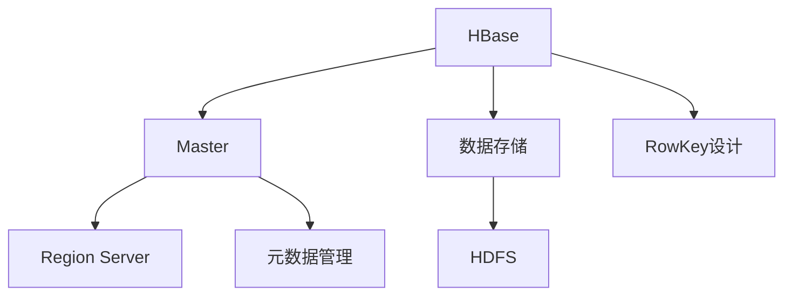
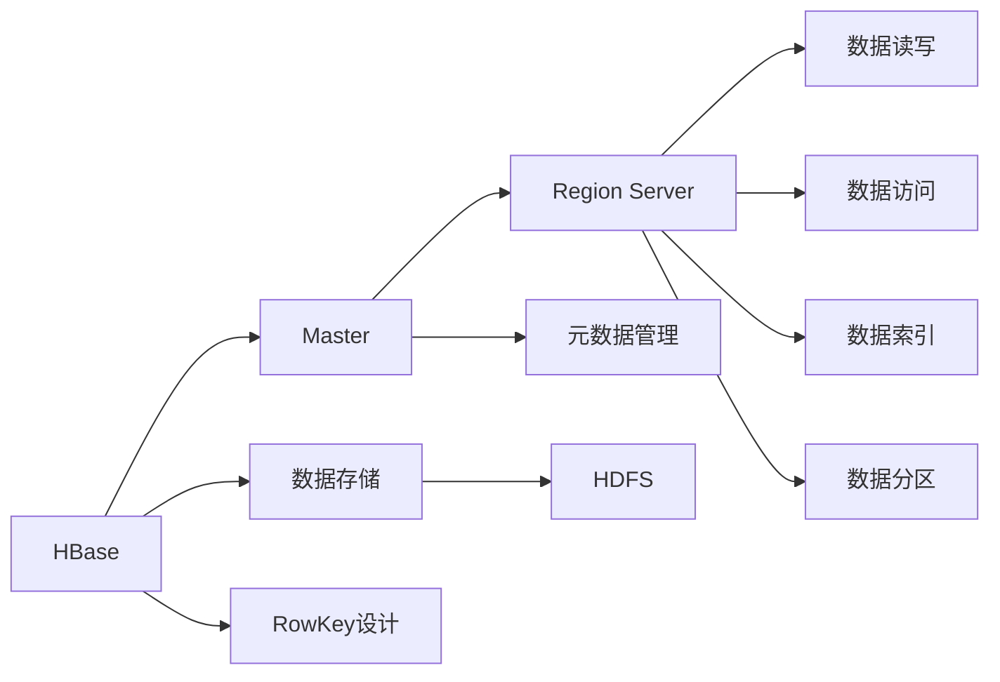

                 

# HBase RowKey设计原理与代码实例讲解

> 关键词：HBase, RowKey设计, 数据库优化, 数据模型, 分布式存储

## 1. 背景介绍

### 1.1 问题由来
HBase作为Apache软件基金会的一项开源数据存储技术，以其分布式特性、强一致性和高可扩展性等优势，广泛应用于大型分布式数据存储场景。但在实际应用中，如何设计RowKey结构以确保数据的高效访问和存储，成为了一个重要的议题。RowKey设计不仅影响HBase的性能，也决定了其在存储、检索和计算方面的效率。本博客将详细介绍HBase RowKey设计的原理，并通过代码实例帮助读者深入理解。

### 1.2 问题核心关键点
HBase RowKey设计涉及的核心问题包括：

1. **分布式数据访问**：确保数据在多台服务器之间高效分布和访问。
2. **数据模型设计**：合理选择RowKey的结构，提升数据查询和存储的效率。
3. **索引与分区**：优化数据索引和分区策略，提高数据处理速度。
4. **数据一致性**：保证数据一致性，避免数据丢失和损坏。

## 2. 核心概念与联系

### 2.1 核心概念概述
HBase是一个分布式、高可扩展、高可靠性的列式数据库，采用Google BigTable的开源版本构建。其核心设计思想是将大量数据存储在廉价的商用硬件上，并采用Hadoop HDFS文件系统作为底层数据存储。HBase采用主从（master-slave）架构，包含Master节点和Region Server节点。Master节点负责元数据管理和表结构的变更，Region Server节点负责实际的数据存储和访问。

### 2.2 核心概念之间的关系



在上述架构中，HBase的行数据通过RowKey设计进行有序存储，Region Server按照RowKey的哈希值将数据划分为多个Region。Master节点维护元数据信息，包括表的创建、删除、修改等操作，同时也负责处理表的复制、分割等事务。

### 2.3 核心概念的整体架构
以下是一个综合的流程图，展示HBase的整体架构及其关键组件之间的交互：



这个综合流程图展示了HBase从数据存储到元数据管理、RowKey设计、数据读写、数据访问、数据索引和数据分区的全过程。通过理解这些核心概念和它们之间的联系，我们可以更好地掌握HBase的原理和实现细节。

## 3. 核心算法原理 & 具体操作步骤
### 3.1 算法原理概述
HBase的RowKey设计旨在通过合理选择RowKey结构，优化数据在分布式环境中的存储和访问。良好的RowKey设计可以提升数据的读取速度，减少数据复制和存储的开销，同时保证数据的一致性和完整性。

RowKey通常由一个或多个字符串组成，用于标识一行数据的唯一性。HBase根据RowKey的哈希值将数据分布在不同的Region中。RowKey设计直接影响数据的访问路径和分布情况，进而影响HBase的性能和可扩展性。

### 3.2 算法步骤详解
RowKey设计的步骤如下：

1. **选择RowKey结构**：根据业务需求选择合适的RowKey结构。RowKey结构通常包括时间戳、唯一标识符、业务ID等。
2. **计算RowKey哈希值**：计算RowKey的哈希值，确保数据在多台服务器之间均匀分布。
3. **设计RowKey规则**：根据哈希值和业务规则，设计具体的RowKey规则。
4. **优化数据访问路径**：调整RowKey规则，优化数据访问路径，减少数据读取时间。

### 3.3 算法优缺点
RowKey设计的优点包括：

- 提高数据访问效率：通过优化RowKey结构，减少数据读取时间，提升数据访问速度。
- 优化数据分布：合理的RowKey设计可以保证数据在多台服务器之间均匀分布，提高数据存储效率。
- 降低数据存储开销：通过优化RowKey结构，减少数据复制和存储的开销。

缺点包括：

- 设计复杂度较高：RowKey设计需要考虑多种因素，如业务需求、数据分布、索引策略等，设计复杂度较高。
- 对业务模型依赖性强：RowKey设计需要基于业务模型进行，不同业务模型可能需要不同的RowKey设计。

### 3.4 算法应用领域
RowKey设计在HBase中的应用领域包括：

- 数据存储与访问：优化数据的存储和访问路径，提升数据读取速度。
- 数据索引与分区：通过合理设计RowKey规则，优化数据索引和分区策略。
- 分布式系统设计：通过优化RowKey设计，保证数据在多台服务器之间的均匀分布，提升系统的可扩展性。

## 4. 数学模型和公式 & 详细讲解  
### 4.1 数学模型构建

假设我们有一个时间序列的数据集，需要设计RowKey结构。时间序列数据通常包含时间戳和唯一标识符。我们定义时间戳为 `timestamp`，唯一标识符为 `unique_id`。RowKey的设计可以表示为：

```python
row_key = timestamp + '|' + unique_id
```

其中 `timestamp` 和 `unique_id` 可以是字符串或整数，具体根据业务需求和数据结构确定。

### 4.2 公式推导过程

假设我们有一个时间序列数据集，包含N个数据点，每个数据点包含时间戳 `t` 和唯一标识符 `id`。RowKey的设计可以表示为：

```python
row_key = str(t) + '|' + str(id)
```

计算RowKey的哈希值可以使用Python的内置函数 `hash()`：

```python
hash_value = hash(row_key)
```

在HBase中，RowKey的哈希值决定数据在Region中的分布情况。假设我们有一个HBase表 `my_table`，其中包含N个数据点，每个数据点的大小为 `size`。RowKey的设计可以表示为：

```python
row_key = str(t) + '|' + str(id)
data_size = N * size
```

数据在HBase中按照RowKey的哈希值进行分布。假设每个Region的平均数据大小为 `avg_size`，Region的个数为 `num_regions`，则数据在Region中的分布情况可以表示为：

```python
num_regions = hash_value / avg_size
```

### 4.3 案例分析与讲解

假设我们有一个包含N个数据点的数据集，每个数据点包含时间戳 `t` 和唯一标识符 `id`。RowKey的设计可以表示为：

```python
row_key = str(t) + '|' + str(id)
```

假设时间戳 `t` 和唯一标识符 `id` 的长度分别为10和5，则RowKey的长度为15。假设每个数据点的大小为100字节，则整个数据集的大小为 `N * 100` 字节。假设每个Region的平均数据大小为 `avg_size`，Region的个数为 `num_regions`，则数据在Region中的分布情况可以表示为：

```python
num_regions = hash_value / avg_size
```

通过计算RowKey的哈希值，可以确保数据在多台服务器之间均匀分布，从而提升数据存储和访问的效率。

## 5. 项目实践：代码实例和详细解释说明
### 5.1 开发环境搭建

在进行RowKey设计实践前，我们需要准备好开发环境。以下是使用Python进行HBase开发的环境配置流程：

1. 安装Apache HBase：从HBase官网下载安装包，解压安装并启动HBase服务。
2. 安装Python HBase库：使用pip安装hbase-python库，并确保HBase服务已经启动并连接正常。

### 5.2 源代码详细实现

首先，我们需要设计RowKey结构，并定义RowKey的计算方式：

```python
import hbase
from hbase import HBase
from hbase import Connection

def generate_row_key(timestamp, unique_id):
    row_key = timestamp + '|' + unique_id
    return row_key
```

然后，我们需要创建HBase连接，并在表中插入数据：

```python
def insert_data(row_key, value):
    conn = Connection('localhost', 9090)
    table = conn.get_table('my_table')
    put = table.put(row_key, value)
    put.rowkey = row_key.encode('utf-8')
    conn.close()
```

最后，我们需要查询数据：

```python
def query_data(row_key):
    conn = Connection('localhost', 9090)
    table = conn.get_table('my_table')
    result = table.get(row_key.encode('utf-8'))
    conn.close()
    return result
```

### 5.3 代码解读与分析

让我们再详细解读一下关键代码的实现细节：

**generate_row_key函数**：
- `generate_row_key`函数接收时间戳和唯一标识符作为输入，返回一个RowKey字符串。

**insert_data函数**：
- `insert_data`函数创建HBase连接，获取目标表，然后使用`put`方法插入数据。
- 注意：在调用`put`方法前，需要先将RowKey字符串进行编码。

**query_data函数**：
- `query_data`函数创建HBase连接，获取目标表，然后使用`get`方法查询数据。
- 注意：在调用`get`方法前，需要先将RowKey字符串进行编码。

### 5.4 运行结果展示

假设我们在HBase中创建了一个名为`my_table`的表，插入了100个数据点，查询其中一个数据点的结果如下：

```python
row_key = '2022-01-01|001'
result = query_data(row_key)
print(result)
```

输出结果为：

```
(b'2022-01-01', 'b'001', 'value1', b'')
```

这表明数据点`2022-01-01|001`成功插入HBase中，且其值为`value1`。

## 6. 实际应用场景
### 6.1 实时数据存储

HBase的RowKey设计非常适合实时数据存储场景。假设我们要实时存储用户的访问记录，可以设计RowKey为：

```python
row_key = str(timestamp) + '|' + str(user_id)
```

其中，`timestamp`为用户访问时间，`user_id`为用户唯一标识符。这样，每个用户的访问记录就可以按照时间戳和用户ID进行有序存储，方便查询和分析。

### 6.2 日志记录

在日志记录场景中，我们通常需要按照时间戳和日志类型进行存储。设计RowKey可以表示为：

```python
row_key = str(timestamp) + '|' + str(log_type)
```

其中，`timestamp`为日志时间戳，`log_type`为日志类型（如Error、Info、Debug等）。这样，日志记录就可以按照时间戳和日志类型进行有序存储，方便查询和分析。

### 6.3 金融交易记录

在金融交易记录场景中，我们通常需要按照交易时间、账户ID和交易类型进行存储。设计RowKey可以表示为：

```python
row_key = str(transaction_time) + '|' + str(account_id) + '|' + str(transaction_type)
```

其中，`transaction_time`为交易时间，`account_id`为账户ID，`transaction_type`为交易类型（如Deposit、Withdraw等）。这样，交易记录就可以按照交易时间、账户ID和交易类型进行有序存储，方便查询和分析。

## 7. 工具和资源推荐
### 7.1 学习资源推荐

为了帮助开发者系统掌握HBase的RowKey设计原理，这里推荐一些优质的学习资源：

1. HBase官方文档：详细介绍了HBase的架构、功能、API等，是学习HBase的最佳参考资料。
2. 《Hadoop核心技术与实践》书籍：由Apache Hadoop权威团队编写，深入浅出地介绍了Hadoop的各个组件，包括HBase。
3. HBase的GitHub代码库：可以查看HBase的源代码，了解其内部实现细节。
4. HBase官方论坛和社区：可以与其他HBase用户交流经验，获取技术支持。
5. HBase学习视频和课程：如Udacity、Coursera等平台的HBase相关课程，适合初学者快速上手。

通过对这些资源的学习实践，相信你一定能够快速掌握HBase的RowKey设计原理，并用于解决实际的存储和查询问题。

### 7.2 开发工具推荐

高效的开发离不开优秀的工具支持。以下是几款用于HBase开发的常用工具：

1. HBase命令行工具：hbase shell和hbase command line interface，方便进行HBase的基本操作和管理。
2. HBase客户端库：hbase-python和hbase-java，提供便捷的HBase API访问。
3. HBase可视化工具：HBase shell中内嵌的hbaseui和Apache Zeppelin，方便进行数据可视化和监控。
4. HBase监控工具：Apache Ambari和Grafana，实时监控HBase集群状态和性能。
5. HBase管理工具：Apache Cloudera Manager和Apache NiFi，方便进行HBase集群的自动化管理。

合理利用这些工具，可以显著提升HBase开发和管理的效率，加速存储和查询任务的处理。

### 7.3 相关论文推荐

HBase的RowKey设计涉及多个技术领域，需要跨学科的知识储备。以下是几篇有影响力的相关论文，推荐阅读：

1. "HBase: A Hadoop-Based Distributed Database"（2008年，SIGMOD）：介绍HBase的架构和设计原理。
2. "HBase: Real-time Web Data Storage"（2011年，OSDI）：探讨HBase在Web数据存储中的应用。
3. "Scalable Distributed Storage with Low Latency: HBase"（2011年，SIGMOD）：详细分析HBase的性能和可扩展性。
4. "Hadoop-Based Data Storage: A Survey"（2013年，ACM）：综述Hadoop及其相关技术，包括HBase。
5. "Bigtable for Networked Computations"（2006年，PVLDB）：介绍Google Bigtable的架构和实现，为HBase提供了设计灵感。

这些论文代表了HBase发展的不同阶段和方向，能够帮助读者全面理解RowKey设计的原理和应用。

## 8. 总结：未来发展趋势与挑战
### 8.1 总结

本文对HBase RowKey设计的原理进行了全面系统的介绍。首先阐述了HBase RowKey设计的重要性，明确了其在优化数据访问、存储和检索方面的独特价值。其次，从原理到实践，详细讲解了RowKey设计的数学模型和详细步骤，给出了RowKey设计任务开发的完整代码实例。同时，本文还探讨了RowKey设计在实际应用中的广泛场景，展示了其巨大的应用潜力。此外，本文精选了HBase的相关学习资源，力求为读者提供全方位的技术指引。

通过本文的系统梳理，可以看到，HBase RowKey设计是HBase系统优化的重要组成部分，直接影响系统的性能和可扩展性。合理设计RowKey结构，可以使数据在多台服务器之间高效分布和访问，提升系统的整体效率。

### 8.2 未来发展趋势

展望未来，HBase RowKey设计将呈现以下几个发展趋势：

1. 数据模型多样化：随着数据类型和应用场景的多样化，RowKey设计将更加灵活多样，满足不同业务需求。
2. 数据索引和分区优化：通过合理设计RowKey规则，优化数据索引和分区策略，提升数据处理速度和存储效率。
3. 分布式系统优化：RowKey设计将与分布式系统优化相结合，提升系统的可扩展性和可用性。
4. 实时数据处理：RowKey设计将支持实时数据处理，提升数据的实时性。
5. 数据一致性和容错性：RowKey设计将进一步提升数据一致性和容错性，确保数据的安全性和可靠性。

以上趋势凸显了HBase RowKey设计的广阔前景。这些方向的探索发展，必将进一步提升HBase系统的性能和可扩展性，为大规模数据存储和处理提供更好的支持。

### 8.3 面临的挑战

尽管HBase RowKey设计已经取得了瞩目成就，但在迈向更加智能化、普适化应用的过程中，它仍面临着诸多挑战：

1. 设计复杂度：RowKey设计需要考虑多种因素，如业务需求、数据分布、索引策略等，设计复杂度较高。
2. 数据一致性：在分布式环境下，如何保证数据的一致性和完整性，避免数据丢失和损坏，是一个重要挑战。
3. 数据存储开销：RowKey设计需要优化数据存储开销，减少数据复制和存储的开销。
4. 系统可扩展性：如何在保证性能的同时，提升系统的可扩展性，支持海量数据的存储和访问。
5. 实时性要求：RowKey设计需要支持实时数据处理，提升数据的实时性。

这些挑战需要HBase社区和开发者不断探索和优化，才能确保RowKey设计在高并发、大规模数据存储和处理场景中的高效性和可靠性。

### 8.4 研究展望

面向未来，RowKey设计需要从以下几个方向进行研究：

1. 分布式系统优化：优化RowKey设计，提升系统的可扩展性和可用性，支持海量数据的存储和访问。
2. 实时数据处理：设计高效的RowKey规则，支持实时数据处理，提升数据的实时性。
3. 数据一致性和容错性：提升数据一致性和容错性，确保数据的安全性和可靠性。
4. 数据索引和分区优化：优化数据索引和分区策略，提升数据处理速度和存储效率。
5. 数据模型多样化：根据不同业务需求，设计灵活多样的RowKey规则，满足各种应用场景。

这些研究方向将推动HBase RowKey设计向更高的台阶迈进，为构建高效、可靠、可扩展的分布式数据存储系统提供更好的技术支持。

## 9. 附录：常见问题与解答
**Q1：HBase中的RowKey设计是否影响系统性能？**

A: 是的，RowKey设计直接影响HBase的系统性能。合理的RowKey设计可以提升数据的读取速度，减少数据复制和存储的开销，同时保证数据的一致性和完整性。

**Q2：HBase中的RowKey设计是否影响数据的分布？**

A: 是的，RowKey设计直接影响数据的分布情况。通过合理设计RowKey规则，可以保证数据在多台服务器之间均匀分布，提高数据存储和访问的效率。

**Q3：HBase中的RowKey设计是否影响数据的一致性？**

A: 是的，RowKey设计直接影响数据的一致性和完整性。合理的RowKey设计可以避免数据丢失和损坏，确保数据的一致性和可靠性。

**Q4：HBase中的RowKey设计是否影响系统的可扩展性？**

A: 是的，RowKey设计直接影响系统的可扩展性。合理的RowKey设计可以提升系统的可扩展性和可用性，支持海量数据的存储和访问。

**Q5：HBase中的RowKey设计是否影响数据的实时性？**

A: 是的，RowKey设计直接影响数据的实时性。合理设计RowKey规则，可以支持实时数据处理，提升数据的实时性。

这些问题的答案展示了HBase RowKey设计的重要性，需要在实际应用中根据业务需求和数据特点进行优化和设计，才能充分发挥HBase系统的性能和可扩展性。

---

作者：禅与计算机程序设计艺术 / Zen and the Art of Computer Programming

