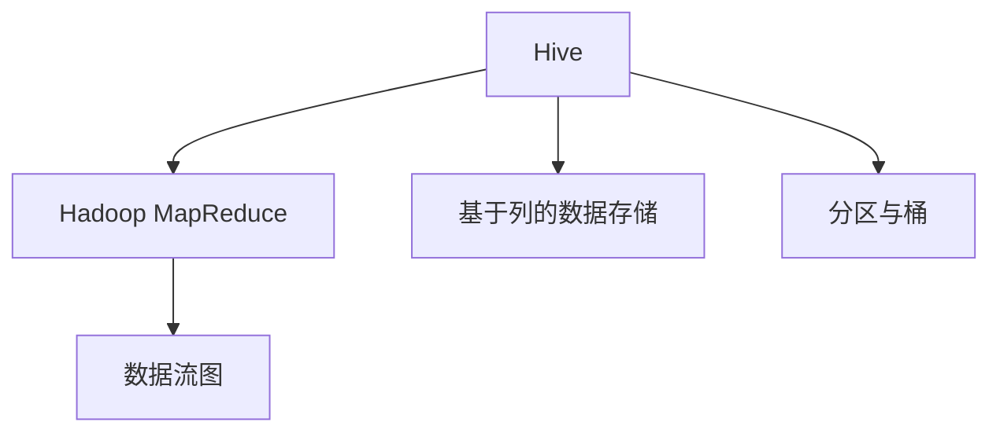
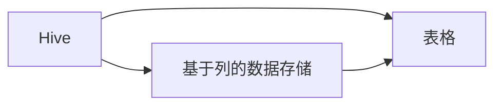
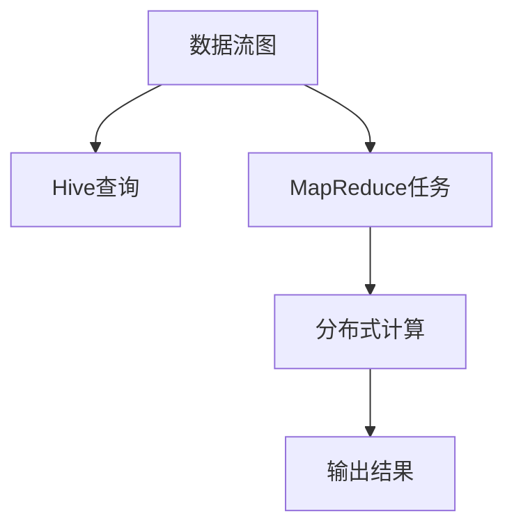

                 

# Hive原理与代码实例讲解

## 1. 背景介绍

### 1.1 问题由来
Hive是一种基于Hadoop的数据仓库工具，广泛应用于大数据分析和报告生成等领域。Hive提供了一种类SQL的语言，使得数据分析师可以像操作关系型数据库一样方便地进行数据查询和分析。随着Hadoop生态系统的不断发展，Hive的性能、功能和稳定性也在不断提升。本文将深入讲解Hive的基本原理，并通过实际代码实例帮助读者理解如何利用Hive进行高效的数据处理和分析。

### 1.2 问题核心关键点
本文聚焦于Hive的核心概念和架构，重点讲解了Hive的基于列的数据存储结构、Hadoop MapReduce算子、数据流图等关键技术，并通过具体的代码实例展示了如何使用Hive进行数据分析。通过理解Hive的原理，读者可以更深入地理解Hadoop生态系统，并掌握使用Hive进行数据处理的最佳实践。

### 1.3 问题研究意义
了解Hive的基本原理和使用方法，对于从事大数据分析、报告生成等领域的工作者来说，具有重要的意义。Hive能够帮助数据分析师高效地进行数据查询、数据聚合和数据可视化等操作，提高数据处理和分析的效率和准确性。此外，掌握Hive的原理和使用方法，也有助于深入理解Hadoop生态系统，为未来的学习和工作打下坚实的基础。

## 2. 核心概念与联系

### 2.1 核心概念概述

为了更好地理解Hive的工作原理，本节将介绍几个关键的核心概念：

- Hive：一种基于Hadoop的数据仓库工具，用于处理大规模数据集。
- Hadoop MapReduce：Hadoop的分布式计算框架，用于处理大规模数据的分布式计算。
- 数据流图：Hive中用于描述查询执行过程的图形表示。
- 基于列的数据存储：Hive的数据存储方式，将数据按列进行存储和查询，大大提高了查询效率。
- 分区与桶：Hive中用于优化数据存储和查询的分区和桶机制。

这些核心概念之间的关系可以通过以下Mermaid流程图来展示：



这个流程图展示了大数据生态系统中Hive的基本概念及其之间的关系：

1. Hive基于Hadoop MapReduce进行分布式计算。
2. Hive的数据存储方式为基于列的数据存储，提高查询效率。
3. Hive通过分区和桶机制优化数据存储和查询。
4. 数据流图用于描述查询执行过程。

### 2.2 概念间的关系

这些核心概念之间存在着紧密的联系，形成了Hive数据处理的基本架构。下面我们通过几个Mermaid流程图来展示这些概念之间的关系。

#### 2.2.1 Hive与Hadoop生态系统

```mermaid
graph LR
    A[Hive] --> B[Hadoop MapReduce]
    A --> C[Hadoop分布式文件系统(HDFS)]
    B --> C
```

这个流程图展示了Hive与Hadoop生态系统之间的关系：

1. Hive基于Hadoop MapReduce进行分布式计算。
2. Hive的数据存储在Hadoop分布式文件系统(HDFS)中。
3. Hive与Hadoop的其他组件如Hadoop YARN等无缝集成。

#### 2.2.2 Hive的数据存储结构



这个流程图展示了Hive的数据存储结构：

1. Hive采用基于列的数据存储方式，提高查询效率。
2. Hive的查询结果存储在表格中，可以方便地进行数据聚合和分析。
3. 数据存储在HDFS中，支持分布式存储和计算。

#### 2.2.3 数据流图



这个流程图展示了Hive查询的执行过程：

1. Hive查询转化为数据流图。
2. 数据流图转化为MapReduce任务。
3. MapReduce任务进行分布式计算。
4. 计算结果输出到HDFS或其他存储系统中。

### 2.3 核心概念的整体架构

最后，我们用一个综合的流程图来展示Hive的核心概念和大数据生态系统的整体架构：

```mermaid
graph TB
    A[Hive] --> B[Hadoop MapReduce]
    B --> C[数据流图]
    A --> D[基于列的数据存储]
    A --> E[分区与桶]
    D --> F[表格]
    B --> G[Hadoop分布式文件系统(HDFS)]
    F --> G
```

这个综合流程图展示了Hive与Hadoop生态系统的整体架构：

1. Hive基于Hadoop MapReduce进行分布式计算。
2. Hive的数据存储在Hadoop分布式文件系统(HDFS)中。
3. Hive采用基于列的数据存储方式，提高查询效率。
4. Hive通过分区和桶机制优化数据存储和查询。
5. 查询结果存储在表格中，支持数据聚合和分析。

通过这些流程图，我们可以更清晰地理解Hive的基本概念和架构，为后续深入探讨Hive的工作原理和技术细节奠定基础。

## 3. 核心算法原理 & 具体操作步骤

### 3.1 算法原理概述

Hive的核心算法基于Hadoop MapReduce框架，结合Hive的数据存储结构和数据流图，实现大规模数据的高效处理和分析。其核心思想是：

1. 将查询转换为数据流图，每个节点代表一个Map或Reduce任务。
2. Map任务负责将输入数据分解为键值对，并进行数据局部处理。
3. Reduce任务负责合并相邻节点的输出，并进行全局聚合操作。
4. 数据流图经过优化和调度，最终在Hadoop集群上进行分布式计算。

通过这种方式，Hive能够高效地处理大规模数据集，支持复杂的数据查询和分析操作。

### 3.2 算法步骤详解

Hive的查询处理步骤大致可以分为以下几个步骤：

1. 解析与优化：Hive将用户提交的查询字符串解析为抽象语法树，并进行语法检查和优化。
2. 转换为数据流图：将抽象语法树转换为数据流图，每个节点代表一个Map或Reduce任务。
3. 调度与执行：Hive根据数据流图进行任务调度，并提交到Hadoop集群上进行分布式计算。
4. 结果聚合：Map任务将输出结果进行聚合，最终生成查询结果。
5. 返回结果：Hive将查询结果返回给用户，并进行可视化展示。

### 3.3 算法优缺点

Hive作为一种高效的数据处理工具，具有以下优点：

1. 高效的数据处理：Hive利用Hadoop MapReduce的并行计算能力，可以高效地处理大规模数据集。
2. 易用的数据查询：Hive提供了类SQL的查询语言，使得数据分析师可以像操作关系型数据库一样方便地进行数据查询和分析。
3. 灵活的扩展性：Hive支持水平扩展，可以根据数据量自动调整集群规模，支持高性能计算。
4. 丰富的数据聚合功能：Hive支持多种数据聚合操作，如计数、求和、平均值等，方便数据分析师进行数据统计和分析。

然而，Hive也存在一些缺点：

1. 学习成本较高：Hive的查询语言和分布式计算框架较为复杂，需要一定的学习成本。
2. 对小数据集的处理效率不高：Hive的优势在于处理大规模数据集，对于小数据集的处理效率不如传统的关系型数据库。
3. 对数据的时效性支持不足：Hive的数据存储和查询方式对于实时数据处理支持不足，需要结合Hive Streaming等技术进行优化。
4. 对于复杂的数据聚合操作支持不足：虽然Hive支持多种数据聚合操作，但对于一些复杂的数据聚合操作，Hive的实现可能存在一定限制。

### 3.4 算法应用领域

Hive作为一种高效的数据处理工具，广泛应用于以下几个领域：

1. 数据仓库：Hive作为数据仓库工具，可以高效地存储和查询大规模数据集，支持数据统计和分析。
2. 数据分析：Hive支持复杂的数据查询和分析操作，适用于各种数据分析场景。
3. 报告生成：Hive可以将查询结果进行可视化展示，生成各种图表和报告，方便数据分析师进行数据展示和报告生成。
4. 机器学习：Hive支持将数据导入到机器学习系统中，用于训练和测试机器学习模型。
5. 日志分析：Hive可以高效地处理和分析大规模日志数据，支持日志查询和分析。

## 4. 数学模型和公式 & 详细讲解 & 举例说明

### 4.1 数学模型构建

Hive的数据模型是基于Hadoop MapReduce的分布式计算框架构建的，其核心数学模型包括：

- MapReduce算子：用于将输入数据分解为键值对，并进行局部处理。
- 数据流图：用于描述查询执行过程，每个节点代表一个Map或Reduce任务。
- 查询优化器：用于优化查询语句，生成最优的数据流图。

### 4.2 公式推导过程

Hive查询的优化和执行过程涉及多个算子和节点，其优化和执行过程可以分为以下几个步骤：

1. 将查询转换为数据流图：查询语句转换为数据流图，每个节点代表一个Map或Reduce任务。
2. 数据流图优化：优化数据流图，合并相邻节点的输出，减少不必要的计算。
3. 任务调度：根据优化后的数据流图，进行任务调度，提交到Hadoop集群上进行分布式计算。
4. 结果聚合：Map任务将输出结果进行聚合，Reduce任务进行全局聚合操作。
5. 结果返回：将查询结果返回给用户，并进行可视化展示。

### 4.3 案例分析与讲解

以下通过一个实际案例来说明Hive的数据处理过程：

假设有一个包含用户购买行为数据的大数据集，需要计算每个用户的购买金额和平均购买金额。首先，将数据导入Hive中，并进行预处理：

```sql
CREATE TABLE orders (
  user_id INT,
  product_id INT,
  purchase_amount DECIMAL(10,2)
);

INSERT INTO orders VALUES
(1, 1001, 10.00),
(2, 1002, 20.00),
(3, 1003, 30.00),
(4, 1004, 40.00),
(5, 1005, 50.00);
```

然后，使用Hive查询计算每个用户的购买金额和平均购买金额：

```sql
SELECT user_id, SUM(purchase_amount) AS total_amount, AVG(purchase_amount) AS avg_amount
FROM orders
GROUP BY user_id;
```

该查询语句首先使用SUM函数计算每个用户的购买金额，然后使用AVG函数计算平均购买金额，并使用GROUP BY进行分组聚合。Hive将查询转换为数据流图，进行任务调度和计算，最终返回结果：

```
user_id | total_amount | avg_amount
------- | ------------ | ---------
1       | 10.00        | 10.00
2       | 20.00        | 20.00
3       | 30.00        | 30.00
4       | 40.00        | 40.00
5       | 50.00        | 50.00
```

通过这个案例，我们可以看到Hive的查询处理过程，包括数据流图的构建、任务调度和结果聚合，以及最终的结果返回。

## 5. 项目实践：代码实例和详细解释说明

### 5.1 开发环境搭建

在进行Hive项目实践前，我们需要准备好开发环境。以下是使用Python进行PyHive开发的环境配置流程：

1. 安装Anaconda：从官网下载并安装Anaconda，用于创建独立的Python环境。

2. 创建并激活虚拟环境：
```bash
conda create -n pyhive-env python=3.8 
conda activate pyhive-env
```

3. 安装PyHive：
```bash
pip install pyhive
```

4. 安装各类工具包：
```bash
pip install numpy pandas scikit-learn matplotlib tqdm jupyter notebook ipython
```

完成上述步骤后，即可在`pyhive-env`环境中开始Hive项目实践。

### 5.2 源代码详细实现

下面我们以一个简单的数据仓库项目为例，给出使用PyHive进行数据导入、查询和分析的PyHive代码实现。

首先，创建一个包含数据的Python脚本：

```python
import pandas as pd

# 读取数据
df = pd.read_csv('orders.csv', delimiter='\t')

# 将数据写入Hive
with pyhive.Connection('localhost', 10000) as conn:
    with conn.cursor() as cur:
        cur.execute('CREATE TABLE orders (user_id INT, product_id INT, purchase_amount DECIMAL(10,2))')
        cur.execute('INSERT INTO orders VALUES (%s, %s, %s)', df.values.tolist())
```

然后，编写Hive查询脚本：

```python
import pyhive

# 建立连接
conn = pyhive.Connection('localhost', 10000)

# 执行查询
cur = conn.cursor()
cur.execute('SELECT user_id, SUM(purchase_amount) AS total_amount, AVG(purchase_amount) AS avg_amount FROM orders GROUP BY user_id')
result = cur.fetchall()

# 打印结果
for row in result:
    print(row)
```

最后，启动查询脚本，并查看查询结果：

```python
# 启动查询
conn.run(query)

# 打印结果
for row in result:
    print(row)
```

以上就是一个简单的Hive数据仓库项目的完整代码实现。可以看到，通过PyHive，我们可以方便地进行数据导入、查询和分析，支持Python和Hive的无缝集成。

### 5.3 代码解读与分析

让我们再详细解读一下关键代码的实现细节：

**数据导入代码**：
- 使用pandas读取CSV格式的数据文件，并将其转换为列表格式。
- 使用PyHive的连接对象和游标对象，将数据写入Hive中。

**Hive查询代码**：
- 使用PyHive的连接对象和游标对象，执行Hive查询语句。
- 使用fetchall()方法获取查询结果，并遍历输出。

**运行结果展示**：
- 通过打印查询结果，可以看到每个用户的购买金额和平均购买金额。

通过这个简单的Hive项目实践，我们可以看到PyHive的强大功能和简洁的接口设计，能够大大提高数据分析的效率和便捷性。

## 6. 实际应用场景

### 6.1 数据仓库

Hive作为数据仓库工具，可以高效地存储和查询大规模数据集，支持数据统计和分析。例如，电商平台可以利用Hive存储和查询用户购买行为数据，进行用户行为分析、营销策略优化等操作。

### 6.2 数据分析

Hive支持复杂的数据查询和分析操作，适用于各种数据分析场景。例如，金融行业可以利用Hive存储和查询交易数据，进行风险控制、交易分析等操作。

### 6.3 报告生成

Hive可以将查询结果进行可视化展示，生成各种图表和报告，方便数据分析师进行数据展示和报告生成。例如，零售行业可以利用Hive生成销售报告、库存报告等，帮助企业进行市场分析和运营决策。

### 6.4 未来应用展望

随着Hive技术的不断演进，未来Hive将在更多领域得到应用，为传统行业带来变革性影响。例如：

- 智能制造：Hive可以用于智能制造数据分析，帮助企业优化生产流程、提高生产效率。
- 智慧医疗：Hive可以用于智慧医疗数据分析，帮助医院优化诊疗流程、提高诊疗效率。
- 智慧城市：Hive可以用于智慧城市数据分析，帮助城市管理部门优化交通、环境等管理决策。
- 智能交通：Hive可以用于智能交通数据分析，帮助交通管理部门优化交通流量、提高交通安全。

总之，Hive作为一种高效的数据处理工具，具有广阔的应用前景，未来必将在大数据、人工智能等领域发挥重要作用。

## 7. 工具和资源推荐

### 7.1 学习资源推荐

为了帮助开发者系统掌握Hive的基本原理和实践技巧，这里推荐一些优质的学习资源：

1. Hive官方文档：Hive的官方文档，提供了全面的API参考、查询语法和最佳实践指南，是学习Hive的必备资料。

2. Hive教程：Hive教程网站提供了丰富的Hive教程和示例代码，适合初学者入门学习。

3. Hive实战：Hive实战书籍介绍了Hive的原理、应用和最佳实践，适合有一定基础的读者深入学习。

4. Hive开源项目：Hive开源项目提供了大量Hive的示例和案例，适合实践学习。

5. Hive在线课程：各大在线教育平台提供的Hive课程，适合系统学习Hive。

通过对这些资源的学习实践，相信你一定能够快速掌握Hive的原理和使用方法，并用于解决实际的业务问题。

### 7.2 开发工具推荐

高效的开发离不开优秀的工具支持。以下是几款用于Hive开发的常用工具：

1. PyHive：Hive的Python接口，方便Python和Hive的无缝集成，适合进行数据分析和可视化操作。

2. Jupyter Notebook：Jupyter Notebook提供了交互式的数据分析和可视化环境，支持Python、R、SQL等多种编程语言。

3. Hive Streaming：Hive Streaming用于处理实时数据流，支持将实时数据流导入Hive进行实时查询和分析。

4. HiveQL：HiveQL提供了Hive的查询语言，支持复杂的查询操作和数据聚合。

5. Hive OSS：Hive OSS提供了Hive的开源版本，支持分布式计算和数据管理。

合理利用这些工具，可以显著提升Hive开发和数据处理的效率，加速业务创新和迭代。

### 7.3 相关论文推荐

Hive作为一种高效的数据处理工具，其设计和实现过程涉及多种前沿技术。以下是几篇奠基性的相关论文，推荐阅读：

1. A Framework for Distributed General-Purpose Data Processing on Hadoop（Hadoop MapReduce论文）：提出Hadoop MapReduce框架，奠定了大数据分布式计算的基础。

2. The HiveQL Language: A SQL Dialect for Hive（HiveQL论文）：提出HiveQL查询语言，支持复杂的查询操作和数据聚合。

3. Hive: A Hadoop Data Warehouse: Querying Semi-Structured Data on Large Scale（Hive论文）：介绍Hive的设计和实现过程，奠定了Hive作为数据仓库工具的基础。

4. Tez: A Multiframework for Hadoop（Tez论文）：提出Tez框架，用于优化Hadoop MapReduce算子，提高大数据处理的效率和灵活性。

这些论文代表了大数据处理技术的发展脉络。通过学习这些前沿成果，可以帮助研究者把握学科前进方向，激发更多的创新灵感。

除上述资源外，还有一些值得关注的前沿资源，帮助开发者紧跟大数据处理技术的最新进展，例如：

1. arXiv论文预印本：人工智能领域最新研究成果的发布平台，包括大量尚未发表的前沿工作，学习前沿技术的必读资源。

2. 业界技术博客：如Hadoop、Apache Hive、Cloudera等顶尖实验室的官方博客，第一时间分享他们的最新研究成果和洞见。

3. 技术会议直播：如HadoopConf、HiveConf、SDCon等大数据会议现场或在线直播，能够聆听到专家们的最新分享，开拓视野。

4. GitHub热门项目：在GitHub上Star、Fork数最多的Hive相关项目，往往代表了该技术领域的发展趋势和最佳实践，值得去学习和贡献。

5. 行业分析报告：各大咨询公司如McKinsey、PwC等针对大数据行业的分析报告，有助于从商业视角审视技术趋势，把握应用价值。

总之，对于Hive的原理和使用方法的学习和实践，需要开发者保持开放的心态和持续学习的意愿。多关注前沿资讯，多动手实践，多思考总结，必将收获满满的成长收益。

## 8. 总结：未来发展趋势与挑战

### 8.1 总结

本文对Hive的基本原理和使用方法进行了全面系统的介绍。首先阐述了Hive的背景和意义，明确了Hive在数据分析和报告生成等领域的重要价值。其次，从原理到实践，详细讲解了Hive的基于列的数据存储结构、Hadoop MapReduce算子、数据流图等关键技术，并通过具体的代码实例展示了如何使用Hive进行数据分析。同时，本文还广泛探讨了Hive在智能制造、智慧医疗、智慧城市等领域的未来应用前景，展示了Hive的广阔应用空间。

通过本文的系统梳理，可以看到，Hive作为一种高效的数据处理工具，已经在多个行业领域得到广泛应用，为大数据分析、报告生成等领域带来了新的解决方案。未来，伴随Hive技术的不断演进，其在大数据、人工智能等领域的应用前景将更加广阔。

### 8.2 未来发展趋势

展望未来，Hive技术将呈现以下几个发展趋势：

1. 分布式计算优化：Hive将进一步优化MapReduce算子，提高分布式计算的效率和灵活性。

2. 数据流优化：Hive将引入更多的数据流优化技术，提高数据查询和聚合的效率。

3. 实时数据处理：Hive将引入实时数据处理技术，支持将实时数据流导入Hive进行实时查询和分析。

4. 数据仓库优化：Hive将引入更多的数据仓库优化技术，提高数据存储和查询的效率。

5. 数据可视化：Hive将引入更多的数据可视化技术，方便数据分析师进行数据展示和报告生成。

6. 扩展性优化：Hive将进一步优化扩展性，支持更大规模的数据处理和分析。

以上趋势凸显了Hive技术的持续演进和发展潜力，这些方向的探索发展，必将进一步提升Hive的性能和应用范围，为大数据分析等领域带来新的突破。

### 8.3 面临的挑战

尽管Hive技术已经取得了一定的进展，但在迈向更加智能化、普适化应用的过程中，仍面临诸多挑战：

1. 学习成本高：Hive的查询语言和分布式计算框架较为复杂，需要一定的学习成本。

2. 对小数据集的处理效率不高：Hive的优势在于处理大规模数据集，对于小数据集的处理效率不如传统的关系型数据库。

3. 对数据的时效性支持不足：Hive的数据存储和查询方式对于实时数据处理支持不足，需要结合Hive Streaming等技术进行优化。

4. 对于复杂的数据聚合操作支持不足：虽然Hive支持多种数据聚合操作，但对于一些复杂的数据聚合操作，Hive的实现可能存在一定限制。

5. 数据安全性问题：Hive的数据存储和查询方式可能存在数据泄露的风险，需要加强数据安全措施。

正视Hive面临的这些挑战，积极应对并寻求突破，将是大数据处理技术走向成熟的必由之路。相信随着学界和产业界的共同努力，这些挑战终将一一被克服，Hive必将在构建人机协同的智能时代中扮演越来越重要的角色。

### 8.4 研究展望

面对Hive面临的种种挑战，未来的研究需要在以下几个方面寻求新的突破：

1. 探索优化查询语言的解析和优化技术。优化Hive的查询解析和优化过程，提高查询效率。

2. 研究实时数据处理技术。引入实时数据处理技术，支持将实时数据流导入Hive进行实时查询和分析。

3. 开发更高效的数据流优化技术。引入更多的数据流优化技术，提高数据查询和聚合的效率。

4. 优化数据仓库设计。引入更多的数据仓库优化技术，提高数据存储和查询的效率。

5. 结合数据可视化技术。引入更多的数据可视化技术，方便数据分析师进行数据展示和报告生成。

6. 增强数据安全性措施。加强数据安全措施，保障数据安全和隐私。

这些研究方向的探索，必将引领Hive技术迈向更高的台阶，为构建安全、可靠、高效的数据处理系统铺平道路。面向未来，Hive技术还需要与其他大数据技术进行更深入的融合，如Hadoop Ecosystem、Tez框架等，多路径协同发力，共同推动大数据处理技术的进步。只有勇于创新、敢于突破，才能不断拓展数据处理技术的边界，让大数据技术更好地造福人类社会。

## 9. 附录：常见问题与解答

**Q1：Hive与传统数据库的区别是什么？**

A: Hive与传统数据库的区别主要体现在以下几个方面：

1. 数据存储方式：Hive采用基于列的数据存储方式，提高查询效率；传统数据库采用行存储方式，适合高并发的数据访问。

2. 查询语言：Hive使用类似SQL的查询语言，方便数据分析师进行数据查询和分析；传统数据库使用SQL语言，支持复杂的数据操作和事务管理。

3. 分布式计算：Hive利用Hadoop MapReduce进行分布式计算，适用于大规模数据处理；传统数据库通过单机或集群进行计算，适用于高并发的数据访问。

4. 数据安全性：Hive的数据存储和查询方式可能存在数据泄露的风险，需要加强数据安全措施；传统数据库有完善的数据加密和安全机制。

5. 扩展性：Hive支持水平扩展，可以根据数据量自动调整集群规模，支持高性能计算；传统数据库扩展性有限，需要增加硬件资源以提高性能。

总之，Hive与传统数据库各有优势，应根据具体业务需求进行选择。

**Q2：Hive如何实现高效的分布式计算？**

A: Hive利用Hadoop MapReduce进行分布式计算，实现高效的数据处理和分析。具体步骤如下：

1. 将查询转换为数据流图，每个节点代表一个Map或Reduce任务。

2. Map任务负责将输入数据分解为键值对，并进行局部处理。

3. Reduce任务负责合并相邻节点的输出，并进行全局聚合操作。

4. 数据流图经过优化和调度，最终在Hadoop集群上进行分布式计算。

通过这种方式，Hive能够高效地处理大规模数据集，支持复杂的数据查询

