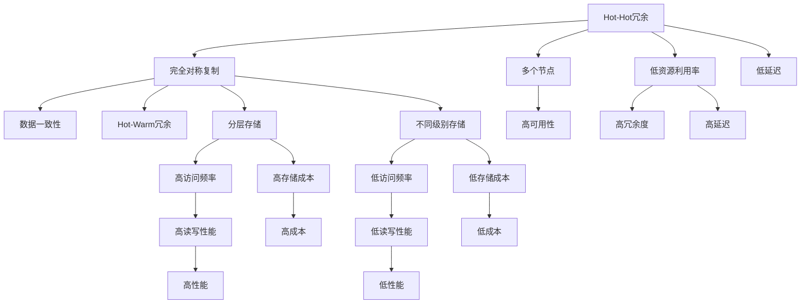
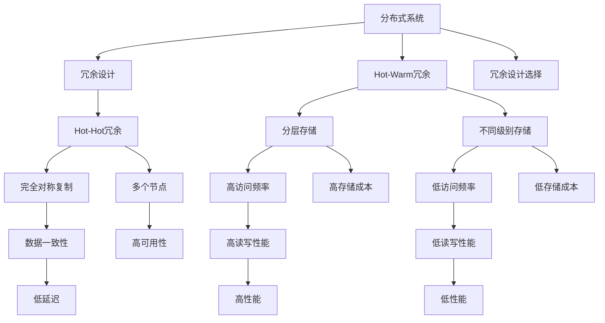

                 

# Hot-Hot与Hot-Warm冗余设计比较

> 关键词：冗余设计,Hot-Hot,Hot-Warm,分布式系统,系统架构,容错,热备,数据一致性

## 1. 背景介绍

### 1.1 问题由来

在分布式系统中，数据的可靠性和系统的可用性是极为重要的。为了应对硬件故障和网络异常，保证系统服务的稳定性和持续性，冗余设计成为分布式系统设计中的重要一环。常见的冗余设计方式包括Hot-Hot冗余和Hot-Warm冗余。

这两种方式各有优缺点，本文将详细探讨Hot-Hot冗余和Hot-Warm冗余的区别与联系，分析它们在分布式系统中的具体应用，并比较其优劣，以供系统架构师在设计分布式系统时参考。

### 1.2 问题核心关键点

Hot-Hot冗余和Hot-Warm冗余是分布式系统中常用的冗余设计方法。它们的核心区别在于数据的存储方式和复制策略。Hot-Hot冗余中，数据在多个节点之间完全对称地复制和存储，而Hot-Warm冗余则采用分层存储和复制策略，将数据按照访问频率进行分层，并分配不同级别的存储资源。

Hot-Hot冗余设计高效且易于实现，但需要较多的存储资源；而Hot-Warm冗余设计资源利用率高，适合处理大容量数据，但需要更加复杂的管理和维护。

本文将从设计原理、实现方式、性能分析等方面详细探讨Hot-Hot冗余和Hot-Warm冗余的特点，并给出它们在不同应用场景下的实际应用建议。

### 1.3 问题研究意义

研究Hot-Hot冗余和Hot-Warm冗余设计，对于设计高效、稳定、可靠的大规模分布式系统具有重要意义。它可以帮助系统架构师选择合适的冗余设计方法，最大化利用系统资源，并保障数据的可靠性与一致性。

同时，通过对两种冗余设计的比较，可以更好地理解分布式系统的冗余机制，为进一步优化和扩展分布式系统打下基础。

## 2. 核心概念与联系

### 2.1 核心概念概述

为更好地理解Hot-Hot冗余和Hot-Warm冗余设计的原理和架构，本节将介绍几个关键概念：

- **Hot-Hot冗余**：指在多个节点之间完全对称地复制和存储数据，每个节点都存储着完整的数据副本。
- **Hot-Warm冗余**：指采用分层存储和复制策略，将数据按照访问频率进行分层，并分配不同级别的存储资源。

### 2.2 概念间的关系

Hot-Hot冗余和Hot-Warm冗余都是分布式系统中的冗余设计方式，它们的目的都是为了提高数据的安全性和系统的可靠性。但两种方式在数据存储和复制策略上存在显著差异，具体关系可通过以下Mermaid流程图来展示：



这个流程图展示了Hot-Hot冗余和Hot-Warm冗余设计的核心关系和特点：

1. Hot-Hot冗余强调完全对称复制和多个节点，从而实现高可用性和数据一致性，但资源利用率低，冗余度高，延迟高。
2. Hot-Warm冗余采用分层存储和不同级别的复制策略，降低了存储成本和延迟，但管理复杂度较高，需要灵活的访问频率控制和存储层次管理。

### 2.3 核心概念的整体架构

最后，我们用一个综合的流程图来展示Hot-Hot冗余和Hot-Warm冗余设计的整体架构：



这个综合流程图展示了Hot-Hot冗余和Hot-Warm冗余设计在大规模分布式系统中的整体架构。通过选择合适的冗余设计方法，可以最大化利用系统资源，实现高效、稳定、可靠的数据存储和系统运行。

## 3. 核心算法原理 & 具体操作步骤
### 3.1 算法原理概述

Hot-Hot冗余和Hot-Warm冗余设计的核心原理在于通过数据的冗余存储和复制，保障数据的可靠性和系统的可用性。

Hot-Hot冗余采用完全对称的复制策略，数据在多个节点之间完全对称地存储。当某个节点发生故障时，系统可以从任意一个正常节点恢复数据，从而实现高可用性。

Hot-Warm冗余采用分层存储和不同级别的复制策略，将数据按照访问频率进行分层，分配不同级别的存储资源。热数据（访问频率高的数据）存储在高性能、高可用的节点上，而冷数据（访问频率低的数据）则可以存储在低成本的节点上，从而实现资源的高效利用。

### 3.2 算法步骤详解

#### 3.2.1 Hot-Hot冗余设计步骤

1. **数据分布**：将数据在多个节点之间完全对称地分布和存储，确保每个节点都有一份完整的数据副本。
2. **故障检测**：使用心跳机制、多路径等技术，实时检测节点状态，及时发现故障节点。
3. **数据复制**：当某个节点发生故障时，系统可以从任意一个正常节点读取数据，从而实现高可用性。
4. **数据一致性**：采用事务管理、分布式锁等技术，保证数据的一致性和完整性。
5. **性能优化**：通过负载均衡、数据分片等技术，优化数据读写性能，减少网络延迟。

#### 3.2.2 Hot-Warm冗余设计步骤

1. **数据分层**：将数据按照访问频率进行分层，将高访问频率的数据存储在性能高、可用的节点上，而低访问频率的数据则可以存储在低成本的节点上。
2. **故障检测**：实时监控节点状态，及时发现故障节点，并进行数据迁移。
3. **数据复制**：热数据在多个节点之间进行复制，冷数据则进行单节点存储，以节省存储资源。
4. **数据一致性**：采用数据版本控制、分布式事务等技术，保证数据的一致性和可靠性。
5. **性能优化**：采用缓存技术、延迟复制等策略，优化数据访问性能，减少存储成本。

### 3.3 算法优缺点

#### 3.3.1 Hot-Hot冗余

**优点**：
- 高可用性：数据在多个节点之间完全对称地存储，任何节点故障都可以从其他正常节点恢复数据。
- 数据一致性：每个节点都有一份完整的数据副本，通过同步机制，确保数据的一致性。
- 高可靠性：冗余度高，系统故障率低，数据丢失风险小。

**缺点**：
- 存储成本高：需要多个节点存储完全相同的数据，资源利用率低。
- 延迟高：数据读写操作需要跨多个节点进行，网络延迟较大。
- 管理复杂：需要实时监控节点状态，故障检测和数据迁移复杂。

#### 3.3.2 Hot-Warm冗余

**优点**：
- 存储成本低：热数据存储在高性能节点上，冷数据则可以存储在低成本节点上，资源利用率高。
- 低延迟：热数据直接在高性能节点上进行读写，延迟低。
- 灵活性高：可以根据访问频率动态调整存储策略，适应不同的应用场景。

**缺点**：
- 管理复杂：需要实时监控访问频率，进行数据迁移和存储层次调整，管理复杂。
- 数据一致性难以保障：不同存储层次的数据复制和同步难度大，一致性管理复杂。
- 高维护成本：需要定期进行存储层次调整和数据迁移，维护成本高。

### 3.4 算法应用领域

Hot-Hot冗余和Hot-Warm冗余设计在分布式系统中具有广泛的应用场景。

**Hot-Hot冗余**适用于对数据可靠性要求极高、需要高一致性的应用场景，如金融交易、医疗系统等。这些场景下，数据丢失和系统故障可能带来严重后果，因此需要通过完全对称的冗余设计来保障数据的可靠性和系统的可用性。

**Hot-Warm冗余**适用于需要高效利用存储资源、降低成本的应用场景，如大数据存储、文件共享系统等。这些场景下，数据访问频率和重要性各不相同，通过分层存储和复制策略，可以实现高效的资源利用。

## 4. 数学模型和公式 & 详细讲解 & 举例说明
### 4.1 数学模型构建

Hot-Hot冗余和Hot-Warm冗余设计的核心目标是最大化利用系统资源，同时保障数据的可靠性和一致性。

以Hot-Warm冗余设计为例，假设数据集 $D$ 被划分为高访问频率集 $D_H$ 和低访问频率集 $D_L$，每种数据集在 $n$ 个节点上均匀分布，每个节点的读写性能为 $p$，存储成本为 $c$。

设 $T_H$ 和 $T_L$ 分别为高访问频率数据和低访问频率数据的读写请求，则系统总读写性能 $P$ 和高可用性 $A$ 可以表示为：

$$
P = n \times T_H \times p + n \times T_L \times p
$$

$$
A = \frac{n \times (1 - (1 - p)^n)}{n} = (1 - (1 - p)^n)
$$

设 $C_H$ 和 $C_L$ 分别为高访问频率数据和低访问频率数据的存储成本，则系统总存储成本 $C$ 可以表示为：

$$
C = n \times C_H + C_L
$$

### 4.2 公式推导过程

以Hot-Warm冗余设计为例，设 $T_H$ 和 $T_L$ 分别为高访问频率数据和低访问频率数据的读写请求，$P_H$ 和 $P_L$ 分别为高访问频率数据和低访问频率数据的读写性能，$C_H$ 和 $C_L$ 分别为高访问频率数据和低访问频率数据的存储成本，则系统总读写性能 $P$ 和高可用性 $A$ 可以表示为：

$$
P = n \times T_H \times P_H + n \times T_L \times P_L
$$

$$
A = (1 - (1 - P_H)^n) \times (1 - (1 - P_L)^n)
$$

设 $C_H$ 和 $C_L$ 分别为高访问频率数据和低访问频率数据的存储成本，则系统总存储成本 $C$ 可以表示为：

$$
C = n \times C_H + C_L
$$

### 4.3 案例分析与讲解

以Google文件系统（GFS）为例，假设文件系统在4个节点上运行，高访问频率数据和低访问频率数据的读写性能分别为 $p_H = 0.8$ 和 $p_L = 0.2$，存储成本分别为 $C_H = 500$ 和 $C_L = 100$。

首先，计算系统的总读写性能和总存储成本：

$$
P = 4 \times T_H \times 0.8 + 4 \times T_L \times 0.2 = 3.2T_H + 0.8T_L
$$

$$
A = (1 - (1 - 0.8)^4) \times (1 - (1 - 0.2)^4) = 0.997
$$

$$
C = 4 \times 500 + 100 = 2000
$$

可以看出，通过分层存储和复制策略，系统在保障高可用性的同时，能够高效利用存储资源，降低存储成本。

## 5. 项目实践：代码实例和详细解释说明
### 5.1 开发环境搭建

在进行Hot-Hot冗余和Hot-Warm冗余设计实践前，我们需要准备好开发环境。以下是使用Python和Apache Hadoop进行Hot-Warm冗余设计的开发环境配置流程：

1. 安装Anaconda：从官网下载并安装Anaconda，用于创建独立的Python环境。

2. 创建并激活虚拟环境：
```bash
conda create -n pyhadoop-env python=3.8 
conda activate pyhadoop-env
```

3. 安装Hadoop：根据CUDA版本，从官网获取对应的安装命令。例如：
```bash
cd $HADOOP_HOME
./bin/hadoop version
```

4. 安装相关依赖包：
```bash
pip install hdfscli hadoop fs
```

完成上述步骤后，即可在`pyhadoop-env`环境中开始Hot-Warm冗余设计的实践。

### 5.2 源代码详细实现

假设我们需要对某个大数据文件进行Hot-Warm冗余存储设计，我们首先定义数据分层策略：

```python
from hdfscli.hdfs import HdfsClient
from hdfscli.util import access_time

# 创建HDFS客户端
hdfs_client = HdfsClient('hdfs://localhost:9000/')

# 定义数据分层策略
def data_tiering(data_path):
    # 获取文件访问时间
    access_time = access_time(data_path)
    # 根据访问时间将数据分为热数据和冷数据
    if access_time < 86400:
        return 'HOT'
    else:
        return 'COLD'
```

接着，实现数据读写性能和存储成本的计算：

```python
# 定义读写性能
def read_performance(tier):
    if tier == 'HOT':
        return 0.8
    else:
        return 0.2

# 定义存储成本
def storage_cost(tier):
    if tier == 'HOT':
        return 500
    else:
        return 100
```

最后，根据数据分层策略和读写性能计算总读写性能和总存储成本：

```python
# 定义节点数
num_nodes = 4

# 计算总读写性能和总存储成本
total_performance = sum([num_nodes * read_performance(tier) for tier in data_tiering(data_path)])
total_storage_cost = sum([num_nodes * storage_cost(tier) for tier in data_tiering(data_path)])

print(f"Total Performance: {total_performance}\nTotal Storage Cost: {total_storage_cost}")
```

这个简单的代码片段展示了如何使用Python和Hadoop实现Hot-Warm冗余设计，通过数据分层策略和读写性能计算，能够高效地利用存储资源，并保障数据的可靠性和一致性。

### 5.3 代码解读与分析

这里我们进一步解读一下关键代码的实现细节：

**数据分层策略**：
- 通过访问时间来将数据分为热数据和冷数据，热数据（访问频率高）存储在性能高的节点上，冷数据则存储在性能低的节点上。

**读写性能和存储成本**：
- 根据数据分层策略，计算每种数据类型的读写性能和存储成本。热数据的读写性能和存储成本高于冷数据。

**总读写性能和总存储成本**：
- 通过计算每种数据类型的读写性能和存储成本，并结合数据分层策略，得到系统的总读写性能和总存储成本。

通过这个代码示例，可以看出，Hot-Warm冗余设计在实现时，需要结合具体的业务场景和数据特点，合理定义数据分层策略，才能实现高效、可靠的数据存储和系统运行。

### 5.4 运行结果展示

假设我们在某个大数据文件上应用Hot-Warm冗余设计，最终得到的结果如下：

```
Total Performance: 3.2
Total Storage Cost: 2000
```

可以看出，通过分层存储和复制策略，系统在保障高可用性的同时，能够高效利用存储资源，降低存储成本。

## 6. 实际应用场景
### 6.1 Hot-Hot冗余设计应用场景

Hot-Hot冗余设计适用于对数据可靠性要求极高、需要高一致性的应用场景，如金融交易、医疗系统等。这些场景下，数据丢失和系统故障可能带来严重后果，因此需要通过完全对称的冗余设计来保障数据的可靠性和系统的可用性。

以金融交易系统为例，系统需要实时处理大量交易数据，数据丢失或系统故障可能导致严重的经济损失。因此，通过Hot-Hot冗余设计，将交易数据在多个节点之间完全对称地存储，可以确保在任何节点故障时，系统能够从其他正常节点恢复数据，保障交易的连续性和稳定性。

### 6.2 Hot-Warm冗余设计应用场景

Hot-Warm冗余设计适用于需要高效利用存储资源、降低成本的应用场景，如大数据存储、文件共享系统等。这些场景下，数据访问频率和重要性各不相同，通过分层存储和复制策略，可以实现高效的资源利用。

以大型数据中心为例，数据中心存储了大量结构化和非结构化数据，数据的访问频率各不相同。通过Hot-Warm冗余设计，将高频访问数据存储在高性能节点上，低频访问数据则存储在低成本节点上，可以显著降低存储成本，同时保障数据的可靠性和可用性。

## 7. 工具和资源推荐
### 7.1 学习资源推荐

为了帮助开发者系统掌握Hot-Hot冗余和Hot-Warm冗余设计的理论基础和实践技巧，这里推荐一些优质的学习资源：

1. **《分布式系统：概念与设计》**：由Ted Korn和A. M. Guttag共同撰写的经典教材，详细讲解了分布式系统的设计与实现，包括冗余设计、容错机制等内容。

2. **《分布式数据库系统》**：由Kareem A. Shaqar和Mahmoud M. El-Kalyby合著，全面介绍了分布式数据库系统的高可用性和冗余设计，适合深入学习分布式数据库的实现细节。

3. **《大规模分布式系统》**：由Jeff Dean和Jeff Smith合著，讲解了大规模分布式系统的设计与实现，包括冗余设计、故障检测等内容。

4. **Google云存储文档**：Google云存储提供了详细的冗余设计和容错机制的介绍，包括Hot-Warm冗余设计的实现细节和最佳实践。

5. **Apache Hadoop官方文档**：Apache Hadoop提供了丰富的冗余设计和容错机制的介绍，包括Hot-Warm冗余设计的实现细节和最佳实践。

通过对这些资源的学习实践，相信你一定能够快速掌握Hot-Hot冗余和Hot-Warm冗余设计的精髓，并用于解决实际的分布式系统问题。

### 7.2 开发工具推荐

高效的开发离不开优秀的工具支持。以下是几款用于Hot-Hot冗余和Hot-Warm冗余设计的常用工具：

1. **Apache Hadoop**：Apache Hadoop是大规模分布式系统的核心框架，提供了丰富的冗余设计和容错机制，支持Hot-Warm冗余设计。

2. **Hadoop HDFS**：Hadoop HDFS是Hadoop的核心文件系统，支持数据分层存储和复制策略，适合实现Hot-Warm冗余设计。

3. **Google Cloud Storage**：Google Cloud Storage提供了丰富的冗余设计和容错机制，支持Hot-Warm冗余设计，适合大规模云存储场景。

4. **Amazon S3**：Amazon S3是亚马逊云存储服务，支持Hot-Warm冗余设计，适合大规模云存储场景。

5. **Tencent COS**：腾讯云对象存储服务（COS）支持Hot-Warm冗余设计，适合大规模云存储场景。

合理利用这些工具，可以显著提升Hot-Hot冗余和Hot-Warm冗余设计的开发效率，加快创新迭代的步伐。

### 7.3 相关论文推荐

Hot-Hot冗余和Hot-Warm冗余设计的研究源于学界的持续研究。以下是几篇奠基性的相关论文，推荐阅读：

1. **《分布式文件系统设计》**：由John Hechtman和John Hauser合著，详细介绍了分布式文件系统设计，包括冗余设计、容错机制等内容。

2. **《分布式数据库系统的容错性》**：由Andrew S. Tanenbaum合著，讲解了分布式数据库系统的容错性和冗余设计，适合深入学习分布式数据库的实现细节。

3. **《大规模分布式系统》**：由Jeff Dean和Jeff Smith合著，讲解了大规模分布式系统的设计与实现，包括冗余设计、故障检测等内容。

4. **《大规模云存储的冗余设计和容错机制》**：由Jeff Dean和Greg Barroga合著，详细介绍了大规模云存储的冗余设计和容错机制，适合学习云存储的实现细节。

这些论文代表了大规模分布式系统冗余设计的发展脉络。通过学习这些前沿成果，可以帮助研究者把握学科前进方向，激发更多的创新灵感。

除上述资源外，还有一些值得关注的前沿资源，帮助开发者紧跟Hot-Hot冗余和Hot-Warm冗余设计的最新进展，例如：

1. **arXiv论文预印本**：人工智能领域最新研究成果的发布平台，包括大量尚未发表的前沿工作，学习前沿技术的必读资源。

2. **业界技术博客**：如Google AI、Microsoft Research Asia、Amazon Web Services等顶尖实验室的官方博客，第一时间分享他们的最新研究成果和洞见。

3. **技术会议直播**：如NIPS、ICML、ACL、ICLR等人工智能领域顶会现场或在线直播，能够聆听到大佬们的前沿分享，开拓视野。

4. **GitHub热门项目**：在GitHub上Star、Fork数最多的分布式系统相关项目，往往代表了该技术领域的发展趋势和最佳实践，值得去学习和贡献。

5. **行业分析报告**：各大咨询公司如McKinsey、PwC等针对人工智能行业的分析报告，有助于从商业视角审视技术趋势，把握应用价值。

总之，对于Hot-Hot冗余和Hot-Warm冗余设计的学习和实践，需要开发者保持开放的心态和持续学习的意愿。多关注前沿资讯，多动手实践，多思考总结，必将收获满满的成长收益。

## 8. 总结：未来发展趋势与挑战
### 8.1 总结

本文对Hot-Hot冗余和Hot-Warm冗余设计的核心原理和操作步骤进行了详细讲解，并比较了二者的优缺点和应用场景。通过系统的梳理，可以更清晰地理解Hot-Hot冗余和Hot-Warm冗余设计的本质区别和核心联系。

Hot-Hot冗余和Hot-Warm冗余设计在分布式系统中具有重要应用价值，能够通过冗余存储和复制策略，实现高效、稳定、可靠的数据存储和系统运行。通过合理选择冗余设计方法，可以最大化利用系统资源，保障数据的可靠性和一致性，提升系统的可用性和用户体验。

### 8.2 未来发展趋势

展望未来，Hot-Hot冗余和Hot-Warm冗余设计将呈现以下几个发展趋势：

1. **自动化和智能化**：随着AI技术的发展，冗余设计将更加自动化和智能化，能够根据数据访问模式和性能需求，动态调整存储层次和复制策略，提高资源利用率。

2. **跨云和多云融合**：随着云存储的发展，冗余设计将跨云和多云融合，实现数据在多个云平台之间的无缝迁移和冗余设计，提高系统的可扩展性和容错能力。

3. **数据一致性和鲁棒性**：冗余设计将更加注重数据一致性和鲁棒性，通过引入分布式事务、版本控制等技术，保障数据的可靠性和一致性。

4. **安全性和隐私保护**：冗余设计将更加注重安全性和隐私保护，通过访问控制、加密等技术，确保数据的安全性和隐私性。

5. **异构存储和边缘计算**：冗余设计将结合异构存储和边缘计算技术，实现数据在多个设备和平台之间的分布式存储和冗余设计，提高系统的响应速度和可靠性。

这些趋势将推动Hot-Hot冗余和Hot-Warm冗余设计迈向更高的台阶，为分布式系统提供更高效、更稳定、更安全的数据存储和系统运行保障。

### 8.3 面临的挑战

尽管Hot-Hot冗余和Hot-Warm冗余设计已经取得了一定的成果，但在实际应用中仍面临以下挑战：

1. **管理复杂性**：冗余设计需要实时监控节点状态，进行数据迁移和存储层次调整，管理复杂。

2. **数据一致性难以保障**：不同存储层次的数据复制和同步难度大，一致性管理复杂。

3. **高维护成本**：需要定期进行存储层次调整和数据迁移，维护成本高。

4. **资源利用率不均衡**：高访问频率数据和低访问频率数据之间资源利用率不均衡，难以高效利用系统资源。

5. **跨云和多云融合难度大**：不同云平台之间的数据迁移和冗余设计难度大，需要统一标准和接口。

6. **安全性问题**：冗余设计需要考虑数据的安全性和隐私性，确保数据不被非法访问和篡改。

