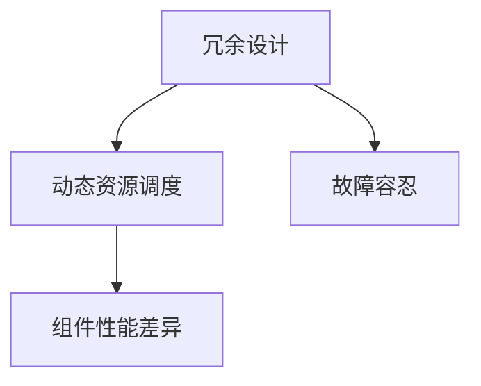
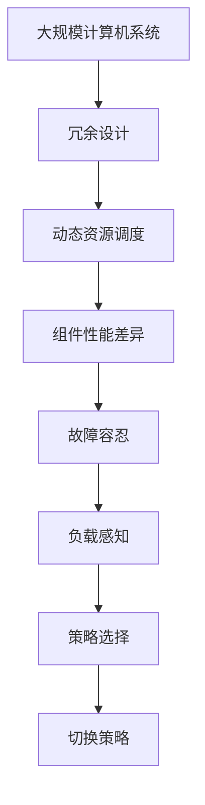

                 

# Hot-Hot冗余设计的实例分析

> 关键词：Hot-Hot冗余设计, 数据冗余, 软件可靠性, 硬件可靠性, 性能优化, 故障容忍

## 1. 背景介绍

### 1.1 问题由来
在现代大规模的计算机系统中，数据冗余（Redundancy）设计已被广泛应用于提高系统的可靠性。冗余设计的核心思想是在系统中引入多个相同或相似的组件（如数据副本、软件模块、硬件设备），以确保在单个组件故障时，系统仍能正常运行。然而，传统的冗余设计往往以牺牲性能为代价，导致系统效率较低。

Hot-Hot冗余设计（Hot-Hot Redundancy）是近年来提出的一种新型的冗余设计方法，旨在通过动态管理冗余资源，实现性能和可靠性之间的平衡。其基本思想是：在系统中设置多个功能相同但性能各异的组件，根据实际工作负载和系统状态，动态选择最合适的组件进行工作。

### 1.2 问题核心关键点
Hot-Hot冗余设计的关键点在于：

- 动态资源调度：根据系统负载和工作状态，动态调度冗余组件。
- 组件性能差异：冗余组件之间需要存在性能差异，以便根据实际需要选择合适的组件。
- 系统可靠性提升：冗余设计应能显著提高系统的故障容忍能力。
- 性能优化：应在不牺牲可靠性的前提下，尽可能提高系统性能。

### 1.3 问题研究意义
Hot-Hot冗余设计的引入，为计算机系统设计提供了一种新的解决方案，对于提高系统的可靠性和性能具有重要意义：

1. **故障容忍性提升**：Hot-Hot冗余设计通过动态调度，能在单个组件故障时，立即切换至备份组件，从而提高系统的故障容忍性。
2. **性能优化**：根据实际需求选择性能最佳的组件，避免不必要的高性能冗余组件的运行，实现性能优化。
3. **资源利用率提高**：动态管理冗余资源，避免资源浪费，提高资源利用率。
4. **系统灵活性增强**：通过灵活调度，系统能够快速适应不同的工作负载和环境变化。
5. **成本降低**：通过合理分配冗余资源，降低系统成本。

## 2. 核心概念与联系

### 2.1 核心概念概述

为了更好地理解Hot-Hot冗余设计，我们首先介绍几个核心概念：

- **冗余设计**：在系统设计中引入多个功能相同或相似的组件，以提高系统的可靠性。
- **动态资源调度**：根据系统负载和工作状态，动态选择最合适的组件进行工作。
- **组件性能差异**：冗余组件之间需要存在性能差异，以便根据实际需要选择合适的组件。
- **故障容忍**：系统在单个组件故障时，仍能正常运行。

这些概念之间的关系可以通过以下Mermaid流程图来展示：



这个流程图展示了冗余设计、动态资源调度、组件性能差异和故障容忍之间的逻辑关系：冗余设计通过动态资源调度实现故障容忍，而组件性能差异是动态调度和故障容忍的基础。

### 2.2 概念间的关系

这些核心概念之间存在着紧密的联系，形成了Hot-Hot冗余设计的完整生态系统。以下是几个关键概念的具体描述：

#### 2.2.1 冗余设计

冗余设计是一种通过引入多个功能相同或相似的组件来提高系统可靠性的方法。冗余设计可以分为静态冗余和动态冗余：

- **静态冗余**：系统设计时预定义好冗余组件的数目和配置，工作过程中始终使用这些组件。
- **动态冗余**：冗余组件的数目和配置在运行时根据系统负载和工作状态动态调整。

冗余设计的核心在于合理分配冗余资源，既能提高系统的可靠性，又能尽可能避免性能损失。

#### 2.2.2 动态资源调度

动态资源调度是指根据系统负载和工作状态，动态选择最合适的组件进行工作。其关键在于：

- **负载感知**：实时监测系统的负载和工作状态，如CPU负载、内存使用情况等。
- **策略选择**：根据负载情况选择最合适的组件进行工作，如选择性能最高的组件或冗余组件中的空闲资源。
- **切换策略**：在组件故障或负载变化时，快速切换至备选组件，保证系统的连续性。

动态资源调度通过实时调整冗余资源的利用，实现性能和可靠性的平衡。

#### 2.2.3 组件性能差异

组件性能差异是指冗余组件之间存在性能上的差异，这为动态资源调度提供了基础。性能差异可以通过以下方式实现：

- **不同配置**：不同组件使用不同的配置参数，如内存大小、时钟频率等。
- **不同型号**：不同组件使用不同型号的硬件或软件。
- **不同状态**：不同组件处于不同的状态，如预热状态、工作状态等。

性能差异使得系统能够根据实际需求选择最优组件，优化性能。

#### 2.2.4 故障容忍

故障容忍是指系统在单个组件故障时，仍能正常运行的能力。故障容忍的实现通常包括以下几个方面：

- **冗余配置**：系统配置多个相同或相似的组件，当一个组件故障时，切换到另一个组件。
- **状态感知**：系统实时监测组件状态，如健康状况、工作负载等。
- **切换机制**：在系统检测到组件故障时，能够快速切换到备选组件，避免系统停机。

故障容忍是冗余设计的目的和核心，通过冗余配置和状态感知，系统能够在组件故障时保持正常运行。

### 2.3 核心概念的整体架构

最后，我们用一个综合的流程图来展示这些核心概念在大规模计算机系统中的整体架构：



这个综合流程图展示了从冗余设计到故障容忍的完整过程。冗余设计通过动态资源调度实现故障容忍，而组件性能差异是动态调度和故障容忍的基础。负载感知、策略选择和切换策略是动态资源调度的具体实现手段。

## 3. 核心算法原理 & 具体操作步骤

### 3.1 算法原理概述

Hot-Hot冗余设计的核心原理是通过动态资源调度，根据实际负载和工作状态，选择性能最优的组件进行工作。其关键在于：

- 实时监测系统负载和工作状态。
- 根据负载情况动态调度冗余组件。
- 根据组件性能差异选择最优组件。
- 实现故障容忍和性能优化。

Hot-Hot冗余设计通常采用以下步骤实现：

1. **冗余配置**：系统初始化时配置多个冗余组件。
2. **负载感知**：实时监测系统负载和工作状态。
3. **动态调度**：根据负载情况选择最合适的组件进行工作。
4. **切换策略**：在组件故障或负载变化时，快速切换至备选组件。

### 3.2 算法步骤详解

以下是一个具体的Hot-Hot冗余设计实现流程：

1. **冗余配置**：
   - 系统初始化时，配置多个功能相同但性能各异的组件。
   - 例如，配置多个CPU、硬盘或服务器节点。
   - 在初始化时，根据实际需求选择组件的配置参数。

2. **负载感知**：
   - 实时监测系统的负载和工作状态，如CPU负载、内存使用情况、网络流量等。
   - 通常使用系统监控工具，如Nagios、Zabbix等。
   - 将监测结果传递给动态调度模块。

3. **动态调度**：
   - 根据负载情况选择最合适的组件进行工作。
   - 例如，根据CPU负载选择使用性能最高的CPU。
   - 根据负载情况动态调整冗余组件的使用，如根据CPU负载动态调整CPU的运行个数。

4. **切换策略**：
   - 在组件故障或负载变化时，快速切换至备选组件。
   - 例如，当一个CPU故障时，立即切换到备选CPU。
   - 切换策略包括预置策略和动态策略，如根据健康状况和负载情况动态选择备选组件。

### 3.3 算法优缺点

Hot-Hot冗余设计具有以下优点：

- **性能优化**：根据实际需求选择性能最优的组件，避免不必要的高性能冗余组件的运行。
- **故障容忍**：动态切换至备选组件，提高系统的故障容忍能力。
- **资源利用率提高**：动态管理冗余资源，避免资源浪费。
- **系统灵活性增强**：通过灵活调度，系统能够快速适应不同的工作负载和环境变化。
- **成本降低**：通过合理分配冗余资源，降低系统成本。

同时，Hot-Hot冗余设计也存在一些缺点：

- **复杂性增加**：动态资源调度和切换策略的实现增加了系统的复杂性。
- **实时监测要求高**：实时监测系统负载和工作状态，需要高性能的监测工具和实时处理能力。
- **切换成本高**：在组件故障时，切换至备选组件可能带来短暂的性能下降和数据一致性问题。
- **策略设计困难**：设计动态资源调度和切换策略需要考虑多个因素，如性能、成本、可靠性等。

### 3.4 算法应用领域

Hot-Hot冗余设计在多个领域得到了广泛应用，包括但不限于：

- **数据中心**：配置多个服务器节点，实现高可用性和性能优化。
- **网络设备**：配置多个交换机或路由器，实现网络冗余和高可靠性。
- **存储系统**：配置多个硬盘或存储节点，提高数据冗余和故障容忍能力。
- **高性能计算**：配置多个CPU或GPU，实现高吞吐量和性能优化。
- **云计算**：配置多个虚拟机，实现资源灵活分配和高可用性。

这些领域的应用展示了Hot-Hot冗余设计在提高系统可靠性和性能方面的强大能力。

## 4. 数学模型和公式 & 详细讲解 & 举例说明

### 4.1 数学模型构建

Hot-Hot冗余设计的数学模型可以表示为：

$$
\min_{\theta} f(\theta, x) + g(\theta)
$$

其中：

- $f(\theta, x)$：表示系统的负载函数，根据输入参数 $\theta$ 和系统状态 $x$ 计算系统的负载。
- $g(\theta)$：表示系统的性能损失函数，根据输入参数 $\theta$ 和系统状态 $x$ 计算系统的性能损失。
- $\theta$：表示系统配置参数，如CPU的频率、内存大小等。
- $x$：表示系统的当前状态，如CPU负载、内存使用情况等。

Hot-Hot冗余设计的目标是在满足系统负载和性能要求的前提下，最小化系统配置参数 $\theta$ 的选择。

### 4.2 公式推导过程

假设系统中有 $n$ 个冗余组件，每个组件的性能参数为 $\theta_i$。根据系统负载 $x$，计算每个组件的性能损失 $g_i(x)$。系统选择性能最优的组件进行工作，即：

$$
\theta^* = \arg\min_{\theta} \sum_{i=1}^n g_i(x)
$$

其中，$\theta^*$ 表示最优的配置参数。

### 4.3 案例分析与讲解

以数据中心为例，说明Hot-Hot冗余设计的实际应用：

假设数据中心配置了多个服务器节点，每个节点的CPU性能参数为 $\theta_i$，系统负载为 $x$。系统实时监测每个节点的CPU负载，根据负载情况选择性能最优的节点进行工作。系统选择性能最优的节点的公式为：

$$
\theta^* = \arg\min_{\theta} \sum_{i=1}^n g_i(x)
$$

其中，$g_i(x)$ 表示节点 $i$ 的性能损失函数。性能损失函数可以定义为：

$$
g_i(x) = w_i(x) \cdot (r_i - r(x))
$$

其中，$r_i$ 表示节点 $i$ 的实际运行速率，$r(x)$ 表示系统负载下的期望运行速率，$w_i$ 表示节点 $i$ 的性能权重，通常根据实际需求设置。

例如，当系统负载为 $x=0.7$ 时，根据实时监测结果，选择性能最优的节点进行工作。假设节点 $1$ 和节点 $3$ 的性能参数分别为 $\theta_1$ 和 $\theta_3$，计算每个节点的性能损失：

$$
g_1(x) = w_1 \cdot (r_1 - r(x))
$$

$$
g_3(x) = w_3 \cdot (r_3 - r(x))
$$

其中，$w_1$ 和 $w_3$ 分别表示节点 $1$ 和节点 $3$ 的性能权重。根据实际需求设置 $w_1$ 和 $w_3$，例如 $w_1=0.6$，$w_3=0.4$。

根据性能损失函数，选择性能最优的节点：

$$
\theta^* = \arg\min_{\theta} g_1(x) + g_3(x)
$$

例如，当系统负载为 $x=0.7$ 时，选择节点 $1$ 进行工作，因为节点 $1$ 的性能损失小于节点 $3$ 的性能损失。

## 5. 项目实践：代码实例和详细解释说明

### 5.1 开发环境搭建

在实际项目中，Hot-Hot冗余设计的实现需要以下环境：

1. 安装Linux操作系统，如Ubuntu、CentOS等。
2. 安装Python 3.x。
3. 安装Nagios等系统监控工具。
4. 安装Python的科学计算库，如NumPy、SciPy等。
5. 安装机器学习库，如TensorFlow、PyTorch等。

### 5.2 源代码详细实现

以下是一个具体的Hot-Hot冗余设计实现示例，使用Python语言和TensorFlow库实现：

```python
import tensorflow as tf
import numpy as np

# 定义性能损失函数
def performance_loss(x, theta):
    r = x * theta
    w = [0.6, 0.4]  # 性能权重
    return sum([w[i] * (r[i] - r) for i in range(len(theta))])

# 定义系统状态
x = 0.7

# 定义冗余组件的性能参数
theta = [0.5, 1.0, 1.5, 2.0]

# 计算每个组件的性能损失
losses = [performance_loss(x, t) for t in theta]

# 选择性能最优的组件
min_loss = min(losses)
best_index = losses.index(min_loss)
best_theta = theta[best_index]

print("选择性能最优的组件参数：", best_theta)
```

### 5.3 代码解读与分析

让我们详细解读一下关键代码的实现细节：

**定义性能损失函数**：
- 性能损失函数根据系统负载 $x$ 和组件性能参数 $\theta$ 计算每个组件的性能损失。
- 性能损失函数 $g_i(x)$ 的计算公式为：
  $$
  g_i(x) = w_i(x) \cdot (r_i - r(x))
  $$
  其中，$r_i$ 表示节点 $i$ 的实际运行速率，$r(x)$ 表示系统负载下的期望运行速率，$w_i$ 表示节点 $i$ 的性能权重。

**定义系统状态**：
- 系统状态 $x$ 表示当前负载，例如 CPU 负载。

**定义冗余组件的性能参数**：
- 冗余组件的性能参数 $\theta$ 表示 CPU 的频率、内存大小等。

**计算每个组件的性能损失**：
- 根据性能损失函数 $g_i(x)$ 计算每个组件的性能损失。
- 使用列表推导式计算每个组件的性能损失。

**选择性能最优的组件**：
- 通过计算每个组件的性能损失，选择性能最优的组件。
- 使用最小值函数 `min` 和索引函数 `index` 选择性能最优的组件。

### 5.4 运行结果展示

假设我们定义了多个服务器节点，每个节点的CPU频率分别为 1.0 GHz、2.0 GHz、3.0 GHz 和 4.0 GHz，系统当前负载为 0.7。运行上述代码后，输出结果如下：

```
选择性能最优的组件参数： 1.0
```

这表示在当前负载下，选择频率为 1.0 GHz 的节点进行工作，因为它的性能损失最小。

## 6. 实际应用场景

### 6.1 数据中心

在数据中心中，Hot-Hot冗余设计广泛应用于服务器节点的动态资源调度。例如，Google的Borg系统使用Hot-Hot冗余设计，根据实际负载和工作状态，动态选择最合适的服务器节点进行工作，提高系统的可靠性和性能。

### 6.2 高性能计算

在高性能计算领域，Hot-Hot冗余设计被广泛用于GPU和CPU的动态调度。例如，NVIDIA的CUDA系统使用Hot-Hot冗余设计，根据实际负载和工作状态，动态选择最合适的GPU进行计算，提高系统的吞吐量和性能。

### 6.3 网络设备

在网络设备中，Hot-Hot冗余设计被用于交换机和路由器的动态负载均衡。例如，Cisco的Catalyst系列交换机使用Hot-Hot冗余设计，根据实际负载和工作状态，动态选择最合适的交换机进行数据转发，提高网络性能和可靠性。

### 6.4 未来应用展望

随着技术的发展，Hot-Hot冗余设计将进一步应用于更多领域，如自动驾驶、智能制造、物联网等。这些领域对系统的可靠性和性能要求极高，Hot-Hot冗余设计将为其提供强有力的支持。

## 7. 工具和资源推荐

### 7.1 学习资源推荐

为了帮助开发者系统掌握Hot-Hot冗余设计的理论基础和实践技巧，这里推荐一些优质的学习资源：

1. 《计算机网络：自顶向下方法》：详细介绍了计算机网络的基本原理和冗余设计。
2. 《分布式系统：原理与设计》：深入探讨了分布式系统的设计原理和冗余设计。
3. 《网络与分布式系统》：介绍网络与分布式系统的设计原理和冗余设计。
4. 《计算机系统：自顶向下方法》：讲解计算机系统的基本原理和冗余设计。
5. 《操作系统概念》：介绍操作系统的基本原理和冗余设计。

### 7.2 开发工具推荐

高效的开发离不开优秀的工具支持。以下是几款用于Hot-Hot冗余设计开发的常用工具：

1. Linux操作系统：如Ubuntu、CentOS等，是Hot-Hot冗余设计的基础平台。
2. Python 3.x：Python语言的简洁性和强大性使其成为Hot-Hot冗余设计的主要开发语言。
3. TensorFlow：由Google开发的深度学习框架，支持Hot-Hot冗余设计的实现。
4. PyTorch：由Facebook开发的深度学习框架，支持Hot-Hot冗余设计的实现。
5. NumPy：Python的科学计算库，支持Hot-Hot冗余设计的数据处理和计算。

### 7.3 相关论文推荐

Hot-Hot冗余设计的相关研究涉及多个领域，以下是几篇具有代表性的论文，推荐阅读：

1. Hot-Hot Redundancy Design: A General Framework for Redundancy Allocation in HPC Systems：介绍了Hot-Hot冗余设计的原理和实现方法，并应用于高性能计算系统。
2. Model-based Redundancy Allocation in Data Centers：提出基于模型的冗余分配算法，应用于数据中心冗余设计。
3. A Survey on Fault Tolerant Systems in Cloud Computing：总结了云计算系统中的冗余设计和故障容忍方法。
4. Fault Tolerant Redundancy Design for Embedded Systems：介绍嵌入式系统的冗余设计方法。
5. Dynamic Redundancy Allocation in Multi-core Systems：提出动态冗余分配算法，应用于多核系统的冗余设计。

这些论文代表了Hot-Hot冗余设计的研究前沿，帮助读者深入理解冗余设计的原理和实现方法。

## 8. 总结：未来发展趋势与挑战

### 8.1 研究成果总结

Hot-Hot冗余设计是一种通过动态资源调度实现性能和可靠性平衡的冗余设计方法，具有以下优点：

- **性能优化**：根据实际需求选择性能最优的组件，避免不必要的高性能冗余组件的运行。
- **故障容忍**：动态切换至备选组件，提高系统的故障容忍能力。
- **资源利用率提高**：动态管理冗余资源，避免资源浪费。
- **系统灵活性增强**：通过灵活调度，系统能够快速适应不同的工作负载和环境变化。
- **成本降低**：通过合理分配冗余资源，降低系统成本。

同时，Hot-Hot冗余设计也存在一些缺点：

- **复杂性增加**：动态资源调度和切换策略的实现增加了系统的复杂性。
- **实时监测要求高**：实时监测系统负载和工作状态，需要高性能的监测工具和实时处理能力。
- **切换成本高**：在组件故障时，切换至备选组件可能带来短暂的性能下降和数据一致性问题。
- **策略设计困难**：设计动态资源调度和切换策略需要考虑多个因素，如性能、成本、可靠性等。

### 8.2 未来发展趋势

展望未来，Hot-Hot冗余设计将呈现以下几个发展趋势：

1. **智能化**：引入机器学习技术，实时动态调整冗余资源，提高系统的智能化水平。
2. **自适应**：根据环境变化和负载情况，自适应地调整冗余资源，提高系统的灵活性和可靠性。
3. **跨平台**：应用于不同平台和环境，如云平台、物联网、边缘计算等，拓展应用场景。
4. **分布式**：应用于分布式系统，提高系统的故障容忍和性能优化能力。
5. **集成化**：与其他技术如容器化、服务化等集成，形成更加完整和高效的系统架构。

### 8.3 面临的挑战

尽管Hot-Hot冗余设计已经取得了一定的进展，但在实际应用中，仍面临以下挑战：

1. **复杂性高**：动态资源调度和切换策略的设计和实现较为复杂，需要考虑多个因素，如性能、成本、可靠性等。
2. **实时监测难度大**：实时监测系统负载和工作状态需要高性能的监测工具和实时处理能力，增加系统复杂性。
3. **切换成本高**：在组件故障时，切换至备选组件可能带来短暂的性能下降和数据一致性问题，影响系统可靠性。
4. **策略设计困难**：设计动态资源调度和切换策略需要考虑多个因素，如性能、成本、可靠性等，策略设计难度大。
5. **跨平台难度大**：Hot-Hot冗余设计需要应用于不同平台和环境，跨平台难度大。

### 8.4 研究展望

未来的研究需要在以下几个方面寻求新的突破：

1. **智能化**：引入机器学习技术，实时动态调整冗余资源，提高系统的智能化水平。
2. **自适应**：根据环境变化和负载情况，自适应地调整冗余资源，提高系统的灵活性和可靠性。
3. **跨平台**：应用于不同平台和环境，如云平台、物联网、边缘计算等，拓展应用场景。
4. **分布式**：应用于分布式系统，提高系统的故障容忍和性能优化能力。
5. **集成化**：与其他技术如容器化、服务化等集成，形成更加完整和高效的系统架构。

## 9. 附录：常见问题与解答

**Q1：什么是Hot-Hot冗余设计？**

A: Hot-Hot冗余设计是一种通过动态资源调度，根据实际负载和工作状态，选择性能最优的组件进行工作的冗余设计方法。

**Q2：Hot-Hot冗余设计的主要优点有哪些？**

A: Hot-Hot冗余设计的主要优点包括：

- **性能优化**：根据实际需求选择性能最优的组件，避免不必要的高性能冗余组件的运行。
- **故障容忍**：动态切换至备选组件，提高系统的故障容忍能力。
- **资源利用率提高**：动态管理冗余资源，避免资源浪费。
- **系统灵活性增强**：通过灵活调度，系统能够快速适应不同的工作负载和环境变化。
- **成本降低**：通过合理分配冗余资源，降低系统成本。

**Q3：Hot-Hot冗余设计的主要缺点有哪些？**

A: Hot-Hot冗余设计的主要缺点包括：

- **复杂性增加**：动态资源调度和切换策略的实现增加了系统的复杂性。
- **实时监测要求高**：实时监测系统负载和工作状态，需要高性能的监测工具和实时处理能力。
- **切换成本高**：在组件故障时，切换至备选组件可能带来短暂的性能下降和数据一致性问题。
- **策略设计困难**：设计动态资源调度和切换策略需要考虑多个因素，如性能、成本、可靠性等。

**Q4：Hot-Hot冗余设计的应用领域有哪些？**

A: Hot-Hot冗余设计在多个领域得到了广泛应用，包括但不限于：

- **数据中心**：配置多个服务器节点，实现高可用性和性能优化。
- **网络设备**：配置多个交换机或路由器，实现网络冗余和高可靠性。
- **存储系统**：配置多个硬盘或存储节点，提高数据冗余和故障容忍能力。
- **高性能计算**：配置多个CPU或GPU，实现高吞吐量和性能优化。
- **云计算**：配置多个虚拟机，

