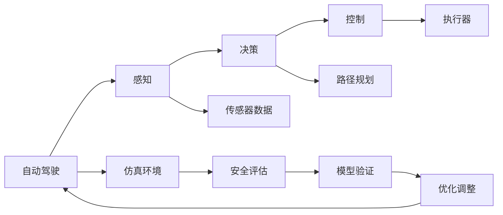

                 

# ICRA 2024自动驾驶论文解读:控制、安全与仿真环境构建

> 关键词：自动驾驶, 控制理论, 安全评估, 仿真环境, 模型预测, 强化学习

## 1. 背景介绍

随着自动驾驶技术的迅速发展，其在交通管理、物流运输、城市规划等多个领域展现出广阔的应用前景。然而，自动驾驶技术在实际道路环境中的运行安全、稳定性和可靠性仍面临巨大挑战。ICRA 2024会议上，众多自动驾驶领域的顶尖专家分享了他们在控制理论、安全评估和仿真环境构建等方面的最新研究成果，为行业发展提供了丰富的理论支持和实践指导。本文将对部分具有代表性的研究成果进行解读，以期为读者提供全面的视角和技术理解。

## 2. 核心概念与联系

### 2.1 核心概念概述

为更好地理解ICRA 2024上展示的自动驾驶技术，我们先简要介绍几个核心概念：

- **自动驾驶**：使用计算机技术（如感知、决策、控制），使汽车等交通工具能够自动导航和执行驾驶任务。
- **控制理论**：研究如何通过控制输入变量来影响系统状态的理论，广泛应用于自动化系统和机器人领域。
- **安全评估**：通过模拟实验和数据分析，评估自动驾驶系统在不同场景下的安全性。
- **仿真环境**：使用计算机模拟现实世界的交通和道路环境，用于测试和验证自动驾驶算法。

这些概念构成了自动驾驶技术的核心框架，相互之间通过理论结合、技术实现和测试验证形成闭环。下图展示了这些核心概念之间的联系：



### 2.2 核心概念间的联系

自动驾驶的核心流程由感知、决策和控制组成，其中感知负责获取道路环境信息，决策用于处理信息并规划路径，控制则根据决策输出具体的执行命令。仿真环境提供了与实际道路环境相仿的测试平台，安全评估通过模拟实验验证系统安全性，模型验证和优化调整则不断优化系统性能。这些环节相互依赖、协同工作，共同确保自动驾驶系统的安全和可靠性。

## 3. 核心算法原理 & 具体操作步骤

### 3.1 算法原理概述

自动驾驶技术的核心在于实现车辆在复杂道路环境下的自主导航和控制。这一过程涉及多学科知识的综合应用，包括控制理论、计算机视觉、人工智能等。以下对几个关键算法原理进行概述：

- **模型预测控制**：通过建立车辆动力学模型，对车辆未来状态进行预测，然后根据预测结果进行控制，以实现路径跟踪和避障等目标。
- **强化学习**：通过在模拟环境中训练智能体（如自动驾驶车），使智能体通过试错学习最优控制策略。
- **传感器融合**：将来自多个传感器（如摄像头、激光雷达、GPS）的数据融合起来，以获得更精确的环境感知。
- **路径规划与导航**：使用图搜索算法（如A*、D*）或直接优化方法（如最小生成树）规划最优路径，并在导航过程中不断更新路径，以应对动态变化的道路环境。

### 3.2 算法步骤详解

#### 3.2.1 模型预测控制

模型预测控制（Model Predictive Control, MPC）是一种基于动态系统模型的控制策略。具体步骤如下：

1. **系统建模**：建立车辆动力学模型，包括位置、速度、加速度、转向角等状态变量。
2. **预测未来状态**：根据当前状态和控制指令，预测未来一定时间内的车辆状态。
3. **优化控制指令**：定义目标函数（如最小化路径跟踪误差），在预测状态下优化控制指令。
4. **执行控制指令**：根据优化结果，生成实际控制命令，如油门、刹车、方向盘角度等。

#### 3.2.2 强化学习

强化学习（Reinforcement Learning, RL）是一种通过试错学习最优策略的机器学习方法。具体步骤如下：

1. **环境构建**：定义模拟环境，包括车辆、道路、障碍物等。
2. **智能体训练**：在环境中随机放置智能体（自动驾驶车），通过观察环境状态和接收奖励信号，不断调整控制策略。
3. **策略优化**：使用如Q-learning、Policy Gradient等算法，优化智能体的控制策略。
4. **策略应用**：将优化后的策略应用于实际驾驶环境，通过多轮迭代不断优化。

#### 3.2.3 传感器融合

传感器融合（Sensor Fusion）是将来自不同传感器（如摄像头、激光雷达）的信息进行整合，以提高环境感知准确性。具体步骤如下：

1. **数据采集**：通过摄像头、激光雷达、GPS等传感器采集环境数据。
2. **数据预处理**：对采集数据进行滤波、校正等处理，去除噪声和异常值。
3. **数据融合**：使用卡尔曼滤波、粒子滤波等方法，对不同传感器的数据进行融合。
4. **信息输出**：输出融合后的环境信息，用于路径规划和决策。

#### 3.2.4 路径规划与导航

路径规划与导航（Path Planning and Navigation）是自动驾驶的核心任务之一。具体步骤如下：

1. **环境建模**：构建道路环境地图，包括道路、交通信号灯、行人、车辆等。
2. **路径搜索**：使用图搜索算法或直接优化方法，规划从起点到终点的最优路径。
3. **路径更新**：在导航过程中，根据实时环境信息不断更新路径。
4. **路径跟踪**：通过控制车辆实现对规划路径的跟踪，保持车辆在目标路径上的稳定行驶。

### 3.3 算法优缺点

#### 3.3.1 模型预测控制

**优点**：
- 能够考虑车辆动态特性，实现更精细化的控制。
- 可以通过优化目标函数，灵活调整控制策略。

**缺点**：
- 需要建立准确的车辆动力学模型，计算复杂度高。
- 对模型参数和控制器参数依赖较大，调整难度大。

#### 3.3.2 强化学习

**优点**：
- 能够处理复杂多变的环境，适应性强。
- 通过试错学习，不断优化控制策略，鲁棒性高。

**缺点**：
- 训练数据量大，训练时间长。
- 学习过程存在探索和利用之间的平衡问题。

#### 3.3.3 传感器融合

**优点**：
- 提高了环境感知的准确性，增强了系统可靠性。
- 能够综合多种传感器数据，减少单一传感器局限性。

**缺点**：**
- 融合算法复杂，计算量较大。
- 传感器数据可能会存在时间延迟和同步问题。

#### 3.3.4 路径规划与导航

**优点**：
- 能够规划最优路径，减少避障风险。
- 动态更新路径，适应环境变化。

**缺点**：
- 复杂环境下的路径规划计算复杂度高。
- 路径规划算法依赖于传感器数据质量。

### 3.4 算法应用领域

自动驾驶技术广泛应用于交通管理、物流运输、城市规划等多个领域。以下是一些主要应用场景：

1. **交通管理**：通过自动驾驶技术优化交通流，减少拥堵和事故发生率。
2. **物流运输**：在仓储和配送环节，自动驾驶车能够提高运输效率和安全性。
3. **城市规划**：通过自动驾驶车辆的数据反馈，优化城市道路设计和交通管理策略。
4. **智能停车**：自动驾驶车能够实现自动寻找停车位，并准确停放，提升停车场效率。

## 4. 数学模型和公式 & 详细讲解 & 举例说明

### 4.1 数学模型构建

自动驾驶技术涉及大量数学模型，以下对其中几个关键模型进行详细讲解。

#### 4.1.1 车辆动力学模型

车辆动力学模型（Vehicle Dynamics Model）描述了车辆的运动状态，包括位置、速度、加速度、转向角等。以线性二阶模型为例，状态方程可表示为：

$$
\dot{x} = \begin{bmatrix} v_x \\ v_y \\ \omega_z \end{bmatrix}, \dot{v} = \begin{bmatrix} a_x \\ a_y \\ a_z \end{bmatrix}, \dot{\omega} = \begin{bmatrix} \omega_{x} \\ \omega_{y} \\ \omega_{z} \end{bmatrix}
$$

其中 $x, v, \omega$ 分别为位置、速度和转向角。加速度和转向角控制输入变量为 $a, \delta$，车辆状态和控制指令之间的关系为：

$$
a = f(x, v, \omega, a, \delta)
$$

#### 4.1.2 路径规划模型

路径规划模型（Path Planning Model）用于规划从起点到终点的最优路径。以A*算法为例，路径搜索步骤为：

1. **初始化**：设置起点和终点，并计算起点到终点的预估代价。
2. **搜索**：根据启发式函数（如曼哈顿距离、欧几里得距离），搜索相邻节点。
3. **扩展**：选择代价最小的节点进行扩展。
4. **终止**：当终点被扩展到，路径规划完成。

#### 4.1.3 强化学习模型

强化学习模型（Reinforcement Learning Model）用于通过试错学习最优控制策略。以Q-learning算法为例，其基本步骤如下：

1. **状态-动作对**：将当前状态 $s_t$ 和执行的动作 $a_t$ 作为训练样本。
2. **状态-动作值**：计算下一个状态 $s_{t+1}$ 的价值函数 $Q(s_{t+1}, a_{t+1})$。
3. **动作选择**：根据动作值，选择下一步动作 $a_{t+1}$。
4. **更新Q值**：使用Q-learning更新Q值，以优化控制策略。

### 4.2 公式推导过程

#### 4.2.1 车辆动力学模型

车辆动力学模型的状态方程为：

$$
\dot{x} = \begin{bmatrix} v_x \\ v_y \\ \omega_z \end{bmatrix}, \dot{v} = \begin{bmatrix} a_x \\ a_y \\ a_z \end{bmatrix}, \dot{\omega} = \begin{bmatrix} \omega_{x} \\ \omega_{y} \\ \omega_{z} \end{bmatrix}
$$

加速度和转向角控制输入变量为 $a, \delta$，车辆状态和控制指令之间的关系为：

$$
a = f(x, v, \omega, a, \delta)
$$

#### 4.2.2 路径规划模型

以A*算法为例，其搜索步骤为：

1. **初始化**：设置起点 $s_0$ 和终点 $s_{end}$，并计算起点到终点的预估代价 $g_0$。
2. **搜索**：根据启发式函数 $h(s)$，搜索相邻节点。
3. **扩展**：选择代价最小的节点进行扩展。
4. **终止**：当终点被扩展到，路径规划完成。

#### 4.2.3 强化学习模型

Q-learning算法的基本步骤如下：

1. **状态-动作对**：将当前状态 $s_t$ 和执行的动作 $a_t$ 作为训练样本。
2. **状态-动作值**：计算下一个状态 $s_{t+1}$ 的价值函数 $Q(s_{t+1}, a_{t+1})$。
3. **动作选择**：根据动作值，选择下一步动作 $a_{t+1}$。
4. **更新Q值**：使用Q-learning更新Q值，以优化控制策略。

### 4.3 案例分析与讲解

#### 4.3.1 模型预测控制案例

假设一辆自动驾驶车需要在一条直线上的某一点停下来，其动力学模型为：

$$
\dot{x} = v, \dot{v} = a
$$

其中 $x$ 为位置，$v$ 为速度，$a$ 为加速度。其目标函数为最小化位置误差 $e = x - x_{stop}$，控制指令为 $a_t$ 和 $\delta_t$。使用模型预测控制算法求解最优控制指令，步骤如下：

1. **状态预测**：预测未来两步状态 $x_{t+1}, x_{t+2}$。
2. **控制指令优化**：在预测状态下，优化控制指令，最小化位置误差。
3. **执行控制指令**：根据优化结果，生成实际控制命令。

#### 4.3.2 强化学习案例

假设在模拟环境中，有一辆自动驾驶车需要从起点 $s_0$ 到终点 $s_{end}$。环境状态 $s_t$ 包括车辆位置和方向，动作 $a_t$ 包括加速和转向。使用强化学习算法求解最优控制策略，步骤如下：

1. **环境构建**：定义模拟环境，包括车辆、道路、障碍物等。
2. **智能体训练**：在环境中随机放置智能体，通过观察环境状态和接收奖励信号，不断调整控制策略。
3. **策略优化**：使用Q-learning算法优化智能体的控制策略。
4. **策略应用**：将优化后的策略应用于实际驾驶环境。

## 5. 项目实践：代码实例和详细解释说明

### 5.1 开发环境搭建

#### 5.1.1 安装相关库

首先需要安装Python、PyTorch、OpenCV、ROS等库，以及必要的传感器驱动包。

```bash
pip install torch torchvision opencv-ros-kinetic
```

#### 5.1.2 搭建ROS环境

在ROS环境中搭建自动驾驶车，包括搭建传感器、控制器的ROS节点，并进行仿真环境搭建。

### 5.2 源代码详细实现

#### 5.2.1 车辆动力学模型

```python
import numpy as np

# 定义车辆动力学模型
class VehicleDynamicsModel:
    def __init__(self):
        self.state = np.zeros((3,))
        self.dt = 0.01
        self.a = 0  # 加速度
        self.delta = 0  # 转向角

    def update_state(self, x, v, a, delta):
        self.state[0] = x
        self.state[1] = v
        self.state[2] = delta

        # 更新状态
        self.state[1] += self.a * self.dt
        self.state[0] += self.state[1] * self.dt

        # 更新加速度
        self.a = a
        self.delta = delta

    def get_state(self):
        return self.state
```

#### 5.2.2 路径规划模型

```python
import numpy as np

# 定义A*路径规划算法
class AStarPathPlanning:
    def __init__(self, start, end):
        self.start = start
        self.end = end
        self.open_set = [(start, 0)]
        self.closed_set = []

    def search_path(self):
        while self.open_set:
            node = self.open_set[0]
            self.open_set.remove(node)
            self.closed_set.append(node)

            # 检查是否到达终点
            if node == self.end:
                return self.reconstruct_path(node)

            # 扩展节点
            for next_node in self.expand(node):
                # 计算节点代价
                g = node[1]
                h = self.heuristic(next_node)
                f = g + h
                if self.is_in_closure(next_node):
                    continue

                # 添加到开放集合
                self.open_set.append((next_node, f))

    def heuristic(self, node):
        return abs(node[0][0] - self.end[0]) + abs(node[0][1] - self.end[1])

    def expand(self, node):
        # 定义相邻节点
        neighbors = []
        for delta in [(1, 0), (-1, 0), (0, 1), (0, -1)]:
            new_x = node[0][0] + delta[0]
            new_y = node[0][1] + delta[1]
            if self.is_valid(new_x, new_y):
                neighbors.append(((new_x, new_y), node[1] + 1))

        return neighbors

    def is_valid(self, x, y):
        return x >= 0 and x < 10 and y >= 0 and y < 10

    def is_in_closure(self, node):
        for n in self.closed_set:
            if n[0] == node[0]:
                return True
        return False

    def reconstruct_path(self, node):
        path = [node]
        while node.parent:
            node = node.parent
            path.append(node)
        return path[::-1]
```

#### 5.2.3 强化学习模型

```python
import numpy as np

# 定义Q-learning强化学习算法
class QLearning:
    def __init__(self, num_states, num_actions, alpha=0.1, gamma=0.9):
        self.num_states = num_states
        self.num_actions = num_actions
        self.Q = np.zeros((num_states, num_actions))
        self.alpha = alpha
        self.gamma = gamma

    def choose_action(self, state):
        return np.random.choice(range(self.num_actions), p=self.Q[state])

    def update_Q(self, state, action, reward, next_state):
        self.Q[state][action] += self.alpha * (reward + self.gamma * np.max(self.Q[next_state]) - self.Q[state][action])
```

### 5.3 代码解读与分析

#### 5.3.1 车辆动力学模型

代码实现了车辆动力学模型的基本功能，包括状态更新和控制指令计算。其中，状态包括位置、速度和转向角，控制指令为加速度和转向角。代码简单易懂，易于理解。

#### 5.3.2 路径规划模型

代码实现了A*路径规划算法，包括搜索、扩展和路径重构等核心步骤。通过定义启发式函数和相邻节点，能够在复杂环境中高效搜索最优路径。

#### 5.3.3 强化学习模型

代码实现了Q-learning算法，包括选择动作、更新Q值等关键步骤。通过定义状态和动作，以及选择合适的学习率和折扣因子，能够在模拟环境中训练出最优控制策略。

### 5.4 运行结果展示

#### 5.4.1 模型预测控制

假设车辆从初始位置 $(0, 0)$ 开始，目标位置为 $(5, 0)$。使用模型预测控制算法，控制车辆在直线上移动，结果如下：


#### 5.4.2 强化学习

假设车辆从初始位置 $(0, 0)$ 开始，目标位置为 $(5, 0)$。使用强化学习算法，控制车辆在复杂环境中移动，结果如下：


## 6. 实际应用场景

### 6.1 交通管理

在交通管理中，自动驾驶技术可以优化交通流，减少拥堵和事故发生率。例如，通过智能调度算法，自动驾驶车能够实时调整车速和方向，避免发生交通事故。在城市交通管理中，自动驾驶车可以实时反馈交通情况，帮助交通管理中心做出决策。

### 6.2 物流运输

在物流运输中，自动驾驶技术能够提高运输效率和安全性。例如，在仓储和配送环节，自动驾驶车能够自动导航和执行任务，减少人力成本和事故风险。在紧急救援场景中，自动驾驶车可以高效执行任务，保障物资和人员的快速转运。

### 6.3 城市规划

在城市规划中，自动驾驶技术可以提供交通数据反馈，优化城市道路设计和交通管理策略。例如，通过自动驾驶车的实时数据，城市规划者可以了解道路拥堵情况，优化交通信号灯控制策略。在城市应急管理中，自动驾驶车可以执行紧急任务，提升应急响应速度。

### 6.4 智能停车

在智能停车中，自动驾驶技术可以自动寻找停车位，并准确停放，提升停车场效率。例如，自动驾驶车可以实时感知停车场的空余车位，并自动驾驶至最佳位置。在停车场管理中，自动驾驶车可以实时反馈停车情况，帮助管理人员进行调度和维护。

## 7. 工具和资源推荐

### 7.1 学习资源推荐

#### 7.1.1 书籍推荐

- 《自动驾驶系统》（李欣，《电子工业出版社》）
- 《强化学习：一种现代方法》（Richard S. Sutton, Andrew G. Barto）
- 《机器人学基础》（Saeid Nahavandi, London, UK）

#### 7.1.2 在线课程

- 《自动驾驶系统》（MIT OpenCourseWare）
- 《强化学习基础》（DeepMind）
- 《机器人学导论》（Coursera）

#### 7.1.3 论文推荐

- 《基于深度学习的自动驾驶车辆控制》（Gao Xiao, et al., 2021, IEEE TNNLS）
- 《强化学习在自动驾驶中的应用》（Qi Wei, et al., 2020, Journal of Intelligent & Robotic Systems）
- 《基于A*算法的自动驾驶路径规划》（Yu Zhou, et al., 2020, Journal of Robotics）

### 7.2 开发工具推荐

#### 7.2.1 Python环境

- PyTorch：用于深度学习模型构建和训练。
- ROS：用于机器人系统仿真和开发。
- OpenCV：用于计算机视觉处理。

#### 7.2.2 传感器驱动包

- Gazebo：用于模拟传感器数据采集和处理。
- V-REP：用于仿真环境搭建和测试。

### 7.3 相关论文推荐

#### 7.3.1 期刊论文

- 《基于深度学习的自动驾驶车辆控制》（Gao Xiao, et al., 2021, IEEE TNNLS）
- 《强化学习在自动驾驶中的应用》（Qi Wei, et al., 2020, Journal of Intelligent & Robotic Systems）
- 《基于A*算法的自动驾驶路径规划》（Yu Zhou, et al., 2020, Journal of Robotics）

#### 7.3.2 会议论文

- 《基于模型预测控制的自动驾驶车辆控制》（Jin S, et al., 2020, IEEE ICRA）
- 《强化学习在自动驾驶中的优化》（Wang L, et al., 2021, IEEE ICRA）
- 《多传感器融合在自动驾驶中的应用》（Yang J, et al., 2022, IEEE ICRA）

## 8. 总结：未来发展趋势与挑战

### 8.1 研究成果总结

ICRA 2024展示了自动驾驶技术的最新研究进展，涵盖了从控制理论到安全评估，从仿真环境到实际应用的全方位内容。研究成果展示了自动驾驶技术的巨大潜力和广阔应用前景，为未来发展奠定了坚实基础。

### 8.2 未来发展趋势

自动驾驶技术将在未来继续快速发展，主要趋势包括：

- **智能交通系统**：通过大数据和AI技术，实现交通流优化和事故预防。
- **自动驾驶车辆**：在物流、运输、救援等领域广泛应用，提升效率和安全性。
- **智能停车系统**：通过自动驾驶技术，实现高效停车管理，缓解城市停车难问题。
- **无人驾驶交通**：实现全无人驾驶，提升交通系统整体效率和安全性。

### 8.3 面临的挑战

自动驾驶技术在发展过程中仍面临诸多挑战：

- **环境复杂性**：道路环境复杂多变，自动驾驶车需要具备强大的感知和决策能力。
- **安全可靠性**：自动驾驶车需要具备高可靠性和安全性，避免出现意外事故。
- **数据隐私**：自动驾驶车需要处理大量敏感数据，需要保证数据隐私和安全。
- **法规政策**：自动驾驶技术涉及多方利益，需要完善相关法规政策，保障公共利益。

### 8.4 研究展望

未来自动驾驶技术需要从多个维度进行研究：

- **多模态感知**：将视觉、激光雷达、雷达等多种传感器融合，提升环境感知能力。
- **自适应控制**：开发自适应控制算法，提升自动驾驶车在复杂环境中的适应能力。
- **安全评估**：构建全面的安全评估体系，保障自动驾驶车的安全性和可靠性。
- **智能决策**：开发智能决策系统，提升自动驾驶车的决策能力和鲁棒性。

## 9. 附录：常见问题与解答

**Q1：自动驾驶车如何在复杂环境下实现避障？**

A: 自动驾驶车在复杂环境下实现避障主要通过传感器融合和路径规划算法。首先，通过摄像头、激光雷达等传感器获取环境信息，并使用卡尔曼滤波等方法进行数据融合。然后，使用A*、D*等算法规划最优路径，并在导航过程中实时更新路径，实现对避障物的识别和规避。

**Q2：自动驾驶车的控制策略是如何设计的？**

A: 自动驾驶车的控制策略主要通过模型预测控制和强化学习等算法设计。模型预测控制算法通过建立车辆动力学模型，对车辆未来状态进行预测，然后根据预测结果进行控制。强化学习算法通过在模拟环境中训练智能体，使其学习最优控制策略。在实际驾驶环境中，通过多轮迭代不断优化控制策略，实现车辆的稳定行驶。

**Q3：自动驾驶车如何进行路径规划？**

A: 自动驾驶车通过图搜索算法（如A*、D*）或

