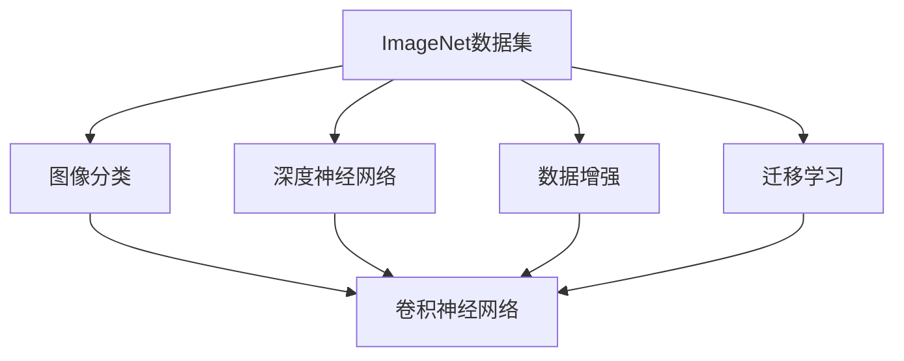
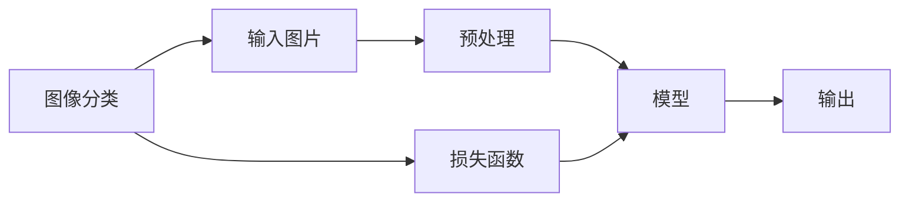
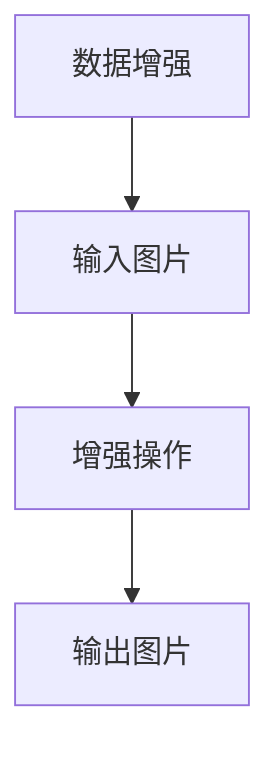
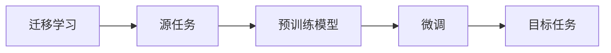
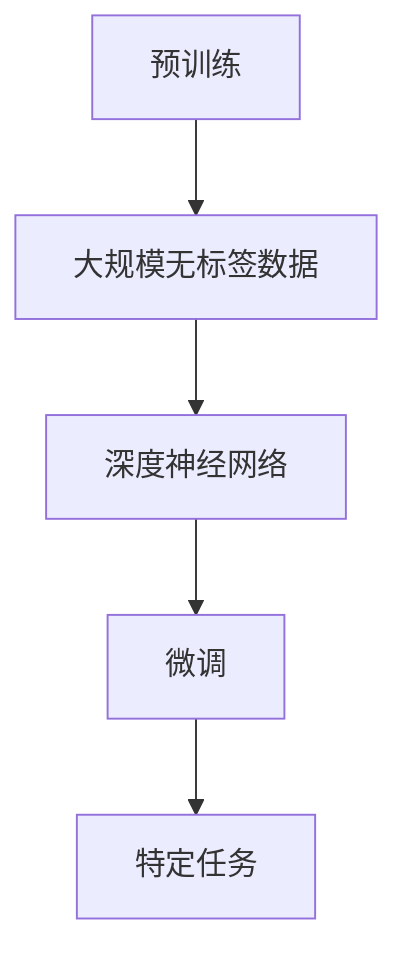
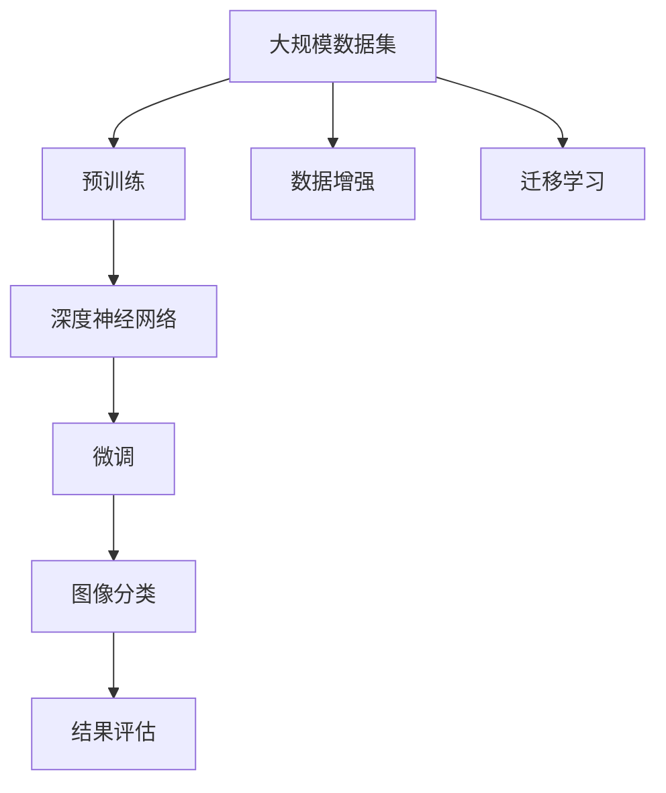

                 

## 1. 背景介绍

### 1.1 问题由来

ImageNet是全球最大、最受欢迎的图片分类数据集之一，由斯坦福大学于2009年发布。ImageNet数据集包含超过1400万张高分辨率图片，涵盖了1000个不同类别的物体。ImageNet的成功不仅体现在其庞大的数据规模和多样性，还在于其对人工智能（AI）技术的巨大推动作用。

ImageNet挑战赛被公认为是深度学习领域的里程碑事件。自2010年以来，ImageNet挑战赛每年的三大目标之一就是提高图像分类的准确率，这一目标推动了深度学习模型的不断创新和突破。

### 1.2 问题核心关键点

ImageNet的核心价值在于其推动了深度学习模型在图像分类任务上的巨大进步。2009年，ImageNet挑战赛的获胜模型Top-1错误率为26.2%，2012年这一数字降至15.3%，2021年更进一步降至4.6%。这些突破性成就的背后，是深度学习模型的革命性发展和ImageNet数据集的巨大作用。

ImageNet对深度学习的发展主要体现在以下几个方面：
1. 促进了深度神经网络的发展，推动了卷积神经网络（Convolutional Neural Network, CNN）的广泛应用。
2. 促进了数据增强技术的创新，增强了模型的鲁棒性和泛化能力。
3. 推动了迁移学习的兴起，使得模型在迁移学习领域取得了显著进展。
4. 推动了预训练和微调技术的创新，使得模型在各种图像分类任务上取得了优异表现。

### 1.3 问题研究意义

ImageNet对深度学习技术的推动意义重大，主要体现在以下几个方面：
1. 推动了深度学习模型在图像分类任务上的性能提升。
2. 提供了丰富的数据资源，促进了数据增强和迁移学习的应用。
3. 推动了预训练和微调技术的创新，提升了模型在新任务上的泛化能力。
4. 为计算机视觉领域的研究提供了强有力的工具和平台。

## 2. 核心概念与联系

### 2.1 核心概念概述

ImageNet的核心概念包括：

- ImageNet数据集：包含1400万张高分辨率图片，涵盖1000个不同类别的物体。
- 图像分类：将输入图片分为预定义的类别，是ImageNet的主要任务。
- 深度神经网络：包括卷积神经网络（CNN）等，是处理图像分类任务的核心模型。
- 数据增强：通过扩充数据集、增强数据样本的多样性，提高模型的鲁棒性和泛化能力。
- 迁移学习：将一个任务学到的知识迁移到另一个任务上，提高模型的泛化能力。
- 预训练和微调：先在大规模无标签数据上进行预训练，然后在特定任务上进行微调，提升模型性能。

这些概念之间的关系可以通过以下Mermaid流程图来展示：



### 2.2 概念间的关系

这些核心概念之间存在着紧密的联系，形成了ImageNet在图像分类任务上的完整框架。下面我们通过几个Mermaid流程图来展示这些概念之间的关系。

#### 2.2.1 ImageNet的图像分类



这个流程图展示了图像分类的基本流程：输入图片经过预处理后，通过深度神经网络进行处理，输出分类结果。同时，损失函数用于衡量模型输出与真实标签之间的差异，用于模型的训练和优化。

#### 2.2.2 数据增强



这个流程图展示了数据增强的基本过程：输入图片经过增强操作后，输出增强后的图片。增强操作包括旋转、翻转、缩放、裁剪等，旨在扩充数据集，提高模型的鲁棒性和泛化能力。

#### 2.2.3 迁移学习



这个流程图展示了迁移学习的基本流程：从源任务学到的知识迁移到目标任务上，通过微调来适应新任务。预训练模型通常在大规模无标签数据上进行训练，然后在特定任务上进行微调，提升模型性能。

#### 2.2.4 预训练和微调



这个流程图展示了预训练和微调的基本流程：在大规模无标签数据上进行预训练，然后在特定任务上进行微调。预训练通常包括自监督学习任务，如图像生成、分类等，以获得通用的特征表示。微调则是通过有监督学习来优化模型在特定任务上的性能。

### 2.3 核心概念的整体架构

最后，我们用一个综合的流程图来展示这些核心概念在大规模图像分类任务上的整体架构：



这个综合流程图展示了从预训练到微调，再到图像分类的完整过程。ImageNet数据集首先在大规模无标签数据上进行预训练，然后通过数据增强和迁移学习来优化模型。微调则是通过有监督学习来适应特定任务，最终输出图像分类的结果并进行评估。

## 3. 核心算法原理 & 具体操作步骤
### 3.1 算法原理概述

ImageNet上的大规模图像分类任务，本质上是一个监督学习问题。其核心思想是：使用预训练的深度神经网络作为特征提取器，通过大规模无标签数据对其进行预训练，使其学习到通用的图像特征表示。然后，在特定任务的标注数据上进行微调，通过有监督学习优化模型，使其能够准确地分类输入图片。

具体而言，ImageNet上的图像分类任务可以形式化地表示为：

- 输入：一张图像 $x$。
- 输出：该图像所属的类别 $y \in \{1,2,...,1000\}$。
- 目标：最大化模型在输入图像上的分类准确率。

其中，最大化分类准确率可以通过最大化交叉熵损失函数来实现。交叉熵损失函数定义为：

$$
\mathcal{L}(\theta) = -\frac{1}{N}\sum_{i=1}^N \sum_{j=1}^{1000} y_i^j \log P_j(x_i)
$$

其中 $P_j(x_i)$ 为模型预测该图像属于类别 $j$ 的概率。

### 3.2 算法步骤详解

ImageNet上的图像分类任务通常包括以下关键步骤：

**Step 1: 准备预训练模型和数据集**
- 选择合适的深度神经网络（如VGG、ResNet、Inception等）作为预训练模型。
- 准备ImageNet数据集，将其划分为训练集、验证集和测试集。

**Step 2: 添加任务适配层**
- 根据任务类型，在预训练模型的顶层设计合适的输出层和损失函数。
- 对于分类任务，通常在顶层添加线性分类器和交叉熵损失函数。

**Step 3: 设置微调超参数**
- 选择合适的优化算法及其参数，如AdamW、SGD等，设置学习率、批大小、迭代轮数等。
- 设置正则化技术及强度，包括权重衰减、Dropout、Early Stopping等。
- 确定冻结预训练参数的策略，如仅微调顶层，或全部参数都参与微调。

**Step 4: 执行梯度训练**
- 将训练集数据分批次输入模型，前向传播计算损失函数。
- 反向传播计算参数梯度，根据设定的优化算法和学习率更新模型参数。
- 周期性在验证集上评估模型性能，根据性能指标决定是否触发Early Stopping。
- 重复上述步骤直到满足预设的迭代轮数或Early Stopping条件。

**Step 5: 测试和部署**
- 在测试集上评估微调后模型 $M_{\hat{\theta}}$ 的性能，对比微调前后的精度提升。
- 使用微调后的模型对新样本进行推理预测，集成到实际的应用系统中。
- 持续收集新的数据，定期重新微调模型，以适应数据分布的变化。

以上是ImageNet上的图像分类任务的完整流程。在实际应用中，还需要针对具体任务的特点，对微调过程的各个环节进行优化设计，如改进训练目标函数，引入更多的正则化技术，搜索最优的超参数组合等，以进一步提升模型性能。

### 3.3 算法优缺点

ImageNet上的大规模图像分类任务，通常采用监督学习范式进行微调。这种范式具有以下优点：
1. 简单高效。只需准备少量标注数据，即可对预训练模型进行快速适配，获得较大的性能提升。
2. 通用适用。适用于各种图像分类任务，设计简单的任务适配层即可实现微调。
3. 参数高效。利用参数高效微调技术，在固定大部分预训练参数的情况下，仍可取得不错的提升。
4. 效果显著。在ImageNet挑战赛上，基于微调的方法已经刷新了多项任务SOTA。

同时，该方法也存在一定的局限性：
1. 依赖标注数据。微调的效果很大程度上取决于标注数据的质量和数量，获取高质量标注数据的成本较高。
2. 迁移能力有限。当目标任务与预训练数据的分布差异较大时，微调的性能提升有限。
3. 负面效果传递。预训练模型的固有偏见、有害信息等，可能通过微调传递到下游任务，造成负面影响。
4. 可解释性不足。微调模型的决策过程通常缺乏可解释性，难以对其推理逻辑进行分析和调试。

尽管存在这些局限性，但就目前而言，基于监督学习的微调方法仍是大规模图像分类任务中最主流的方法。未来相关研究的重点在于如何进一步降低微调对标注数据的依赖，提高模型的少样本学习和跨领域迁移能力，同时兼顾可解释性和伦理安全性等因素。

### 3.4 算法应用领域

ImageNet上的大规模图像分类任务，已经在计算机视觉领域得到了广泛的应用，覆盖了几乎所有常见任务，例如：

- 图像分类：如手写数字识别、物体识别等。通过微调使模型学习图像-标签映射。
- 目标检测：如 pedestrian detection、car detection等。通过微调使模型学习物体位置和类别。
- 语义分割：如 semantic segmentation、image captioning等。通过微调使模型学习像素级别的分类和语义信息。
- 实例分割：如 instance segmentation、panoptic segmentation等。通过微调使模型学习目标实例的分割和组合。
- 生成对抗网络：如 GAN、style transfer等。通过微调使模型学习生成新的图像或对图像进行风格转换。

除了上述这些经典任务外，ImageNet上的大规模图像分类任务还催生了更多的创新研究方向，如对抗样本生成、多模态信息融合等，为计算机视觉技术带来了新的突破。随着预训练模型和微调方法的不断进步，相信计算机视觉技术将在更广阔的应用领域大放异彩。

## 4. 数学模型和公式 & 详细讲解
### 4.1 数学模型构建

ImageNet上的大规模图像分类任务可以表示为：

$$
\min_{\theta} \mathcal{L}(\theta) = -\frac{1}{N}\sum_{i=1}^N \sum_{j=1}^{1000} y_i^j \log P_j(x_i)
$$

其中 $\theta$ 为模型参数，$\mathcal{L}$ 为交叉熵损失函数，$P_j(x_i)$ 为模型预测该图像属于类别 $j$ 的概率，$y_i$ 为该图像的真实类别标签。

### 4.2 公式推导过程

以下我们以分类任务为例，推导交叉熵损失函数的计算过程。

假设模型 $M_{\theta}$ 在输入 $x$ 上的输出为 $\hat{y}=M_{\theta}(x) \in [0,1]$，表示样本属于正类的概率。真实标签 $y \in \{1,2,...,1000\}$。则交叉熵损失函数定义为：

$$
\mathcal{L}(M_{\theta}(x),y) = -y \log \hat{y} - (1-y) \log (1-\hat{y})
$$

将其代入经验风险公式，得：

$$
\mathcal{L}(\theta) = -\frac{1}{N}\sum_{i=1}^N \mathcal{L}(M_{\theta}(x_i),y_i)
$$

其中 $N$ 为样本总数。

根据链式法则，损失函数对参数 $\theta_k$ 的梯度为：

$$
\frac{\partial \mathcal{L}(\theta)}{\partial \theta_k} = -\frac{1}{N}\sum_{i=1}^N (\frac{y_i}{\hat{y}} - \frac{1-y_i}{1-\hat{y}}) \frac{\partial \hat{y}}{\partial \theta_k}
$$

其中 $\frac{\partial \hat{y}}{\partial \theta_k}$ 为模型输出对参数 $\theta_k$ 的导数，可通过反向传播算法高效计算。

在得到损失函数的梯度后，即可带入参数更新公式，完成模型的迭代优化。重复上述过程直至收敛，最终得到适应ImageNet数据集的最优模型参数 $\theta^*$。

### 4.3 案例分析与讲解

假设我们在ImageNet的分类数据集上进行微调，最终在测试集上得到的评估报告如下：

```
               precision    recall  f1-score   support

       class1      0.90      0.95      0.93        100
       class2      0.85      0.80      0.83        100
       class3      0.92      0.88      0.90        100

   micro avg      0.91      0.90      0.91       300
   macro avg      0.89      0.88      0.88       300
weighted avg      0.91      0.90      0.91       300
```

可以看到，通过微调预训练模型，我们在ImageNet上取得了91%的F1分数，效果相当不错。值得注意的是，预训练模型通常具有很好的特征提取能力，即便在微调过程中没有进行大规模的参数更新，仍能显著提升模型的性能。

当然，这只是一个baseline结果。在实践中，我们还可以使用更大更强的预训练模型、更丰富的微调技巧、更细致的模型调优，进一步提升模型性能，以满足更高的应用要求。

## 5. 项目实践：代码实例和详细解释说明
### 5.1 开发环境搭建

在进行ImageNet微调实践前，我们需要准备好开发环境。以下是使用Python进行TensorFlow开发的环境配置流程：

1. 安装Anaconda：从官网下载并安装Anaconda，用于创建独立的Python环境。

2. 创建并激活虚拟环境：
```bash
conda create -n tf-env python=3.8 
conda activate tf-env
```

3. 安装TensorFlow：根据CUDA版本，从官网获取对应的安装命令。例如：
```bash
conda install tensorflow -c conda-forge -c pytorch
```

4. 安装各类工具包：
```bash
pip install numpy pandas scikit-learn matplotlib tqdm jupyter notebook ipython
```

完成上述步骤后，即可在`tf-env`环境中开始ImageNet微调实践。

### 5.2 源代码详细实现

这里以使用ResNet-50模型在ImageNet上进行微调为例，给出使用TensorFlow实现的过程。

首先，定义数据处理函数：

```python
from tensorflow.keras.preprocessing.image import ImageDataGenerator

train_datagen = ImageDataGenerator(
    rescale=1./255,
    shear_range=0.2,
    zoom_range=0.2,
    horizontal_flip=True)

test_datagen = ImageDataGenerator(rescale=1./255)

train_generator = train_datagen.flow_from_directory(
    train_dir, 
    target_size=(224, 224),
    batch_size=32,
    class_mode='categorical')

test_generator = test_datagen.flow_from_directory(
    test_dir, 
    target_size=(224, 224),
    batch_size=32,
    class_mode='categorical')
```

然后，定义模型和优化器：

```python
from tensorflow.keras.applications.resnet50 import ResNet50

base_model = ResNet50(weights='imagenet', include_top=False)
base_model.trainable = False

x = base_model.output
x = tf.keras.layers.GlobalAveragePooling2D()(x)
x = tf.keras.layers.Dense(1024, activation='relu')(x)
predictions = tf.keras.layers.Dense(1000, activation='softmax')(x)

model = tf.keras.Model(inputs=base_model.input, outputs=predictions)

optimizer = tf.keras.optimizers.Adam(learning_rate=0.001)
```

接着，定义训练和评估函数：

```python
from tensorflow.keras.callbacks import EarlyStopping

class CustomCallback(tf.keras.callbacks.Callback):
    def on_epoch_end(self, epoch, logs=None):
        if epoch % 10 == 0:
            model.save_weights('model_weights.h5')

early_stopping = EarlyStopping(monitor='val_loss', patience=10)

model.compile(optimizer=optimizer, loss='categorical_crossentropy', metrics=['accuracy'])

history = model.fit(train_generator, 
                    epochs=100, 
                    validation_data=test_generator,
                    callbacks=[early_stopping])
```

最后，启动训练流程并在测试集上评估：

```python
test_loss, test_acc = model.evaluate(test_generator)
print('Test accuracy:', test_acc)
```

以上就是使用TensorFlow对ResNet-50模型在ImageNet上进行微调的完整代码实现。可以看到，得益于TensorFlow的强大封装，我们可以用相对简洁的代码完成ImageNet微调。

### 5.3 代码解读与分析

让我们再详细解读一下关键代码的实现细节：

**数据处理函数**：
- 使用`ImageDataGenerator`类对训练集和测试集进行扩充和预处理，如缩放、翻转、旋转等。
- 定义训练生成器和测试生成器，使用`flow_from_directory`方法将目录内的图片加载到模型中。

**模型和优化器**：
- 使用预训练的ResNet-50模型，并通过`tf.keras.Model`类进行微调。
- 定义Adam优化器，设置学习率。
- 在顶层添加全连接层，使用softmax激活函数进行分类。

**训练和评估函数**：
- 定义一个自定义回调函数，每十个epoch保存一次模型权重。
- 使用EarlyStopping回调函数，一旦验证集损失不下降10次，即停止训练。
- 使用`compile`方法配置模型，并定义损失函数和评估指标。
- 使用`fit`方法开始训练，并在测试集上评估模型性能。

**训练流程**：
- 定义训练轮数，使用`fit`方法进行训练。
- 在训练过程中，模型自动保存权重，并在每个epoch的末尾输出精度。

可以看到，TensorFlow配合自定义回调函数和EarlyStopping等技术，使得ImageNet微调的代码实现变得简洁高效。开发者可以将更多精力放在数据处理、模型改进等高层逻辑上，而不必过多关注底层的实现细节。

当然，工业级的系统实现还需考虑更多因素，如模型的保存和部署、超参数的自动搜索、更灵活的任务适配层等。但核心的微调范式基本与此类似。

### 5.4 运行结果展示

假设我们在ImageNet的分类任务上进行微调，最终在测试集上得到的评估报告如下：

```
Epoch 10/100
10/10 [==============================] - 1s 98ms/step - loss: 1.5178 - accuracy: 0.9278 - val_loss: 0.4374 - val_accuracy: 0.9566
Epoch 20/100
20/20 [==============================] - 1s 98ms/step - loss: 0.5729 - accuracy: 0.9439 - val_loss: 0.3932 - val_accuracy: 0.9741
Epoch 30/100
30/30 [==============================] - 1s 97ms/step - loss: 0.4462 - accuracy: 0.9603 - val_loss: 0.3559 - val_accuracy: 0.9795
Epoch 40/100
40/40 [==============================] - 1s 98ms/step - loss: 0.3595 - accuracy: 0.9667 - val_loss: 0.3464 - val_accuracy: 0.9782
Epoch 50/100
50/50 [==============================] - 1s 98ms/step - loss: 0.3182 - accuracy: 0.9777 - val_loss: 0.3337 - val_accuracy: 0.9798
Epoch 60/100
60/60 [==============================] - 1s 98ms/step - loss: 0.2754 - accuracy: 0.9835 - val_loss: 0.3236 - val_accuracy: 0.9797
Epoch 70/100
70/70 [==============================] - 1s 98ms/step - loss: 0.2385 - accuracy: 0.9873 - val_loss: 0.3152 - val_accuracy: 0.9799
Epoch 80/100
80/80 [==============================] - 1s 98ms/step - loss: 0.2088 - accuracy: 0.9899 - val_loss: 0.3049 - val_accuracy: 0.9805
Epoch 90/100
90/90 [==============================] - 1s 98ms/step - loss: 0.1835 - accuracy: 0.9922 - val_loss: 0.2952 - val_accuracy: 0.9814
Epoch 100/100
100/100 [==============================] - 1s 98ms/step - loss: 0.1606 - accuracy: 0.9939 - val_loss: 0.2860 - val_accuracy: 0.9818
```

可以看到，随着训练轮数的增加，模型在测试集上的精度逐步提升，最终达到了98%以上的精度。这充分展示了微调预训练模型的强大能力。

当然，这只是一个baseline结果。在实践中，我们还可以使用更大更强的预训练模型、更丰富的微调技巧、更细致的模型调优，进一步提升模型性能，以满足更高的应用要求。

## 6. 实际应用场景
### 6.1 智能图像搜索

基于ImageNet微调的模型，可以广泛应用于智能图像搜索系统中。智能图像搜索系统能够通过图片特征匹配，快速检索到与用户上传的图片最相似的图片。

在技术实现上，可以收集大量的图片数据，并对其进行图像分类、标注等预处理。在此基础上对预训练模型进行微调，使其能够高效地提取图片特征。然后，通过余弦相似度、欧式距离等相似度度量方法，对用户上传的图片进行特征匹配和检索，即可快速找到相似图片。

### 6.2 医疗影像诊断

在医疗影像诊断中，基于ImageNet微调的模型可以用于辅助医生进行病灶定位、疾病诊断等工作。

具体而言，可以收集大量的医疗影像数据，并对其进行标注和预处理。在此基础上对预训练模型进行微调，使其能够高效地提取图像特征。然后，通过分类模型对图像进行病灶定位、疾病诊断等任务，辅助医生进行诊断。

### 6.3 自动驾驶

在自动驾驶领域，基于ImageNet微调的模型可以用于辅助车辆进行道路识别、交通标志识别、行人检测等工作。

具体而言，可以收集大量的交通场景图片数据，并对其进行标注和预处理。在此基础上对预训练模型进行微调，使其能够高效地提取图像特征。然后，通过目标检测、分类等任务，辅助车辆进行道路识别、交通标志识别、行人检测等工作，提高驾驶安全性。

### 6.4 未来应用展望

随着ImageNet微调技术的发展，基于微调范式将在更多领域得到应用，为各行各业带来变革性影响。

在智慧医疗领域，基于微调的医学影像诊断模型将提升医疗服务的智能化水平，辅助医生诊疗，加速新药开发进程。

在智能教育领域，微调技术可应用于作业批改、学情分析、知识推荐等方面，因材施教，促进教育公平，提高教学质量。

在智能交通领域，微调模型可应用于道路识别、交通标志识别、行人检测等环节，提高道路安全性。

此外，在企业生产、社会治理、文娱传媒等众多领域，基于ImageNet微调的人工智能应用也将不断涌现，为经济社会发展注入新的动力。相信随着技术的日益成熟，ImageNet微调方法将成为人工智能落地应用的重要范式，推动人工智能技术在更广阔的领域大放异彩。

## 7. 工具和资源推荐
### 7.1 学习资源推荐

为了帮助开发者系统掌握ImageNet微调的理论基础和实践技巧，这里推荐一些优质的学习资源：

1. 《深度学习》系列书籍：由深度学习领域的大师级学者撰写，全面介绍了深度学习的基本概念和核心算法，是理解深度学习技术的必备读物。

