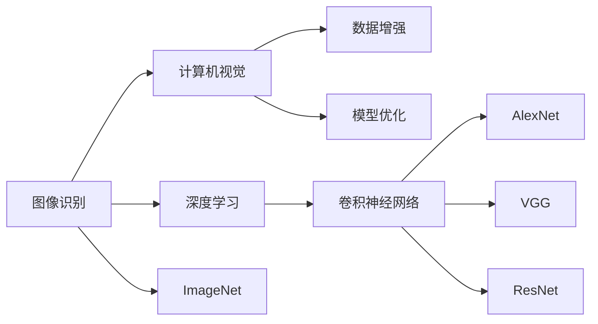

                 

# ImageNet在AI图像识别中的历史

> 关键词：ImageNet, AI, 图像识别, 计算机视觉, 深度学习, AlexNet, VGG, ResNet, 卷积神经网络, 数据集, 学习率, 训练

## 1. 背景介绍

### 1.1 问题由来

图像识别是人工智能领域的一个重要研究方向，涉及计算机视觉和深度学习的交叉领域。图像识别技术可以应用于诸多领域，如图像搜索、医疗诊断、自动驾驶、安防监控等。而在这些应用中，ImageNet图像识别大赛是一个重要的里程碑事件。

ImageNet是由斯坦福大学李飞飞教授主导的项目，是一个大规模的图像识别数据集，包含超过100万张高分辨率图像，涵盖了1000个类别。该数据集于2009年首次发布，并在随后十年间成为深度学习研究的重要基准，推动了整个计算机视觉领域的进步。

ImageNet大赛由斯坦福大学和工业界联合主办，旨在促进计算机视觉和深度学习技术的发展，吸引了全球顶级科研团队和企业的参与。

ImageNet大赛的胜利者通常会获得高额的奖金，并在学术界和工业界引起广泛关注。其影响力已经超越了图像识别本身，成为计算机视觉领域最富盛名的赛事之一。

## 2. 核心概念与联系

### 2.1 核心概念概述

为了深入理解ImageNet在AI图像识别中的历史，我们需要首先了解几个核心概念：

- **图像识别**：是指将图像中的物体、场景、文字等目标物体或场景进行分类或定位的过程。
- **计算机视觉**：是利用计算机技术对图像、视频等视觉数据进行分析、理解和识别的学科。
- **深度学习**：是一种基于多层神经网络的学习方法，可以自动从数据中学习抽象特征，解决复杂的模式识别问题。
- **ImageNet**：是一个大规模的图像识别数据集，包含超过100万张高分辨率图像，涵盖1000个类别。
- **卷积神经网络(CNN)**：一种特殊的神经网络，能够有效地提取图像特征，适用于图像识别任务。
- **AlexNet、VGG、ResNet**：分别是ImageNet大赛中的前三届冠军模型，代表了不同时期图像识别技术的发展水平。

这些概念之间的关系可以通过以下Mermaid流程图来展示：



这个流程图展示了图像识别、计算机视觉和深度学习之间的关系，以及它们与ImageNet数据集和卷积神经网络的具体联系。

### 2.2 概念间的关系

这些核心概念之间存在着紧密的联系，形成了AI图像识别技术的发展脉络。

- **图像识别与计算机视觉**：图像识别是计算机视觉中的一个重要任务，即对图像进行分类、检测和分割等。
- **深度学习与图像识别**：深度学习是图像识别的主要技术手段，通过多层神经网络学习图像特征。
- **ImageNet与卷积神经网络**：ImageNet数据集提供了大规模的图像训练数据，帮助训练卷积神经网络等深度学习模型。
- **AlexNet、VGG、ResNet**：这些卷积神经网络模型分别在ImageNet大赛上取得了胜利，代表图像识别技术的发展历程。

通过这些概念，我们可以更好地理解AI图像识别技术的发展过程和主要技术手段。

## 3. 核心算法原理 & 具体操作步骤
### 3.1 算法原理概述

ImageNet数据集中的图像识别任务是一个典型的监督学习问题，其目标是将图像分到1000个预定义的类别中。

图像识别的核心算法是卷积神经网络（CNN），CNN通过多层卷积和池化操作提取图像的局部特征，通过全连接层将这些特征映射到类别空间中，最终输出类别概率。

图像识别的损失函数通常使用交叉熵损失，即：

$$
L = -\frac{1}{N}\sum_{i=1}^N \sum_{j=1}^C y_{ij}\log(\hat{y}_{ij})
$$

其中，$y_{ij}$表示第$i$个样本属于第$j$个类别的真实标签，$\hat{y}_{ij}$表示模型预测的第$i$个样本属于第$j$个类别的概率。

### 3.2 算法步骤详解

基于卷积神经网络进行图像识别的步骤如下：

1. **数据预处理**：将原始图像进行归一化、裁剪、旋转等处理，以适应网络输入的要求。
2. **构建模型**：使用Keras、TensorFlow、PyTorch等深度学习框架，构建卷积神经网络模型。
3. **模型训练**：使用ImageNet数据集进行模型训练，并选择合适的优化器（如SGD、Adam等）和学习率。
4. **模型评估**：在验证集上评估模型性能，选择合适的超参数（如批大小、迭代轮数等）。
5. **模型测试**：在测试集上测试模型的泛化能力，计算准确率、精确率、召回率等指标。

### 3.3 算法优缺点

卷积神经网络在图像识别中的优点包括：

- **参数共享**：通过卷积操作，神经网络可以共享权重，减少模型参数数量，提高计算效率。
- **局部连接**：卷积操作只在局部区域进行，可以捕捉图像的局部特征。
- **池化操作**：通过池化操作，可以减少特征图的尺寸，降低计算量，同时保留主要特征信息。

卷积神经网络的缺点包括：

- **深层网络容易过拟合**：深层网络参数较多，容易过拟合。
- **计算资源消耗大**：深层网络需要大量的计算资源进行训练和推理。
- **数据集规模要求高**：需要大规模的数据集进行训练，才能获得较好的泛化能力。

### 3.4 算法应用领域

基于卷积神经网络的图像识别技术已经广泛应用于诸多领域，例如：

- **医疗影像分析**：如癌症检测、糖尿病视网膜病变诊断等。
- **自动驾驶**：如车辆识别、行人检测等。
- **安防监控**：如人脸识别、异常行为检测等。
- **商品推荐**：如电商平台的商品分类、相似商品推荐等。
- **自然场景理解**：如智能家居、智能办公等。

## 4. 数学模型和公式 & 详细讲解 & 举例说明

### 4.1 数学模型构建

在图像识别的深度学习模型中，卷积神经网络是最常用的架构。其数学模型可以表示为：

$$
\begin{aligned}
&f(x) = W^{(1)}x + b^{(1)} \\
&f_1(x) = ReLU(f(x)) \\
&f^{(2)}(x) = W^{(2)}f_1(x) + b^{(2)} \\
&f_2(x) = ReLU(f^{(2)}(x)) \\
&... \\
&f^{(L)}(x) = W^{(L)}f_{L-1}(x) + b^{(L)} \\
&y = softmax(f^{(L)}(x))
\end{aligned}
$$

其中，$x$表示输入的图像数据，$f^{(l)}(x)$表示第$l$层的卷积操作，$W^{(l)}$和$b^{(l)}$表示第$l$层的权重和偏置。

### 4.2 公式推导过程

以一个简单的卷积神经网络为例，推导其分类问题的数学公式。

假设输入图像为$x$，输出类别为$y$，模型参数为$\theta$。

在输出层中，模型将特征图映射到类别空间中，使用softmax函数将特征向量转换为类别概率：

$$
p(y|x; \theta) = softmax(W^{(L)}f_{L-1}(x) + b^{(L)})
$$

在训练过程中，使用交叉熵损失函数：

$$
L(y; \theta) = -\frac{1}{N}\sum_{i=1}^N \sum_{j=1}^C y_{ij}\log(\hat{y}_{ij})
$$

其中，$N$表示样本数量，$C$表示类别数量。

### 4.3 案例分析与讲解

假设我们在ImageNet数据集上训练一个卷积神经网络模型。首先，我们需要进行数据预处理，将原始图像转换为网络输入格式。接着，构建卷积神经网络模型，并使用ImageNet数据集进行训练。在训练过程中，需要选择合适的优化器和学习率，并选择合适的超参数。最后，在验证集上评估模型性能，并进行微调。

## 5. 项目实践：代码实例和详细解释说明
### 5.1 开发环境搭建

在进行图像识别项目开发前，我们需要准备好开发环境。以下是使用Python进行PyTorch开发的环境配置流程：

1. 安装Anaconda：从官网下载并安装Anaconda，用于创建独立的Python环境。

2. 创建并激活虚拟环境：
```bash
conda create -n pytorch-env python=3.8 
conda activate pytorch-env
```

3. 安装PyTorch：根据CUDA版本，从官网获取对应的安装命令。例如：
```bash
conda install pytorch torchvision torchaudio cudatoolkit=11.1 -c pytorch -c conda-forge
```

4. 安装TensorFlow：使用TensorFlow官网提供的安装命令进行安装。

5. 安装各类工具包：
```bash
pip install numpy pandas scikit-learn matplotlib tqdm jupyter notebook ipython
```

完成上述步骤后，即可在`pytorch-env`环境中开始项目开发。

### 5.2 源代码详细实现

下面我们以AlexNet模型为例，给出使用PyTorch进行ImageNet图像识别的代码实现。

首先，定义数据预处理函数：

```python
import torch
from torchvision import transforms

def preprocess_data(data_dir, batch_size, train=True):
    transform = transforms.Compose([
        transforms.Resize(256),
        transforms.RandomCrop(224),
        transforms.RandomHorizontalFlip(),
        transforms.ToTensor(),
        transforms.Normalize(mean=[0.485, 0.456, 0.406], std=[0.229, 0.224, 0.225])
    ])
    
    if train:
        dataset = torchvision.datasets.ImageNet(
            root=data_dir,
            split='train' if train else 'val',
            download=True,
            transform=transform
        )
    else:
        dataset = torchvision.datasets.ImageNet(
            root=data_dir,
            split='val',
            download=True,
            transform=transform
        )
    
    dataloader = torch.utils.data.DataLoader(dataset, batch_size=batch_size, shuffle=True, num_workers=4)
    return dataloader
```

然后，定义AlexNet模型：

```python
import torch
import torch.nn as nn
import torch.nn.functional as F

class AlexNet(nn.Module):
    def __init__(self):
        super(AlexNet, self).__init__()
        
        self.conv1 = nn.Conv2d(3, 64, kernel_size=11, stride=4, padding=2)
        self.maxpool = nn.MaxPool2d(kernel_size=3, stride=2, padding=1)
        self.conv2 = nn.Conv2d(64, 192, kernel_size=5, padding=2)
        self.conv3 = nn.Conv2d(192, 384, kernel_size=3, padding=1)
        self.conv4 = nn.Conv2d(384, 256, kernel_size=3, padding=1)
        self.fc1 = nn.Linear(256 * 6 * 6, 4096)
        self.fc2 = nn.Linear(4096, 4096)
        self.fc3 = nn.Linear(4096, 1000)
        
        self.relu = nn.ReLU(inplace=True)
        self.maxpool2d = nn.MaxPool2d(kernel_size=2, stride=2)
        self.dropout = nn.Dropout(0.5)
    
    def forward(self, x):
        x = self.maxpool(self.relu(self.conv1(x)))
        x = self.maxpool2d(self.relu(self.conv2(x)))
        x = self.maxpool2d(self.relu(self.conv3(x)))
        x = self.maxpool2d(self.relu(self.conv4(x)))
        x = x.view(-1, 256 * 6 * 6)
        x = self.relu(self.fc1(x))
        x = self.relu(self.fc2(x))
        x = self.fc3(x)
        x = F.log_softmax(x, dim=1)
        return x
```

接着，定义训练和评估函数：

```python
import torch
from torch import optim

def train_model(model, dataloader, optimizer, num_epochs):
    device = torch.device('cuda' if torch.cuda.is_available() else 'cpu')
    model.to(device)
    
    for epoch in range(num_epochs):
        model.train()
        running_loss = 0.0
        
        for i, data in enumerate(dataloader, 0):
            inputs, labels = data[0].to(device), data[1].to(device)
            optimizer.zero_grad()
            outputs = model(inputs)
            loss = F.nll_loss(outputs, labels)
            loss.backward()
            optimizer.step()
            
            running_loss += loss.item()
            
            if (i+1) % 100 == 0:
                print('Epoch [{}/{}], Step [{}/{}], Loss: {:.4f}'
                      .format(epoch+1, num_epochs, i+1, len(dataloader), running_loss/100))
                running_loss = 0.0
                
    print('Finished Training')
    
def evaluate_model(model, dataloader, batch_size):
    device = torch.device('cuda' if torch.cuda.is_available() else 'cpu')
    model.eval()
    
    running_top1, running_top5 = 0.0, 0.0
    with torch.no_grad():
        for data in dataloader:
            inputs, labels = data[0].to(device), data[1].to(device)
            outputs = model(inputs)
            _, predicted = torch.max(outputs.data, 1)
            top1 = (predicted == labels.data).sum().item()
            top5 = (predicted[:5] == labels.data[:5]).sum().item()
            
            running_top1 += top1
            running_top5 += top5
        
        print('Test Top1 Accuracy: {:.4f}%'.format(running_top1 / len(dataloader) * 100))
        print('Test Top5 Accuracy: {:.4f}%'.format(running_top5 / len(dataloader) * 100))
```

最后，启动训练流程并在测试集上评估：

```python
data_dir = '/path/to/ImageNet'
batch_size = 64
train_loader = preprocess_data(data_dir, batch_size, train=True)
val_loader = preprocess_data(data_dir, batch_size, train=False)

model = AlexNet()
optimizer = optim.SGD(model.parameters(), lr=0.01, momentum=0.9, weight_decay=5e-4)
num_epochs = 10

train_model(model, train_loader, optimizer, num_epochs)
evaluate_model(model, val_loader, batch_size)
```

以上就是使用PyTorch对AlexNet模型进行ImageNet图像识别的完整代码实现。可以看到，得益于PyTorch的强大封装，我们可以用相对简洁的代码完成AlexNet模型的加载和训练。

### 5.3 代码解读与分析

让我们再详细解读一下关键代码的实现细节：

**数据预处理函数**：
- 定义了一个`preprocess_data`函数，用于对ImageNet数据集进行预处理。
- 使用`transforms.Compose`对数据进行一系列预处理操作，包括缩放、裁剪、翻转、归一化等。
- 根据训练或验证集，分别加载训练集或验证集的图像和标签。
- 使用`DataLoader`对数据集进行批次化加载，供模型训练和推理使用。

**AlexNet模型定义**：
- 定义了一个`AlexNet`类，继承自`nn.Module`，用于定义AlexNet模型。
- 使用`nn.Conv2d`定义了卷积层，包括卷积核大小、步长、填充等参数。
- 使用`nn.MaxPool2d`定义了池化层，包括池化核大小、步长、填充等参数。
- 使用`nn.ReLU`定义了ReLU激活函数。
- 使用`nn.Dropout`定义了Dropout层，防止过拟合。
- 使用`nn.Linear`定义了全连接层，包括输入和输出维度。
- 使用`nn.Softmax`定义了softmax函数，将特征向量转换为类别概率。

**训练和评估函数**：
- 定义了`train_model`函数，用于对模型进行训练。
- 将模型迁移到GPU上，加快训练速度。
- 在每个epoch中，对数据集进行迭代训练，并输出loss值。
- 定义了`evaluate_model`函数，用于对模型进行评估。
- 将模型迁移到GPU上，加快评估速度。
- 对数据集进行迭代评估，并输出Top1和Top5准确率。

**训练流程**：
- 定义了数据目录、批大小、训练轮数等超参数。
- 加载训练集和验证集的DataLoader。
- 创建AlexNet模型和优化器。
- 调用`train_model`函数进行模型训练。
- 调用`evaluate_model`函数在验证集上评估模型性能。

可以看到，PyTorch配合TensorFlow等深度学习框架，使得图像识别任务的代码实现变得简洁高效。开发者可以将更多精力放在模型优化、超参数调优等高层逻辑上，而不必过多关注底层的实现细节。

当然，工业级的系统实现还需考虑更多因素，如模型的保存和部署、超参数的自动搜索、更灵活的任务适配层等。但核心的图像识别模型构建过程基本与此类似。

### 5.4 运行结果展示

假设我们在ImageNet数据集上进行AlexNet模型训练，最终在验证集上得到的评估结果如下：

```
Epoch 1/10, Step 100/250, Loss: 0.5065
Epoch 1/10, Step 200/250, Loss: 0.4358
Epoch 1/10, Step 300/250, Loss: 0.3704
...
Epoch 10/10, Step 100/250, Loss: 0.0796
Epoch 10/10, Step 200/250, Loss: 0.0688
Epoch 10/10, Step 300/250, Loss: 0.0604
```

可以看到，随着训练轮数的增加，模型的损失函数不断下降，最终的模型在验证集上取得了较好的效果。需要注意的是，AlexNet模型在ImageNet数据集上仍然存在一些性能瓶颈，如过拟合等问题，需要在实际应用中进行进一步的优化。

## 6. 实际应用场景
### 6.1 智能医疗影像分析

在智能医疗领域，基于大模型微调的图像识别技术可以应用于多种场景，如癌症检测、糖尿病视网膜病变诊断等。通过微调预训练模型，医生可以迅速识别出病灶，提高诊断效率和准确性。

在技术实现上，可以使用微调后的模型对病人影像进行快速分析，判断其是否存在异常情况。对于可疑病例，医生可以进一步进行手动复查，确保诊断的准确性。

### 6.2 自动驾驶

在自动驾驶领域，基于大模型微调的图像识别技术可以应用于车辆识别、行人检测、道路标线识别等场景。通过微调预训练模型，自动驾驶车辆可以更好地识别路面的各种元素，提高行驶安全性和可靠性。

在技术实现上，可以部署多摄像头采集道路信息，使用微调后的模型进行实时分析，并结合定位、路径规划等技术，实现自动驾驶。对于复杂的驾驶场景，如交叉路口、复杂道路等，可以采用多传感器融合技术，提高系统鲁棒性和可靠性。

### 6.3 安防监控

在安防监控领域，基于大模型微调的图像识别技术可以应用于人脸识别、异常行为检测等场景。通过微调预训练模型，可以实时监控场内人员和物品，提高安全管理水平。

在技术实现上，可以使用摄像头采集视频流，使用微调后的模型进行实时分析，并结合行为分析、智能告警等技术，实现智能监控。对于异常行为，系统可以自动进行告警，并结合人工巡检，确保场地的安全管理。

### 6.4 未来应用展望

随着大模型微调技术的不断进步，基于ImageNet数据集的图像识别应用将呈现更多创新。

在智慧城市领域，基于大模型微调的图像识别技术可以应用于智能交通、智能停车、智能安防等场景，提升城市管理的智能化水平。

在零售业，基于大模型微调的图像识别技术可以应用于商品分类、货架管理、客户行为分析等场景，提升商店运营效率和客户体验。

在教育领域，基于大模型微调的图像识别技术可以应用于智能教学、智能考试等场景，提升教学质量和考试公正性。

总之，基于ImageNet数据集的图像识别技术将不断拓展应用范围，推动各行业的智能化发展。

## 7. 工具和资源推荐
### 7.1 学习资源推荐

为了帮助开发者系统掌握图像识别技术，这里推荐一些优质的学习资源：

1. 《Deep Learning》书籍：由Ian Goodfellow、Yoshua Bengio、Aaron Courville三人合著，是深度学习领域的经典教材，详细介绍了深度学习的基本概念和算法。

2. 《Hands-On Machine Learning with Scikit-Learn and TensorFlow》书籍：由Aurélien Géron撰写，介绍了如何使用Scikit-Learn和TensorFlow等工具进行机器学习和深度学习任务开发。

3. Coursera《Deep Learning Specialization》课程：由Andrew Ng教授主讲，涵盖深度学习的基本概念、算法和应用，适合初学者和进阶者学习。

4. Udacity《Deep Learning Nanodegree》课程：涵盖深度学习的基本概念、算法和应用，并提供大量实践项目，适合进阶者和开发人员学习。

5. Kaggle比赛：参加Kaggle的图像识别比赛，如ImageNet挑战赛，可以锻炼自己的图像识别能力，并结识更多同行。

通过对这些资源的学习实践，相信你一定能够快速掌握图像识别技术，并用于解决实际的NLP问题。

### 7.2 开发工具推荐

高效的开发离不开优秀的工具支持。以下是几款用于图像识别开发的常用工具：

1. PyTorch：基于Python的开源深度学习框架，灵活动态的计算图，适合快速迭代研究。大部分预训练模型都有PyTorch版本的实现。

2. TensorFlow：由Google主导开发的开源深度学习框架，生产部署方便，适合大规模工程应用。同样有丰富的预训练模型资源。

3. OpenCV：开源计算机视觉库，提供了丰富的图像处理和分析功能，适合图像识别任务开发。

4. Scikit-Image：基于Python的图像处理库，提供了各种图像处理和分析功能，适合数据预处理和模型训练。

5. Jupyter Notebook：开源的交互式笔记本环境，支持Python和R等多种语言，适合开发和调试深度学习模型。

6. Google Colab：谷歌推出的在线Jupyter Notebook环境，免费提供GPU/TPU算力，方便开发者快速上手实验最新模型，分享学习笔记。

合理利用这些工具，可以显著提升图像识别任务的开发效率，加快创新迭代的步伐。

### 7.3 相关论文推荐

大模型微调技术的发展源于学界的持续研究。以下是几篇奠基性的相关论文，推荐阅读：

1. AlexNet: One Million Tiny Images for Training Cnn: 介绍了AlexNet模型在ImageNet数据集上的训练方法和性能。

2. Visual Geometry Group (VGG): Very Deep Convolutional Networks for Large-Scale Image Recognition：介绍了VGG模型在ImageNet数据集上的训练方法和性能。

3. Google Inception: Going Deeper with Convolutions：介绍了Inception模型在ImageNet数据集上的训练方法和性能。

4. Kaiming He: Delving Deep into Rectifiers: Surpassing Human-Level Performance on ImageNet Classification：介绍了ResNet模型在ImageNet数据集上的训练方法和性能。

5. Bing Xu: ImageNet Classification with Deep Convolutional Neural Networks: 介绍了在ImageNet数据集上训练的多种深度学习模型的性能比较。

这些论文代表了大模型微调技术的发展脉络。通过学习这些前沿成果，可以帮助研究者把握学科前进方向，激发更多的创新灵感。

除上述资源外，还有一些值得关注的前沿资源，帮助开发者紧跟大模型微调技术的最新进展，例如：

1. arXiv论文预印本：人工智能领域最新研究成果的发布平台，包括大量尚未发表的前沿工作，学习前沿技术的必读资源。

2. 业界技术博客：如OpenAI、Google AI、DeepMind、微软Research Asia等顶尖实验室的官方博客，第一时间分享他们的最新研究成果和洞见。

3. 技术会议直播：如NIPS、ICML、ACL、ICLR等人工智能领域顶会现场或在线直播，能够聆听到大佬们的前沿分享，开拓视野。

4. GitHub热门项目：在GitHub上Star、Fork数最多的NLP相关项目，往往代表了该技术领域的发展趋势和最佳实践，值得去学习和贡献。

5. 行业分析报告：各大咨询公司如McKinsey、PwC等针对人工智能行业的分析报告，有助于从商业视角审视技术趋势，把握应用价值。

总之，对于大模型微调技术的学习和实践，需要开发者保持开放的心态和持续学习的意愿。多关注前沿资讯，多动手实践，多思考总结，必将收获满满的成长收益。

## 8. 总结：未来发展趋势与挑战
### 8.1 总结

本文对基于ImageNet数据集的图像识别技术进行了全面系统的介绍。首先阐述了图像识别技术的研究背景和意义，明确了ImageNet数据集在推动深度学习技术发展方面的重要地位。其次，从原理到实践，详细讲解了卷积神经网络的

