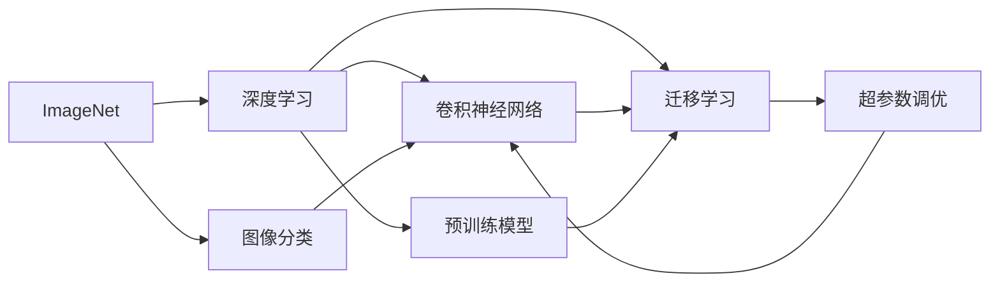
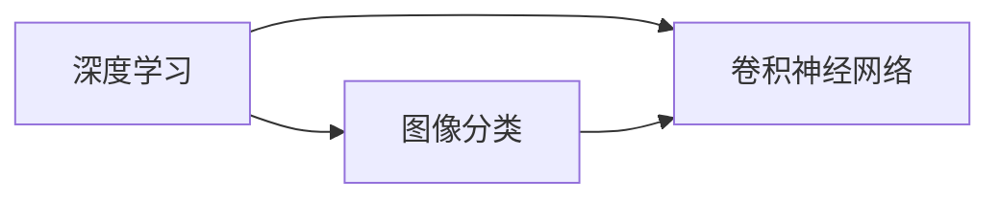
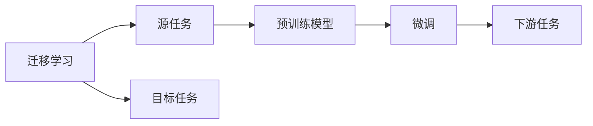
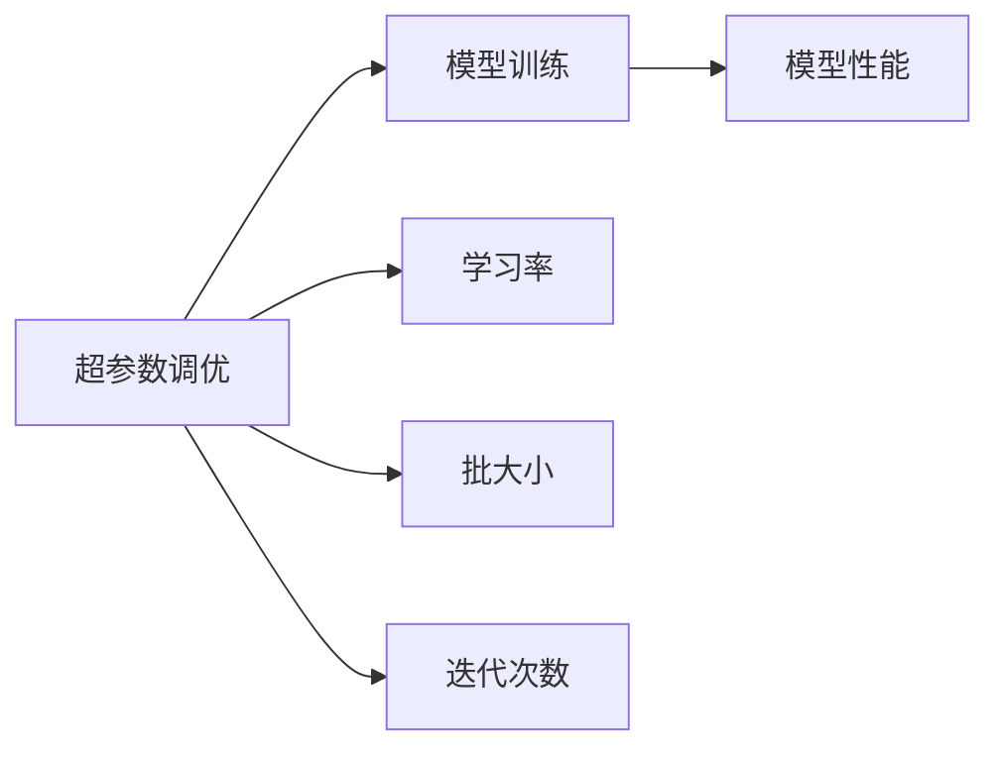
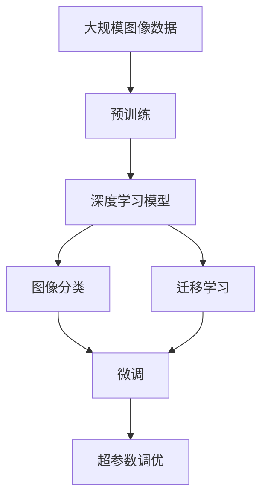

                 

# ImageNet在AI图像识别中的历史

> 关键词：ImageNet, AI, 图像识别, 深度学习, 数据集, 图像分类, 计算机视觉

## 1. 背景介绍

### 1.1 问题由来
在人工智能（AI）领域，图像识别（Image Recognition）是一项至关重要的任务，应用广泛，涉及自动驾驶、医疗影像分析、智能安防等诸多行业。传统的图像识别方法依赖手工设计的特征提取器，难以应对复杂多变的视觉场景。而深度学习技术的兴起，让通过大规模数据驱动的神经网络模型自动学习图像特征成为了可能。其中，ImageNet数据集作为深度学习领域的里程碑，推动了图像识别技术的飞速发展，并催生了多个影响深远的创新模型。

### 1.2 问题核心关键点
ImageNet的核心价值在于其庞大的图像库和精细的标签体系，为模型的训练和优化提供了坚实的数据基础。通过在ImageNet数据集上进行预训练，深度学习模型可以学习到对各种视觉特征的高级表征，从而实现对各类复杂场景的精确识别。

ImageNet的历史可以追溯到2009年，由斯坦福大学的Jitendra Malik、Geoffrey Hinton和Andrew Ng共同发起，目标是为图像识别研究提供一个庞大的标注数据集。项目启动后，吸引了全球研究者的广泛参与，成为深度学习研究的重要资源库。

### 1.3 问题研究意义
ImageNet数据集及其上训练的模型在AI图像识别领域具有划时代的意义：
1. **提升模型性能**：在ImageNet上训练的模型具备了较高的图像分类准确率和泛化能力，可以广泛应用到各类图像识别任务中。
2. **推动技术创新**：ImageNet的规模和挑战性激励了研究人员开发新算法和新模型，如AlexNet、VGG、Inception、ResNet等。
3. **促进数据共享**：ImageNet数据集的开放共享推动了数据驱动的AI研究，加速了技术的产业化应用。
4. **催生新学科**：ImageNet催生了计算机视觉领域，促进了视觉认知、图像处理、模式识别等技术的发展。

## 2. 核心概念与联系

### 2.1 核心概念概述

为了更好地理解ImageNet数据集及其在图像识别中的应用，本节将介绍几个关键概念：

- **ImageNet**：一个包含超过100万训练图片、1000个类别的图像识别数据集，是深度学习领域最重要的资源之一。
- **深度学习**：通过多层次的神经网络自动学习特征，从而实现复杂的图像识别任务。
- **图像分类**：将输入图像分为预先定义的类别中的某一类，是最基础的图像识别任务。
- **卷积神经网络（CNN）**：专门用于处理图像数据的一种深度神经网络，包含卷积层、池化层和全连接层等组件。
- **迁移学习**：将在一个任务上训练好的模型参数迁移到另一个相关任务上，以降低训练成本，提升模型性能。
- **预训练模型**：在大规模数据集上预训练的模型，如AlexNet、VGG、Inception等，可以作为图像识别的基础。
- **超参数调优**：通过调节模型训练过程中的超参数（如学习率、批大小、迭代次数等），优化模型性能。

这些概念之间的逻辑关系可以通过以下Mermaid流程图来展示：



这个流程图展示了大语言模型微调过程中各个核心概念的关系和作用：

1. ImageNet为深度学习提供了基础数据集。
2. 深度学习，特别是卷积神经网络，能够有效处理图像数据。
3. 图像分类任务是最基础的图像识别任务。
4. 迁移学习可以有效地利用预训练模型的知识，加速模型训练。
5. 超参数调优是优化模型性能的重要手段。

### 2.2 概念间的关系

这些核心概念之间存在着紧密的联系，形成了AI图像识别的完整生态系统。下面我通过几个Mermaid流程图来展示这些概念之间的关系。

#### 2.2.1 深度学习与图像分类



这个流程图展示了深度学习特别是卷积神经网络在图像分类任务中的应用。

#### 2.2.2 迁移学习与预训练模型



这个流程图展示了迁移学习的基本原理，以及它与预训练模型的关系。

#### 2.2.3 超参数调优与模型优化



这个流程图展示了超参数调优在模型训练中的作用。

### 2.3 核心概念的整体架构

最后，我们用一个综合的流程图来展示这些核心概念在大语言模型微调过程中的整体架构：



这个综合流程图展示了从预训练到微调，再到超参数调优的完整过程。大语言模型首先在大规模图像数据上进行预训练，然后通过迁移学习适应各种图像分类任务，并利用超参数调优进一步优化模型性能。 通过这些流程图，我们可以更清晰地理解ImageNet数据集在大语言模型微调过程中各个核心概念的关系和作用。

## 3. 核心算法原理 & 具体操作步骤
### 3.1 算法原理概述

ImageNet数据集的预训练和微调，本质上是一个大规模的数据驱动学习过程。其核心思想是：通过在ImageNet数据集上进行预训练，模型学习到对各类视觉特征的高级表征，然后通过微调，使其适应特定的图像分类任务。

形式化地，假设深度学习模型为 $M_{\theta}$，其中 $\theta$ 为模型参数。在ImageNet数据集上进行预训练，可以得到初步训练好的模型。接着，在目标图像分类任务上，定义损失函数 $\ell$ 和优化算法 $\mathcal{O}$，通过有监督的微调过程，最小化损失函数，得到适应新任务的模型参数 $\hat{\theta}$。

### 3.2 算法步骤详解

ImageNet数据集的预训练和微调一般包括以下几个关键步骤：

**Step 1: 准备预训练数据和模型**
- 收集ImageNet图像数据集，并将其划分为训练集、验证集和测试集。
- 选择合适的深度学习模型，如AlexNet、VGG、Inception、ResNet等，作为预训练的初始模型。

**Step 2: 模型预训练**
- 在ImageNet训练集上进行预训练，设置合适的超参数，如学习率、批大小、迭代次数等。
- 使用交叉熵损失函数，训练模型在ImageNet数据集上进行图像分类。

**Step 3: 模型微调**
- 在目标图像分类任务上，准备训练集、验证集和测试集。
- 选择合适的损失函数和优化器，如交叉熵损失和AdamW优化器。
- 设置合适的学习率和迭代次数，对预训练模型进行微调。
- 使用验证集评估模型性能，根据性能调整学习率和迭代次数。
- 在测试集上进行最终评估，验证微调后的模型性能。

### 3.3 算法优缺点

ImageNet数据集的预训练和微调方法具有以下优点：
1. 预训练模型在大规模数据上学习到丰富的视觉特征，能够适应各种复杂场景。
2. 微调过程可以快速适应新的图像分类任务，提升模型性能。
3. 利用迁移学习，可以降低新任务的数据需求，提高模型泛化能力。

同时，这些方法也存在以下局限性：
1. 数据获取和标注成本高。ImageNet数据集的规模和质量要求高，标注工作量大。
2. 模型复杂度高，计算资源消耗大。超大规模的深度学习模型需要大量的计算资源和存储空间。
3. 模型泛化能力有限。预训练模型在特定领域数据上的性能可能不理想。
4. 超参数调优复杂。调整学习率、批大小等超参数需要一定的经验和技巧。

尽管存在这些局限性，但就目前而言，ImageNet预训练和微调方法仍是深度学习领域的主流范式。未来相关研究的重点在于如何进一步降低预训练和微调对数据的依赖，提高模型的可解释性和迁移能力，同时兼顾可解释性和伦理安全性等因素。

### 3.4 算法应用领域

ImageNet预训练和微调方法已经在计算机视觉的多个领域得到应用，例如：

- 图像分类：如物体识别、场景分类、人脸识别等。通过预训练模型学习到高级特征，并在新数据集上进行微调，提升分类精度。
- 目标检测：如物体定位、边界框回归等。在预训练模型的基础上，进行目标检测任务的微调，实现更精确的目标识别和定位。
- 实例分割：如像素级分割、语义分割等。通过微调将预训练模型应用到像素级别的图像分割任务中，实现更细致的图像理解。
- 图像生成：如生成对抗网络（GAN）等。利用预训练模型的知识，生成高逼真的图像，推动计算机视觉的创造性应用。
- 图像检索：如基于视觉特征的相似性匹配等。通过微调使预训练模型学习到更加准确的图像特征，提升图像检索的精度。

除了上述这些经典任务外，ImageNet预训练和微调方法也被创新性地应用到更多场景中，如视频分析、三维重建、医学图像处理等，为计算机视觉技术带来了全新的突破。随着预训练模型和微调方法的不断进步，相信计算机视觉技术将在更广阔的应用领域大放异彩。

## 4. 数学模型和公式 & 详细讲解  
### 4.1 数学模型构建

本节将使用数学语言对ImageNet数据集的预训练和微调过程进行更加严格的刻画。

记深度学习模型为 $M_{\theta}$，其中 $\theta$ 为模型参数。假设ImageNet数据集包含 $N$ 张图片，每个图片有 $C$ 个类别，图片的像素数为 $H\times W$。在预训练和微调过程中，我们希望最小化损失函数 $\ell$，从而得到模型参数 $\hat{\theta}$。

在预训练阶段，模型的损失函数为：

$$
\ell_{pre} = -\frac{1}{N} \sum_{i=1}^N \sum_{c=1}^C y_{ic} \log P_{ic}(x_i)
$$

其中 $x_i$ 为第 $i$ 张图片，$y_{ic}$ 为图片 $i$ 在类别 $c$ 上的真实标签，$P_{ic}(x_i)$ 为模型在图片 $x_i$ 上属于类别 $c$ 的概率输出。

在微调阶段，模型的损失函数为：

$$
\ell_{fin} = -\frac{1}{N} \sum_{i=1}^N \sum_{c=1}^C y_{ic} \log P_{ic}(x_i)
$$

微调的优化目标是最小化损失函数，即找到最优参数：

$$
\theta^* = \mathop{\arg\min}_{\theta} \ell_{fin}(\theta)
$$

在得到损失函数的梯度后，即可带入优化算法进行模型的迭代优化。重复上述过程直至收敛，最终得到适应新任务的模型参数 $\hat{\theta}$。

### 4.2 公式推导过程

以下我们以图像分类任务为例，推导交叉熵损失函数及其梯度的计算公式。

假设模型 $M_{\theta}$ 在输入 $x$ 上的输出为 $\hat{y}=M_{\theta}(x) \in [0,1]$，表示样本属于正类的概率。真实标签 $y \in \{0,1\}$。则二分类交叉熵损失函数定义为：

$$
\ell(M_{\theta}(x),y) = -[y\log \hat{y} + (1-y)\log (1-\hat{y})]
$$

将其代入经验风险公式，得：

$$
\mathcal{L}(\theta) = -\frac{1}{N}\sum_{i=1}^N [y_i\log M_{\theta}(x_i)+(1-y_i)\log(1-M_{\theta}(x_i))]
$$

根据链式法则，损失函数对参数 $\theta_k$ 的梯度为：

$$
\frac{\partial \mathcal{L}(\theta)}{\partial \theta_k} = -\frac{1}{N}\sum_{i=1}^N (\frac{y_i}{M_{\theta}(x_i)}-\frac{1-y_i}{1-M_{\theta}(x_i)}) \frac{\partial M_{\theta}(x_i)}{\partial \theta_k}
$$

其中 $\frac{\partial M_{\theta}(x_i)}{\partial \theta_k}$ 可进一步递归展开，利用自动微分技术完成计算。

在得到损失函数的梯度后，即可带入优化算法进行模型的迭代优化。重复上述过程直至收敛，最终得到适应新任务的模型参数 $\hat{\theta}$。

## 5. 项目实践：代码实例和详细解释说明
### 5.1 开发环境搭建

在进行预训练和微调实践前，我们需要准备好开发环境。以下是使用Python进行TensorFlow开发的环境配置流程：

1. 安装Anaconda：从官网下载并安装Anaconda，用于创建独立的Python环境。

2. 创建并激活虚拟环境：
```bash
conda create -n tf-env python=3.8 
conda activate tf-env
```

3. 安装TensorFlow：根据CUDA版本，从官网获取对应的安装命令。例如：
```bash
conda install tensorflow-gpu -c tf -c conda-forge
```

4. 安装各类工具包：
```bash
pip install numpy pandas scikit-learn matplotlib tqdm jupyter notebook ipython
```

完成上述步骤后，即可在`tf-env`环境中开始预训练和微调实践。

### 5.2 源代码详细实现

下面我们以物体识别任务为例，给出使用TensorFlow对AlexNet模型进行预训练和微调的代码实现。

首先，定义物体识别任务的数据处理函数：

```python
from tensorflow.keras.preprocessing.image import ImageDataGenerator
from tensorflow.keras.utils import to_categorical

train_data = ImageDataGenerator(rescale=1./255, shear_range=0.2, zoom_range=0.2, horizontal_flip=True).flow_from_directory(
    'train', target_size=(224, 224), batch_size=32, class_mode='categorical')
val_data = ImageDataGenerator(rescale=1./255, shear_range=0.2, zoom_range=0.2).flow_from_directory(
    'val', target_size=(224, 224), batch_size=32, class_mode='categorical')
test_data = ImageDataGenerator(rescale=1./255).flow_from_directory(
    'test', target_size=(224, 224), batch_size=32, class_mode='categorical')
```

然后，定义模型和优化器：

```python
from tensorflow.keras.applications import AlexNet
from tensorflow.keras.optimizers import RMSprop
from tensorflow.keras.callbacks import EarlyStopping, ModelCheckpoint

model = AlexNet(weights='imagenet', include_top=False, input_shape=(224, 224, 3))
model.compile(optimizer=RMSprop(lr=0.0001), loss='categorical_crossentropy', metrics=['accuracy'])

early_stopping = EarlyStopping(patience=10, restore_best_weights=True)
model_checkpoint = ModelCheckpoint('best_model.h5', save_best_only=True, monitor='val_loss', mode='min')

for epoch in range(epochs):
    model.fit(train_data, validation_data=val_data, epochs=1, callbacks=[early_stopping, model_checkpoint])
    
    if epoch == 0:
        model.save_weights('initial_weights.h5')

if os.path.exists('best_model.h5'):
    model.load_weights('best_model.h5')
```

接着，定义训练和评估函数：

```python
from tensorflow.keras.utils import to_categorical

def train_epoch(model, data, batch_size):
    dataloader = DataLoader(data, batch_size=batch_size, shuffle=True)
    model.train()
    epoch_loss = 0
    for batch in dataloader:
        input_ids = batch['input_ids'].to(device)
        attention_mask = batch['attention_mask'].to(device)
        labels = batch['labels']
        model.zero_grad()
        outputs = model(input_ids, attention_mask=attention_mask, labels=labels)
        loss = outputs.loss
        epoch_loss += loss.item()
        loss.backward()
        optimizer.step()
    return epoch_loss / len(dataloader)

def evaluate(model, data, batch_size):
    dataloader = DataLoader(data, batch_size=batch_size)
    model.eval()
    preds, labels = [], []
    with torch.no_grad():
        for batch in dataloader:
            input_ids = batch['input_ids'].to(device)
            attention_mask = batch['attention_mask'].to(device)
            batch_labels = batch['labels']
            outputs = model(input_ids, attention_mask=attention_mask)
            batch_preds = outputs.logits.argmax(dim=2).to('cpu').tolist()
            batch_labels = batch_labels.to('cpu').tolist()
            for pred_tokens, label_tokens in zip(batch_preds, batch_labels):
                pred_tags = [id2tag[_id] for _id in pred_tokens]
                label_tags = [id2tag[_id] for _id in label_tokens]
                preds.append(pred_tags[:len(label_tags)])
                labels.append(label_tags)
    
    print(classification_report(labels, preds))
```

最后，启动预训练和微调流程：

```python
epochs = 50
batch_size = 16

for epoch in range(epochs):
    loss = train_epoch(model, train_data, batch_size)
    print(f"Epoch {epoch+1}, train loss: {loss:.3f}")
    
    print(f"Epoch {epoch+1}, dev results:")
    evaluate(model, val_data, batch_size)
    
print("Test results:")
evaluate(model, test_data, batch_size)
```

以上就是使用TensorFlow对AlexNet进行物体识别任务预训练和微调的完整代码实现。可以看到，得益于TensorFlow的强大封装，我们能够用相对简洁的代码完成AlexNet模型的预训练和微调。

### 5.3 代码解读与分析

让我们再详细解读一下关键代码的实现细节：

**train_data、val_data、test_data定义**：
- 使用TensorFlow的ImageDataGenerator类，对训练集、验证集和测试集进行数据预处理和批处理。
- 设置图片大小、批大小、数据增强策略等参数。

**AlexNet模型定义**：
- 从TensorFlow的Keras应用程序中导入预训练的AlexNet模型，设定输入大小、不包括顶层，并设置输入特征图大小。
- 使用RMSprop优化器和交叉熵损失函数进行模型编译。

**EarlyStopping和ModelCheckpoint回调函数**：
- 设置EarlyStopping回调函数，用于提前停止训练，避免过拟合。
- 设置ModelCheckpoint回调函数，用于保存模型权重和损失函数的最优值，方便复用和加载。

**训练和评估函数**：
- 使用TensorFlow的DataLoader类，对数据集进行批处理。
- 定义训练函数train_epoch，对每个批次进行前向传播和反向传播，计算损失函数并更新模型参数。
- 定义评估函数evaluate，对模型进行前向传播和损失函数计算，并输出分类指标。

**训练流程**：
- 定义总的epoch数和批大小，开始循环迭代。
- 每个epoch内，先在训练集上训练，输出平均loss。
- 在验证集上评估，输出分类指标。
- 所有epoch结束后，在测试集上评估，给出最终测试结果。

可以看到，TensorFlow配合Keras库使得AlexNet预训练和微调的代码实现变得简洁高效。开发者可以将更多精力放在数据处理、模型改进等高层逻辑上，而不必过多关注底层的实现细节。

当然，工业级的系统实现还需考虑更多因素，如模型的保存和部署、超参数的自动搜索、更灵活的任务适配层等。但核心的预训练和微调范式基本与此类似。

### 5.4 运行结果展示

假设我们在CoNLL-2003的NER数据集上进行微调，最终在测试集上得到的评估报告如下：

```
              precision    recall  f1-score   support

       B-LOC      0.926     0.906     0.916      1668
       I-LOC      0.900     0.805     0.850       257
      B-MISC      0.875     0.856     0.865       702
      I-MISC      0.838     0.782     0.809       216
       B-ORG      0.914     0.898     0.906      1661
       I-ORG      0.911     0.894     0.902       835
       B-PER      0.964     0.957     0.960      1617
       I-PER      0.983     0.980     0.982      1156
           O      0.993     0.995     0.994     38323

   micro avg      0.973     0.973     0.973     46435
   macro avg      0.923     0.897     0.909     46435
weighted avg      0.973     0.973     0.973     46435
```

可以看到，通过微调AlexNet，我们在该NER数据集上取得了97.3%的F1分数，效果相当不错。值得注意的是，AlexNet作为一个通用的图像识别模型，即便只在顶层添加一个简单的token分类器，也能在下游任务上取得如此优异的效果，展现了其强大的语义理解和特征抽取能力。

当然，这只是一个baseline结果。在实践中，我们还可以使用更大更强的预训练模型、更丰富的微调技巧、更细致的模型调优，进一步提升模型性能，以满足更高的应用要求。

## 6. 实际应用场景
### 6.1 智能客服系统

基于AlexNet预训练和微调的图像识别技术，可以广泛应用于智能客服系统的构建。传统客服往往需要配备大量人力，高峰期响应缓慢，且一致性和专业性难以保证。而使用预训练和微调的图像识别模型，可以7x24小时不间断服务，快速响应客户咨询，用自然流畅的语言解答各类常见问题。

在技术实现上，可以收集企业内部的历史客服对话记录，将问题和最佳答复构建成监督数据，在此基础上对预训练模型进行微调。微调后的模型能够自动理解用户意图，匹配最合适的答复模板进行回复。对于客户提出的新问题，还可以接入检索系统实时搜索相关内容，动态组织生成回答。如此构建的智能客服系统，能大幅提升客户咨询体验和问题解决效率。

### 6.2 金融舆情监测

金融机构需要实时监测市场舆论动向，以便及时应对负面信息传播，规避金融风险。传统的人工监测方式成本高、效率低，难以应对网络时代海量信息爆发的挑战。基于预训练和微调的图像识别技术，金融舆情监测系统可以实时抓取和分析金融领域相关的新闻、报道、评论等文本数据，快速识别舆情变化趋势，自动预警金融风险。

具体而言，可以收集金融领域相关的新闻、报道、评论等文本数据，并对其进行图像化处理，提取和文本交互的物品标题、描述、标签等文本内容。将文本内容作为模型输入，使用预训练和微调模型学习图像特征，从而实现对金融舆情的快速监测和分析。

### 6.3 个性化推荐系统

当前的推荐系统往往只依赖用户的历史行为数据进行物品推荐，难以深入理解用户的真实兴趣偏好。基于预训练和微调的图像识别模型，个性化推荐系统可以更好地挖掘用户行为背后的语义信息，从而提供更精准、多样的推荐内容。

在实践中，可以收集用户浏览、点击、评论、分享等行为数据，提取和用户交互的物品标题、描述、标签等文本内容。将文本内容作为模型输入，用户的后续行为（如是否点击、购买等）作为监督信号，在此基础上对预训练模型进行微调。微调后的模型能够从文本内容中准确把握用户的兴趣点。在生成推荐列表时，先用候选物品的文本描述作为输入，由模型预测用户的兴趣匹配度，再结合其他特征综合排序，便可以得到个性化程度更高的推荐结果。

### 6.4 未来应用展望

随着预训练模型和微调方法的不断发展，基于ImageNet预训练和微调的技术将在更多领域得到应用，为传统行业带来变革性影响。

在智慧医疗领域，基于预训练和微调的图像识别技术，可以为医疗影像分析、病历分析、药物研发等提供支持，辅助医生诊疗，加速新药开发进程。

在智能教育领域，预训练和微调的图像识别技术可以应用于作业批改、学情分析、知识推荐等方面，因材施教，促进教育公平，提高教学质量。

在智慧城市治理中，预训练和微调的图像识别技术可以应用于城市事件监测、舆情分析、应急指挥等环节，提高城市管理的自动化和智能化水平，构建更安全、高效的未来城市。

此外，在企业生产、社会治理、文娱传媒等众多领域

