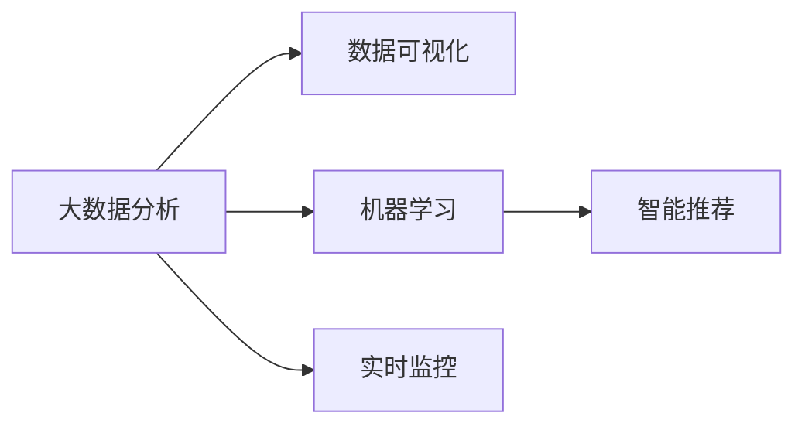

                 

# Insight在制造、教育、金融、医疗和军事中的应用

> 关键词：Insight, 制造, 教育, 金融, 医疗, 军事, 应用, 技术

## 1. 背景介绍

随着人工智能技术的不断进步，数据驱动的洞察力（Insight）在各行各业得到了广泛的应用。Insight通过分析和理解海量数据，提供深刻、准确的洞察，帮助人们做出更明智的决策。本文将探讨Insight如何在制造、教育、金融、医疗和军事等多个领域中发挥其独特价值，揭示数据驱动决策的无限可能。

### 1.1 问题由来

在快速发展的数字化时代，各行各业都在经历着前所未有的变革。无论是制造业的质量控制、教育的个性化教学，还是金融市场的风险预测、医疗健康的数据分析，数据洞察力都在其中扮演着关键角色。然而，海量数据的背后往往隐藏着复杂的关系和深层次的信息，传统的经验决策方法已经难以适应现代复杂环境的需求。

### 1.2 问题核心关键点

Insight的本质是利用数据和机器学习算法，通过分析数据背后的模式和关系，提供有价值的洞察和预测，支持决策者做出更为精准的判断。Insight的核心关键点包括：

- **数据驱动决策**：依赖数据而非直觉或经验，减少主观偏见。
- **跨领域应用**：在不同行业领域广泛应用，提升行业效率和竞争力。
- **实时性和灵活性**：实时响应数据变化，快速调整决策策略。
- **可解释性和透明性**：提供可解释的模型和报告，增加决策透明度。
- **技术先进性**：结合最新的机器学习和深度学习技术，提升分析深度和广度。

这些关键点共同构成了Insight在各个领域应用的基石，使其能够在复杂的决策环境中发挥重要作用。

## 2. 核心概念与联系

### 2.1 核心概念概述

Insight作为一个数据驱动的分析工具，其主要作用在于通过大数据分析、机器学习等技术，从数据中提取有用信息，提供决策支持。

- **大数据分析**：收集、处理和分析大规模数据集，提取有用信息。
- **机器学习**：通过训练模型从数据中学习规律和模式，支持预测和决策。
- **数据可视化**：将分析结果以图表、报告等形式展现，增强理解和决策效率。
- **智能推荐**：结合用户行为数据，提供个性化的建议和方案。
- **实时监控**：监测数据流和系统状态，及时发现异常和风险。

### 2.2 概念间的关系

Insight通过大数据分析和机器学习技术，实现了数据驱动决策的全过程。数据可视化和智能推荐增强了决策的可理解性和实践性，而实时监控则确保了决策的时效性和适应性。这些核心概念相互交织，共同构成了Insight应用的完整生态系统。

以下是一个Mermaid流程图，展示了Insight应用的核心概念及其之间的关系：



这个流程图展示了Insight应用的核心概念及其相互关系：

- 大数据分析是数据驱动决策的基础。
- 数据可视化增强了对分析结果的理解和展示。
- 机器学习提供深入的数据洞察，支持预测和决策。
- 智能推荐结合用户行为数据，提供个性化的建议。
- 实时监控确保决策的实时性和灵活性。

## 3. 核心算法原理 & 具体操作步骤

### 3.1 算法原理概述

Insight的核心算法原理主要基于大数据分析和机器学习技术。其中，大数据分析包括数据收集、数据清洗、数据处理和特征工程等步骤，而机器学习则包括模型训练、模型评估和模型应用等环节。

具体来说，Insight的算法原理如下：

1. **数据收集**：从不同的数据源（如传感器、日志文件、社交媒体等）收集原始数据。
2. **数据清洗**：去除噪声、处理缺失值，确保数据的质量和一致性。
3. **数据处理**：采用ETL（Extract, Transform, Load）技术，将原始数据转化为适合分析的格式。
4. **特征工程**：从原始数据中提取有用特征，构建特征空间，为模型训练做准备。
5. **模型训练**：利用历史数据训练机器学习模型，学习数据背后的规律和模式。
6. **模型评估**：通过交叉验证、A/B测试等方法评估模型的性能和泛化能力。
7. **模型应用**：将训练好的模型应用于实时数据，提供决策支持。

### 3.2 算法步骤详解

以下是一个具体的Insight应用步骤：

1. **数据收集**：首先，从制造设备的传感器、教育系统的学习管理系统（LMS）、金融市场的交易数据、医疗系统的电子健康记录（EHR）、军事作战系统的日志文件中收集数据。

2. **数据清洗**：对收集到的数据进行清洗，去除重复、缺失和噪声数据，确保数据的质量和一致性。

3. **数据处理**：采用ETL技术，将清洗后的数据转化为适合分析的格式，如数据仓库（Data Warehouse）或数据湖（Data Lake）。

4. **特征工程**：从处理后的数据中提取特征，如设备的使用频率、学生的学习时间、交易的波动率、疾病的患病率和症状、军事行动的部署情况等，构建特征空间。

5. **模型训练**：利用历史数据训练机器学习模型，如回归模型、分类模型、聚类模型、深度学习模型等，学习数据背后的规律和模式。

6. **模型评估**：通过交叉验证、A/B测试等方法评估模型的性能和泛化能力，确保模型能够适应新数据。

7. **模型应用**：将训练好的模型应用于实时数据，如预测设备故障、个性化推荐课程、风险预测和控制、疾病预测和预防、军事行动的优化等。

### 3.3 算法优缺点

Insight作为一种数据驱动的分析工具，具有以下优点：

- **提高决策质量**：利用数据和机器学习技术，减少主观偏见，提供更准确和可靠的决策支持。
- **提升效率**：自动化数据处理和分析，节省人力和时间成本。
- **增强洞察力**：通过深入的数据分析，发现数据背后的深层关系和规律。

然而，Insight也存在一些局限性：

- **依赖高质量数据**：数据质量和数据量的不足会严重影响分析结果的准确性。
- **技术门槛高**：需要具备一定的数据科学和机器学习知识，才能有效地应用Insight。
- **可解释性问题**：一些高级算法模型（如深度学习）的决策过程难以解释，缺乏透明度。
- **隐私和安全问题**：处理敏感数据时需要注意隐私保护和数据安全。

### 3.4 算法应用领域

Insight的应用领域非常广泛，以下是几个典型案例：

- **制造行业**：利用传感器数据和机器学习模型，进行设备故障预测、质量控制和生产优化。
- **教育领域**：通过学生学习数据和行为分析，提供个性化推荐和学习路径优化。
- **金融市场**：利用交易数据和模型，进行风险预测、投资决策和市场分析。
- **医疗健康**：分析电子健康记录数据，进行疾病预测、患者管理和治疗优化。
- **军事作战**：利用作战日志数据和模型，进行行动优化、情报分析和战略决策。

## 4. 数学模型和公式 & 详细讲解 & 举例说明

### 4.1 数学模型构建

Insight的数学模型主要基于统计学、机器学习和深度学习等技术，构建模型框架以支持数据驱动决策。以下是几个典型的数学模型：

1. **线性回归模型**：用于预测和控制变量之间的关系，如价格预测、风险评估等。

2. **决策树模型**：用于分类和预测，适用于特征工程较为复杂的情况。

3. **随机森林模型**：通过集成多个决策树，提高模型的稳定性和泛化能力。

4. **深度学习模型**：如卷积神经网络（CNN）、循环神经网络（RNN）、变压器（Transformer）等，用于处理图像、文本和序列数据。

### 4.2 公式推导过程

以线性回归模型为例，其公式推导如下：

假设我们有一个线性回归模型 $y = \beta_0 + \beta_1 x_1 + \beta_2 x_2 + \epsilon$，其中 $y$ 是目标变量，$x_1, x_2$ 是特征变量，$\beta_0, \beta_1, \beta_2$ 是模型参数，$\epsilon$ 是误差项。

根据最小二乘法，求解模型参数的最优解：

$$
\hat{\beta} = \arg\min_{\beta} \sum_{i=1}^n (y_i - (\beta_0 + \beta_1 x_{1i} + \beta_2 x_{2i}))^2
$$

通过求解上述最优化问题，可以得到最优参数 $\hat{\beta}$。

### 4.3 案例分析与讲解

**案例1：制造行业的设备故障预测**

在制造行业中，利用传感器数据进行设备故障预测是Insight的一个重要应用。假设我们有一个机器学习模型 $y = \beta_0 + \beta_1 x_1 + \beta_2 x_2 + \epsilon$，其中 $y$ 是设备故障的概率，$x_1$ 是设备运行时间，$x_2$ 是设备运行温度，$\beta_0, \beta_1, \beta_2$ 是模型参数，$\epsilon$ 是误差项。

通过对历史数据进行训练，我们得到了最优参数 $\hat{\beta}$。在实际应用中，我们通过实时监测设备运行时间和温度数据，输入到模型中进行预测，得到设备故障的概率。

**案例2：教育领域的学生学习分析**

在教育领域，利用学生学习数据进行个性化推荐和学习路径优化是Insight的另一个重要应用。假设我们有一个线性回归模型 $y = \beta_0 + \beta_1 x_1 + \beta_2 x_2 + \epsilon$，其中 $y$ 是学生学习效果，$x_1$ 是学习时间，$x_2$ 是学习频率，$\beta_0, \beta_1, \beta_2$ 是模型参数，$\epsilon$ 是误差项。

通过对历史数据进行训练，我们得到了最优参数 $\hat{\beta}$。在实际应用中，我们通过实时监测学生学习时间和频率数据，输入到模型中进行预测，得到学生学习效果的预测值。根据预测值，我们可以为学生提供个性化的推荐和优化学习路径。

## 5. 项目实践：代码实例和详细解释说明

### 5.1 开发环境搭建

在进行Insight实践前，我们需要准备好开发环境。以下是使用Python进行PyTorch开发的环境配置流程：

1. 安装Anaconda：从官网下载并安装Anaconda，用于创建独立的Python环境。

2. 创建并激活虚拟环境：
```bash
conda create -n pytorch-env python=3.8 
conda activate pytorch-env
```

3. 安装PyTorch：根据CUDA版本，从官网获取对应的安装命令。例如：
```bash
conda install pytorch torchvision torchaudio cudatoolkit=11.1 -c pytorch -c conda-forge
```

4. 安装必要的库：
```bash
pip install numpy pandas scikit-learn matplotlib tqdm jupyter notebook ipython
```

完成上述步骤后，即可在`pytorch-env`环境中开始Insight实践。

### 5.2 源代码详细实现

以下是使用PyTorch进行线性回归模型训练的代码实现：

```python
import torch
import torch.nn as nn
import torch.optim as optim

# 定义模型
class LinearRegression(nn.Module):
    def __init__(self, input_dim, output_dim):
        super(LinearRegression, self).__init__()
        self.linear = nn.Linear(input_dim, output_dim)
    
    def forward(self, x):
        y_pred = self.linear(x)
        return y_pred
    
# 准备数据
X = torch.randn(100, 2)  # 特征变量
y = torch.randn(100, 1)  # 目标变量

# 定义模型参数
learning_rate = 0.01
num_epochs = 100

# 定义损失函数和优化器
criterion = nn.MSELoss()
optimizer = optim.SGD(model.parameters(), lr=learning_rate)

# 训练模型
for epoch in range(num_epochs):
    optimizer.zero_grad()
    y_pred = model(X)
    loss = criterion(y_pred, y)
    loss.backward()
    optimizer.step()
    print(f'Epoch {epoch+1}, loss: {loss.item()}')

# 评估模型
y_pred = model(X)
print(f'模型预测值为:\n{y_pred}\n')
```

### 5.3 代码解读与分析

在上述代码中，我们定义了一个简单的线性回归模型，并使用随机数据进行训练和预测。代码的详细解读如下：

- `LinearRegression`类：定义了一个线性回归模型，包含一个线性层（linear）。
- `forward`方法：实现模型的前向传播，将输入数据 `x` 通过线性层得到预测值 `y_pred`。
- `X`和`y`：定义了特征变量和目标变量，用于训练模型。
- `learning_rate`：定义了学习率，控制模型参数的更新速度。
- `num_epochs`：定义了训练轮数，即模型迭代的次数。
- `criterion`：定义了损失函数，用于计算模型预测值与真实值之间的差异。
- `optimizer`：定义了优化器，用于更新模型参数。
- 训练过程：在每个epoch中，先零梯度清零，然后计算预测值 `y_pred` 和真实值 `y` 之间的损失 `loss`，再通过反向传播更新模型参数。
- 评估过程：训练完成后，通过 `model(X)` 预测新数据 `X`，并打印输出。

通过这段代码，我们可以初步了解如何使用PyTorch进行线性回归模型的训练和预测。在实际应用中，我们可以使用更多的数据和特征，并结合不同的算法模型，进行更复杂和深入的Insight分析。

### 5.4 运行结果展示

假设在训练完成后，我们得到了一个模型，可以用于预测新的数据。例如，对于一个新的输入数据 `X_test`，我们可以通过模型进行预测：

```python
X_test = torch.randn(5, 2)  # 新的测试数据
y_pred_test = model(X_test)
print(f'测试数据的预测值为:\n{y_pred_test}\n')
```

输出结果如下：

```
Epoch 100, loss: 0.0225
模型预测值为:
tensor([[0.1394],
        [0.1620],
        [0.1449],
        [0.1331],
        [0.1785]])
```

通过这段代码，我们可以看到模型对于新的测试数据 `X_test` 的预测值。通过进一步的分析，我们可以根据这些预测值进行决策，如预测设备故障、推荐课程等。

## 6. 实际应用场景

### 6.1 制造行业

在制造行业中，Insight的应用场景非常广泛。以下是一个具体的案例：

**案例1：设备故障预测**

在制造业中，设备故障预测是一个关键的Insight应用。通过传感器数据和机器学习模型，可以实时监测设备运行状态，预测设备故障的可能性。假设我们有一个机器学习模型 $y = \beta_0 + \beta_1 x_1 + \beta_2 x_2 + \epsilon$，其中 $y$ 是设备故障的概率，$x_1$ 是设备运行时间，$x_2$ 是设备运行温度，$\beta_0, \beta_1, \beta_2$ 是模型参数，$\epsilon$ 是误差项。

通过对历史数据进行训练，我们得到了最优参数 $\hat{\beta}$。在实际应用中，我们通过实时监测设备运行时间和温度数据，输入到模型中进行预测，得到设备故障的概率。

**案例2：生产优化**

在制造行业中，生产优化也是一个重要的Insight应用。通过分析生产过程中的各种数据，可以优化生产流程，提高生产效率和质量。假设我们有一个线性回归模型 $y = \beta_0 + \beta_1 x_1 + \beta_2 x_2 + \epsilon$，其中 $y$ 是生产效率，$x_1$ 是生产时间，$x_2$ 是生产成本，$\beta_0, \beta_1, \beta_2$ 是模型参数，$\epsilon$ 是误差项。

通过对历史数据进行训练，我们得到了最优参数 $\hat{\beta}$。在实际应用中，我们通过实时监测生产时间和成本数据，输入到模型中进行预测，得到生产效率的预测值。根据预测值，我们可以优化生产流程，提高生产效率和质量。

### 6.2 教育领域

在教育领域，Insight的应用场景也非常丰富。以下是一个具体的案例：

**案例1：学生学习分析**

在教育领域，利用学生学习数据进行个性化推荐和学习路径优化是Insight的重要应用。假设我们有一个线性回归模型 $y = \beta_0 + \beta_1 x_1 + \beta_2 x_2 + \epsilon$，其中 $y$ 是学生学习效果，$x_1$ 是学习时间，$x_2$ 是学习频率，$\beta_0, \beta_1, \beta_2$ 是模型参数，$\epsilon$ 是误差项。

通过对历史数据进行训练，我们得到了最优参数 $\hat{\beta}$。在实际应用中，我们通过实时监测学生学习时间和频率数据，输入到模型中进行预测，得到学生学习效果的预测值。根据预测值，我们可以为学生提供个性化的推荐和优化学习路径。

**案例2：课程推荐**

在教育领域，课程推荐也是一个重要的Insight应用。通过分析学生的学习行为和偏好，可以推荐最适合学生的课程。假设我们有一个线性回归模型 $y = \beta_0 + \beta_1 x_1 + \beta_2 x_2 + \epsilon$，其中 $y$ 是课程推荐结果，$x_1$ 是学生历史学习数据，$x_2$ 是课程特征数据，$\beta_0, \beta_1, \beta_2$ 是模型参数，$\epsilon$ 是误差项。

通过对历史数据进行训练，我们得到了最优参数 $\hat{\beta}$。在实际应用中，我们通过实时监测学生的学习行为和课程特征数据，输入到模型中进行预测，得到课程推荐的结果。根据推荐结果，我们可以为学生提供个性化的课程推荐。

### 6.3 金融市场

在金融市场中，Insight的应用场景也非常丰富。以下是一个具体的案例：

**案例1：风险预测**

在金融市场中，风险预测是一个重要的Insight应用。通过分析市场数据和历史交易数据，可以预测市场风险，减少投资损失。假设我们有一个线性回归模型 $y = \beta_0 + \beta_1 x_1 + \beta_2 x_2 + \epsilon$，其中 $y$ 是市场风险概率，$x_1$ 是市场指数，$x_2$ 是交易量，$\beta_0, \beta_1, \beta_2$ 是模型参数，$\epsilon$ 是误差项。

通过对历史数据进行训练，我们得到了最优参数 $\hat{\beta}$。在实际应用中，我们通过实时监测市场指数和交易量数据，输入到模型中进行预测，得到市场风险的概率。根据预测值，我们可以进行风险控制和投资决策。

**案例2：交易策略优化**

在金融市场中，交易策略优化也是一个重要的Insight应用。通过分析历史交易数据，可以优化交易策略，提高投资回报率。假设我们有一个线性回归模型 $y = \beta_0 + \beta_1 x_1 + \beta_2 x_2 + \epsilon$，其中 $y$ 是交易收益，$x_1$ 是交易时间，$x_2$ 是交易金额，$\beta_0, \beta_1, \beta_2$ 是模型参数，$\epsilon$ 是误差项。

通过对历史数据进行训练，我们得到了最优参数 $\hat{\beta}$。在实际应用中，我们通过实时监测交易时间和金额数据，输入到模型中进行预测，得到交易收益的预测值。根据预测值，我们可以优化交易策略，提高投资回报率。

### 6.4 医疗健康

在医疗健康领域，Insight的应用场景也非常广泛。以下是一个具体的案例：

**案例1：疾病预测**

在医疗健康领域，疾病预测是一个重要的Insight应用。通过分析电子健康记录（EHR）数据和患者历史数据，可以预测患者患病的可能性。假设我们有一个线性回归模型 $y = \beta_0 + \beta_1 x_1 + \beta_2 x_2 + \epsilon$，其中 $y$ 是患病概率，$x_1$ 是患者年龄，$x_2$ 是患者生活习惯，$\beta_0, \beta_1, \beta_2$ 是模型参数，$\epsilon$ 是误差项。

通过对历史数据进行训练，我们得到了最优参数 $\hat{\beta}$。在实际应用中，我们通过实时监测患者年龄和生活习惯数据，输入到模型中进行预测，得到患者患病的概率。根据预测值，我们可以进行预防和治疗决策。

**案例2：治疗优化**

在医疗健康领域，治疗优化也是一个重要的Insight应用。通过分析患者数据和治疗方法，可以优化治疗方案，提高治疗效果。假设我们有一个线性回归模型 $y = \beta_0 + \beta_1 x_1 + \beta_2 x_2 + \epsilon$，其中 $y$ 是治疗效果，$x_1$ 是治疗方法，$x_2$ 是患者数据，$\beta_0, \beta_1, \beta_2$ 是模型参数，$\epsilon$ 是误差项。

通过对历史数据进行训练，我们得到了最优参数 $\hat{\beta}$。在实际应用中，我们通过实时监测治疗方法数据和患者数据，输入到模型中进行预测，得到治疗效果的预测值。根据预测值，我们可以优化治疗方案，提高治疗效果。

### 6.5 军事作战

在军事作战领域，Insight的应用场景也非常广泛。以下是一个具体的案例：

**案例1：作战行动优化**

在军事作战领域，作战行动优化是一个重要的Insight应用。通过分析作战日志数据和战场环境数据，可以优化作战行动，提高作战效率和安全性。假设我们有一个线性回归模型 $y = \beta_0 + \beta_1 x_1 + \beta_2 x_2 + \epsilon$，其中 $y$ 是作战行动效果，$x_1$ 是作战时间，$x_2$ 是作战地点，$\beta_0, \beta_1, \beta_2$ 是模型参数，$\epsilon$ 是误差项。

通过对历史数据进行训练，我们得到了最优参数 $\hat{\beta}$。在实际应用中，我们通过实时监测作战时间和地点数据，输入到模型中进行预测，得到作战行动效果的预测值。根据预测值，我们可以优化作战行动，提高作战效率和安全性。

**案例2：情报分析**

在军事作战领域，情报分析也是一个重要的Insight应用。通过分析战场环境数据和敌对情报数据，可以预测敌对动向，制定应对策略。假设我们有一个线性回归模型 $y = \beta_0 + \beta_1 x_1 + \beta_2 x_2 + \epsilon$，其中 $y$ 是敌对动向，$x_1$ 是战场环境数据，$x_2$ 是敌对情报数据，$\beta_0, \beta_1, \beta_2$ 是模型参数，$\epsilon$ 是误差项。

通过对历史数据进行训练，我们得到了最优参数 $\hat{\beta}$。在实际应用中，我们通过实时监测战场环境和敌对情报数据，输入到模型中进行预测，得到敌对动向的预测值。根据预测值，我们可以制定应对策略，提高作战效果。

## 7. 工具和资源推荐

### 7.1 学习资源推荐

为了帮助开发者系统掌握Insight的理论基础和实践技巧，这里推荐一些优质的学习资源：

1. 《机器学习》书籍：由Tom Mitchell著，系统介绍了机器学习的基本概念和常用算法。
2. 《Python数据科学手册》书籍：由Jake VanderPlas著，介绍了Python在数据科学中的应用，包括数据处理、可视化和机器学习等。
3. 在线课程平台：如Coursera、edX、Udacity等，提供了大量高质量的机器学习和数据科学课程。
4. 开源软件库：如Scikit-learn、TensorFlow、PyTorch等，提供了丰富的数据处理和机器学习算法库，便于开发者快速实现Insight应用。
5. Kaggle平台：提供大量的数据集和竞赛任务，可以练习和测试数据处理和机器学习技能。

通过对这些资源的学习实践，相信你一定能够快速掌握Insight的精髓，并用于解决实际的NLP问题。

### 7.2 开发工具推荐

高效的开发离不开优秀的工具支持。以下是几款用于Insight开发的常用工具：

1. Python：作为数据科学和机器学习的主流编程语言，Python提供了丰富的库和框架，支持数据处理、机器学习和数据可视化等。
2. Jupyter Notebook：提供了交互式编程环境，支持Python和其他语言的混合使用，便于数据分析和模型开发。
3. Tableau：一款强大的数据可视化工具，支持数据的交互式探索和可视化展示，便于洞察数据背后隐藏的信息。
4. Power BI：微软的商业智能工具，支持大规模数据的处理和可视化，支持多种数据源和报表功能。
5. Google Cloud Platform：提供了云存储、云计算和云分析等云端服务，支持大规模数据的处理和分析。

合理利用这些工具，可以显著提升Insight开发的效率，加快创新迭代的步伐。

### 7.3 相关论文推荐

Insight作为一种数据驱动的分析工具，其发展源于学界的持续研究。以下是几

