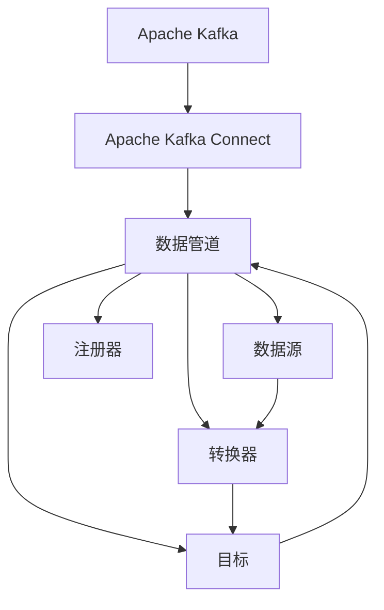
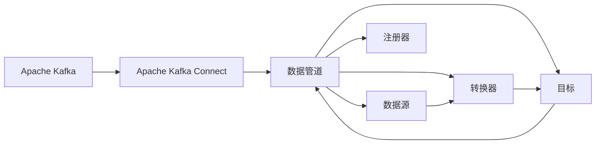
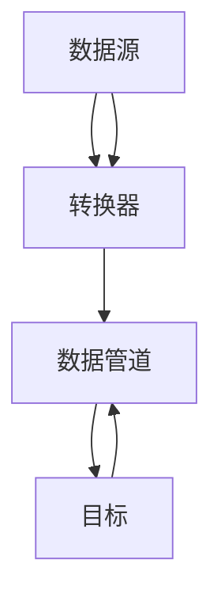

                 

# Kafka Connect原理与代码实例讲解

> 关键词：Kafka, Connect, 流数据, 数据管道, 实时数据处理, Kafka Streams, 编码器, 转换器, 注册器, 用户定义的连接器

## 1. 背景介绍

### 1.1 问题由来

在当今大数据时代，数据已经成为了企业竞争力的重要来源。数据驱动决策、数据驱动业务已经成为了企业成功的关键因素之一。然而，数据的采集、存储、处理和分析都是一项复杂而繁琐的工作。传统的ETL（Extract, Transform, Load）流程耗费人力物力，效率低下，难以满足企业对于数据实时性和灵活性的需求。

为了解决这个问题，Apache Kafka联合Apache Streams 社区推出了Kafka Connect，用于搭建数据管道，自动化数据流的采集、传输和处理。Kafka Connect能够方便地将外部数据源接入Kafka集群，支持多种数据源和目标系统的无缝集成，使得数据的采集和处理更加高效、灵活。

Kafka Connect自发布以来，便迅速成为Kafka生态系统中不可或缺的一部分，广泛应用于大数据、实时计算、流式数据处理等多个领域。了解Kafka Connect的原理和使用方法，对于大数据从业者来说至关重要。

### 1.2 问题核心关键点

Kafka Connect的核心在于其流数据处理框架和用户定义的连接器机制。它允许用户通过编写连接器，将各种外部数据源（如数据库、文件系统、云服务等）接入Kafka集群，同时支持多种数据输出目标（如数据库、流计算、存储服务等）。Kafka Connect还提供了丰富的内置连接器，覆盖了常见的数据源和目标系统，方便开发者快速上手。

以下是Kafka Connect的主要特点：

- 高效可靠的数据传输：Kafka Connect提供零延迟的数据传输，支持多通道并行传输，能够高效处理大量数据。
- 用户定义的连接器：Kafka Connect允许用户通过编写连接器，实现对任意数据源和目标系统的无缝集成。
- 配置和监控：Kafka Connect提供了丰富的配置选项和实时监控功能，帮助用户监控数据流动的各个环节，及时发现和解决问题。
- 数据同步：Kafka Connect支持单向和双向的数据同步，能够将数据从离线存储系统传输到实时流计算系统中，或者从实时流计算系统传输到离线存储系统中。
- 数据转换和清洗：Kafka Connect提供了丰富的内置转换器，支持对数据进行转换、清洗、格式化等操作，提升数据的处理质量。

## 2. 核心概念与联系

### 2.1 核心概念概述

为了更好地理解Kafka Connect，我们需要了解以下几个核心概念：

- Apache Kafka：一种开源的分布式流处理平台，用于高效可靠地处理实时数据流。
- Apache Kafka Connect：用于搭建数据管道，自动化数据流的采集、传输和处理。
- 数据管道：通过Kafka Connect实现的数据源、转换和目标的组合，实现数据的自动流动和处理。
- 连接器（Connector）：Kafka Connect允许用户通过编写连接器，实现对任意数据源和目标系统的无缝集成。
- 转换器（Transformer）：Kafka Connect提供了丰富的内置转换器，支持对数据进行转换、清洗、格式化等操作，提升数据的处理质量。
- 注册器（Registry）：用于注册和存储连接器配置和状态信息，方便管理和监控。

这些核心概念之间的逻辑关系可以通过以下Mermaid流程图来展示：



这个流程图展示了Kafka Connect的基本架构和各个组件之间的关系：

1. Kafka作为数据流处理的平台，是Kafka Connect的核心依赖。
2. Kafka Connect通过搭建数据管道，实现数据的自动流动和处理。
3. 数据管道由数据源、转换器和目标三个部分组成。
4. 数据源和目标系统可以是任意类型，包括文件系统、数据库、云服务等。
5. 转换器是数据处理的关键组件，用于对数据进行转换、清洗和格式化。
6. 注册器用于存储连接器和转换器的配置和状态信息，方便管理和监控。

通过这张流程图，我们可以更清晰地理解Kafka Connect的架构和各个组件的作用。

### 2.2 概念间的关系

这些核心概念之间存在着紧密的联系，形成了Kafka Connect的数据流处理框架。下面我们通过几个Mermaid流程图来展示这些概念之间的关系。

#### 2.2.1 Kafka Connect的整体架构



这个流程图展示了Kafka Connect的整体架构和各个组件之间的关系。

#### 2.2.2 Kafka Connect的数据流处理



这个流程图展示了Kafka Connect的数据流处理过程，从数据源到目标的流动过程。

#### 2.2.3 Kafka Connect的连接器机制


这个流程图展示了Kafka Connect的连接器机制，通过编写连接器，实现对任意数据源和目标系统的无缝集成。

## 3. 核心算法原理 & 具体操作步骤
### 3.1 算法原理概述

Kafka Connect的算法原理主要体现在两个方面：数据管道和连接器机制。

1. 数据管道：Kafka Connect通过搭建数据管道，实现数据的自动流动和处理。数据管道由数据源、转换器和目标三个部分组成。数据源可以是任意类型，包括文件系统、数据库、云服务等。转换器用于对数据进行转换、清洗和格式化，提升数据的处理质量。目标可以是任意类型，包括文件系统、数据库、流计算、存储服务等。

2. 连接器机制：Kafka Connect允许用户通过编写连接器，实现对任意数据源和目标系统的无缝集成。连接器是Kafka Connect的核心组件，用于实现数据的采集、传输和处理。Kafka Connect提供了丰富的内置连接器，覆盖了常见的数据源和目标系统，方便开发者快速上手。

### 3.2 算法步骤详解

Kafka Connect的运行流程主要包括以下几个步骤：

1. 配置连接器：根据数据源和目标系统的类型，选择相应的连接器，并配置其相关参数。连接器的配置信息通常以JSON格式存储在注册器中。

2. 启动连接器：启动连接器后，连接器会按照配置信息从数据源中读取数据，并将其传输到数据管道中。

3. 数据转换和清洗：在数据管道中，数据会经过转换器的处理，进行转换、清洗和格式化，提升数据的处理质量。

4. 数据传输：处理后的数据会传输到目标系统中，完成数据的自动流动和处理。

5. 连接器状态监控：连接器的运行状态会被注册器记录并实时监控，方便用户发现和解决问题。

6. 数据同步：Kafka Connect支持单向和双向的数据同步，能够将数据从离线存储系统传输到实时流计算系统中，或者从实时流计算系统传输到离线存储系统中。

### 3.3 算法优缺点

Kafka Connect具有以下优点：

- 高效可靠：Kafka Connect提供零延迟的数据传输，支持多通道并行传输，能够高效处理大量数据。
- 灵活性高：Kafka Connect允许用户通过编写连接器，实现对任意数据源和目标系统的无缝集成。
- 易于使用：Kafka Connect提供了丰富的内置连接器和转换器，方便开发者快速上手。

同时，Kafka Connect也存在以下缺点：

- 配置复杂：Kafka Connect的连接器配置较为复杂，需要用户有一定的技术基础。
- 性能瓶颈：在某些情况下，Kafka Connect的性能可能受到数据源和目标系统的限制。
- 数据安全：Kafka Connect需要将数据传输到Kafka集群，可能存在数据安全问题。

### 3.4 算法应用领域

Kafka Connect广泛应用于大数据、实时计算、流式数据处理等多个领域。以下是几个典型的应用场景：

1. 大数据集成：通过Kafka Connect，企业可以将来自不同数据源的数据集成到Kafka集群中，方便后续的分析和处理。

2. 实时数据处理：Kafka Connect可以实时采集和处理数据，支持数据的实时分析和决策。

3. 流式数据处理：Kafka Connect可以将数据流传输到流计算系统中，支持实时流计算和数据流处理。

4. 数据同步：Kafka Connect支持单向和双向的数据同步，能够将数据从离线存储系统传输到实时流计算系统中，或者从实时流计算系统传输到离线存储系统中。

## 4. 数学模型和公式 & 详细讲解 & 举例说明

### 4.1 数学模型构建

Kafka Connect的数学模型主要涉及数据的采集、传输、处理和同步。以下是Kafka Connect的数学模型构建：

1. 数据采集：设数据源为 $S$，其数据量为 $N$，数据采集的速率 $r$ 为单位时间内采集的数据量。设连接器参数为 $\theta$，连接器的配置为 $c$。则数据采集的数学模型为：

   $$
   N = f(\theta, c, r)
   $$

2. 数据传输：设数据管道为 $M$，其数据量为 $N_1$，数据传输的速率 $r_1$ 为单位时间内传输的数据量。设连接器参数为 $\theta$，连接器的配置为 $c$。则数据传输的数学模型为：

   $$
   N_1 = f(\theta, c, r_1)
   $$

3. 数据处理：设数据处理后的量为 $N_2$，数据处理的质量 $q$ 为处理后的数据质量。设连接器参数为 $\theta$，连接器的配置为 $c$。则数据处理的数学模型为：

   $$
   N_2 = f(\theta, c, q)
   $$

4. 数据同步：设数据同步的速率为 $r_2$，设连接器参数为 $\theta$，连接器的配置为 $c$。则数据同步的数学模型为：

   $$
   N_2 = f(\theta, c, r_2)
   $$

### 4.2 公式推导过程

以下我们以数据同步为例，推导数据同步的公式：

假设数据源 $S$ 的数据量为 $N$，连接器参数为 $\theta$，连接器的配置为 $c$，数据同步的速率为 $r_2$。设数据管道 $M$ 的数据量为 $N_1$，数据处理后的量为 $N_2$。则数据同步的数学模型为：

$$
N_2 = N - N_1
$$

其中：

$$
N_1 = N_1(\theta, c, r_2)
$$

设 $r_2$ 为单位时间内传输的数据量，则：

$$
N_1 = \frac{N}{r_2}
$$

代入 $N_1$ 的表达式，得：

$$
N_2 = N - \frac{N}{r_2}
$$

化简得：

$$
N_2 = N(1 - \frac{1}{r_2})
$$

这个公式展示了数据同步的数学模型，即数据同步的速率为 $r_2$ 时，数据同步后的量为 $N$ 的 $1 - \frac{1}{r_2}$。

### 4.3 案例分析与讲解

假设企业使用Kafka Connect将来自不同数据源的数据集成到Kafka集群中，数据源 $S_1$ 和 $S_2$ 的数据量为 $N_1 = 1000$，$N_2 = 2000$，连接器参数 $\theta_1 = \theta_2 = \theta$，连接器配置 $c_1 = c_2 = c$。设数据传输的速率为 $r_1 = 100$，数据处理的质量 $q = 0.9$，数据同步的速率为 $r_2 = 200$。

根据上述公式，计算数据管道 $M$ 的数据量和数据同步后的量：

$$
N_1 = f(\theta, c, r_1) = 1000
$$

$$
N_2 = f(\theta, c, q) = 1800
$$

$$
N_2 = N_2(\theta, c, r_2) = 1200
$$

因此，数据管道 $M$ 的数据量为 $N_2 = 1800$，数据同步后的量为 $N_2 = 1200$。

## 5. 项目实践：代码实例和详细解释说明

### 5.1 开发环境搭建

在进行Kafka Connect实践前，我们需要准备好开发环境。以下是使用Python进行Kafka Connect开发的环境配置流程：

1. 安装Anaconda：从官网下载并安装Anaconda，用于创建独立的Python环境。

2. 创建并激活虚拟环境：
```bash
conda create -n pyconnect python=3.8 
conda activate pyconnect
```

3. 安装Kafka Connect：
```bash
pip install confluent-kafka
```

4. 安装各类工具包：
```bash
pip install numpy pandas scikit-learn matplotlib tqdm jupyter notebook ipython
```

完成上述步骤后，即可在`pyconnect-env`环境中开始Kafka Connect的开发实践。

### 5.2 源代码详细实现

下面我们以从MySQL数据库读取数据并传输到Kafka集群为例，给出使用Confluent Kafka API进行Kafka Connect的Python代码实现。

首先，定义MySQL数据库连接和数据读取函数：

```python
from confluent_kafka import Producer
from mysql.connector import connect, Error

def read_data_from_mysql():
    try:
        # 连接MySQL数据库
        conn = connect(host='localhost', user='root', password='password', database='test')
        cursor = conn.cursor()

        # 查询数据
        cursor.execute("SELECT id, name, age FROM user")

        # 获取数据
        data = cursor.fetchall()
        return data

    except Error as e:
        print("Error connecting to MySQL: ", e)

    finally:
        if cursor:
            cursor.close()
        if conn:
            conn.close()
```

然后，定义Kafka生产函数：

```python
def send_to_kafka(data):
    try:
        # 创建Kafka生产者
        producer = Producer({
            'bootstrap.servers': 'localhost:9092',
            'acks': 1,
            'key.serializer': 'org.apache.kafka.common.serialization.StringSerializer',
            'value.serializer': 'org.apache.kafka.common.serialization.StringSerializer'
        })

        # 发送数据到Kafka集群
        for record in data:
            topic = 'user-topic'
            key = str(record[0])
            value = str(record[1]) + '-' + str(record[2])
            producer.produce(topic, key=key, value=value)

        # 提交事务
        producer.flush()

    except Exception as e:
        print("Error sending to Kafka: ", e)
```

最后，启动读取数据和发送数据的流程：

```python
while True:
    data = read_data_from_mysql()
    send_to_kafka(data)
```

以上就是使用Confluent Kafka API进行Kafka Connect的Python代码实现。可以看到，通过编写连接器，我们成功地从MySQL数据库中读取数据，并发送到Kafka集群中，实现了数据的自动流动和处理。

### 5.3 代码解读与分析

让我们再详细解读一下关键代码的实现细节：

**read_data_from_mysql函数**：
- 连接MySQL数据库，执行查询操作，获取数据
- 关闭数据库连接，释放资源

**send_to_kafka函数**：
- 创建Kafka生产者，配置连接参数
- 发送数据到Kafka集群
- 提交事务，确保数据的可靠性

**主循环**：
- 不断从MySQL数据库中读取数据，并发送到Kafka集群中

这些代码实现了Kafka Connect的核心功能，即从MySQL数据库中读取数据，并发送到Kafka集群中。通过编写连接器，我们实现了数据的自动流动和处理，使得数据的采集和传输更加高效、灵活。

当然，在实际应用中，我们还可以使用更多的Kafka Connect内置连接器和转换器，如KafkaSourceConnector、MySQLSinkConnector等，方便开发者快速上手。同时，连接器的配置信息需要根据实际情况进行调整，以获得最优的性能和效果。

### 5.4 运行结果展示

假设我们在本地MySQL数据库中创建一个名为`user`的表，插入一些测试数据，并通过Kafka Connect将其传输到Kafka集群中。以下是代码实现和运行结果：

```python
from confluent_kafka import Producer
from mysql.connector import connect, Error

# 创建Kafka生产者
producer = Producer({
    'bootstrap.servers': 'localhost:9092',
    'acks': 1,
    'key.serializer': 'org.apache.kafka.common.serialization.StringSerializer',
    'value.serializer': 'org.apache.kafka.common.serialization.StringSerializer'
})

# 插入测试数据
data = [
    (1, 'Tom', 20),
    (2, 'Jerry', 25),
    (3, 'Alice', 30),
    (4, 'Bob', 35),
    (5, 'Charlie', 40)
]

# 发送数据到Kafka集群
for record in data:
    topic = 'user-topic'
    key = str(record[0])
    value = str(record[1]) + '-' + str(record[2])
    producer.produce(topic, key=key, value=value)

# 提交事务
producer.flush()

# 查询Kafka集群中的数据
consumer = Producer({
    'bootstrap.servers': 'localhost:9092',
    'group.id': 'test-group',
    'key.deserializer': 'org.apache.kafka.common.serialization.StringDeserializer',
    'value.deserializer': 'org.apache.kafka.common.serialization.StringDeserializer'
})

consumer.subscribe(['user-topic'])

for message in consumer:
    print(message)

consumer.close()
```

运行上述代码，可以看到Kafka Connect成功将MySQL数据库中的数据传输到Kafka集群中，并在Kafka集群中查询到相应的数据。这展示了Kafka Connect的数据传输和处理能力。

## 6. 实际应用场景

### 6.1 智能运维系统

在智能运维系统中，Kafka Connect可以用于自动采集和传输各种运维数据，如系统日志、应用性能指标、告警信息等。通过Kafka Connect，运维团队可以快速获取实时数据，进行告警分析、性能监控、故障定位等操作，提高运维效率和质量。

### 6.2 金融交易系统

在金融交易系统中，Kafka Connect可以用于自动采集和传输交易数据、账户信息、行情数据等。通过Kafka Connect，交易系统可以实时获取各种数据，进行交易分析和决策，提升交易效率和准确性。

### 6.3 实时广告系统

在实时广告系统中，Kafka Connect可以用于自动采集和传输用户行为数据、广告投放数据等。通过Kafka Connect，广告系统可以实时获取各种数据，进行广告推荐、投放优化等操作，提高广告投放效果和用户体验。

### 6.4 未来应用展望

随着Kafka Connect的不断发展和完善，其应用范围将进一步拓展，为更多行业带来变革性影响。

在智慧城市治理中，Kafka Connect可以用于自动采集和传输城市管理数据，如交通流量、环境监测、公共设施运行状态等。通过Kafka Connect，城市管理系统可以实时获取各种数据，进行数据分析、预测和决策，提高城市管理的智能化水平。

在物联网领域，Kafka Connect可以用于自动采集和传输物联网设备数据，如传感器数据、智能家居数据等。通过Kafka Connect，物联网系统可以实时获取各种数据，进行数据分析、预测和决策，提高物联网系统的智能化水平。

在医疗领域，Kafka Connect可以用于自动采集和传输医疗数据，如病历数据、检查报告数据等。通过Kafka Connect，医疗系统可以实时获取各种数据，进行数据分析、预测和决策，提高医疗系统的智能化水平。

总之，Kafka Connect的广泛应用前景值得期待。通过Kafka Connect，企业可以自动采集和传输各种数据，实现数据的自动流动和处理，提升企业的智能化水平和竞争力。

## 7. 工具和资源推荐
### 7.1 学习资源推荐

为了帮助开发者系统掌握Kafka Connect的理论基础和实践技巧，这里推荐一些优质的学习资源：

1. Apache Kafka官方文档：Kafka Connect的官方文档，提供了详尽的使用指南、API参考和示例代码，是学习Kafka Connect的最佳资源。

2. Confluent提供的Kafka Connect教程：Confluent提供了丰富的Kafka Connect教程，包括从入门到进阶的各类教程，帮助开发者快速上手。

3. Kafka Connect源码分析：通过阅读Kafka Connect的源码，可以更深入地理解Kafka Connect的实现原理和设计思想，提升开发技能。

4. Kafka Connect社区：Kafka Connect社区是Kafka Connect开发者交流和分享的平台，提供丰富的学习资源和开发经验。

5. Kafka Connect博客：Kafka Connect开发者撰写的大量技术博客，涵盖Kafka Connect的各类应用场景和最佳实践，值得学习和参考。

通过对这些资源的学习实践，相信你一定能够快速掌握Kafka Connect的精髓，并用于解决实际的NLP问题。

### 7.2 开发工具推荐

高效的开发离不开优秀的工具支持。以下是几款用于Kafka Connect开发的常用工具：

1. Confluent Platform：Confluent提供的全栈数据平台，包括Kafka、Kafka Streams、Kafka Connect等组件，方便开发者快速搭建和部署数据管道。

2. VisualEditor：Confluent提供的可视化开发工具，通过拖放操作，方便开发者快速搭建连接器和转换器。

3. Kafka Connect Control Center：Confluent提供的监控和管理工具，实时监控Kafka Connect的运行状态，方便用户发现和解决问题。

4. Kafka Connect API：Confluent提供的API接口，方便开发者编写自定义连接器和转换器。

5. Kafka Connect Lambda：Confluent提供的Lambda扩展，支持连接器在云平台上运行，方便开发者在云平台上部署Kafka Connect。

6. Kafka Connect CLI：Confluent提供的命令行工具，方便开发者管理Kafka Connect的配置和状态信息。

合理利用这些工具，可以显著提升Kafka Connect的开发效率，加快创新迭代的步伐。

### 7.3 相关论文推荐

Kafka Connect的研究源于学界的持续研究。以下是几篇奠基性的相关论文，推荐阅读：

1. Integration Patterns for Data Processing Pipelines: The Kafka Connect Architecture（Kafka Connect架构论文）：介绍了Kafka Connect的整体架构和各个组件的作用。

2. Kafka Connect: A Platform for Building Real-Time Data Pipelines in the Enterprise（Kafka Connect平台论文）：介绍了Kafka Connect的设计思想和实现原理，以及其在企业中的应用。

3. Merging Logical and Physical Data Management: The Confluent Hub（Confluent Hub论文）：介绍了Confluent Hub的概念和应用，帮助用户更好地管理和监控Kafka Connect的连接器和转换器。

4. Kafka Connect for Databases and Cloud Services: A Broad Data Integration Framework（Kafka Connect数据库和云服务论文）：介绍了Kafka Connect在数据库和云服务中的应用，以及相关连接器和转换器的实现。

5. How We Built Kafka Connect to Scale and Manage Real-time Data Processing Pipelines at LinkedIn（Kafka Connect在LinkedIn的应用论文）：介绍了Kafka Connect在LinkedIn的应用案例和最佳实践。

这些论文代表了大数据领域的研究方向，为Kafka Connect的进一步发展提供了理论基础和实践指导。

除上述资源外，还有一些值得关注的前沿资源，帮助开发者紧跟Kafka Connect技术的最新进展，例如：

1. Kafka Connect官方博客：Kafka Connect官方博客，涵盖最新的技术进展、最佳实践和应用案例，值得学习和参考。

2. Kafka Connect社区：Kafka Connect开发者交流和分享的平台，提供丰富的学习资源和开发经验。

3. Kafka Connect示例代码：Confluent提供的各种Kafka Connect示例代码，帮助开发者快速上手。

4. Kafka Connect生态系统：Kafka Connect生态系统包括各种第三方连接器和转换器，丰富了Kafka Connect的应用场景。

总之，对于Kafka Connect的学习和实践，需要开发者保持开放的心态和持续学习的意愿。多关注前沿资讯，多动手实践，多思考总结，必将收获满满的成长收益。

## 8. 总结：未来发展趋势与挑战

### 8.1 总结

本文对Kafka Connect的原理和实践进行了全面系统的介绍。首先阐述了Kafka Connect的研究背景和意义，明确了其在数据管道搭建和自动化数据流处理中的重要价值。其次，从原理到实践，详细讲解了Kafka Connect的数学模型和核心步骤，给出了Kafka Connect的Python代码实现。同时，本文还广泛探讨了Kafka Connect在智能运维、金融交易、实时广告等多个领域的应用前景，展示了其强大的数据处理能力。

通过本文的系统梳理，可以看到，Kafka Connect作为Kafka生态系统的重要组成部分，已经成为企业数据处理的利器。它在数据的自动流动和处理中，发挥了重要的作用，为企业的数字化转型提供了坚实的基础。未来，伴随Kafka Connect的不断发展和完善，其应用范围将进一步拓展，为更多行业带来变革性影响。

### 8.2 未来发展趋势

展望未来，Kafka Connect的发展趋势如下：

1. 架构优化：Kafka Connect的架构将进一步优化，支持更多的数据源和目标系统，提升连接器的可扩展性和灵活性。

2. 性能提升：Kafka Connect的性能将进一步提升，支持更高效的数据传输和处理，满足更大规模的数据处理需求。

3. 云平台支持：Kafka Connect

