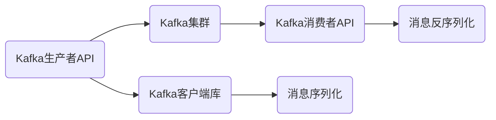
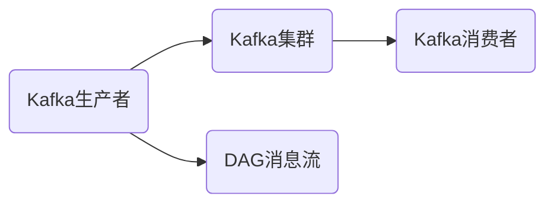

                 

# Kafka生产者消费者API原理与代码实例讲解

> 关键词：Kafka, Kafka生产者, Kafka消费者, API, 高并发, 分布式, 消息队列

## 1. 背景介绍

Kafka作为一个分布式消息队列，是现代分布式系统架构的重要组成部分。它提供高吞吐量、高可扩展性和高可用性，广泛应用于各类大数据和实时数据处理场景。Kafka的生产者API和消费者API是Kafka的核心接口，通过它们可以方便地实现消息的发布和订阅。

然而，由于Kafka系统架构复杂，API使用起来也较为复杂，本文将详细介绍Kafka生产者API和消费者API的原理，并通过代码实例进行讲解，帮助读者更好地理解和掌握Kafka的使用。

## 2. 核心概念与联系

### 2.1 核心概念概述

Kafka生产者API和消费者API是Kafka系统中的核心组件，它们负责将消息生产到Kafka集群中，并从Kafka集群中读取消息。

- **Kafka生产者API**：Kafka生产者API提供了生产消息的接口，生产者将消息序列化后发送到Kafka集群中的topic。

- **Kafka消费者API**：Kafka消费者API提供了从Kafka集群中读取消息的接口，消费者从topic中读取消息，并对其进行处理。

这两个API都通过Kafka客户端库进行访问，Kafka客户端库提供了一系列API函数，方便开发者使用。

### 2.2 概念间的关系

Kafka生产者API和消费者API之间有着紧密的联系，它们通过Kafka集群中的topic进行通信。生产者将消息发布到topic中，消费者从topic中订阅消息。在Kafka集群中，topic是多订阅者模式，多个消费者可以同时订阅同一个topic，接收同一个topic中的消息。

Kafka生产者API和消费者API的架构关系如下图所示：



从图中可以看出，Kafka生产者API通过Kafka客户端库将消息序列化后发送到Kafka集群，而Kafka消费者API通过Kafka客户端库从Kafka集群中读取消息并反序列化。

## 3. 核心算法原理 & 具体操作步骤

### 3.1 算法原理概述

Kafka生产者API和消费者API的基本原理是通过Kafka客户端库与Kafka集群进行通信。生产者将消息序列化后发送到Kafka集群中的topic，而消费者从topic中订阅消息并反序列化。

Kafka的架构采用分布式架构，多个生产者和消费者可以同时访问同一个topic，大大提高了系统的吞吐量和可用性。

### 3.2 算法步骤详解

#### 3.2.1 生产者API操作

Kafka生产者API的基本操作包括创建生产者、发送消息和关闭生产者。

- **创建生产者**：首先需要创建Kafka生产者，指定Kafka集群中的broker地址和topic名称。

- **发送消息**：使用生产者API发送消息，将消息序列化后发送到Kafka集群中的topic。

- **关闭生产者**：完成消息发送后，需要关闭生产者，释放资源。

#### 3.2.2 消费者API操作

Kafka消费者API的基本操作包括创建消费者、订阅消息和关闭消费者。

- **创建消费者**：首先需要创建Kafka消费者，指定Kafka集群中的broker地址和topic名称。

- **订阅消息**：使用消费者API订阅消息，从topic中读取消息并反序列化。

- **关闭消费者**：完成消息订阅后，需要关闭消费者，释放资源。

### 3.3 算法优缺点

Kafka生产者API和消费者API的优点在于：

- **高吞吐量**：Kafka使用高效的消息存储和传输机制，能够支持高并发消息的发送和接收。

- **可扩展性强**：Kafka集群采用分布式架构，可以轻松扩展生产者和消费者的数量，提升系统的处理能力。

- **高可用性**：Kafka集群中的broker可以自动故障转移，保证系统的可靠性和高可用性。

Kafka生产者API和消费者API的缺点在于：

- **配置复杂**：Kafka集群需要配置多个broker和分区，配置复杂且容易出错。

- **延迟不可控**：Kafka的消息延迟不可控，依赖于网络延迟和磁盘读写速度，不适合对延迟要求高的场景。

- **难以保证消息顺序**：由于Kafka采用分布式架构，消息的顺序无法保证，可能会导致数据不一致。

### 3.4 算法应用领域

Kafka生产者API和消费者API可以应用于各种大数据和实时数据处理场景，例如：

- **实时数据流处理**：将实时数据流化，使用Kafka作为数据流的消息队列，便于进行实时数据处理和分析。

- **分布式事务处理**：使用Kafka作为分布式事务的消息队列，保证分布式事务的一致性和可靠性。

- **消息队列系统**：Kafka可以作为消息队列系统，支持消息的存储、传输和处理，用于构建各种分布式系统。

## 4. 数学模型和公式 & 详细讲解

Kafka生产者API和消费者API的实现基于Kafka集群中的消息存储和传输机制。下面我们将详细介绍Kafka的消息存储和传输机制。

### 4.1 数学模型构建

Kafka的消息存储和传输机制基于日志结构的消息存储，消息存储在分区中。分区是Kafka中的基本存储单位，每个分区包含一个连续的日志文件序列，每个日志文件包含多个消息。

消息的存储和传输可以抽象为消息流，消息流可以表示为有向无环图(DAG)，如下图所示：



Kafka的消息流由多个消息队列组成，每个消息队列包含一个或多个分区，每个分区包含一个连续的日志文件序列。消息从生产者发送到Kafka集群中的topic，由Kafka集群中的broker负责管理和存储。

### 4.2 公式推导过程

Kafka的消息存储和传输机制主要涉及以下几个公式：

- **分区数计算公式**：
  $$
  \text{分区数} = \text{消息总数} \times \text{分区因子}
  $$
  其中，消息总数为生产者发送的消息数，分区因子为1到3之间的整数，用于控制每个分区的平均消息数。

- **消息存储公式**：
  $$
  \text{消息存储量} = \text{消息数} \times \text{消息大小}
  $$
  其中，消息数为分区中存储的消息数，消息大小为每个消息的大小。

- **消息传输公式**：
  $$
  \text{消息传输量} = \text{消息数} \times \text{消息大小} \times \text{消息传输速度}
  $$
  其中，消息传输速度为消息传输速率。

### 4.3 案例分析与讲解

假设一个Kafka集群中有三个分区，每个分区包含100万条消息，每条消息大小为1KB，消息传输速率为100MB/s，则分区数为3，消息存储量为1000万KB，消息传输量为1000万KB/s。

Kafka的消息存储和传输机制基于日志结构的消息存储，每个分区包含一个连续的日志文件序列。生产者将消息序列化后发送到Kafka集群中的topic，由Kafka集群中的broker负责管理和存储。消费者从topic中订阅消息并反序列化。

## 5. 项目实践：代码实例和详细解释说明

### 5.1 开发环境搭建

在使用Kafka生产者API和消费者API之前，需要先搭建Kafka开发环境。以下是搭建Kafka开发环境的详细步骤：

1. 下载Kafka：从Kafka官网下载Kafka安装包，解压到指定目录。

2. 配置环境变量：在Linux系统中，通过编辑`.bashrc`文件，添加Kafka安装目录，并在终端中执行source命令使环境变量生效。

3. 启动Kafka集群：在终端中执行Kafka启动脚本，启动Kafka集群。

4. 创建topic：在Kafka集群中创建topic，指定分区数和消息保留时间。

### 5.2 源代码详细实现

以下是使用Python编写Kafka生产者和消费者的代码实现。

**生产者代码：**

```python
from kafka import KafkaProducer
import time

producer = KafkaProducer(bootstrap_servers='localhost:9092',
                        value_serializer=str.encode,
                        acks='all')

for i in range(100):
    message = f"Message {i}"
    producer.send('test', value=message.encode())
    time.sleep(1)
```

**消费者代码：**

```python
from kafka import KafkaConsumer
import time

consumer = KafkaConsumer('test',
                         bootstrap_servers='localhost:9092',
                         value_deserializer=str.decode,
                         auto_offset_reset='earliest')

for message in consumer:
    print(message)
    time.sleep(1)
```

**代码解释：**

- **生产者代码**：
  - 创建一个Kafka生产者实例，指定Kafka集群地址为`localhost:9092`，消息序列化方式为`str.encode`，acks模式为`all`。
  - 循环发送100条消息，每条消息内容为`"Message i"`。
  - 每条消息发送后，等待1秒。

- **消费者代码**：
  - 创建一个Kafka消费者实例，指定Kafka集群地址为`localhost:9092`，消息反序列化方式为`str.decode`，自动重置偏移量为`earliest`。
  - 从`test` topic中订阅消息，每条消息接收后打印输出。
  - 每条消息接收后，等待1秒。

### 5.3 代码解读与分析

**生产者代码分析：**

- `KafkaProducer`：创建Kafka生产者实例，指定Kafka集群地址、消息序列化方式和acks模式。
- `send`：发送消息到`test` topic，指定消息内容。
- `time.sleep(1)`：每条消息发送后，等待1秒。

**消费者代码分析：**

- `KafkaConsumer`：创建Kafka消费者实例，指定Kafka集群地址、消息反序列化方式和自动重置偏移量。
- `for message in consumer`：从`test` topic中订阅消息，每条消息接收后进行处理。
- `print(message)`：打印输出每条消息的内容。
- `time.sleep(1)`：每条消息接收后，等待1秒。

### 5.4 运行结果展示

运行上述代码后，可以看到生产者发送的消息被消费者订阅，并打印输出。

## 6. 实际应用场景

Kafka生产者API和消费者API广泛应用于各种大数据和实时数据处理场景，例如：

- **实时数据流处理**：将实时数据流化，使用Kafka作为数据流的消息队列，便于进行实时数据处理和分析。

- **分布式事务处理**：使用Kafka作为分布式事务的消息队列，保证分布式事务的一致性和可靠性。

- **消息队列系统**：Kafka可以作为消息队列系统，支持消息的存储、传输和处理，用于构建各种分布式系统。

## 7. 工具和资源推荐

### 7.1 学习资源推荐

Kafka的学习资源非常丰富，以下是一些推荐的资源：

- **Kafka官方文档**：Kafka官方文档详细介绍了Kafka的使用和配置，是学习Kafka的最佳资料。

- **Kafka权威指南**：由O'Reilly出版社出版的《Kafka权威指南》，深入浅出地介绍了Kafka的核心原理和使用技巧。

- **Kafka入门到精通**：由极客时间出版的《Kafka入门到精通》，是一本系统学习Kafka的入门书籍。

### 7.2 开发工具推荐

Kafka的开发工具有很多，以下是一些推荐的工具：

- **Kafka命令行工具**：Kafka自带命令行工具，可以方便地进行Kafka集群管理和监控。

- **Kafka管理界面**：Kafka管理界面可以提供更加直观的Kafka集群管理方式，例如Kafka Manager、Confluent Control Center等。

- **Kafka客户端库**：Kafka客户端库支持多种编程语言，例如Java、Python、C++等，方便开发者进行Kafka开发。

### 7.3 相关论文推荐

以下是一些关于Kafka的论文，推荐阅读：

- **Kafka: The Real-Time Data Platform for the Internet**：Kafka的创始人曾发表的论文，详细介绍了Kafka的设计思想和实现原理。

- **Kafka Streams: Highly scalable Streams for Apache Kafka**：Kafka Streams作为Kafka的核心组件，能够方便地进行实时数据处理和分析。

## 8. 总结：未来发展趋势与挑战

### 8.1 研究成果总结

Kafka作为分布式消息队列，已经广泛应用于各种大数据和实时数据处理场景。Kafka生产者API和消费者API提供了高效的消息存储和传输机制，能够支持高并发消息的发送和接收。

### 8.2 未来发展趋势

Kafka未来将会在以下几个方面继续发展：

- **分布式架构**：Kafka将进一步优化分布式架构，提升系统的处理能力和可扩展性。

- **实时数据处理**：Kafka将进一步优化实时数据处理机制，提升系统的处理效率和可靠性。

- **混合数据处理**：Kafka将进一步支持混合数据处理，结合实时数据流和离线数据处理，提升数据的综合处理能力。

- **数据治理**：Kafka将进一步优化数据治理机制，提升数据的质量和可靠性。

### 8.3 面临的挑战

Kafka在发展过程中也面临一些挑战：

- **配置复杂**：Kafka集群配置复杂，容易出错，需要开发者具备较高的技术水平。

- **延迟不可控**：Kafka的消息延迟不可控，依赖于网络延迟和磁盘读写速度，不适合对延迟要求高的场景。

- **难以保证消息顺序**：由于Kafka采用分布式架构，消息的顺序无法保证，可能会导致数据不一致。

### 8.4 研究展望

未来Kafka的发展方向包括：

- **简化配置**：通过简化Kafka集群的配置，降低使用门槛，提高使用效率。

- **优化延迟**：通过优化网络延迟和磁盘读写速度，降低消息延迟，提升系统的处理效率。

- **保证消息顺序**：通过引入消息顺序保证机制，提升消息处理的可靠性和一致性。

## 9. 附录：常见问题与解答

**Q1：Kafka生产者API和消费者API是如何保证高吞吐量的？**

A：Kafka生产者API和消费者API的高吞吐量主要依赖于以下几个方面：

- **分布式架构**：Kafka集群采用分布式架构，多个生产者和消费者可以同时访问同一个topic，大大提高了系统的处理能力。

- **消息存储机制**：Kafka采用日志结构的消息存储机制，每个分区包含一个连续的日志文件序列，消息的存储和传输效率非常高。

- **多副本机制**：Kafka支持消息的多副本机制，通过复制消息到多个broker，保证消息的可靠性和可扩展性。

**Q2：Kafka生产者API和消费者API在配置方面需要注意哪些问题？**

A：Kafka生产者API和消费者API的配置需要注意以下几个问题：

- **分区数**：分区数需要根据实际数据量进行调整，分区数过多会导致数据冗余，分区数过少会导致负载不均衡。

- **消息大小**：消息大小需要根据实际需求进行调整，消息大小过大会导致延迟增加，消息大小过小会导致系统效率降低。

- **acks模式**：acks模式需要根据实际需求进行调整，acks模式为all时，消息的可靠性和处理效率较低，acks模式为0时，消息的处理效率较高，但可靠性较低。

**Q3：Kafka生产者API和消费者API在实时数据处理方面有哪些应用场景？**

A：Kafka生产者API和消费者API在实时数据处理方面有以下几个应用场景：

- **实时数据流处理**：将实时数据流化，使用Kafka作为数据流的消息队列，便于进行实时数据处理和分析。

- **实时数据监控**：通过实时监控Kafka中的消息，可以及时发现系统的异常和问题。

- **实时数据推送**：将实时数据推送到第三方系统，方便进行实时数据处理和分析。

**Q4：Kafka生产者API和消费者API在数据治理方面有哪些应用场景？**

A：Kafka生产者API和消费者API在数据治理方面有以下几个应用场景：

- **数据质量监控**：通过监控Kafka中的消息，可以及时发现数据质量问题，保证数据的质量和可靠性。

- **数据一致性保障**：通过引入消息顺序保证机制，保证数据的一致性和可靠性。

- **数据安全管理**：通过访问鉴权和数据加密等措施，保证数据的安全性和隐私性。

总之，Kafka生产者API和消费者API作为Kafka系统的核心组件，具有高吞吐量、高可扩展性和高可用性，能够支持各种大数据和实时数据处理场景。通过学习Kafka的核心原理和使用技巧，可以更好地掌握Kafka的使用，提升系统的处理能力和可靠性。

