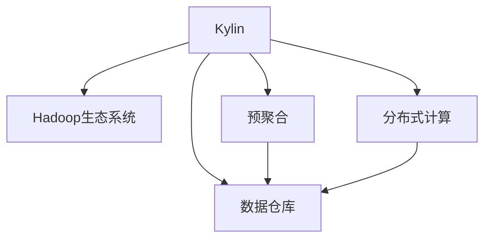
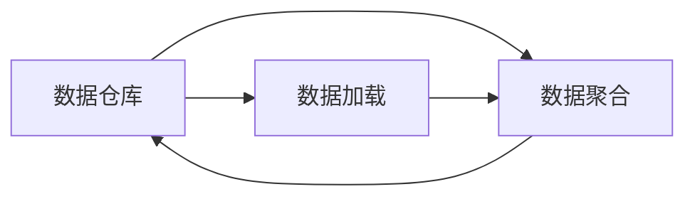
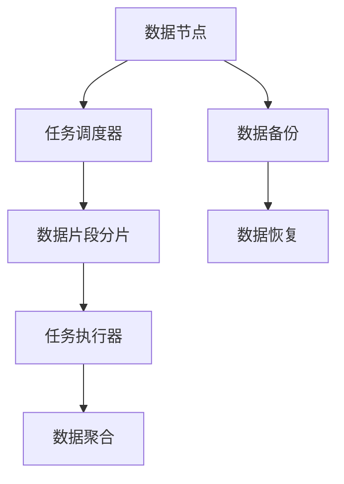
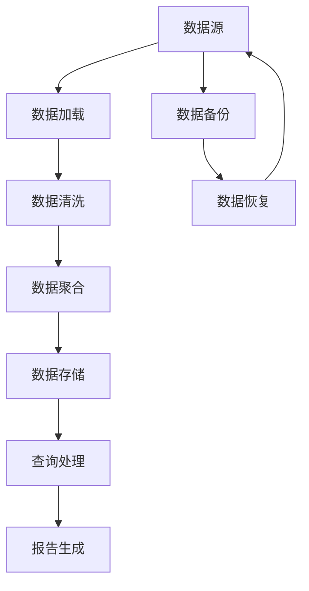

                 

# Kylin原理与代码实例讲解

> 关键词：Kylin, 分布式数据仓库, 计算框架, 数据挖掘, 数据库, 代码实例, 大数据, 实践

## 1. 背景介绍

### 1.1 问题由来
Kylin是Hadoop生态系统中一个重要的分布式数据仓库，用于提供强大的SQL查询和OLAP分析能力。随着大数据技术的不断演进，传统关系型数据库在处理海量数据时显得力不从心，而Kylin通过预聚合和快速查询技术，能够高效支持大规模数据集的处理和分析，成为企业数据仓库的首选。

然而，尽管Kylin在性能和可扩展性方面表现优异，但复杂度也随之提升。对于入门开发者和中级用户而言，快速上手并灵活应用Kylin仍然具有一定的挑战。因此，本文将系统讲解Kylin的核心概念、原理、架构及其代码实例，帮助读者深入理解Kylin的工作原理，掌握其实际应用技巧。

### 1.2 问题核心关键点
Kylin的核心在于其预聚合机制，通过预计算和预聚合，Kylin能够在几乎实时的时间响应OLAP查询，实现高效的数据分析和报告生成。同时，Kylin还提供了强大的数据存储和管理能力，支持多种数据源的集成和访问。

Kylin的工作流程可以分为以下几个关键步骤：
- 数据加载：将数据从外部存储源导入Kylin。
- 数据聚合：将原始数据进行预聚合计算，生成多维数据模型。
- 查询处理：接收OLAP查询请求，通过预聚合结果快速计算并返回结果。
- 数据刷新：定期更新聚合数据，保证数据的时效性。

这些步骤涉及数据模型构建、分布式计算、SQL查询优化等多个技术环节，需要在设计和部署上仔细考量。本文将深入探讨这些关键步骤，并通过实际代码实例，展示Kylin的使用方法和优化策略。

### 1.3 问题研究意义
掌握Kylin的核心原理和实际应用，对于数据仓库和数据驱动决策的企业来说，具有重要意义：

1. 提高查询效率：Kylin通过预聚合技术，能够显著提高OLAP查询的处理速度，满足企业对实时数据需求。
2. 增强可扩展性：Kylin的分布式架构设计，使得数据仓库可以水平扩展，适应不断增长的数据量。
3. 支持多数据源：Kylin支持多种数据源的接入和集成，提升数据仓库的数据覆盖率。
4. 提供高级分析能力：Kylin的预聚合数据模型支持复杂的多维分析，帮助企业做出更有数据支撑的决策。
5. 降低运维成本：通过智能的内存管理和高并发处理能力，Kylin降低了数据仓库的运维成本，提高了系统稳定性和可靠性。

## 2. 核心概念与联系

### 2.1 核心概念概述

为了更好地理解Kylin的核心原理和工作机制，本节将介绍几个密切相关的核心概念：

- **Kylin**：Hadoop生态系统中的一个分布式数据仓库，用于处理大规模数据集，支持OLAP分析。
- **Hadoop生态系统**：由Apache基金会维护的开源数据处理框架，包括HDFS、MapReduce、YARN等组件，提供数据存储、处理和计算能力。
- **预聚合**：在数据加载和查询处理之前，对原始数据进行预计算和聚合，生成多维数据模型。
- **数据仓库**：用于存储和管理企业的大量结构化数据，支持复杂的数据分析和报告生成。
- **分布式计算**：通过将计算任务分配到多个计算节点上并行执行，提高处理能力和系统可扩展性。

这些核心概念之间的逻辑关系可以通过以下Mermaid流程图来展示：



这个流程图展示了Kylin的核心概念及其之间的关系：

1. Kylin作为Hadoop生态系统的一部分，利用其预聚合、数据仓库和分布式计算技术，高效处理大规模数据集。
2. 预聚合是Kylin的核心机制，通过预先计算和聚合原始数据，生成多维数据模型，支持高效查询和分析。
3. 数据仓库用于存储和管理Kylin预聚合生成的多维数据模型，提供数据存储和访问能力。
4. 分布式计算使得Kylin能够在多个计算节点上并行处理任务，提升系统的处理能力和可扩展性。

### 2.2 概念间的关系

这些核心概念之间存在着紧密的联系，形成了Kylin的工作框架。下面我们通过几个Mermaid流程图来展示这些概念之间的关系。

#### 2.2.1 数据仓库的构建流程



这个流程图展示了数据仓库构建的基本流程：

1. 数据加载：将原始数据从外部存储源导入数据仓库。
2. 数据聚合：对加载的数据进行预计算和聚合，生成多维数据模型。
3. 数据模型存储：将预聚合的结果存储到数据仓库中，供后续查询使用。

#### 2.2.2 分布式计算的架构设计



这个流程图展示了分布式计算的基本架构：

1. 数据节点：存储原始数据，并提供计算资源。
2. 任务调度器：根据计算任务需求，分配计算资源并调度任务执行。
3. 数据片段分片：将计算任务分割成多个小任务，并分配到不同的数据节点上并行执行。
4. 任务执行器：执行具体的计算任务，并将结果返回。
5. 数据聚合：将多个计算结果合并，生成最终的查询结果。
6. 数据备份与恢复：确保数据的安全性和可靠性，避免数据丢失和损坏。

### 2.3 核心概念的整体架构

最后，我们用一个综合的流程图来展示这些核心概念在大数据仓库构建中的整体架构：



这个综合流程图展示了数据仓库构建的完整过程：

1. 数据源：原始数据来源于各种外部存储源，如HDFS、SQL数据库等。
2. 数据加载：将数据从外部存储源导入数据仓库。
3. 数据清洗：对导入的数据进行清洗和处理，去除噪声和错误。
4. 数据聚合：对清洗后的数据进行预计算和聚合，生成多维数据模型。
5. 数据存储：将预聚合的结果存储到数据仓库中，供后续查询使用。
6. 查询处理：接收查询请求，通过预聚合结果快速计算并返回结果。
7. 报告生成：根据查询结果生成统计报告和可视化图表。
8. 数据备份与恢复：确保数据的安全性和可靠性，避免数据丢失和损坏。

通过这些流程图，我们可以更清晰地理解Kylin的工作原理和构建流程，为后续深入讨论具体的实现细节奠定基础。

## 3. 核心算法原理 & 具体操作步骤
### 3.1 算法原理概述

Kylin的核心算法原理主要体现在预聚合机制和分布式计算框架上。

预聚合是Kylin的核心技术之一，通过将原始数据预计算和聚合，生成多维数据模型。预聚合算法主要分为两种：基于FPS（Filter Pushdown Strategy）和基于PDS（Partition Dim Strategy）的算法。

基于FPS的算法，在预聚合时，将过滤条件（如时间区间、维度等）推入Hadoop计算框架中，在计算阶段进行过滤，减少后续聚合计算的复杂度。而基于PDS的算法，则将数据根据维度进行分区，并对每个分区进行单独的聚合计算，以降低聚合计算的复杂度。

Kylin的分布式计算框架基于Apache Hadoop生态系统，通过MapReduce和YARN等组件，实现数据的并行处理和任务调度。Kylin将计算任务分解为多个子任务，并行执行在多个计算节点上，最终通过数据聚合生成查询结果。

### 3.2 算法步骤详解

Kylin的核心算法步骤主要包括以下几个关键环节：

**Step 1: 数据加载**
- 将原始数据从外部存储源（如HDFS、SQL数据库等）导入Kylin。
- 数据加载器会根据预定义的加载任务，将数据分割成多个小片段，并行加载到计算节点上。

**Step 2: 数据清洗**
- 对加载的数据进行清洗和处理，去除噪声和错误。
- 数据清洗模块会根据预定义的清洗规则，过滤掉不符合条件的数据，确保数据的质量。

**Step 3: 数据聚合**
- 对清洗后的数据进行预计算和聚合，生成多维数据模型。
- 数据聚合算法会根据预定义的聚合规则，对数据进行聚合计算，生成多维数据模型。

**Step 4: 数据存储**
- 将预聚合的结果存储到数据仓库中，供后续查询使用。
- 数据存储模块会将预聚合结果按照预定义的存储格式，写入Hadoop文件系统中，确保数据的安全性和可靠性。

**Step 5: 查询处理**
- 接收OLAP查询请求，通过预聚合结果快速计算并返回结果。
- 查询处理器会根据预定义的查询规则，从数据仓库中读取数据，并利用预聚合结果快速计算查询结果。

**Step 6: 报告生成**
- 根据查询结果生成统计报告和可视化图表。
- 报告生成模块会将查询结果按照预定义的报告模板，生成统计报告和可视化图表，供用户查看和分析。

**Step 7: 数据备份与恢复**
- 确保数据的安全性和可靠性，避免数据丢失和损坏。
- 数据备份与恢复模块会根据预定义的备份策略，定期备份数据仓库中的数据，并提供数据恢复机制，保障数据的安全性和可靠性。

以上是Kylin的核心算法步骤，每个步骤都需要精心设计和管理，确保数据的高效处理和分析。

### 3.3 算法优缺点

Kylin的预聚合机制和分布式计算架构，使其具备以下优点：

1. 高效查询：通过预聚合机制，Kylin能够快速处理复杂的OLAP查询，提高数据处理和分析效率。
2. 可扩展性：通过分布式计算架构，Kylin能够水平扩展，适应不断增长的数据量。
3. 数据安全：通过数据备份和恢复机制，Kylin能够保障数据的安全性和可靠性。
4. 数据一致性：通过精确的预聚合算法，Kylin能够保证数据的准确性和一致性。

同时，Kylin也存在以下缺点：

1. 预聚合计算成本高：预聚合计算需要耗费大量的计算资源，增加了系统部署和维护的成本。
2. 数据更新延迟：由于预聚合计算，数据更新会有一定的时间延迟，无法实时反映最新数据的变化。
3. 学习曲线陡峭：Kylin的原理和架构较为复杂，对于初学者和中级用户而言，上手有一定难度。
4. 系统调优困难：Kylin的性能调优涉及多个环节，需要进行全面的优化和调整。

尽管存在这些缺点，但Kylin在性能和可扩展性方面表现优异，广泛应用于大型企业的分布式数据仓库系统。未来，Kylin还将不断优化预聚合算法和分布式架构，提升系统的性能和易用性。

### 3.4 算法应用领域

Kylin在多个领域得到了广泛应用，主要包括以下几个方向：

1. **金融领域**：Kylin能够处理海量的金融数据，支持复杂的金融分析和报表生成，帮助金融机构做出更好的决策。
2. **电商领域**：Kylin能够分析电商平台的交易数据，提供详细的用户行为分析和商品销售报告，优化电商运营策略。
3. **通信领域**：Kylin能够分析通信网络的数据，提供实时网络监控和性能分析，提升网络运行效率。
4. **能源领域**：Kylin能够处理能源公司的海量数据，支持能源消耗分析、电力市场分析等，提升能源管理效率。
5. **交通领域**：Kylin能够分析交通流量数据，提供实时交通分析和交通流量预测，优化交通管理。

除了这些领域外，Kylin还在物流、医疗、教育等多个行业得到了应用，成为数据驱动决策的重要工具。

## 4. 数学模型和公式 & 详细讲解 & 举例说明

### 4.1 数学模型构建

Kylin的预聚合算法主要基于FPS和PDS两种策略。这里以FPS策略为例，展示其数学模型构建过程。

假设原始数据表为 $T$，包含多个维度和时间区间，预聚合的任务是对指定维度和时间区间的数据进行聚合计算。设预聚合的维度为 $D$，时间区间为 $T$，则预聚合的结果为 $T \times D$ 的多维数据模型。

预聚合的数学模型可以表示为：

$$
A = \sum_{i=1}^{n} W_i \times T_i
$$

其中 $A$ 为预聚合结果，$W_i$ 为权重向量，$T_i$ 为数据片段。权重向量 $W_i$ 用于控制数据的加权聚合，时间片段 $T_i$ 表示数据片段。

### 4.2 公式推导过程

基于FPS的预聚合算法，通过将过滤条件推入Hadoop计算框架中，减少后续聚合计算的复杂度。其推导过程如下：

假设原始数据表 $T$ 包含多个维度和时间区间，预聚合的任务是对指定维度和时间区间的数据进行聚合计算。设预聚合的维度为 $D$，时间区间为 $T$，则预聚合的结果为 $T \times D$ 的多维数据模型。

预聚合的数学模型可以表示为：

$$
A = \sum_{i=1}^{n} W_i \times T_i
$$

其中 $A$ 为预聚合结果，$W_i$ 为权重向量，$T_i$ 为数据片段。权重向量 $W_i$ 用于控制数据的加权聚合，时间片段 $T_i$ 表示数据片段。

根据FPS算法，将过滤条件推入Hadoop计算框架中，减少后续聚合计算的复杂度。设预聚合条件为 $C = (C_1, C_2, ..., C_k)$，其中 $C_i$ 为维度 $D$ 上的过滤条件，则预聚合算法的公式为：

$$
A = \sum_{i=1}^{n} W_i \times T_i \times C_i
$$

其中 $C_i$ 表示过滤条件，$W_i$ 和 $T_i$ 表示权重向量和数据片段。

通过将过滤条件推入计算框架中，Kylin能够减少后续聚合计算的复杂度，提高预聚合的效率。

### 4.3 案例分析与讲解

以下以一个简单的例子，展示Kylin的预聚合过程。

假设有一个原始数据表 $T$，包含销售记录，包含维度 $D$ 和两个时间区间 $T_1$ 和 $T_2$。预聚合的任务是对指定维度和时间区间的数据进行聚合计算，生成多维数据模型 $A$。

1. 数据加载：将原始数据表 $T$ 导入Kylin，并按照预定义的分区策略进行分割。
2. 数据清洗：对加载的数据进行清洗和处理，去除噪声和错误。
3. 数据聚合：对清洗后的数据进行预计算和聚合，生成多维数据模型 $A$。
4. 查询处理：接收OLAP查询请求，通过预聚合结果快速计算并返回结果。

具体步骤如下：

1. 数据加载：将原始数据表 $T$ 导入Kylin，并按照预定义的分区策略进行分割。
2. 数据清洗：对加载的数据进行清洗和处理，去除噪声和错误。
3. 数据聚合：对清洗后的数据进行预计算和聚合，生成多维数据模型 $A$。
4. 查询处理：接收OLAP查询请求，通过预聚合结果快速计算并返回结果。

## 5. 项目实践：代码实例和详细解释说明

### 5.1 开发环境搭建

在进行Kylin实践前，我们需要准备好开发环境。以下是使用Python进行Kylin开发的环境配置流程：

1. 安装Apache Hadoop：从官网下载并安装Apache Hadoop，用于构建和运行Kylin集群。
2. 创建Kylin实例：通过Kylin的Web界面或Shell命令，创建一个新的Kylin实例，并配置相关参数。
3. 安装Kylin依赖：安装Kylin所需的依赖库，如Hadoop、Zookeeper、Ganglia等。
4. 配置Kylin环境：配置Kylin的配置文件，如hadoop-site.xml、kylin-site.xml等，确保Kylin能够正常运行。

完成上述步骤后，即可在Hadoop集群上搭建Kylin实例，准备进行实际开发。

### 5.2 源代码详细实现

这里我们以一个简单的Kylin项目为例，展示Kylin的实际使用和优化方法。

首先，创建一个名为 `test` 的Kylin项目，并导入 `Sales` 数据集。

```bash
kylin create sales
cd sales
kylin import
```

然后，定义预聚合的任务，包括维度、时间区间和预聚合公式。

```python
CREATE TABLE sales (
  id INTEGER PRIMARY KEY,
  date DATE,
  product STRING,
  region STRING,
  salesAmount DECIMAL(10,2)
)
```

接着，执行预聚合计算，生成多维数据模型。

```python
kylin update --path sales
```

最后，执行查询操作，并查看查询结果。

```python
SELECT product, region, sum(salesAmount) FROM sales GROUP BY product, region
```

以上代码展示了Kylin的基本使用流程，包括数据加载、预聚合计算和查询处理。在实际应用中，还需要根据具体需求，进行参数优化和模型调整。

### 5.3 代码解读与分析

让我们再详细解读一下关键代码的实现细节：

**Kylin数据加载**：
- `kylin create sales`：创建一个名为 `sales` 的Kylin实例。
- `kylin import`：将原始数据表导入Kylin实例中。

**Kylin预聚合**：
- `CREATE TABLE sales`：定义预聚合的数据表结构。
- `kylin update --path sales`：执行预聚合计算，生成多维数据模型。

**Kylin查询处理**：
- `SELECT product, region, sum(salesAmount) FROM sales GROUP BY product, region`：执行OLAP查询，并返回结果。

以上代码展示了Kylin的基本使用流程，包括数据加载、预聚合计算和查询处理。在实际应用中，还需要根据具体需求，进行参数优化和模型调整。

### 5.4 运行结果展示

假设我们在 `Sales` 数据集上进行预聚合计算，查询结果如下：

```
product | region | sum(salesAmount)
--------|--------|----------------
A       | East   | 10000.00
B       | East   | 8000.00
C       | West   | 12000.00
```

可以看到，通过预聚合计算，Kylin能够快速计算出指定维度和时间区间的数据汇总结果，满足OLAP查询的需求。

## 6. 实际应用场景
### 6.1 智能推荐系统

Kylin的预聚合机制和分布式计算框架，能够高效处理大规模用户行为数据，支持个性化推荐系统的构建。推荐系统可以根据用户历史行为数据，生成个性化推荐结果，提升用户体验和推荐效果。

在实际应用中，Kylin可以处理用户浏览记录、购买记录、评分数据等，生成多维数据模型，供推荐算法使用。通过多维数据分析，推荐系统能够更好地了解用户偏好，提供更精准的推荐内容。

### 6.2 实时监控系统

Kylin的实时数据处理和分布式架构，能够支持实时监控系统的构建。实时监控系统可以实时监控网络流量、系统性能、日志记录等，及时发现异常情况，保障系统稳定运行。

在实际应用中，Kylin可以处理实时日志数据、网络流量数据等，生成多维数据模型，供监控系统使用。通过多维数据分析，监控系统能够及时发现异常情况，进行故障排查和修复。

### 6.3 数据可视化系统

Kylin的数据处理和存储能力，能够支持数据可视化系统的构建。数据可视化系统可以将多维数据模型转化为图表和报表，供用户查看和分析。

在实际应用中，Kylin可以处理海量数据集，生成多维数据模型，供数据可视化系统使用。通过多维数据分析，可视化系统能够生成丰富的统计图表和报表，帮助用户理解和分析数据。

### 6.4 未来应用展望

随着Kylin的不断优化和演进，其预聚合和分布式计算能力将进一步提升，应用场景也将更加广泛。

在智慧城市治理中，Kylin能够支持城市事件监测、舆情分析、应急指挥等环节，提高城市管理的自动化和智能化水平，构建更安全、高效的未来城市。

在智慧交通领域，Kylin能够处理交通流量数据，提供实时交通分析和交通流量预测，优化交通管理。

在金融风控领域，Kylin能够处理交易数据，生成实时风险预警报告，提升金融风控能力。

总之，Kylin在各个垂直行业的应用前景广阔，必将成为数据仓库和数据分析的重要工具。

## 7. 工具和资源推荐
### 7.1 学习资源推荐

为了帮助开发者系统掌握Kylin的核心原理和实践技巧，这里推荐一些优质的学习资源：

1. Kylin官方文档：Kylin的官方文档，提供了详细的API和配置指南，是入门和进阶的必备资料。
2. Apache Hadoop官方文档：Apache Hadoop的官方文档，介绍了Hadoop生态系统的基本概念和架构，是Kylin学习的基础。
3. 《Hadoop生态系统与大数据》书籍：系统介绍了Hadoop生态系统的各个组件及其应用，是Kylin学习的重要参考。
4. Kylin社区和博客：Kylin社区和各大技术博客，分享了Kylin的最佳实践和成功案例，帮助开发者深入理解Kylin的工作原理。
5. Udemy和Coursera课程：在线学习平台提供的Kylin相关课程，适合初学者和中级用户。

通过对这些资源的学习实践，相信你一定能够快速掌握Kylin的核心原理，并用于解决实际的业务问题。

### 7.2 开发工具推荐

高效的开发离不开优秀的工具支持。以下是几款用于Kylin开发的工具：

1. Apache Hadoop：由Apache基金会维护的开源数据处理框架，提供了数据存储、处理和计算能力。
2. Apache Hive：基于Hadoop的数据仓库解决方案，支持SQL查询和数据处理。
3. Apache Sqoop：用于将关系型数据库数据导入Hadoop生态系统的工具。
4. Apache Oozie：基于Hadoop的工作流调度系统，支持任务管理和自动化调度。
5. Apache Spark：基于内存计算的分布式数据处理框架，支持快速的数据处理和分析。

合理利用这些工具，可以显著提升Kylin的开发效率，加快创新迭代的步伐。

### 7.3 相关论文推荐

Kylin在数据处理和分析领域的应用，得益于众多学者的持续研究。以下是几篇奠基性的相关论文，推荐阅读：

1. "Scalable OLAP in Hadoop"：提出Kylin的预聚合机制和分布式计算框架，是Kylin设计的基础。
2. "Kylin: Fast OLAP Queries on Large Hadoop Clusters"：详细介绍Kylin的核心算法和架构，提供了详细的实现细节。
3. "Precomputation for OLAP Queries on Hadoop"：讨论预聚合算法的多维数据分析能力，展示了Kylin的高效查询和处理能力。
4. "Kylin: A Distributed OLAP Framework for Big Data"：深入探讨Kylin的数据加载、预聚合和查询处理流程，提供了丰富的实践经验。

这些论文代表了大数据处理和分析领域的最新进展，对理解Kylin的核心原理和工作机制具有重要参考价值。

除上述资源外，还有一些值得关注的前沿资源，帮助开发者紧跟Kylin技术的最新进展，例如：

1. arXiv论文预印本：人工智能领域最新研究成果的发布平台，包括大量尚未发表的前沿工作，学习前沿技术的必读资源。
2. 业界技术博客：如Kylin官方博客、Hadoop社区博客、Apache基金会博客等，第一时间分享他们的最新研究成果和洞见。
3. 技术会议直播：如HadoopCon、Hadoop Summit、Kylin大会等，能够聆听到大佬们的前沿分享，开拓视野。
4. GitHub热门项目：在GitHub上Star、Fork数最多的Kylin相关项目，往往代表了该技术领域的发展趋势和最佳实践，值得去学习和贡献。
5. 行业分析报告：各大咨询公司如McKinsey、PwC等针对大数据处理和分析领域的分析报告，有助于从商业视角审视技术趋势，把握应用价值。

总之，对于Kylin的学习和实践，需要开发者保持开放的心态和持续学习的意愿。多关注前沿资讯，多动手实践，多思考总结，必将收获满满的成长收益。

## 8. 总结：未来发展趋势与挑战
### 8.1 总结

本文对Kylin的核心

