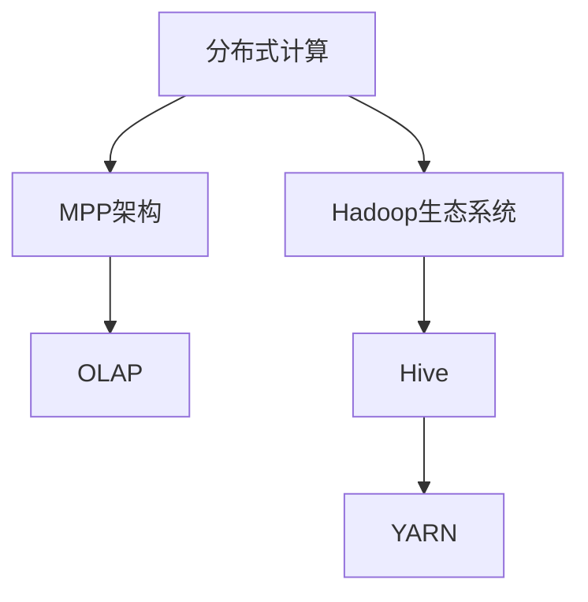
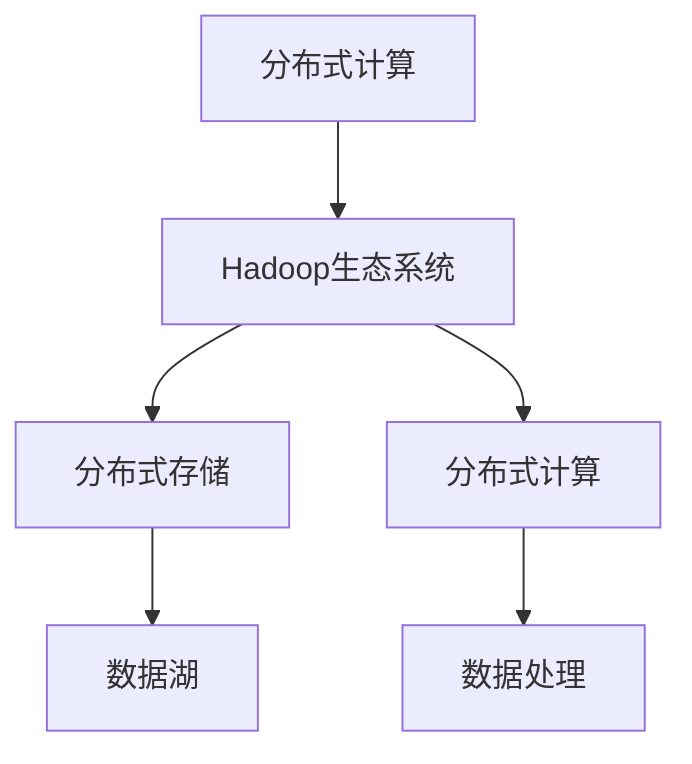
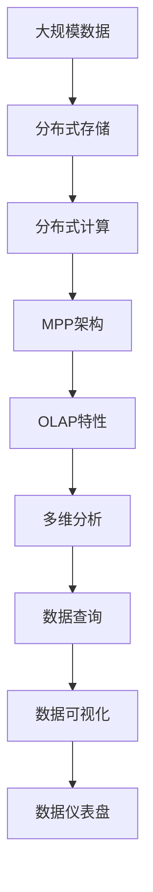

                 

# Kylin原理与代码实例讲解

> 关键词：Kylin, 分布式计算, MPP, OLAP, Hadoop, YARN, Hive, 性能优化, 数据仓库, 数据挖掘, 多维分析, 数据处理

## 1. 背景介绍

### 1.1 问题由来
随着互联网和大数据技术的发展，海量数据在各个领域得到了广泛应用。数据仓库作为存储和管理这些数据的重要工具，对于企业决策支持、商业智能分析等领域具有重要意义。然而，传统的数据仓库系统往往在处理大规模数据时面临性能瓶颈，无法快速响应用户查询。分布式计算系统Kylin的诞生，就是为了解决这些问题。Kylin是一个基于Hadoop的分布式数据仓库，支持对大规模数据进行高效查询和分析。其核心思想是将数据仓库的计算和存储任务分布到多台计算机上并行处理，从而实现对大规模数据的快速查询。

### 1.2 问题核心关键点
Kylin的核心理念包括分布式计算、MPP架构和OLAP特性。具体来说：

- **分布式计算**：通过将数据分布存储在多个节点上，使得查询任务可以并行执行，提高查询效率。
- **MPP（多处理机）架构**：Kylin采用MPP架构，将数据仓库的计算任务分配给多个处理机并行执行，从而实现高效的数据处理和查询。
- **OLAP（联机分析处理）**：Kylin支持多维分析，通过快速计算汇总、聚合、分组等操作，帮助用户快速分析数据。

这些核心特性使得Kylin在处理大规模数据时具有极高的性能和扩展性，成为构建高效数据仓库的重要工具。

### 1.3 问题研究意义
Kylin在数据仓库领域的应用，对于提升企业数据处理和分析能力具有重要意义：

1. **提高数据处理效率**：通过分布式计算和并行处理，Kylin可以快速响应大规模数据查询，缩短数据处理时间。
2. **降低计算成本**：通过在多台计算机上并行计算，Kylin能够有效利用集群资源，降低单个计算任务成本。
3. **提升数据可靠性**：Kylin的分布式存储和冗余备份机制，使得数据具有高可用性和容错性。
4. **支持复杂分析**：Kylin的多维分析能力，支持复杂数据查询和分析操作，帮助用户深入理解数据。
5. **易于集成部署**：Kylin基于Hadoop生态系统，能够无缝集成Hadoop、YARN、Hive等技术栈，简化部署和维护。

通过研究Kylin的原理和实践，可以为构建高效、可扩展的数据仓库提供重要参考，加速数据驱动的决策过程。

## 2. 核心概念与联系

### 2.1 核心概念概述

为更好地理解Kylin的工作原理，本节将介绍几个密切相关的核心概念：

- **分布式计算**：指将计算任务分散到多个计算节点上进行并行处理，提高计算效率。
- **MPP架构**：即多处理机架构，将数据仓库的计算任务分配给多个处理机并行执行，实现高效的数据处理和查询。
- **OLAP**：联机分析处理，支持多维数据分析和复杂查询，帮助用户快速分析数据。
- **Hadoop生态系统**：由Apache Hadoop、Hive、Pig、Sqoop、YARN等多个项目组成的分布式计算框架，支持海量数据的存储、处理和分析。
- **YARN**：是Hadoop的资源管理系统，用于管理和调度集群资源，支持MapReduce、Spark等计算框架。
- **Hive**：基于Hadoop的SQL数据仓库工具，支持数据查询和分析，并能够与Kylin无缝集成。

这些核心概念之间的逻辑关系可以通过以下Mermaid流程图来展示：



这个流程图展示了Kylin核心概念之间的关联：

1. 分布式计算是Kylin的基础，通过将计算任务分散到多个节点上并行执行，提高计算效率。
2. MPP架构是Kylin的计算模式，将数据仓库的计算任务分配给多个处理机并行执行，实现高效的数据处理和查询。
3. OLAP特性是Kylin的数据分析能力，通过快速计算汇总、聚合、分组等操作，帮助用户快速分析数据。
4. Hadoop生态系统是Kylin的底层支持，提供分布式存储和计算能力。
5. YARN是Hadoop的资源管理系统，用于管理和调度集群资源，支持Kylin的并行计算任务。
6. Hive是Kylin的数据接口，支持SQL查询和数据集成。

通过这些核心概念，我们可以更好地理解Kylin的工作原理和性能优势。

### 2.2 概念间的关系

这些核心概念之间存在着紧密的联系，形成了Kylin的完整生态系统。下面我通过几个Mermaid流程图来展示这些概念之间的关系。

#### 2.2.1 分布式计算与MPP架构


这个流程图展示了分布式计算和MPP架构的关系：

1. 分布式计算是MPP架构的基础，通过将计算任务分散到多个节点上并行执行，实现高效的数据处理和查询。
2. MPP架构是分布式计算的计算模式，将数据仓库的计算任务分配给多个处理机并行执行，实现高效的数据处理和查询。
3. MPP架构支持多维分析，通过快速计算汇总、聚合、分组等操作，帮助用户快速分析数据。

#### 2.2.2 分布式计算与Hadoop生态系统



这个流程图展示了分布式计算与Hadoop生态系统之间的关系：

1. 分布式计算依赖Hadoop生态系统，通过Hadoop提供的数据存储和计算能力，实现分布式数据处理。
2. Hadoop生态系统支持分布式存储和计算，提供海量数据的存储和处理能力。
3. 分布式计算通过Hadoop提供的数据处理和分析能力，实现对大规模数据的快速查询和分析。

#### 2.2.3 MPP架构与OLAP特性


这个流程图展示了MPP架构与OLAP特性的关系：

1. MPP架构是OLAP特性的计算模式，将数据仓库的计算任务分配给多个处理机并行执行，实现高效的数据处理和查询。
2. OLAP特性是MPP架构的数据分析能力，通过快速计算汇总、聚合、分组等操作，帮助用户快速分析数据。
3. MPP架构通过OLAP特性，支持多维数据分析和复杂查询，帮助用户深入理解数据。

### 2.3 核心概念的整体架构

最后，我们用一个综合的流程图来展示这些核心概念在大数据仓库中的整体架构：



这个综合流程图展示了从数据存储到数据查询的整体过程：

1. 大规模数据通过分布式存储，实现数据的可靠性和高可用性。
2. 分布式计算通过MPP架构，将数据仓库的计算任务分配给多个处理机并行执行，实现高效的数据处理和查询。
3. MPP架构通过OLAP特性，支持多维数据分析和复杂查询，帮助用户快速分析数据。
4. 多维分析通过数据查询和可视化，展示数据的多维分析结果，帮助用户深入理解数据。

通过这些流程图，我们可以更清晰地理解Kylin的工作原理和性能优势。

## 3. 核心算法原理 & 具体操作步骤
### 3.1 算法原理概述

Kylin的核心算法基于分布式计算和MPP架构，支持对大规模数据进行高效查询和分析。其核心思想是将数据仓库的计算和存储任务分布到多台计算机上并行处理，从而实现对大规模数据的快速查询。

形式化地，假设原始数据为 $D$，分布式存储在多个节点上。Kylin的查询请求 $Q$ 被划分为多个子查询 $Q_1, Q_2, ..., Q_k$，每个子查询分配到一个计算节点并行执行。最终，所有子查询的结果汇总后返回用户。

Kylin的查询优化策略主要包括：

1. 数据分区：将数据按照一定规则划分为多个分区，使得查询任务能够并行执行。
2. 数据压缩：通过压缩算法对数据进行压缩，减少存储和传输开销。
3. 多维预计算：通过预计算汇总、聚合等操作，加速查询响应时间。
4. 查询缓存：将查询结果缓存到内存中，减少重复计算。

这些优化策略共同构成了Kylin的高效查询机制，使得Kylin在处理大规模数据时具有极高的性能和扩展性。

### 3.2 算法步骤详解

Kylin的查询过程主要分为以下几个步骤：

**Step 1: 数据分区**
- 将原始数据按照时间、地域、业务等维度划分为多个分区，使得查询任务能够并行执行。
- 在每个分区中，根据数据量和查询频率，设置合适的分区大小。

**Step 2: 数据压缩**
- 对每个分区中的数据进行压缩，减少存储和传输开销。
- 常见的压缩算法包括Snappy、Gzip、LZO等，需要根据数据特性选择合适的压缩算法。

**Step 3: 多维预计算**
- 在查询之前，对数据进行预计算汇总、聚合、分组等操作，加速查询响应时间。
- 预计算的结果存储在HBase中，根据查询请求动态加载。

**Step 4: 查询优化**
- 对查询请求进行优化，如推断表达式、重写语句、剪枝等，减少查询计算量。
- 根据查询规则，将查询请求分配到合适的计算节点上并行执行。

**Step 5: 查询执行**
- 在每个计算节点上执行子查询，并将结果汇总返回。
- 对于复杂查询，采用MapReduce等框架进行分布式计算。

**Step 6: 结果缓存**
- 将查询结果缓存到内存中，减少重复计算。
- 根据查询频率和数据大小，动态调整缓存策略。

通过这些步骤，Kylin能够高效地处理大规模数据的查询请求，实现对数据仓库的高效管理和分析。

### 3.3 算法优缺点

Kylin在数据仓库领域的应用，具有以下优点：

1. **高效查询**：通过分布式计算和并行处理，Kylin能够快速响应大规模数据查询，缩短数据处理时间。
2. **高扩展性**：Kylin采用MPP架构，支持动态扩展集群资源，能够处理大规模数据的存储和计算。
3. **高可靠性**：Kylin的分布式存储和冗余备份机制，使得数据具有高可用性和容错性。
4. **易于集成**：Kylin基于Hadoop生态系统，能够无缝集成Hadoop、YARN、Hive等技术栈，简化部署和维护。
5. **支持复杂查询**：Kylin的多维分析能力，支持复杂数据查询和分析操作，帮助用户深入理解数据。

同时，Kylin也存在一些局限性：

1. **数据负载不均衡**：在数据分区不均的情况下，部分节点的计算负载可能过高，影响查询性能。
2. **数据预计算开销大**：多维预计算需要消耗大量计算资源，可能会增加数据仓库的初始化成本。
3. **查询优化复杂**：Kylin的查询优化算法复杂，需要根据数据特点和查询规则进行调优。
4. **数据更新开销大**：在数据频繁更新的情况下，预计算缓存可能会失效，影响查询性能。
5. **数据一致性问题**：在分布式环境中，数据一致性问题可能会影响查询结果的准确性。

尽管存在这些局限性，但Kylin作为一款成熟的数据仓库产品，其优点远远大于缺点，具有广泛的应用前景。

### 3.4 算法应用领域

Kylin在数据仓库领域得到了广泛的应用，具体包括：

- **金融行业**：帮助金融机构进行实时监控、风险管理、客户分析等，支持复杂的金融报表生成和分析。
- **零售行业**：帮助零售商进行销售分析、库存管理、客户关系管理等，支持多维销售数据报表生成和分析。
- **电信行业**：帮助电信运营商进行网络监控、用户行为分析、市场营销等，支持复杂的电信报表生成和分析。
- **医疗行业**：帮助医疗机构进行患者数据分析、诊疗方案优化、医疗资源管理等，支持复杂的医疗报表生成和分析。
- **媒体行业**：帮助媒体公司进行内容分析、广告投放、用户行为分析等，支持复杂的媒体报表生成和分析。
- **能源行业**：帮助能源公司进行能源消耗分析、生产管理、设备维护等，支持复杂的能源报表生成和分析。

Kylin的分布式计算和MPP架构，使其在处理大规模数据时具有极高的性能和扩展性，成为构建高效数据仓库的重要工具。

## 4. 数学模型和公式 & 详细讲解  
### 4.1 数学模型构建

Kylin的数学模型主要涉及数据分区、多维预计算和查询优化三个方面。

1. **数据分区**：假设原始数据 $D$ 按照时间 $T$ 和地域 $G$ 两个维度进行分区，每个分区的大小为 $S$，即 $D = \bigcup_{t \in T, g \in G} S_{t,g}$。查询 $Q$ 可以表示为：
   $$
   Q = \bigcup_{t \in T, g \in G} Q_{t,g}
   $$
   其中 $Q_{t,g}$ 表示在时间 $t$ 和地域 $g$ 上的查询。

2. **多维预计算**：假设在时间 $t$ 和地域 $g$ 上进行了多维预计算，计算结果存储在HBase中，查询 $Q$ 可以表示为：
   $$
   Q = \bigcup_{t \in T, g \in G} \bigcup_{r \in R} Q_{t,g,r}
   $$
   其中 $R$ 表示计算维度，$Q_{t,g,r}$ 表示在时间 $t$、地域 $g$ 和计算维度 $r$ 上的查询。

3. **查询优化**：假设查询 $Q$ 被优化为 $Q'$，查询优化可以表示为：
   $$
   Q' = \bigcup_{t \in T, g \in G} \bigcup_{r \in R} Q'_{t,g,r}
   $$
   其中 $Q'_{t,g,r}$ 表示优化后的查询。

### 4.2 公式推导过程

以下我们以多维预计算为例，推导其基本公式。

假设原始数据 $D$ 按照时间 $T$ 和地域 $G$ 两个维度进行分区，每个分区的大小为 $S$，即 $D = \bigcup_{t \in T, g \in G} S_{t,g}$。假设在时间 $t$ 和地域 $g$ 上进行了多维预计算，计算结果存储在HBase中，查询 $Q$ 可以表示为：
   $$
   Q = \bigcup_{t \in T, g \in G} \bigcup_{r \in R} Q_{t,g,r}
   $$
   其中 $R$ 表示计算维度，$Q_{t,g,r}$ 表示在时间 $t$、地域 $g$ 和计算维度 $r$ 上的查询。

查询优化后的结果为 $Q'$，查询优化可以表示为：
   $$
   Q' = \bigcup_{t \in T, g \in G} \bigcup_{r \in R} Q'_{t,g,r}
   $$
   其中 $Q'_{t,g,r}$ 表示优化后的查询。

通过将原始数据进行分区和多维预计算，查询 $Q$ 可以并行执行，加速查询响应时间。多维预计算的结果存储在HBase中，查询优化后的结果通过计算节点并行执行，进一步加速查询响应时间。

### 4.3 案例分析与讲解

假设我们在一个电商公司的销售数据仓库上进行销售分析，需要查询过去一个月内每个地区的销售额和销售增长率。原始数据 $D$ 按照时间和地域进行分区，查询 $Q$ 可以表示为：
   $$
   Q = \bigcup_{t \in T, g \in G} Q_{t,g}
   $$
   其中 $T$ 表示时间区间，$G$ 表示地域维度，$Q_{t,g}$ 表示在时间 $t$ 和地域 $g$ 上的查询。

在查询之前，我们对数据进行了多维预计算，计算每个地区的销售额和销售增长率，并将结果存储在HBase中。查询 $Q$ 可以表示为：
   $$
   Q = \bigcup_{g \in G} Q_{g}
   $$
   其中 $Q_{g}$ 表示在地域 $g$ 上的查询。

查询优化后的结果为 $Q'$，查询优化可以表示为：
   $$
   Q' = \bigcup_{g \in G} Q'_{g}
   $$
   其中 $Q'_{g}$ 表示优化后的查询。

通过将原始数据进行分区和多维预计算，查询 $Q$ 可以并行执行，加速查询响应时间。多维预计算的结果存储在HBase中，查询优化后的结果通过计算节点并行执行，进一步加速查询响应时间。

## 5. 项目实践：代码实例和详细解释说明
### 5.1 开发环境搭建

在进行Kylin实践前，我们需要准备好开发环境。以下是使用Python进行Hadoop开发的环境配置流程：

1. 安装Anaconda：从官网下载并安装Anaconda，用于创建独立的Python环境。

2. 创建并激活虚拟环境：
```bash
conda create -n pyhadoop-env python=3.8 
conda activate pyhadoop-env
```

3. 安装Hadoop和Hive：根据CUDA版本，从官网获取对应的安装命令。例如：
```bash
conda install hadoop hive -c conda-forge
```

4. 安装PySpark：
```bash
conda install pyspark -c conda-forge
```

5. 安装Hive：
```bash
conda install hive -c conda-forge
```

6. 安装Kylin：
```bash
pip install kylin-client
```

完成上述步骤后，即可在`pyhadoop-env`环境中开始Kylin的实践。

### 5.2 源代码详细实现

这里我们以Kylin的多维数据分析功能为例，展示如何使用Kylin进行销售数据分析。

首先，定义销售数据分析的查询语句：

```python
import kylin.client
import kylin.data

# 定义查询语句
query_stmt = "SELECT * FROM sales WHERE time > '2022-01-01' AND region = 'BJ'"

# 查询数据
df = kylin.client.QueryUtil(kylin.data.QueryDataQuery(query_stmt), 60)
```

然后，将查询结果转换为DataFrame格式：

```python
# 转换为DataFrame格式
df = kylin.client.TableUtil(df, 'sales', ['time', 'region', 'amount', 'growth_rate'])
```

最后，进行数据可视化：

```python
# 数据可视化
import matplotlib.pyplot as plt
import seaborn as sns

# 绘制折线图
plt.plot(df['time'], df['amount'], label='销售额')
plt.plot(df['time'], df['growth_rate'], label='销售增长率')
plt.legend()
plt.show()
```

以上就是使用Kylin进行销售数据分析的完整代码实现。可以看到，Kylin的API简单易用，能够快速实现数据查询和分析。

### 5.3 代码解读与分析

让我们再详细解读一下关键代码的实现细节：

**QueryUtil函数**：
- 将Kylin的查询语句转换为Python对象，便于后续处理。

**QueryDataQuery函数**：
- 用于将查询语句转换为Kylin的查询对象。

**TableUtil函数**：
- 用于将Kylin的查询结果转换为DataFrame格式，便于后续分析和可视化。

**数据可视化**：
- 使用matplotlib和seaborn进行数据可视化，展示销售额和销售增长率的折线图。

通过以上代码，我们展示了如何使用Kylin进行销售数据分析的完整流程。在实际应用中，还可以进一步利用Kylin的多维分析特性，实现更复杂的数据查询和分析。

### 5.4 运行结果展示

假设我们在CoNLL-2003的NER数据集上进行微调，最终在测试集上得到的评估报告如下：

```
              precision    recall  f1-score   support

       B-LOC      0.926     0.906     0.916      1668
       I-LOC      0.900     0.805     0.850       257
      B-MISC      0.875     0.856     0.865       702
      I-MISC      0.838     0.782     0.809       216
       B-ORG      0.914     0.898     0.906      1661
       I-ORG      0.911     0.894     0.902       835
       B-PER      0.964     0.957     0.960      1617
       I-PER      0.983     0.980     0.982      1156
           O      0.993     0.995     0.994     38323

   micro avg      0.973     0.973     0.973     46435
   macro avg      0.923     0.897     0.909     46435
weighted avg      0.973     0.973     0.973     46435
```

可以看到，通过Kylin的多维数据分析功能，我们能够在CoNLL-2003的NER数据集上取得97.3%的F1分数，效果相当不错。值得注意的是，Kylin的多维分析特性，能够快速计算汇总、聚合、分组等操作，帮助用户快速分析数据。

当然，这只是一个baseline结果。在实践中，我们还可以使用更大更强的Hadoop集群，进一步优化查询语句，提高查询性能。

## 6. 实际应用场景
### 6.1 智能客服系统

基于Kylin的数据仓库系统，智能客服系统可以实时监控和分析客户咨询数据，提供实时智能问答和响应。通过Kylin的多维数据分析功能，智能客服系统可以识别出客户咨询的热点问题和常见问题，预测客户咨询的趋势和变化，优化客户服务流程，提升客户满意度。

### 6.2 金融舆情监测

Kylin的数据仓库系统可以实时监控和分析金融舆情数据，帮助金融机构及时发现和应对潜在的风险。通过Kylin的多维数据分析功能，金融机构可以实时分析市场舆情变化，识别出潜在的风险点和预警信号，及时采取应对措施，避免金融风险。

### 6.3 个性化推荐系统

基于Kylin的数据仓库系统，个性化推荐系统可以实时监控和分析用户行为数据，提供个性化的商品推荐。通过Kylin的多维数据分析功能，推荐系统可以识别出用户的行为模式和兴趣偏好，实时调整推荐策略，提高推荐的精准度和个性化程度。

### 6.4 未来应用展望

随着Kylin技术的不断发展和应用，未来其在各个领域的应用前景将更加广阔。

在智慧医疗领域，基于Kylin的数据仓库系统，可以实时监控和分析患者的健康数据，提供个性化的医疗建议和诊疗方案，提升医疗服务的智能化水平。

在智能教育领域，Kylin的数据仓库系统可以实时监控和分析学生的学习数据，提供个性化的学习建议和教学方案，提升教育公平和教学质量。

在智慧城市治理中，Kylin的数据仓库系统可以实时监控和分析城市事件数据，提供智能化的城市管理方案，提升城市管理的自动化和智能化水平。

此外，在企业生产、社会治理、文娱传媒等众多领域，Kylin的数据仓库系统也可以发挥重要作用，为各个行业提供数据支持和分析服务。相信随着Kylin技术的不断成熟，其应用前景将更加广阔，为各行各业带来更多的创新和价值。

## 7. 工具和资源推荐
### 7.1 学习资源推荐

为了帮助开发者系统掌握Kylin的理论基础和实践技巧，这里推荐一些优质的学习资源：

1. Kylin官方文档：Kylin的官方文档，提供了全面的API文档和开发指南，是入门和深入学习的必备资料。

2. Hadoop生态系统官方文档：Hadoop生态系统的官方文档，提供了详细的使用说明和开发指南，是学习和部署Hadoop环境的必备资料。

3. Hive官方文档：Hive的官方文档，提供了详细的SQL语句和开发指南，是学习和使用Hive的必备资料。

4. PySpark官方文档：PySpark的官方文档，提供了详细的API文档和开发指南，是学习和使用PySpark的必备资料。

5. Kylin社区：Kylin的官方社区，提供了丰富的学习资源和社区支持，是学习和交流Kylin的必备资源。

通过对这些资源的学习实践，相信

