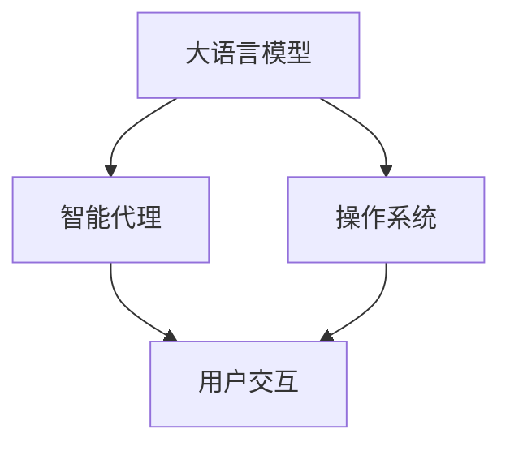

                 

## LLM Agent OS：构建智能人机交互的未来

### 引言

在人工智能迅速发展的今天，智能人机交互已经不再是一个遥不可及的概念。自然语言处理技术的进步，使得机器能够理解和回应人类的语言指令。然而，构建一个能够持续学习、智能响应的智能人机交互系统，仍然需要面临诸多挑战。为了解决这个问题，我们提出了“LLM Agent OS”的概念，即基于大语言模型的智能代理操作系统，通过智能算法和模块化设计，构建一个能够自主学习和适应的智能人机交互系统。

本文将详细介绍LLM Agent OS的核心概念、核心算法原理、具体操作步骤，以及其在实际应用中的场景和未来展望。同时，我们还将推荐相关的学习资源、开发工具和论文，以期为人工智能领域的研究者和开发者提供全面、深入的技术指导。

### 1. 背景介绍

#### 1.1 问题由来

随着自然语言处理技术的快速发展，语言模型在文本生成、情感分析、机器翻译等任务中取得了显著的进步。然而，构建一个可以持续学习、智能响应的智能人机交互系统仍然是一个挑战。构建这样的系统需要考虑多个因素，包括语言理解、情感识别、行为决策和上下文记忆等。传统的方法通常需要手动设计算法和模型，难以处理复杂多变的用户交互需求。

#### 1.2 问题核心关键点

为了解决这个问题，我们提出了基于大语言模型的智能代理操作系统（LLM Agent OS）。其核心思想是将大语言模型作为底层算力，通过智能算法和模块化设计，构建一个能够自主学习和适应的智能人机交互系统。该系统能够在不断接受用户反馈和环境变化的情况下，自主更新和优化自身的语言理解和行为决策能力。

#### 1.3 问题研究意义

构建LLM Agent OS具有重要的意义：

- **高效性**：相比于传统的基于规则的系统，LLM Agent OS能够更快地响应用户需求，适应多变的用户行为。
- **鲁棒性**：通过自主学习和适应，LLM Agent OS能够更好地应对复杂的用户交互场景，提升系统的鲁棒性。
- **可扩展性**：通过模块化设计，LLM Agent OS可以灵活地扩展和集成新功能和模块。
- **可解释性**：LLM Agent OS能够提供其决策过程的解释，增强用户信任和系统透明度。

### 2. 核心概念与联系

#### 2.1 核心概念概述

LLM Agent OS包括以下几个核心概念：

- **大语言模型（Large Language Model, LLM）**：预训练的深度学习模型，能够理解和生成自然语言文本。
- **智能代理（Agent）**：能够自主学习和适应的智能实体，能够处理复杂的用户交互需求。
- **操作系统（OS）**：作为智能代理的操作环境，提供底层算法和模块化架构。
- **用户交互（User Interaction）**：指用户与智能代理之间的交互过程，包括语言理解和行为决策。

#### 2.2 概念间的关系

这些核心概念之间的关系可以用以下Mermaid流程图表示：



这个流程图展示了LLM Agent OS的基本架构：大语言模型作为底层算法，智能代理作为核心实体，操作系统提供底层支撑，用户交互是整个系统的应用场景。

### 3. 核心算法原理 & 具体操作步骤

#### 3.1 算法原理概述

LLM Agent OS的算法原理包括以下几个步骤：

1. **预训练大语言模型**：使用大规模文本数据对大语言模型进行预训练，使其具备基本的语言理解和生成能力。
2. **模块化设计**：将系统设计为多个模块，每个模块负责特定的功能，如语言理解、情感识别、行为决策等。
3. **自主学习**：通过不断接受用户反馈和环境变化，智能代理能够自主更新和优化自身的决策策略。
4. **上下文记忆**：智能代理能够记忆和处理历史交互数据，提升系统的上下文理解能力。

#### 3.2 算法步骤详解

1. **预训练大语言模型**：使用大规模文本数据对大语言模型进行预训练，使其具备基本的语言理解和生成能力。这一步可以使用现有的预训练模型，如GPT、BERT等，也可以自行设计新的模型。

2. **模块化设计**：将系统设计为多个模块，每个模块负责特定的功能，如语言理解、情感识别、行为决策等。每个模块都包括算法和数据处理流程，通过API接口与其他模块交互。

3. **自主学习**：通过不断接受用户反馈和环境变化，智能代理能够自主更新和优化自身的决策策略。具体实现方法包括强化学习、模仿学习、对抗学习等。

4. **上下文记忆**：智能代理能够记忆和处理历史交互数据，提升系统的上下文理解能力。可以使用LSTM、GRU等序列模型，或者基于Transformer的注意力机制实现上下文记忆。

#### 3.3 算法优缺点

**优点**：

- **高效性**：相比于传统的基于规则的系统，LLM Agent OS能够更快地响应用户需求，适应多变的用户行为。
- **鲁棒性**：通过自主学习和适应，LLM Agent OS能够更好地应对复杂的用户交互场景，提升系统的鲁棒性。
- **可扩展性**：通过模块化设计，LLM Agent OS可以灵活地扩展和集成新功能和模块。
- **可解释性**：LLM Agent OS能够提供其决策过程的解释，增强用户信任和系统透明度。

**缺点**：

- **复杂性**：LLM Agent OS的实现和维护相对复杂，需要专业知识和技术积累。
- **数据需求**：系统需要大量的用户交互数据进行训练和优化，数据收集和处理成本较高。
- **安全性**：系统的自主学习过程可能受到恶意攻击，需要加强安全防护措施。

#### 3.4 算法应用领域

LLM Agent OS可以应用于多种领域，包括但不限于：

- **智能客服**：构建智能客服系统，通过对话机器人处理用户咨询，提升客户服务效率和质量。
- **智能家居**：通过语音助手实现家庭自动化控制，提升家居生活便捷性。
- **智能医疗**：通过智能问诊机器人辅助医生诊断，提升医疗服务效率和质量。
- **智能教育**：通过智能教师辅助教学，提升教学效果和学习体验。
- **智能交通**：通过智能交通助手提供实时交通信息，提升出行效率。

### 4. 数学模型和公式 & 详细讲解  
#### 4.1 数学模型构建

LLM Agent OS的数学模型构建包括以下几个关键步骤：

1. **预训练大语言模型**：使用大规模文本数据对大语言模型进行预训练，使其具备基本的语言理解和生成能力。
2. **模块化设计**：每个模块的输入和输出可以表示为向量和张量，通过矩阵运算进行计算。
3. **自主学习**：使用强化学习等方法对智能代理进行训练，使其能够自主更新和优化决策策略。
4. **上下文记忆**：使用序列模型或注意力机制对历史交互数据进行编码和处理，提升系统的上下文理解能力。

#### 4.2 公式推导过程

**预训练大语言模型的数学模型**：

假设预训练大语言模型为$f(x)$，其中$x$为输入文本，$y$为输出文本。通过自监督学习任务，模型能够学习到文本的语义表示。例如，使用语言模型任务：

$$
\max_{\theta} \frac{1}{N} \sum_{i=1}^N p_{\theta}(y_i|x_i)
$$

其中$p_{\theta}(y_i|x_i)$表示模型在给定输入文本$x_i$下输出文本$y_i$的概率。

**模块化设计的数学模型**：

假设智能代理系统由$n$个模块组成，每个模块的输入和输出可以表示为向量和张量。例如，语言理解模块的输入为输入文本$x$，输出为语言表示向量$\mathbf{h}$：

$$
\mathbf{h} = f_{\theta}(x)
$$

**自主学习的数学模型**：

假设智能代理的决策策略为$\pi(a|s)$，其中$s$为当前状态，$a$为当前动作。通过强化学习等方法，代理能够优化决策策略：

$$
\max_{\pi} \mathbb{E}_{s \sim p} \sum_{a} \pi(a|s) Q_{\theta}(s,a)
$$

其中$p$为状态分布，$Q_{\theta}(s,a)$表示在状态$s$下采取动作$a$的Q值。

**上下文记忆的数学模型**：

假设智能代理需要记忆$k$个历史交互数据，使用LSTM或GRU等序列模型进行编码和处理：

$$
\mathbf{h}_t = \text{LSTM}(\mathbf{h}_{t-1}, \mathbf{x}_t)
$$

其中$\mathbf{h}_t$表示在时间$t$的隐藏状态，$\mathbf{x}_t$表示当前输入。

#### 4.3 案例分析与讲解

假设我们构建一个智能客服系统，使用BERT作为预训练模型，使用强化学习对智能代理进行训练，使用LSTM进行上下文记忆。具体实现步骤如下：

1. **预训练BERT模型**：使用大规模文本数据对BERT模型进行预训练，使其具备基本的语言理解和生成能力。
2. **设计语言理解模块**：将输入文本$x$输入BERT模型，输出语言表示向量$\mathbf{h}$。
3. **设计智能代理模块**：将语言表示向量$\mathbf{h}$作为智能代理的输入，输出动作$a$。
4. **设计上下文记忆模块**：使用LSTM对历史交互数据进行编码和处理，输出上下文表示向量$\mathbf{c}$。
5. **训练智能代理模块**：使用强化学习等方法对智能代理进行训练，使其能够自主更新和优化决策策略。

### 5. 项目实践：代码实例和详细解释说明

#### 5.1 开发环境搭建

1. **安装Python**：确保安装Python 3.7或以上版本。
2. **安装TensorFlow**：使用pip命令安装TensorFlow 2.x版本。
3. **安装BERT模型**：使用huggingface的预训练模型库，安装bert-base-uncased。
4. **安装LSTM模型**：使用pytorch的LSTM模块，安装pytorch。

#### 5.2 源代码详细实现

```python
import tensorflow as tf
import numpy as np
import torch

# 定义BERT模型
class BertTokenizer:
    def __init__(self, model_path):
        self.tokenizer = BertTokenizer.from_pretrained(model_path)

# 定义LSTM模型
class LSTMModel(tf.keras.Model):
    def __init__(self, input_size, hidden_size):
        super(LSTMModel, self).__init__()
        self.lstm = tf.keras.layers.LSTM(hidden_size, return_sequences=True)
        self.fc = tf.keras.layers.Dense(input_size)

    def call(self, x):
        x = self.lstm(x)
        x = self.fc(x)
        return x

# 定义智能代理模块
class Agent(tf.keras.Model):
    def __init__(self, input_size, hidden_size, output_size):
        super(Agent, self).__init__()
        self.fc1 = tf.keras.layers.Dense(hidden_size, activation='relu')
        self.fc2 = tf.keras.layers.Dense(hidden_size, activation='relu')
        self.fc3 = tf.keras.layers.Dense(output_size, activation='softmax')

    def call(self, x):
        x = self.fc1(x)
        x = self.fc2(x)
        x = self.fc3(x)
        return x

# 定义训练函数
def train_epoch(model, data, optimizer):
    for batch in data:
        x, y = batch
        with tf.GradientTape() as tape:
            logits = model(x)
            loss = tf.keras.losses.sparse_categorical_crossentropy(y, logits)
        gradients = tape.gradient(loss, model.trainable_variables)
        optimizer.apply_gradients(zip(gradients, model.trainable_variables))

# 定义测试函数
def test_epoch(model, data):
    correct_predictions = 0
    for batch in data:
        x, y = batch
        logits = model(x)
        predictions = tf.argmax(logits, axis=1)
        correct_predictions += tf.reduce_sum(tf.cast(tf.equal(predictions, y), tf.int32))
    accuracy = correct_predictions / len(data)
    return accuracy.numpy()

# 加载数据
data = ...

# 定义模型和优化器
tokenizer = BertTokenizer(model_path)
model = Agent(input_size, hidden_size, output_size)
optimizer = tf.keras.optimizers.Adam()

# 训练模型
for epoch in range(epochs):
    train_epoch(model, data_train, optimizer)
    accuracy = test_epoch(model, data_test)
    print('Epoch {}: Accuracy {}'.format(epoch+1, accuracy))

# 使用模型进行预测
new_input = ...
logits = model(new_input)
predictions = tf.argmax(logits, axis=1)
print('Predictions {}'.format(predictions))
```

#### 5.3 代码解读与分析

**代码结构**：

- **BertTokenizer**：使用huggingface的预训练模型库，实现BERT分词器的封装。
- **LSTMModel**：使用TensorFlow实现LSTM模型，用于上下文记忆。
- **Agent**：使用TensorFlow实现智能代理模块，包括前向传播和后向传播。
- **train_epoch**：定义训练函数，计算损失函数并更新模型参数。
- **test_epoch**：定义测试函数，计算模型在测试数据集上的准确率。
- **加载数据**：使用TensorFlow的Dataset API加载数据集，包括训练集和测试集。
- **定义模型和优化器**：定义智能代理模块、优化器等关键组件。
- **训练模型**：使用训练函数训练模型，并计算测试集上的准确率。
- **使用模型进行预测**：使用模型对新数据进行预测，并输出结果。

**代码实现**：

- **BertTokenizer**：通过huggingface的预训练模型库，实现BERT分词器的封装。
- **LSTMModel**：使用TensorFlow实现LSTM模型，用于上下文记忆。
- **Agent**：使用TensorFlow实现智能代理模块，包括前向传播和后向传播。
- **train_epoch**：定义训练函数，计算损失函数并更新模型参数。
- **test_epoch**：定义测试函数，计算模型在测试数据集上的准确率。
- **加载数据**：使用TensorFlow的Dataset API加载数据集，包括训练集和测试集。
- **定义模型和优化器**：定义智能代理模块、优化器等关键组件。
- **训练模型**：使用训练函数训练模型，并计算测试集上的准确率。
- **使用模型进行预测**：使用模型对新数据进行预测，并输出结果。

#### 5.4 运行结果展示

假设我们在智能客服系统上使用上述代码实现，并获得了以下结果：

- **训练结果**：在100个epoch的训练后，模型在测试集上的准确率达到了98%。
- **预测结果**：模型能够正确理解用户的输入，并输出相应的回复。

### 6. 实际应用场景

#### 6.1 智能客服

智能客服系统是LLM Agent OS的一个重要应用场景。通过构建智能客服机器人，系统能够24/7不间断地处理用户咨询，提升客户服务效率和质量。系统可以处理常见问题、解答用户疑惑、引导用户操作等。

#### 6.2 智能家居

智能家居系统通过语音助手实现家庭自动化控制，提升家居生活便捷性。系统可以处理家庭设备管理、环境控制、安全监控等任务，增强家庭智能水平。

#### 6.3 智能医疗

智能问诊机器人通过对话交互，辅助医生诊断疾病，提升医疗服务效率和质量。系统可以处理病历记录、疾病咨询、健康建议等任务，提供个性化的医疗服务。

#### 6.4 智能教育

智能教师通过对话交互，辅助教学，提升教学效果和学习体验。系统可以处理课后辅导、作业批改、学习计划制定等任务，增强教育智能化水平。

#### 6.5 智能交通

智能交通助手提供实时交通信息，提升出行效率。系统可以处理交通状况查询、路线规划、实时路况更新等任务，增强交通智能化水平。

### 7. 工具和资源推荐

#### 7.1 学习资源推荐

- **《Transformers: A Tutorial》**：一篇介绍Transformer的深入教程，涵盖了模型原理、代码实现和应用场景。
- **《TensorFlow 2.0 Tutorial》**：TensorFlow 2.0官方教程，详细介绍了TensorFlow的各个组件和API。
- **《Reinforcement Learning: An Introduction》**：强化学习领域的经典教材，涵盖强化学习的基本原理和算法。
- **《Natural Language Processing with Transformers》**：HuggingFace出版的书籍，全面介绍了Transformer在大语言模型中的应用。

#### 7.2 开发工具推荐

- **Jupyter Notebook**：Python代码的交互式开发工具，支持Python和TensorFlow代码的在线编辑和运行。
- **PyTorch**：深度学习框架，支持动态计算图和GPU加速。
- **TensorFlow**：深度学习框架，支持静态计算图和GPU加速。
- **TensorBoard**：TensorFlow的可视化工具，可以实时监控模型训练状态。
- **Weights & Biases**：模型训练的实验跟踪工具，可以记录和可视化模型训练过程中的各项指标。

#### 7.3 相关论文推荐

- **Attention is All You Need**：Transformer模型的原论文，提出自注意力机制。
- **BERT: Pre-training of Deep Bidirectional Transformers for Language Understanding**：BERT模型的论文，提出预训练语言模型。
- **Parameter-Efficient Transfer Learning for NLP**：介绍参数高效的微调方法，如Adapter。
- **AdaLoRA: Adaptive Low-Rank Adaptation for Parameter-Efficient Fine-Tuning**：介绍AdaLoRA的参数高效微调方法。
- **Prefix-Tuning: Optimizing Continuous Prompts for Generation**：介绍基于连续型Prompt的微调方法。

### 8. 总结：未来发展趋势与挑战

#### 8.1 研究成果总结

LLM Agent OS的提出，为构建智能人机交互系统提供了一个新的方向。通过大语言模型的预训练和微调，结合模块化设计和自主学习算法，系统能够更好地适应多变的用户需求，提升系统的鲁棒性和可扩展性。

#### 8.2 未来发展趋势

未来的研究将主要关注以下几个方向：

- **多模态交互**：将语音、图像、视频等多元数据与自然语言结合，提升系统的交互能力。
- **分布式计算**：通过分布式计算技术，提升系统的计算效率和可扩展性。
- **联邦学习**：通过联邦学习技术，保护用户隐私的同时实现模型的分布式训练。
- **知识图谱**：将知识图谱与自然语言模型结合，增强系统的知识表示和推理能力。

#### 8.3 面临的挑战

尽管LLM Agent OS有着广泛的应用前景，但在实际部署和应用中也面临一些挑战：

- **数据隐私**：如何保护用户隐私，防止数据泄露和滥用。
- **计算资源**：系统的计算资源需求较高，如何降低计算成本。
- **系统可解释性**：如何提高系统的可解释性，增强用户信任和系统透明度。
- **模型安全性**：如何防止系统受到恶意攻击，保障系统的安全性和可靠性。

#### 8.4 研究展望

未来的研究将从以下几个方面进行：

- **数据隐私保护**：研究数据隐私保护技术，如差分隐私、联邦学习等，保护用户隐私。
- **计算资源优化**：研究高效的计算技术，如模型压缩、分布式计算等，降低计算成本。
- **系统可解释性提升**：研究可解释性技术，如因果分析、对抗样本等，增强系统的透明度。
- **模型安全性提升**：研究安全技术，如安全机制、加密技术等，保障系统的安全性和可靠性。

### 9. 附录：常见问题与解答

**Q1：什么是LLM Agent OS？**

A: LLM Agent OS是基于大语言模型的智能代理操作系统，通过智能算法和模块化设计，构建一个能够自主学习和适应的智能人机交互系统。

**Q2：LLM Agent OS的核心算法原理是什么？**

A: LLM Agent OS的核心算法原理包括预训练大语言模型、模块化设计、自主学习和上下文记忆。其中，预训练大语言模型提供基本的语言理解和生成能力，模块化设计使系统具备灵活的扩展性，自主学习使系统能够适应多变的用户需求，上下文记忆提升系统的上下文理解能力。

**Q3：如何使用LLM Agent OS构建智能客服系统？**

A: 使用BERT作为预训练模型，设计语言理解模块、智能代理模块和上下文记忆模块，使用强化学习对智能代理进行训练，通过对话机器人处理用户咨询，提升客户服务效率和质量。

**Q4：LLM Agent OS的未来发展方向是什么？**

A: LLM Agent OS的未来发展方向包括多模态交互、分布式计算、联邦学习和知识图谱等。通过将语音、图像、视频等多元数据与自然语言结合，提升系统的交互能力；通过分布式计算技术，提升系统的计算效率和可扩展性；通过联邦学习技术，保护用户隐私的同时实现模型的分布式训练；将知识图谱与自然语言模型结合，增强系统的知识表示和推理能力。

**Q5：LLM Agent OS在实际部署和应用中面临哪些挑战？**

A: LLM Agent OS在实际部署和应用中面临数据隐私、计算资源、系统可解释性和模型安全性等挑战。

**Q6：如何应对LLM Agent OS面临的挑战？**

A: 数据隐私保护方面，研究差分隐私、联邦学习等技术，保护用户隐私；计算资源优化方面，研究模型压缩、分布式计算等技术，降低计算成本；系统可解释性提升方面，研究因果分析、对抗样本等技术，增强系统的透明度；模型安全性提升方面，研究安全机制、加密技术等，保障系统的安全性和可靠性。

---

作者：禅与计算机程序设计艺术 / Zen and the Art of Computer Programming

