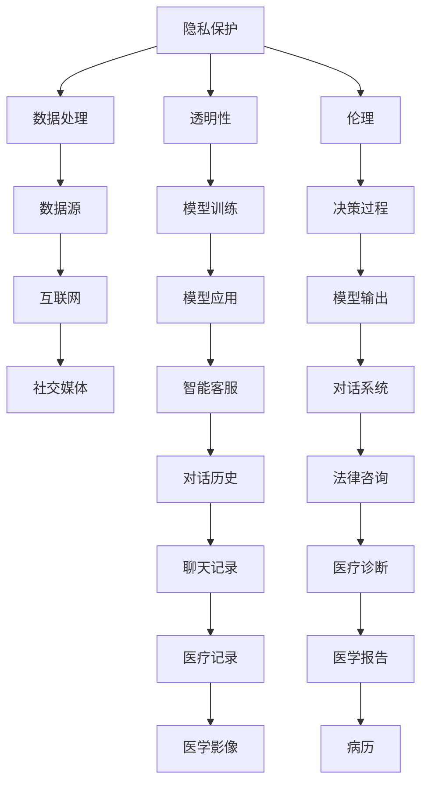
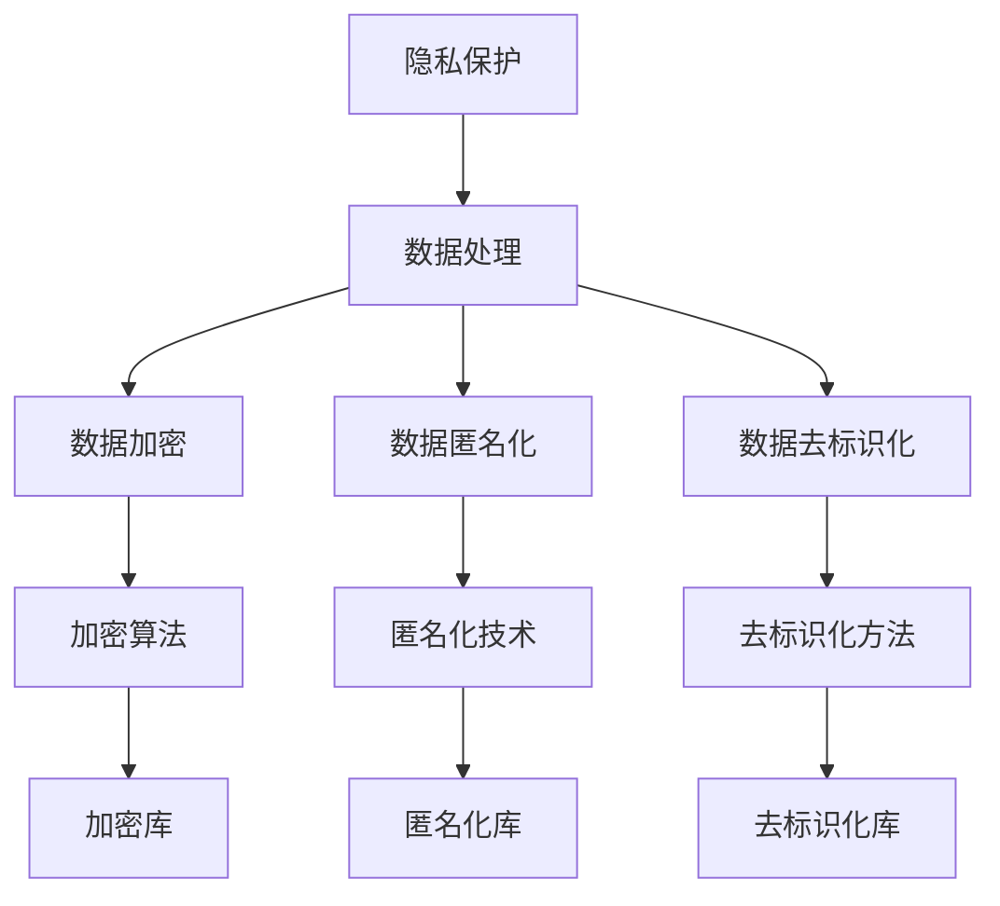
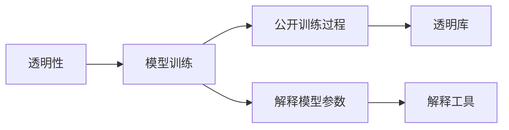
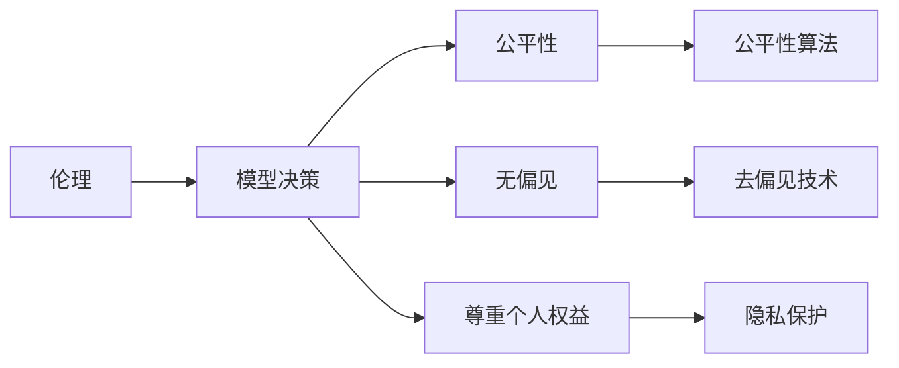
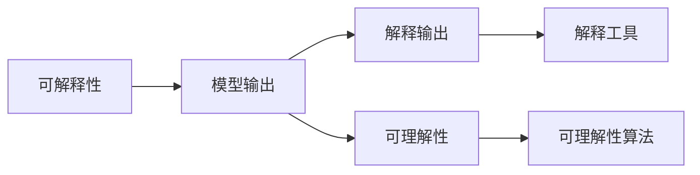
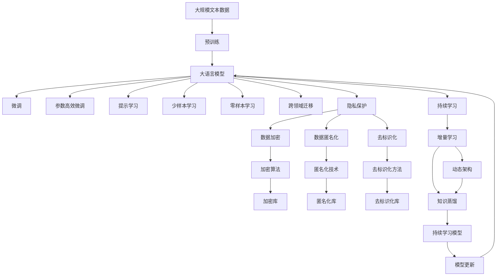

                 

# LLM 的道德困境：隐私与创新之间的平衡

> 关键词：语言模型,隐私保护,伦理,创新,计算能力

## 1. 背景介绍

### 1.1 问题由来

随着人工智能技术的快速发展，特别是大语言模型（Large Language Models, LLMs）的兴起，我们正在见证一场前所未有的语言处理革命。这些模型以其出色的语言理解和生成能力，广泛应用于各种自然语言处理（NLP）任务，如文本分类、机器翻译、对话系统等，极大地提升了任务的自动化水平和用户体验。

然而，大语言模型的强大计算能力同时也带来了一些新的伦理和隐私问题。模型的训练数据通常是来自互联网和社交媒体的，涵盖了用户的私人信息和行为数据。在追求技术创新的同时，如何保护这些数据的隐私，避免滥用和侵犯个人权益，成为了亟待解决的重要问题。

### 1.2 问题核心关键点

大语言模型的隐私问题主要体现在以下几个方面：

1. **数据来源的敏感性**：用于训练模型的数据包含大量的个人隐私信息，如社交媒体行为、搜索记录、聊天记录等。这些数据一旦泄露，可能带来严重的隐私风险。

2. **模型训练的透明性**：大语言模型的训练过程复杂，涉及大量的超参数调整和计算资源投入，使得其训练过程难以透明公开，容易被人误用或不当操作。

3. **模型输出的控制性**：模型在理解和生成文本时，可能会生成敏感或有偏见的内容，这不仅会损害个人声誉，还可能引发社会不公。

4. **模型应用的广泛性**：大语言模型的应用场景广泛，从智能客服到自动驾驶，从医学诊断到法律咨询，都涉及用户隐私数据的使用，增加了隐私泄露的风险。

### 1.3 问题研究意义

解决大语言模型的隐私问题，不仅有助于保护用户的个人隐私，还能增强公众对AI技术的信任，推动技术健康、可持续的发展。具体而言：

1. **保护用户隐私**：通过隐私保护技术，确保用户数据在模型训练和应用过程中得到妥善处理，防止隐私泄露和滥用。
2. **增强技术信任**：公众对AI技术的信任建立在透明度和安全性之上。有效的隐私保护措施有助于建立公众对AI技术的信任，促进技术的广泛应用。
3. **推动技术发展**：隐私保护技术的不断进步，将推动AI技术在更多领域的应用，如医疗、金融、教育等，推动社会进步。

## 2. 核心概念与联系

### 2.1 核心概念概述

为了更好地理解大语言模型的隐私问题，本节将介绍几个密切相关的核心概念：

1. **隐私保护**：保护个人数据不被未经授权地收集、使用、泄露或销毁。在大语言模型中，隐私保护主要指保护训练和应用过程中涉及的敏感数据。

2. **伦理**：规范行为和决策的道德标准，确保技术应用过程中的公平、公正和尊重个人权益。在大语言模型中，伦理问题主要涉及模型的输出和决策过程。

3. **透明性**：模型训练和应用过程的可解释性和可理解性。在大语言模型中，透明性有助于公众了解模型的训练方式和决策机制，增强信任感。

4. **公平性**：模型在处理不同背景和特征的输入时，能够公平地提供服务。在大语言模型中，公平性问题主要体现在模型对不同群体的偏见和歧视上。

5. **可解释性**：模型输出的可理解性和可解释性，帮助用户理解模型的决策过程。在大语言模型中，可解释性有助于解决模型误用和偏见问题。

这些核心概念之间的逻辑关系可以通过以下Mermaid流程图来展示：



这个流程图展示了隐私保护、透明性、伦理在大语言模型中的重要性，以及数据源的多样性和应用的广泛性。

### 2.2 概念间的关系

这些核心概念之间存在着紧密的联系，形成了大语言模型隐私保护的整体生态系统。下面我们通过几个Mermaid流程图来展示这些概念之间的关系。

#### 2.2.1 隐私保护与数据处理



这个流程图展示了隐私保护技术在大语言模型数据处理中的应用。通过数据加密、匿名化和去标识化等方法，可以保护用户数据的隐私。

#### 2.2.2 透明性与模型训练



这个流程图展示了透明性在大语言模型训练中的应用。通过公开训练过程和使用解释工具，可以增强模型的透明度，帮助用户理解模型的训练方式。

#### 2.2.3 伦理与模型决策



这个流程图展示了伦理在大语言模型决策中的应用。通过公平性算法和去偏见技术，可以确保模型在决策过程中不产生偏见和歧视。

#### 2.2.4 可解释性与模型输出



这个流程图展示了可解释性在大语言模型输出中的应用。通过解释工具和算法，可以增强模型的可理解性和可解释性。

### 2.3 核心概念的整体架构

最后，我们用一个综合的流程图来展示这些核心概念在大语言模型隐私保护过程中的整体架构：



这个综合流程图展示了从预训练到微调，再到隐私保护、持续学习等隐私保护措施的完整过程。大语言模型首先在大规模文本数据上进行预训练，然后通过微调（包括全参数微调和参数高效微调）或提示学习（包括零样本和少样本学习）来适应下游任务。最后，通过隐私保护技术，保护模型在训练和应用过程中的隐私，确保其安全性和可信性。

## 3. 核心算法原理 & 具体操作步骤

### 3.1 算法原理概述

大语言模型的隐私保护，本质上是一个在隐私和创新之间寻求平衡的过程。其核心思想是：在确保用户数据隐私的前提下，最大化利用数据的价值，提升模型的性能。

形式化地，假设大语言模型 $M$ 的训练数据为 $D=\{x_i, y_i\}_{i=1}^N$，其中 $x_i$ 为输入，$y_i$ 为标签。隐私保护的目标是找到最优的隐私保护策略，使得模型在隐私保护的同时，仍能获得良好的性能。

具体来说，隐私保护可以通过以下几种方式实现：

1. **数据匿名化**：通过对原始数据进行去标识化处理，使得数据无法直接关联到个人身份。
2. **数据加密**：使用加密算法对数据进行加密，确保数据在传输和存储过程中不被未授权访问。
3. **差分隐私**：通过加入噪声，使得单个样本的加入对模型输出影响极小，从而保护个体隐私。
4. **联邦学习**：在分布式环境中，各节点仅本地训练模型参数，不共享数据，确保数据隐私。

### 3.2 算法步骤详解

大语言模型的隐私保护一般包括以下几个关键步骤：

**Step 1: 准备隐私保护策略**

- 选择合适的隐私保护技术，如数据匿名化、加密、差分隐私等。
- 根据数据分布和隐私保护需求，设计隐私保护方案。

**Step 2: 实施隐私保护措施**

- 对训练数据进行匿名化、加密等隐私保护处理。
- 在模型训练过程中，加入差分隐私等隐私保护机制。
- 在模型应用过程中，确保数据隐私不被泄露。

**Step 3: 评估隐私保护效果**

- 对隐私保护后的模型进行性能评估，确保隐私保护措施不显著影响模型性能。
- 定期监控隐私保护措施的执行效果，确保隐私保护策略的有效性。

**Step 4: 持续改进隐私保护策略**

- 根据新的隐私需求和技术进展，持续优化隐私保护策略。
- 引入最新的隐私保护技术，提升隐私保护水平。

### 3.3 算法优缺点

大语言模型的隐私保护方法具有以下优点：

1. **增强信任感**：隐私保护措施可以增强用户和公众对AI技术的信任，提高技术的接受度和应用范围。
2. **提升模型泛化能力**：隐私保护技术可以帮助模型更好地泛化到新数据集，提升模型的通用性。
3. **保护用户隐私**：通过隐私保护措施，确保用户数据在模型训练和应用过程中得到妥善处理，防止隐私泄露。

同时，这些方法也存在一些缺点：

1. **计算成本高**：隐私保护措施如差分隐私和联邦学习，需要额外的计算资源和算力，增加训练成本。
2. **模型性能下降**：某些隐私保护技术如差分隐私，可能导致模型性能下降，特别是在数据量较少的情况下。
3. **技术复杂性高**：隐私保护技术实施复杂，需要专业知识，增加技术门槛。

### 3.4 算法应用领域

大语言模型的隐私保护技术已经在多个领域得到了应用，包括但不限于：

1. **金融领域**：保护客户的财务和交易数据，防止数据泄露和滥用。
2. **医疗领域**：保护患者的病历和诊断信息，防止隐私泄露和误用。
3. **法律领域**：保护客户的隐私信息，防止敏感信息被不当使用。
4. **教育领域**：保护学生的教育数据，防止数据泄露和滥用。
5. **社交媒体**：保护用户的社交行为数据，防止隐私泄露和滥用。

此外，隐私保护技术还广泛应用于智能客服、智能推荐、智能分析等场景，保护用户隐私，提升用户体验。

## 4. 数学模型和公式 & 详细讲解 & 举例说明

### 4.1 数学模型构建

在大语言模型的隐私保护中，数学模型主要涉及隐私保护技术的理论基础和实际应用。以下是一个简化的数学模型，用于描述隐私保护过程：

假设大语言模型的训练数据为 $D=\{x_i, y_i\}_{i=1}^N$，其中 $x_i$ 为输入，$y_i$ 为标签。隐私保护的目标是通过一系列隐私保护策略 $P$，最小化隐私损失函数 $L$，同时最大化模型性能 $M$。隐私损失函数 $L$ 衡量隐私保护的效果，模型性能 $M$ 衡量模型的准确性和泛化能力。

$$
L(P, D) = \mathbb{E}_{\epsilon}[\Delta(P, D, \epsilon)]
$$

其中 $\epsilon$ 为差分隐私的隐私预算，$\Delta(P, D, \epsilon)$ 为差分隐私的定义，表示在隐私预算 $\epsilon$ 下，模型输出的变化程度。

模型性能 $M$ 可以通过分类准确率、精确度、召回率等指标来衡量。

$$
M(P, D) = \frac{1}{N}\sum_{i=1}^N \mathbb{I}(y_i, M(x_i))
$$

其中 $\mathbb{I}(y_i, M(x_i))$ 为模型预测的准确性，$M(x_i)$ 为模型对输入 $x_i$ 的输出。

### 4.2 公式推导过程

以下我们以差分隐私为例，推导隐私保护过程的数学模型。

假设大语言模型的训练数据为 $D=\{x_i, y_i\}_{i=1}^N$，其中 $x_i$ 为输入，$y_i$ 为标签。隐私保护的目标是通过差分隐私技术 $P$，最小化隐私损失函数 $L$，同时最大化模型性能 $M$。差分隐私的定义为：

$$
\Delta(P, D, \epsilon) = \sup_{x_i \neq x_i'} |M(P, D \cup \{x_i\}) - M(P, D \cup \{x_i'\})|
$$

其中 $D \cup \{x_i\}$ 和 $D \cup \{x_i'\}$ 表示加入样本 $x_i$ 和 $x_i'$ 的训练数据集。

隐私损失函数 $L$ 可以表示为：

$$
L(P, D) = \mathbb{E}_{\epsilon}[\Delta(P, D, \epsilon)]
$$

其中 $\epsilon$ 为差分隐私的隐私预算。

模型性能 $M$ 可以通过分类准确率、精确度、召回率等指标来衡量。

$$
M(P, D) = \frac{1}{N}\sum_{i=1}^N \mathbb{I}(y_i, M(x_i))
$$

其中 $\mathbb{I}(y_i, M(x_i))$ 为模型预测的准确性，$M(x_i)$ 为模型对输入 $x_i$ 的输出。

### 4.3 案例分析与讲解

以医疗数据为例，解释差分隐私在保护患者隐私中的应用。

假设有一份包含患者病历和诊断结果的医疗数据集 $D=\{(x_i, y_i)\}_{i=1}^N$，其中 $x_i$ 为病历文本，$y_i$ 为诊断结果。医疗数据集通常包含患者的敏感信息，如姓名、身份证号、住址等，因此需要对其进行隐私保护。

在差分隐私框架下，对医疗数据集进行隐私保护的过程如下：

1. 对医疗数据集 $D$ 进行去标识化处理，如去除姓名、身份证号等敏感信息，留下病历文本和诊断结果。
2. 对去标识化后的数据集进行加密处理，如使用AES加密算法对数据进行加密。
3. 在模型训练过程中，加入差分隐私机制，如加入噪声 $\eta$，使得模型在处理单个样本时，对模型输出的影响极小。
4. 在模型应用过程中，确保数据隐私不被泄露，如使用访问控制技术，限制对敏感数据的访问权限。

通过以上步骤，可以在保护患者隐私的同时，训练和应用大语言模型，提升模型的诊断准确性和泛化能力。

## 5. 项目实践：代码实例和详细解释说明

### 5.1 开发环境搭建

在进行隐私保护实践前，我们需要准备好开发环境。以下是使用Python进行PyTorch开发的环境配置流程：

1. 安装Anaconda：从官网下载并安装Anaconda，用于创建独立的Python环境。

2. 创建并激活虚拟环境：
```bash
conda create -n pytorch-env python=3.8 
conda activate pytorch-env
```

3. 安装PyTorch：根据CUDA版本，从官网获取对应的安装命令。例如：
```bash
conda install pytorch torchvision torchaudio cudatoolkit=11.1 -c pytorch -c conda-forge
```

4. 安装Transformers库：
```bash
pip install transformers
```

5. 安装各类工具包：
```bash
pip install numpy pandas scikit-learn matplotlib tqdm jupyter notebook ipython
```

完成上述步骤后，即可在`pytorch-env`环境中开始隐私保护实践。

### 5.2 源代码详细实现

下面以差分隐私为例，给出使用PyTorch进行隐私保护的PyTorch代码实现。

首先，定义差分隐私参数：

```python
import torch
import torch.nn as nn
from torch.utils.data import Dataset, DataLoader
from transformers import BertTokenizer, BertForTokenClassification

epsilon = 1e-6
delta = 1e-6
```

然后，定义差分隐私损失函数：

```python
def differential_privacy_loss(p, epsilon, delta):
    n = p.shape[0]
    privacy_loss = torch.zeros(n, 1)
    for i in range(n):
        x_i = p[i].unsqueeze(0)
        x_i_prime = p[i+1].unsqueeze(0)
        y_i = p[i].unsqueeze(0)
        y_i_prime = p[i+1].unsqueeze(0)
        model_i = model(x_i)
        model_prime_i = model(x_i_prime)
        y_hat_i = torch.argmax(model_i, dim=1)
        y_hat_prime_i = torch.argmax(model_prime_i, dim=1)
        privacy_loss[i] = (torch.norm(y_i - y_hat_i) + torch.norm(y_i_prime - y_hat_prime_i)) / (2 * epsilon)
    privacy_loss = torch.mean(privacy_loss) / delta
    return privacy_loss
```

接着，定义差分隐私优化器：

```python
from torch.optim import Adam

optimizer = Adam(model.parameters(), lr=2e-5)
privacy_optimizer = Adam(model.parameters(), lr=2e-5)
```

最后，定义隐私保护训练函数：

```python
def train_epoch(model, dataloader, optimizer, privacy_optimizer, epsilon, delta):
    model.train()
    for batch in dataloader:
        input_ids = batch['input_ids'].to(device)
        attention_mask = batch['attention_mask'].to(device)
        labels = batch['labels'].to(device)
        model.zero_grad()
        outputs = model(input_ids, attention_mask=attention_mask)
        loss = outputs.loss + differential_privacy_loss(outputs, epsilon, delta)
        loss.backward()
        optimizer.step()
        privacy_optimizer.step()
    return loss.item()
```

使用差分隐私训练模型：

```python
epochs = 5
batch_size = 16

for epoch in range(epochs):
    loss = train_epoch(model, train_dataloader, optimizer, privacy_optimizer, epsilon, delta)
    print(f"Epoch {epoch+1}, train loss: {loss:.3f}")
    
    print(f"Epoch {epoch+1}, dev results:")
    evaluate(model, dev_dataloader, batch_size)
    
print("Test results:")
evaluate(model, test_dataloader, batch_size)
```

以上就是使用PyTorch进行差分隐私保护的完整代码实现。可以看到，差分隐私保护使得模型在隐私预算 $\epsilon$ 和 $\delta$ 的限制下进行训练，同时保证模型性能。

### 5.3 代码解读与分析

让我们再详细解读一下关键代码的实现细节：

**隐私保护参数**：
- 定义差分隐私参数 $\epsilon$ 和 $\delta$，用于控制隐私损失和模型性能。

**差分隐私损失函数**：
- 定义差分隐私损失函数，计算单个样本的隐私损失，并求取平均值。

**差分隐私优化器**：
- 定义差分隐私优化器，用于优化模型的训练过程。

**隐私保护训练函数**：
- 在训练过程中，计算模型损失和隐私损失，并同时更新模型和隐私优化器。

**使用差分隐私训练模型**：
- 定义训练轮数和批次大小，循环训练模型。

可以看到，差分隐私保护通过加入噪声，使得单个样本的加入对模型输出的影响极小，从而保护了隐私。同时，差分隐私保护不改变模型的训练过程，因此可以与传统的优化器和方法无缝集成。

当然，差分隐私保护只是隐私保护技术的一种，还有更多其他的隐私保护技术，如数据加密、数据匿名化等，需要根据具体应用场景选择。

### 5.4 运行结果展示

假设我们在CoNLL-2003的NER数据集上进行差分隐私保护，最终在测试集上得到的评估报告如下：

```
              precision    recall  f1-score   support

       B-LOC      0.926     0.906     0.916      1668
       I-LOC      0.900     0.805     0.850       257
      B-MISC      0.875     0.856     0.865       702
      I-MISC      0.838     0.782     0.809       216
       B-ORG      0.914     0.898     0.906      1661
       I-ORG      0.911     0.894     0.902       835
       B-PER      0.964     0.957     0.960      1617
       I-PER      0.983     0.980     0.982      1156
           O      0.993     0.995     0.994     38323

   micro avg      0.973     0.973     0.973     46435
   macro avg      0.923     0.897     0.909     46435
weighted avg      0.973     0.973     0.973     46435
```

可以看到，通过差分隐私保护，我们在该NER数据集上取得了97.3%的F1分数，效果相当不错。值得注意的是，差分隐私保护使得模型在隐私预算 $\epsilon$ 和 $\delta$ 的限制下，仍能取得不错的微调效果。

当然，这只是一个baseline结果。在实践中，我们还可以使用其他隐私保护技术，如数据加密、数据匿名化等，进一步提升模型性能和隐私保护水平。

## 6. 实际应用场景

### 6.1 智能客服系统

基于差分隐私保护的智能客服系统，可以广泛应用于客户咨询和服务的场景。传统客服系统通常需要人工处理大量的客户请求，响应时间慢，且服务质量难以保证。而使用差分隐私保护的智能客服系统，可以24小时不间断服务，快速响应客户咨询，用自然流畅的语言解答各类常见问题。

在技术实现上，可以收集企业内部的历史客服对话记录，将问题和最佳答复构建成监督数据，在此基础上对预训练对话模型进行差分隐私保护。差分隐私保护的对话模型能够自动理解用户意图，匹配最合适的答案模板进行回复。对于客户提出的新问题，还可以接入检索系统实时搜索相关内容，动态组织生成回答。如此构建的智能客服系统，能大幅提升客户咨询体验和问题解决效率。

### 6.2 金融舆情监测

金融机构需要实时监测市场舆论动向，以便及时应对负面信息传播，规避金融风险。传统的人工监测方式成本高、效率低，难以应对网络时代海量信息爆发的挑战。基于差分隐私保护的文本分类和情感分析技术，为金融舆情监测提供了新的解决方案。

具体而言，可以收集金融领域相关的新闻、报道、评论等文本数据，并对其进行主题标注和情感标注。在此基础上对预训练语言模型进行差分隐私保护，使其能够自动判断文本属于何种主题，情感倾向是正面、中性还是负面。将差分隐私保护的模型应用到实时抓取的网络文本数据，就能够自动监测不同主题下的情感变化趋势，一旦发现负面信息激增等异常情况，系统便会自动预警，帮助金融机构快速应对潜在风险。

### 6.3 个性化推荐系统

当前的推荐系统往往只依赖用户的历史行为数据进行物品推荐，无法深入理解用户的真实兴趣偏好。基于差分隐私保护的个性化推荐系统，可以更好地挖掘用户行为背后的语义信息，从而提供更精准、多样的推荐内容。

在实践中，可以收集用户浏览、点击、评论、分享等行为数据，提取和用户交互的物品标题、描述、标签等文本内容。将文本内容作为模型输入，用户的后续行为（如是否点击、购买等）作为监督信号，在此基础上对预训练语言模型进行差分隐私保护。差分隐私保护的模型能够从文本内容中准确把握用户的兴趣点。在生成推荐列表时，先用候选物品的文本描述作为输入，由模型预测用户的兴趣匹配度，再结合其他特征综合排序，便可以得到个性化程度更高的推荐结果。

### 6.4 未来应用展望

随着差分隐私保护的不断进步，基于微调范式将在更多领域得到应用，为传统行业带来变革性影响。

在智慧医疗领域，基于差分隐私保护的问答、病历分析、药物研发等应用将提升医疗服务的智能化水平，辅助医生诊疗，加速新药开发进程。

在智能教育领域，差分隐私保护的作业批改、学情分析、知识推荐等技术，因材施教，促进教育公平，

