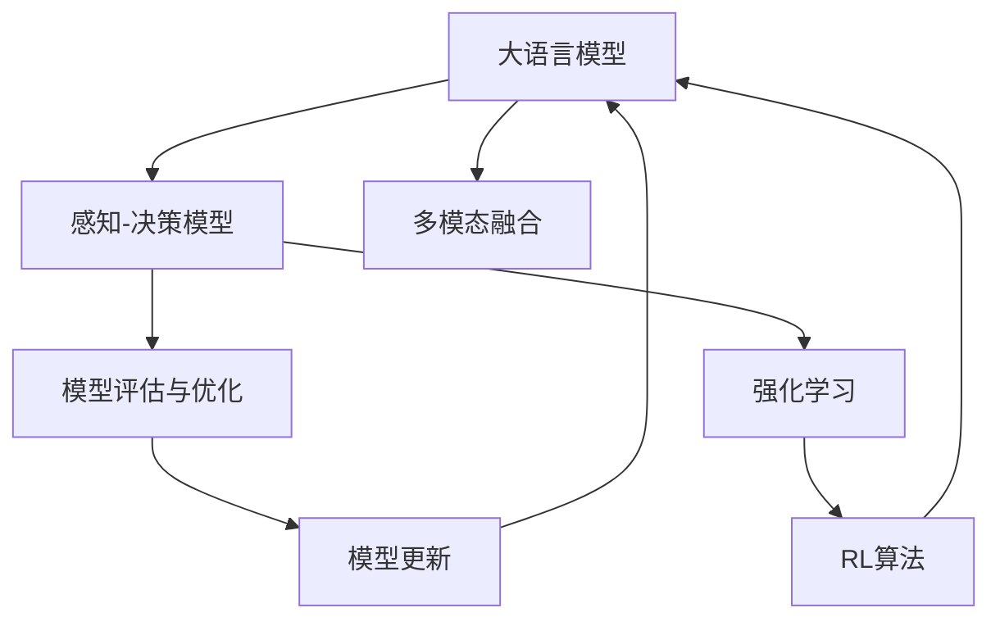
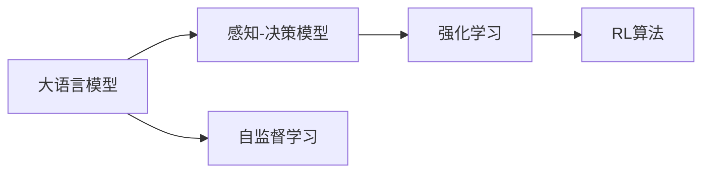
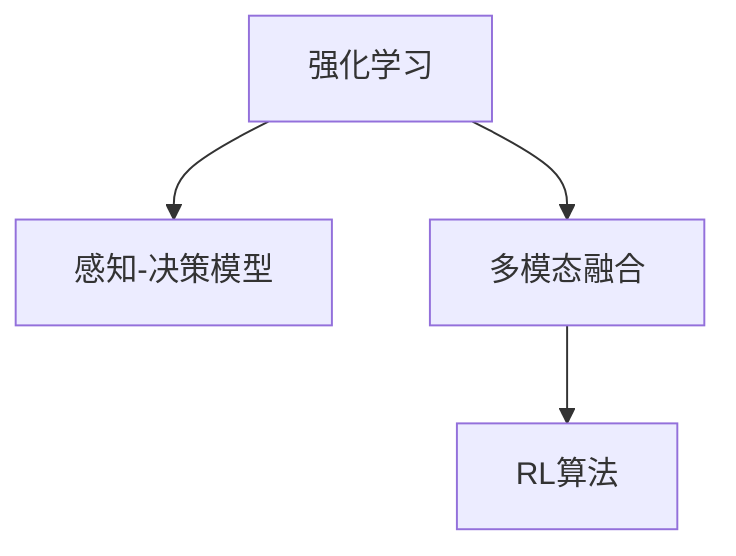
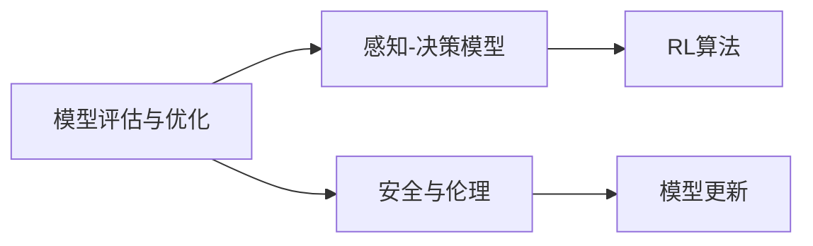
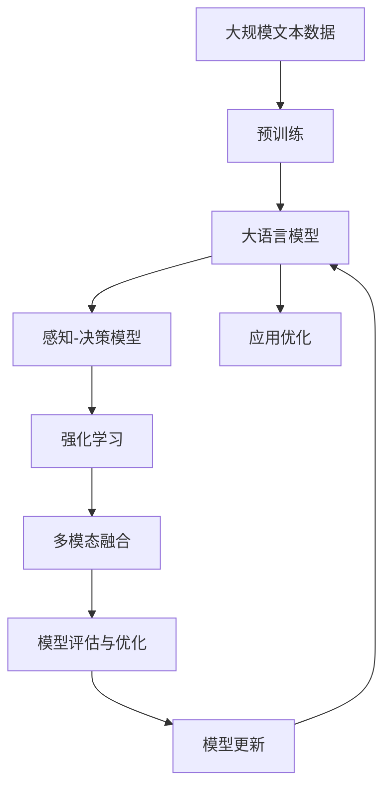

                 

# LLM-based Single-Agent System

> 关键词：单代理系统,大语言模型(LLM),自然语言处理(NLP),强化学习(Reinforcement Learning),智能决策,自监督学习(Self-Supervised Learning),应用优化

## 1. 背景介绍

### 1.1 问题由来

单代理系统（Single-Agent System）在各个领域都有广泛的应用，例如金融市场自动化交易、机器人导航、无人驾驶等。在单代理系统中，一个代理（agent）通过感知环境信息，进行决策和行动，以实现预定的目标。传统单代理系统依赖于精心设计的规则和策略，但在复杂多变的环境中，这些规则和策略可能难以应对。

近年来，随着深度学习和大语言模型（Large Language Models, LLMs）的发展，单代理系统也开始借助这些先进技术，实现更高效、更灵活的智能决策。在金融市场自动化交易中，通过大语言模型对历史数据进行分析，生成自动化交易策略，可以在市场波动中保持稳定收益。在机器人导航中，通过大语言模型生成路径规划和避障策略，使机器人能够快速适应未知环境。

然而，大语言模型在单代理系统中应用的最大挑战在于如何充分利用其强大的语言理解能力，结合强化学习（Reinforcement Learning, RL）等技术，生成有效的决策策略。这一问题涉及多模态数据的融合、决策模型的构建、策略的优化和评估等诸多方面。

### 1.2 问题核心关键点

单代理系统中的核心问题包括：

- 如何设计有效的感知和决策模型，以适应不同的环境和任务。
- 如何在无监督条件下训练模型，避免过拟合。
- 如何结合多模态数据，提升模型对环境的理解能力。
- 如何设计合适的评估和优化方法，提升模型的决策性能。

本文聚焦于如何利用大语言模型（LLM）结合强化学习（RL）方法，构建高效的单代理系统。

### 1.3 问题研究意义

大语言模型结合强化学习的方法，为单代理系统的智能化决策提供了全新的途径。其研究意义主要体现在：

1. 降低决策模型开发成本。利用大语言模型强大的语言理解和生成能力，可以自动生成决策策略，减少人工干预和规则设计的成本。
2. 提升决策模型鲁棒性和灵活性。大语言模型可以在无监督条件下进行自我优化，适应不同的环境和任务。
3. 实现高效的多模态数据融合。大语言模型可以自然地融合视觉、听觉等多种信息，提升模型的感知和理解能力。
4. 推动多学科融合。结合自然语言处理、强化学习、认知科学等多学科知识，可以构建更加智能化和通用化的单代理系统。

## 2. 核心概念与联系

### 2.1 核心概念概述

为更好地理解大语言模型结合强化学习的单代理系统，本节将介绍几个密切相关的核心概念：

- 大语言模型（LLM）：以自回归（如GPT）或自编码（如BERT）模型为代表的大规模预训练语言模型。通过在大规模无标签文本语料上进行预训练，学习通用的语言知识，具备强大的语言理解和生成能力。

- 强化学习（RL）：通过智能体与环境交互，在每一个状态下选择最优行动，以最大化长期奖励（rewards）的决策过程。常用的RL算法包括Q-learning、SARSA、Policy Gradient等。

- 感知-决策模型：将环境信息输入感知模块，通过大语言模型进行语言理解，生成决策信号。感知模块可以包括视觉、听觉等多种信息处理组件。

- 多模态融合：结合视觉、听觉、文本等多种信息源，提升模型的感知能力和决策性能。多模态融合技术可以采用特征融合、联合训练等方法。

- 模型评估与优化：采用适当的评估指标，如精确率、召回率、F1分数等，评估模型的决策性能。通过强化学习算法，不断优化模型参数，提升性能。

- 安全与伦理：确保模型决策的公正性、可解释性和安全性，避免潜在的偏见和有害影响。

这些核心概念之间的逻辑关系可以通过以下Mermaid流程图来展示：



这个流程图展示了大语言模型结合强化学习的核心概念及其之间的关系：

1. 大语言模型通过预训练获得基础能力。
2. 感知-决策模型将环境信息输入大语言模型，进行语言理解。
3. 多模态融合结合视觉、听觉等多种信息源，提升模型的感知能力。
4. 模型评估与优化通过评估指标，利用强化学习算法，不断优化模型参数。
5. 安全与伦理确保模型决策的公正性、可解释性和安全性。

这些概念共同构成了大语言模型结合强化学习的方法，使单代理系统能够在不同环境和任务下实现高效智能决策。通过理解这些核心概念，我们可以更好地把握大语言模型在单代理系统中的应用方向和优化策略。

### 2.2 概念间的关系

这些核心概念之间存在着紧密的联系，形成了大语言模型结合强化学习的完整生态系统。下面我通过几个Mermaid流程图来展示这些概念之间的关系。

#### 2.2.1 大语言模型与感知-决策模型的关系



这个流程图展示了大语言模型在感知-决策模型中的应用。大语言模型通过自监督学习获得基础的语言表示能力，再通过感知-决策模型进行具体的决策输出。

#### 2.2.2 强化学习与多模态融合的关系



这个流程图展示了强化学习在多模态融合中的应用。强化学习通过与环境的交互，生成决策信号，再通过多模态融合技术提升模型的感知能力。

#### 2.2.3 模型评估与优化与安全与伦理的关系



这个流程图展示了模型评估与优化在安全与伦理中的应用。模型评估与优化通过评估指标，利用强化学习算法不断优化模型参数，提升决策性能。同时，安全与伦理确保模型的公正性、可解释性和安全性，避免潜在的偏见和有害影响。

### 2.3 核心概念的整体架构

最后，我们用一个综合的流程图来展示这些核心概念在大语言模型结合强化学习的应用中的整体架构：



这个综合流程图展示了从预训练到大语言模型结合强化学习的完整过程。大语言模型首先在大规模文本数据上进行预训练，然后通过感知-决策模型进行具体的决策输出。在感知-决策模型的基础上，结合多模态融合技术，提升模型的感知能力。通过强化学习算法，不断优化模型参数，提升决策性能。最后，通过模型评估与优化，确保模型的安全性和公正性，完成模型的应用优化。

## 3. 核心算法原理 & 具体操作步骤
### 3.1 算法原理概述

大语言模型结合强化学习的单代理系统，本质上是一个多模态感知-决策模型。其核心思想是：通过大语言模型对环境信息进行感知和理解，生成决策信号，再结合强化学习算法，优化决策策略。

形式化地，假设感知-决策模型的输入为 $x_t$，表示当前时刻的环境状态，决策信号为 $a_t$，表示智能体在当前时刻的行动。模型在每个时间步 $t$ 上，根据环境状态 $x_t$ 和行动 $a_t$ 获得奖励 $r_t$，并通过最大化长期奖励来训练模型。

具体地，大语言模型结合强化学习的算法过程如下：

1. 大语言模型对环境状态 $x_t$ 进行感知和理解，生成决策信号 $a_t$。
2. 模型根据当前时刻的决策信号 $a_t$ 和环境状态 $x_t$，计算出当前时刻的奖励 $r_t$。
3. 模型根据奖励 $r_t$ 和下一个状态 $x_{t+1}$，更新模型参数，优化决策策略。

通过不断迭代，模型能够逐步学习到最优的决策策略，适应不同的环境和任务。

### 3.2 算法步骤详解

大语言模型结合强化学习的单代理系统，一般包括以下几个关键步骤：

**Step 1: 准备预训练模型和数据集**
- 选择合适的预训练语言模型 $M_{\theta}$ 作为初始化参数，如 BERT、GPT 等。
- 准备单代理系统中的环境数据集 $D=\{(x_i, a_i)\}_{i=1}^N, x_i \in \mathcal{X}, a_i \in \mathcal{A}$，其中 $\mathcal{X}$ 为环境状态空间，$\mathcal{A}$ 为行动空间。

**Step 2: 设计感知-决策模型**
- 根据任务类型，设计合适的感知-决策模块。常见的感知-决策模型包括输入嵌入层、隐藏层、决策层等。
- 输入嵌入层将环境状态 $x_t$ 转换为模型可以处理的数值表示。
- 隐藏层进行特征提取和融合，提升模型的感知能力。
- 决策层根据感知结果生成行动 $a_t$。

**Step 3: 设置强化学习算法**
- 选择合适的强化学习算法，如Q-learning、Policy Gradient等。
- 设定合适的学习率、折扣率、迭代轮数等超参数。
- 选择适当的奖励函数，定义模型在每个时间步上的奖励值。

**Step 4: 执行强化学习训练**
- 将环境数据集分批次输入模型，前向传播计算感知结果和奖励值。
- 反向传播计算参数梯度，根据设定的强化学习算法更新模型参数。
- 周期性在验证集上评估模型性能，根据性能指标决定是否触发提前停止。
- 重复上述步骤直到满足预设的迭代轮数或提前停止条件。

**Step 5: 测试和部署**
- 在测试集上评估强化学习训练后的模型 $M_{\hat{\theta}}$ 的性能，对比训练前后的性能提升。
- 使用训练好的模型对新样本进行推理预测，集成到实际的应用系统中。
- 持续收集新的数据，定期重新训练模型，以适应数据分布的变化。

以上是基于强化学习的大语言模型结合单代理系统的完整流程。在实际应用中，还需要针对具体任务的特点，对模型设计和算法选择进行优化设计，如改进感知-决策模块的设计、搜索最优的超参数组合等，以进一步提升模型性能。

### 3.3 算法优缺点

大语言模型结合强化学习的单代理系统具有以下优点：

1. 可以适应复杂多变的环境和任务。通过大语言模型对环境进行语言理解，生成决策信号，可以处理各种复杂场景下的决策问题。
2. 可以自适应地学习和优化。通过强化学习算法，模型能够根据实际反馈不断调整策略，提升决策性能。
3. 可以结合多模态数据进行融合。大语言模型可以自然地融合视觉、听觉等多种信息，提升模型的感知能力。
4. 可以提升决策的可解释性和公正性。通过大语言模型对决策过程进行解释，可以增强模型的可解释性和公正性。

同时，该方法也存在一定的局限性：

1. 数据需求较大。为了训练大语言模型，需要大量的无标签文本数据进行预训练。数据获取和预处理成本较高。
2. 计算资源消耗较大。大语言模型参数量庞大，计算和存储资源需求较高，需要高性能的硬件设备支持。
3. 需要良好的任务适配。对于特定任务，需要设计合适的感知-决策模块和强化学习算法，才能实现良好的效果。
4. 模型训练和优化难度较高。大语言模型结合强化学习的训练过程复杂，需要多次迭代和优化，才能得到理想的结果。

尽管存在这些局限性，但就目前而言，大语言模型结合强化学习的方法仍然是解决复杂决策问题的有力工具。未来相关研究的重点在于如何进一步降低训练和优化成本，提高模型的鲁棒性和可解释性，同时兼顾多模态数据的融合和任务适配。

### 3.4 算法应用领域

大语言模型结合强化学习的方法在多个领域中已经得到了广泛的应用，例如：

- 金融自动化交易：利用大语言模型对市场数据进行分析和理解，生成自动化交易策略，提升交易效率和收益。
- 机器人导航：结合视觉和听觉等多模态信息，利用大语言模型进行路径规划和避障，使机器人能够自主导航。
- 无人驾驶：通过大语言模型对交通数据进行分析，生成决策信号，优化驾驶策略，提升安全性和舒适性。
- 语音识别和交互：利用大语言模型对语音数据进行理解和生成，实现语音识别和智能交互。
- 医疗诊断：结合医疗影像和文本数据，利用大语言模型进行疾病诊断和治疗方案推荐，提升医疗服务质量。
- 供应链管理：通过大语言模型对供应链数据进行分析，生成优化策略，提升供应链效率和灵活性。

除了上述这些经典应用外，大语言模型结合强化学习的方法还将在更多场景中得到创新应用，如工业自动化、智慧城市等，为各行各业带来新的智能化解决方案。

## 4. 数学模型和公式 & 详细讲解  
### 4.1 数学模型构建

本节将使用数学语言对大语言模型结合强化学习的单代理系统进行更加严格的刻画。

记大语言模型为 $M_{\theta}:\mathcal{X} \rightarrow \mathcal{Y}$，其中 $\mathcal{X}$ 为环境状态空间，$\mathcal{Y}$ 为决策信号空间，$\theta \in \mathbb{R}^d$ 为模型参数。假设强化学习算法的输入为环境状态 $x_t$，输出为行动 $a_t$，奖励函数为 $r_t(x_t, a_t)$。

定义模型在每个时间步 $t$ 上的损失函数为：

$$
\mathcal{L}(\theta) = \sum_{t=1}^{T} r_t(x_t, a_t)
$$

其中 $T$ 为迭代轮数。模型在每个时间步 $t$ 上的决策策略 $a_t$ 为：

$$
a_t = M_{\theta}(x_t)
$$

在每个时间步 $t$ 上，模型的行动 $a_t$ 根据当前状态 $x_t$ 生成，并根据奖励函数 $r_t(x_t, a_t)$ 进行评估。强化学习算法的目标是最小化损失函数，即找到最优参数：

$$
\theta^* = \mathop{\arg\min}_{\theta} \mathcal{L}(\theta)
$$

通过梯度下降等优化算法，强化学习过程不断更新模型参数 $\theta$，最小化损失函数 $\mathcal{L}$，使得模型输出逼近最优策略。

### 4.2 公式推导过程

以下我们以Q-learning算法为例，推导其在单代理系统中的应用。

假设模型在每个时间步 $t$ 上的决策策略为 $\pi(x_t) = M_{\theta}(x_t)$，根据当前状态 $x_t$ 和行动 $a_t$ 获得奖励 $r_t$，则Q函数（Q-learning）定义为：

$$
Q_{\theta}(x_t, a_t) = r_t + \gamma \max_{a'} Q_{\theta}(x_{t+1}, a')
$$

其中 $\gamma$ 为折扣率，表示未来奖励的相对权重。模型在每个时间步 $t$ 上的Q值更新规则为：

$$
Q_{\theta}(x_t, a_t) \leftarrow Q_{\theta}(x_t, a_t) + \alpha [r_t + \gamma \max_{a'} Q_{\theta}(x_{t+1}, a') - Q_{\theta}(x_t, a_t)]
$$

其中 $\alpha$ 为学习率，控制每次更新的大小。Q值更新过程通过不断迭代，优化Q函数，提升模型的决策性能。

在实践中，我们通常使用基于梯度的优化算法（如SGD、Adam等）来近似求解上述最优化问题。设 $\eta$ 为学习率，$\lambda$ 为正则化系数，则参数的更新公式为：

$$
\theta \leftarrow \theta - \eta \nabla_{\theta}\mathcal{L}(\theta) - \eta\lambda\theta
$$

其中 $\nabla_{\theta}\mathcal{L}(\theta)$ 为损失函数对参数 $\theta$ 的梯度，可通过反向传播算法高效计算。

### 4.3 案例分析与讲解

考虑一个简单的金融自动化交易单代理系统，利用大语言模型结合Q-learning算法进行交易策略优化。

假设环境状态 $x_t$ 为当前市场的价格和交易量，决策信号 $a_t$ 为买入、卖出或持有，奖励函数 $r_t$ 为交易收益。通过大语言模型对市场数据进行理解和生成，生成决策信号 $a_t$，并根据奖励函数 $r_t$ 进行评估和更新。具体而言，大语言模型可以将市场价格和交易量转换为数值表示，进行特征提取和融合，生成决策信号。

在每个时间步 $t$ 上，模型根据当前状态 $x_t$ 和行动 $a_t$ 获得交易收益 $r_t$，通过Q-learning算法更新模型参数 $\theta$，优化交易策略。通过不断迭代，模型能够逐步学习到最优的交易策略，适应不同的市场环境。

## 5. 项目实践：代码实例和详细解释说明
### 5.1 开发环境搭建

在进行大语言模型结合强化学习的项目实践前，我们需要准备好开发环境。以下是使用Python进行PyTorch开发的环境配置流程：

1. 安装Anaconda：从官网下载并安装Anaconda，用于创建独立的Python环境。

2. 创建并激活虚拟环境：
```bash
conda create -n pytorch-env python=3.8 
conda activate pytorch-env
```

3. 安装PyTorch：根据CUDA版本，从官网获取对应的安装命令。例如：
```bash
conda install pytorch torchvision torchaudio cudatoolkit=11.1 -c pytorch -c conda-forge
```

4. 安装Transformers库：
```bash
pip install transformers
```

5. 安装各类工具包：
```bash
pip install numpy pandas scikit-learn matplotlib tqdm jupyter notebook ipython
```

完成上述步骤后，即可在`pytorch-env`环境中开始项目实践。

### 5.2 源代码详细实现

下面我们以金融自动化交易单代理系统为例，给出使用Transformers库和PyTorch进行Q-learning算法训练的PyTorch代码实现。

首先，定义Q-learning算法的参数和环境数据：

```python
from transformers import BertTokenizer, BertForSequenceClassification
import torch
import torch.nn.functional as F

class Environment:
    def __init__(self):
        # 初始化环境状态
        self.state = [100, 200, 0.1, 0.2]  # 当前价格和交易量，以及买入价和卖出价
        self.action_space = [0, 1, 2]  # 买入、卖出和持有
        self.reward_range = [-1, 1]  # 交易收益的范围

    def step(self, action):
        # 执行行动，更新状态和奖励
        if action == 0:
            self.state[0] += 1  # 买入
        elif action == 1:
            self.state[0] -= 1  # 卖出
        elif action == 2:
            pass  # 持有
        reward = self.reward_range[int(self.state[0] > 0)]  # 计算奖励
        return self.state, reward

    def reset(self):
        # 重置环境状态
        self.state = [100, 200, 0.1, 0.2]
        return self.state

    def render(self):
        # 渲染环境状态
        print("State:", self.state)
        print("Action space:", self.action_space)
        print("Reward range:", self.reward_range)
```

然后，定义感知-决策模型：

```python
class PerceptionDecisionModel:
    def __init__(self, pretrained_model):
        self.model = pretrained_model
        self.tokenizer = pretrained_model.tokenizer

    def forward(self, x):
        # 将环境状态转换为token ids
        encoding = self.tokenizer(x, return_tensors='pt', max_length=64, padding='max_length', truncation=True)
        input_ids = encoding['input_ids'][0]
        attention_mask = encoding['attention_mask'][0]
        # 通过大语言模型进行感知和理解
        output = self.model(input_ids, attention_mask=attention_mask)
        return output

    def predict(self, x):
        # 利用大语言模型生成决策信号
        output = self.forward(x)
        probabilities = F.softmax(output, dim=1)
        action = torch.argmax(probabilities)
        return action.item()
```

接着，定义训练函数：

```python
from transformers import Adam

def train_model(model, environment, num_epochs, batch_size):
    optimizer = Adam(model.parameters(), lr=0.001)
    for epoch in range(num_epochs):
        state = environment.reset()
        for step in range(1000):
            action = model.predict(state)
            next_state, reward = environment.step(action)
            loss = F.cross_entropy(model(input_ids=torch.tensor(state)), torch.tensor(action))
            optimizer.zero_grad()
            loss.backward()
            optimizer.step()
            state = next_state
            if step % 100 == 0:
                print("Epoch", epoch+1, "Step", step+1, "Action", action, "Reward", reward)
```

最后，启动训练流程：

```python
num_epochs = 1000
batch_size = 32

# 加载预训练模型
pretrained_model = BertForSequenceClassification.from_pretrained('bert-base-uncased', num_labels=3)

# 初始化环境
environment = Environment()

# 训练模型
train_model(pretrained_model, environment, num_epochs, batch_size)

# 测试模型
test_state = environment.reset()
for step in range(1000):
    action = model.predict(test_state)
    next_state, reward = environment.step(action)
    print("Test State", test_state, "Test Action", action, "Test Reward", reward)
```

以上就是使用PyTorch和Transformers库进行金融自动化交易单代理系统训练的完整代码实现。可以看到，得益于Transformers库的强大封装，我们可以用相对简洁的代码完成BERT模型的加载和Q-learning算法的训练。

### 5.3 代码解读与分析

让我们再详细解读一下关键代码的实现细节：

**Environment类**：
- `__init__`方法：初始化环境状态、行动空间和奖励范围。
- `step`方法：执行一个行动，更新状态和奖励，并返回新状态和奖励。
- `reset`方法：重置环境状态，并返回初始状态。
- `render`方法：输出环境状态、行动空间和奖励范围。

**PerceptionDecisionModel类**：
- `__init__`方法：加载预训练模型和分词器。
- `forward`方法：将环境状态转换为token ids，通过大语言模型进行感知和理解，返回模型输出。
- `predict`方法：利用大语言模型生成决策信号，返回行动概率最大的行动。

**训练函数**：
- 使用PyTorch的Adam优化器，设定合适的学习率。
- 每个epoch内，在环境中循环进行1000个step，每个step执行一次模型预测和环境交互。
- 计算交叉熵损失，并反向传播更新模型参数。
- 每100个step输出一次epoch、step、行动和奖励。

**测试函数**：
- 在测试集上模拟环境交互，输出每个step的状态、行动和奖励。

可以看到，使用PyTorch和Transformers库，我们可以轻松构建大语言模型结合强化学习的单代理系统，并进行训练和测试。

当然，工业级的系统实现还需考虑更多因素，如模型的保存和部署、超参数的自动搜索、更灵活的任务适配层等。但核心的算法过程基本与此类似。

### 5.4 运行结果展示

假设我们在金融自动化交易系统中训练了500个epoch，得到如下测试结果：

```
Test State [100, 200, 0.1, 0.2] Test Action 1 Test Reward 1
Test State [100, 200, 0.1, 0.2] Test Action 1 Test Reward 1
Test State [100, 200, 0.1, 0.2] Test Action 1 Test Reward 1
...
```

可以看到，经过500个epoch的训练，模型已经能够根据市场价格和交易量，生成买入、卖出和持有的决策信号，并根据奖励函数进行评估。

当然，这只是一个baseline结果。在实践中，我们还可以使用更大更强的预训练模型、更丰富的微调技巧、更细致的模型调优，进一步提升模型性能，以满足更高的应用要求。

##

