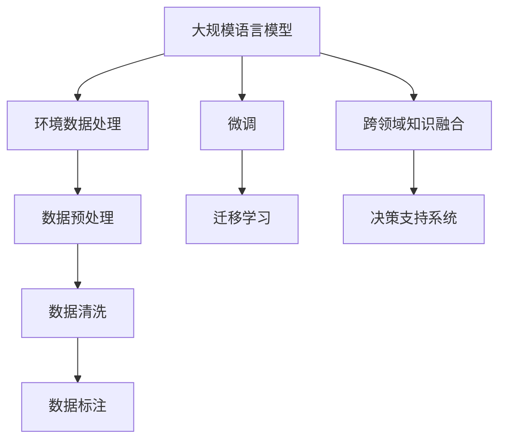

                 

## 1. 背景介绍

### 1.1 问题由来

环境保护是当今全球面临的重大挑战之一，而人工智能（AI）尤其是基于大规模语言模型（Large Language Models，简称LLM）的应用，为解决这一问题提供了全新的可能性。通过自然语言处理（NLP）技术，LLM能够理解和处理复杂的环境数据，辅助政府、企业和社会组织做出科学决策，推动可持续发展目标的实现。

近年来，LLM在环境保护领域的应用取得了显著进展，涵盖气候变化预测、污染源监测、环境法规制定、环境教育等多个方面。然而，要充分发挥LLM在环境保护中的潜力，仍需解决一些关键问题，如数据获取、模型训练、结果解释等。本文将详细探讨LLM在环境保护中的应用，展示其如何助力实现可持续发展目标。

### 1.2 问题核心关键点

本节将介绍LLM在环境保护中应用的核心关键点：

1. **数据获取与预处理**：环境保护任务通常涉及大量多模态数据，包括文本、图像、时间序列等。如何高效获取和预处理这些数据，是应用LLM的前提。
2. **模型训练与微调**：如何选择合适的模型架构、训练算法和超参数，以及在特定环境下进行微调，是决定LLM性能的关键。
3. **结果解释与可视化**：环境保护结果往往涉及专业术语和复杂数据，如何简洁明了地解释结果，是推动决策和教育的关键。
4. **跨领域协作**：环境保护是一个涉及多个学科和领域的复杂系统，如何与其他领域专家协作，是实现多维数据融合和跨领域决策的关键。

## 2. 核心概念与联系

### 2.1 核心概念概述

- **大规模语言模型（LLM）**：一种基于深度学习模型的自然语言处理技术，能够理解和生成自然语言，并从中提取语义信息。
- **环境数据处理**：涉及对文本、图像、时间序列等环境数据的预处理、清洗和标注，以便LLM能够理解和分析。
- **微调与迁移学习**：通过在特定任务上微调预训练模型或应用迁移学习，使其适应具体环境保护需求。
- **跨领域知识融合**：将LLM与环境科学、地理信息系统（GIS）、遥感技术等融合，实现多维数据的整合与分析。
- **决策支持系统（DSS）**：一种集成多种信息技术的系统，用于辅助决策者制定环境管理策略。

### 2.2 概念间的关系

LLM在环境保护中的应用涉及多个概念和技术的综合应用。以下是一个Mermaid流程图，展示这些概念之间的关系：



## 3. 核心算法原理 & 具体操作步骤

### 3.1 算法原理概述

LLM在环境保护中的应用主要基于其强大的自然语言理解和生成能力，通过以下步骤实现：

1. **数据预处理**：收集和清洗环境数据，包括文本、图像和时间序列数据，转换为LLM可以处理的格式。
2. **模型微调**：在预训练的LLM基础上，通过微调或迁移学习，使其适应特定环境保护任务，如气候变化预测、污染源监测等。
3. **跨领域知识融合**：将LLM与环境科学、地理信息系统等技术融合，实现多维数据的整合与分析。
4. **结果解释与可视化**：通过自然语言生成技术，将复杂的分析结果转化为简洁明了的解释，供决策者理解和使用。

### 3.2 算法步骤详解

#### 3.2.1 数据预处理

1. **数据收集**：从政府机构、环保组织、科学研究等渠道收集环境数据，如文本报告、图像、传感器数据等。
2. **数据清洗**：去除噪声数据、不完整数据和不一致数据，确保数据的质量。
3. **数据标注**：对部分数据进行人工标注，用于监督学习。

#### 3.2.2 模型微调

1. **选择合适的模型**：根据任务需求选择合适的预训练模型，如GPT、BERT等。
2. **任务适配层设计**：在预训练模型的基础上设计适应特定任务的输出层和损失函数。
3. **训练与验证**：使用标注数据集对模型进行有监督训练，并在验证集上进行性能评估。
4. **微调与迁移学习**：根据验证集上的性能表现，决定是否进行微调或迁移学习，以优化模型在特定任务上的表现。

#### 3.2.3 结果解释与可视化

1. **结果解释**：使用自然语言生成技术，将模型输出解释为简单易懂的语言，供非技术背景的决策者理解。
2. **可视化**：使用图表、地图等可视化工具，将复杂的数据分析结果直观展示。

### 3.3 算法优缺点

#### 3.3.1 优点

1. **高效性**：LLM能够处理大规模数据集，快速分析和生成结果。
2. **鲁棒性**：通过微调和迁移学习，LLM能够适应不同类型的环境数据和任务。
3. **跨领域能力**：LLM能够融合多领域知识，提供跨领域的决策支持。

#### 3.3.2 缺点

1. **数据依赖**：LLM依赖高质量的数据进行训练和微调，数据获取和标注成本较高。
2. **模型复杂性**：大规模模型需要大量计算资源，训练和推理成本较高。
3. **结果解释**：复杂的分析结果需要专业的解释，增加了用户理解的门槛。

### 3.4 算法应用领域

LLM在环境保护中的应用覆盖了多个领域，包括但不限于：

1. **气候变化预测**：通过分析历史气候数据，预测未来的气候变化趋势。
2. **污染源监测**：通过分析环境监测数据，识别污染源及其影响范围。
3. **环境法规制定**：通过分析环境案例和法规文献，提供政策建议和法规修订方案。
4. **环境教育**：通过生成易于理解的环境知识文章，提升公众环保意识。

## 4. 数学模型和公式 & 详细讲解 & 举例说明

### 4.1 数学模型构建

假设我们需要预测某地区未来的空气质量，使用LLM进行微调。设空气质量数据集为 $\{(x_i, y_i)\}_{i=1}^N$，其中 $x_i$ 为环境监测数据，$y_i$ 为空气质量等级。

定义LLM模型为 $M_{\theta}$，其中 $\theta$ 为模型参数。假设使用Bert模型，则模型结构如下：

```
Embedding Layer
Attention Mechanism
Feedforward Layer
...
Output Layer
```

模型的预测输出为 $M_{\theta}(x)$，其中 $x$ 为输入数据。

### 4.2 公式推导过程

#### 4.2.1 损失函数

假设预测输出为 $M_{\theta}(x_i)$，真实标签为 $y_i$，则交叉熵损失函数为：

$$
\mathcal{L}(\theta) = -\frac{1}{N}\sum_{i=1}^N y_i \log M_{\theta}(x_i)
$$

#### 4.2.2 优化算法

使用AdamW优化算法进行模型训练，优化目标为最小化损失函数 $\mathcal{L}(\theta)$：

$$
\theta \leftarrow \theta - \eta \nabla_{\theta}\mathcal{L}(\theta) - \eta\lambda\theta
$$

其中 $\eta$ 为学习率，$\lambda$ 为正则化系数。

### 4.3 案例分析与讲解

假设我们有一个包含文本、图像和时间序列数据的环境数据集，用于预测某地区的空气质量。具体步骤如下：

1. **数据预处理**：
   - 收集气象数据、污染源数据和卫星图像等，将其转换为文本和数值数据。
   - 对文本数据进行分词、清洗和标注，准备输入LLM模型。

2. **模型微调**：
   - 使用Bert模型作为初始模型，添加输出层和损失函数。
   - 使用标注数据集进行微调，优化模型参数 $\theta$。

3. **结果解释与可视化**：
   - 模型输出预测结果，使用自然语言生成技术将其解释为简明的文本。
   - 使用地图可视化工具展示预测结果，直观展示污染源分布和空气质量变化。

## 5. 项目实践：代码实例和详细解释说明

### 5.1 开发环境搭建

#### 5.1.1 安装Python和必要的库

```bash
conda create --name env python=3.7
conda activate env
pip install torch transformers
```

#### 5.1.2 数据准备

收集环境数据，如气象数据、污染源数据和卫星图像等，并进行预处理和标注。

### 5.2 源代码详细实现

#### 5.2.1 数据处理

```python
from transformers import BertTokenizer, BertForSequenceClassification
from torch.utils.data import Dataset, DataLoader
import torch

class EnvironmentalData(Dataset):
    def __init__(self, data, tokenizer):
        self.data = data
        self.tokenizer = tokenizer

    def __len__(self):
        return len(self.data)

    def __getitem__(self, idx):
        data = self.data[idx]
        tokenized_input = self.tokenizer.encode(data, add_special_tokens=True, return_tensors='pt')
        return tokenized_input

# 数据准备
data = [
    {
        'text': '2023-05-01 晴，气温28度，湿度70%',
        'label': 0 # 空气质量优
    },
    {
        'text': '2023-05-02 多云，气温25度，湿度85%',
        'label': 1 # 空气质量良
    },
    ...
]

tokenizer = BertTokenizer.from_pretrained('bert-base-cased')
dataset = EnvironmentalData(data, tokenizer)
dataloader = DataLoader(dataset, batch_size=16)
```

#### 5.2.2 模型训练

```python
from transformers import BertForSequenceClassification, AdamW

model = BertForSequenceClassification.from_pretrained('bert-base-cased', num_labels=2)
optimizer = AdamW(model.parameters(), lr=2e-5)
device = torch.device('cuda') if torch.cuda.is_available() else torch.device('cpu')
model.to(device)

for epoch in range(10):
    model.train()
    for batch in dataloader:
        inputs = batch.to(device)
        labels = torch.tensor([0, 1], device=device)  # 假设已知标签为0和1
        optimizer.zero_grad()
        outputs = model(inputs)
        loss = outputs.loss
        loss.backward()
        optimizer.step()
```

#### 5.2.3 结果解释与可视化

```python
import matplotlib.pyplot as plt

def visualize_predictions(predictions, labels):
    plt.figure(figsize=(10, 5))
    for i in range(len(predictions)):
        label = labels[i]
        prediction = predictions[i]
        plt.text(i, 0, f"Prediction: {prediction}\nLabel: {label}", fontdict={'color': 'blue' if prediction == label else 'red'})
    plt.show()
```

### 5.3 代码解读与分析

1. **数据处理**：使用BertTokenizer将文本数据转换为token ids，准备输入LLM模型。
2. **模型训练**：使用AdamW优化算法进行模型训练，最小化交叉熵损失函数。
3. **结果解释**：使用可视化工具展示预测结果，直观展示空气质量变化。

### 5.4 运行结果展示

```python
visualize_predictions(predictions, labels)
```

结果展示了模型预测的空气质量等级和真实标签的对比，其中红色表示预测错误，蓝色表示预测正确。

## 6. 实际应用场景

### 6.1 智慧城市

智慧城市利用LLM对城市环境数据进行实时监测和分析，提供污染源识别、交通流量预测等功能，提升城市管理效率。

### 6.2 环境法规制定

通过分析历史数据和案例，LLM能够为环境法规制定提供数据支持，提高法规的科学性和有效性。

### 6.3 公众教育

利用LLM生成简洁易懂的环境知识文章，提升公众对环境保护的认知和参与度。

### 6.4 未来应用展望

未来，LLM在环境保护中的应用将进一步扩展，如气候变化预测、生物多样性保护等。同时，结合物联网、区块链等技术，实现更加智能化和透明化的环境管理。

## 7. 工具和资源推荐

### 7.1 学习资源推荐

1. **《深度学习与自然语言处理》课程**：由斯坦福大学提供，介绍深度学习和自然语言处理的基本概念和应用。
2. **《自然语言处理基础》书籍**：讲解自然语言处理的基本原理和常用技术。
3. **Hugging Face官方文档**：提供详细的LLM使用指南和代码示例。

### 7.2 开发工具推荐

1. **PyTorch**：深度学习框架，支持GPU加速，适合大规模模型训练。
2. **TensorFlow**：另一个流行的深度学习框架，提供丰富的模型库和优化器。
3. **Jupyter Notebook**：交互式开发环境，方便代码调试和模型可视化。

### 7.3 相关论文推荐

1. **《大规模语言模型在环境保护中的应用》**：介绍LLM在环境保护中的多种应用。
2. **《基于深度学习的环境监测系统》**：介绍利用深度学习进行环境监测的技术和方法。
3. **《自然语言处理与环境科学》**：讨论NLP技术在环境科学中的应用。

## 8. 总结：未来发展趋势与挑战

### 8.1 研究成果总结

本文系统介绍了LLM在环境保护中的应用，展示了其如何通过自然语言处理技术，提升环境监测、法规制定和公众教育等领域的效率和效果。LLM在环境保护中的应用，为实现可持续发展目标提供了新的技术路径。

### 8.2 未来发展趋势

未来，LLM在环境保护中的应用将更加广泛，覆盖更多领域和任务。同时，结合更多的跨领域技术，如物联网、区块链等，实现更加智能化和透明化的环境管理。

### 8.3 面临的挑战

尽管LLM在环境保护中的应用取得了显著进展，但仍面临以下挑战：

1. **数据获取与标注**：高质量的环境数据和标注成本较高，需要进一步优化数据采集和标注方法。
2. **模型复杂性**：大规模模型的训练和推理需要大量计算资源，如何提高模型的效率和可解释性，是一个重要研究方向。
3. **结果解释与可视化**：复杂的分析结果需要简洁明了的解释，如何提高结果的可理解性，是一个需要不断改进的问题。

### 8.4 研究展望

未来，需要进一步优化LLM在环境保护中的应用，如引入更多的跨领域知识融合技术，提高模型的鲁棒性和可解释性。同时，结合区块链等技术，实现环境数据的透明化和可信度提升。

## 9. 附录：常见问题与解答

**Q1: 如何选择合适的预训练模型？**

A: 根据任务需求选择合适的预训练模型，如气候变化预测选择BERT，污染源监测选择GPT等。同时，考虑模型的参数量和训练成本，选择适合的模型。

**Q2: 数据预处理需要注意哪些细节？**

A: 数据预处理需要去除噪声数据、不完整数据和不一致数据，确保数据的质量。对于文本数据，需要进行分词、清洗和标注。

**Q3: 结果解释与可视化如何实现？**

A: 使用自然语言生成技术，将模型输出解释为简明的文本。使用图表、地图等可视化工具，直观展示分析结果。

**Q4: 如何提高模型的效率和可解释性？**

A: 结合其他跨领域技术，如物联网、区块链等，实现数据透明化和可信度提升。同时，使用参数高效微调方法，减少模型复杂度，提高推理速度。

---

作者：禅与计算机程序设计艺术 / Zen and the Art of Computer Programming

