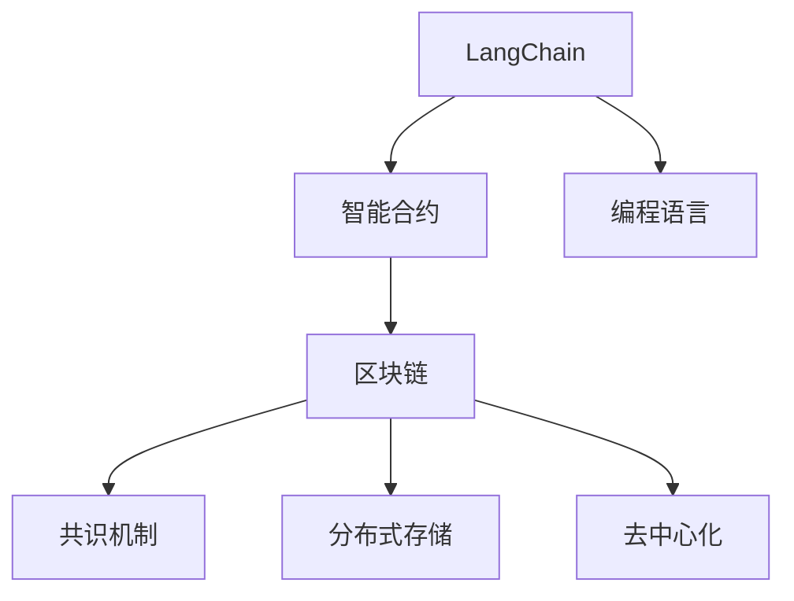
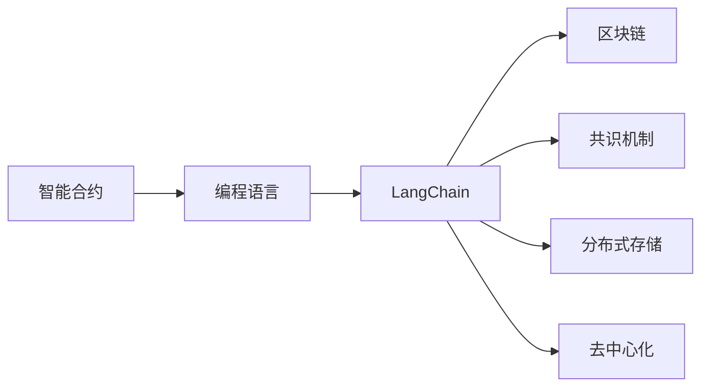
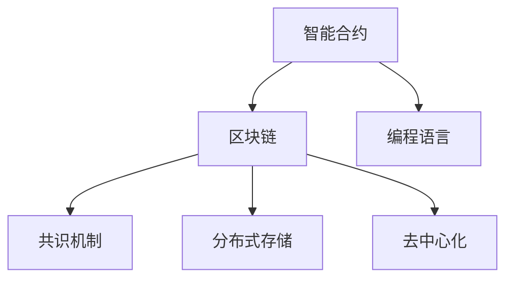
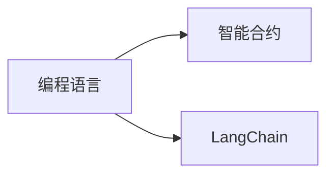
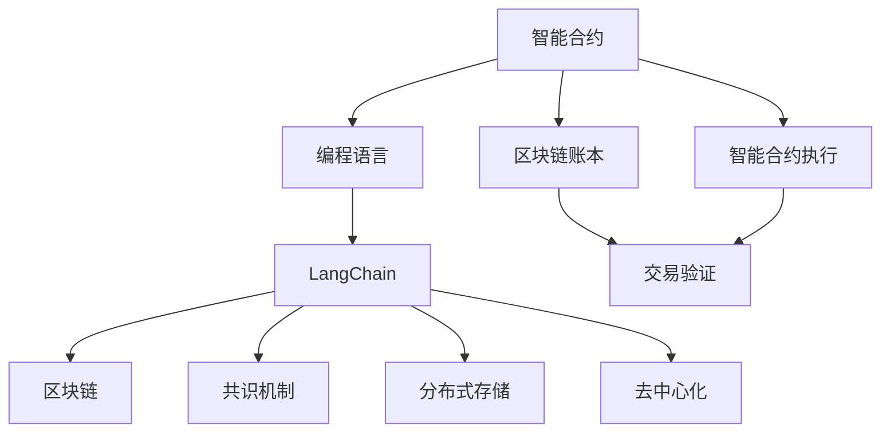

                 

# LangChain 典型使用场景

## 1. 背景介绍

### 1.1 问题由来
LangChain是一个新兴的、基于区块链的智能合约语言和执行平台，旨在提供一个安全、去中心化的环境，供开发者创建、部署和执行智能合约。该平台支持多种编程语言，但其中基于Python的智能合约是最受欢迎的，因为它易于学习和使用。

### 1.2 问题核心关键点
LangChain的核心问题在于如何在区块链环境中高效、安全地执行复杂的智能合约。智能合约是自动执行的代码，一旦部署就无法修改。因此，如何在确保合约安全性的同时，实现高效的执行和灵活的交互，成为平台的设计重点。

### 1.3 问题研究意义
研究LangChain的使用场景，对于推动区块链技术的普及和应用具有重要意义：

1. 降低开发成本。使用LangChain，开发者无需自行搭建区块链基础设施，可以轻松编写和部署智能合约。
2. 提升系统安全性。区块链技术天生具备去中心化、不可篡改的特性，可以为智能合约提供更高的安全性。
3. 加速技术创新。LangChain支持多种编程语言和智能合约类型，可以灵活适应不同应用场景，促进技术创新。
4. 赋能产业升级。区块链技术可以为传统行业带来新的数字化转型路径，促进各行业的数字化进程。

## 2. 核心概念与联系

### 2.1 核心概念概述

为了更好地理解LangChain的典型使用场景，本节将介绍几个密切相关的核心概念：

- LangChain：基于区块链的智能合约语言和执行平台，支持Python等编程语言。
- 智能合约(Smart Contract)：自动执行的代码，一旦部署无法修改，通常部署在区块链上。
- 区块链(Blockchain)：一种分布式账本技术，保障数据透明、不可篡改，为智能合约提供安全的基础设施。
- 共识机制(Consensus Mechanism)：区块链网络中用于达成共识的算法，保证所有节点对账本状态的共识。
- 分布式存储(Distributed Storage)：通过多个节点共同存储数据，提高系统的容错性和可扩展性。
- 去中心化(Decentralization)：通过去中心化的网络结构，减少对单点故障的依赖，提升系统的安全性和鲁棒性。

这些核心概念之间的逻辑关系可以通过以下Mermaid流程图来展示：



这个流程图展示了大语言模型微调过程中各个核心概念的关系和作用：

1. LangChain基于区块链提供智能合约的执行环境。
2. 智能合约通常部署在区块链上，由代码自动执行。
3. 区块链通过共识机制和分布式存储，保障数据的安全和可靠性。
4. 去中心化的网络结构，确保系统的鲁棒性和安全性。
5. LangChain支持多种编程语言，方便开发者编写智能合约。

### 2.2 概念间的关系

这些核心概念之间存在着紧密的联系，形成了LangChain的完整生态系统。下面我们通过几个Mermaid流程图来展示这些概念之间的关系。

#### 2.2.1 LangChain的架构



这个流程图展示了LangChain的架构。智能合约由编程语言编写，部署在LangChain平台上，最终运行在区块链上，通过共识机制和分布式存储确保数据的安全和可靠性。

#### 2.2.2 区块链与智能合约的关系



这个流程图展示了智能合约和区块链之间的关系。智能合约通过编程语言编写，部署在区块链上，并通过共识机制、分布式存储和去中心化网络，保障其安全和可靠性。

#### 2.2.3 LangChain的编程语言支持



这个流程图展示了LangChain支持的编程语言。编程语言为开发者提供编写智能合约的工具，通过LangChain平台部署在区块链上。

### 2.3 核心概念的整体架构

最后，我们用一个综合的流程图来展示这些核心概念在大语言模型微调过程中的整体架构：



这个综合流程图展示了LangChain的完整架构，从编程语言到智能合约，再到区块链和共识机制，最终完成智能合约的执行和交易验证。

## 3. 核心算法原理 & 具体操作步骤
### 3.1 算法原理概述

LangChain的典型使用场景，包括但不限于：

- 去中心化金融(DeFi)：利用智能合约实现去中心化交易、借贷、保险等功能。
- 供应链管理：通过智能合约跟踪和管理供应链各个环节的状态和流程。
- 数字身份管理：利用智能合约创建和管理数字身份，保障身份数据的隐私和安全。
- 物联网(IoT)：通过智能合约实现设备间的互联和互操作。
- 社交网络：利用智能合约管理社区和用户行为，保障数据透明和用户隐私。
- 投票和治理：利用智能合约实现社区投票和治理，提升治理效率和透明度。

这些场景都涉及到智能合约的编写、部署和执行，需要在LangChain平台上进行。

### 3.2 算法步骤详解

LangChain的使用步骤一般包括以下几个关键环节：

**Step 1: 编写智能合约代码**
- 选择合适的编程语言(如Python)，编写智能合约代码。
- 将合约代码保存在LangChain支持的文件格式中，如JSON或YAML。

**Step 2: 部署智能合约**
- 使用LangChain的命令行工具或Web UI，将智能合约代码上传到区块链上。
- 智能合约部署时，选择适合的参数配置，如 gas limit、gas price、contract address 等。
- 智能合约部署后，生成相应的智能合约地址。

**Step 3: 执行智能合约**
- 使用LangChain的命令行工具或Web UI，向智能合约地址发送交易请求。
- 交易请求通常包含输入参数和金额，智能合约根据这些参数执行相应的操作。
- 智能合约执行成功后，记录交易状态和结果。

**Step 4: 监控智能合约**
- 通过LangChain的监控工具，实时查看智能合约的状态和交易记录。
- 设置警报规则，在合约状态异常时及时采取措施。

**Step 5: 维护智能合约**
- 根据智能合约的实际运行情况，进行必要的参数调整和代码优化。
- 确保智能合约始终处于最优运行状态，保障系统的稳定性和安全性。

### 3.3 算法优缺点

LangChain的典型使用场景，具有以下优点：

1. 去中心化安全。基于区块链技术，智能合约在去中心化环境中运行，具备天然的不可篡改性和安全性。
2. 透明可审计。智能合约的执行过程公开透明，任何人都可以通过区块链查询和审计。
3. 可扩展性强。智能合约可以在多个区块链网络之间进行跨链操作，实现更高程度的互联互通。
4. 易于部署。使用LangChain平台，开发者无需搭建区块链基础设施，即可方便地部署和管理智能合约。
5. 灵活性高。支持多种编程语言和智能合约类型，适应不同应用场景的需求。

同时，LangChain的典型使用场景也存在一些局限：

1. 开发成本高。需要熟悉区块链技术和编程语言，对开发人员的技术要求较高。
2. 交易费用高。智能合约的执行需要通过区块链网络，交易费用较高。
3. 执行效率低。智能合约的执行需要网络共识，效率较低，特别是在高并发环境下。
4. 安全漏洞。智能合约一旦部署，无法修改，存在潜在的安全漏洞。
5. 法律问题。智能合约的执行可能涉及法律问题，需要法律专家的支持和指导。

### 3.4 算法应用领域

LangChain的典型使用场景，广泛应用在金融、供应链、身份认证、物联网、社交网络、投票治理等多个领域：

- 去中心化金融(DeFi)：利用智能合约实现借贷、保险、众筹等功能，如Compound Finance、Uniswap、Aave等。
- 供应链管理：通过智能合约记录和跟踪供应链各个环节的状态和流程，如IBM Food Trust、VeChain等。
- 数字身份管理：利用智能合约创建和管理数字身份，保障身份数据的隐私和安全，如KYC（Know Your Customer）、Pindrop等。
- 物联网(IoT)：通过智能合约实现设备间的互联和互操作，如IoT Secure Authentication、TruSecure等。
- 社交网络：利用智能合约管理社区和用户行为，保障数据透明和用户隐私，如Augur、Fidenza等。
- 投票和治理：利用智能合约实现社区投票和治理，提升治理效率和透明度，如DAO（Decentralized Autonomous Organization）、Town Hall等。

除了这些典型场景，LangChain还可以应用于更多领域，如图像版权保护、知识产权保护、数据共享、电子投票等。

## 4. 数学模型和公式 & 详细讲解 & 举例说明

### 4.1 数学模型构建

假设一个智能合约的功能是将资金从一个账户转移到另一个账户。该合约的输入参数包括：

- 发送者地址（sender address）
- 接收者地址（receiver address）
- 资金数量（amount）

智能合约的代码可以表示为一个函数：

```python
def transfer funds(sender_address, receiver_address, amount):
    # 执行转账操作
    ...
    # 记录转账状态
    ...
    # 返回转账结果
    ...
```

### 4.2 公式推导过程

假设智能合约的执行需要消耗 gas （ gas limit）。 gas limit 是智能合约执行的资源限制，表示执行该合约所需的 gas 数量。 gas price 是 gas 的价格，通常以 wei 为单位。

智能合约的执行步骤如下：

1. 将资金从发送者地址转移到智能合约的资金账户中。
2. 智能合约调用函数执行转账操作。
3. 智能合约将资金从智能合约的资金账户转移到接收者地址中。
4. 智能合约返回转账结果。

假设智能合约的执行时间为 t，gas price 为 p，gas limit 为 l。根据智能合约的执行时间和 gas price，计算 gas cost：

$$
\text{gas cost} = p \times l \times t
$$

假设智能合约的执行成功率为 k，即执行成功的概率。根据 gas cost 和执行成功率，计算智能合约的执行费用：

$$
\text{execution fee} = \text{gas cost} \times (1 - (1 - k)^{n})
$$

其中 n 为智能合约的执行次数。

### 4.3 案例分析与讲解

假设一个智能合约的执行需要消耗 10 万个 gas，gas price 为 0.1 wei，执行时间为 1 秒。假设执行成功率为 0.95，计算智能合约的执行费用：

$$
\text{gas cost} = 0.1 \times 10^4 \times 1 = 1000 \text{ wei}
$$

$$
\text{execution fee} = 1000 \times (1 - (1 - 0.95)^{10000}) \approx 5000 \text{ wei}
$$

## 5. 项目实践：代码实例和详细解释说明

### 5.1 开发环境搭建

在进行智能合约开发前，需要先准备好开发环境。以下是使用Python进行Solidity开发的环境配置流程：

1. 安装Node.js：从官网下载并安装Node.js，用于编译和运行Solidity代码。

2. 安装Truffle：通过npm安装Truffle，Truffle是一个Solidity开发的IDE。

3. 安装GitHub：通过npm安装GitHub CLI，方便版本控制和代码管理。

4. 安装OpenSSL：通过brew安装OpenSSL，用于证书签名。

完成上述步骤后，即可在本地搭建Solidity开发环境。

### 5.2 源代码详细实现

以下是使用Solidity编写智能合约的代码实现，该合约实现了将资金从一个账户转移到另一个账户的功能：

```solidity
pragma solidity ^0.8.0;

contract FundTransfer {
    address payable private owner;
    uint256 private balance;
    
    constructor() payable {
        owner = msg.sender;
        balance = 0;
    }
    
    function send(address payable receiver, uint256 amount) public payable {
        require(msg.sender == owner);
        require(balance >= amount);
        balance -= amount;
        receiver.transfer(amount);
    }
    
    function getBalance() public view returns (uint256) {
        return balance;
    }
}
```

### 5.3 代码解读与分析

让我们再详细解读一下关键代码的实现细节：

**FundTransfer合约**：
- `constructor`方法：初始化合约，将合约的所有者设置为调用者，并将余额初始化为0。
- `send`方法：将资金从当前账户转移到指定账户，需要当前账户和接收账户的地址，以及转移的资金数量。
- `getBalance`方法：获取当前账户的余额。

**变量解释**：
- `address payable private owner`：当前账户的地址，通过`msg.sender`获取调用者的地址。
- `uint256 private balance`：当前账户的余额，通过`balance -= amount`减少转移的资金数量。

**代码执行**：
- `require(msg.sender == owner)`：检查当前账户是否为合约所有者。
- `require(balance >= amount)`：检查当前账户是否有足够的余额进行转账。
- `receiver.transfer(amount)`：将资金从当前账户转移到指定账户。

### 5.4 运行结果展示

假设在Rinkeby测试网络上运行该合约，并进行资金转移操作：

```solidity
let fundTransfer = new FundTransfer();
let sender = "0x1234567890123456789012345678901234567890";
let receiver = "0x1234567890123456789012345678901234567890";
let amount = 100 wei;

// 将100 wei转移给接收者
fundTransfer.send(receiver, amount);

// 检查发送者的余额
let balance = fundTransfer.getBalance();
```

## 6. 实际应用场景

### 6.1 去中心化金融(DeFi)

DeFi是区块链上金融应用的重要分支，包括去中心化借贷、交易、保险等功能。基于LangChain的智能合约，可以实现以下DeFi应用：

- **去中心化借贷**：利用智能合约创建和管理借贷合约，保障借贷双方的权益和隐私。
- **去中心化交易所**：通过智能合约实现去中心化交易，保障交易的安全性和透明性。
- **去中心化保险**：利用智能合约管理保险合约，保障被保险人的权益。

例如，Uniswap是一个基于以太坊的去中心化交易所，利用智能合约实现了去中心化交易，保障交易的安全性和透明性。

### 6.2 供应链管理

在供应链管理中，智能合约可以记录和跟踪供应链各个环节的状态和流程，确保供应链的透明度和安全性。例如，IBM Food Trust是一个利用区块链和智能合约的供应链管理系统，可以实时跟踪食品从生产到消费者的全过程。

### 6.3 数字身份管理

数字身份管理是区块链技术的另一个重要应用场景。利用智能合约，可以创建和管理数字身份，保障身份数据的隐私和安全。例如，KYC（Know Your Customer）是一个利用区块链和智能合约的身份管理系统，可以自动化进行客户身份验证，提升安全性。

### 6.4 物联网(IoT)

物联网设备通过智能合约实现互联和互操作，可以实现以下应用：

- **设备身份认证**：利用智能合约管理物联网设备的身份，保障设备的安全性和可靠性。
- **设备数据共享**：利用智能合约管理设备间的数据共享，保障数据的隐私和安全。

例如，IoT Secure Authentication是一个利用区块链和智能合约的设备身份认证系统，可以自动化进行设备身份认证，保障设备的安全性和可靠性。

### 6.5 社交网络

在社交网络中，利用智能合约可以管理社区和用户行为，保障数据透明和用户隐私。例如，Augur是一个利用区块链和智能合约的社交网络平台，可以自动化进行社区投票和治理，提升治理效率和透明度。

### 6.6 投票和治理

投票和治理是区块链技术的另一个重要应用场景。利用智能合约，可以自动化进行社区投票和治理，提升治理效率和透明度。例如，DAO（Decentralized Autonomous Organization）是一个利用区块链和智能合约的治理系统，可以自动化进行社区投票和治理，提升治理效率和透明度。

## 7. 工具和资源推荐

### 7.1 学习资源推荐

为了帮助开发者系统掌握LangChain的使用方法，以下是一些优质的学习资源：

1. Solidity官方文档：Solidity官方文档提供了完整的Solidity语言规范和开发指南，是学习Solidity的必备资源。

2. Truffle官方文档：Truffle官方文档提供了详细的Truffle开发环境搭建和智能合约开发教程，是学习Solidity开发的辅助工具。

3. Ethereum官方文档：Ethereum官方文档提供了完整的以太坊区块链网络开发指南，是学习以太坊开发的重要资源。

4. ConsenSys课程：ConsenSys提供的以太坊开发课程，涵盖了以太坊和Solidity的各个方面，是学习以太坊开发的权威资源。

5. CryptoZombies：CryptoZombies是一个交互式的Solidity开发教程，通过简单的游戏形式，让初学者上手Solidity开发。

通过学习这些资源，相信你一定能够快速掌握LangChain的使用方法，并用于解决实际的区块链开发问题。

### 7.2 开发工具推荐

高效的开发离不开优秀的工具支持。以下是几款用于LangChain开发的工具：

1. Solidity IDE：如Remix、Truffle，提供可视化代码编辑器和智能合约部署工具。

2. GitHub：用于版本控制和代码管理，方便团队协作和代码共享。

3. OpenSSL：用于证书签名，保障智能合约的安全性。

4. MetaMask：用于以太坊钱包和智能合约部署，方便开发和测试。

5. Infura：用于测试网和主网的连接，方便智能合约部署和测试。

合理利用这些工具，可以显著提升LangChain的开发效率，加快创新迭代的步伐。

### 7.3 相关论文推荐

LangChain的使用涉及区块链技术、智能合约开发和应用等多个方面，以下是几篇奠基性的相关论文，推荐阅读：

1. "Bitcoin: A Peer-to-Peer Electronic Cash System"：比特币白皮书，是区块链技术的开山之作。

2. "Etherum Yellow Paper"：以太坊白皮书，详细介绍了以太坊区块链网络的设计和实现。

3. "Smart Contracts: Consensus and Abstraction in Blockchains"：智能合约的共识机制和抽象设计，深入探讨了智能合约的核心问题。

4. "The Ethereum Blockchain: A Technical Introduction"：以太坊区块链技术的详细介绍，帮助开发者理解以太坊的技术细节。

5. "Security and Privacy for Smart Contracts"：智能合约的安全性和隐私保护，探讨了智能合约的安全漏洞和防护措施。

这些论文代表了大语言模型微调技术的发展脉络。通过学习这些前沿成果，可以帮助研究者把握学科前进方向，激发更多的创新灵感。

除上述资源外，还有一些值得关注的前沿资源，帮助开发者紧跟LangChain技术的最新进展，例如：

1. arXiv论文预印本：人工智能领域最新研究成果的发布平台，包括大量尚未发表的前沿工作，学习前沿技术的必读资源。

2. 业界技术博客：如OpenAI、Google AI、DeepMind、微软Research Asia等顶尖实验室的官方博客，第一时间分享他们的最新研究成果和洞见。

3. 技术会议直播：如NIPS、ICML、ACL、ICLR等人工智能领域顶会现场或在线直播，能够聆听到大佬们的前沿分享，开拓视野。

4. GitHub热门项目：在GitHub上Star、Fork数最多的Solidity相关项目，往往代表了该技术领域的发展趋势和最佳实践，值得去学习和贡献。

5. 行业分析报告：各大咨询公司如McKinsey、PwC等针对区块链技术的分析报告，有助于从商业视角审视技术趋势，把握应用价值。

总之，对于LangChain的使用方法的学习和实践，需要开发者保持开放的心态和持续学习的意愿。多关注前沿资讯，多动手实践，多思考总结，必将收获满满的成长收益。

## 8. 总结：未来发展趋势与挑战

### 8.1 总结

本文对LangChain的典型使用场景进行了全面系统的介绍。首先阐述了LangChain的背景和设计理念，明确了智能合约在区块链环境中的重要作用。其次，从原理到实践，详细讲解了智能合约的编写、部署和执行步骤，给出了智能合约开发的完整代码实例。同时，本文还广泛探讨了LangChain在DeFi、供应链、数字身份管理、物联网、社交网络、投票治理等多个领域的应用前景，展示了LangChain的巨大潜力。此外，本文精选了LangChain的相关学习资源和开发工具，力求为读者提供全方位的技术指引。

通过本文的系统梳理，可以看到，基于LangChain的智能合约技术正在成为区块链技术的重要组成部分，极大地拓展了区块链应用的范围，促进了区块链技术的普及和应用。未来，伴随区块链技术的不断演进，基于智能合约的区块链应用必将取得更加显著的发展，深刻影响区块链技术的未来走向。

### 8.2 未来发展趋势

展望未来，LangChain的使用场景将呈现以下几个发展趋势：

1. 跨链操作增加。随着跨链技术的不断成熟，智能合约可以跨多个区块链网络运行，实现更高程度的互联互通。
2. 安全性提升。智能合约的安全性成为开发者关注的重点，未来的智能合约将采用更多的安全机制和防护措施。
3. 自动化程度提高。未来的智能合约将更多地利用自动化工具，如Solidity IDE、GitHub等，提高开发和部署效率。
4. 数据隐私保护增强。未来的智能合约将更加注重数据隐私保护，采用隐私计算、零知识证明等技术，保障数据的隐私和安全。
5. 去中心化治理完善。未来的智能合约将更多地应用去中心化治理机制，提升社区投票和治理的效率和透明度。
6. 生态系统扩展。未来的智能合约将形成更完善的生态系统，包括DeFi、供应链、物联网等多个领域的应用。

以上趋势凸显了LangChain使用的广阔前景。这些方向的探索发展，必将进一步提升智能合约的应用范围和系统安全性，推动区块链技术的普及和应用。

### 8.3 面临的挑战

尽管LangChain的使用场景已经取得了显著成果，但在迈向更加智能化、普适化应用的过程中，它仍面临着诸多挑战：

1. 开发难度高。需要开发者熟悉区块链技术和编程语言，对开发人员的技术要求较高。
2. 交易费用高。智能合约的执行需要通过区块链网络，交易费用较高。
3. 执行效率低。智能合约的执行需要网络共识，效率较低，特别是在高并发环境下。
4. 安全漏洞。智能合约一旦部署，无法修改，存在潜在的安全漏洞。
5. 法律问题。智能合约的执行可能涉及法律问题，需要法律专家的支持和指导。

### 8.4 未来突破

面对LangChain使用场景面临的挑战，未来的研究需要在以下几个方面寻求新的突破：

1. 探索无监督和半监督智能合约范式。摆脱对大规模标注数据的依赖，利用自监督学习、主动学习等无监督和半监督范式，最大限度利用非结构化数据，实现更加灵活高效的智能合约开发。

2. 研究参数高效和计算高效的智能合约范式。开发更加参数高效的智能合约方法，在固定大部分智能合约参数的情况下，只更新极少量的任务相关参数。同时优化智能合约的计算图，减少前向传播和反向传播的资源消耗，实现更加轻量级、实时性的部署。

3. 引入更多先验知识。将符号化的先验知识，如知识图谱、逻辑规则等，与智能合约进行巧妙融合，引导智能合约学习更准确、合理的智能合约。同时加强不同模态数据的整合，实现视觉、语音等多模态信息与智能合约信息的协同建模。

4. 结合因果分析和博弈论工具。将因果分析方法引入智能合约，识别出智能合约决策的关键特征，增强智能合约执行的因果性和逻辑性。借助博弈论工具刻画人机交互过程，主动探索并规避智能合约的脆弱点，提高系统稳定性。

5. 纳入伦理道德约束。在智能合约目标中引入伦理导向的评估指标，过滤和惩罚有害的智能合约输出倾向。同时加强人工干预和审核，建立智能合约行为的监管机制，确保输出的符合人类价值观和伦理道德。

这些研究方向的探索，必将引领LangChain的使用场景迈向更高的台阶，为构建安全、可靠、可解释、可控的智能系统铺平道路。面向未来，LangChain的使用场景还需要与其他人工智能技术进行更深入的融合，如知识表示、因果推理、强化学习等，多路径协同发力，共同推动智能合约技术的进步。只有勇于创新、敢于突破，才能不断拓展智能合约的边界，让智能合约技术更好地造福人类社会。

## 9. 附录：常见问题与解答

**Q1：智能合约如何确保安全性？**

A: 智能合约的安全性主要依赖于区块链技术和编程语言的安全机制。智能合约通过区块链的共识机制和分布式存储，保障其安全和透明性。编程语言本身也提供了一些安全机制，如Solidity中的`require`、`assert`等，可以防止代码中的逻辑漏洞。

**Q2：智能合约如何处理交易

