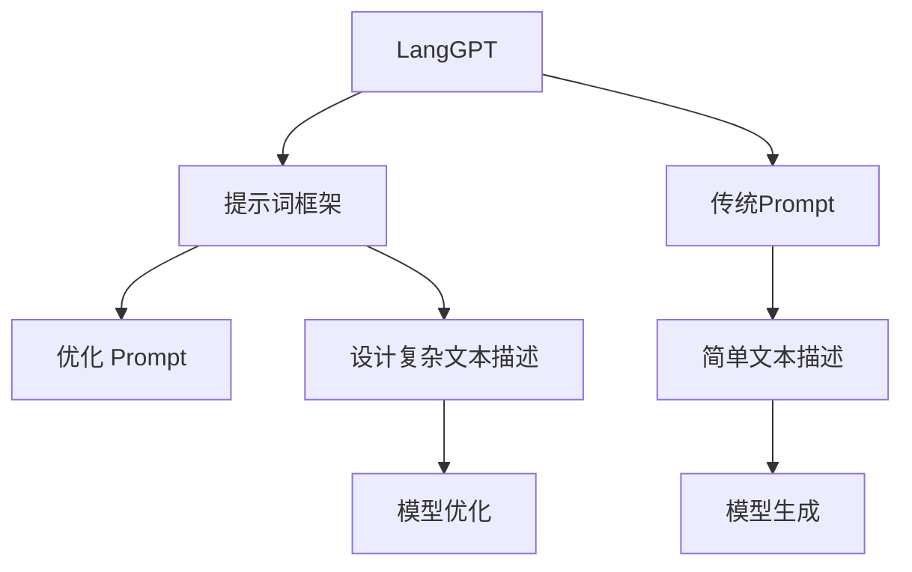

                 

# LangGPT 提示词框架与传统 Prompt 的对比

## 1. 背景介绍

随着预训练大语言模型的不断发展和应用，提示词(Prompt)技术成为了微调过程中不可或缺的一环。通过精心设计提示词，可以在不更新模型参数的情况下，提高模型生成、分类、推理等任务的性能。本文将重点探讨LangGPT提示词框架与传统Prompt的异同，分析其原理、优势及应用，并为开发者提供实用的设计建议和代码实现。

## 2. 核心概念与联系

### 2.1 核心概念概述

- **LangGPT**：一种基于Transformer架构的预训练语言模型，主要用于文本生成、文本分类、问答、机器翻译等任务。其核心在于通过预训练学习到丰富的语言表示，然后通过微调或提示词来适应特定的下游任务。

- **传统Prompt**：一种简单的提示词格式，直接将任务描述和目标标签插入模型的输入，引导模型输出特定结果。传统Prompt简单明了，但需要手动设计和调试，且效果受输入文本的影响较大。

- **Prompt Learning**：通过设计提示词来优化模型，使其在特定任务上表现更佳。Prompt Learning可以提升模型的泛化能力和鲁棒性，尤其是在少样本、零样本等场景下具有显著优势。

- **Prompt Tuning**：对提示词进行微调，寻找最优的 Prompt 格式，以获得更好的任务表现。Prompt Tuning通常需要额外标注数据，但能够进一步提升Prompt的性能。

- **Tokenizer**：用于将文本转换为模型可以处理的形式（如tokens）的工具。Tokenizer的性能和准确性直接影响提示词框架的实现效果。

### 2.2 概念间的关系

提示词框架和传统Prompt之间的联系与区别可以通过以下Mermaid流程图展示：



- **A** 表示LangGPT预训练模型。
- **B** 表示LangGPT提示词框架。
- **C** 表示传统Prompt。
- **D** 表示Prompt Tuning过程。
- **E** 表示传统Prompt中的简单文本描述。
- **F** 表示通过简单文本描述生成模型输出。
- **G** 表示LangGPT提示词框架中的复杂文本描述。
- **H** 表示通过复杂文本描述优化模型输出。

从图中可以看出，LangGPT提示词框架相较于传统Prompt，通过更复杂的文本描述设计，可以更好地引导模型输出，并且能够通过Prompt Tuning进一步优化。

## 3. 核心算法原理 & 具体操作步骤

### 3.1 算法原理概述

LangGPT提示词框架的核心思想是通过设计特定的提示词，增强模型对输入文本的理解和生成能力。其原理可以总结为以下几点：

1. **语义嵌入增强**：通过在提示词中嵌入特定的语义信息，帮助模型更好地理解输入文本的含义。
2. **结构引导**：提示词中包含任务结构和步骤，引导模型按照指定的逻辑进行推理和生成。
3. **知识融合**：提示词可以整合外部知识库或规则库的信息，增强模型的知识储备和推理能力。

### 3.2 算法步骤详解

LangGPT提示词框架的实现步骤如下：

1. **数据准备**：收集与目标任务相关的标注数据，进行数据清洗和预处理。
2. **提示词设计**：根据任务特性，设计符合任务需求的提示词。提示词通常包含任务描述、输入文本格式、输出格式等信息。
3. **模型微调**：在预训练模型上应用提示词，通过微调来适应特定的下游任务。微调过程包括模型训练、评估和调整。
4. **Prompt Tuning**：对提示词进行优化，通过搜索或优化算法找到最佳的Prompt格式。

### 3.3 算法优缺点

**优点**：
- **灵活性**：提示词框架可以根据任务需求灵活设计，提升模型在特定任务上的性能。
- **可解释性**：提示词设计可以提供任务说明，增加模型的可解释性。
- **泛化能力**：通过提示词优化，模型可以更好地适应少样本、零样本等场景，提高泛化能力。

**缺点**：
- **复杂性**：提示词设计需要一定的经验和技巧，需要不断迭代优化。
- **计算资源消耗**：提示词框架通常需要更多的计算资源，特别是Prompt Tuning过程。
- **依赖提示词质量**：提示词设计的好坏直接影响模型性能，需要不断优化。

### 3.4 算法应用领域

LangGPT提示词框架适用于各类NLP任务，包括但不限于：

- **文本生成**：如诗歌生成、故事创作、对话生成等。
- **文本分类**：如情感分析、主题分类等。
- **问答系统**：如自动问答、知识图谱查询等。
- **机器翻译**：如双语翻译、多语言翻译等。

## 4. 数学模型和公式 & 详细讲解 & 举例说明

### 4.1 数学模型构建

LangGPT提示词框架的数学模型构建可以分为两个部分：提示词设计和模型微调。

1. **提示词设计**：假设提示词包含$m$个字符，其中$x_1,...,x_m$为字符序列，$p$为字符概率分布。则提示词可以表示为：
   $$
   P(w) = \prod_{i=1}^m p(x_i)
   $$

2. **模型微调**：假设模型在预训练后的参数为$\theta$，在提示词框架下微调后的参数为$\hat{\theta}$。微调目标为最小化损失函数$\mathcal{L}(\hat{\theta})$，即：
   $$
   \hat{\theta} = \mathop{\arg\min}_{\theta} \mathcal{L}(\hat{\theta})
   $$

### 4.2 公式推导过程

以文本生成任务为例，假设模型输入为$x$，提示词为$w$，输出为$y$。则条件概率$p(y|x,w)$可以通过softmax函数计算：
$$
p(y|x,w) = \frac{e^{\log p(y|x,\hat{\theta})}}{\sum_{y'} e^{\log p(y'|x,\hat{\theta})}}
$$

其中$\log p(y|x,\hat{\theta})$为模型对输出$y$的预测概率，通过前向传播计算得到。

### 4.3 案例分析与讲解

以机器翻译任务为例，假设输入为英文句子$x$，输出为对应的法文句子$y$。提示词$w$可以包含任务描述和输入格式，例如：
$$
w = "translate English to French: "
$$

模型在提示词框架下进行微调，通过前向传播计算输出概率，并通过反向传播更新模型参数，最终得到翻译结果。

## 5. 项目实践：代码实例和详细解释说明

### 5.1 开发环境搭建

LangGPT提示词框架的实现需要使用Python和PyTorch等工具。以下是在PyTorch环境下搭建开发环境的步骤：

1. **安装PyTorch**：
   ```
   pip install torch torchtext transformers
   ```

2. **安装Tokenizer**：
   ```
   pip install transformers
   ```

3. **安装相关数据集**：
   ```
   python -m torchtext.vocab.build_vocab --train path/to/train.txt --save path/to/vocab.pt
   ```

### 5.2 源代码详细实现

以下是一个简单的文本生成示例代码：

```python
import torch
from transformers import GPT2Tokenizer, GPT2LMHeadModel
from transformers import AdamW

# 加载预训练模型和Tokenizer
tokenizer = GPT2Tokenizer.from_pretrained('gpt2')
model = GPT2LMHeadModel.from_pretrained('gpt2')

# 设置优化器和学习率
optimizer = AdamW(model.parameters(), lr=2e-5)

# 定义提示词
prompt = "This is a beautiful day."

# 将提示词转换为token ids
input_ids = tokenizer(prompt, return_tensors='pt').input_ids

# 模型前向传播计算输出概率
outputs = model(input_ids)

# 取softmax输出作为下一个词的概率分布
probs = torch.softmax(outputs.logits, dim=-1)

# 选择概率最大的词作为下一个词
next_token = torch.argmax(probs, dim=-1).item()
next_word = tokenizer.decode([next_token])[0]

# 生成下一个词，并继续进行
generated_text = next_token + next_word
input_ids = input_ids.clone()
input_ids[0, -1] = next_token
```

### 5.3 代码解读与分析

1. **Tokenizer的使用**：将提示词转换为模型可以处理的token ids。
2. **模型前向传播**：通过提示词引导模型生成下一个词。
3. **输出概率计算**：计算下一个词的概率分布。
4. **生成下一个词**：选择概率最大的词作为下一个词。
5. **继续生成**：将生成的词作为新的输入，继续进行生成。

### 5.4 运行结果展示

通过上述代码，可以得到提示词框架下的文本生成结果。例如，假设提示词为“This is a beautiful day”，生成的文本可能为“I love sunny days”。

## 6. 实际应用场景

LangGPT提示词框架在实际应用中具有广泛的应用场景，例如：

1. **智能客服**：在智能客服系统中，使用提示词框架可以生成自然流畅的对话回复，提升用户体验。
2. **金融分析**：在金融数据分析中，提示词框架可以生成简洁的报告摘要，帮助分析师快速理解数据。
3. **医疗咨询**：在医疗咨询中，提示词框架可以生成简洁明了的病情描述，帮助医生更快地了解患者情况。

## 7. 工具和资源推荐

### 7.1 学习资源推荐

1. **《Transformers从原理到实践》系列博文**：介绍LangGPT框架的原理和实践技巧。
2. **《NLP精粹》课程**：涵盖NLP基础和先进技术，包括Prompt Learning和LangGPT框架。
3. **《自然语言处理》书籍**：介绍自然语言处理的基本原理和LangGPT框架的应用。
4. **HuggingFace官方文档**：提供LangGPT框架的详细使用方法和示例。
5. **arXiv预印本**：提供最新的自然语言处理研究成果，包括LangGPT框架的新进展。

### 7.2 开发工具推荐

1. **PyTorch**：灵活的深度学习框架，适合进行LangGPT框架的开发。
2. **TensorBoard**：可视化工具，用于监控和调试模型训练过程。
3. **Jupyter Notebook**：交互式开发环境，方便代码调试和结果展示。

### 7.3 相关论文推荐

1. **“Language Model as a Predictor of Language Usage”**：介绍Prompt Learning的基本原理和方法。
2. **“The Long-Term Evolution of Transformers”**：分析Transformer架构的发展和应用。
3. **“Fine-tune GPT-2 with langid to predict language ID”**：介绍LangGPT框架在语言识别任务中的应用。
4. **“Natural Language Processing in PyTorch”**：介绍自然语言处理的基本框架和方法，包括LangGPT框架的实现。

## 8. 总结：未来发展趋势与挑战

### 8.1 研究成果总结

LangGPT提示词框架在自然语言处理领域取得了显著进展，提高了模型的生成、分类、推理等性能。提示词框架和传统Prompt的结合，增强了模型的灵活性和可解释性，适用于各类NLP任务。

### 8.2 未来发展趋势

未来，LangGPT提示词框架将进一步拓展应用领域，与其他AI技术进行深度融合，例如知识图谱、因果推理等。同时，将更加注重模型的可解释性和安全性，确保应用场景中的鲁棒性和可靠性。

### 8.3 面临的挑战

尽管LangGPT提示词框架取得了一定进展，但仍面临以下挑战：

1. **提示词设计复杂性**：提示词设计需要大量的经验和技巧，需要不断迭代优化。
2. **计算资源消耗**：提示词框架通常需要更多的计算资源，特别是Prompt Tuning过程。
3. **提示词质量依赖**：提示词设计的好坏直接影响模型性能，需要不断优化。

### 8.4 研究展望

未来，LangGPT提示词框架的研究方向包括：

1. **自动设计提示词**：开发自动提示词生成工具，减少人工设计的复杂性。
2. **混合Prompt**：结合传统Prompt和LangGPT框架，提升模型的泛化能力和鲁棒性。
3. **Prompt Tuning优化**：改进Prompt Tuning算法，提高提示词设计的效率和质量。

## 9. 附录：常见问题与解答

**Q1：提示词框架和传统Prompt有什么不同？**

A: LangGPT提示词框架相较于传统Prompt，通过更复杂的文本描述设计，可以更好地引导模型输出，并且能够通过Prompt Tuning进一步优化。

**Q2：如何设计高效的提示词？**

A: 设计高效的提示词需要考虑以下几个因素：
1. 任务需求：明确任务目标，设计符合任务需求的提示词。
2. 任务结构：在提示词中包含任务结构和步骤，引导模型按照指定的逻辑进行推理和生成。
3. 知识融合：提示词可以整合外部知识库或规则库的信息，增强模型的知识储备和推理能力。
4. 提示词优化：通过Prompt Tuning，寻找最佳的Prompt格式。

**Q3：提示词框架在实际应用中需要注意哪些问题？**

A: 提示词框架在实际应用中需要注意以下几个问题：
1. 提示词设计复杂性：提示词设计需要大量的经验和技巧，需要不断迭代优化。
2. 计算资源消耗：提示词框架通常需要更多的计算资源，特别是Prompt Tuning过程。
3. 提示词质量依赖：提示词设计的好坏直接影响模型性能，需要不断优化。

---

作者：禅与计算机程序设计艺术 / Zen and the Art of Computer Programming

