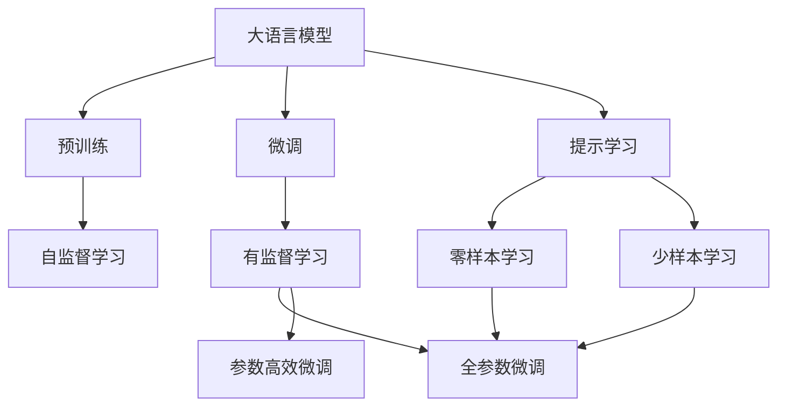
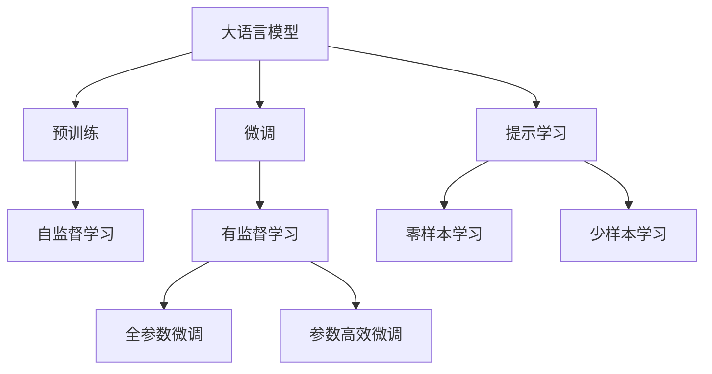
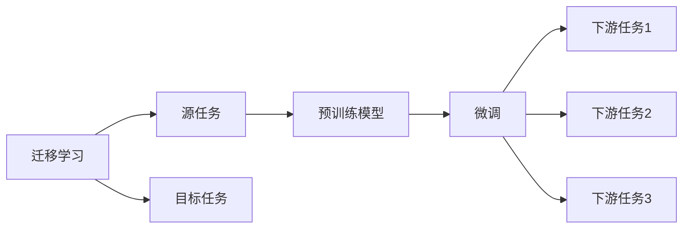
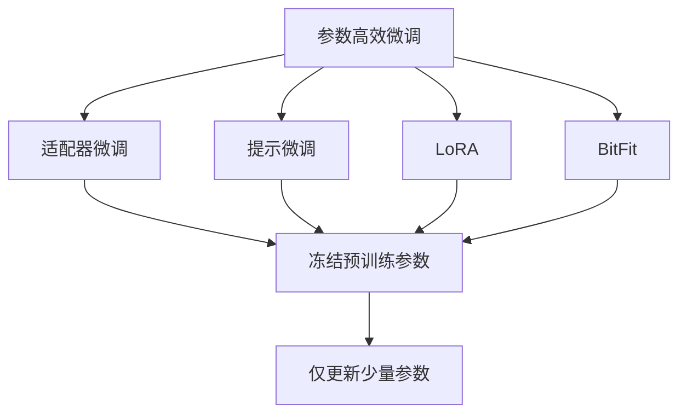
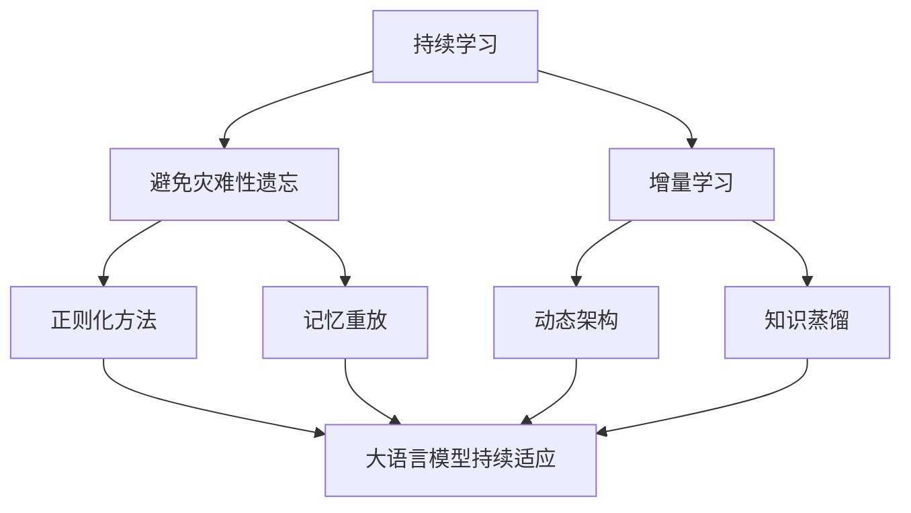
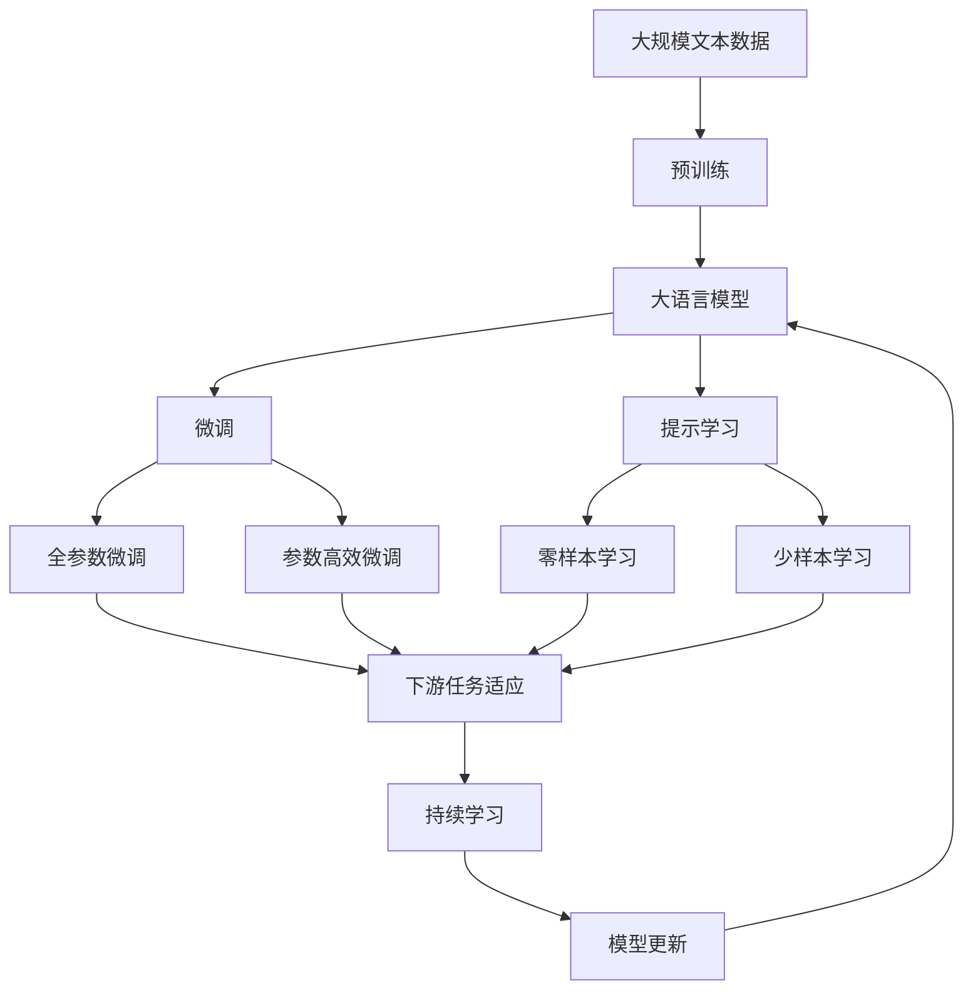
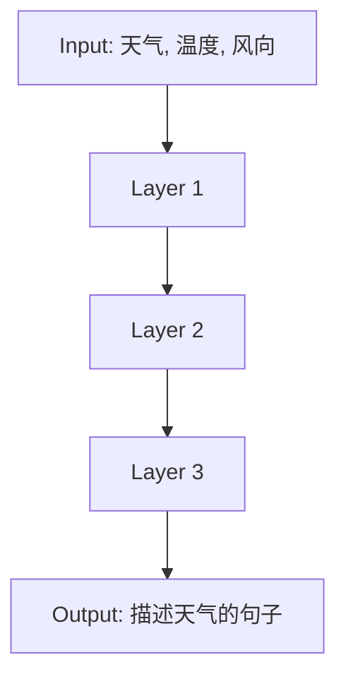

                 

# LangGPT框架与传统Prompt的区别

## 1. 背景介绍

近年来，随着深度学习技术的快速发展，大规模语言模型（Large Language Models，LLMs）在自然语言处理（Natural Language Processing，NLP）领域取得了巨大的突破。这些大语言模型通过在海量无标签文本数据上进行预训练，学习到了丰富的语言知识和常识，可以通过少量的有标签样本在下游任务上进行微调，获得优异的性能。其中最具代表性的大语言模型包括OpenAI的GPT系列模型、Google的BERT、T5等。

然而，由于预训练语料的广泛性和泛化能力的不足，这些通用的大语言模型在特定领域应用时，效果往往难以达到实际应用的要求。因此，如何针对特定任务进行大模型微调，提升模型性能，成为了当前大语言模型研究和应用的一个热点问题。本文聚焦于LangGPT框架与传统Prompt之间的区别，详细探讨了这些差異如何影响模型在实际应用中的表现，并为开发者提供了更深入的理解和应用建议。

## 2. 核心概念与联系

### 2.1 核心概念概述

为更好地理解LangGPT框架与传统Prompt之间的区别，本节将介绍几个密切相关的核心概念：

- **大语言模型（LLMs）**：以自回归（如GPT）或自编码（如BERT）模型为代表的大规模预训练语言模型。通过在大规模无标签文本语料上进行预训练，学习通用的语言表示，具备强大的语言理解和生成能力。

- **预训练（Pre-training）**：指在大规模无标签文本语料上，通过自监督学习任务训练通用语言模型的过程。常见的预训练任务包括言语建模、遮挡语言模型等。预训练使得模型学习到语言的通用表示。

- **微调（Fine-tuning）**：指在预训练模型的基础上，使用下游任务的少量标注数据，通过有监督地训练来优化模型在特定任务上的性能。通常只需要调整顶层分类器或解码器，并以较小的学习率更新全部或部分的模型参数。

- **Prompt（提示）**：一种特殊的文本格式，用于引导语言模型进行特定任务的推理和生成。通常通过精心设计提示模板（Prompt Template），以最小化微调参数。

- **参数高效微调（PEFT）**：指在微调过程中，只更新少量的模型参数，而固定大部分预训练权重不变，以提高微调效率，避免过拟合的方法。

- **少样本学习（Few-shot Learning）**：指在只有少量标注样本的情况下，模型能够快速适应新任务的学习方法。在大语言模型中，通常通过在输入中提供少量示例来实现，无需更新模型参数。

- **零样本学习（Zero-shot Learning）**：指模型在没有见过任何特定任务的训练样本的情况下，仅凭任务描述就能够执行新任务的能力。大语言模型通过预训练获得的广泛知识，使其能够理解任务指令并生成相应输出。

- **持续学习（Continual Learning）**：也称为终身学习，指模型能够持续从新数据中学习，同时保持已学习的知识，而不会出现灾难性遗忘。这对于保持大语言模型的时效性和适应性至关重要。

这些核心概念之间的逻辑关系可以通过以下Mermaid流程图来展示：



这个流程图展示了大语言模型的核心概念及其之间的关系：

1. 大语言模型通过预训练获得基础能力。
2. 微调是对预训练模型进行任务特定的优化，可以分为全参数微调和参数高效微调（PEFT）。
3. 提示学习是一种不更新模型参数的方法，可以实现零样本和少样本学习。
4. 迁移学习是连接预训练模型与下游任务的桥梁，可以通过微调或提示学习来实现。
5. 持续学习旨在使模型能够不断学习新知识，同时避免遗忘旧知识。

这些概念共同构成了大语言模型的学习和应用框架，使其能够在各种场景下发挥强大的语言理解和生成能力。通过理解这些核心概念，我们可以更好地把握大语言模型的工作原理和优化方向。

### 2.2 概念间的关系

这些核心概念之间存在着紧密的联系，形成了大语言模型的完整生态系统。下面我通过几个Mermaid流程图来展示这些概念之间的关系。

#### 2.2.1 大语言模型的学习范式



这个流程图展示了大语言模型的三种主要学习范式：预训练、微调和提示学习。预训练主要采用自监督学习方法，而微调则是有监督学习的过程。提示学习可以实现零样本和少样本学习。微调又可以分为全参数微调和参数高效微调两种方式。

#### 2.2.2 迁移学习与微调的关系



这个流程图展示了迁移学习的基本原理，以及它与微调的关系。迁移学习涉及源任务和目标任务，预训练模型在源任务上学习，然后通过微调适应各种下游任务（目标任务）。

#### 2.2.3 参数高效微调方法



这个流程图展示了几种常见的参数高效微调方法，包括适配器微调、提示微调、LoRA和BitFit。这些方法的共同特点是冻结大部分预训练参数，只更新少量参数，从而提高微调效率。

#### 2.2.4 持续学习在大语言模型中的应用



这个流程图展示了持续学习在大语言模型中的应用。持续学习的主要目标是避免灾难性遗忘和实现增量学习。通过正则化方法、记忆重放、动态架构和知识蒸馏等技术，可以使大语言模型持续适应新的任务和数据。

### 2.3 核心概念的整体架构

最后，我们用一个综合的流程图来展示这些核心概念在大语言模型微调过程中的整体架构：



这个综合流程图展示了从预训练到微调，再到持续学习的完整过程。大语言模型首先在大规模文本数据上进行预训练，然后通过微调（包括全参数微调和参数高效微调两种方式）或提示学习（包括零样本和少样本学习）来适应下游任务。最后，通过持续学习技术，模型可以不断更新和适应新的任务和数据。 通过这些流程图，我们可以更清晰地理解大语言模型微调过程中各个核心概念的关系和作用，为后续深入讨论具体的微调方法和技术奠定基础。

## 3. LangGPT框架与传统Prompt的区别

### 3.1 算法原理概述

LangGPT框架是一种基于自回归模型的语言生成框架，通过在大规模文本数据上进行预训练，学习到通用的语言表示。而传统Prompt则是一种基于自编码模型的语言生成方法，通过在输入文本中添加特定的提示信息，引导模型生成符合任务需求的输出。

#### 3.1.1 预训练原理

LangGPT框架和传统Prompt都采用了自回归或自编码的预训练策略。LangGPT框架通常采用自回归方式，通过前向传播计算每个词的条件概率，再通过反向传播更新模型参数。而传统Prompt则通常采用自编码方式，通过构造掩码（Mask）和预测下一词的方式进行预训练。

#### 3.1.2 微调原理

LangGPT框架和传统Prompt在微调原理上也略有不同。LangGPT框架通常会保留部分预训练的权重不变，仅微调顶层分类器或解码器，以提高微调效率和避免过拟合。而传统Prompt则更侧重于通过提示信息（Prompt）引导模型进行特定任务的推理和生成，往往需要调整较多的模型参数，以获得更精确的输出。

#### 3.1.3 参数优化

LangGPT框架和传统Prompt在参数优化上也存在差异。LangGPT框架通常使用基于梯度的优化算法（如AdamW、SGD等），设置合适的学习率、批大小和迭代轮数等超参数，以最小化经验风险。而传统Prompt则更依赖于精心设计的提示模板，通过优化损失函数来实现任务目标。

### 3.2 算法步骤详解

#### 3.2.1 LangGPT框架的微调步骤

1. **准备数据集**：选择下游任务的数据集，划分为训练集、验证集和测试集。
2. **设置超参数**：选择合适的优化器及其参数，如AdamW、SGD等，设置学习率、批大小、迭代轮数等。
3. **构建模型**：加载预训练的LangGPT框架，并根据任务类型设计合适的输出层和损失函数。
4. **执行训练**：将训练集数据分批次输入模型，前向传播计算损失函数。反向传播计算参数梯度，根据设定的优化算法和学习率更新模型参数。
5. **评估模型**：在验证集和测试集上评估模型性能，对比微调前后的精度提升。
6. **部署应用**：使用微调后的模型对新样本进行推理预测，集成到实际的应用系统中。

#### 3.2.2 传统Prompt的微调步骤

1. **准备数据集**：选择下游任务的数据集，划分为训练集、验证集和测试集。
2. **设计提示**：设计适当的提示模板（Prompt Template），确保模型能够理解任务指令。
3. **设置超参数**：选择合适的优化器及其参数，如AdamW、SGD等，设置学习率、批大小、迭代轮数等。
4. **执行训练**：将提示信息添加到输入文本中，前向传播计算损失函数。反向传播计算参数梯度，根据设定的优化算法和学习率更新模型参数。
5. **评估模型**：在验证集和测试集上评估模型性能，对比微调前后的精度提升。
6. **部署应用**：使用微调后的模型对新样本进行推理预测，集成到实际的应用系统中。

### 3.3 算法优缺点

LangGPT框架与传统Prompt各有优缺点，具体如下：

#### 3.3.1 LangGPT框架的优缺点

**优点**：
1. 参数高效。LangGPT框架可以通过参数高效微调技术，只更新少量的模型参数，而固定大部分预训练权重不变，从而提高微调效率。
2. 泛化能力强。由于保留了大部分预训练权重，LangGPT框架能够更好地利用预训练知识，提升模型在特定任务上的泛化能力。
3. 可解释性强。LangGPT框架的微调过程可以通过可视化工具进行追踪，了解模型在微调过程中学习到的特征，提供更强的可解释性。

**缺点**：
1. 依赖标注数据。微调过程中，LangGPT框架仍然需要较多的标注数据进行训练，标注成本较高。
2. 鲁棒性有待提高。虽然参数高效微调可以提升模型效率，但在面对噪声数据或极端样本时，模型的鲁棒性仍需进一步加强。

#### 3.3.2 传统Prompt的优缺点

**优点**：
1. 适应性强。传统Prompt通过精心设计的提示信息，能够适应不同的任务和数据分布，灵活性较高。
2. 模型表现优异。由于提示信息具有引导作用，传统Prompt能够在少样本学习、零样本学习等情况下取得良好的效果。
3. 可解释性高。传统Prompt的微调过程可以通过提示模板进行解释，更容易理解模型推理逻辑。

**缺点**：
1. 参数调整量大。传统Prompt往往需要调整较多的模型参数，增加了训练复杂度和计算资源消耗。
2. 依赖提示质量。提示模板的设计需要依赖经验，设计不当可能导致模型性能下降。

### 3.4 算法应用领域

LangGPT框架和传统Prompt在实际应用中各有侧重，主要应用于以下领域：

#### 3.4.1 LangGPT框架的应用领域

1. **文本生成**：如诗歌生成、文章生成、对话生成等。LangGPT框架可以通过微调生成符合特定风格和语境的文本。
2. **机器翻译**：通过微调LangGPT框架，可以实现高效、准确的翻译。
3. **自然语言推理**：通过微调LangGPT框架，可以解决诸如蕴涵、矛盾、等价等推理任务。
4. **知识图谱构建**：通过微调LangGPT框架，可以构建结构化的知识图谱，辅助自然语言理解和推理。

#### 3.4.2 传统Prompt的应用领域

1. **问答系统**：如智能客服、智能助手等。通过提示信息，传统Prompt可以引导模型生成符合用户需求的回复。
2. **文本摘要**：通过提示信息，传统Prompt可以自动生成文本摘要，提升文本处理效率。
3. **情感分析**：通过提示信息，传统Prompt可以识别文本中的情感倾向，辅助情感分析和舆情监测。
4. **文本分类**：通过提示信息，传统Prompt可以实现文本分类任务，如垃圾邮件过滤、新闻分类等。

## 4. 数学模型和公式 & 详细讲解

### 4.1 数学模型构建

LangGPT框架和传统Prompt的数学模型构建方法略有不同，下面分别进行介绍。

#### 4.1.1 LangGPT框架的数学模型构建

LangGPT框架的数学模型主要基于自回归模型，其输入为序列$x_1,...,x_T$，输出为序列$y_1,...,y_T$。模型的目标是通过最大化条件概率$p(y|x)$来实现文本生成任务。

设$\theta$为模型参数，则条件概率$p(y|x)$可以表示为：

$$
p(y|x) = \prod_{t=1}^T p(y_t|y_{<t}, x)
$$

其中，$p(y_t|y_{<t}, x)$表示给定上下文$y_{<t}$和输入$x$的情况下，输出$y_t$的条件概率。

模型的目标函数为：

$$
\mathcal{L}(\theta) = -\sum_{i=1}^N \log p(y_i|y_{<i}, x_i)
$$

其中，$N$为训练样本数量，$y_i$和$x_i$分别为第$i$个样本的输出和输入。

#### 4.1.2 传统Prompt的数学模型构建

传统Prompt的数学模型主要基于自编码模型，其输入为序列$x_1,...,x_T$，输出为序列$y_1,...,y_T$。模型的目标是通过最大化预测概率$p(y|x)$来实现文本生成任务。

设$\theta$为模型参数，则预测概率$p(y|x)$可以表示为：

$$
p(y|x) = \prod_{t=1}^T p(y_t|y_{<t}, x)
$$

其中，$p(y_t|y_{<t}, x)$表示给定上下文$y_{<t}$和输入$x$的情况下，输出$y_t$的条件概率。

模型的目标函数为：

$$
\mathcal{L}(\theta) = -\sum_{i=1}^N \log p(y_i|x_i)
$$

其中，$N$为训练样本数量，$y_i$和$x_i$分别为第$i$个样本的输出和输入。

### 4.2 公式推导过程

#### 4.2.1 LangGPT框架的公式推导

LangGPT框架的条件概率$p(y|x)$可以通过前向传播计算得到。具体地，给定输入$x$，模型的前向传播过程如下：

$$
h_1 = W_1 x + b_1
$$

$$
h_2 = \tanh(h_1)
$$

$$
h_{t-1} = W_{t-1} h_{t-2} + b_{t-1}
$$

$$
h_t = \tanh(h_{t-1})
$$

$$
p(y_t|y_{<t}, x) = softmax(W y_t + b + h_t)
$$

其中，$h_t$为隐藏状态，$y_t$为输出词向量，$softmax$表示softmax函数。

模型的目标函数$\mathcal{L}(\theta)$可以通过反向传播计算得到。具体地，给定输入$x$和输出$y$，模型的反向传播过程如下：

$$
\frac{\partial \mathcal{L}}{\partial y_t} = -p(y_t|y_{<t}, x) \frac{\partial \log p(y|x)}{\partial y_t}
$$

$$
\frac{\partial \mathcal{L}}{\partial h_t} = \frac{\partial p(y_t|y_{<t}, x)}{\partial h_t}
$$

$$
\frac{\partial \mathcal{L}}{\partial W} = \frac{\partial \mathcal{L}}{\partial h_t} \frac{\partial h_t}{\partial W}
$$

$$
\frac{\partial \mathcal{L}}{\partial b} = \frac{\partial \mathcal{L}}{\partial h_t} \frac{\partial h_t}{\partial b}
$$

#### 4.2.2 传统Prompt的公式推导

传统Prompt的条件概率$p(y|x)$也可以通过前向传播计算得到。具体地，给定输入$x$和提示信息$P$，模型的前向传播过程如下：

$$
h_1 = W_1 x + b_1 + P
$$

$$
h_2 = \tanh(h_1)
$$

$$
h_{t-1} = W_{t-1} h_{t-2} + b_{t-1}
$$

$$
h_t = \tanh(h_{t-1})
$$

$$
p(y_t|y_{<t}, x, P) = softmax(W y_t + b + h_t)
$$

其中，$h_t$为隐藏状态，$y_t$为输出词向量，$softmax$表示softmax函数。

模型的目标函数$\mathcal{L}(\theta)$也可以通过反向传播计算得到。具体地，给定输入$x$和输出$y$，模型的反向传播过程如下：

$$
\frac{\partial \mathcal{L}}{\partial y_t} = -p(y_t|y_{<t}, x, P) \frac{\partial \log p(y|x, P)}{\partial y_t}
$$

$$
\frac{\partial \mathcal{L}}{\partial h_t} = \frac{\partial p(y_t|y_{<t}, x, P)}{\partial h_t}
$$

$$
\frac{\partial \mathcal{L}}{\partial W} = \frac{\partial \mathcal{L}}{\partial h_t} \frac{\partial h_t}{\partial W}
$$

$$
\frac{\partial \mathcal{L}}{\partial b} = \frac{\partial \mathcal{L}}{\partial h_t} \frac{\partial h_t}{\partial b}
$$

### 4.3 案例分析与讲解

#### 4.3.1 LangGPT框架的案例分析

假设我们有一个简单的文本生成任务，目标是生成一段描述天气的句子。我们可以使用LangGPT框架进行微调，模型结构如下图所示：



在微调过程中，我们首先选择训练集和验证集，然后设置学习率、批大小等超参数，构建LangGPT框架。在训练阶段，我们将文本输入模型，通过前向传播计算输出，再通过反向传播更新模型参数。在验证阶段，我们计算模型在验证集上的性能，如BLEU分数、PPL分数等。最后，我们在测试集上评估模型性能，看是否达到预期效果。

#### 4.3.2 传统Prompt的案例分析

假设我们同样是生成描述天气的句子，我们可以使用传统Prompt进行微调。具体地，我们可以设计一个提示模板，如：

```
描述天气的句子是：[天气, 温度, 风向]
```

在微调过程中，我们同样选择训练集和验证集，设置学习率、批大小等超参数，构建模型。在训练阶段，我们将提示模板添加到输入文本中，通过前向传播计算输出，再通过反向传播更新模型参数。在验证阶段，我们计算模型在验证集上的性能。最后，我们在测试集上评估模型性能，看是否达到预期效果。

## 5. 项目实践：代码实例和详细解释说明

### 5.1 开发环境搭建

在进行LangGPT框架和传统Prompt的微调实践前，我们需要准备好开发环境。以下是使用Python进行PyTorch开发的环境配置流程：

1. 安装Anaconda：从官网下载并安装Anaconda，用于创建独立的Python环境。

2. 创建并激活虚拟环境：
```bash
conda create -n pytorch-env python=3.8 
conda activate pytorch-env
```

3. 安装PyTorch：根据CUDA版本，从官网获取对应的安装命令。例如：
```bash
conda install pytorch torchvision torchaudio cudatoolkit=11.1 -c pytorch -c conda-forge
```

4. 安装Transformers库：
```bash
pip install transformers
```

5. 安装各类工具包：
```bash
pip install numpy pandas scikit-learn matplotlib tqdm jupyter notebook ipython
```

完成上述步骤后，即可在`pytorch-env`环境中开始微调实践。

### 5.2 源代码详细实现

下面我们以命名实体识别(NER)任务为例，给出使用Transformers库对BERT模型进行微调的PyTorch代码实现。

首先，定义NER任务的数据处理函数：

```python
from transformers import BertTokenizer
from torch.utils.data import Dataset
import torch

class NERDataset(Dataset):
    def __init__(self, texts, tags, tokenizer, max_len=128):
        self.texts = texts
        self.tags = tags
        self.tokenizer = tokenizer
        self.max_len = max_len
        
    def __len__(self):
        return len(self.texts)
    
    def __getitem__(self, item):
        text = self.texts[item]
        tags = self.tags[item]
        
        encoding = self.tokenizer(text, return_tensors='pt', max_length=self.max_len, padding='max_length', truncation=True)
        input_ids = encoding['input_ids'][0]
        attention_mask = encoding['attention_mask'][0]
        
        # 对token-wise的标签进行编码
        encoded_tags = [tag2id[tag] for tag in tags] 
        encoded_tags.extend([tag2id['O']] * (self.max_len - len(encoded_tags)))
        labels = torch.tensor(encoded_tags, dtype=torch.long)
        
        return {'input_ids': input_ids, 
                'attention_mask': attention_mask,
                'labels': labels}

# 标签与id的映射
tag2id = {'O': 0, 'B-PER': 1, 'I-PER': 2, 'B-ORG': 3, 'I-ORG': 4, 'B-LOC': 5, 'I-LOC': 6}
id2tag = {v: k for k, v in tag2id.items()}

# 创建dataset
tokenizer = BertTokenizer.from_pretrained('bert-base-cased')

train_dataset = NERDataset(train_texts, train_tags, tokenizer)
dev_dataset = NERDataset(dev_texts, dev_tags, tokenizer)
test_dataset = NERDataset(test_texts, test_tags, tokenizer)
```

然后，定义模型和优化器：

```python
from transformers import BertForTokenClassification, AdamW

model = BertForTokenClassification.from_pretrained('bert-base-cased', num_labels=len(tag2id))

optimizer = AdamW(model.parameters(), lr=2e-5)
```

接着，定义训练和评估函数：

```python
from torch.utils.data import DataLoader
from tqdm import tqdm
from sklearn.metrics import classification_report

