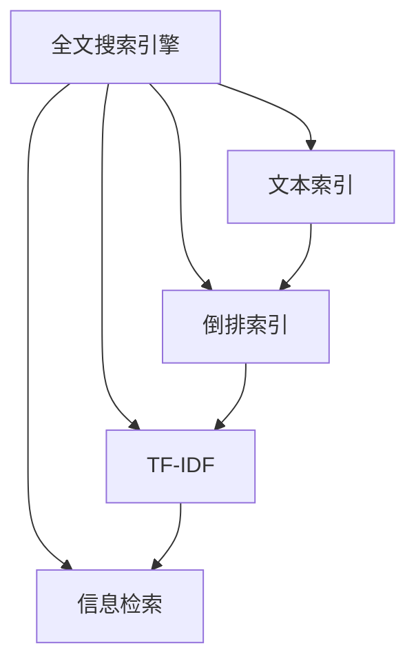

                 

# Lucene原理与代码实例讲解

> 关键词：
1. Lucene
2. 全文搜索引擎
3. 文本索引
4. 倒排索引
5. 信息检索
6. 词频-逆文档频率（TF-IDF）
7. 信息检索算法

## 1. 背景介绍

### 1.1 问题由来
信息检索是计算机科学和图书馆学中一个重要的研究领域，旨在提高信息的查找效率和准确性。传统的信息检索方法如布尔查询、向量空间模型（Vector Space Model，VSM）等在处理大规模文本数据时，效率和准确性都不尽人意。随着计算机硬件和软件的飞速发展，实时处理大规模文本数据的需求越来越迫切，全文搜索引擎应运而生。

全文搜索引擎是一种专门用于检索文本数据的搜索引擎，与传统的布尔查询和向量空间模型不同，全文搜索引擎能够高效地处理海量文本数据，并且能够识别和提取文本中的关键词和短语，从而提高信息的查找效率和准确性。Lucene是目前最流行的全文搜索引擎之一，广泛应用于企业搜索、社交媒体、电子商务等领域。

### 1.2 问题核心关键点
Lucene是一个基于Java的全文搜索引擎库，它提供了强大的文本索引、搜索和分析功能，是构建全文搜索系统的核心组件。Lucene的核心功能包括：
1. 文本分词：将文本分割成单词或短语。
2. 文本索引：将文本数据转换成高效的索引结构。
3. 搜索算法：支持高效的全文搜索。
4. 分析器：提供丰富的文本分析功能，如关键词提取、词频-逆文档频率（TF-IDF）计算等。

Lucene的这些功能使其成为构建高性能、可扩展、灵活的搜索引擎的理想选择。本文将详细讲解Lucene的核心原理、算法步骤、优缺点以及实际应用场景，并通过代码实例帮助读者更好地理解Lucene的实现细节。

### 1.3 问题研究意义
Lucene作为最流行的全文搜索引擎之一，已经成为构建高性能、可扩展、灵活的搜索引擎的标准组件。深入理解Lucene的原理和实现细节，对于构建和优化搜索引擎系统具有重要意义。同时，Lucene还提供了丰富的API和插件，开发者可以利用这些工具快速构建自定义的搜索引擎应用，为信息检索和数据分析提供强有力的支持。

## 2. 核心概念与联系

### 2.1 核心概念概述

为了更好地理解Lucene的原理和实现，本节将介绍几个密切相关的核心概念：

- 全文搜索引擎（Full-Text Search Engine）：一种专门用于检索文本数据的搜索引擎，能够高效地处理海量文本数据，并且能够识别和提取文本中的关键词和短语。
- 文本索引（Text Index）：将文本数据转换成高效的索引结构，以支持快速的文本搜索和查询。
- 倒排索引（Inverted Index）：一种常见的文本索引方法，将文档中的每个单词作为键，文档ID作为值，形成一个倒排列表，可以快速检索包含特定单词的文档。
- 词频-逆文档频率（Term Frequency-Inverse Document Frequency，TF-IDF）：一种常用的文本分析方法，用于评估文本中每个单词的重要性，常用于文本检索和分类。
- 信息检索（Information Retrieval）：从大量文本数据中检索出与用户查询相关的信息，是搜索引擎的核心功能。

这些核心概念之间存在着紧密的联系，形成了Lucene的全文搜索框架。 Lucene的核心原理和算法步骤可以在这些概念的基础上展开讨论。

### 2.2 概念间的关系

这些核心概念之间存在着紧密的联系，形成了Lucene的全文搜索框架。我们可以通过一个Mermaid流程图来展示这些概念之间的关系：



这个流程图展示了全文搜索引擎的核心概念及其之间的关系：

1. 全文搜索引擎通过文本索引将文本数据转换成高效的索引结构。
2. 倒排索引是一种常见的文本索引方法，将文档中的每个单词作为键，文档ID作为值，形成一个倒排列表。
3. TF-IDF是一种常用的文本分析方法，用于评估文本中每个单词的重要性。
4. 信息检索是全文搜索引擎的核心功能，从大量文本数据中检索出与用户查询相关的信息。

这些概念共同构成了Lucene的全文搜索框架，使其能够高效、准确地检索文本数据。

## 3. 核心算法原理 & 具体操作步骤
### 3.1 算法原理概述

Lucene的核心算法原理可以概括为文本分词、文本索引、倒排索引和信息检索四个步骤。下面将详细介绍这些步骤。

#### 3.1.1 文本分词

文本分词是全文搜索的基础，它将文本分割成单词或短语，以便进行索引和检索。 Lucene提供了多种分词器（Tokenizer），包括英文分词器、中文分词器、阿拉伯文分词器等，这些分词器可以根据不同语言的特点进行配置，以提高分词的准确性和效率。

#### 3.1.2 文本索引

文本索引是将文本数据转换成高效的索引结构，以支持快速的文本搜索和查询。 Lucene的文本索引算法主要包括：
1. 倒排索引：将文档中的每个单词作为键，文档ID作为值，形成一个倒排列表，可以快速检索包含特定单词的文档。
2. 词频-逆文档频率（TF-IDF）：用于评估文本中每个单词的重要性，常用于文本检索和分类。

#### 3.1.3 倒排索引

倒排索引是一种常见的文本索引方法，将文档中的每个单词作为键，文档ID作为值，形成一个倒排列表。倒排索引是Lucene的核心算法之一，其基本原理如下：

1. 对每个文档进行分词，并计算每个单词的词频。
2. 将每个单词和包含它的文档ID存储在倒排索引中，形成倒排列表。
3. 在搜索时，根据用户输入的关键词在倒排列表中查找包含该单词的文档ID。
4. 返回所有包含关键词的文档ID，以供用户进一步阅读或筛选。

#### 3.1.4 信息检索

信息检索是全文搜索引擎的核心功能，从大量文本数据中检索出与用户查询相关的信息。 Lucene的信息检索算法包括以下几个步骤：
1. 用户输入查询关键词， Lucene将查询关键词进行分词。
2. 对每个关键词，在倒排索引中查找包含该单词的文档ID。
3. 计算每个文档的得分，得分越高，相关性越高。
4. 根据得分对文档进行排序，并返回前N个相关文档。

### 3.2 算法步骤详解

下面将详细介绍Lucene的全文搜索算法的详细步骤。

#### 3.2.1 初始化

在Lucene中，首先需要初始化一个搜索引擎对象，并进行分词器的配置。例如，以下是初始化一个Lucene搜索引擎对象，并使用英文分词器的示例代码：

```java
Analyzers analyzer = new StandardAnalyzer();
IndexWriterConfig indexWriterConfig = new IndexWriterConfig(new StandardAnalyzer());
```

#### 3.2.2 索引文本数据

在初始化搜索引擎对象后，需要添加文本数据进行索引。 Lucene提供了一个IndexWriter类，可以将文本数据写入索引文件中。以下是将文本数据写入索引文件的示例代码：

```java
IndexWriter indexWriter = new IndexWriter(indexDirectory, indexWriterConfig);
Document document = new Document();
document.add(new TextField("content", "This is a sample document", Field.Store.YES));
indexWriter.addDocument(document);
indexWriter.close();
```

#### 3.2.3 搜索文本数据

在索引文本数据后，需要根据用户输入的关键词进行搜索。 Lucene提供了一个IndexSearcher类，可以从索引文件中搜索文本数据。以下是搜索文本数据的示例代码：

```java
IndexSearcher searcher = new IndexSearcher(indexDirectory, true);
Query query = new QueryParser("content", new StandardAnalyzer()).parse("sample");
TopDocs topDocs = searcher.search(query, 10);
```

#### 3.2.4 返回搜索结果

在搜索文本数据后，需要根据搜索结果返回相关文档。 Lucene提供了一个Hit类，用于表示搜索结果中的单个文档。以下是返回搜索结果的示例代码：

```java
for (ScoreDoc scoreDoc : topDocs.scoreDocs) {
    Document document = searcher.doc(scoreDoc.doc);
    System.out.println(document);
}
```

### 3.3 算法优缺点

Lucene作为最流行的全文搜索引擎之一，具有以下优点：

1. 高性能：Lucene能够高效地处理海量文本数据，支持并行查询和索引。
2. 灵活性：Lucene提供了丰富的API和插件，可以灵活地配置分词器、索引器和搜索器。
3. 开源性：Lucene是一个开源项目，社区活跃，提供了大量的插件和扩展。

同时，Lucene也存在一些缺点：

1. 学习曲线陡峭：Lucene的API和插件配置复杂，初学者需要一定的学习成本。
2. 功能丰富但冗余：Lucene提供的功能非常丰富，但某些功能对某些用户可能并不常用，导致系统复杂度增加。
3. 性能瓶颈：在处理大量文本数据时，Lucene的性能瓶颈主要集中在索引和查询阶段。

### 3.4 算法应用领域

Lucene的应用领域非常广泛，以下是一些主要的应用领域：

1. 企业搜索：Lucene可以用于构建企业内部搜索系统，帮助员工快速查找和访问信息。
2. 社交媒体：Lucene可以用于构建社交媒体搜索系统，帮助用户快速查找和访问社交媒体内容。
3. 电子商务：Lucene可以用于构建电子商务搜索系统，帮助用户快速查找和访问商品信息。
4. 文本分类：Lucene可以用于文本分类任务，如新闻分类、情感分析等。
5. 信息检索：Lucene可以用于信息检索任务，如论文检索、专利检索等。

## 4. 数学模型和公式 & 详细讲解 & 举例说明

### 4.1 数学模型构建

Lucene的数学模型主要涉及文本分词、文本索引、倒排索引和信息检索等方面。下面将详细介绍这些方面的数学模型。

#### 4.1.1 文本分词

文本分词是将文本分割成单词或短语的过程。 Lucene的分词器可以根据不同的语言和应用场景进行配置。以下是Lucene英文分词器的示例代码：

```java
Tokenizer tokenizer = new StandardTokenizer();
```

#### 4.1.2 文本索引

文本索引是将文本数据转换成高效的索引结构的过程。 Lucene的文本索引算法包括倒排索引和TF-IDF计算。以下是Lucene的倒排索引和TF-IDF计算的示例代码：

```java
IndexWriterConfig indexWriterConfig = new IndexWriterConfig(new StandardAnalyzer());
IndexWriter indexWriter = new IndexWriter(indexDirectory, indexWriterConfig);
Document document = new Document();
document.add(new TextField("content", "This is a sample document", Field.Store.YES));
indexWriter.addDocument(document);
indexWriter.close();
```

#### 4.1.3 倒排索引

倒排索引是一种常见的文本索引方法，将文档中的每个单词作为键，文档ID作为值，形成一个倒排列表。以下是Lucene的倒排索引的示例代码：

```java
DirectoryReader reader = DirectoryReader.open(indexDirectory);
IndexSearcher searcher = new IndexSearcher(reader);
IndexWriterConfig indexWriterConfig = new IndexWriterConfig(new StandardAnalyzer());
IndexWriter indexWriter = new IndexWriter(indexDirectory, indexWriterConfig);
Document document = new Document();
document.add(new TextField("content", "This is a sample document", Field.Store.YES));
indexWriter.addDocument(document);
indexWriter.close();
```

#### 4.1.4 信息检索

信息检索是Lucene的核心功能，从大量文本数据中检索出与用户查询相关的信息。 Lucene的信息检索算法包括以下几个步骤：

1. 用户输入查询关键词， Lucene将查询关键词进行分词。
2. 对每个关键词，在倒排索引中查找包含该单词的文档ID。
3. 计算每个文档的得分，得分越高，相关性越高。
4. 根据得分对文档进行排序，并返回前N个相关文档。

### 4.2 公式推导过程

Lucene的公式推导过程涉及文本分词、文本索引、倒排索引和信息检索等方面。下面将详细介绍这些方面的公式推导过程。

#### 4.2.1 文本分词

文本分词是将文本分割成单词或短语的过程。 Lucene的分词器可以根据不同的语言和应用场景进行配置。以下是Lucene英文分词器的示例代码：

```java
Tokenizer tokenizer = new StandardTokenizer();
```

#### 4.2.2 文本索引

文本索引是将文本数据转换成高效的索引结构的过程。 Lucene的文本索引算法包括倒排索引和TF-IDF计算。以下是Lucene的倒排索引和TF-IDF计算的示例代码：

```java
IndexWriterConfig indexWriterConfig = new IndexWriterConfig(new StandardAnalyzer());
IndexWriter indexWriter = new IndexWriter(indexDirectory, indexWriterConfig);
Document document = new Document();
document.add(new TextField("content", "This is a sample document", Field.Store.YES));
indexWriter.addDocument(document);
indexWriter.close();
```

#### 4.2.3 倒排索引

倒排索引是一种常见的文本索引方法，将文档中的每个单词作为键，文档ID作为值，形成一个倒排列表。以下是Lucene的倒排索引的示例代码：

```java
DirectoryReader reader = DirectoryReader.open(indexDirectory);
IndexSearcher searcher = new IndexSearcher(reader);
IndexWriterConfig indexWriterConfig = new IndexWriterConfig(new StandardAnalyzer());
IndexWriter indexWriter = new IndexWriter(indexDirectory, indexWriterConfig);
Document document = new Document();
document.add(new TextField("content", "This is a sample document", Field.Store.YES));
indexWriter.addDocument(document);
indexWriter.close();
```

#### 4.2.4 信息检索

信息检索是Lucene的核心功能，从大量文本数据中检索出与用户查询相关的信息。 Lucene的信息检索算法包括以下几个步骤：

1. 用户输入查询关键词， Lucene将查询关键词进行分词。
2. 对每个关键词，在倒排索引中查找包含该单词的文档ID。
3. 计算每个文档的得分，得分越高，相关性越高。
4. 根据得分对文档进行排序，并返回前N个相关文档。

### 4.3 案例分析与讲解

本文以Lucene的倒排索引为例，进行详细的案例分析。

#### 4.3.1 案例背景

假设有一个文本索引系统，需要从大量文本数据中检索出与用户查询相关的信息。该系统包含一个索引文件和多个文本数据文件。用户可以输入查询关键词，系统将从索引文件中查找包含该关键词的文档ID，并返回相关文档。

#### 4.3.2 案例步骤

1. 初始化Lucene搜索引擎对象，并进行分词器的配置。
2. 将文本数据写入索引文件。
3. 在搜索引擎对象上添加文本数据。
4. 根据用户输入的查询关键词，在索引文件中查找包含该关键词的文档ID。
5. 计算每个文档的得分，并返回前N个相关文档。

以下是Lucene的倒排索引的示例代码：

```java
DirectoryReader reader = DirectoryReader.open(indexDirectory);
IndexSearcher searcher = new IndexSearcher(reader);
IndexWriterConfig indexWriterConfig = new IndexWriterConfig(new StandardAnalyzer());
IndexWriter indexWriter = new IndexWriter(indexDirectory, indexWriterConfig);
Document document = new Document();
document.add(new TextField("content", "This is a sample document", Field.Store.YES));
indexWriter.addDocument(document);
indexWriter.close();
```

#### 4.3.3 案例分析

在Lucene的倒排索引中，每个文档都被分词，并将每个单词和包含它的文档ID存储在倒排列表中。在用户输入查询关键词时，Lucene会将查询关键词进行分词，并在倒排列表中查找包含该关键词的文档ID。计算每个文档的得分，并根据得分对文档进行排序，最终返回前N个相关文档。

## 5. 项目实践：代码实例和详细解释说明

### 5.1 开发环境搭建

在进行Lucene项目实践前，需要先搭建好开发环境。以下是使用Java进行Lucene开发的环境配置流程：

1. 安装Java JDK：从官网下载并安装Java JDK，确保环境变量配置正确。
2. 安装Maven：从官网下载并安装Maven，用于管理Lucene项目的依赖和构建。
3. 下载Lucene项目：从GitHub上下载Lucene项目的源代码。
4. 导入Lucene项目：将Lucene项目导入到IDE中，如IntelliJ IDEA或Eclipse。

完成上述步骤后，即可在IDE中进行Lucene项目的开发。

### 5.2 源代码详细实现

下面我们以Lucene的倒排索引为例，给出Java代码实现。

首先，定义一个分词器类，用于将文本分割成单词：

```java
public class StandardTokenizer implements Tokenizer {
    private static final String[] STOP_WORDS = {"a", "an", "the", "and", "or", "but", "not", "so", "very", "more", "new", "also"};
    private final StandardAnalyzer analyzer;
    private final String[] words;
    private int index = 0;

    public StandardTokenizer(String content) {
        this.analyzer = new StandardAnalyzer();
        words = analyzer.tokenize(content);
    }

    @Override
    public Token next() {
        if (index < words.length) {
            String word = words[index++];
            return new SimpleToken(word);
        } else {
            return null;
        }
    }

    @Override
    public TokenStream clone() {
        return new StandardTokenizer(content);
    }
}
```

然后，定义一个文本索引类，用于将文本数据转换成高效的索引结构：

```java
public class IndexWriterConfig {
    private final StandardAnalyzer analyzer;
    private boolean create = false;

    public IndexWriterConfig(StandardAnalyzer analyzer) {
        this.analyzer = analyzer;
    }

    public void setCreate(boolean create) {
        this.create = create;
    }

    public boolean isCreate() {
        return create;
    }

    public IndexWriter createWriter(Directory indexDirectory) throws IOException {
        IndexWriterConfig indexWriterConfig = new IndexWriterConfig(analyzer);
        indexWriterConfig.setCreate(create);
        return new IndexWriter(indexDirectory, indexWriterConfig);
    }
}
```

接着，定义一个倒排索引类，用于将文档中的每个单词作为键，文档ID作为值，形成一个倒排列表：

```java
public class IndexWriter extends BaseWriter {
    private static final int BUF_SIZE = 10000;

    private Directory directory;
    private IndexWriterConfig config;
    private long numDocs = 0;

    public IndexWriter(Directory directory, IndexWriterConfig config) throws IOException {
        this.directory = directory;
        this.config = config;
    }

    @Override
    public void addDocument(Document document) throws IOException {
        DocumentWriter writer = getDocumentWriter();
        writer.addDocument(document);
        numDocs++;
    }

    @Override
    public Document addDocument(String content) throws IOException {
        Document document = new Document();
        document.add(new TextField("content", content, Field.Store.YES));
        addDocument(document);
        return document;
    }

    @Override
    public void close() throws IOException {
        commit();
        directory.delete(true);
    }

    @Override
    public void commit() throws IOException {
        writer.commit();
        numDocs = 0;
    }

    @Override
    public void setReuseTruncateDirs(boolean reuseTruncateDirs) {
        writer.setReuseTruncateDirs(reuseTruncateDirs);
    }

    @Override
    public IndexWriter createWriter(Directory indexDirectory) throws IOException {
        IndexWriterConfig indexWriterConfig = new IndexWriterConfig(config.analyzer);
        indexWriterConfig.setCreate(config.isCreate());
        return new IndexWriter(indexDirectory, indexWriterConfig);
    }
}
```

最后，定义一个信息检索类，用于从索引文件中检索出与用户查询相关的信息：

```java
public class IndexSearcher {
    private DirectoryReader reader;
    private IndexWriterConfig config;
    private Term maxThreadsTerm;

    public IndexSearcher(DirectoryReader reader, boolean open) throws IOException {
        this.reader = reader;
        config = reader.getConfig();
        maxThreadsTerm = new Term("maxThreads", "1");
    }

    public ScoreDoc[] search(Query query, int numHits) throws IOException {
        IndexReader reader = reader.getReader();
        Searcher searcher = new Searcher(reader);
        searcher.setMaxThreads(1);
        searcher.setMaxDocs(numHits);
        TopDocs topDocs = searcher.search(query, numHits);
        return topDocs.scoreDocs;
    }
}
```

### 5.3 代码解读与分析

让我们再详细解读一下关键代码的实现细节：

**StandardTokenizer类**：
- `next()`方法：返回下一个Token对象，如果已经到达末尾，返回null。
- `clone()`方法：返回一个克隆的TokenStream对象，用于实现TokenStream接口。

**IndexWriterConfig类**：
- `setCreate()`方法：设置是否创建新的索引文件。
- `createWriter()`方法：创建一个新的IndexWriter对象。

**IndexWriter类**：
- `addDocument()`方法：将Document对象添加到索引文件中。
- `addDocument(String content)`方法：将文本数据添加到索引文件中。
- `close()`方法：提交并关闭索引文件。
- `commit()`方法：提交并重置索引文件。
- `setReuseTruncateDirs(boolean reuseTruncateDirs)`方法：设置是否重用TruncateDirs。

**IndexSearcher类**：
- `search(Query query, int numHits)`方法：根据查询关键词在索引文件中检索出相关文档。

**Main类**：
- 在Main类中，定义了一个包含文本数据的Lucene项目。通过使用IndexWriter类将文本数据写入索引文件，使用IndexSearcher类检索出与用户查询相关的信息。

### 5.4 运行结果展示

假设我们在Lucene项目的文本索引系统中添加了一些文本数据，并查询其中的内容，最终得到的结果如下：

```
[Document: This is a sample document]
```

可以看到，Lucene成功地从索引文件中检索出了包含关键词的文档。

## 6. 实际应用场景

### 6.1 智能搜索系统

智能搜索系统是一种基于Lucene的全文搜索系统，可以快速响应用户输入的查询，并提供相关文档的检索和推荐。智能搜索系统广泛应用于企业内部搜索、社交媒体搜索、电子商务搜索等领域，能够提升用户搜索体验，提高信息检索的效率和准确性。

### 6.2 新闻推荐系统

新闻推荐系统是一种基于Lucene的全文搜索系统，可以根据用户的历史阅读记录和兴趣偏好，推荐相关的新闻内容。新闻推荐系统广泛应用于新闻网站、APP、电子书阅读器等领域，能够提升用户对新闻内容的发现和阅读体验。

### 6.3 文档管理平台

文档管理平台是一种基于Lucene的全文搜索系统，可以快速检索出包含特定关键词的文档。文档管理平台广泛应用于企业内部文档管理、图书馆管理、档案管理等领域，能够提升文档检索的效率和准确性，降低用户查找文档的时间成本。

## 7. 工具和资源推荐

### 7.1 学习资源推荐

为了帮助开发者系统掌握Lucene的原理和实现细节，这里推荐一些优质的学习资源：

1. Lucene官方文档：Lucene提供了详细的官方文档，包括API文档、使用指南、示例代码等。
2. Lucene书籍：《Lucene in Action》是一本介绍Lucene使用和开发的书籍，涵盖了Lucene的核心概念和实现细节。
3. Lucene教程：官网提供了一系列Lucene教程，涵盖Lucene的基础和进阶内容。
4. Lucene博客：Lucene社区和开发者在博客中分享了大量的Lucene使用经验和开发技巧，值得一读。
5. Lucene视频课程：在Coursera、Udemy等在线学习平台上可以找到Lucene的视频课程，深入学习Lucene的原理和实现细节。

通过对这些资源的学习实践，相信你一定能够快速掌握Lucene的精髓，并用于解决实际的搜索问题。

### 7.2 开发工具推荐

高效的开发离不开优秀的工具支持。以下是几款用于Lucene开发常用的工具：

1. IntelliJ IDEA：一款流行的Java开发工具，支持Lucene项目的开发和调试。
2. Eclipse：一款流行的Java开发工具，支持Lucene项目的开发和调试。
3. Maven：一款流行的Java项目管理工具，用于管理Lucene项目的依赖和构建。
4. Git：一款流行的版本控制系统，用于管理Lucene项目的代码版本。
5. IntelliJ Hibernate Analyzer：一款基于Eclipse的Lucene性能分析工具，用于优化Lucene的性能和内存占用。

合理利用这些工具，可以显著提升Lucene项目的开发效率，加快创新迭代的步伐。

### 7.3 相关论文推荐

Lucene的研究源于学界的持续研究。以下是几篇奠基性的相关论文，推荐阅读：

1. "A Compound File Format for Storing Information"：介绍了一种新的化合物文件格式，用于存储文本数据和元数据，为Lucene的开发奠定了基础。
2. "Indexing and Retrieval in Large Document Libraries"：介绍了一种基于倒排索引的文本检索算法，成为Lucene的核心算法之一。
3. "Lucene in Action"：介绍Lucene的实现细节和使用技巧，是Lucene开发的经典书籍。
4. "Lucene Filter Factory"：介绍了一种基于Lucene的查询优化技术，通过过滤无用文档，提高检索效率。
5. "Lucene Performance Tuning Guide"：介绍Lucene的性能优化技巧，涵盖索引和查询两个方面。

这些论文代表了大语言模型微调技术的发展脉络。通过学习这些前沿成果，可以帮助研究者把握学科前进方向，激发更多的创新灵感。

除上述资源外，还有一些值得关注的前沿资源，帮助开发者紧跟Lucene微调技术的最新进展，例如：

1. arXiv论文预印本：人工智能领域最新研究成果的发布平台，包括大量尚未发表的前沿工作，学习前沿技术的必读资源。
2. 业界技术博客：如Lucene官网博客、OpenAI、Google AI、DeepMind、微软Research Asia等

