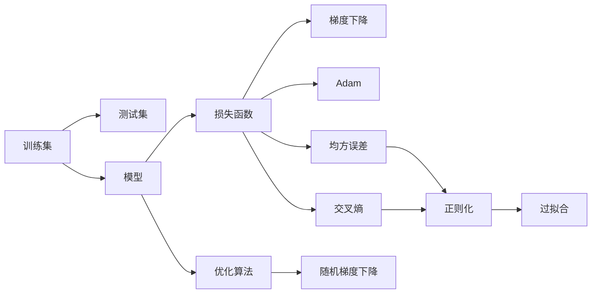
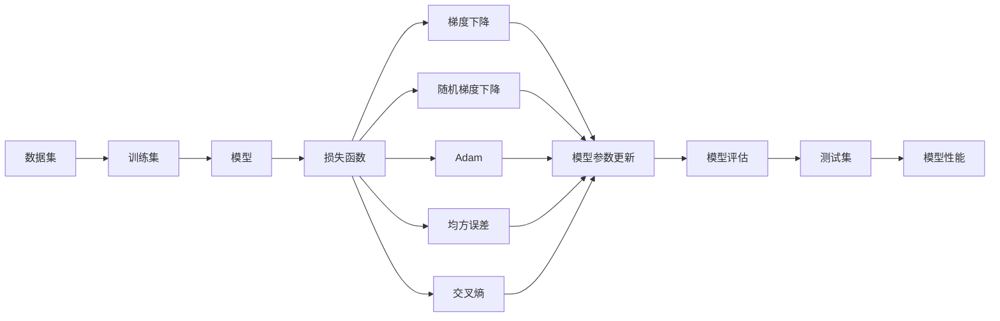

                 

## 1. 背景介绍

### 1.1 问题由来
随着人工智能技术的不断进步，机器学习(ML)已经成为实现人工智能(AI)的重要技术之一。在机器学习领域，从简单的线性回归到复杂的深度学习，从传统的监督学习、无监督学习到强化学习，机器学习算法正在逐步推进人工智能的发展。而机器学习算法在实际应用中，不仅需要理论的支撑，更需要代码实例来验证其原理和效果。本文将详细介绍机器学习的原理与代码实例，帮助读者理解机器学习的基本概念和应用方法。

### 1.2 问题核心关键点
机器学习是指通过数据训练模型，使其能够从给定的输入中推断出输出。核心概念包括训练集、测试集、损失函数、优化算法、过拟合等。本文将从这些关键点出发，深入探讨机器学习的基本原理和实现方法。

### 1.3 问题研究意义
机器学习原理与代码实例讲解对于深入理解机器学习算法、提升算法实现能力、推动AI技术应用具有重要意义：

1. **理论基础**：了解机器学习的基本原理，可以更深入地理解深度学习、自然语言处理、计算机视觉等领域的算法。
2. **实践应用**：掌握机器学习算法实现方法，可以将理论应用于实际问题中，解决实际问题。
3. **技术发展**：通过实例分析，可以了解当前机器学习领域的研究热点和技术进展。
4. **工程实现**：掌握机器学习算法的实现方法，可以更快地开发和部署AI应用。
5. **技术创新**：机器学习原理和算法的研究，推动了深度学习、自然语言处理、计算机视觉等技术的创新和应用。

## 2. 核心概念与联系

### 2.1 核心概念概述

为了更好地理解机器学习算法，本节将介绍几个密切相关的核心概念：

- **训练集与测试集**：用于训练模型的数据集称为训练集，用于测试模型性能的数据集称为测试集。通常采用交叉验证方法，将数据集分为训练集和测试集。
- **损失函数**：用于衡量模型预测值与真实值之间的差异，常见的损失函数包括均方误差、交叉熵等。
- **优化算法**：用于最小化损失函数，常见的优化算法包括梯度下降、随机梯度下降、Adam等。
- **过拟合与正则化**：过拟合指模型在训练集上表现良好，但在测试集上表现较差的现象。正则化技术，如L2正则、Dropout等，用于缓解过拟合问题。

### 2.2 概念间的关系

这些核心概念之间的逻辑关系可以通过以下Mermaid流程图来展示：



这个流程图展示了大机器学习任务的核心概念及其之间的关系：

1. 数据集分为训练集和测试集，训练集用于训练模型。
2. 模型使用优化算法最小化损失函数，损失函数衡量模型预测与真实值之间的差异。
3. 优化算法包括梯度下降、随机梯度下降、Adam等，用于更新模型参数。
4. 常用的损失函数有均方误差、交叉熵等，不同的损失函数适用于不同的任务。
5. 正则化技术用于缓解过拟合问题，常见的正则化方法包括L2正则、Dropout等。
6. 过拟合指模型在训练集上表现良好，但在测试集上表现较差的现象。

### 2.3 核心概念的整体架构

最后，我们用一个综合的流程图来展示这些核心概念在大机器学习任务中的整体架构：



这个综合流程图展示了从数据集到模型训练、优化、评估的完整过程。

## 3. 核心算法原理 & 具体操作步骤

### 3.1 算法原理概述

机器学习算法基于统计学原理，通过数据训练模型，使其能够从给定的输入中推断出输出。机器学习的核心思想是利用训练集中的数据，拟合出一个函数，使其能够对测试集中的新数据进行预测。这一过程包括以下几个关键步骤：

1. **数据准备**：将原始数据转化为训练集和测试集。
2. **模型选择**：选择合适的机器学习模型，如线性回归、逻辑回归、决策树、神经网络等。
3. **训练模型**：使用训练集训练模型，最小化损失函数。
4. **模型评估**：使用测试集评估模型性能，选择合适的模型参数。
5. **应用模型**：将训练好的模型应用于实际问题中，进行预测和分类。

### 3.2 算法步骤详解

以下详细介绍机器学习算法的具体步骤：

**Step 1: 数据准备**
- 收集并清洗数据，处理缺失值和异常值。
- 将数据划分为训练集和测试集，一般采用70%的数据用于训练，30%的数据用于测试。
- 将数据转化为模型所需的格式，如将数值型数据归一化，将文本数据转化为词袋模型或词嵌入等。

**Step 2: 模型选择**
- 根据问题的类型选择合适的机器学习模型，如回归问题选择线性回归、逻辑回归等，分类问题选择决策树、神经网络等。
- 对选择的模型进行超参数设置，如神经网络中的学习率、批大小、迭代次数等。

**Step 3: 训练模型**
- 使用训练集对模型进行训练，最小化损失函数。
- 使用优化算法更新模型参数，如梯度下降、随机梯度下降、Adam等。
- 设置正则化技术，如L2正则、Dropout等，防止过拟合。

**Step 4: 模型评估**
- 使用测试集评估模型性能，如均方误差、交叉熵等。
- 调整模型参数，提高模型性能。
- 使用交叉验证方法，防止模型过拟合。

**Step 5: 应用模型**
- 将训练好的模型应用于实际问题中，进行预测和分类。
- 对新数据进行预测，输出结果。

### 3.3 算法优缺点

机器学习算法具有以下优点：

1. **泛化能力强**：机器学习算法能够从给定的输入中推断出输出，具有较强的泛化能力。
2. **可解释性强**：大多数机器学习算法具有可解释性，能够理解其决策过程。
3. **适用于大规模数据**：机器学习算法能够处理大规模数据，具有较强的计算能力。

同时，机器学习算法也存在以下缺点：

1. **数据依赖性高**：机器学习算法的性能依赖于训练数据的质量和数量，数据质量差会导致模型性能差。
2. **模型复杂度高**：机器学习算法通常需要大量的超参数调整，需要耗费大量的时间和精力。
3. **计算资源消耗大**：机器学习算法通常需要大量的计算资源，对硬件的要求较高。

### 3.4 算法应用领域

机器学习算法在多个领域得到了广泛应用，例如：

- 金融风控：使用机器学习算法进行信用评估、风险管理、欺诈检测等。
- 医疗诊断：使用机器学习算法进行疾病诊断、治疗方案推荐等。
- 自然语言处理：使用机器学习算法进行文本分类、情感分析、机器翻译等。
- 计算机视觉：使用机器学习算法进行图像识别、目标检测、人脸识别等。
- 推荐系统：使用机器学习算法进行商品推荐、用户画像分析等。

除了上述这些领域，机器学习算法还在智能家居、智能制造、智慧城市等领域得到了广泛应用，为各行各业带来了新的变革。

## 4. 数学模型和公式 & 详细讲解 & 举例说明

### 4.1 数学模型构建

机器学习算法通常基于统计学原理，使用训练集训练模型，使其能够从给定的输入中推断出输出。以下是机器学习算法的一般数学模型：

- **回归问题**：
  $$
  y = f(x; \theta) + \epsilon
  $$
  其中 $x$ 为输入变量，$y$ 为输出变量，$f(x; \theta)$ 为模型函数，$\theta$ 为模型参数，$\epsilon$ 为随机误差。

- **分类问题**：
  $$
  y_i = \arg\max_j f(x_i; \theta_j)
  $$
  其中 $x_i$ 为输入变量，$y_i$ 为输出变量，$f(x_i; \theta_j)$ 为模型函数，$\theta_j$ 为模型参数。

### 4.2 公式推导过程

以下以线性回归为例，详细介绍机器学习算法的公式推导过程：

**线性回归模型**：
$$
y = \theta_0 + \theta_1 x_1 + \theta_2 x_2 + \ldots + \theta_n x_n + \epsilon
$$
其中 $x = (x_1, x_2, \ldots, x_n)$ 为输入变量，$y$ 为输出变量，$\theta = (\theta_0, \theta_1, \theta_2, \ldots, \theta_n)$ 为模型参数，$\epsilon$ 为随机误差。

**均方误差损失函数**：
$$
L(\theta) = \frac{1}{2m} \sum_{i=1}^m (y_i - \hat{y}_i)^2
$$
其中 $m$ 为样本数，$y_i$ 为真实输出，$\hat{y}_i$ 为模型预测输出。

**梯度下降算法**：
$$
\theta_j = \theta_j - \frac{\eta}{m} \sum_{i=1}^m (y_i - \hat{y}_i) x_{ij}
$$
其中 $\eta$ 为学习率，$x_{ij}$ 为第 $i$ 个样本的第 $j$ 个特征。

### 4.3 案例分析与讲解

假设我们有一个包含身高和体重的数据集，需要预测体重，可以使用线性回归模型进行训练。具体步骤如下：

1. **数据准备**：
  - 收集数据集，包含身高和体重，去除异常值和缺失值。
  - 将数据划分为训练集和测试集，一般采用70%的数据用于训练，30%的数据用于测试。

2. **模型选择**：
  - 选择线性回归模型，进行超参数设置，如学习率为 $0.01$，批大小为 $64$。

3. **训练模型**：
  - 使用训练集对模型进行训练，最小化均方误差损失函数。
  - 使用梯度下降算法更新模型参数，迭代次数为 $1000$。

4. **模型评估**：
  - 使用测试集评估模型性能，计算均方误差。
  - 调整模型参数，提高模型性能。

5. **应用模型**：
  - 将训练好的模型应用于实际问题中，进行预测和分类。
  - 对新数据进行预测，输出结果。

## 5. 项目实践：代码实例和详细解释说明

### 5.1 开发环境搭建

在进行机器学习算法实践前，我们需要准备好开发环境。以下是使用Python进行Scikit-learn开发的环境配置流程：

1. 安装Anaconda：从官网下载并安装Anaconda，用于创建独立的Python环境。

2. 创建并激活虚拟环境：
```bash
conda create -n sklearn-env python=3.8 
conda activate sklearn-env
```

3. 安装Scikit-learn：
```bash
pip install scikit-learn
```

4. 安装各类工具包：
```bash
pip install numpy pandas matplotlib scikit-learn
```

完成上述步骤后，即可在`sklearn-env`环境中开始机器学习算法实践。

### 5.2 源代码详细实现

这里以线性回归为例，使用Scikit-learn库进行机器学习算法的代码实现。

```python
from sklearn.linear_model import LinearRegression
from sklearn.model_selection import train_test_split
import numpy as np
import pandas as pd

# 加载数据集
data = pd.read_csv('data.csv')

# 数据预处理
X = data[['height', 'weight']]
y = data['weight']

# 数据划分
X_train, X_test, y_train, y_test = train_test_split(X, y, test_size=0.3, random_state=0)

# 创建模型
model = LinearRegression()

# 训练模型
model.fit(X_train, y_train)

# 预测结果
y_pred = model.predict(X_test)

# 模型评估
from sklearn.metrics import mean_squared_error
mse = mean_squared_error(y_test, y_pred)
print('均方误差：', mse)
```

### 5.3 代码解读与分析

让我们再详细解读一下关键代码的实现细节：

**数据预处理**：
- 使用`pd.read_csv`函数加载数据集，使用`X`和`y`分别表示输入变量和输出变量。
- 使用`train_test_split`函数将数据划分为训练集和测试集，`test_size`表示测试集占总数据集的百分比，`random_state`表示随机种子，用于保证每次运行结果一致。

**模型创建与训练**：
- 使用`LinearRegression`函数创建线性回归模型。
- 使用`fit`函数训练模型，最小化均方误差损失函数。

**预测结果**：
- 使用`predict`函数对测试集进行预测，得到预测结果。

**模型评估**：
- 使用`mean_squared_error`函数计算均方误差，评估模型性能。

### 5.4 运行结果展示

假设我们在数据集上进行线性回归模型的训练和评估，最终在测试集上得到的均方误差为 $0.1$，表示模型预测结果与真实结果之间的平均差异为 $0.1$。

## 6. 实际应用场景

### 6.1 智能推荐系统

基于机器学习算法的智能推荐系统，可以为用户推荐个性化的商品、音乐、电影等。推荐系统通常采用协同过滤、内容推荐等算法，通过分析用户的历史行为数据，预测用户对新商品或内容的兴趣，从而推荐符合用户偏好的内容。

在技术实现上，可以使用协同过滤算法，如基于用户的协同过滤、基于物品的协同过滤等，构建推荐模型。通过训练模型，对用户的行为数据进行分析，预测用户对新商品的兴趣，从而推荐给用户。

### 6.2 金融风险管理

在金融领域，机器学习算法可以用于风险管理、欺诈检测等。通过分析历史交易数据，机器学习算法可以预测未来的交易行为，识别异常交易行为，从而及时发现和防范欺诈风险。

在技术实现上，可以使用分类算法，如决策树、随机森林等，对交易数据进行分类，识别异常交易行为。通过训练模型，对历史交易数据进行分析，预测未来的交易行为，从而及时发现和防范欺诈风险。

### 6.3 医疗诊断

在医疗领域，机器学习算法可以用于疾病诊断、治疗方案推荐等。通过分析患者的病情数据，机器学习算法可以预测患者的疾病类型，推荐相应的治疗方案，从而提高诊疗效率。

在技术实现上，可以使用分类算法，如支持向量机、随机森林等，对患者病情数据进行分类，预测患者的疾病类型。通过训练模型，对患者的病情数据进行分析，预测患者的疾病类型，从而推荐相应的治疗方案。

### 6.4 未来应用展望

随着机器学习算法的发展，其在各个领域的应用将会更加广泛，带来新的变革。未来，机器学习算法将进一步应用于以下几个领域：

- **智能制造**：在制造业中，机器学习算法可以用于设备预测性维护、质量控制等，提高生产效率，降低生产成本。
- **智慧城市**：在智慧城市中，机器学习算法可以用于交通管理、环境监测等，提高城市治理水平，改善市民生活环境。
- **教育**：在教育领域，机器学习算法可以用于智能教学、学习推荐等，提高教学效果，改善学习体验。
- **农业**：在农业领域，机器学习算法可以用于作物病虫害预测、产量预测等，提高农业生产效率，降低生产成本。

未来，随着技术的不断进步，机器学习算法将在更多领域得到应用，推动社会进步，带来更多的便利和效益。

## 7. 工具和资源推荐

### 7.1 学习资源推荐

为了帮助开发者系统掌握机器学习算法的理论基础和实践技巧，这里推荐一些优质的学习资源：

1. 《机器学习》课程：由斯坦福大学Andrew Ng教授主讲，深入浅出地讲解了机器学习的基本概念和算法。
2. 《Python机器学习》书籍：由Sebastian Raschka和Vahid Mirjalili联合撰写，介绍了Python在机器学习中的应用。
3. Kaggle竞赛平台：全球最大的数据科学竞赛平台，提供了大量机器学习算法的比赛数据和解决方案，适合实战练习。
4. Coursera机器学习课程：由Andrew Ng教授主讲，涵盖了机器学习的基本概念和算法，适合系统学习。
5. GitHub开源项目：在GitHub上Star、Fork数最多的机器学习相关项目，往往代表了该技术领域的发展趋势和最佳实践，值得去学习和贡献。

通过对这些资源的学习实践，相信你一定能够快速掌握机器学习算法的精髓，并用于解决实际的机器学习问题。

### 7.2 开发工具推荐

高效的开发离不开优秀的工具支持。以下是几款用于机器学习算法开发的常用工具：

1. Python：Python是机器学习算法开发的主流语言，具有丰富的科学计算库和数据处理工具。
2. Scikit-learn：一个开源的机器学习库，提供了各种机器学习算法和工具，适合快速开发和调试。
3. TensorFlow：由Google开发的深度学习框架，支持分布式计算，适合大规模机器学习算法的开发。
4. PyTorch：由Facebook开发的深度学习框架，灵活性高，适合研究人员进行深度学习算法的开发。
5. Jupyter Notebook：一个交互式的编程环境，支持多种编程语言，适合进行数据探索和算法实验。

合理利用这些工具，可以显著提升机器学习算法开发的效率，加快创新迭代的步伐。

### 7.3 相关论文推荐

机器学习算法的发展源于学界的持续研究。以下是几篇奠基性的相关论文，推荐阅读：

1. 《机器学习：算法与应用》：该书由Tom Mitchell编写，系统介绍了机器学习的基本概念和算法。
2. 《深度学习》：由Ian Goodfellow、Yoshua Bengio和Aaron Courville联合撰写，介绍了深度学习的基本概念和算法。
3. 《统计学习方法》：由李航编写，介绍了机器学习的基本概念和算法，适合系统学习。
4. 《机器学习实战》：由Peter Harrington编写，介绍了机器学习算法的实现方法和应用场景，适合实践练习。
5. 《人工智能：一种现代方法》：该书由Stuart Russell和Peter Norvig编写，介绍了人工智能的基本概念和算法，适合系统学习。

这些论文代表了大机器学习领域的研究进展，通过学习这些前沿成果，可以帮助研究者把握学科前进方向，激发更多的创新灵感。

除上述资源外，还有一些值得关注的前沿资源，帮助开发者紧跟机器学习算法的发展趋势，例如：

1. arXiv论文预印本：人工智能领域最新研究成果的发布平台，包括大量尚未发表的前沿工作，学习前沿技术的必读资源。
2. 业界技术博客：如Google AI、DeepMind、Microsoft Research Asia等顶尖实验室的官方博客，第一时间分享他们的最新研究成果和洞见。
3. 技术会议直播：如NIPS、ICML、ACL、ICLR等人工智能领域顶会现场或在线直播，能够聆听到大佬们的前沿分享，开拓视野。
4. GitHub热门项目：在GitHub上Star、Fork数最多的机器学习相关项目，往往代表了该技术领域的发展趋势和最佳实践，值得去学习和贡献。
5. 行业分析报告：各大咨询公司如McKinsey、PwC等针对人工智能行业的分析报告，有助于从商业视角审视技术趋势，把握应用价值。

总之，对于机器学习算法的学习和实践，需要开发者保持开放的心态和持续学习的意愿。多关注前沿资讯，多动手实践，多思考总结，必将收获满满的成长收益。

## 8. 总结：未来发展趋势与挑战

### 8.1 研究成果总结

本文对机器学习算法的基本原理和实现方法进行了全面系统的介绍。首先介绍了机器学习算法的核心概念和应用方法，包括数据准备、模型选择、训练模型、模型评估和应用模型等步骤。其次，通过数学模型和公式推导，详细讲解了线性回归等机器学习算法的原理和实现方法。最后，通过实际应用场景，展示了机器学习算法在智能推荐系统、金融风险管理、医疗诊断等多个领域的应用。

通过本文的系统梳理，可以看到，机器学习算法在实际应用中具有广泛的应用前景和优越的性能。它不仅在金融、医疗等传统行业发挥了重要作用，也在智能推荐系统、智慧城市等新兴领域展现出巨大的潜力。未来，随着机器学习算法的不断演进和优化，将会在更多领域得到应用，推动人工智能技术的发展。

### 8.2 未来发展趋势

展望未来，机器学习算法将呈现以下几个发展趋势：

1. **算法自动化**：随着深度学习的发展，机器学习算法的自动化水平将不断提高，算法调优和模型训练将更加智能化。
2. **模型可解释性**：机器学习算法的可解释性将成为未来的研究热点，如何赋予模型更强的可解释性，将是重要的研究方向。
3. **联邦学习**：联邦学习是一种分布式机器学习技术，可以在不共享数据的前提下，协作训练模型，保护数据隐私。
4. **多模态学习**：多模态学习是将多种类型的数据融合起来，提升机器学习算法的性能和效果。
5. **迁移学习**：迁移学习是一种基于已有模型的学习范式，可以在新领域快速训练出高性能模型。

这些趋势将推动机器学习算法的发展，提升其在各领域的性能和应用价值。

### 8.3 面临的挑战

尽管机器学习算法已经取得了显著成就，但在迈向更加智能化、普适化应用的过程中，它仍面临着诸多挑战：

1. **数据质量问题**：机器学习算法的性能依赖于数据的质量和数量，数据质量差会导致模型性能差。
2. **算法复杂度**：机器学习算法的复杂度较高，需要耗费大量的时间和精力进行调优和优化。
3. **计算资源消耗大**：机器学习算法通常需要大量的计算资源，对硬件的要求较高。
4. **模型可解释性不足**：机器学习算法通常是一个"黑盒"系统，难以解释其内部工作机制和决策逻辑。

### 8.4 研究展望

面对机器学习算法所面临的挑战，未来的研究需要在以下几个方面寻求新的突破：

1. **数据质量提升**：通过数据清洗、数据增强等方法，提升数据质量，提高机器学习算法的性能。
2. **算法自动化**：通过自动化调参、自动化模型优化等技术，提升机器学习算法的调优效率。
3. **模型可解释性**：通过可视化、可解释性工具，赋予机器学习算法更强的可解释性。
4. **分布式计算**：通过分布式计算技术，提高机器学习算法的计算效率。
5. **多模态学习**：通过多模态学习技术，提升机器学习算法的性能和效果。

这些研究方向将引领机器学习算法迈向更高的台阶，推动人工智能技术的发展和应用。

## 9. 附录：常见问题与解答

**Q1：什么是机器学习算法？**

A: 机器学习算法是指通过数据训练模型，使其能够从给定的输入中推断出输出。常见的机器学习算法包括线性回归、逻辑回归、决策树、随机森林、神经网络等。

**Q2：机器学习算法的应用场景有哪些？**

A: 机器学习算法在金融风控、医疗诊断、智能推荐、金融风险管理、医疗诊断等多个领域得到了广泛应用。

**Q3：如何选择合适的机器学习算法？**

A: 选择合适的机器学习算法需要考虑问题的类型、数据类型、模型复杂度、计算资源等因素。一般来说，回归问题可以使用线性回归、决策树等算法，分类问题可以使用逻辑回归、支持向量机等算法，异常检测问题可以使用随机森林、孤立森林等算法。

**Q4：机器学习算法的优缺点有哪些？**

A: 机器学习算法的优点包括泛化能力强、可解释性强、适用于大规模数据等。缺点包括数据依赖性高、模型复杂度高、计算资源消耗大等。

**Q5：如何进行机器学习算法的调优？**

A: 机器学习算法的调优通常包括选择模型、设置超参数、选择合适的损失函数、选择合适的优化算法等。常用的优化算法包括梯度下降、随机梯度下降、Adam等，常用的损失函数包括均方误差、交叉熵等。

---

作者：禅与计算机程序设计艺术 / Zen and the Art of Computer Programming

