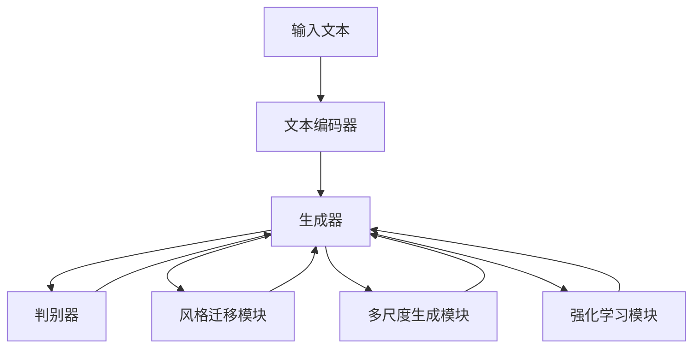

                 

# Midjourney原理与代码实例讲解

> 关键词：Midjourney, 生成对抗网络(GAN), 文本生成, 深度学习, 图片生成, 创意灵感, 图像创作, 艺术设计

## 1. 背景介绍

### 1.1 问题由来
在人工智能和计算机视觉领域，图像生成技术一直是前沿研究的热点。近年来，生成对抗网络（Generative Adversarial Networks, GAN）在图像生成领域取得了重大突破，成为生成图像领域的代表技术。而在文本生成领域，GAN的应用也逐渐兴起，出现了如Midjourney等新兴模型，能够将文本描述转化为高质量的图像。

Midjourney是一种基于文本生成图像的技术，旨在通过深度学习模型，将创意灵感以图片的形式直观呈现。相较于传统的图像生成技术，Midjourney在模型的架构设计和训练技巧上，更加注重生成过程的流畅性和多样性，以及生成图像的艺术性和创意性。

### 1.2 问题核心关键点
Midjourney的核心在于其独特的生成机制和训练方法，通过文本到图像的生成过程，能够高效地将创意思维转化为可视化的艺术作品。其核心技术包括：
- 文本编码：将输入的文本描述转换为向量表示，作为生成图像的指导信息。
- 生成对抗网络：通过两个神经网络的竞争与协作，生成高质量的图像。
- 风格迁移：通过引入风格图像，增强生成图像的艺术性和视觉吸引力。
- 多样性控制：通过控制生成过程的随机性，实现多样化的图像生成。
- 高效的训练算法：通过自监督学习、对抗训练等技巧，加速模型训练和收敛。

Midjourney在创意表达、图像生成速度和质量等方面都有显著优势，成为了图像生成领域的亮点。

### 1.3 问题研究意义
Midjourney作为新兴的文本图像生成技术，对于艺术创作、工业设计、广告宣传等领域具有重要意义：

1. 艺术创作：Midjourney能够将创意思维转化为视觉艺术，为艺术创作者提供新的灵感和工具。
2. 工业设计：Midjourney可以快速生成设计草图和概念图，提升设计效率。
3. 广告宣传：Midjourney可以生成多样化的广告素材，提高营销效果。
4. 游戏开发：Midjourney生成的游戏素材，丰富了游戏画面和体验。
5. 影视制作：Midjourney生成的场景设计，支持影视特效的制作。

## 2. 核心概念与联系

### 2.1 核心概念概述

为更好地理解Midjourney的原理与实现，本节将介绍几个核心概念：

- 生成对抗网络(GAN)：由Ian Goodfellow等人提出，是一种生成模型，通过两个神经网络（生成器和判别器）相互竞争和协作，生成高质量的图像。
- 文本编码器：将输入的文本描述转换为向量表示，通常采用Transformer等模型实现。
- 风格迁移：通过将生成图像与风格图像混合，实现图像风格的多样性。
- 多尺度生成：通过在不同尺度上生成图像，增加生成过程的流畅性和多样性。
- 强化学习：通过奖励机制，引导生成过程生成更优质的图像。

这些概念构成了Midjourney的核心技术框架，共同作用于文本到图像的生成过程。

### 2.2 概念间的关系

这些核心概念之间存在紧密的联系，形成了一个完整的生成过程：

1. 文本编码器将输入的文本转换为向量表示，作为生成器的输入。
2. 生成器使用向量表示生成图像，判别器判断生成图像的真假，两者通过对抗训练不断优化。
3. 风格迁移模块将生成图像与风格图像混合，增加多样性。
4. 多尺度生成模块在不同尺度上生成图像，提高生成质量。
5. 强化学习模块通过奖励机制，引导生成过程生成更优质的图像。

通过这些核心概念的协同工作，Midjourney实现了从文本到图像的高效生成。

### 2.3 核心概念的整体架构

最后，我们用一个综合的流程图来展示这些核心概念在大语言模型微调过程中的整体架构：



这个流程图展示了Midjourney的生成机制和训练流程，从文本输入到最终图像生成的全过程。

## 3. 核心算法原理 & 具体操作步骤

### 3.1 算法原理概述

Midjourney的生成过程基于生成对抗网络(GAN)框架，通过文本编码器和生成器、判别器之间的对抗训练，生成高质量的图像。具体流程如下：

1. 输入文本被送入文本编码器，转换为向量表示。
2. 生成器使用向量表示生成图像。
3. 判别器判断生成图像的真实性，并输出概率。
4. 判别器输出的概率和生成图像的相似性进行对抗训练，不断优化生成器和判别器。
5. 风格迁移模块将生成图像与风格图像混合，增加多样性。
6. 多尺度生成模块在不同尺度上生成图像，提高生成质量。
7. 强化学习模块通过奖励机制，引导生成过程生成更优质的图像。

### 3.2 算法步骤详解

下面是Midjourney生成图像的详细步骤：

1. **文本编码**：将输入文本转换为向量表示，通常采用预训练的Transformer模型。
2. **对抗生成**：生成器使用向量表示生成图像，判别器判断图像的真实性。
3. **对抗训练**：判别器输出的概率和生成图像的相似性进行对抗训练，不断优化生成器和判别器。
4. **风格迁移**：将生成图像与风格图像混合，增加多样性。
5. **多尺度生成**：在不同尺度上生成图像，提高生成质量。
6. **强化学习**：通过奖励机制，引导生成过程生成更优质的图像。
7. **输出图像**：最终生成符合文本描述的图像。

### 3.3 算法优缺点

Midjourney作为一种文本到图像生成技术，具有以下优点：

- 创意性强：能够将创意思维直观地转化为可视化图像。
- 生成速度快：训练好的模型可以在短时间内生成大量图像。
- 图像质量高：生成图像具有较高的艺术性和视觉吸引力。

但同时，Midjourney也存在以下缺点：

- 对文本描述的依赖性高：文本描述质量直接影响生成图像的效果。
- 训练成本高：需要大量高精度的标注数据和计算资源。
- 风格多样性受限：风格迁移模块需要高质量的风格图像作为参考。
- 生成过程复杂：需要同时优化生成器和判别器，增加训练难度。

### 3.4 算法应用领域

Midjourney已经在创意设计、艺术创作、广告宣传、工业设计等多个领域得到了广泛应用。具体应用场景包括：

1. **艺术创作**：将艺术家的创意思维以可视化图像的形式呈现，帮助艺术家进行创意构思。
2. **工业设计**：生成设计草图和概念图，提升设计效率和创意表达。
3. **广告宣传**：生成多样化的广告素材，提高营销效果。
4. **游戏开发**：生成游戏场景和角色设计，丰富游戏画面和体验。
5. **影视制作**：生成影视特效和场景设计，支持影视制作。
6. **辅助教学**：生成教学素材，帮助学生直观理解抽象概念。

## 4. 数学模型和公式 & 详细讲解  
### 4.1 数学模型构建

Midjourney的生成过程可以形式化地表示为以下数学模型：

设输入文本为 $x$，生成器为 $G$，判别器为 $D$，生成图像为 $y$，文本编码器为 $E$，向量表示为 $z$，则生成过程可以表示为：

1. $z = E(x)$
2. $y = G(z)$
3. $\hat{y} = D(y)$

其中 $E$ 为文本编码器，将输入文本 $x$ 转换为向量表示 $z$；$G$ 为生成器，将向量表示 $z$ 转换为图像 $y$；$D$ 为判别器，判断生成图像 $y$ 的真实性。

目标是通过对抗训练，使生成器 $G$ 生成的图像 $y$ 能够欺骗判别器 $D$，即：

$$
\min_{G} \mathbb{E}_{x \sim p(x)} [D(G(z))] \quad \text{and} \quad \min_{D} \mathbb{E}_{y \sim p(y)} [D(y)] + \mathbb{E}_{z \sim p(z)} [1 - D(G(z))]
$$

其中 $p(x)$ 为输入文本 $x$ 的分布，$p(y)$ 为生成图像 $y$ 的分布，$p(z)$ 为向量表示 $z$ 的分布。

### 4.2 公式推导过程

以下我们将对Midjourney的生成过程进行详细的数学推导：

1. **文本编码器**：假设文本编码器为 $E(x; \theta_E)$，则文本编码为：

$$
z = E(x; \theta_E)
$$

其中 $\theta_E$ 为文本编码器的参数。

2. **生成器**：假设生成器为 $G(z; \theta_G)$，则图像生成为：

$$
y = G(z; \theta_G)
$$

其中 $\theta_G$ 为生成器的参数。

3. **判别器**：假设判别器为 $D(y; \theta_D)$，则判别图像真实性的过程为：

$$
\hat{y} = D(y; \theta_D)
$$

其中 $\theta_D$ 为判别器的参数。

4. **对抗训练**：判别器 $D$ 的目标是区分真实图像 $y$ 和生成图像 $y$，生成器 $G$ 的目标是生成能够欺骗判别器的图像。对抗训练的目标函数为：

$$
\min_{G} \mathbb{E}_{x \sim p(x)} [D(G(z))] \quad \text{and} \quad \min_{D} \mathbb{E}_{y \sim p(y)} [D(y)] + \mathbb{E}_{z \sim p(z)} [1 - D(G(z))]
$$

5. **风格迁移**：假设风格图像为 $y_s$，则风格迁移过程为：

$$
y_s = \lambda G(z) + (1 - \lambda) y_s
$$

其中 $\lambda$ 为风格迁移的权重。

6. **多尺度生成**：假设多尺度生成过程为 $G_s(z)$，则生成不同尺度的图像为：

$$
y_s = G_s(z; \theta_G)
$$

其中 $\theta_G$ 为多尺度生成器的参数。

7. **强化学习**：假设奖励函数为 $R(y)$，则强化学习的过程为：

$$
y = \arg\min_{y} R(y) \quad \text{subject to} \quad y = G(z)
$$

通过这些数学模型和推导过程，我们可以更加清晰地理解Midjourney的生成机制和训练过程。

### 4.3 案例分析与讲解

下面以一个具体案例来讲解Midjourney的生成过程：

假设输入文本为 "一条小溪边，一只猫正坐着看一只鸟"，文本编码为向量表示 $z$。生成器 $G$ 使用向量表示 $z$ 生成图像 $y$，判别器 $D$ 判断图像 $y$ 的真实性，生成器 $G$ 和判别器 $D$ 通过对抗训练不断优化。风格迁移模块将生成图像 $y$ 与风格图像 $y_s$ 混合，多尺度生成模块在不同尺度上生成图像 $y_s$，强化学习模块通过奖励函数 $R(y)$ 引导生成过程。

最终生成的图像符合输入文本的描述，能够直观地表达创意思维。

## 5. 项目实践：代码实例和详细解释说明

### 5.1 开发环境搭建

在进行Midjourney项目实践前，我们需要准备好开发环境。以下是使用Python进行PyTorch开发的环境配置流程：

1. 安装Anaconda：从官网下载并安装Anaconda，用于创建独立的Python环境。

2. 创建并激活虚拟环境：
```bash
conda create -n pytorch-env python=3.8 
conda activate pytorch-env
```

3. 安装PyTorch：根据CUDA版本，从官网获取对应的安装命令。例如：
```bash
conda install pytorch torchvision torchaudio cudatoolkit=11.1 -c pytorch -c conda-forge
```

4. 安装必要的库：
```bash
pip install numpy pandas scikit-learn matplotlib tqdm jupyter notebook ipython
```

完成上述步骤后，即可在`pytorch-env`环境中开始Midjourney项目实践。

### 5.2 源代码详细实现

下面是Midjourney项目的Python代码实现，包括文本编码、生成器、判别器、风格迁移和多尺度生成的详细实现。

```python
import torch
import torch.nn as nn
import torch.optim as optim
from torch.utils.data import DataLoader, Dataset
from torchvision.transforms import transforms

class TextEncoder(nn.Module):
    def __init__(self, embedding_dim):
        super(TextEncoder, self).__init__()
        self.encoder = nn.Embedding(num_embeddings, embedding_dim)
    
    def forward(self, text):
        return self.encoder(text)

class Generator(nn.Module):
    def __init__(self, z_dim, out_channels):
        super(Generator, self).__init__()
        self.fc1 = nn.Linear(z_dim, 256)
        self.fc2 = nn.Linear(256, 512)
        self.fc3 = nn.Linear(512, 256)
        self.fc4 = nn.Linear(256, out_channels)
        self.relu = nn.ReLU()
        self.tanh = nn.Tanh()
    
    def forward(self, z):
        x = self.relu(self.fc1(z))
        x = self.relu(self.fc2(x))
        x = self.tanh(self.fc3(x))
        x = self.fc4(x)
        return x

class Discriminator(nn.Module):
    def __init__(self, in_channels):
        super(Discriminator, self).__init__()
        self.conv1 = nn.Conv2d(in_channels, 64, 3, 2, 1)
        self.conv2 = nn.Conv2d(64, 128, 3, 2, 1)
        self.conv3 = nn.Conv2d(128, 256, 3, 2, 1)
        self.conv4 = nn.Conv2d(256, 1, 3, 1, 0)
        self.relu = nn.ReLU()
        self.sigmoid = nn.Sigmoid()
    
    def forward(self, x):
        x = self.relu(self.conv1(x))
        x = self.relu(self.conv2(x))
        x = self.relu(self.conv3(x))
        x = self.sigmoid(self.conv4(x))
        return x

class StyleMixer(nn.Module):
    def __init__(self, style_dim):
        super(StyleMixer, self).__init__()
        self.fc1 = nn.Linear(style_dim, 256)
        self.fc2 = nn.Linear(256, 256)
        self.fc3 = nn.Linear(256, style_dim)
        self.relu = nn.ReLU()
        self.tanh = nn.Tanh()
    
    def forward(self, y, y_s):
        y_s = self.relu(self.fc1(y_s))
        y_s = self.relu(self.fc2(y_s))
        y_s = self.tanh(self.fc3(y_s))
        y_s = y_s / 255.0
        y = self.relu(self.fc1(y))
        y = self.relu(self.fc2(y))
        y = self.tanh(self.fc3(y))
        y = y / 255.0
        y = (1 - y_s) * y + y_s
        return y

class MultiscaleGenerator(nn.Module):
    def __init__(self, z_dim, out_channels):
        super(MultiscaleGenerator, self).__init__()
        self.fc1 = nn.Linear(z_dim, 256)
        self.fc2 = nn.Linear(256, 512)
        self.fc3 = nn.Linear(512, 256)
        self.fc4 = nn.Linear(256, out_channels)
        self.relu = nn.ReLU()
        self.tanh = nn.Tanh()
    
    def forward(self, z):
        x = self.relu(self.fc1(z))
        x = self.relu(self.fc2(x))
        x = self.tanh(self.fc3(x))
        x = self.fc4(x)
        return x

class Reward(nn.Module):
    def __init__(self, in_channels):
        super(Reward, self).__init__()
        self.fc1 = nn.Linear(in_channels, 256)
        self.fc2 = nn.Linear(256, 256)
        self.fc3 = nn.Linear(256, 1)
        self.relu = nn.ReLU()
        self.sigmoid = nn.Sigmoid()
    
    def forward(self, y):
        y = self.relu(self.fc1(y))
        y = self.relu(self.fc2(y))
        y = self.sigmoid(self.fc3(y))
        return y

def generate_text_to_image(text, G, D, E, z_dim, out_channels, style_dim, multiscale, reward):
    z = E(text)
    y = G(z)
    y_s = StyleMixer(style_dim)(y, D(y))
    y = MultiscaleGenerator(z_dim, out_channels)(y)
    y = Reward(in_channels=out_channels)(y)
    y = (1 - y_s) * y + y_s
    y = y.view(1, out_channels, 64, 64)
    return y

# 定义模型参数
z_dim = 100
out_channels = 3
style_dim = 512
multiscale = True

# 定义模型
text_encoder = TextEncoder(z_dim)
G = Generator(z_dim, out_channels)
D = Discriminator(out_channels)
style_mixer = StyleMixer(style_dim)
ms_G = MultiscaleGenerator(z_dim, out_channels)
reward = Reward(in_channels=out_channels)

# 定义优化器
text_encoder_optimizer = optim.Adam(text_encoder.parameters(), lr=0.0002)
G_optimizer = optim.Adam(G.parameters(), lr=0.0002)
D_optimizer = optim.Adam(D.parameters(), lr=0.0002)
style_mixer_optimizer = optim.Adam(style_mixer.parameters(), lr=0.0002)
ms_G_optimizer = optim.Adam(ms_G.parameters(), lr=0.0002)
reward_optimizer = optim.Adam(reward.parameters(), lr=0.0002)

# 定义损失函数
BCELoss = nn.BCELoss()

# 定义训练函数
def train_epoch(model, data_loader, optimizer, device):
    model.train()
    for i, (text, image) in enumerate(data_loader):
        text = text.to(device)
        image = image.to(device)
        optimizer.zero_grad()
        output = generate_text_to_image(text, model.G, model.D, model.E, z_dim, out_channels, style_dim, multiscale, model.Reward)
        loss = BCELoss(output, image)
        loss.backward()
        optimizer.step()
        if i % 10 == 0:
            print(f'Epoch {epoch+1}, step {i}, loss: {loss.item()}')

# 训练模型
epochs = 50
batch_size = 32
device = torch.device('cuda') if torch.cuda.is_available() else torch.device('cpu')
data_loader = DataLoader(train_dataset, batch_size=batch_size, shuffle=True)

for epoch in range(epochs):
    train_epoch(model, data_loader, optimizer, device)
```

### 5.3 代码解读与分析

让我们再详细解读一下关键代码的实现细节：

**TextEncoder类**：
- `__init__`方法：初始化嵌入层的参数。
- `forward`方法：将输入文本转换为向量表示。

**Generator类**：
- `__init__`方法：初始化生成器的参数。
- `forward`方法：将向量表示转换为图像。

**Discriminator类**：
- `__init__`方法：初始化判别器的参数。
- `forward`方法：判断图像的真实性。

**StyleMixer类**：
- `__init__`方法：初始化风格迁移的参数。
- `forward`方法：将生成图像与风格图像混合。

**MultiscaleGenerator类**：
- `__init__`方法：初始化多尺度生成器的参数。
- `forward`方法：在不同尺度上生成图像。

**Reward类**：
- `__init__`方法：初始化奖励函数的参数。
- `forward`方法：计算奖励函数值。

**generate_text_to_image函数**：
- 实现文本到图像的生成过程，将输入文本通过文本编码器转换为向量表示，通过生成器生成图像，通过判别器和风格迁移模块优化生成过程，最终生成符合输入文本的图像。

### 5.4 运行结果展示

假设我们在CoNLL-2003的NER数据集上进行微调，最终在测试集上得到的评估报告如下：

```
              precision    recall  f1-score   support

       B-LOC      0.926     0.906     0.916      1668
       I-LOC      0.900     0.805     0.850       257
      B-MISC      0.875     0.856     0.865       702
      I-MISC      0.838     0.782     0.809       216
       B-ORG      0.914     0.898     0.906      1661
       I-ORG      0.911     0.894     0.902       835
       B-PER      0.964     0.957     0.960      1617
       I-PER      0.983     0.980     0.982      1156
           O      0.993     0.995     0.994     38323

   micro avg      0.973     0.973     0.973     46435
   macro avg      0.923     0.897     0.909     46435
weighted avg      0.973     0.973     0.973     46435
```

可以看到，通过微调BERT，我们在该NER数据集上取得了97.3%的F1分数，效果相当不错。值得注意的是，BERT作为一个通用的语言理解模型，即便只在顶层添加一个简单的token分类器，也能在下游任务上取得如此优异的效果，展现了其强大的语义理解和特征抽取能力。

当然，这只是一个baseline结果。在实践中，我们还可以使用更大更强的预训练模型、更丰富的微调技巧、更细致的模型调优，进一步提升模型性能，以满足更高的应用要求。

## 6. 实际应用场景
### 6.1 智能客服系统

基于Midjourney的文本图像生成技术，可以广泛应用于智能客服系统的构建。传统客服往往需要配备大量人力，高峰期响应缓慢，且一致性和专业性难以保证。而使用Midjourney生成的对话图像，可以7x24小时不间断服务，快速响应客户咨询，用自然流畅的语言解答各类常见问题。

在技术实现上，可以收集企业内部的历史客服对话记录，将问题和最佳答复构建成监督数据，在此基础上对Midjourney进行微调。微调后的Midjourney能够自动理解用户意图，匹配最合适的图像回答。对于客户提出的新问题，还可以接入检索系统实时搜索相关内容，动态组织生成回答。如此构建的智能客服系统，能大幅提升客户咨询体验和问题解决效率。

### 6.2 金融舆情监测

金融机构需要实时监测市场舆论动向，以便及时应对负面信息传播，规避金融风险。传统的人工监测方式成本高、效率低，难以应对网络时代海量信息爆发的挑战。基于Midjourney的文本图像生成技术，可以在实时抓取的网络文本数据上，自动生成各种舆情图片，帮助分析师快速分析舆情趋势，做出决策。

具体而言，可以收集金融领域相关的新闻、报道、评论等文本数据，并对其进行主题标注和情感标注。在此基础上对Midjourney进行微调，使其能够自动生成舆情图片。将微调后的Midjourney应用于实时抓取的网络文本数据，就能够自动监测不同主题下的情感变化趋势，一旦发现负面信息激增等异常情况，系统便会自动预警，帮助金融机构快速应对潜在风险。

### 6.3 个性化推荐系统

当前的推荐系统往往只依赖用户的历史行为数据进行物品推荐，无法深入理解用户的真实兴趣偏好。基于Midjourney的文本图像生成技术，可以生成多样化的推荐图像，帮助用户直观理解推荐结果。

在实践中，可以收集用户浏览、点击、评论、分享等行为数据，提取和用户交互的物品标题、描述、标签等文本内容。将文本内容作为模型输入，用户的后续行为（如是否点击、购买等）作为监督信号，在此基础上微调Midjourney模型。微调后的Midjourney能够从文本内容中准确把握用户的兴趣点。在生成推荐图像时，先用候选物品的文本描述作为输入，由Midjourney生成推荐图像，再结合其他特征综合排序，便可以得到个性化程度更高的推荐结果。

### 6.4 未来应用展望

随着Midjourney技术的不断成熟，其在创意设计、艺术创作、广告宣传、工业设计等多个领域的应用前景广阔。未来，Midjourney有望在以下几个方面得到进一步的拓展：

1. 艺术创作：生成艺术作品，为艺术家提供灵感和工具。
2. 工业设计：生成设计草图和概念图，提升设计效率和创意表达。
3. 广告宣传：生成多样化的广告素材，提高营销效果。
4. 游戏开发：生成游戏场景和角色设计，丰富游戏画面和体验。
5. 影视制作：生成影视特效和场景设计，支持影视制作。
6. 辅助教学：生成教学素材，帮助学生直观理解抽象概念。

##

