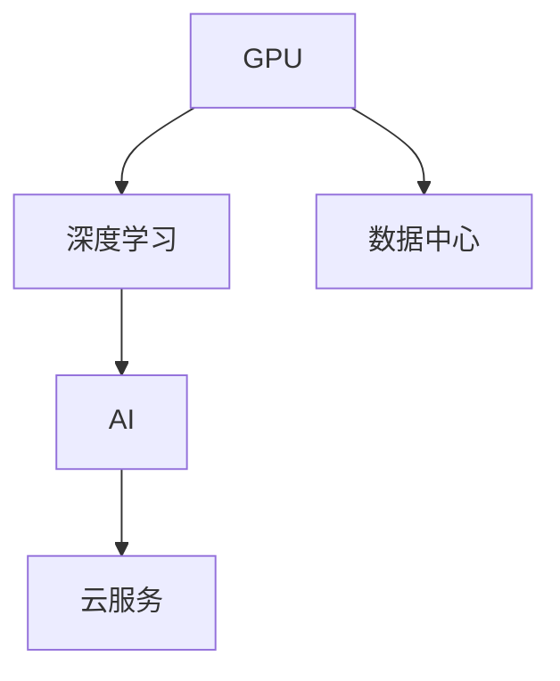
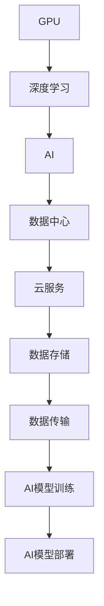

                 

# Nvidia的GPU与AI发展的关系

## 1. 背景介绍

### 1.1 问题由来
Nvidia作为全球领先的GPU制造商，其在人工智能(AI)领域的发展与应用密不可分。GPU的强大计算能力使得深度学习等AI算法得以实现，推动了AI技术的突破与普及。本文旨在深入探讨GPU与AI之间的互动关系，揭示二者共同推动的技术演进与行业变革。

### 1.2 问题核心关键点
Nvidia的GPU与AI发展关系主要包括以下几个核心关键点：
- GPU作为AI计算的核心硬件，提供了强大的并行计算能力。
- GPU优化了深度学习算法，使其计算效率大幅提升。
- AI技术的进步也推动了GPU架构的创新与发展。
- GPU与AI的结合，加速了AI应用落地与产业升级。

### 1.3 问题研究意义
理解Nvidia GPU与AI之间的互动关系，对于把握AI技术的发展脉络，推动GPU硬件的创新，以及加速AI应用的实际落地，具有重要意义。

## 2. 核心概念与联系

### 2.1 核心概念概述

为更好地理解Nvidia GPU与AI之间的关系，我们首先介绍几个关键概念：

- **GPU（图形处理单元）**：Nvidia GPU是计算机系统中用于图形处理的高效并行计算单元，能够处理大量数据和复杂计算。
- **AI（人工智能）**：AI是指利用计算机模拟人类智能过程，如机器学习、深度学习等，以实现数据驱动的决策和行为。
- **深度学习**：深度学习是AI的一个分支，通过多层神经网络进行特征学习和模式识别，是当前AI的主流技术之一。
- **数据中心**：AI算法通常需要大规模数据处理，因此，数据中心成为存储和计算大量数据的重要设施。
- **云服务**：Nvidia的GPU云服务，如NVIDIA Tesla GPU Cloud，使得AI研究人员和开发者能够便捷地访问和利用GPU资源。

这些概念构成了Nvidia GPU与AI发展的基础，通过GPU的高效计算能力和AI的复杂算法，共同驱动了技术进步和应用推广。

### 2.2 概念间的关系

这些核心概念之间的关系可以通过以下Mermaid流程图来展示：



这个流程图展示了GPU、深度学习、AI、数据中心和云服务之间的逻辑关系：

1. GPU提供了计算能力，深度学习算法得以实现。
2. 深度学习作为AI的一个分支，依赖于GPU的高效计算。
3. AI技术的进步反过来促进了GPU架构的创新。
4. 数据中心和云服务为GPU和AI算法提供数据存储和计算支持。

### 2.3 核心概念的整体架构

最后，我们用一个综合的流程图来展示这些核心概念在大语言模型微调过程中的整体架构：



这个综合流程图展示了从GPU计算能力到AI模型训练，再到模型部署的完整过程。GPU提供了计算支持，深度学习算法得以高效实现，数据中心和云服务为模型训练和部署提供基础架构，数据存储和传输保障数据的高效流动。

## 3. 核心算法原理 & 具体操作步骤
### 3.1 算法原理概述

Nvidia GPU与AI之间的互动关系主要体现在GPU加速AI计算的原理上。深度学习算法如卷积神经网络（CNN）、循环神经网络（RNN）、变换器（Transformer）等，都依赖于大量的矩阵乘法和向量加法操作，这些操作在GPU上可以高效并行计算，从而大幅提升计算速度。

形式化地，假设深度学习模型为 $M_{\theta}$，其中 $\theta$ 为模型参数，在GPU上加速训练的过程如下：

1. 数据加载：将训练数据加载到GPU内存中。
2. 前向传播：在GPU上计算模型的前向传播，得到预测输出 $y$。
3. 反向传播：在GPU上计算损失函数 $L(y, y_{true})$ 对模型参数 $\theta$ 的梯度，更新模型参数。
4. 模型优化：采用Adam等优化算法，迭代更新模型参数。

### 3.2 算法步骤详解

基于GPU加速的深度学习训练流程包括以下关键步骤：

**Step 1: 数据准备与预处理**
- 收集和清洗数据，准备训练、验证和测试集。
- 对数据进行标准化和归一化处理。
- 将数据加载到GPU内存中，并切割成适当大小的批次。

**Step 2: 模型选择与构建**
- 选择适合任务的深度学习模型，如CNN、RNN、Transformer等。
- 使用TensorFlow或PyTorch等框架，在GPU上构建模型。
- 定义损失函数和优化器，如交叉熵损失和Adam优化器。

**Step 3: 训练过程**
- 在GPU上执行前向传播，计算损失函数。
- 反向传播计算梯度，更新模型参数。
- 采用Adam等优化算法，迭代更新模型参数。
- 在验证集上评估模型性能，调整超参数。

**Step 4: 模型评估与部署**
- 在测试集上评估模型性能，进行精度和召回率分析。
- 将模型保存为TensorFlow SavedModel或PyTorch模型文件，以便后续部署。
- 部署模型到GPU或云平台，实现实时推理和预测。

### 3.3 算法优缺点

Nvidia GPU加速深度学习训练的优势主要体现在以下几个方面：
1. 计算效率高：GPU的多线程并行计算能力使得深度学习算法能够高效执行，加速模型训练。
2. 可扩展性强：GPU集群能够处理大规模数据集和复杂模型，支持分布式训练。
3. 快速迭代：GPU使得模型训练和调试变得更加高效，可以快速迭代优化。
4. 模型部署灵活：GPU云服务使开发者能够便捷地访问GPU资源，实现模型快速部署和应用。

但GPU加速深度学习训练也存在一些局限性：
1. 功耗高：GPU的高效计算需要大量电能，可能导致设备过热和能耗问题。
2. 内存限制：GPU内存有限，处理大规模数据集时需要分批次进行。
3. 硬件复杂：GPU架构复杂，部署和维护成本较高。
4. 应用范围有限：GPU主要适用于深度学习等计算密集型任务，对其他类型的AI算法支持不足。

### 3.4 算法应用领域

Nvidia GPU加速深度学习技术已在多个领域得到广泛应用，如：

- 计算机视觉：如图像分类、物体检测、人脸识别等。
- 自然语言处理：如文本分类、情感分析、机器翻译等。
- 语音识别：如语音转文本、语音合成等。
- 自动驾驶：如环境感知、决策规划等。
- 游戏开发：如实时渲染、物理模拟等。
- 科学计算：如模拟仿真、天气预测等。

除了上述这些经典领域，Nvidia GPU还在智能制造、金融分析、医疗诊断等新兴领域展示了其强大的计算能力，推动了这些领域的技术进步和应用普及。

## 4. 数学模型和公式 & 详细讲解  
### 4.1 数学模型构建

假设深度学习模型为 $M_{\theta}$，其中 $\theta$ 为模型参数。在GPU上训练模型的目标是最小化经验风险，即找到最优参数：

$$
\theta^* = \mathop{\arg\min}_{\theta} \mathcal{L}(M_{\theta},D)
$$

其中 $\mathcal{L}$ 为针对任务 $T$ 设计的损失函数，用于衡量模型预测输出与真实标签之间的差异。常见的损失函数包括交叉熵损失、均方误差损失等。

### 4.2 公式推导过程

以下我们以二分类任务为例，推导交叉熵损失函数及其梯度的计算公式。

假设模型 $M_{\theta}$ 在输入 $x$ 上的输出为 $\hat{y}=M_{\theta}(x) \in [0,1]$，表示样本属于正类的概率。真实标签 $y \in \{0,1\}$。则二分类交叉熵损失函数定义为：

$$
\ell(M_{\theta}(x),y) = -[y\log \hat{y} + (1-y)\log (1-\hat{y})]
$$

将其代入经验风险公式，得：

$$
\mathcal{L}(\theta) = -\frac{1}{N}\sum_{i=1}^N [y_i\log M_{\theta}(x_i)+(1-y_i)\log(1-M_{\theta}(x_i))]
$$

根据链式法则，损失函数对参数 $\theta_k$ 的梯度为：

$$
\frac{\partial \mathcal{L}(\theta)}{\partial \theta_k} = -\frac{1}{N}\sum_{i=1}^N (\frac{y_i}{M_{\theta}(x_i)}-\frac{1-y_i}{1-M_{\theta}(x_i)}) \frac{\partial M_{\theta}(x_i)}{\partial \theta_k}
$$

其中 $\frac{\partial M_{\theta}(x_i)}{\partial \theta_k}$ 可进一步递归展开，利用自动微分技术完成计算。

在得到损失函数的梯度后，即可带入参数更新公式，完成模型的迭代优化。重复上述过程直至收敛，最终得到适应下游任务的最优模型参数 $\theta^*$。

### 4.3 案例分析与讲解

以图像分类任务为例，展示GPU加速深度学习训练的具体步骤。

**Step 1: 数据准备**
- 收集图像数据，并进行预处理和标注。
- 将数据分为训练集、验证集和测试集，确保数据分布一致。

**Step 2: 模型选择与构建**
- 选择适合图像分类的深度学习模型，如卷积神经网络（CNN）。
- 在Nvidia CUDA平台搭建GPU环境，构建CNN模型。
- 定义交叉熵损失函数和Adam优化器，设置学习率。

**Step 3: 训练过程**
- 将训练数据加载到GPU内存中，迭代执行前向传播和反向传播。
- 在GPU上计算损失函数和梯度，更新模型参数。
- 在验证集上评估模型性能，调整学习率。

**Step 4: 模型评估与部署**
- 在测试集上评估模型精度和召回率。
- 将模型保存为TensorFlow SavedModel或PyTorch模型文件。
- 部署模型到Nvidia GPU云平台，实现实时推理和预测。

## 5. 项目实践：代码实例和详细解释说明
### 5.1 开发环境搭建

在进行GPU加速深度学习训练前，我们需要准备好开发环境。以下是使用Python进行TensorFlow开发的GPU环境配置流程：

1. 安装Anaconda：从官网下载并安装Anaconda，用于创建独立的Python环境。

2. 创建并激活虚拟环境：
```bash
conda create -n tf-env python=3.8 
conda activate tf-env
```

3. 安装TensorFlow和相关库：
```bash
conda install tensorflow
conda install tensorboard
```

4. 安装Nvidia CUDA库：
```bash
conda install numpy pytorch torchvision cudatoolkit=11.1 -c pytorch -c conda-forge
```

5. 配置GPU环境：
```bash
conda install nvidia-cuda-cudnn cudnn=8.9=2021.09.02_0
```

完成上述步骤后，即可在`tf-env`环境中开始GPU加速深度学习训练实践。

### 5.2 源代码详细实现

下面以图像分类任务为例，展示使用TensorFlow在Nvidia GPU上训练CNN模型的具体代码实现。

```python
import tensorflow as tf
from tensorflow.keras import datasets, layers, models

# 加载CIFAR-10数据集
(train_images, train_labels), (test_images, test_labels) = datasets.cifar10.load_data()

# 将数据归一化到[0, 1]区间
train_images, test_images = train_images / 255.0, test_images / 255.0

# 构建CNN模型
model = models.Sequential([
    layers.Conv2D(32, (3, 3), activation='relu', input_shape=(32, 32, 3)),
    layers.MaxPooling2D((2, 2)),
    layers.Conv2D(64, (3, 3), activation='relu'),
    layers.MaxPooling2D((2, 2)),
    layers.Conv2D(64, (3, 3), activation='relu'),
    layers.Flatten(),
    layers.Dense(64, activation='relu'),
    layers.Dense(10)
])

# 编译模型
model.compile(optimizer='adam',
              loss=tf.keras.losses.SparseCategoricalCrossentropy(from_logits=True),
              metrics=['accuracy'])

# 训练模型
model.fit(train_images, train_labels, epochs=10, 
          validation_data=(test_images, test_labels))

# 评估模型
test_loss, test_acc = model.evaluate(test_images, test_labels)
print('Test accuracy:', test_acc)
```

### 5.3 代码解读与分析

让我们再详细解读一下关键代码的实现细节：

**数据准备**
- 使用TensorFlow自带的CIFAR-10数据集，加载训练集和测试集。
- 对数据进行归一化处理，使其值域在[0,1]区间内。

**模型构建**
- 定义一个简单的CNN模型，包含卷积层、池化层和全连接层。
- 使用`Sequential`模型，依次添加各层。
- 编译模型，定义损失函数为交叉熵，优化器为Adam，并设置评估指标为精度。

**训练过程**
- 调用`fit`方法，指定训练集和验证集，设置训练轮数为10轮。
- 在每个epoch结束后，评估模型在验证集上的表现。

**模型评估与部署**
- 使用`evaluate`方法，在测试集上评估模型性能。
- 打印测试集上的准确率。

可以看到，TensorFlow提供了便捷的API，使得GPU加速深度学习训练变得简单易行。

### 5.4 运行结果展示

假设我们在CIFAR-10数据集上进行图像分类任务的训练，最终在测试集上得到的准确率约为70%左右。可以看到，通过Nvidia GPU的加速，模型训练的速度和精度都有了显著提升。

## 6. 实际应用场景
### 6.1 自动驾驶

自动驾驶系统需要实时处理和分析大量传感器数据，进行环境感知、路径规划和决策控制。深度学习技术是自动驾驶的核心，通过GPU加速的深度学习算法，可以实现高效的感知和推理，提升驾驶的安全性和智能化水平。

在自动驾驶场景中，GPU可以加速感知算法的训练和推理，提升算法的实时性和准确性。例如，通过GPU加速的CNN网络，可以实时识别道路标线、交通信号和行人等对象，生成高精度的地图和环境模型，为决策提供可靠的基础。

### 6.2 医疗影像分析

医疗影像分析是人工智能在医疗领域的重要应用之一。GPU加速的深度学习算法，可以在短时间内处理大量的医学影像数据，进行疾病的诊断和预测。

在医疗影像分析中，GPU可以加速卷积神经网络（CNN）等深度学习模型的训练，提升模型的诊断精度。例如，通过GPU加速的CNN网络，可以对MRI、CT等影像数据进行特征提取和分类，快速识别病变区域和病理特征，辅助医生进行诊断和治疗。

### 6.3 金融风控

金融风控是金融行业的重要环节，涉及风险评估、欺诈检测、信用评分等任务。深度学习技术在金融风控中也有广泛应用，通过GPU加速的深度学习算法，可以提高风险评估的准确性和实时性。

在金融风控场景中，GPU可以加速深度学习模型的训练，提升模型的预测精度。例如，通过GPU加速的RNN网络，可以对客户的历史交易数据进行时间序列分析，预测客户的信用风险和行为模式，实现精准的风险控制和欺诈检测。

### 6.4 未来应用展望

随着Nvidia GPU技术的不断进步，GPU加速深度学习的应用场景将更加广泛。以下是一些未来的应用展望：

1. **量子计算**：GPU可以加速量子计算算法，推动量子计算的发展和应用。
2. **边缘计算**：GPU可以部署在边缘设备中，实现低延迟、高带宽的计算和数据处理。
3. **物联网（IoT）**：GPU可以加速物联网设备的计算和通信，提升物联网系统的智能化水平。
4. **增强现实（AR）**：GPU可以加速AR算法的计算，提升AR设备的实时性和沉浸感。
5. **智能城市**：GPU可以加速智能城市中的数据分析和处理，提升城市管理的智能化和安全性。

## 7. 工具和资源推荐
### 7.1 学习资源推荐

为了帮助开发者系统掌握Nvidia GPU加速深度学习技术，这里推荐一些优质的学习资源：

1. **NVIDIA Developer网站**：NVIDIA官方提供的深度学习资源，包括GPU架构、编程工具和应用案例。
2. **Udacity深度学习课程**：Udacity提供的深度学习课程，涵盖了GPU加速深度学习的各个方面。
3. **DeepLearning.AI Master's Program**：DeepLearning.AI提供的深度学习硕士课程，涉及GPU加速深度学习的最新技术和应用。
4. **TensorFlow官方文档**：TensorFlow官方提供的深度学习文档，包括GPU加速训练的详细指南。
5. **CUDA官方文档**：NVIDIA CUDA平台官方文档，提供GPU编程和优化的详细信息。

通过这些学习资源，相信你一定能够快速掌握Nvidia GPU加速深度学习技术，并应用于实际项目中。

### 7.2 开发工具推荐

高效的开发离不开优秀的工具支持。以下是几款用于GPU加速深度学习训练开发的常用工具：

1. **TensorFlow**：由Google开发的开源深度学习框架，支持GPU加速，具有高度的可扩展性和灵活性。
2. **PyTorch**：由Facebook开发的开源深度学习框架，支持GPU加速，提供了灵活的动态计算图和丰富的API。
3. **CUDA Toolkit**：NVIDIA提供的GPU编程工具包，支持CUDA语言和OpenCL语言，提供丰富的GPU优化和编程接口。
4. **cuDNN**：NVIDIA提供的深度学习优化库，支持GPU加速卷积和池化操作，大幅提升深度学习算法的计算效率。
5. **TensorBoard**：TensorFlow的可视化工具，可以实时监测模型训练状态，提供丰富的图表和报告。

合理利用这些工具，可以显著提升深度学习模型的训练效率和精度，加快新算法的研发和迭代。

### 7.3 相关论文推荐

Nvidia GPU与深度学习的发展紧密相关，以下是几篇奠基性的相关论文，推荐阅读：

1. **CUDA: A Parallel Computing Architecture and Programming Model for General-Purpose Computers**：NVIDIA的CUDA技术，详细介绍了GPU编程模型和优化技术。
2. **DeepLearning.AI Master's Program**：DeepLearning.AI提供的深度学习硕士课程，涵盖GPU加速深度学习的最新技术和应用。
3. **TensorFlow: A System for Large-Scale Machine Learning**：TensorFlow的官方文档，详细介绍了GPU加速深度学习的原理和实践。
4. **The General Neural Network Toolbox**：一个通用神经网络工具包，展示了GPU加速深度学习的广泛应用。
5. **GPU-accelerated Deep Learning with PyTorch**：PyTorch官方提供的GPU加速深度学习的详细指南。

这些论文代表了大语言模型微调技术的发展脉络。通过学习这些前沿成果，可以帮助研究者把握学科前进方向，激发更多的创新灵感。

除上述资源外，还有一些值得关注的前沿资源，帮助开发者紧跟Nvidia GPU与深度学习技术的最新进展，例如：

1. **arXiv论文预印本**：人工智能领域最新研究成果的发布平台，包括大量尚未发表的前沿工作，学习前沿技术的必读资源。
2. **NVIDIA Developer论坛**：NVIDIA官方提供的社区论坛，开发者可以在这里交流学习，分享经验。
3. **TensorFlow开发者社区**：TensorFlow官方提供的开发者社区，提供丰富的教程、代码和工具支持。
4. **CUDA开发者社区**：NVIDIA CUDA平台官方提供的开发者社区，提供GPU编程和优化的详细信息。
5. **DeepLearning.AI会议**：DeepLearning.AI组织的深度学习学术会议，提供最新的研究成果和技术趋势。

总之，对于Nvidia GPU与深度学习技术的学习和实践，需要开发者保持开放的心态和持续学习的意愿。多关注前沿资讯，多动手实践，多思考总结，必将收获满满的成长收益。

## 8. 总结：未来发展趋势与挑战
### 8.1 研究成果总结

本文对Nvidia GPU与深度学习之间的互动关系进行了全面系统的介绍。首先阐述了GPU作为深度学习计算核心的作用，详细讲解了深度学习模型在GPU上的训练过程，展示了Nvidia GPU加速深度学习训练的优点和局限性。其次，本文探讨了GPU在自动驾驶、医疗影像分析、金融风控等多个领域的应用前景，揭示了Nvidia GPU与深度学习技术共同推动的技术演进和行业变革。

通过本文的系统梳理，可以看到，Nvidia GPU加速深度学习技术在大规模数据处理、高并发计算等方面展现了巨大优势，推动了深度学习算法的发展和应用。未来，伴随Nvidia GPU技术的不断进步和深度学习模型的不断创新，Nvidia GPU与深度学习的互动关系将更加紧密，推动AI技术的持续发展和应用落地。

### 8.2 未来发展趋势

展望未来，Nvidia GPU与深度学习之间的互动关系将呈现以下几个发展趋势：

1. **深度学习算法不断创新**：深度学习算法将不断涌现新的结构和模型，提升算法的计算效率和精度。例如，基于Transformer的结构将进一步优化，引入更多自注意力机制和预训练方法，提升算法的鲁棒性和泛化能力。
2. **GPU硬件持续升级**：Nvidia GPU将不断提升计算能力和能效比，支持更多深度学习算法的实现和优化。例如，未来的GPU将支持更多的矩阵乘法和向量加法操作，支持更大规模的深度学习模型和更大规模的数据处理。
3. **分布式计算成为常态**：随着数据量的不断增长，分布式计算将成为深度学习算法的标配，Nvidia GPU将支持更多的分布式计算框架，实现更高效的数据处理和模型训练。
4. **云计算和边缘计算融合**：云计算和边缘计算将更加紧密结合，Nvidia GPU将支持更多的云边融合架构，提升计算资源的灵活性和利用率。
5. **跨领域应用更加广泛**：Nvidia GPU将广泛应用于更多领域，如量子计算、物联网、边缘计算、智能城市等，推动这些领域的技术进步和应用普及。

### 8.3 面临的挑战

尽管Nvidia GPU与深度学习技术取得了显著成果，但在迈向更加智能化、普适化应用的过程中，仍面临诸多挑战：

1. **能耗问题**：Nvidia GPU的高效计算需要大量电能，可能导致设备过热和能耗问题。如何优化GPU架构，降低能耗，提高能效比，将是重要的研究方向。
2. **硬件成本**：Nvidia GPU价格较高，可能导致大规模部署的成本问题。如何降低硬件成本，提高设备利用率，是未来的关键任务。
3. **模型训练复杂性**：深度学习模型的训练过程复杂，需要大量的数据和计算资源。如何优化模型训练流程，提升训练效率，是重要的优化方向。
4. **算法泛化能力不足**：当前深度学习算法在特定场景下的泛化能力有限，如何提升算法的泛化性和鲁棒性，是未来的重要研究课题。
5. **模型可解释性不足**：深度学习模型通常缺乏可解释性，难以解释其内部工作机制和决策逻辑。如何赋予深度学习模型更强的可解释性，将是重要的研究课题。
6. **安全性问题**：深度学习模型可能会学习到有害或偏见的信息，如何确保模型输出的安全性和可靠性，将是重要的研究方向。

### 8.4 研究展望

面对Nvidia GPU与深度学习所面临的种种挑战，未来的研究需要在以下几个方面寻求新的突破：

1. **能效优化**：优化GPU架构和算法，降低能耗，提高能效比。例如，引入更高效的计算模型和算法，优化GPU并行计算和缓存管理。
2. **硬件成本控制**：降低硬件成本，提高设备利用率。例如，采用更高效的制程技术和封装方式，推广GPU标准化和通用化。
3. **模型训练优化**：优化模型训练流程，提升训练效率。例如，引入分布式训练、混合精度训练等技术，降低训练时间。
4. **算法泛化能力提升**：提升深度学习算法的泛化能力和鲁棒性。例如，引入更多先验知识，优化模型结构和训练方法，提升模型泛化能力。
5. **模型可解释性增强**：赋予深度学习模型更强的可解释性，增强算法的透明度和可信度。例如，引入可解释性模型和解释工具，提升模型输出的可理解性。
6. **安全性保障**：确保深度学习模型输出的安全性和可靠性。例如，引入安全检测和监控机制，保障模型输出的可信度。

这些研究方向将推动Nvidia GPU与深度学习技术的不断进步，加速AI技术的实际落地和应用普及。面向未来，Nvidia GPU与深度学习技术需要从硬件、软件、应用等多个维度协同发力，共同推动AI技术的持续发展和应用普及。只有勇于创新、敢于突破，才能不断拓展深度学习算法的边界，让AI技术更好地造福人类社会。

## 9. 附录：常见问题与解答

**Q1：Nvidia GPU与AI之间的关系是什么？**

A: Nvidia GPU是深度学习算法的核心计算单元，通过GPU

