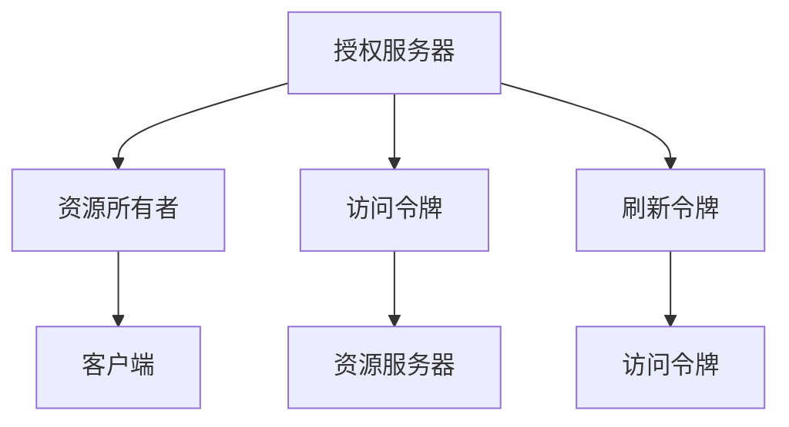
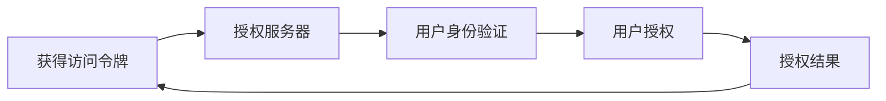
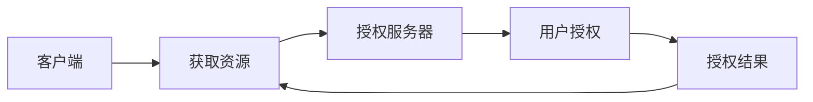
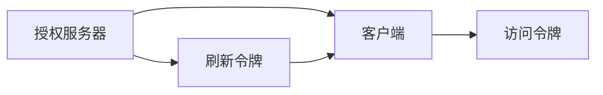
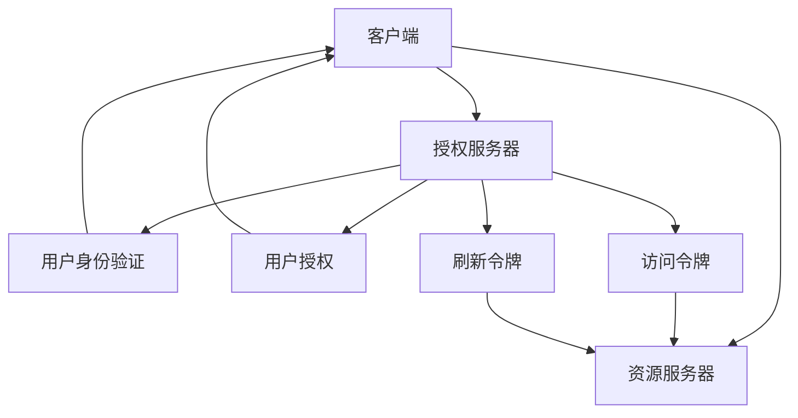

                 

# OAuth 2.0 的详细应用

> 关键词：OAuth 2.0, 认证, 授权, 访问令牌, 资源所有者, 客户端, 用户身份验证, 安全传输

## 1. 背景介绍

### 1.1 问题由来
在现代互联网环境中，各个应用和系统往往需要相互沟通、共享资源，这就涉及到了身份验证和权限管理的问题。传统的用户名和密码方式虽然简单直接，但在用户登录多个应用时容易泄露密码，且容易受到重放攻击和暴力破解等威胁。

OAuth 2.0应运而生，作为一种安全的身份认证和授权协议，广泛应用于各种应用程序和系统之间的数据共享和用户身份验证。其核心思想是将用户身份和权限与具体应用解耦，使得用户可以安全、方便地访问不同应用和系统，同时保障数据传输的安全性和隐私性。

### 1.2 问题核心关键点
OAuth 2.0的核心在于通过授权服务器、客户端和资源所有者三方协作，实现对用户身份和权限的安全管理。其中：

- 授权服务器(Identity Provider, IdP)：负责验证用户身份，并发放访问令牌。
- 客户端(App)：向授权服务器申请访问令牌，并使用令牌访问资源服务器。
- 资源所有者(Resource Owner)：拥有对某个资源的所有权，通过授权服务器授权第三方应用访问资源。

OAuth 2.0的实施主要分为认证(Authentication)和授权(Authorization)两个步骤。认证步骤验证用户身份，授权步骤授权应用访问资源。

### 1.3 问题研究意义
研究OAuth 2.0的详细应用，对于构建安全、高效的互联网系统，确保用户身份和数据的隐私安全，具有重要意义。

- 保障用户隐私。OAuth 2.0通过分离应用和资源，确保用户的身份信息和访问权限仅在授权服务器中存储，防止数据泄露。
- 提高安全性。OAuth 2.0使用访问令牌进行权限控制，即使令牌被截获，也无法直接访问资源，保障数据安全。
- 增强用户体验。OAuth 2.0支持无状态授权，用户无需记住各个应用的登录状态，实现无缝切换。
- 促进应用互操作。OAuth 2.0提供了一套标准化的身份验证和授权协议，不同应用和系统可以互相集成。
- 支持分布式身份认证。OAuth 2.0可以与多种身份认证机制结合，支持多因素身份验证和单点登录。

通过深入理解OAuth 2.0的原理和应用，可以更好地构建安全、可靠、易用的互联网应用，为用户提供更便捷、更安全的访问体验。

## 2. 核心概念与联系

### 2.1 核心概念概述

OAuth 2.0是一个广泛应用的身份认证和授权协议，其核心概念包括：

- 授权服务器：负责验证用户身份和发放访问令牌。
- 资源所有者：拥有某个资源的所有权，可以通过授权服务器授权第三方应用访问资源。
- 客户端：向授权服务器申请访问令牌，并使用令牌访问资源服务器。
- 访问令牌：由授权服务器发放的、用于访问资源的凭证。
- 刷新令牌：用于在令牌过期后刷新新令牌的凭证。

这些概念之间的逻辑关系可以通过以下Mermaid流程图来展示：



这个流程图展示了OAuth 2.0的基本流程：资源所有者向授权服务器授权，授权服务器发放访问令牌，客户端使用令牌访问资源服务器。刷新令牌在令牌过期后用于获取新的访问令牌。

### 2.2 概念间的关系

这些核心概念之间存在着紧密的联系，形成了OAuth 2.0的身份验证和授权体系。下面我通过几个Mermaid流程图来展示这些概念之间的关系。

#### 2.2.1 OAuth 2.0的认证流程



这个流程图展示了OAuth 2.0的认证流程：客户端向授权服务器请求认证，授权服务器验证用户身份，用户授权第三方应用访问资源，授权服务器发放访问令牌。

#### 2.2.2 OAuth 2.0的授权流程



这个流程图展示了OAuth 2.0的授权流程：客户端向资源服务器请求资源，资源服务器向授权服务器查询用户授权情况，授权服务器验证用户授权，资源服务器授权访问。

#### 2.2.3 OAuth 2.0的令牌管理



这个流程图展示了OAuth 2.0的令牌管理流程：客户端向授权服务器申请访问令牌，授权服务器发放访问令牌，客户端使用令牌访问资源服务器。刷新令牌用于在令牌过期后获取新令牌。

### 2.3 核心概念的整体架构

最后，我们用一个综合的流程图来展示OAuth 2.0的整体架构：



这个综合流程图展示了OAuth 2.0的完整流程：客户端向授权服务器请求认证，授权服务器验证用户身份，用户授权第三方应用访问资源，授权服务器发放访问令牌和刷新令牌。客户端使用令牌访问资源服务器。

## 3. 核心算法原理 & 具体操作步骤
### 3.1 算法原理概述

OAuth 2.0的原理主要涉及身份验证和授权两个步骤。以下是具体的算法原理和操作步骤：

**认证步骤：**

1. 客户端向授权服务器发起认证请求，请求获取访问令牌。
2. 授权服务器要求用户输入用户名和密码，验证用户身份。
3. 授权服务器验证用户身份后，向客户端发放访问令牌。
4. 客户端存储访问令牌，用于后续访问资源服务器。

**授权步骤：**

1. 客户端向资源服务器请求访问资源。
2. 资源服务器向授权服务器查询用户授权情况。
3. 授权服务器验证用户授权，发放访问令牌。
4. 客户端使用令牌访问资源服务器，获取所需资源。

### 3.2 算法步骤详解

**认证步骤：**

1. 客户端向授权服务器发起认证请求，请求获取访问令牌。
2. 授权服务器要求用户输入用户名和密码，验证用户身份。
3. 授权服务器验证用户身份后，向客户端发放访问令牌。
4. 客户端存储访问令牌，用于后续访问资源服务器。

**授权步骤：**

1. 客户端向资源服务器请求访问资源。
2. 资源服务器向授权服务器查询用户授权情况。
3. 授权服务器验证用户授权，发放访问令牌。
4. 客户端使用令牌访问资源服务器，获取所需资源。

### 3.3 算法优缺点

OAuth 2.0的优势在于其分离了应用和资源，保障了用户身份和数据的隐私安全。同时，OAuth 2.0支持无状态授权，提高了用户体验。此外，OAuth 2.0提供了一套标准化的身份验证和授权协议，不同应用和系统可以互相集成。

其缺点在于需要额外的授权服务器和令牌管理机制，增加了系统复杂性。同时，授权流程需要用户输入用户名和密码，增加了用户的记忆负担和输入风险。

### 3.4 算法应用领域

OAuth 2.0广泛应用于各种应用程序和系统之间的数据共享和用户身份验证，例如：

- 社交媒体登录：用户可以使用社交媒体账号登录第三方应用。
- 第三方支付：用户可以使用第三方支付账号在电商平台上支付。
- 云服务：用户可以使用云服务账号访问云端资源。
- 单点登录：用户可以使用一个账号登录多个应用，实现无缝切换。
- 系统集成：不同系统之间可以通过OAuth 2.0进行身份验证和数据共享。

除了上述这些应用外，OAuth 2.0还被广泛应用于移动应用、物联网、车联网等领域，为数据安全和用户隐私提供了有力保障。

## 4. 数学模型和公式 & 详细讲解 & 举例说明（备注：数学公式请使用latex格式，latex嵌入文中独立段落使用 $$，段落内使用 $)
### 4.1 数学模型构建

OAuth 2.0的认证和授权过程涉及多个角色和实体，可以用数学模型来表示：

**认证模型：**

- 授权服务器：IdP
- 客户端：App
- 资源所有者：User
- 用户身份验证：V

**授权模型：**

- 授权服务器：IdP
- 客户端：App
- 资源服务器：RS
- 用户授权：A

这些模型的输入输出关系可以用如下表格表示：

| 角色/实体  | 认证模型输入               | 认证模型输出              |
|------------|--------------------------|--------------------------|
| IdP         | App请求令牌认证           | 用户身份验证V            |
| App         | IdP发放访问令牌           | 获取访问令牌T            |
| User        | IdP验证用户身份           | V                        |

| 角色/实体  | 授权模型输入               | 授权模型输出              |
|------------|--------------------------|--------------------------|
| IdP         | App请求授权               | 用户授权A               |
| App         | RS查询用户授权           | IdP发放访问令牌T        |
| RS          | IdP验证用户授权           | 授权A                    |

### 4.2 公式推导过程

**认证模型的数学公式：**

- 用户身份验证：V
- 访问令牌：T

**授权模型的数学公式：**

- 用户授权：A
- 访问令牌：T

### 4.3 案例分析与讲解

以一个简单的OAuth 2.0应用为例，演示整个认证和授权过程：

**认证过程：**

1. 客户端App向授权服务器IdP发起认证请求，请求获取访问令牌T。
2. IdP要求用户User输入用户名和密码，验证身份。
3. IdP验证用户身份后，发放访问令牌T。
4. 客户端App存储令牌T，用于后续访问资源服务器RS。

**授权过程：**

1. 客户端App向资源服务器RS请求访问资源。
2. RS向IdP查询用户User的授权A。
3. IdP验证用户User的授权，发放访问令牌T。
4. 客户端App使用令牌T访问RS，获取所需资源。

## 5. 项目实践：代码实例和详细解释说明
### 5.1 开发环境搭建

进行OAuth 2.0应用开发前，需要准备好开发环境。以下是使用Python和Flask框架搭建OAuth 2.0应用的步骤：

1. 安装Flask：
```bash
pip install flask
```

2. 安装Flask-OAuthlib：
```bash
pip install flask-oauthlib
```

3. 安装Flask-HTTPAuth：
```bash
pip install flask-httpauth
```

4. 安装Flask-SQLAlchemy：
```bash
pip install flask-sqlalchemy
```

完成上述步骤后，即可在Python环境中进行OAuth 2.0应用开发。

### 5.2 源代码详细实现

以下是一个简单的OAuth 2.0应用示例，包含认证和授权过程的详细代码实现：

```python
from flask import Flask, request, jsonify
from flask_oauthlib.client import OAuth
from flask_httpauth import HTTPBasicAuth
from flask_sqlalchemy import SQLAlchemy

app = Flask(__name__)
app.config['SQLALCHEMY_DATABASE_URI'] = 'sqlite:///users.db'
app.config['SECRET_KEY'] = 'my_secret_key'

db = SQLAlchemy(app)
auth = HTTPBasicAuth()
oauth = OAuth(app)

class User(db.Model):
    id = db.Column(db.Integer, primary_key=True)
    username = db.Column(db.String(50), nullable=False)
    password = db.Column(db.String(50), nullable=False)

@auth.verify_password
def verify_password(username, password):
    user = User.query.filter_by(username=username, password=password).first()
    return user is not None

@oauth.authorize_handler
def authorize_handler(response):
    auth_token = response['access_token']
    return jsonify({'token': auth_token})

@oauth.authorized_handler
def authorized_handler(response):
    auth_token = response['access_token']
    return jsonify({'token': auth_token})

@app.route('/login')
def login():
    return auth.login()

@app.route('/logout')
def logout():
    auth.logout()
    return jsonify({'logged_out': True})

@app.route('/api')
@auth.login_required
def api():
    return jsonify({'username': current_user.username})

@app.route('/oauth')
@auth.login_required
def oauth():
    auth_token = current_user.token
    return jsonify({'token': auth_token})

if __name__ == '__main__':
    app.run(debug=True)
```

**代码解读与分析：**

- 定义了User模型，用于存储用户信息。
- 使用Flask-HTTPAuth和Flask-OAuthlib分别实现基本认证和OAuth 2.0。
- 实现了登录和注销接口，以及授权和验证接口。
- 使用SQLAlchemy作为数据库，存储用户信息。

### 5.3 运行结果展示

运行上述代码，可以通过浏览器访问http://127.0.0.1:5000/login来获取访问令牌，访问http://127.0.0.1:5000/api和http://127.0.0.1:5000/oauth来访问受保护的资源。

## 6. 实际应用场景

### 6.1 智能应用平台

OAuth 2.0在智能应用平台中的应用非常广泛。例如，一个智能健身应用可以通过OAuth 2.0连接用户的健康设备，获取健康数据并分析用户的运动情况。用户只需要授权一次，就可以享受多款应用的便捷服务，无需重复登录。

**应用场景：**

- 智能健身应用：通过OAuth 2.0连接用户的智能手环、智能跑步机等设备，获取步数、心率、消耗的卡路里等数据，分析用户的运动情况，提供个性化的健身建议。
- 智能家居应用：通过OAuth 2.0连接用户家中的智能设备，控制灯光、温度、安防系统等，提升用户的生活质量。
- 智能客服应用：通过OAuth 2.0连接用户的企业内部系统，获取用户信息和服务记录，提供更加个性化、高效的客服服务。

### 6.2 企业级应用

OAuth 2.0在企业级应用中也有着广泛的应用，例如：

- 企业应用集成：不同企业应用之间可以通过OAuth 2.0进行身份验证和数据共享，提高企业的协同效率。
- 云服务平台：企业可以通过OAuth 2.0连接云服务，方便员工远程访问和使用云资源。
- 第三方支付平台：企业可以通过OAuth 2.0连接第三方支付平台，方便员工支付薪资、报销等费用。

**应用场景：**

- 企业内部系统集成：通过OAuth 2.0连接企业的内部系统，如HR系统、财务系统、CRM系统等，实现统一的身份认证和数据共享，提高企业的运营效率。
- 云服务平台：通过OAuth 2.0连接云服务，如AWS、Google Cloud、Azure等，方便员工远程访问和使用云资源，提升企业的IT服务水平。
- 第三方支付平台：通过OAuth 2.0连接第三方支付平台，如支付宝、微信支付等，方便员工支付薪资、报销等费用，提升企业的财务管理水平。

### 6.3 移动应用

OAuth 2.0在移动应用中也有着广泛的应用，例如：

- 社交应用：用户可以通过OAuth 2.0连接社交网络，获取好友信息、发帖评论等。
- 在线支付应用：用户可以通过OAuth 2.0连接支付平台，方便支付和管理钱包余额。
- 游戏应用：用户可以通过OAuth 2.0连接游戏账号，获取游戏数据和好友信息。

**应用场景：**

- 社交应用：通过OAuth 2.0连接社交网络，如Facebook、Twitter等，获取好友信息、发帖评论等，提升用户互动体验。
- 在线支付应用：通过OAuth 2.0连接支付平台，如支付宝、微信支付等，方便支付和管理钱包余额，提升用户的支付体验。
- 游戏应用：通过OAuth 2.0连接游戏账号，获取游戏数据和好友信息，提升游戏的社交功能。

### 6.4 未来应用展望

未来，随着互联网技术的发展，OAuth 2.0将在更多领域得到应用，以下是几个可能的未来应用方向：

- 物联网应用：通过OAuth 2.0连接各种物联网设备，获取设备数据并进行分析，提升物联网应用的智能化水平。
- 车联网应用：通过OAuth 2.0连接智能汽车，获取车辆状态、导航信息等，提升行车安全和驾驶体验。
- 医疗应用：通过OAuth 2.0连接医疗系统，获取患者数据并进行分析，提升医疗服务的精准度和效率。
- 金融应用：通过OAuth 2.0连接金融平台，获取用户的金融数据和消费行为，进行精准营销和风险控制。
- 教育应用：通过OAuth 2.0连接教育平台，获取学生的学习数据和表现，进行个性化教育。

## 7. 工具和资源推荐
### 7.1 学习资源推荐

为了帮助开发者系统掌握OAuth 2.0的理论基础和实践技巧，这里推荐一些优质的学习资源：

1. OAuth 2.0官方文档：OAuth 2.0官方文档详细介绍了OAuth 2.0的认证和授权流程，是学习OAuth 2.0的最佳资料。
2. RFC 6749和RFC 6750：RFC文档详细描述了OAuth 2.0的标准规范，是理解OAuth 2.0的核心资料。
3. OAuth 2.0中国标准：OAuth 2.0中国标准提供了OAuth 2.0在国内的实现规范和最佳实践，适合在中国市场应用。
4. OAuth 2.0实战指南：OAuth 2.0实战指南提供了OAuth 2.0在实际应用中的详细实现流程和案例分析，适合动手实践。
5. Flask OAuthlib文档：Flask OAuthlib文档详细介绍了如何使用Flask和OAuth 2.0实现认证和授权流程，适合使用Flask进行OAuth 2.0开发。

通过对这些资源的学习实践，相信你一定能够快速掌握OAuth 2.0的精髓，并用于解决实际的认证和授权问题。

### 7.2 开发工具推荐

OAuth 2.0开发离不开优秀的工具支持。以下是几款用于OAuth 2.0开发的常用工具：

1. Flask：Python中最受欢迎的Web框架之一，支持OAuth 2.0认证和授权机制，适用于Web应用开发。
2. Spring Security：Java平台下的安全框架，支持OAuth 2.0认证和授权机制，适用于企业级应用开发。
3. Django-OAuth Toolkit：Django框架下的OAuth 2.0工具包，支持OAuth 2.0认证和授权机制，适用于Django应用开发。
4. Stormpath：基于OAuth 2.0的身份认证和授权平台，支持多应用集成，适用于大规模企业级应用。
5. Okta：基于OAuth 2.0的身份认证和授权服务，支持单点登录和身份管理，适用于大型企业应用。

合理利用这些工具，可以显著提升OAuth 2.0应用的开发效率，加快创新迭代的步伐。

### 7.3 相关论文推荐

OAuth 2.0的研究始于2006年，经历了多次迭代和更新。以下是几篇奠基性的相关论文，推荐阅读：

1. OAuth 1.0：OAuth 1.0是最早的OAuth标准，定义了基本认证和授权机制，奠定了OAuth 2.0的基础。
2. OAuth 2.0基础规范：OAuth 2.0基础规范详细描述了OAuth 2.0的核心机制，是理解OAuth 2.0的必读资料。
3. OAuth 2.0安全性分析：OAuth 2.0安全性分析讨论了OAuth 2.0的安全性问题，提供了改进建议，是OAuth 2.0安全性的重要参考。
4. OAuth 2.0扩展规范：OAuth 2.0扩展规范详细介绍了OAuth 2.0的扩展机制和最佳实践，是OAuth 2.0进一步发展的指导文档。

这些论文代表了大规模语言模型微调技术的发展脉络。通过学习这些前沿成果，可以帮助研究者把握学科前进方向，激发更多的创新灵感。

除上述资源外，还有一些值得关注的前沿资源，帮助开发者紧跟OAuth 2.0技术的最新进展，例如：

1. OAuth 2.0预印本：OAuth 2.0预印本提供了最新研究论文和实验结果，适合深入学习和研究。
2. OAuth 2.0会议直播：OAuth 2.0会议直播可以聆听OAuth 2.0领域专家和研究者的分享，开拓视野。
3. OAuth 2.0标准更新：OAuth 2.0标准更新提供了最新的OAuth 2.0规范和最佳实践，适合开发者掌握最新的标准。
4. OAuth 2.0开源项目：OAuth 2.0开源项目提供了大量的OAuth 2.0实现和应用示例，适合学习和实践。

总之，对于OAuth 2.0技术的掌握，需要开发者保持开放的心态和持续学习的意愿。多关注前沿资讯，多动手实践，多思考总结，必将收获满满的成长收益。

## 8. 总结：未来发展趋势与挑战

### 8.1 总结

本文对OAuth 2.0的详细应用进行了全面系统的介绍。首先阐述了OAuth 2.0的认证和授权原理，明确了其在保障用户身份和数据安全方面的独特价值。其次，从原理到实践，详细讲解了OAuth 2.0的数学模型和算法步骤，给出了OAuth 2.0应用开发的完整代码实例。同时，本文还广泛探讨了OAuth 2.0在多个领域的应用前景，展示了其广泛的应用价值。最后，本文精选了OAuth 2.0的相关学习资源，力求为读者提供全方位的技术指引。

通过本文的系统梳理，可以看到，OAuth 2.0在现代互联网环境中具有重要的应用价值，能够保障用户身份和数据的隐私安全，提高用户体验，促进应用互操作。未来，随着互联网技术的不断发展，OAuth 2.0将在更多领域得到应用，为构建安全、可靠、易用的互联网应用提供有力保障。

### 8.2 未来发展趋势

展望未来，OAuth 2.0将呈现以下几个发展趋势：

1. 标准化程度提升。随着OAuth 2.0标准的进一步完善，不同应用和系统之间的互操作性将进一步提升，跨平台应用将更加普及。
2. 安全性增强。OAuth 2.0将不断引入新的安全机制和加密算法，保障用户身份和数据的安全性。
3. 无状态认证成为主流。OAuth 2.0的无状态认证将得到广泛应用，提高用户的使用体验。
4. 应用场景拓展。OAuth 2.0将更多应用于物联网、车联网、金融、医疗等垂直领域，带来新的应用价值。
5. 与其他协议结合。OAuth 2.0将与其他协议（如OpenID Connect、SAML等）结合，实现更全面、灵活的身份认证和授权。
6. 跨域认证机制完善。OAuth 2.0将不断完善跨域认证机制，支持不同域之间的安全认证和数据共享。

这些趋势展示了OAuth 2.0技术的不断演进和优化，将带来更广泛的应用前景和更高的安全保障。

### 8.3 面临的挑战

尽管OAuth 2.0在认证和授权领域取得了重大进展，但在向更广泛的应用场景扩展过程中，仍然面临诸多挑战：

1. 标准化的不足。虽然OAuth 2.0已经发布多个版本，但其标准规范仍然存在一些模糊和争议，不同应用和系统之间的互操作性仍需改进。
2. 安全性的挑战。OAuth 2.0的安全机制在面对复杂的威胁场景时仍显不足，需要不断引入新的安全技术和加密算法。
3. 无状态认证的局限。无状态认证虽然在用户体验上有所提升，但在某些场景下仍存在一些问题，需要结合其他认证机制进行优化。
4. 应用场景的多样化。不同的应用场景对OAuth 2.0的要求不同，需要针对具体场景进行定制化实现。
5. 跨域认证的复杂性。不同域之间的跨域认证存在诸多复杂性，需要不断完善机制和算法。
6. 标准化和安全性之间的平衡。在提高安全性的同时，需要兼顾标准化的简单性和易用性。

正视OAuth 2.0面临的这些挑战，积极应对并寻求突破，将使其更加完善和成熟，为构建安全、可靠、易用的互联网应用提供有力保障。

### 8.4 研究展望

未来，对于OAuth 2.0的研究需要在以下几个方面寻求新的突破：

1. 提升标准化程度。不断完善OAuth 2.0的标准规范，提高不同应用和系统之间的互操作性。
2. 加强安全性研究。引入新的安全技术和加密算法，提高OAuth 2.0的安全保障。
3. 扩展应用场景。将OAuth 2.0应用于更多领域，如物联网、车联网、金融、医疗等，带来新的应用价值。
4. 优化无状态认证。结合其他认证机制，优化无状态认证，提高用户的使用体验。
5. 完善跨域认证。优化跨域认证机制和算法，提高不同域之间的安全认证和数据共享能力。
6. 标准化和安全性之间的平衡

