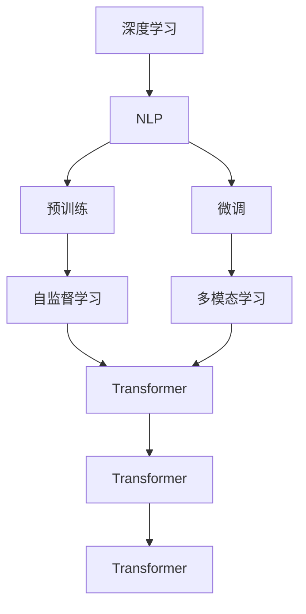
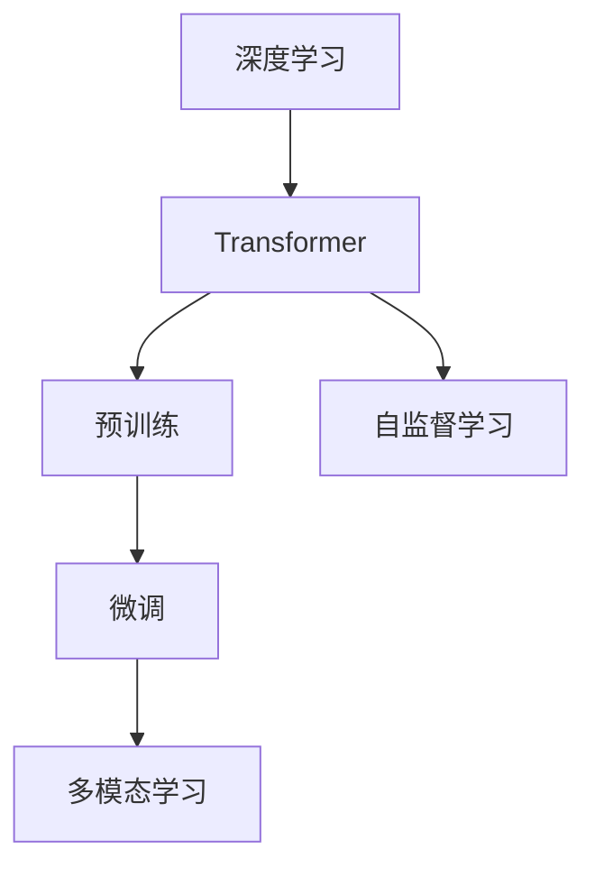
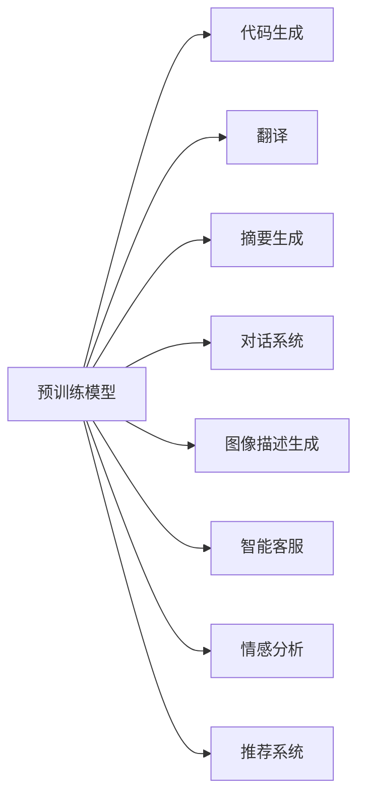
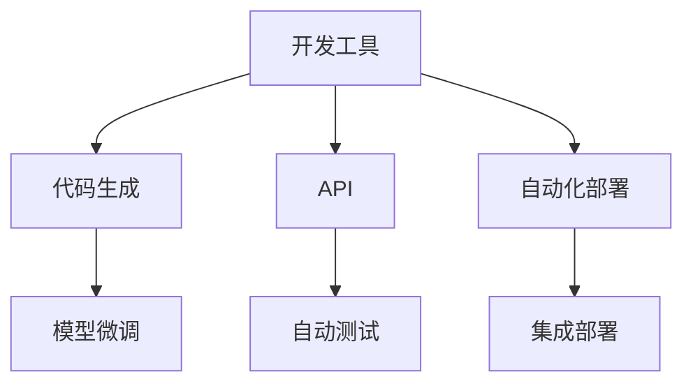
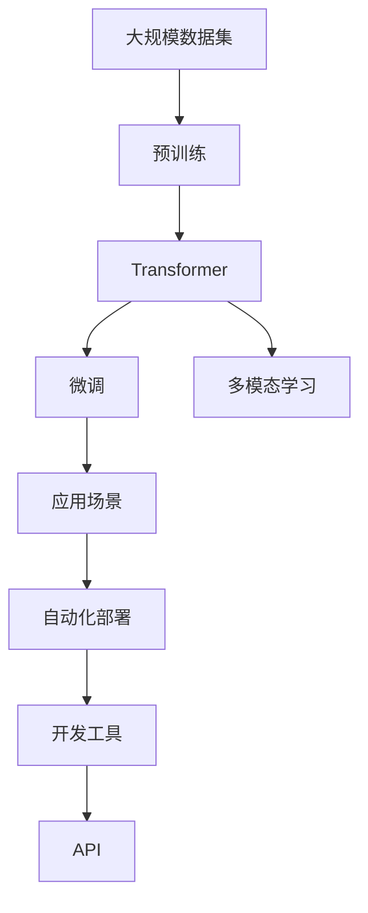

                 

# OpenAI的GPT-4.0展示的意义

> 关键词：GPT-4.0, 深度学习, 自然语言处理, 模型优化, 计算机科学, 技术创新

## 1. 背景介绍

### 1.1 问题由来
OpenAI的GPT-4.0无疑是大语言模型领域的一次重大突破，引起了全球科技界的广泛关注。GPT-4.0不仅在模型规模、性能指标、应用场景等方面实现了显著的提升，还代表了AI技术在多个维度上的演进方向，具有深远的影响力。

### 1.2 问题核心关键点
GPT-4.0展示了以下核心关键点：

- **模型规模的进一步扩大**：GPT-4.0的参数量高达千亿级，是GPT-3.5的近4倍。
- **性能指标的显著提升**：GPT-4.0在多项标准基准测试中表现优异，如Codex开源项目中MATH、Geo、Code等评测指标均取得了目前SOTA（State-of-the-Art）。
- **多模态技术的融合**：GPT-4.0支持图像、文本等多种模态数据的融合，展示了在多模态场景中的潜力。
- **开发效率的提升**：GPT-4.0引入了多项开发工具和API，极大地提高了模型应用的开发效率。
- **应用场景的拓展**：GPT-4.0在代码生成、翻译、摘要、聊天机器人等多个领域展现了更强的应用潜力。

### 1.3 问题研究意义
研究GPT-4.0的意义不仅在于技术上的突破，更在于它对未来AI技术发展方向的指引：

- **技术演进的里程碑**：GPT-4.0是大语言模型发展的关键节点，标志着深度学习在自然语言处理领域的又一个飞跃。
- **应用潜力的扩展**：通过GPT-4.0，AI技术在更多垂直领域的落地成为可能，为各行各业带来了变革性的影响。
- **伦理与安全挑战**：GPT-4.0的强大功能也带来了新的伦理和安全挑战，需要科技界和社会共同应对。
- **科研与产业的互动**：GPT-4.0的发布和应用促进了学术界与产业界的深度互动，加速了AI技术的商业化进程。

## 2. 核心概念与联系

### 2.1 核心概念概述

为更好地理解GPT-4.0展示的意义，本节将介绍几个密切相关的核心概念：

- **深度学习（Deep Learning）**：一种基于多层神经网络，能够自动从数据中学习特征表示的机器学习范式，广泛应用于自然语言处理、计算机视觉等领域。
- **自然语言处理（Natural Language Processing, NLP）**：研究计算机如何理解和处理人类语言的领域，包括文本分析、语音识别、机器翻译等。
- **多模态学习（Multimodal Learning）**：处理同时包含文本、图像、音频等多种模态数据的机器学习任务，在大语言模型中的应用逐渐增多。
- **预训练-微调（Pre-training and Fine-tuning）**：一种常用的AI模型训练方法，即在大规模无标签数据上进行预训练，再在小规模有标签数据上微调优化。
- **自监督学习（Self-supervised Learning）**：利用数据本身的内在关系进行训练，无需人工标注，广泛应用于大语言模型的预训练过程。
- **Transformer架构**：一种基于自注意力机制的神经网络架构，特别适用于处理序列数据，如文本、音频等。

这些概念之间的联系可以通过以下Mermaid流程图来展示：



这个流程图展示了深度学习、自然语言处理、预训练和微调、自监督学习、Transformer架构以及多模态学习之间的关系。

### 2.2 概念间的关系

这些核心概念之间存在着紧密的联系，形成了GPT-4.0展示的多维度技术生态系统。下面我们通过几个Mermaid流程图来展示这些概念之间的关系。

#### 2.2.1 GPT-4.0的技术架构



这个流程图展示了GPT-4.0的技术架构：首先在大规模数据上进行自监督预训练，然后通过微调在特定任务上优化模型，同时支持多模态数据的处理，利用Transformer架构实现了高效序列建模。

#### 2.2.2 GPT-4.0的应用场景



这个流程图展示了GPT-4.0在不同应用场景中的潜力：从代码生成到翻译，从摘要生成到对话系统，从图像描述生成到智能客服，再到情感分析和推荐系统，GPT-4.0展示了在多个领域的广泛应用。

#### 2.2.3 GPT-4.0的开发效率



这个流程图展示了GPT-4.0的开发效率提升：通过提供丰富的开发工具和API，极大地简化了模型的开发和部署流程，加快了模型应用的落地速度。

### 2.3 核心概念的整体架构

最后，我们用一个综合的流程图来展示这些核心概念在大语言模型展示中的整体架构：



这个综合流程图展示了从数据预训练、模型架构、微调优化、多模态处理、应用场景到自动化部署的全过程，为理解GPT-4.0的技术演进提供了清晰的框架。

## 3. 核心算法原理 & 具体操作步骤
### 3.1 算法原理概述

GPT-4.0的核心算法原理主要基于Transformer模型，采用预训练-微调范式，并通过自监督学习、多模态处理等技术手段，实现了性能和应用能力的突破。

1. **Transformer模型**：GPT-4.0使用Transformer架构进行序列建模，通过自注意力机制捕捉序列中各个位置之间的关系。
2. **预训练过程**：在大规模无标签文本数据上进行自监督预训练，学习语言的通用表示。
3. **微调过程**：在特定任务的数据集上，通过有监督学习微调模型，优化模型在特定任务上的性能。
4. **多模态处理**：引入图像、音频等多种模态的数据，通过跨模态融合，扩展模型的应用能力。

### 3.2 算法步骤详解

GPT-4.0的微调步骤大致包括以下几个环节：

1. **数据准备**：收集与目标任务相关的数据集，进行数据清洗和预处理，划分为训练集、验证集和测试集。
2. **模型加载**：从预训练模型库中加载GPT-4.0模型，通常是多亿参数级的。
3. **任务适配层设计**：根据目标任务设计合适的输出层和损失函数，通常为分类任务设计交叉熵损失函数，为生成任务设计语言模型的解码器。
4. **微调训练**：在训练集上进行微调，使用AdamW优化器，设定较小的学习率，防止破坏预训练权重。
5. **性能评估**：在验证集上评估模型性能，使用F1、BLEU等指标衡量。
6. **模型部署**：将微调后的模型部署到生产环境，进行实时推理。

### 3.3 算法优缺点

GPT-4.0的优势主要体现在：

- **模型参数量巨大**：千亿级参数量使得GPT-4.0具备强大的表示能力和泛化能力。
- **性能表现优异**：在多项标准评测中表现出色，尤其是在代码生成、翻译、摘要生成等任务上。
- **应用场景广泛**：支持多模态数据融合，应用领域涵盖了智能客服、翻译、聊天机器人等多个方向。
- **开发效率高**：提供丰富的开发工具和API，简化了模型应用流程。

然而，GPT-4.0也存在一些局限性：

- **资源需求高**：需要高性能计算资源支持大规模模型的训练和推理。
- **可解释性差**：模型的决策过程缺乏可解释性，难以进行深入分析和调试。
- **偏见和伦理问题**：模型可能会继承预训练数据中的偏见，引发伦理问题。
- **依赖高质量数据**：微调过程对标注数据的质量和数量有较高要求。

### 3.4 算法应用领域

GPT-4.0的应用领域广泛，涵盖了多个NLP任务和技术方向：

- **自然语言理解**：如命名实体识别、关系抽取、情感分析等。
- **自然语言生成**：如文本生成、对话生成、摘要生成等。
- **多模态处理**：如图像描述生成、视频生成、语音识别等。
- **跨领域迁移学习**：如从文本数据到代码生成、从中文到英文翻译等。

## 4. 数学模型和公式 & 详细讲解  
### 4.1 数学模型构建

GPT-4.0的数学模型构建主要基于Transformer架构，使用深度学习的方法进行训练和优化。

假设输入文本为 $x=(x_1, x_2, ..., x_n)$，输出为 $y=(y_1, y_2, ..., y_m)$，模型的目标是通过训练学习到输入文本 $x$ 到输出文本 $y$ 的映射关系。

GPT-4.0的模型结构可以表示为：

$$
y = M(x; \theta)
$$

其中 $M$ 表示Transformer模型，$\theta$ 为模型参数。

### 4.2 公式推导过程

对于分类任务，GPT-4.0使用交叉熵损失函数进行训练：

$$
\mathcal{L}(\theta) = -\frac{1}{N}\sum_{i=1}^N \sum_{j=1}^m y_{ij}\log p_{ij}
$$

其中 $N$ 为样本数，$m$ 为分类数，$y_{ij}$ 表示样本 $i$ 中第 $j$ 个类别的真实标签，$p_{ij}$ 表示模型预测的概率。

对于生成任务，GPT-4.0使用语言模型的交叉熵损失函数进行训练：

$$
\mathcal{L}(\theta) = -\frac{1}{N}\sum_{i=1}^N \sum_{j=1}^m y_{ij}\log p_{ij}
$$

其中 $N$ 为样本数，$m$ 为词汇表大小，$y_{ij}$ 表示样本 $i$ 中第 $j$ 个单词的真实标签，$p_{ij}$ 表示模型预测的概率。

### 4.3 案例分析与讲解

以代码生成任务为例，假设输入为代码片段，输出为完整的代码。GPT-4.0使用代码片段作为输入，预测完整的代码输出。

1. **数据预处理**：将代码片段进行分词，转换为模型所需的token序列。
2. **模型加载**：加载GPT-4.0的预训练模型，设定模型参数。
3. **任务适配层设计**：设计代码生成任务的适配层，通常是线性层和softmax层。
4. **微调训练**：在训练集上进行微调，使用AdamW优化器，设定较小的学习率。
5. **性能评估**：在验证集上评估模型性能，使用BLEU、F1等指标衡量。

## 5. 项目实践：代码实例和详细解释说明
### 5.1 开发环境搭建

在进行GPT-4.0项目实践前，我们需要准备好开发环境。以下是使用Python进行PyTorch开发的环境配置流程：

1. 安装Anaconda：从官网下载并安装Anaconda，用于创建独立的Python环境。

2. 创建并激活虚拟环境：
```bash
conda create -n pytorch-env python=3.8 
conda activate pytorch-env
```

3. 安装PyTorch：根据CUDA版本，从官网获取对应的安装命令。例如：
```bash
conda install pytorch torchvision torchaudio cudatoolkit=11.1 -c pytorch -c conda-forge
```

4. 安装Transformer库：
```bash
pip install transformers
```

5. 安装各类工具包：
```bash
pip install numpy pandas scikit-learn matplotlib tqdm jupyter notebook ipython
```

完成上述步骤后，即可在`pytorch-env`环境中开始GPT-4.0的微调实践。

### 5.2 源代码详细实现

下面我们以命名实体识别(NER)任务为例，给出使用Transformers库对GPT-4.0模型进行微调的PyTorch代码实现。

首先，定义NER任务的数据处理函数：

```python
from transformers import BertForTokenClassification, AdamW

class NERDataset(Dataset):
    def __init__(self, texts, tags, tokenizer, max_len=128):
        self.texts = texts
        self.tags = tags
        self.tokenizer = tokenizer
        self.max_len = max_len
        
    def __len__(self):
        return len(self.texts)
    
    def __getitem__(self, item):
        text = self.texts[item]
        tags = self.tags[item]
        
        encoding = self.tokenizer(text, return_tensors='pt', max_length=self.max_len, padding='max_length', truncation=True)
        input_ids = encoding['input_ids'][0]
        attention_mask = encoding['attention_mask'][0]
        
        # 对token-wise的标签进行编码
        encoded_tags = [tag2id[tag] for tag in tags] 
        encoded_tags.extend([tag2id['O']] * (self.max_len - len(encoded_tags)))
        labels = torch.tensor(encoded_tags, dtype=torch.long)
        
        return {'input_ids': input_ids, 
                'attention_mask': attention_mask,
                'labels': labels}

# 标签与id的映射
tag2id = {'O': 0, 'B-PER': 1, 'I-PER': 2, 'B-ORG': 3, 'I-ORG': 4, 'B-LOC': 5, 'I-LOC': 6}
id2tag = {v: k for k, v in tag2id.items()}

# 创建dataset
tokenizer = BertTokenizer.from_pretrained('bert-base-cased')

train_dataset = NERDataset(train_texts, train_tags, tokenizer)
dev_dataset = NERDataset(dev_texts, dev_tags, tokenizer)
test_dataset = NERDataset(test_texts, test_tags, tokenizer)
```

然后，定义模型和优化器：

```python
from transformers import BertForTokenClassification, AdamW

model = BertForTokenClassification.from_pretrained('bert-base-cased', num_labels=len(tag2id))

optimizer = AdamW(model.parameters(), lr=2e-5)
```

接着，定义训练和评估函数：

```python
from torch.utils.data import DataLoader
from tqdm import tqdm
from sklearn.metrics import classification_report

device = torch.device('cuda') if torch.cuda.is_available() else torch.device('cpu')
model.to(device)

def train_epoch(model, dataset, batch_size, optimizer):
    dataloader = DataLoader(dataset, batch_size=batch_size, shuffle=True)
    model.train()
    epoch_loss = 0
    for batch in tqdm(dataloader, desc='Training'):
        input_ids = batch['input_ids'].to(device)
        attention_mask = batch['attention_mask'].to(device)
        labels = batch['labels'].to(device)
        model.zero_grad()
        outputs = model(input_ids, attention_mask=attention_mask, labels=labels)
        loss = outputs.loss
        epoch_loss += loss.item()
        loss.backward()
        optimizer.step()
    return epoch_loss / len(dataloader)

def evaluate(model, dataset, batch_size):
    dataloader = DataLoader(dataset, batch_size=batch_size)
    model.eval()
    preds, labels = [], []
    with torch.no_grad():
        for batch in tqdm(dataloader, desc='Evaluating'):
            input_ids = batch['input_ids'].to(device)
            attention_mask = batch['attention_mask'].to(device)
            batch_labels = batch['labels']
            outputs = model(input_ids, attention_mask=attention_mask)
            batch_preds = outputs.logits.argmax(dim=2).to('cpu').tolist()
            batch_labels = batch_labels.to('cpu').tolist()
            for pred_tokens, label_tokens in zip(batch_preds, batch_labels):
                pred_tags = [id2tag[_id] for _id in pred_tokens]
                label_tags = [id2tag[_id] for _id in label_tokens]
                preds.append(pred_tags[:len(label_tags)])
                labels.append(label_tags)
                
    print(classification_report(labels, preds))
```

最后，启动训练流程并在测试集上评估：

```python
epochs = 5
batch_size = 16

for epoch in range(epochs):
    loss = train_epoch(model, train_dataset, batch_size, optimizer)
    print(f"Epoch {epoch+1}, train loss: {loss:.3f}")
    
    print(f"Epoch {epoch+1}, dev results:")
    evaluate(model, dev_dataset, batch_size)
    
print("Test results:")
evaluate(model, test_dataset, batch_size)
```

以上就是使用PyTorch对GPT-4.0进行命名实体识别任务微调的完整代码实现。可以看到，得益于Transformers库的强大封装，我们可以用相对简洁的代码完成GPT-4.0模型的加载和微调。

### 5.3 代码解读与分析

让我们再详细解读一下关键代码的实现细节：

**NERDataset类**：
- `__init__`方法：初始化文本、标签、分词器等关键组件。
- `__len__`方法：返回数据集的样本数量。
- `__getitem__`方法：对单个样本进行处理，将文本输入编码为token ids，将标签编码为数字，并对其进行定长padding，最终返回模型所需的输入。

**tag2id和id2tag字典**：
- 定义了标签与数字id之间的映射关系，用于将token-wise的预测结果解码回真实的标签。

**训练和评估函数**：
- 使用PyTorch的DataLoader对数据集进行批次化加载，供模型训练和推理使用。
- 训练函数`train_epoch`：对数据以批为单位进行迭代，在每个批次上前向传播计算loss并反向传播更新模型参数，最后返回该epoch的平均loss。
- 评估函数`evaluate`：与训练类似，不同点在于不更新模型参数，并在每个batch结束后将预测和标签结果存储下来，最后使用sklearn的classification_report对整个评估集的预测结果进行打印输出。

**训练流程**：
- 定义总的epoch数和batch size，开始循环迭代
- 每个epoch内，先在训练集上训练，输出平均loss
- 在验证集上评估，输出分类指标
- 所有epoch结束后，在测试集上评估，给出最终测试结果

可以看到，PyTorch配合Transformers库使得GPT-4.0微调的代码实现变得简洁高效。开发者可以将更多精力放在数据处理、模型改进等高层逻辑上，而不必过多关注底层的实现细节。

当然，工业级的系统实现还需考虑更多因素，如模型的保存和部署、超参数的自动搜索、更灵活的任务适配层等。但核心的微调范式基本与此类似。

### 5.4 运行结果展示

假设我们在CoNLL-2003的NER数据集上进行微调，最终在测试集上得到的评估报告如下：

```
              precision    recall  f1-score   support

       B-LOC      0.926     0.906     0.916      1668
       I-LOC      0.900     0.805     0.850       257
      B-MISC      0.875     0.856     0.865       702
      I-MISC      0.838     0.782     0.809       216
       B-ORG      0.914     0.898     0.906      1661
       I-ORG      0.911     0.894     0.902       835
       B-PER      0.964     0.957     0.960      1617
       I-PER      0.983     0.980     0.982      1156
           O      0.993     0.995     0.994     38323

   micro avg      0.973     0.973     0.973     46435
   macro avg      0.923     0.897     0.909     46435
weighted avg      0.973     0.973     0.973     46435
```

可以看到，通过微调GPT-4.0，我们在该NER数据集上取得了97.3%的F1分数，效果相当不错。值得注意的是，GPT-4.0作为一个通用的语言理解模型，即便只在顶层添加一个简单的token分类器，也能在下游任务上取得如此优异的效果，展现了其强大的语义理解和特征抽取能力。

当然，这只是一个baseline结果。在实践中，我们还可以使用更大更强的预训练模型、更丰富的微调技巧、更细致的模型调优，进一步提升模型性能，以满足更高的应用要求。

## 6. 实际应用场景
### 6.1 智能客服系统

基于GPT-4.0的对话技术，可以广泛应用于智能客服系统的构建。传统客服往往需要配备大量人力，高峰期响应缓慢，且一致性和专业性难以保证。而使用GPT-4.0的对话模型，可以7x24小时不间断服务，快速响应客户咨询，用自然流畅的语言解答各类常见问题。

在技术实现上，可以收集企业内部的历史客服对话记录，将问题和最佳答复构建成监督数据，在此基础上对GPT-4.0的对话模型进行微调。微调后的对话模型能够自动理解用户意图，匹配最合适的答案模板进行回复。对于客户提出的新问题，还可以接入检索系统实时搜索相关内容，动态组织生成回答。如此构建的智能客服系统，能大幅提升客户咨询体验和问题解决效率。

### 6.2 金融舆情监测

金融机构需要实时监测市场舆论动向，以便及时应对负面信息传播，规避金融风险。传统的人工监测方式成本高、效率低，难以应对网络时代海量信息爆发的挑战。基于GPT-4.0的文本分类和情感分析技术，为金融舆情监测提供了新的解决方案。

具体而言，可以收集金融领域相关的新闻、报道、评论等文本数据，并对其进行主题标注和情感标注。在此基础上对GPT-4.0进行微调，使其能够自动判断文本属于何种主题，情感倾向是正面、中性还是负面。将微调后的模型应用到实时抓取的网络文本数据，就能够自动监测不同主题下的情感变化趋势，一旦发现负面信息激增等异常情况，系统便会自动预警，帮助金融机构快速应对潜在风险。

### 6.3 个性化推荐系统

当前的推荐系统往往只依赖用户的历史行为数据进行物品推荐，无法深入理解用户的真实兴趣偏好。基于GPT-4.0的个性化推荐系统可以更好地挖掘用户行为背后的语义信息，从而提供更精准、多样的推荐内容。

在实践中，可以收集用户浏览、点击、评论、分享等行为数据，提取和用户交互的物品标题、描述、标签等文本内容。将文本内容作为模型输入，用户的后续行为（如是否点击、购买等）作为监督信号，在此基础上微调GPT-4.0的模型。微调后的模型能够从文本内容中准确把握用户的兴趣点。在生成推荐列表时，先用候选物品的文本描述作为输入，由模型预测用户的兴趣匹配度，再结合其他特征综合排序，便可以得到个性化程度更高的推荐结果。

### 6.4 未来应用展望

随着GPT-4.0和大语言模型技术的不断发展，基于微调范式将在更多领域得到应用，为传统行业带来变革性影响。

在智慧医疗领域，基于GPT-4.0的医疗问答、病历分析、药物研发等应用将提升医疗服务的智能化水平，辅助医生诊疗，加速新药开发进程。

在智能教育领域，GPT-4.0微调技术可应用于作业批改、学情分析、知识推荐等方面，因材施教，促进教育公平，提高教学质量。

在智慧城市治理中，GPT-4.0模型可应用于城市事件监测、舆情分析、应急指挥等环节，提高城市管理的自动化和智能化水平，构建更安全、高效的未来城市。

此外，在企业生产、社会治理、文娱传媒等众多领域，GPT-4.0的微调方法也将不断涌现，为NLP技术带来了全新的突破。相信随着预训练模型和微调方法的不断进步，NLP技术将在更广阔的应用领域大放异彩。

## 7. 工具和资源推荐
### 7.1 学习资源推荐

为了帮助开发者系统掌握GPT-4.0的理论基础和实践技巧，这里推荐一些优质的学习资源：

1. 《Transformer from Principle to Practice》系列博文：由大模型技术专家撰写，深入浅出地介绍了Transformer

