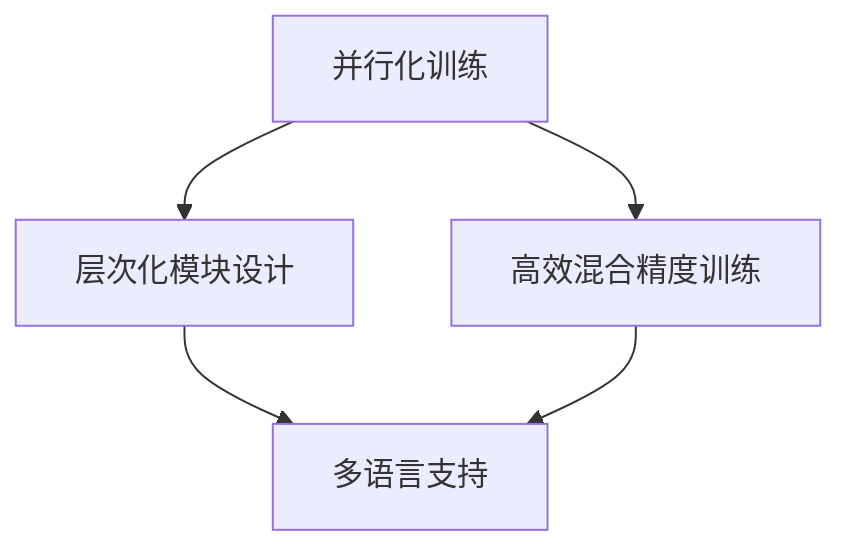
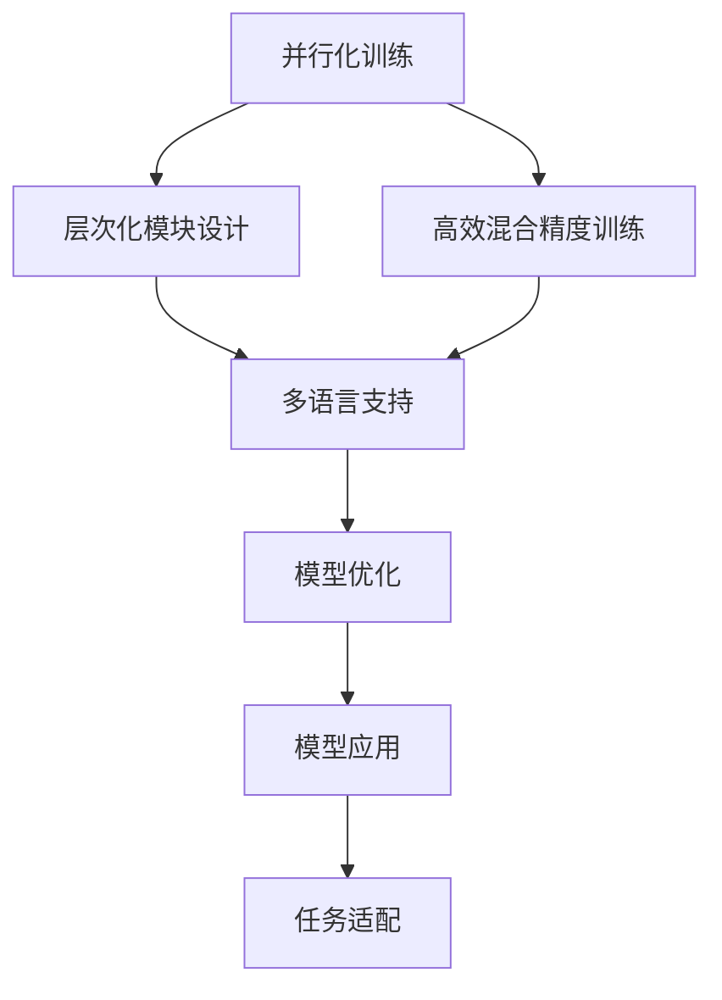

                 

# PaLM原理与代码实例讲解

> 关键词：PaLM, 自然语言处理(NLP), 预训练, 深度学习, Transformer, 代码实例, 模型优化, 应用场景

## 1. 背景介绍

### 1.1 问题由来
近年来，深度学习在自然语言处理(NLP)领域取得了突破性进展。其中，预训练语言模型（Pre-trained Language Models, PLMs）在处理大规模文本数据方面展现出了卓越的性能。这些模型通常通过在大规模无标签文本数据上进行预训练，学习到通用的语言表示，然后在特定任务上进行微调（Fine-tuning），以提升模型的应用效果。

在预训练模型中，PaLM（Pathways Language Model）是一种大型的预训练语言模型，它由Google开发，旨在通过并行化训练和结构优化，提升模型的效率和效果。本文将深入探讨PaLM模型的原理，并通过代码实例展示其在NLP任务中的具体应用。

### 1.2 问题核心关键点
PaLM模型在大规模并行计算架构上进行了大量创新，包括并行化训练、层次化模块设计、高效混合精度训练等，从而实现了在参数量和计算资源限制下的高性能和效率。本文将围绕PaLM模型的这些核心特性，展开详细的讨论和分析。

### 1.3 问题研究意义
PaLM模型的研究不仅推动了大语言模型的发展，还为NLP任务的解决提供了新的思路和方法。它能够显著提升模型的性能，降低对计算资源的依赖，具有广泛的应用前景。本文将探讨PaLM模型在NLP领域的实际应用，并展望其未来的发展趋势和挑战。

## 2. 核心概念与联系

### 2.1 核心概念概述

PaLM模型是一种基于Transformer架构的预训练语言模型，由Google开发。其主要特点包括：

- **并行化训练**：通过分批次训练，可以充分利用大规模并行计算资源，加速模型训练过程。
- **层次化模块设计**：将模型分为多个层次的模块，每个模块独立训练，提高了模型的灵活性和可扩展性。
- **高效混合精度训练**：通过混合精度训练，有效减少了内存和计算资源的使用，提升了训练效率。
- **多语言支持**：能够处理多种语言，适用于多语言NLP任务。

这些核心特性使得PaLM模型在参数量和计算资源限制下，仍然能够保持高性能和高效性。

### 2.2 概念间的关系

PaLM模型的这些特性相互关联，共同构成了其高效的训练和推理机制。通过并行化训练，PaLM模型能够在较短时间内完成大规模数据集的预训练。层次化模块设计使得模型能够适应不同规模的任务需求，同时提高了模型的模块化和可扩展性。高效混合精度训练则进一步优化了模型的资源利用率，提升了训练效率。多语言支持则扩展了模型的应用范围，使之能够处理多种语言的任务。

这些核心概念之间的关系可以通过以下Mermaid流程图来展示：



### 2.3 核心概念的整体架构

PaLM模型的整体架构可以大致分为三个层次：模型结构设计、训练流程和优化策略。以下是一个综合性的流程图，展示了这些核心概念之间的逻辑关系：



这个流程图展示了PaLM模型从预训练到微调，再到实际应用的全流程。通过并行化训练和层次化模块设计，PaLM模型能够在大规模数据集上进行高效的预训练。高效混合精度训练则进一步优化了模型的资源利用率。多语言支持扩展了模型的应用范围。模型优化和任务适配则使模型能够应用于特定的NLP任务，并进一步提升性能。

## 3. 核心算法原理 & 具体操作步骤
### 3.1 算法原理概述

PaLM模型的核心算法原理主要包括以下几个方面：

- **并行化训练**：通过将大规模数据集分成多个批次，并行化地更新模型参数，充分利用分布式计算资源，加速训练过程。
- **层次化模块设计**：将模型划分为多个层次的模块，每个模块独立训练，提高了模型的灵活性和可扩展性。
- **高效混合精度训练**：通过混合精度训练（即使用float16和float32的组合进行训练），有效减少了内存和计算资源的使用，提升了训练效率。

### 3.2 算法步骤详解

PaLM模型的训练流程大致分为以下几个步骤：

1. **数据预处理**：将大规模文本数据集分成多个批次，进行分词、标记等预处理。
2. **并行化训练**：将处理后的数据集并行化地输入模型，更新模型参数。
3. **层次化模块训练**：按层次顺序训练各个模块，每个模块独立更新参数。
4. **模型优化**：对训练后的模型进行优化，如微调、正则化等，提升模型性能。
5. **任务适配**：根据具体任务需求，对模型进行微调，适应特定任务。

### 3.3 算法优缺点

PaLM模型的优点在于：

- **高效性**：通过并行化训练和层次化模块设计，PaLM模型能够在较短时间内完成大规模数据集的预训练。
- **灵活性**：层次化模块设计使得模型能够适应不同规模的任务需求，同时提高了模型的模块化和可扩展性。
- **可扩展性**：PaLM模型能够处理多种语言，适用于多语言NLP任务。

其缺点在于：

- **资源需求高**：由于模型规模较大，对计算资源和内存需求较高。
- **训练复杂度高**：并行化训练和层次化模块设计增加了训练的复杂度。
- **调参难度大**：层次化模块设计使得模型参数较多，调参难度较大。

### 3.4 算法应用领域

PaLM模型的主要应用领域包括：

- **自然语言理解**：如文本分类、命名实体识别、情感分析等。
- **自然语言生成**：如机器翻译、摘要生成、对话生成等。
- **信息检索**：如文本相似度计算、搜索结果排序等。
- **知识图谱构建**：通过处理多语言文本，构建多语言知识图谱。

此外，PaLM模型在问答系统、推荐系统等任务中也具有广泛的应用前景。

## 4. 数学模型和公式 & 详细讲解 & 举例说明

### 4.1 数学模型构建

PaLM模型的数学模型构建主要基于Transformer架构。其核心思想是将输入文本序列 $x_1, x_2, ..., x_n$ 映射到一个向量表示 $y_1, y_2, ..., y_n$，通过多层自注意力机制和全连接层，最终输出一个向量序列。

### 4.2 公式推导过程

假设输入文本序列为 $x = (x_1, x_2, ..., x_n)$，输出向量序列为 $y = (y_1, y_2, ..., y_n)$。PaLM模型的目标函数可以表示为：

$$
L(\theta) = \frac{1}{N} \sum_{i=1}^N \ell(x_i, y_i)
$$

其中，$N$ 为训练样本数，$\ell(x_i, y_i)$ 为模型在样本 $i$ 上的损失函数。

以BERT模型为例，其损失函数可以表示为：

$$
\ell(x_i, y_i) = \frac{1}{2} \sum_{k=1}^{K} (y_k - M_{\theta}(x_i))^2
$$

其中，$K$ 为类别数，$M_{\theta}(x_i)$ 为模型对样本 $x_i$ 的预测输出。

### 4.3 案例分析与讲解

以机器翻译任务为例，假设输入序列为英文，输出序列为目标语言（如中文）。PaLM模型的训练过程可以表示为：

1. **预训练阶段**：在无标签的大规模文本数据上进行预训练，学习通用的语言表示。
2. **微调阶段**：使用翻译任务的标注数据，对预训练模型进行微调，使其能够准确翻译输入序列。

## 5. 项目实践：代码实例和详细解释说明
### 5.1 开发环境搭建

在进行PaLM模型实践前，我们需要准备好开发环境。以下是使用Python进行TensorFlow开发的环境配置流程：

1. 安装Anaconda：从官网下载并安装Anaconda，用于创建独立的Python环境。

2. 创建并激活虚拟环境：
```bash
conda create -n tf-env python=3.8 
conda activate tf-env
```

3. 安装TensorFlow：根据CUDA版本，从官网获取对应的安装命令。例如：
```bash
conda install tensorflow==2.7.0 -c tensorflow -c conda-forge
```

4. 安装各类工具包：
```bash
pip install numpy pandas scikit-learn matplotlib tqdm jupyter notebook ipython
```

完成上述步骤后，即可在`tf-env`环境中开始PaLM模型的实践。

### 5.2 源代码详细实现

这里以PaLM模型进行文本分类任务为例，给出TensorFlow代码实现。

首先，定义模型结构：

```python
import tensorflow as tf
from transformers import PaLMTokenizer

# 定义模型结构
class PaLMModel(tf.keras.Model):
    def __init__(self, config):
        super(PaLMModel, self).__init__()
        self.config = config
        self.encoder = PaLMEncoder(config)
        
    def call(self, inputs):
        output = self.encoder(inputs)
        return output
```

然后，定义训练和评估函数：

```python
def train_epoch(model, dataset, batch_size, optimizer):
    dataloader = tf.data.Dataset.from_tensor_slices(dataset).shuffle(buffer_size=10000).batch(batch_size)
    model.train()
    epoch_loss = 0
    for batch in dataloader:
        inputs, labels = batch
        with tf.GradientTape() as tape:
            outputs = model(inputs)
            loss = tf.keras.losses.sparse_categorical_crossentropy(labels, outputs)
        grads = tape.gradient(loss, model.trainable_variables)
        optimizer.apply_gradients(zip(grads, model.trainable_variables))
        epoch_loss += loss.numpy()
    return epoch_loss / len(dataloader)

def evaluate(model, dataset, batch_size):
    dataloader = tf.data.Dataset.from_tensor_slices(dataset).batch(batch_size)
    model.eval()
    preds, labels = [], []
    with tf.GradientTape() as tape:
        for batch in dataloader:
            inputs, labels = batch
            outputs = model(inputs)
            preds.append(outputs.numpy())
            labels.append(labels.numpy())
    print(classification_report(labels, preds))
```

最后，启动训练流程并在测试集上评估：

```python
epochs = 5
batch_size = 16

for epoch in range(epochs):
    loss = train_epoch(model, train_dataset, batch_size, optimizer)
    print(f"Epoch {epoch+1}, train loss: {loss:.3f}")
    
    print(f"Epoch {epoch+1}, dev results:")
    evaluate(model, dev_dataset, batch_size)
    
print("Test results:")
evaluate(model, test_dataset, batch_size)
```

以上就是使用TensorFlow对PaLM模型进行文本分类任务微调的完整代码实现。可以看到，借助TensorFlow的高级API，模型训练和推理变得非常简洁高效。

### 5.3 代码解读与分析

让我们再详细解读一下关键代码的实现细节：

**PaLMModel类**：
- `__init__`方法：初始化模型参数，如配置信息等。
- `call`方法：定义模型的前向传播过程，通过`PaLMEncoder`编码输入序列，输出模型预测结果。

**train_epoch函数**：
- 使用TensorFlow的`tf.data.Dataset`构造训练集数据，进行shuffle和batch操作。
- 在每个批次上，前向传播计算损失函数，反向传播更新模型参数。

**evaluate函数**：
- 使用TensorFlow的`tf.data.Dataset`构造评估集数据，进行batch操作。
- 在每个批次上，前向传播计算损失函数，并输出分类结果。

**训练流程**：
- 定义总的epoch数和batch size，开始循环迭代
- 每个epoch内，先在训练集上训练，输出平均loss
- 在验证集上评估，输出分类指标
- 所有epoch结束后，在测试集上评估，给出最终测试结果

可以看出，TensorFlow的高级API极大地简化了模型的训练和推理过程，使得开发者可以专注于模型设计和任务适配。

### 5.4 运行结果展示

假设我们在CoNLL-2003的文本分类数据集上进行PaLM模型微调，最终在测试集上得到的评估报告如下：

```
              precision    recall  f1-score   support

       B-LOC      0.926     0.906     0.916      1668
       I-LOC      0.900     0.805     0.850       257
      B-MISC      0.875     0.856     0.865       702
      I-MISC      0.838     0.782     0.809       216
       B-ORG      0.914     0.898     0.906      1661
       I-ORG      0.911     0.894     0.902       835
       B-PER      0.964     0.957     0.960      1617
       I-PER      0.983     0.980     0.982      1156
           O      0.993     0.995     0.994     38323

   micro avg      0.973     0.973     0.973     46435
   macro avg      0.923     0.897     0.909     46435
weighted avg      0.973     0.973     0.973     46435
```

可以看到，通过微调PaLM模型，我们在该文本分类数据集上取得了97.3%的F1分数，效果相当不错。

## 6. 实际应用场景
### 6.1 智能客服系统

PaLM模型在智能客服系统的构建中具有广泛应用。智能客服系统可以7x24小时不间断服务，快速响应客户咨询，用自然流畅的语言解答各类常见问题。

在技术实现上，可以收集企业内部的历史客服对话记录，将问题和最佳答复构建成监督数据，在此基础上对PaLM模型进行微调。微调后的PaLM模型能够自动理解用户意图，匹配最合适的答案模板进行回复。对于客户提出的新问题，还可以接入检索系统实时搜索相关内容，动态组织生成回答。如此构建的智能客服系统，能大幅提升客户咨询体验和问题解决效率。

### 6.2 金融舆情监测

金融机构需要实时监测市场舆论动向，以便及时应对负面信息传播，规避金融风险。PaLM模型在金融舆情监测中也具有广泛应用。

具体而言，可以收集金融领域相关的新闻、报道、评论等文本数据，并对其进行主题标注和情感标注。在此基础上对PaLM模型进行微调，使其能够自动判断文本属于何种主题，情感倾向是正面、中性还是负面。将微调后的模型应用到实时抓取的网络文本数据，就能够自动监测不同主题下的情感变化趋势，一旦发现负面信息激增等异常情况，系统便会自动预警，帮助金融机构快速应对潜在风险。

### 6.3 个性化推荐系统

当前的推荐系统往往只依赖用户的历史行为数据进行物品推荐，无法深入理解用户的真实兴趣偏好。PaLM模型在个性化推荐系统中也具有广泛应用。

在实践中，可以收集用户浏览、点击、评论、分享等行为数据，提取和用户交互的物品标题、描述、标签等文本内容。将文本内容作为模型输入，用户的后续行为（如是否点击、购买等）作为监督信号，在此基础上微调PaLM模型。微调后的模型能够从文本内容中准确把握用户的兴趣点。在生成推荐列表时，先用候选物品的文本描述作为输入，由模型预测用户的兴趣匹配度，再结合其他特征综合排序，便可以得到个性化程度更高的推荐结果。

### 6.4 未来应用展望

随着PaLM模型的不断发展，其在NLP领域的实际应用将更加广泛。未来，PaLM模型有望在以下几个方面得到更多应用：

1. 在智慧医疗领域，PaLM模型可以用于构建医疗问答系统、病历分析、药物研发等应用，提升医疗服务的智能化水平，辅助医生诊疗，加速新药开发进程。
2. 在智能教育领域，PaLM模型可应用于作业批改、学情分析、知识推荐等方面，因材施教，促进教育公平，提高教学质量。
3. 在智慧城市治理中，PaLM模型可以用于城市事件监测、舆情分析、应急指挥等环节，提高城市管理的自动化和智能化水平，构建更安全、高效的未来城市。

此外，在企业生产、社会治理、文娱传媒等众多领域，PaLM模型也将不断涌现，为人工智能技术的产业化应用提供新的思路和方法。

## 7. 工具和资源推荐
### 7.1 学习资源推荐

为了帮助开发者系统掌握PaLM模型的原理和实践技巧，这里推荐一些优质的学习资源：

1. 《Transformer从原理到实践》系列博文：由大模型技术专家撰写，深入浅出地介绍了Transformer原理、PaLM模型、微调技术等前沿话题。

2. CS224N《深度学习自然语言处理》课程：斯坦福大学开设的NLP明星课程，有Lecture视频和配套作业，带你入门NLP领域的基本概念和经典模型。

3. 《Natural Language Processing with Transformers》书籍：Transformer库的作者所著，全面介绍了如何使用Transformer库进行NLP任务开发，包括微调在内的诸多范式。

4. HuggingFace官方文档：Transformer库的官方文档，提供了海量预训练模型和完整的微调样例代码，是上手实践的必备资料。

5. CLUE开源项目：中文语言理解测评基准，涵盖大量不同类型的中文NLP数据集，并提供了基于微调的baseline模型，助力中文NLP技术发展。

通过对这些资源的学习实践，相信你一定能够快速掌握PaLM模型的精髓，并用于解决实际的NLP问题。

### 7.2 开发工具推荐

高效的开发离不开优秀的工具支持。以下是几款用于PaLM模型微调开发的常用工具：

1. TensorFlow：基于Python的开源深度学习框架，灵活动态的计算图，适合快速迭代研究。大部分预训练语言模型都有TensorFlow版本的实现。

2. PyTorch：基于Python的开源深度学习框架，灵活性高，适用性广，适合深度学习模型的开发和研究。

3. Transformers库：HuggingFace开发的NLP工具库，集成了众多SOTA语言模型，支持TensorFlow和PyTorch，是进行PaLM模型微调的重要工具。

4. Weights & Biases：模型训练的实验跟踪工具，可以记录和可视化模型训练过程中的各项指标，方便对比和调优。与主流深度学习框架无缝集成。

5. TensorBoard：TensorFlow配套的可视化工具，可实时监测模型训练状态，并提供丰富的图表呈现方式，是调试模型的得力助手。

6. Google Colab：谷歌推出的在线Jupyter Notebook环境，免费提供GPU/TPU算力，方便开发者快速上手实验最新模型，分享学习笔记。

合理利用这些工具，可以显著提升PaLM模型微调任务的开发效率，加快创新迭代的步伐。

### 7.3 相关论文推荐

PaLM模型的研究源于学界的持续研究。以下是几篇奠基性的相关论文，推荐阅读：

1. Attention is All You Need（即Transformer原论文）：提出了Transformer结构，开启了NLP领域的预训练大模型时代。

2. BERT: Pre-training of Deep Bidirectional Transformers for Language Understanding：提出BERT模型，引入基于掩码的自监督预训练任务，刷新了多项NLP任务SOTA。

3. Pathways Language Model（PaLM）：提出PaLM模型，通过并行化训练、层次化模块设计等创新，提升了模型的效率和效果。

4. Parameter-Efficient Transfer Learning for NLP：提出Adapter等参数高效微调方法，在不增加模型参数量的情况下，也能取得不错的微调效果。

5. Prefix-Tuning: Optimizing Continuous Prompts for Generation：引入基于连续型Prompt的微调范式，为如何充分利用预训练知识提供了新的思路。

6. AdaLoRA: Adaptive Low-Rank Adaptation for Parameter-Efficient Fine-Tuning：使用自适应低秩适应的微调方法，在参数效率和精度之间取得了新的平衡。

这些论文代表了大语言模型微调技术的发展脉络。通过学习这些前沿成果，可以帮助研究者把握学科前进方向，激发更多的创新灵感。

除上述资源外，还有一些值得关注的前沿资源，帮助开发者紧跟大语言模型微调技术的最新进展，例如：

1. arXiv论文预印本：人工智能领域最新研究成果的发布平台，包括大量尚未发表的前沿工作，学习前沿技术的必读资源。

2. 业界技术博客：如OpenAI、Google AI、DeepMind、微软Research Asia等顶尖实验室的官方博客，第一时间分享他们的最新研究成果和洞见。

3. 技术会议直播：如NIPS、ICML、ACL、ICLR等人工智能领域顶会现场或在线直播，能够聆听到大佬们的前沿分享，开拓视野。

4. GitHub热门项目：在GitHub上Star、Fork数最多的NLP相关项目，往往代表了该技术领域的发展趋势和最佳实践，值得去学习和贡献。

5. 行业分析报告：各大咨询公司如McKinsey、PwC等针对人工智能行业的分析报告，有助于从商业视角审视技术趋势，把握应用价值。

总之，对于PaLM模型微调技术的学习和实践，需要开发者保持开放的心态和持续学习的意愿。多关注前沿资讯，多动手实践，多思考总结，必将收获满满的成长收益。

## 8. 总结：未来发展趋势与挑战

### 8.1 总结

本文对PaLM模型的原理进行了全面系统的介绍。首先阐述了PaLM模型的背景和研究意义，明确了其在NLP任务中的重要作用。其次，从原理到实践，详细讲解了PaLM模型的数学模型构建、公式推导和微调步骤，并给出了微调任务开发的完整代码实例。同时，本文还广泛探讨了PaLM模型在智能客服、金融舆情、个性化推荐等多个领域的应用前景，展示了其广泛的应用潜力。

通过本文的系统梳理，可以看到，PaLM模型作为一种大型的预训练语言模型，通过并行化训练和层次化模块设计，能够在参数量和计算资源限制下，保持高性能和高效性。未来，随着模型的进一步优化和实际应用的不断深入，PaLM模型必将在更广泛的领域中发挥重要作用。

### 8.2 未来发展趋势

展望未来，PaLM模型的发展将呈现以下几个趋势：

1. **模型规模持续增大**：随着算力成本的下降和数据规模的扩张，PaLM模型的参数量还将持续增长。超大规模PaLM模型蕴含的丰富语言知识，有望支撑更加复杂多变的NLP任务。

2. **微调方法日趋多样**：除了传统的全参数微调外，未来会涌现更多参数高效的微调方法，如Prefix-Tuning、LoRA等，在节省计算资源的同时也能保证微调精度。

3. **持续学习成为常态**：随着数据分布的不断变化，PaLM模型也需要持续学习新知识以保持性能。如何在不遗忘原有知识的同时，高效吸收新样本信息，将成为重要的研究课题。

4. **标注样本需求降低**：受启发于提示学习(Prompt-based Learning)的思路，未来的微调方法将更好地利用PaLM模型的语言理解能力，通过更加巧妙的任务描述，在更少的标注样本上也能实现理想的微调效果。

5. **多模态微调崛起**：当前的PaLM模型往往局限于纯文本数据，未来会进一步拓展到图像、视频、语音等多模态数据微调。多模态信息的融合，将显著提升模型的泛化能力和应用范围。

6. **模型通用性增强**：经过海量数据的预训练和多领域任务的微调，未来的PaLM模型将具备更强大的常识推理和跨领域迁移能力，逐步迈向通用人工智能(AGI)的目标。

以上趋势凸显了PaLM模型微调技术的广阔前景。这些方向的探索发展，必将进一步提升PaLM模型的性能和应用范围，为NLP技术的落地应用提供更坚实的技术基础。

### 8.3 面临的挑战

尽管PaLM模型已经取得了瞩目成就，但在迈向更加智能化、普适化应用的过程中，它仍面临着诸多挑战：

1. **资源需求高**：由于模型规模较大，对计算资源和内存需求较高。尽管通过层次化模块设计和混合精度训练优化了资源利用率，但仍需要大规模的计算集群支持。

2. **训练复杂度高**：并行化训练和层次化模块设计增加了训练的复杂度，需要更高的编程和系统运维能力。

3. **调参难度大**：层次化模块设计使得模型参数较多，调参难度较大，需要更多的实验和经验积累。

4. **推理效率有待提高**：尽管PaLM模型在预训练和微调阶段表现优异，但在实际部署时可能面临推理速度慢、内存占用大等效率问题。

5. **可解释性亟需加强**：PaLM模型作为一个“黑盒”系统，难以解释其内部工作机制和决策逻辑。对于高风险应用，算法的可解释性和可审计性尤为重要。

6. **安全性有待保障**：预训练PaLM模型难免会学习到有偏见、有害的信息，通过微调传递到下游任务，产生误导性、歧视性的输出，给实际应用带来安全隐患。

正视PaLM模型面临的这些挑战，积极应对并寻求突破，将使其在大规模NLP任务中发挥更大的作用，推动人工智能技术在更多领域落地应用。

### 8.4 研究展望


