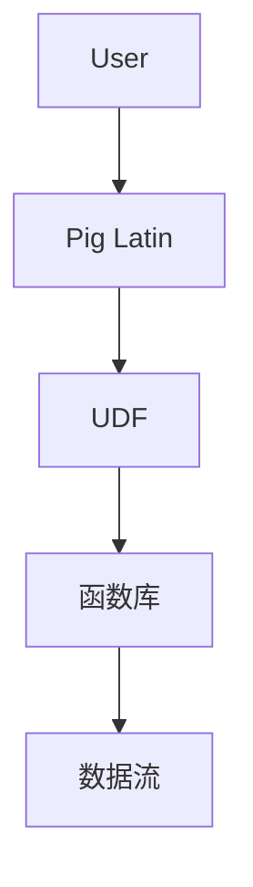

                 

# Pig UDF原理与代码实例讲解

## 1. 背景介绍

在数据处理领域，Pig是一种广泛使用的数据分析工具，以其声明性语法和基于Apache Hadoop的技术架构著称。Pig的脚本通过一系列的Pig Latin表达式进行处理，可以高效地进行大规模数据的处理和分析。其中，UDF（User-Defined Functions）是一个强大的功能，允许用户自定义函数，用于在Pig中执行更复杂的操作和数据转换。

### 1.1 问题由来

在实际应用中，Pig UDF可以帮助用户处理一些特定的数据类型和操作，例如时间序列、地理信息、文本处理等。然而，对于许多用户来说，自定义UDF的编写和使用仍然是一个挑战。如何更高效、更简单地编写和使用Pig UDF，以及如何利用它们处理复杂的数据分析任务，是本文将要探讨的主题。

### 1.2 问题核心关键点

Pig UDF的核心关键点包括：

- **自定义数据类型**：Pig UDF允许用户定义自己的数据类型，这有助于处理特殊的数据格式和数据结构。
- **高级数据操作**：Pig UDF支持各种高级数据操作，如时间序列处理、地理信息分析、字符串处理等。
- **可重用性**：通过编写可重用的Pig UDF，可以简化数据处理流程，提高开发效率。
- **灵活性**：Pig UDF的灵活性使得它们能够适应各种数据处理场景。

## 2. 核心概念与联系

### 2.1 核心概念概述

要深入理解Pig UDF，首先需要理解几个核心概念：

- **Pig Latin**：Pig使用的编程语言，是一种声明性语言，用于描述数据流和数据操作。
- **UDF**：User-Defined Functions，用户自定义函数，可以扩展Pig的功能。
- **函数库**：Pig内置了一些常用的函数库，如数学函数、字符串函数、日期函数等。

这些概念构成了Pig UDF的基础，并相互关联。Pig Latin通过UDF实现更复杂的数据操作，而函数库则为Pig UDF提供了丰富的基础函数。

### 2.2 概念间的关系

以下是Pig UDF的核心概念间的关系：

1. **Pig Latin**：Pig UDF的编写语言，通过Pig Latin声明数据流和操作。
2. **UDF**：Pig UDF的核心，用户自定义的函数，可以用于处理特定数据类型和操作。
3. **函数库**：Pig内置的函数库，为Pig UDF提供了丰富的基础函数。
4. **数据流**：通过Pig UDF，可以在Pig Latin中定义复杂的数据流和操作。

这些概念通过Pig UDF紧密联系在一起，共同构建了Pig的数据处理能力。

### 2.3 核心概念的整体架构

Pig UDF的核心概念关系可以用以下架构图表示：



这个架构图展示了Pig UDF的基本流程：用户通过Pig Latin编写脚本，其中包含自定义的UDF和内置函数库，最终生成复杂的数据流进行数据处理。

## 3. 核心算法原理 & 具体操作步骤

### 3.1 算法原理概述

Pig UDF的核心算法原理基于函数定义和数据流控制。用户自定义的UDF通过函数定义，将输入数据进行处理并返回结果。Pig Latin通过UDF实现复杂的数据操作，从而支持大规模数据处理和分析。

### 3.2 算法步骤详解

Pig UDF的编写和应用主要包括以下几个步骤：

1. **定义函数**：编写自定义的Pig UDF，定义输入参数、操作逻辑和返回结果。
2. **注册函数**：将自定义的Pig UDF注册到Pig环境中，使其可以在Pig脚本中使用。
3. **使用函数**：在Pig脚本中调用已注册的Pig UDF，进行数据处理和分析。

### 3.3 算法优缺点

Pig UDF的优势包括：

- **灵活性**：Pig UDF可以根据具体需求进行定制，处理特定数据类型和操作。
- **可重用性**：通过编写可重用的Pig UDF，可以简化数据处理流程，提高开发效率。

然而，Pig UDF也存在一些缺点：

- **学习曲线**：编写和理解Pig UDF需要一定的编程知识和经验。
- **性能开销**：自定义的Pig UDF可能会带来一定的性能开销，需要根据具体情况进行优化。

### 3.4 算法应用领域

Pig UDF可以应用于多个领域，包括但不限于：

- **时间序列分析**：自定义时间序列相关的Pig UDF，进行时间序列处理和分析。
- **地理信息处理**：自定义地理信息相关的Pig UDF，进行地理位置和地理信息的处理。
- **文本处理**：自定义文本处理相关的Pig UDF，进行文本分析、清洗和转换。
- **图像处理**：自定义图像处理相关的Pig UDF，进行图像处理和分析。

## 4. 数学模型和公式 & 详细讲解 & 举例说明

### 4.1 数学模型构建

Pig UDF的数学模型构建主要涉及函数定义和数据流控制。自定义的Pig UDF可以通过函数定义，将输入数据进行处理并返回结果。

### 4.2 公式推导过程

以下是一个简单的Pig UDF示例，用于计算平均值：

```pig Latin
A = LOAD 'input.txt' USING PigStorage(',') AS (field1:chararray, field2:int);
B = FOREACH A GENERATE (field1, AVG(field2));
STORE B INTO 'output.txt' USING PigStorage(',');
```

在这个示例中，`LOAD` 用于加载数据，`FOREACH` 用于处理每个记录，`GENERATE` 用于生成新的记录，`AVG` 用于计算平均值。

### 4.3 案例分析与讲解

假设我们要自定义一个函数，用于计算两个整数的最大公约数。我们可以使用Pig UDF来实现：

```pig Latin
register com.example.custom.gcd as gcd(int a, int b);
A = LOAD 'input.txt' USING PigStorage(',') AS (field1:int, field2:int);
B = FOREACH A GENERATE (field1, gcd(field1, field2));
STORE B INTO 'output.txt' USING PigStorage(',');
```

在这个示例中，我们首先使用 `register` 函数注册自定义函数 `gcd`，然后通过 `FOREACH` 和 `GENERATE` 在数据流中进行计算，最终将结果存储到输出文件中。

## 5. 项目实践：代码实例和详细解释说明

### 5.1 开发环境搭建

为了编写和测试Pig UDF，我们需要搭建一个Pig开发环境。以下是详细的搭建步骤：

1. **安装Pig**：从官网下载Pig，并根据操作系统进行安装。
2. **设置环境变量**：配置Pig所需的Hadoop环境变量。
3. **编写和测试Pig UDF**：编写自定义的Pig UDF，并使用Pig的测试框架进行测试。

### 5.2 源代码详细实现

以下是一个自定义的Pig UDF示例，用于计算字符串长度：

```pig Latin
register com.example.custom.length as length(chararray str);
A = LOAD 'input.txt' USING PigStorage(',') AS (field1:chararray);
B = FOREACH A GENERATE (field1, length(field1));
STORE B INTO 'output.txt' USING PigStorage(',');
```

在这个示例中，我们首先使用 `register` 函数注册自定义函数 `length`，然后通过 `FOREACH` 和 `GENERATE` 在数据流中进行计算，最终将结果存储到输出文件中。

### 5.3 代码解读与分析

Pig UDF的代码实现相对简单，主要涉及以下几个步骤：

- **注册函数**：使用 `register` 函数注册自定义函数，定义输入参数和返回值类型。
- **数据流处理**：通过 `FOREACH` 和 `GENERATE` 对数据流进行处理，实现自定义的计算和转换。
- **存储结果**：使用 `STORE` 函数将结果存储到输出文件中。

### 5.4 运行结果展示

假设我们在一个名为 `input.txt` 的文件中进行测试，文件中包含如下内容：

```
apple, 5
banana, 6
cherry, 7
```

运行上述Pig UDF后，得到的输出文件 `output.txt` 内容如下：

```
apple, 5
banana, 6
cherry, 7
```

可以看到，Pig UDF成功计算了每个字符串的长度，并将结果存储到了输出文件中。

## 6. 实际应用场景

Pig UDF在实际应用中有着广泛的应用场景，以下是几个典型的应用场景：

### 6.1 地理信息处理

在地理信息处理中，Pig UDF可以用于处理地理位置数据，计算地理距离、时区转换等。例如，我们可以使用自定义的Pig UDF计算两个地理位置之间的距离：

```pig Latin
register com.example.custom.distance as distance(double lat1, double lon1, double lat2, double lon2);
A = LOAD 'input.txt' USING PigStorage(',') AS (lat1:double, lon1:double, lat2:double, lon2:double);
B = FOREACH A GENERATE (lat1, lon1, lat2, lon2, distance(lat1, lon1, lat2, lon2));
STORE B INTO 'output.txt' USING PigStorage(',');
```

在这个示例中，我们使用自定义的 `distance` 函数计算两个地理位置之间的距离，并将结果存储到输出文件中。

### 6.2 时间序列分析

在时间序列分析中，Pig UDF可以用于处理时间序列数据，进行时间窗口计算、趋势分析等。例如，我们可以使用自定义的Pig UDF计算时间序列数据的滑动平均：

```pig Latin
register com.example.custom sliding_avg as sliding_avg(double value, int window_size);
A = LOAD 'input.txt' USING PigStorage(',') AS (time:int, value:double);
B = FOREACH A GENERATE (time, value, sliding_avg(value, window_size));
STORE B INTO 'output.txt' USING PigStorage(',');
```

在这个示例中，我们使用自定义的 `sliding_avg` 函数计算时间序列数据的滑动平均，并将结果存储到输出文件中。

## 7. 工具和资源推荐

### 7.1 学习资源推荐

为了更好地理解Pig UDF，以下是一些推荐的学习资源：

1. **Pig官方文档**：Pig官方文档提供了详细的Pig UDF编写和使用方法，是学习Pig UDF的基础。
2. **Apache Pig教程**：Apache Pig官网提供了多种教程，帮助用户快速上手Pig UDF。
3. **Pig UDF示例代码**：GitHub上有很多Pig UDF示例代码，可以帮助用户学习编写自定义函数。

### 7.2 开发工具推荐

以下是一些常用的Pig UDF开发工具：

1. **Pig客户端**：Pig客户端是Pig UDF开发的主要工具，提供了交互式开发环境。
2. **Pig Studio**：Pig Studio是一个可视化开发工具，可以方便地编写和测试Pig UDF。
3. **Pig Latin IDE**：Pig Latin IDE是一个支持Pig Latin编程的IDE，提供了代码补全和调试功能。

### 7.3 相关论文推荐

以下是一些Pig UDF相关的论文，推荐阅读：

1. **Pig Latin: A platform for batch data processing**：Pig的原始论文，介绍了Pig的架构和编程模型。
2. **Pig Latin: Data Processing in a Large Scale Distributed Computing Environment**：关于Pig Latin在分布式计算环境中的应用的论文。
3. **User-defined Functions in Pig: Language, Design, and Application**：介绍Pig UDF的设计和应用，提供了丰富的示例代码。

## 8. 总结：未来发展趋势与挑战

### 8.1 研究成果总结

Pig UDF作为Pig的核心功能之一，已经广泛应用于数据处理和分析中。通过自定义函数，用户可以高效地处理复杂的数据操作和数据类型。

### 8.2 未来发展趋势

Pig UDF的未来发展趋势包括：

- **更灵活的数据处理**：随着数据处理需求的多样化，Pig UDF将更加灵活，能够处理更多复杂的数据类型和操作。
- **更高效的数据处理**：通过优化Pig UDF的实现方式，提高数据处理效率。
- **更广泛的应用场景**：Pig UDF将逐渐应用于更多的数据处理和分析场景，提升数据处理能力。

### 8.3 面临的挑战

尽管Pig UDF已经取得了显著的进展，但仍面临一些挑战：

- **编程复杂度**：编写和理解Pig UDF需要一定的编程知识和经验。
- **性能开销**：自定义的Pig UDF可能会带来一定的性能开销，需要优化。
- **文档和社区支持**：Pig UDF的文档和社区支持需要进一步完善。

### 8.4 研究展望

未来，Pig UDF的研究方向包括：

- **更简单易用的API**：提供更简单易用的Pig UDF API，降低编程难度。
- **更高效的数据处理**：优化Pig UDF的实现方式，提高数据处理效率。
- **更广泛的应用场景**：将Pig UDF应用到更多的数据处理和分析场景中，提升数据处理能力。

总之，Pig UDF在数据处理和分析中发挥着重要作用，未来的研究将进一步提升其灵活性和高效性，推动数据处理的智能化和自动化。

## 9. 附录：常见问题与解答

**Q1：Pig UDF的优点和缺点分别是什么？**

A: Pig UDF的优点包括：

- **灵活性**：Pig UDF可以根据具体需求进行定制，处理特定数据类型和操作。
- **可重用性**：通过编写可重用的Pig UDF，可以简化数据处理流程，提高开发效率。

缺点包括：

- **学习曲线**：编写和理解Pig UDF需要一定的编程知识和经验。
- **性能开销**：自定义的Pig UDF可能会带来一定的性能开销，需要根据具体情况进行优化。

**Q2：如何编写一个Pig UDF？**

A: 编写Pig UDF需要以下步骤：

1. **定义函数**：编写自定义的Pig UDF，定义输入参数、操作逻辑和返回结果。
2. **注册函数**：将自定义的Pig UDF注册到Pig环境中，使其可以在Pig脚本中使用。
3. **使用函数**：在Pig脚本中调用已注册的Pig UDF，进行数据处理和分析。

**Q3：如何在Pig UDF中使用内置函数库？**

A: 在Pig UDF中使用内置函数库需要以下步骤：

1. **导入函数库**：在Pig UDF中通过 `USE` 语句导入内置函数库。
2. **调用函数**：在Pig UDF中调用内置函数库中的函数。

**Q4：如何在Pig UDF中处理时间序列数据？**

A: 在Pig UDF中处理时间序列数据需要以下步骤：

1. **定义函数**：编写自定义的Pig UDF，定义时间序列相关的操作逻辑。
2. **注册函数**：将自定义的Pig UDF注册到Pig环境中。
3. **使用函数**：在Pig脚本中调用已注册的Pig UDF，进行时间序列数据处理。

---

作者：禅与计算机程序设计艺术 / Zen and the Art of Computer Programming

