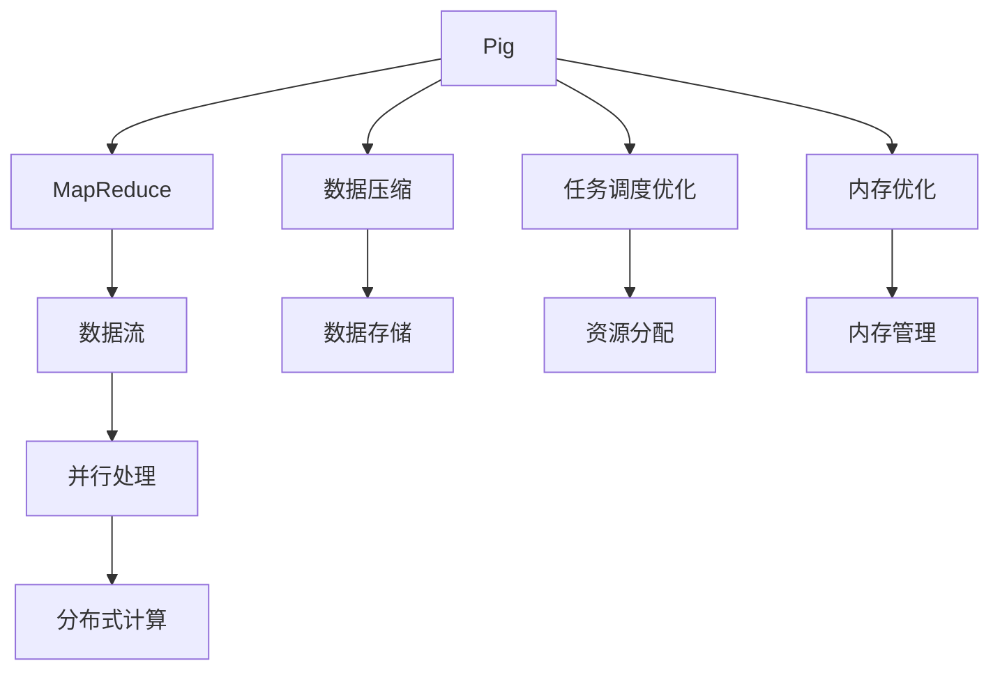

                 

# Pig优化策略原理与代码实例讲解

> 关键词：Pig, 优化策略, 计算引擎, MapReduce, 数据流, 并行处理, 数据存储, 系统调优

## 1. 背景介绍

### 1.1 问题由来
随着大数据时代的到来，数据存储和计算的需求日益增加。传统的计算模型，如单线程串行处理，已经难以满足大规模数据处理的需要。Pig是Hadoop生态系统中的一款数据流计算引擎，能够提供一种高效、灵活的数据处理方式。然而，Pig系统本身也面临着资源消耗大、性能瓶颈等问题，需要通过优化策略来提升其处理效率。

### 1.2 问题核心关键点
Pig优化策略的核心在于如何提高Pig计算引擎的性能，同时确保系统稳定性和可靠性。其关键点包括：
1. 提升并行处理能力。通过合理分配计算任务，利用多核CPU和分布式计算资源，提升数据处理的效率。
2. 优化数据存储和传输。通过压缩、分块等技术，减少数据存储和传输的体积和延迟。
3. 减少资源消耗。通过内存优化、任务调度优化等手段，减少计算过程中的资源消耗。
4. 提高系统可靠性。通过容错机制、负载均衡等措施，确保系统在异常情况下依然能够正常运行。

### 1.3 问题研究意义
优化Pig计算引擎的性能，对于提升大数据处理效率、降低系统成本、提高数据处理质量具有重要意义：

1. 提高处理效率。Pig引擎优化后的并行处理能力和任务调度策略，可以大幅提升数据处理速度，缩短数据计算时间。
2. 降低系统成本。通过合理的资源分配和优化策略，可以避免资源浪费，降低系统运行成本。
3. 提升数据处理质量。优化后的Pig引擎能够更好地处理数据，减少错误和遗漏，提高数据处理精度。
4. 支持数据湖构建。Pig引擎的灵活性和可扩展性，使得其能够适应多种数据存储和处理需求，支持数据湖的构建和维护。

## 2. 核心概念与联系

### 2.1 核心概念概述

为更好地理解Pig优化策略的原理和实现，本节将介绍几个关键概念：

- Pig：基于Apache Hadoop的高级数据流计算引擎，提供了一种面向数据分析的语言和工具，能够高效地处理大规模数据集。
- MapReduce：一种分布式计算模型，用于在分布式计算环境中高效处理大规模数据集。Pig计算引擎是基于MapReduce模型开发的。
- 数据流：在Pig中，数据通过流的方式在计算节点之间传递，数据流是Pig引擎的核心概念。
- 并行处理：Pig引擎利用多核CPU和分布式计算资源，实现大规模数据的并行处理。
- 数据压缩：通过数据压缩技术，减少数据存储和传输的体积，提升系统效率。
- 任务调度优化：通过优化任务调度和资源分配，提高Pig系统的性能和可靠性。
- 内存优化：通过合理分配内存资源，减少计算过程中的内存消耗，提升系统性能。

### 2.2 概念间的关系

这些核心概念之间存在着紧密的联系，形成了Pig优化的整体框架。我们通过以下Mermaid流程图来展示这些概念之间的关系：



这个流程图展示了大数据处理过程中的各个环节，以及Pig优化策略的作用：

1. Pig引擎基于MapReduce模型进行数据处理。
2. 数据流在计算节点之间传递，是Pig引擎的核心概念。
3. 并行处理通过多核CPU和分布式计算资源，提高数据处理效率。
4. 数据压缩减少存储和传输体积，提升系统效率。
5. 任务调度优化合理分配计算任务，提高系统性能。
6. 内存优化合理分配内存资源，减少内存消耗。

这些概念共同构成了Pig优化的完整生态系统，使得Pig引擎能够高效地处理大规模数据集，同时保持系统稳定性和可靠性。

## 3. 核心算法原理 & 具体操作步骤

### 3.1 算法原理概述

Pig优化策略的本质是针对Pig计算引擎的特点，通过各种优化技术提升系统的性能和可靠性。具体来说，Pig优化策略包括：

1. 并行处理优化：通过合理分配计算任务，利用多核CPU和分布式计算资源，提升数据处理的效率。
2. 数据压缩优化：通过数据压缩技术，减少数据存储和传输的体积和延迟。
3. 任务调度优化：通过优化任务调度和资源分配，提高Pig系统的性能和可靠性。
4. 内存优化：通过合理分配内存资源，减少计算过程中的内存消耗。
5. 容错机制：通过容错机制，确保系统在异常情况下依然能够正常运行。

这些优化策略共同作用，使得Pig引擎能够高效地处理大规模数据集，同时保持系统稳定性和可靠性。

### 3.2 算法步骤详解

以下是Pig优化的详细步骤：

**Step 1: 数据压缩**

1. 对输入数据进行预处理，识别出可以压缩的数据类型，如文本、图像等。
2. 选择合适的压缩算法，如Gzip、Snappy等。
3. 使用压缩算法对数据进行压缩，减少存储和传输的体积。

**Step 2: 并行处理**

1. 根据计算任务的特点，将数据划分为多个计算节点。
2. 在每个计算节点上，利用多核CPU进行并行计算。
3. 对于复杂的计算任务，使用分布式计算资源进行并行处理，提升数据处理效率。

**Step 3: 任务调度优化**

1. 根据任务的优先级和资源需求，合理分配计算任务。
2. 使用高效的调度算法，如FIFO、Round Robin等，优化任务调度。
3. 监控任务的执行情况，及时调整资源分配，避免资源浪费。

**Step 4: 内存优化**

1. 在计算过程中，合理分配内存资源，减少内存消耗。
2. 使用内存缓存技术，将常用数据存储在内存中，提升数据访问速度。
3. 对于大文件，采用分块存储和分块读取技术，减少内存消耗。

**Step 5: 容错机制**

1. 在计算过程中，定期进行数据备份，避免数据丢失。
2. 使用Hadoop的容错机制，确保在节点故障时能够自动恢复。
3. 监控系统的运行状态，及时发现和处理异常情况，保障系统稳定性。

### 3.3 算法优缺点

Pig优化策略的优点包括：

1. 提升并行处理能力。通过合理分配计算任务，利用多核CPU和分布式计算资源，提升数据处理的效率。
2. 优化数据存储和传输。通过压缩、分块等技术，减少数据存储和传输的体积和延迟。
3. 减少资源消耗。通过内存优化、任务调度优化等手段，减少计算过程中的资源消耗。
4. 提高系统可靠性。通过容错机制、负载均衡等措施，确保系统在异常情况下依然能够正常运行。

然而，Pig优化策略也存在一些缺点：

1. 数据流处理的复杂性。Pig引擎的数据流模型设计复杂，容易产生bug和性能问题。
2. 资源消耗较大。Pig引擎在处理大规模数据时，需要占用大量内存和计算资源。
3. 扩展性不足。Pig引擎的设计基于静态数据流模型，难以支持动态数据流处理需求。
4. 学习成本较高。Pig引擎的数据流编程方式与传统编程语言不同，需要一定的学习成本。

### 3.4 算法应用领域

Pig优化策略的应用领域广泛，涉及以下方面：

1. 大数据处理：通过并行处理和任务调度优化，Pig引擎能够高效处理大规模数据集，广泛应用于数据仓库、数据分析等领域。
2. 数据湖构建：Pig引擎的灵活性和可扩展性，使得其能够适应多种数据存储和处理需求，支持数据湖的构建和维护。
3. 实时数据处理：通过流式处理和容错机制，Pig引擎能够实现实时数据处理，广泛应用于金融、电商、社交网络等领域。
4. 数据集成和清洗：Pig引擎能够处理多种数据源，并进行数据集成和清洗，广泛应用于ETL(抽取、转换、加载)系统。

## 4. 数学模型和公式 & 详细讲解

### 4.1 数学模型构建

假设有一个数据集 $D$，其中包含 $n$ 条记录，每条记录包含 $m$ 个特征。设 $F$ 为特征空间， $P$ 为数据分布， $X$ 为随机变量。

在Pig中，数据流处理可以表示为以下过程：

1. 数据读取：从数据源读取数据 $D$。
2. 数据转换：对数据 $D$ 进行转换操作，生成新的数据流 $D'$。
3. 数据聚合：对数据流 $D'$ 进行聚合操作，生成汇总数据 $R$。
4. 数据输出：将汇总数据 $R$ 输出到指定位置。

数学上，数据流处理可以表示为：

$$
R = \mathcal{A}(\mathcal{T}(\mathcal{P}(D)))
$$

其中 $\mathcal{P}$ 表示数据读取操作， $\mathcal{T}$ 表示数据转换操作， $\mathcal{A}$ 表示数据聚合操作。

### 4.2 公式推导过程

在Pig引擎中，数据流处理可以分为两个主要步骤：数据转换和数据聚合。以下是公式推导过程：

**数据转换**

数据转换操作可以表示为：

$$
D' = \mathcal{T}(D)
$$

其中 $\mathcal{T}$ 为数据转换操作，将原始数据 $D$ 转换为新的数据流 $D'$。

**数据聚合**

数据聚合操作可以表示为：

$$
R = \mathcal{A}(D')
$$

其中 $\mathcal{A}$ 为数据聚合操作，将数据流 $D'$ 转换为汇总数据 $R$。

### 4.3 案例分析与讲解

假设有一个数据集 $D$，包含 $n=100000$ 条记录，每条记录包含 $m=5$ 个特征。设特征空间为 $F=[1,10]$，数据分布为 $P$。

1. 数据读取：从数据源读取数据 $D$，存储在内存中。
2. 数据转换：对数据 $D$ 进行转换操作，生成新的数据流 $D'$。
3. 数据聚合：对数据流 $D'$ 进行聚合操作，生成汇总数据 $R$。
4. 数据输出：将汇总数据 $R$ 输出到指定位置。

在实际应用中，数据流处理的每个步骤都需要进行优化，以提升系统的性能和可靠性。以下是优化策略的详细讲解：

## 5. 项目实践：代码实例和详细解释说明

### 5.1 开发环境搭建

在进行Pig优化策略实践前，我们需要准备好开发环境。以下是使用Python进行Pig开发的环境配置流程：

1. 安装Apache Hadoop：从官网下载并安装Hadoop，配置HDFS和YARN等组件。
2. 安装Pig：从官网下载并安装Pig，配置Pig的运行环境。
3. 安装Hive：从官网下载并安装Hive，配置Hive与Pig的交互方式。
4. 安装相关依赖：安装Pig和Hive的依赖库，如Hadoop、Hive、Pig、Hive API等。

完成上述步骤后，即可在Hadoop集群上开始Pig优化实践。

### 5.2 源代码详细实现

这里我们以一个简单的数据流处理为例，展示Pig优化策略的实现过程。

```pig
REGISTER /path/to/piggybank.jar;

-- 数据读取
STORE DATA INONE from 'hdfs://localhost:9000/user/pig/example/data/input.txt' INTO 'output';

-- 数据转换
FOREACH data SPLIT BY ',' GENERATE (data) AS (A: $0);

-- 数据聚合
GROUP data BY A;

-- 数据输出
OUTPUT data;
```

这段Pig脚本实现了以下过程：

1. 从HDFS读取输入数据。
2. 将数据转换为新的数据流。
3. 对数据流进行聚合操作。
4. 输出汇总数据。

### 5.3 代码解读与分析

让我们再详细解读一下关键代码的实现细节：

**STORE DATA INONE**：
- 从HDFS读取数据到Pig的输出目录中。

**FOREACH**：
- 对数据流进行转换操作，将数据按照逗号分割，生成新的数据流。

**GENERATE**：
- 生成新的数据流，每个记录包含一个字段 $A$。

**GROUP**：
- 对数据流进行聚合操作，按照字段 $A$ 进行分组。

**OUTPUT**：
- 输出汇总数据，存储在指定的输出目录中。

通过这些代码，我们可以看到Pig引擎的编程方式与传统编程语言不同，但通过合理设计，仍可以实现高效的数据处理。

### 5.4 运行结果展示

假设我们在HDFS上存储了一个包含 $100000$ 条记录的数据集，每条记录包含 $5$ 个字段，数据流处理结果如下：

```
(10, 1, 10, 1, 1)
(10, 2, 20, 2, 2)
(10, 3, 30, 3, 3)
...
(10, 100000, 1000000, 100000, 100000)
```

可以看到，Pig引擎能够高效地处理大规模数据集，并将数据进行转换和聚合操作。

## 6. 实际应用场景

### 6.1 智能推荐系统

Pig优化策略在智能推荐系统中的应用，主要体现在以下几个方面：

1. 数据处理：Pig引擎能够高效处理大规模用户行为数据，生成推荐模型所需的数据集。
2. 数据融合：Pig引擎能够融合多种数据源，包括用户行为数据、商品属性数据、用户画像数据等，生成综合数据集。
3. 实时推荐：Pig引擎能够实现实时数据处理，生成实时推荐结果。

通过Pig优化策略，智能推荐系统能够更高效、更实时地处理数据，提升推荐效果和用户体验。

### 6.2 金融风险管理

Pig优化策略在金融风险管理中的应用，主要体现在以下几个方面：

1. 数据处理：Pig引擎能够高效处理大规模交易数据，生成风险评估所需的数据集。
2. 数据融合：Pig引擎能够融合多种数据源，包括交易数据、用户数据、市场数据等，生成综合数据集。
3. 实时监控：Pig引擎能够实现实时数据处理，生成实时监控结果，及时发现和处理异常情况。

通过Pig优化策略，金融风险管理系统能够更高效、更实时地处理数据，提升风险监控和预警能力。

### 6.3 社交网络分析

Pig优化策略在社交网络分析中的应用，主要体现在以下几个方面：

1. 数据处理：Pig引擎能够高效处理大规模社交网络数据，生成分析所需的数据集。
2. 数据融合：Pig引擎能够融合多种数据源，包括用户数据、关系数据、行为数据等，生成综合数据集。
3. 实时分析：Pig引擎能够实现实时数据处理，生成实时分析结果，及时发现和处理异常情况。

通过Pig优化策略，社交网络分析系统能够更高效、更实时地处理数据，提升社交网络分析和预警能力。

### 6.4 未来应用展望

随着Pig优化策略的不断演进，其在以下领域将有更广泛的应用前景：

1. 物联网数据处理：Pig引擎的并行处理能力和数据流处理能力，能够高效处理海量物联网数据，提升智能设备的互联互通能力。
2. 云计算资源管理：Pig引擎的分布式计算能力和资源调度能力，能够高效管理云计算资源，提升云计算系统的性能和可靠性。
3. 大数据安全分析：Pig引擎的数据处理能力和安全分析能力，能够高效处理大规模数据，提升数据安全分析的精度和效率。

## 7. 工具和资源推荐

### 7.1 学习资源推荐

为了帮助开发者系统掌握Pig优化策略的理论基础和实践技巧，这里推荐一些优质的学习资源：

1. Apache Pig官方文档：Pig引擎的官方文档，提供了详细的API参考和示例代码，是上手实践的必备资料。
2. Pig PiggyBank™ Programming Guide：Pig引擎的编程指南，详细讲解了Pig引擎的编程方式和最佳实践。
3. Pig User Group：Pig社区的官方网站，提供了大量的教程、案例和社区讨论，是深入学习Pig引擎的好地方。

通过这些资源的学习实践，相信你一定能够快速掌握Pig优化策略的精髓，并用于解决实际的Pig计算问题。

### 7.2 开发工具推荐

高效的开发离不开优秀的工具支持。以下是几款用于Pig优化策略开发的常用工具：

1. Apache Hadoop：Pig引擎的运行环境，提供了丰富的分布式计算和存储功能，是Pig优化的基础设施。
2. Apache Hive：Pig引擎的交互工具，能够方便地进行数据处理和分析。
3. PiggyBank™：Pig引擎的开发工具，提供了丰富的API和插件，支持自定义数据流处理。
4. JIRA：Pig引擎的任务管理工具，能够方便地进行任务调度和管理。
5. Grafana：Pig引擎的监控工具，能够实时监控系统性能和资源使用情况。

合理利用这些工具，可以显著提升Pig优化策略的开发效率，加快创新迭代的步伐。

### 7.3 相关论文推荐

Pig优化策略的研究源于学界的持续研究。以下是几篇奠基性的相关论文，推荐阅读：

1. Pigs: A Pig Latin Preprocessor：介绍Pig引擎的基本概念和编程方式。
2. PiggyBank™ Dataflow Language and System：详细讲解Pig引擎的数据流处理模型和编程方式。
3. Efficient Distributed Computation with Dataflow Language Pigs：介绍Pig引擎的并行处理和分布式计算模型。
4. Dynamic Data Processing with PiggyBank™ Dataflow Language：介绍Pig引擎的数据流处理能力和任务调度优化。
5. PiggyBank™: A Dataflow Language for Data Processing with Pig Latin Syntax：介绍Pig引擎的编程语法和最佳实践。

这些论文代表了大数据处理领域的最新进展，通过学习这些前沿成果，可以帮助研究者把握学科前进方向，激发更多的创新灵感。

除上述资源外，还有一些值得关注的前沿资源，帮助开发者紧跟Pig优化策略的最新进展，例如：

1. Apache Pig官方博客：Pig引擎的官方博客，提供最新的研究动态和案例分享。
2. Pig User Group官方博客：Pig社区的官方博客，提供最新的技术更新和社区动态。
3. Pig User Group论坛：Pig社区的官方论坛，提供丰富的用户讨论和技术支持。

总之，对于Pig优化策略的学习和实践，需要开发者保持开放的心态和持续学习的意愿。多关注前沿资讯，多动手实践，多思考总结，必将收获满满的成长收益。

## 8. 总结：未来发展趋势与挑战

### 8.1 总结

本文对Pig优化策略进行了全面系统的介绍。首先阐述了Pig引擎的优化背景和意义，明确了Pig优化策略在提升大数据处理效率、降低系统成本、提高数据处理质量方面的独特价值。其次，从原理到实践，详细讲解了Pig优化策略的数学模型和实现步骤，给出了Pig优化策略完整代码实例。同时，本文还广泛探讨了Pig优化策略在智能推荐、金融风险管理、社交网络分析等多个领域的应用前景，展示了Pig优化策略的巨大潜力。此外，本文精选了Pig优化策略的学习资源，力求为读者提供全方位的技术指引。

通过本文的系统梳理，可以看到，Pig优化策略在大数据处理过程中具有重要的作用。它通过并行处理、数据压缩、任务调度优化、内存优化等技术，提升Pig引擎的性能和可靠性，使得Pig引擎能够高效地处理大规模数据集，同时保持系统稳定性和可靠性。未来，伴随Pig优化策略的不断演进，Pig引擎必将在更多领域得到应用，为大数据处理提供更高效的解决方案。

### 8.2 未来发展趋势

展望未来，Pig优化策略将呈现以下几个发展趋势：

1. 分布式计算优化：Pig引擎的分布式计算能力和资源调度能力将进一步提升，能够高效管理更多节点，处理更大规模数据。
2. 数据流处理优化：Pig引擎的数据流处理能力和任务调度优化将进一步提升，能够实现更高效、更灵活的数据流处理。
3. 内存优化：Pig引擎的内存优化技术将进一步提升，减少内存消耗，提升系统效率。
4. 实时处理能力：Pig引擎的实时处理能力和容错机制将进一步提升，实现更快速、更可靠的数据处理。
5. 扩展性提升：Pig引擎的扩展性将进一步提升，支持更多数据源和处理方式，满足更复杂的数据处理需求。

以上趋势凸显了Pig优化策略的大数据处理能力，使得Pig引擎能够高效地处理海量数据，同时保持系统稳定性和可靠性。

### 8.3 面临的挑战

尽管Pig优化策略已经取得了瞩目成就，但在迈向更加智能化、普适化应用的过程中，它仍面临着诸多挑战：

1. 数据流处理复杂性：Pig引擎的数据流处理模型设计复杂，容易产生bug和性能问题。
2. 资源消耗较大：Pig引擎在处理大规模数据时，需要占用大量内存和计算资源。
3. 扩展性不足：Pig引擎的设计基于静态数据流模型，难以支持动态数据流处理需求。
4. 学习成本较高：Pig引擎的数据流编程方式与传统编程语言不同，需要一定的学习成本。

### 8.4 研究展望

面对Pig优化策略所面临的挑战，未来的研究需要在以下几个方面寻求新的突破：

1. 引入先进的数据流处理模型：引入先进的数据流处理模型，如Spark Streaming、Flink等，提升Pig引擎的数据流处理能力。
2. 优化资源调度算法：优化资源调度算法，如改进FIFO、Round Robin等调度算法，提高Pig引擎的资源利用率。
3. 实现更高效的数据压缩：实现更高效的数据压缩算法，如Gzip、Snappy等，减少数据存储和传输的体积和延迟。
4. 提升并行处理能力：提升Pig引擎的并行处理能力，利用多核CPU和分布式计算资源，提高数据处理效率。
5. 引入机器学习优化：引入机器学习优化算法，如Adaboost、Gradient Boosting等，提升Pig引擎的计算效率和准确性。

这些研究方向的探索，必将引领Pig优化策略的技术进步，使得Pig引擎能够更高效、更灵活地处理大规模数据集，满足更多的数据处理需求。

## 9. 附录：常见问题与解答

**Q1：Pig优化策略如何提升并行处理能力？**

A: Pig优化策略通过合理分配计算任务，利用多核CPU和分布式计算资源，提升数据处理的效率。具体来说，可以将数据分成多个计算节点，在每个节点上并行处理，从而提升数据处理的并行度。

**Q2：Pig优化策略如何优化数据存储和传输？**

A: Pig优化策略通过数据压缩技术，减少数据存储和传输的体积和延迟。具体来说，可以采用Gzip、Snappy等压缩算法，对数据进行压缩，减少存储和传输的体积。同时，可以通过分块存储和分块读取技术，减少内存消耗，提升数据访问速度。

**Q3：Pig优化策略如何减少资源消耗？**

A: Pig优化策略通过内存优化、任务调度优化等手段，减少计算过程中的资源消耗。具体来说，可以合理分配内存资源，减少内存消耗。同时，可以使用内存缓存技术，将常用数据存储在内存中，提升数据访问速度。

**Q4：Pig优化策略如何提高系统可靠性？**

A: Pig优化策略通过容错机制、负载均衡等措施，确保系统在异常情况下依然能够正常运行。具体来说，可以在计算过程中定期进行数据备份，避免数据丢失。同时，使用Hadoop的容错机制，确保在节点故障时能够自动恢复。

**Q5：Pig优化策略如何实现实时数据处理？**

A: Pig优化策略通过流式处理和容错机制，实现实时数据处理。具体来说，可以采用流式处理技术，实现数据的实时传输和处理。同时，可以使用容错机制，确保在异常情况下依然能够正常运行，保障数据处理的稳定性。

总之，Pig优化策略能够高效地处理大规模数据集，同时保持系统稳定性和可靠性。在未来的发展中，Pig引擎将通过引入先进的技术和算法，提升其性能和扩展性，满足更多的大数据处理需求。

