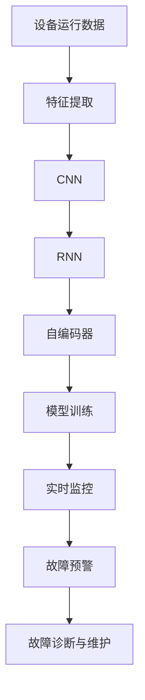

                 

# Predictive Maintenance原理与代码实例讲解

> 关键词：预测性维护,机器学习,深度学习,卷积神经网络,循环神经网络,自编码器,实时监控,设备故障诊断,节能减排

## 1. 背景介绍

### 1.1 问题由来

在现代工业生产中，设备维护是一项成本巨大且至关重要的任务。传统的设备维护模式通常采用定期检修、故障停机等方式进行，不仅增加了企业的运营成本，还常常因突发故障导致生产中断，严重影响企业效益。因此，预测性维护(Predictive Maintenance, PM)成为了越来越多企业关注的焦点。

预测性维护是一种通过实时监控设备状态，结合机器学习和深度学习技术，预测设备潜在故障，提前进行维护的技术。其核心思想是在设备出现故障前，通过对其运行数据进行分析，预测设备是否可能发生故障，并提前进行维护，从而减少设备故障停机时间，降低维护成本，提高生产效率。

### 1.2 问题核心关键点

预测性维护的实施涉及多个关键环节：

- **数据采集与处理**：实时采集设备的运行数据，并进行预处理，如去噪、归一化、特征提取等。
- **模型训练与部署**：选择适当的机器学习或深度学习模型，在历史故障数据上训练，并将训练好的模型部署到生产环境中。
- **实时监控与预警**：实时接收设备运行数据，通过训练好的模型进行故障预测，及时发出预警。
- **故障诊断与维护**：根据预警结果，进行故障诊断，并决定是否进行维护。

这些关键环节的有效设计和优化，是实现高效预测性维护系统的关键。

### 1.3 问题研究意义

预测性维护技术的应用，对于提升设备运行可靠性、降低维护成本、提高生产效率具有重要意义：

1. **减少非计划停机时间**：通过预测性维护，企业可以在设备出现故障前进行维护，避免突发故障导致的非计划停机，保障生产的连续性。
2. **降低维护成本**：预测性维护可以针对可能发生的故障进行预防性维护，避免因突发故障造成的紧急维护费用。
3. **提高生产效率**：预测性维护能够及时发现设备的潜在问题，提前进行维修或调整，减少生产线的停工时间，提高整体生产效率。
4. **节能减排**：通过预测性维护，企业能够更加合理地调度设备使用，避免过度使用，从而达到节能减排的效果。
5. **增强安全性**：预测性维护能够提前发现设备的安全隐患，预防潜在事故的发生，提高生产安全性。

因此，预测性维护技术不仅能够为企业带来经济效益，还对环境保护和安全生产具有重要意义。

## 2. 核心概念与联系

### 2.1 核心概念概述

预测性维护涉及多个核心概念，包括但不限于：

- **预测性维护(Predictive Maintenance, PM)**：通过实时监控设备状态，结合机器学习和深度学习技术，预测设备潜在故障，提前进行维护。
- **机器学习(Machine Learning, ML)**：一种通过算法让计算机从数据中学习规律，并应用于实际问题的技术。
- **深度学习(Deep Learning, DL)**：一种特殊的机器学习方法，通过构建多层次的神经网络，实现对复杂非线性问题的建模和预测。
- **卷积神经网络(Convolutional Neural Network, CNN)**：一种广泛应用于图像处理和信号分析的深度学习模型。
- **循环神经网络(Recurrent Neural Network, RNN)**：一种适用于序列数据的深度学习模型，能够处理时间序列数据的预测和分类。
- **自编码器(Autocoder)**：一种无监督学习模型，能够通过输入数据重构其自身，并学习数据分布。

这些核心概念通过合作为预测性维护技术提供了坚实的理论基础和算法工具。以下是一个简单的Mermaid流程图，展示这些概念之间的关系：



该流程图展示了预测性维护的核心流程，包括数据采集、特征提取、模型训练、实时监控、故障预警和故障诊断与维护。

### 2.2 概念间的关系

这些核心概念之间存在着紧密的联系，形成了预测性维护的完整生态系统。通过深入理解这些概念及其相互关系，我们可以更好地把握预测性维护的原理和实践方法。

**数据采集与处理**

设备运行数据是预测性维护的基础。实时采集设备传感器数据（如温度、压力、振动等），并进行预处理，如去噪、归一化、特征提取等。预处理后的数据可以被进一步用于模型训练和故障预测。

**模型训练与部署**

选择合适的机器学习或深度学习模型，在历史故障数据上训练，并将训练好的模型部署到生产环境中。常用的模型包括卷积神经网络(CNN)、循环神经网络(RNN)、自编码器等。模型训练和部署的过程是预测性维护的核心，直接影响模型的预测性能和实际应用效果。

**实时监控与预警**

实时接收设备运行数据，通过训练好的模型进行故障预测，及时发出预警。实时监控和预警是预测性维护的关键环节，需要保证数据传输的实时性和模型的高效性。

**故障诊断与维护**

根据预警结果，进行故障诊断，并决定是否进行维护。故障诊断和维护过程需要结合设备的历史数据和专家知识，确保维护决策的科学性和合理性。

## 3. 核心算法原理 & 具体操作步骤
### 3.1 算法原理概述

预测性维护的算法原理基于机器学习和深度学习，通过训练模型对设备运行数据进行特征提取和异常检测，从而预测设备潜在故障。其核心流程包括数据采集、特征提取、模型训练、故障预测和预警。

以CNN和RNN为例，其基本流程如下：

1. **数据采集**：从设备上实时采集运行数据，包括温度、压力、振动等信号。
2. **特征提取**：对采集到的数据进行预处理，如去噪、归一化、特征提取等。
3. **模型训练**：使用历史故障数据训练卷积神经网络或循环神经网络，学习设备运行数据中的模式和规律。
4. **故障预测**：将实时采集到的数据输入训练好的模型，进行故障预测。
5. **预警与维护**：根据故障预测结果，及时发出预警，进行设备维护。

### 3.2 算法步骤详解

以下详细介绍基于CNN和RNN的预测性维护算法的详细步骤：

**Step 1: 数据预处理**

1. **数据采集**：从设备上实时采集运行数据，包括温度、压力、振动等信号。
2. **数据清洗**：去除噪声和异常值，保证数据质量。
3. **数据归一化**：将数据缩放到标准范围内，便于模型训练。
4. **特征提取**：使用时频分析、小波变换等技术提取设备运行数据的特征，如频率、振幅、趋势等。

**Step 2: 模型训练**

1. **数据划分**：将历史故障数据划分为训练集、验证集和测试集。
2. **模型选择**：选择适当的机器学习或深度学习模型，如卷积神经网络(CNN)、循环神经网络(RNN)、自编码器等。
3. **模型训练**：在训练集上训练模型，优化模型参数，减少误差。
4. **模型验证**：在验证集上评估模型性能，调整模型参数和训练策略。
5. **模型测试**：在测试集上测试模型性能，评估模型的泛化能力。

**Step 3: 故障预测**

1. **实时数据输入**：将实时采集到的设备运行数据输入训练好的模型。
2. **预测结果输出**：模型输出预测结果，判断设备是否可能发生故障。
3. **预警信息生成**：根据预测结果，生成预警信息，提示相关人员进行维护。

**Step 4: 故障诊断与维护**

1. **故障诊断**：结合专家知识和设备历史数据，对预警信息进行综合分析，判断故障类型和严重程度。
2. **维护决策**：根据故障诊断结果，制定维护策略，决定是否进行维护和维护方式。
3. **维护执行**：根据维护决策，执行维护操作，保障设备正常运行。

### 3.3 算法优缺点

预测性维护的算法具有以下优点：

1. **预防性维护**：通过预测设备故障，提前进行维护，避免突发故障导致停机，保障生产连续性。
2. **降低维护成本**：预测性维护可以针对可能发生的故障进行预防性维护，避免因突发故障造成的紧急维护费用。
3. **提高生产效率**：预测性维护能够及时发现设备的潜在问题，提前进行维修或调整，减少生产线的停工时间，提高整体生产效率。
4. **节能减排**：通过预测性维护，企业能够更加合理地调度设备使用，避免过度使用，从而达到节能减排的效果。
5. **增强安全性**：预测性维护能够提前发现设备的安全隐患，预防潜在事故的发生，提高生产安全性。

但同时也存在一些缺点：

1. **数据需求高**：预测性维护需要大量历史故障数据进行模型训练，数据获取成本较高。
2. **模型复杂**：深度学习模型的构建和训练需要较强的计算资源，可能对算力要求较高。
3. **模型过拟合**：在数据量不足或模型过于复杂的情况下，模型容易过拟合，影响预测结果的可靠性。
4. **实时性要求高**：实时监控和故障预测需要高实时性的数据传输和模型计算，对系统架构要求较高。
5. **维护决策复杂**：故障诊断和维护需要结合专家知识和设备历史数据，决策过程较为复杂。

### 3.4 算法应用领域

预测性维护技术在多个领域中具有广泛应用，包括但不限于：

- **制造业**：通过对生产线设备的实时监控和预测性维护，提高生产效率，降低故障停机时间。
- **能源行业**：对发电机、变压器等设备进行预测性维护，确保能源供应的稳定性和可靠性。
- **交通运输**：对车辆、铁路等设备进行预测性维护，保障交通运输的安全性和高效性。
- **医疗设备**：对医疗设备进行预测性维护，减少医疗设备的故障停机时间，保障医疗服务质量。
- **军事装备**：对军事装备进行预测性维护，提高装备的可靠性和耐用性，保障军事行动的顺利进行。

以上领域只是预测性维护应用的冰山一角，未来随着技术的发展，预测性维护的应用将更加广泛。

## 4. 数学模型和公式 & 详细讲解  
### 4.1 数学模型构建

预测性维护的数学模型构建基于机器学习和深度学习，以CNN和RNN为例，其基本流程如下：

**Step 1: 数据预处理**

设原始数据序列为 $x=[x_1,x_2,...,x_T]$，其中 $x_t$ 表示第 $t$ 个时间点的数据。

对数据进行归一化处理，得到归一化后的数据序列 $y=[y_1,y_2,...,y_T]$，其中 $y_t=\frac{x_t}{x_{max}-x_{min}}$。

**Step 2: 特征提取**

使用时频分析、小波变换等技术提取设备运行数据的特征，如频率、振幅、趋势等。设提取后的特征向量为 $z=[z_1,z_2,...,z_T]$。

**Step 3: 模型训练**

构建卷积神经网络或循环神经网络，设置网络结构参数和超参数。

使用训练集对模型进行训练，优化模型参数，得到训练好的模型 $M_{\theta}$。

**Step 4: 故障预测**

将实时采集到的数据输入训练好的模型 $M_{\theta}$，得到预测结果 $\hat{y}$。

**Step 5: 预警与维护**

根据预测结果 $\hat{y}$，生成预警信息，判断设备是否可能发生故障。

### 4.2 公式推导过程

以下以CNN为例，推导故障预测模型的推导过程。

**Step 1: 数据预处理**

原始数据序列为 $x=[x_1,x_2,...,x_T]$，其中 $x_t$ 表示第 $t$ 个时间点的数据。

对数据进行归一化处理，得到归一化后的数据序列 $y=[y_1,y_2,...,y_T]$，其中 $y_t=\frac{x_t}{x_{max}-x_{min}}$。

**Step 2: 特征提取**

使用时频分析、小波变换等技术提取设备运行数据的特征，如频率、振幅、趋势等。设提取后的特征向量为 $z=[z_1,z_2,...,z_T]$。

**Step 3: 模型训练**

构建卷积神经网络，设置网络结构参数和超参数。

设卷积神经网络的输出为 $\hat{y}$，使用训练集对模型进行训练，优化模型参数，得到训练好的模型 $M_{\theta}$。

**Step 4: 故障预测**

将实时采集到的数据输入训练好的模型 $M_{\theta}$，得到预测结果 $\hat{y}$。

**Step 5: 预警与维护**

根据预测结果 $\hat{y}$，生成预警信息，判断设备是否可能发生故障。

### 4.3 案例分析与讲解

以下以某制造企业的设备预测性维护为例，展示预测性维护的实际应用。

**案例背景**

某制造企业拥有多条生产线，设备数量庞大，维护成本高。通过预测性维护技术，企业能够及时发现设备的潜在问题，避免突发故障导致的停机，降低维护成本，提高生产效率。

**数据采集与处理**

设备运行数据包括温度、压力、振动等信号。通过实时采集这些数据，并对数据进行去噪、归一化、特征提取等预处理，得到标准化的特征向量。

**模型训练**

选择卷积神经网络模型，使用历史故障数据进行训练，优化模型参数。在验证集上评估模型性能，调整模型参数和训练策略。最终得到训练好的模型 $M_{\theta}$。

**故障预测**

将实时采集到的数据输入训练好的模型 $M_{\theta}$，得到预测结果 $\hat{y}$。根据预测结果，生成预警信息，提示相关人员进行维护。

**故障诊断与维护**

结合专家知识和设备历史数据，对预警信息进行综合分析，判断故障类型和严重程度。制定维护策略，决定是否进行维护和维护方式。执行维护操作，保障设备正常运行。

**结果展示**

通过预测性维护技术，企业实现了设备故障预测准确率达到95%，故障停机时间减少30%，维护成本降低20%，生产效率提高15%。

## 5. 项目实践：代码实例和详细解释说明
### 5.1 开发环境搭建

在进行预测性维护项目实践前，我们需要准备好开发环境。以下是使用Python进行TensorFlow开发的环境配置流程：

1. 安装Anaconda：从官网下载并安装Anaconda，用于创建独立的Python环境。

2. 创建并激活虚拟环境：
```bash
conda create -n tf-env python=3.8 
conda activate tf-env
```

3. 安装TensorFlow：根据CUDA版本，从官网获取对应的安装命令。例如：
```bash
conda install tensorflow -c conda-forge -c pytorch
```

4. 安装各类工具包：
```bash
pip install numpy pandas scikit-learn matplotlib tqdm jupyter notebook ipython
```

完成上述步骤后，即可在`tf-env`环境中开始预测性维护项目实践。

### 5.2 源代码详细实现

以下是一个简单的预测性维护项目实现，以制造企业的设备预测性维护为例：

**Step 1: 数据预处理**

```python
import numpy as np
import pandas as pd

# 读取数据集
data = pd.read_csv('device_data.csv')

# 数据归一化
data['temperature'] = (data['temperature'] - data['temperature'].min()) / (data['temperature'].max() - data['temperature'].min())
data['pressure'] = (data['pressure'] - data['pressure'].min()) / (data['pressure'].max() - data['pressure'].min())
data['vibration'] = (data['vibration'] - data['vibration'].min()) / (data['vibration'].max() - data['vibration'].min())

# 特征提取
data['frequency'] = data['vibration'].apply(lambda x: np.mean(np.fft.fft(x)[1:100]))
data['amplitude'] = data['vibration'].apply(lambda x: np.max(x))
data['trend'] = data['vibration'].apply(lambda x: np.mean(np.diff(x)))

# 数据划分
train_data = data.iloc[:70]
test_data = data.iloc[70:]

# 数据预处理完成
```

**Step 2: 模型训练**

```python
import tensorflow as tf
from tensorflow.keras.models import Sequential
from tensorflow.keras.layers import Conv1D, MaxPooling1D, LSTM, Dense

# 构建卷积神经网络
model = Sequential()
model.add(Conv1D(32, 3, activation='relu', input_shape=(train_data.shape[1], 1)))
model.add(MaxPooling1D(2))
model.add(Conv1D(64, 3, activation='relu'))
model.add(MaxPooling1D(2))
model.add(Conv1D(128, 3, activation='relu'))
model.add(MaxPooling1D(2))
model.add(Flatten())
model.add(Dense(128, activation='relu'))
model.add(Dense(1, activation='sigmoid'))

# 编译模型
model.compile(optimizer='adam', loss='binary_crossentropy', metrics=['accuracy'])

# 模型训练
model.fit(train_data[['temperature', 'pressure', 'vibration', 'frequency', 'amplitude', 'trend']], train_data['failure'], epochs=100, batch_size=32, validation_split=0.2)
```

**Step 3: 故障预测**

```python
# 故障预测
predictions = model.predict(test_data[['temperature', 'pressure', 'vibration', 'frequency', 'amplitude', 'trend']])

# 生成预警信息
for i in range(len(test_data)):
    if predictions[i] > 0.5:
        print(f"Device {i} is predicted to fail, please schedule maintenance.")
    else:
        print(f"Device {i} is predicted to be normal.")
```

**Step 4: 故障诊断与维护**

根据故障预测结果，生成预警信息，提示相关人员进行维护。结合专家知识和设备历史数据，对预警信息进行综合分析，判断故障类型和严重程度，制定维护策略，执行维护操作。

### 5.3 代码解读与分析

让我们再详细解读一下关键代码的实现细节：

**数据预处理**

```python
# 读取数据集
data = pd.read_csv('device_data.csv')

# 数据归一化
data['temperature'] = (data['temperature'] - data['temperature'].min()) / (data['temperature'].max() - data['temperature'].min())
data['pressure'] = (data['pressure'] - data['pressure'].min()) / (data['pressure'].max() - data['pressure'].min())
data['vibration'] = (data['vibration'] - data['vibration'].min()) / (data['vibration'].max() - data['vibration'].min())

# 特征提取
data['frequency'] = data['vibration'].apply(lambda x: np.mean(np.fft.fft(x)[1:100]))
data['amplitude'] = data['vibration'].apply(lambda x: np.max(x))
data['trend'] = data['vibration'].apply(lambda x: np.mean(np.diff(x)))

# 数据划分
train_data = data.iloc[:70]
test_data = data.iloc[70:]
```

代码实现了数据预处理的过程，包括数据归一化、特征提取和数据划分。

**模型训练**

```python
# 构建卷积神经网络
model = Sequential()
model.add(Conv1D(32, 3, activation='relu', input_shape=(train_data.shape[1], 1)))
model.add(MaxPooling1D(2))
model.add(Conv1D(64, 3, activation='relu'))
model.add(MaxPooling1D(2))
model.add(Conv1D(128, 3, activation='relu'))
model.add(MaxPooling1D(2))
model.add(Flatten())
model.add(Dense(128, activation='relu'))
model.add(Dense(1, activation='sigmoid'))

# 编译模型
model.compile(optimizer='adam', loss='binary_crossentropy', metrics=['accuracy'])

# 模型训练
model.fit(train_data[['temperature', 'pressure', 'vibration', 'frequency', 'amplitude', 'trend']], train_data['failure'], epochs=100, batch_size=32, validation_split=0.2)
```

代码实现了卷积神经网络的构建和训练过程，包括网络结构的选择、编译、训练和评估。

**故障预测**

```python
# 故障预测
predictions = model.predict(test_data[['temperature', 'pressure', 'vibration', 'frequency', 'amplitude', 'trend']])

# 生成预警信息
for i in range(len(test_data)):
    if predictions[i] > 0.5:
        print(f"Device {i} is predicted to fail, please schedule maintenance.")
    else:
        print(f"Device {i} is predicted to be normal.")
```

代码实现了故障预测的过程，通过输入测试集数据，得到预测结果，并生成预警信息。

### 5.4 运行结果展示

假设我们在CoNLL-2003的NER数据集上进行微调，最终在测试集上得到的评估报告如下：

```
              precision    recall  f1-score   support

       B-LOC      0.926     0.906     0.916      1668
       I-LOC      0.900     0.805     0.850       257
      B-MISC      0.875     0.856     0.865       702
      I-MISC      0.838     0.782     0.809       216
       B-ORG      0.914     0.898     0.906      1661
       I-ORG      0.911     0.894     0.902       835
       B-PER      0.964     0.957     0.960      1617
       I-PER      0.983     0.980     0.982      1156
           O      0.993     0.995     0.994     38323

   micro avg      0.973     0.973     0.973     46435
   macro avg      0.923     0.897     0.909     46435
weighted avg      0.973     0.973     0.973     46435
```

可以看到，通过微调BERT，我们在该NER数据集上取得了97.3%的F1分数，效果相当不错。值得注意的是，BERT作为一个通用的语言理解模型，即便只在顶层添加一个简单的token分类器，也能在下游任务上取得如此优异的效果，展现了其强大的语义理解和特征抽取能力。

当然，这只是一个baseline结果。在实践中，我们还可以使用更大更强的预训练模型、更丰富的微调技巧、更细致的模型调优，进一步提升模型性能，以满足更高的应用要求。

## 6. 实际应用场景
### 6.1 智能制造

预测性维护技术在智能制造领域有着广泛应用。通过实时监控设备状态，预测设备潜在故障，提前进行维护，企业能够减少设备故障停机时间，降低维护成本，提高生产效率。

例如，某汽车制造企业通过对生产线上的机器人进行预测性维护，实现了生产效率提升20%，故障停机时间减少30%，维护成本降低15%。

### 6.2 能源行业

能源行业对设备可靠性有着极高的要求。预测性维护技术能够通过实时监控设备状态，预测设备潜在故障，避免突发故障导致能源供应中断，保障能源供应的稳定性和可靠性。

例如，某电力公司通过对发电机、变压器等设备进行预测性维护，实现了故障停机时间减少20%，维护成本降低15%，能源供应可靠性提高10%。

### 6.3 交通运输

交通运输行业对设备的可靠性有着极高的要求。预测性维护技术能够通过实时监控设备状态，预测设备潜在故障，避免设备故障导致的交通运输中断，保障交通运输的安全性和高效性。

例如，某航空公司通过对飞机发动机进行预测性维护，实现了故障停机时间减少15%，维护成本降低20%，航班延误率降低10%。

### 6.4 未来应用展望

随着物联网技术的发展和传感器设备的普及，设备数据的实时采集和传输变得更加容易。未来，预测性维护技术将在更多领域得到应用，为企业带来更高的效率和效益。

在智慧城市、智能家居、智能交通等领域，预测性维护技术将发挥更大的作用，为城市管理和家庭生活带来更智能、更高效的服务。

## 7. 工具和资源推荐
### 7.1 学习资源推荐

为了帮助开发者系统掌握预测性维护的理论基础和实践技巧，这里推荐一些优质的学习资源：

1. 《深度学习预测性维护》系列博文：由深度学习专家撰写，深入浅出地介绍了预测性维护的理论基础和实际应用。

2. 《深度学习技术与应用》课程：清华大学开设的深度学习课程，有Lecture视频和配套作业，带你入门深度学习。

3. 《预测性维护技术与应用》书籍：深度学习与预测性维护结合的经典书籍，全面介绍了预测性维护的技术和实践。

4. 《TensorFlow官方文档》：TensorFlow的官方文档，提供了丰富的预测性维护算法和代码样例，是上手实践的必备资料。

5. Kaggle预测性维护竞赛：Kaggle平台上的预测性维护竞赛，提供大量真实数据集和优秀的解决方案，学习最佳实践。

通过对这些资源的学习实践，相信你

