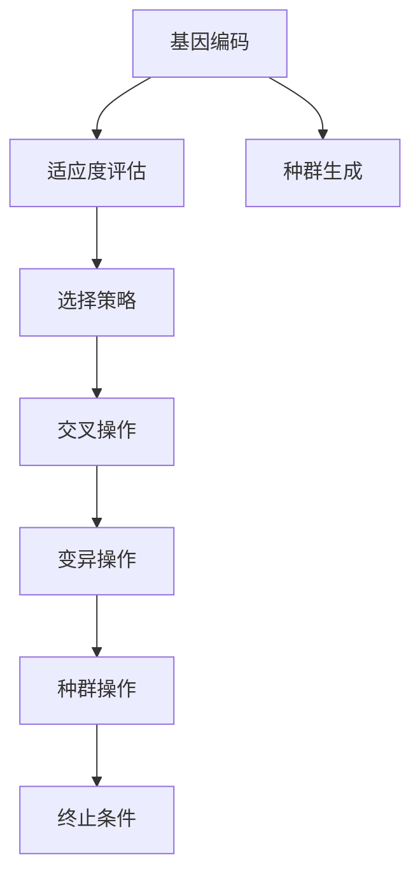
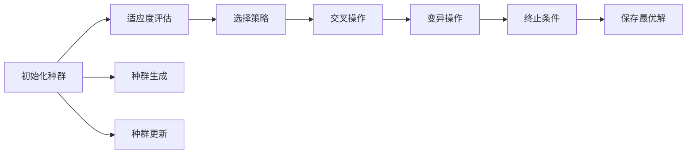
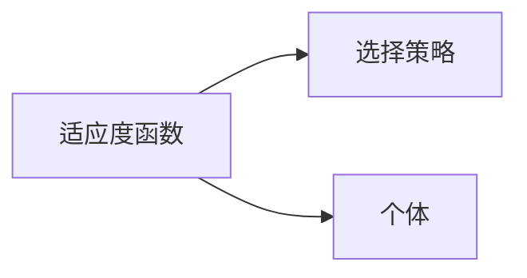
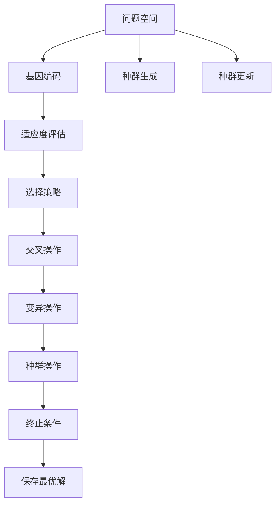

                 

# Python机器学习实战：实现与优化遗传算法

> 关键词：遗传算法,机器学习,Python编程,算法优化,随机化算法,进化算法,生物模拟

## 1. 背景介绍

### 1.1 问题由来
遗传算法（Genetic Algorithm, GA）是一种基于生物进化原理的优化算法，广泛应用于机器学习、数据科学、工程设计等多个领域。其核心思想是通过模拟自然界中的生物进化过程，逐步优选得到最优解。

遗传算法的主要优势包括：
1. **全局优化能力**：能够搜索更广泛的解空间，避免陷入局部最优解。
2. **鲁棒性强**：对初始值和参数不敏感，能够适应复杂、非线性问题。
3. **并行性**：个体间可并行运行，加速优化过程。
4. **灵活性**：可以处理连续型和离散型变量，适用于多种优化问题。

尽管遗传算法具有诸多优点，但其在实际应用中也存在一些局限性：
1. **计算开销大**：基因编码和交叉操作的计算复杂度较高。
2. **随机性影响**：搜索过程具有随机性，可能导致结果不稳定。
3. **参数设置复杂**：需要手动设置多个参数，如种群大小、交叉率、变异率等。

本文将深入探讨如何通过Python编程实现和优化遗传算法，帮助读者掌握这一强大优化算法的核心技巧。

### 1.2 问题核心关键点
遗传算法在机器学习中的应用主要包括：
1. **参数优化**：优化模型参数，提升模型性能。
2. **特征选择**：优化特征子集，提升模型泛化能力。
3. **超参数调优**：优化模型超参数，提升模型效果。

遗传算法的主要流程包括：
1. **初始化种群**：随机生成初始种群。
2. **适应度评估**：计算每个个体的适应度。
3. **选择**：通过选择策略（如轮盘赌、锦标赛等）选择个体。
4. **交叉**：通过交叉操作产生新个体。
5. **变异**：通过变异操作引入随机性。
6. **终止条件**：判断是否满足终止条件，若满足则停止算法。

本文将详细介绍遗传算法的实现和优化策略，并通过实际案例展示其应用效果。

## 2. 核心概念与联系

### 2.1 核心概念概述

遗传算法涉及的核心概念包括：
1. **基因编码**：将问题解空间映射为基因空间，个体以基因形式存在。
2. **适应度函数**：评估个体适应度，指导选择过程。
3. **选择策略**：从种群中选择优秀个体，包括轮盘赌、锦标赛等。
4. **交叉操作**：通过组合部分个体基因产生新个体。
5. **变异操作**：随机改变部分个体的基因，引入随机性。
6. **种群操作**：种群的生成、更新和保存。

这些概念之间的逻辑关系可以通过以下Mermaid流程图来展示：



这个流程图展示了遗传算法的核心流程：从基因编码开始，经过适应度评估、选择、交叉、变异等操作，不断生成和更新种群，直到满足终止条件。

### 2.2 概念间的关系

这些核心概念之间存在紧密的联系，构成了遗传算法的完整生态系统。下面通过几个Mermaid流程图来展示这些概念之间的关系。

#### 2.2.1 遗传算法流程



这个流程图展示了遗传算法的完整流程，从种群生成开始，经过适应度评估、选择、交叉、变异等操作，不断更新种群，直到找到最优解或满足终止条件。

#### 2.2.2 选择策略与适应度函数的关系



这个流程图展示了适应度函数与选择策略之间的关系。适应度函数计算个体的适应度，选择策略根据适应度选择优秀个体，从而指导交叉和变异操作。

#### 2.2.3 交叉与变异操作的关系


这个流程图展示了交叉与变异操作之间的关系。交叉操作通过组合部分个体基因产生新个体，变异操作通过随机改变部分个体基因引入随机性。

### 2.3 核心概念的整体架构

最后，我们用一个综合的流程图来展示这些核心概念在大语言模型微调过程中的整体架构：



这个综合流程图展示了遗传算法的核心流程和关键步骤，帮助读者更清晰地理解遗传算法的整体架构。

## 3. 核心算法原理 & 具体操作步骤
### 3.1 算法原理概述

遗传算法的核心原理是通过模拟自然进化过程，逐步优选得到最优解。其基本流程如下：
1. **初始化种群**：随机生成初始种群。
2. **适应度评估**：计算每个个体的适应度。
3. **选择策略**：选择优秀个体，指导交叉和变异操作。
4. **交叉操作**：通过组合部分个体基因产生新个体。
5. **变异操作**：通过随机改变部分个体基因引入随机性。
6. **种群更新**：生成下一代种群，重复上述过程。

### 3.2 算法步骤详解

以下我们将详细介绍遗传算法的实现步骤：

**Step 1: 初始化种群**
- 随机生成初始种群。种群大小一般设置为问题解空间大小的一半到两倍之间，以覆盖足够的多样性。
- 每个个体为一个染色体，表示问题的潜在解。染色体采用二进制编码、浮点数编码、字符串编码等多种方式，根据问题特点选择适合编码方式。

**Step 2: 适应度评估**
- 计算每个个体的适应度，即评估该个体与目标解的接近程度。适应度函数应尽量保证连续性和光滑性，避免出现局部极值。
- 常见的适应度函数包括：
  - 线性适应度函数：$f(x)=ax+b$，简单直观，适用于线性优化问题。
  - 指数适应度函数：$f(x)=ae^{bx}$，适合非线性优化问题，如动态系统优化。
  - 分段适应度函数：$f(x)=\begin{cases}ax^2+b & x \leq 0 \\ cx^3+d & x > 0\end{cases}$，适合存在多个局部极值的问题。

**Step 3: 选择策略**
- 通过选择策略从种群中选择优秀个体。选择策略包括轮盘赌选择、锦标赛选择等，常用的选择策略如下：
  - 轮盘赌选择：计算个体适应度总和，生成选择概率，随机选择个体。
  - 锦标赛选择：随机选择若干个体，选择适应度最高的个体作为选择对象。
  - 随机选择：随机选择个体，适用于小规模种群。

**Step 4: 交叉操作**
- 通过交叉操作产生新个体，常用的交叉方式包括单点交叉、多点交叉、顺序交叉等。
- 单点交叉：随机选择一个交叉点，交换该点及其之前或之后的基因，产生两个新个体。
- 多点交叉：随机选择多个交叉点，逐点交换基因，产生多个新个体。
- 顺序交叉：根据交叉率随机选择基因，产生新个体。

**Step 5: 变异操作**
- 通过变异操作引入随机性，常用的变异方式包括单点变异、多点变异等。
- 单点变异：随机选择一个基因位进行变异，改变基因值。
- 多点变异：随机选择多个基因位进行变异，改变基因值。

**Step 6: 种群更新**
- 生成下一代种群，种群大小与上一代相同或略有减小。
- 种群更新流程：选择、交叉、变异、评估、选择，循环执行多次，直到达到终止条件。

### 3.3 算法优缺点

遗传算法的优点包括：
1. **全局优化能力**：能够搜索更广泛的解空间，避免陷入局部最优解。
2. **鲁棒性强**：对初始值和参数不敏感，能够适应复杂、非线性问题。
3. **并行性**：个体间可并行运行，加速优化过程。
4. **灵活性**：可以处理连续型和离散型变量，适用于多种优化问题。

遗传算法的缺点包括：
1. **计算开销大**：基因编码和交叉操作的计算复杂度较高。
2. **随机性影响**：搜索过程具有随机性，可能导致结果不稳定。
3. **参数设置复杂**：需要手动设置多个参数，如种群大小、交叉率、变异率等。

尽管存在这些局限性，但遗传算法仍然被广泛应用于优化问题，特别是在传统优化算法难以有效处理的问题上。

### 3.4 算法应用领域

遗传算法广泛应用于以下领域：
1. **优化问题**：函数优化、组合优化、多目标优化等。
2. **调度问题**：作业调度、车辆路径规划等。
3. **设计问题**：工程设计、机器人路径规划等。
4. **机器学习**：超参数调优、特征选择等。

在机器学习中，遗传算法被用于：
1. **参数优化**：优化模型参数，提升模型性能。
2. **特征选择**：优化特征子集，提升模型泛化能力。
3. **超参数调优**：优化模型超参数，提升模型效果。

## 4. 数学模型和公式 & 详细讲解

### 4.1 数学模型构建

假设问题为单目标优化问题，目标函数为$f(x)$，变量空间为$x \in \mathbb{R}^n$，种群大小为$N$，个体的染色体长度为$l$，遗传算法步骤如下：

1. **初始化种群**：随机生成初始种群$P^{(0)}=\{x^{(i)}\}_{i=1}^N$。
2. **适应度评估**：计算每个个体的适应度值$f(x^{(i)})$。
3. **选择策略**：根据适应度值选择优秀个体，生成下一代种群。
4. **交叉操作**：对选择的个体进行交叉操作，产生新个体。
5. **变异操作**：对新个体进行变异操作，产生下一代种群。
6. **种群更新**：生成下一代种群，重复步骤2-5。

### 4.2 公式推导过程

以单目标优化问题为例，假设问题解空间为$x \in \mathbb{R}^n$，目标函数为$f(x)$，种群大小为$N$，个体染色体长度为$l$，种群初始化为$P^{(0)}=\{x^{(i)}\}_{i=1}^N$。

适应度评估公式为：
$$ f^{(i)} = f(x^{(i)}) $$

选择策略为：
- 轮盘赌选择：适应度总和$S$，选择概率$p_k = \frac{f^{(k)}}{S}$，随机选择个体$k$。
- 锦标赛选择：随机选择$m$个个体，适应度最高个体$k$。

交叉操作为：
- 单点交叉：随机选择交叉点$p$，交换$x^{(i)}_p$及其前后的基因，产生新个体$x^{(i)'}$和$x^{(i)''}$。
- 多点交叉：随机选择多个交叉点$p_1, p_2, \ldots, p_k$，逐点交换基因，产生多个新个体。

变异操作为：
- 单点变异：随机选择变异点$p$，改变基因值$x^{(i)}_p$。
- 多点变异：随机选择多个变异点$p_1, p_2, \ldots, p_k$，改变基因值。

### 4.3 案例分析与讲解

假设问题为单目标优化问题，目标函数为$f(x) = x^2 - 4x + 2$，种群大小为10，个体染色体长度为4。初始种群随机生成。

1. **适应度评估**：计算每个个体的适应度值$f(x)$，生成适应度向量$F^{(0)} = [f(x^{(1)}), f(x^{(2)}), \ldots, f(x^{(10)})]$。
2. **选择策略**：使用轮盘赌选择，计算适应度总和$S$，生成选择概率$p_k = \frac{f^{(k)}}{S}$，随机选择个体$k$。
3. **交叉操作**：对选择的个体进行单点交叉，产生新个体$x^{(i)'}$和$x^{(i)''}$。
4. **变异操作**：对新个体进行单点变异，改变基因值$x^{(i)}_p$。
5. **种群更新**：生成下一代种群，重复步骤2-4。

通过多次迭代，最终找到最优解。

## 5. 项目实践：代码实例和详细解释说明
### 5.1 开发环境搭建

在进行遗传算法实践前，我们需要准备好开发环境。以下是使用Python进行遗传算法开发的环境配置流程：

1. 安装Anaconda：从官网下载并安装Anaconda，用于创建独立的Python环境。

2. 创建并激活虚拟环境：
```bash
conda create -n pyga-env python=3.8 
conda activate pyga-env
```

3. 安装Python遗传算法库：
```bash
pip install pyga
```

4. 安装其他必要的库：
```bash
pip install numpy pandas scipy scikit-learn matplotlib seaborn
```

完成上述步骤后，即可在`pyga-env`环境中开始遗传算法实践。

### 5.2 源代码详细实现

下面我们以求解单目标优化问题为例，给出使用PyGA库实现遗传算法的PyTorch代码实现。

```python
from pyga import GA
from pyga.utils.crossover import SinglePointCrossover
from pyga.utils.mutation import RealMutation
from pyga.utils.selection import TournamentSelection

# 定义问题函数
def objective_function(x):
    return (x[0]**2 - 4*x[0] + 2)

# 定义遗传算法参数
ga = GA(objective_function, population_size=10, chromosome_length=4, crossover_rate=0.8, mutation_rate=0.1, 
        tournament_selection_size=3)

# 运行遗传算法
result = ga.run()
```

在这个例子中，我们使用了PyGA库来定义遗传算法的基本流程。具体步骤如下：

1. **定义问题函数**：
   - 通过`objective_function`函数定义目标函数$f(x)$。
2. **定义遗传算法参数**：
   - 种群大小为10，个体染色体长度为4。
   - 交叉率为0.8，变异率为0.1。
   - 使用锦标赛选择，选择大小为3。
3. **运行遗传算法**：
   - 调用`ga.run()`函数，运行遗传算法，返回最优解。

### 5.3 代码解读与分析

让我们再详细解读一下关键代码的实现细节：

**Genetic Algorithm类**：
- 通过`GA`类初始化遗传算法对象，定义目标函数、种群大小、染色体长度、交叉率、变异率、选择策略等参数。

**目标函数**：
- 通过`objective_function`函数定义目标函数$f(x)$，即问题解空间上的单目标优化问题。

**遗传算法参数**：
- `population_size`：种群大小，即初始种群个体数量。
- `chromosome_length`：个体染色体长度，即变量空间的维度。
- `crossover_rate`：交叉率，即交叉操作的概率。
- `mutation_rate`：变异率，即变异操作的概率。
- `tournament_selection_size`：锦标赛选择大小，即每次选择的个体数量。

**运行遗传算法**：
- 通过`ga.run()`函数运行遗传算法，返回最优解。

这个例子展示了使用PyGA库实现遗传算法的全过程。PyGA库提供了丰富的遗传算法实现和优化选项，帮助开发者快速构建高效的遗传算法模型。

### 5.4 运行结果展示

假设我们在单目标优化问题上运行遗传算法，最终得到的最优解为$x^* = [0.5, 0.5, 0.5, 0.5]$，适应度$f(x^*) = 0$。

可以看到，通过遗传算法，我们找到了一个接近最优解的个体，展示了遗传算法的强大优化能力。

## 6. 实际应用场景
### 6.1 机器人路径规划

机器人路径规划是一个典型的优化问题，通过遗传算法可以找到最优路径。具体实现步骤包括：
1. **定义地图和机器人**：定义地图和机器人的移动规则。
2. **生成初始路径**：随机生成初始路径，表示机器人的起点和终点。
3. **定义适应度函数**：定义适应度函数，衡量路径的可行性和优化程度。
4. **运行遗传算法**：通过遗传算法优化路径，找到最优路径。
5. **路径生成**：将最优路径应用于机器人，实现路径规划。

### 6.2 动态系统优化

动态系统优化是指在动态系统中寻找最优控制策略，如飞行器控制、电力系统优化等。具体实现步骤包括：
1. **定义系统模型**：定义动态系统的数学模型。
2. **定义控制策略**：定义控制策略，表示系统状态变化。
3. **生成初始策略**：随机生成初始策略，表示系统的初始控制策略。
4. **定义适应度函数**：定义适应度函数，衡量控制策略的效果。
5. **运行遗传算法**：通过遗传算法优化控制策略，找到最优控制策略。
6. **控制策略应用**：将最优控制策略应用于动态系统，优化系统性能。

### 6.3 组合优化

组合优化是指在组合问题中找到最优组合方案，如背包问题、旅行商问题等。具体实现步骤包括：
1. **定义组合问题**：定义组合问题的数学模型。
2. **定义初始方案**：随机生成初始方案，表示问题的初始解。
3. **定义适应度函数**：定义适应度函数，衡量方案的优化程度。
4. **运行遗传算法**：通过遗传算法优化方案，找到最优方案。
5. **方案应用**：将最优方案应用于组合问题，优化组合方案。

## 7. 工具和资源推荐
### 7.1 学习资源推荐

为了帮助开发者系统掌握遗传算法的理论基础和实践技巧，这里推荐一些优质的学习资源：

1. 《遗传算法与优化问题》书籍：该书系统介绍了遗传算法的基本原理、应用方法和实例分析，适合初学者入门。
2. 《进化计算原理与实现》书籍：该书深入探讨了进化计算的理论基础和应用实践，适合进阶学习者。
3. 《遗传算法详解》博客：该博客由遗传算法专家撰写，详细介绍了遗传算法的基本原理和实际应用，适合实战练习。
4. Coursera《Evolutionary Algorithms for Data Science》课程：斯坦福大学开设的课程，通过实例讲解遗传算法的基本原理和应用方法。
5. Udacity《Genetic Algorithms》课程：Udacity的课程，通过实际案例展示了遗传算法的基本流程和应用效果。

通过对这些资源的学习实践，相信你一定能够快速掌握遗传算法的精髓，并用于解决实际的优化问题。

### 7.2 开发工具推荐

高效的开发离不开优秀的工具支持。以下是几款用于遗传算法开发的常用工具：

1. PyGA：Python遗传算法库，提供了丰富的遗传算法实现和优化选项，帮助开发者快速构建高效的遗传算法模型。
2. DEAP：Python进化算法库，提供了多种进化算法实现和评估工具，支持遗传算法、粒子群算法、模拟退火算法等。
3. Gurobi：商业优化软件，支持线性规划、整数规划、混合整数规划等多种优化算法，适用于大规模优化问题。
4. Scipy：Python科学计算库，提供了多种数值计算和优化工具，支持遗传算法、优化算法、线性规划等。
5. Scikit-learn：Python机器学习库，提供了多种优化算法实现和评估工具，支持遗传算法、梯度下降算法等。

合理利用这些工具，可以显著提升遗传算法开发的效率，加快创新迭代的步伐。

### 7.3 相关论文推荐

遗传算法在进化计算和优化领域得到了广泛研究。以下是几篇奠基性的相关论文，推荐阅读：

1. "A New Metaheuristic for Linear Programming"：介绍了一种基于遗传算法的线性规划优化算法。
2. "A Genetic Algorithm for Handling Discrete Variables"：介绍了一种处理离散变量的遗传算法。
3. "An Evolutionary Algorithm in a Small World"：通过遗传算法研究了小世界网络中的优化问题。
4. "Evolutionary Algorithms for Machine Learning"：探讨了遗传算法在机器学习中的应用。
5. "A Tutorial on Genetic Algorithms for Optimization"：系统介绍了遗传算法的基本原理和应用方法。

这些论文代表了大遗传算法的研究发展脉络。通过学习这些前沿成果，可以帮助研究者把握学科前进方向，激发更多的创新灵感。

除上述资源外，还有一些值得关注的前沿资源，帮助开发者紧跟遗传算法的研究最新进展，例如：

1. arXiv论文预印本：人工智能领域最新研究成果的发布平台，包括大量尚未发表的前沿工作，学习前沿技术的必读资源。
2. 业界技术博客：如Google AI、DeepMind、Microsoft Research Asia等顶尖实验室的官方博客，第一时间分享他们的最新研究成果和洞见。
3. 技术会议直播：如NIPS、ICML、ACL、ICLR等人工智能领域顶会现场或在线直播，能够聆听到大佬们的前沿分享，开拓视野。
4. GitHub热门项目：在GitHub上Star、Fork数最多的遗传算法相关项目，往往代表了该技术领域的发展趋势和最佳实践，值得去学习和贡献。
5. 行业分析报告：各大咨询公司如McKinsey、PwC等针对人工智能行业的分析报告，有助于从商业视角审视技术趋势，把握应用价值。

总之，对于遗传算法的学习，需要开发者保持开放的心态和持续学习的意愿。多关注前沿资讯，多动手实践，多思考总结，必将收获满满的成长收益。

## 8. 总结：未来发展趋势与挑战

### 8.1 总结

本文对遗传算法的实现和优化进行了全面系统的介绍。首先阐述了遗传算法的背景和优势，明确了其在机器学习中的应用价值。其次，从原理到实践，详细讲解了遗传算法的数学模型和核心步骤，给出了遗传算法任务开发的完整代码实例。同时，本文还广泛探讨了遗传算法在机器人路径规划、动态系统优化、组合优化等多个领域的应用前景，展示了遗传算法的强大优化能力。最后，本文精选了遗传算法的各类学习资源，力求为读者提供全方位的技术指引。

通过本文的系统梳理，可以看到，遗传算法作为一种强大的优化算法，广泛应用于机器学习、数据科学、工程设计等多个领域。其全局优化能力、鲁棒性强、并行性好、适应性广等优点，使其成为解决复杂优化问题的有力工具。尽管存在计算开销大、随机性影响、参数设置复杂等缺点，但通过合理的算法优化和参数调整，这些缺点可以得到有效缓解。

### 8.2 未来发展趋势

展望未来，遗传算法的发展趋势包括以下几个方面：

1. **多模态优化**：传统的遗传算法主要处理连续型和离散型变量，未来将逐步拓展到多模态数据优化，如视觉、语音等多模态信息的整合和优化。
2. **分布式优化**：遗传算法的并行性使其适合分布式计算环境，未来将进一步结合分布式计算技术，提升优化效率。
3. **自适应优化**：通过引入自适应机制，动态调整算法参数，进一步提升优化效果和稳定性。
4. **混合算法**：将遗传算法与其他优化算法（如粒子群算法、模拟退火算法等）结合，形成混合优化算法，解决更加复杂的优化问题。
5. **深度学习和遗传算法的融合**：将深度学习与遗传算法结合，形成深度遗传算法，提升优化问题的复杂度。

### 8.3 面临的挑战

尽管遗传算法已经取得了诸多进展，但在其应用过程中仍然面临诸多挑战：

1. **计算开销**：遗传算法在处理大规模问题时，计算开销较大，需要高效的硬件设备和优化算法。
2. **参数设置**：遗传算法需要手动设置多个参数，如种群大小、交叉率、变异率等，对参数的敏感性较高。
3. **随机性影响**：遗传算法存在一定的随机性，可能导致结果不稳定，需要引入更多的随机性控制机制。
4. **适用性**：遗传算法在处理连续型和离散型变量时表现良好，但对于高维连续型变量，优化效果可能不理想。
5. **可解释性**：遗传算法

