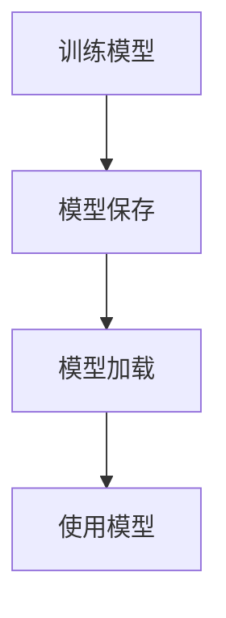

                 

# Python机器学习实战：机器学习模型的持久化与重新加载

> 关键词：机器学习模型, 持久化, 模型加载, Python, scikit-learn, TensorFlow, Keras, PyTorch, Jupyter Notebook

## 1. 背景介绍

在当今数据驱动的时代，机器学习模型的应用范围越来越广，从图像识别、自然语言处理到金融分析、医疗诊断等，各个领域都在使用机器学习模型进行数据分析和预测。然而，机器学习模型的训练往往需要大量的计算资源和时间，且训练好的模型需要在多个场景中重复使用，这就涉及到了模型的持久化与重新加载问题。

模型的持久化与重新加载是机器学习开发中不可或缺的步骤。持久化模型可以将训练好的模型保存下来，以便在后续的开发、测试和生产环境中使用，而重新加载模型则可以方便地使用已经训练好的模型进行预测或进一步训练。这篇文章将介绍在Python中使用scikit-learn、TensorFlow、Keras和PyTorch等流行的机器学习框架进行模型的持久化与重新加载的实践方法。

## 2. 核心概念与联系

### 2.1 核心概念概述

- **模型持久化**：将训练好的模型保存下来，以便在后续的开发、测试和生产环境中使用。
- **模型加载**：将保存好的模型读取到内存中，以便进行预测或进一步训练。
- **模型保存**：将模型以特定的格式（如pickle、h5、tf模型等）保存下来，以便进行持久化。
- **模型加载**：将保存好的模型读取到内存中，以便进行加载和使用。

这些核心概念之间存在着紧密的联系，通过模型的保存和加载，可以方便地将训练好的模型在不同环境中重复使用，从而节省训练时间和计算资源。

### 2.2 核心概念的联系

下图展示了模型持久化与重新加载的基本流程：



在实际应用中，训练好的模型通常需要保存到硬盘或云存储中，以便在后续的开发、测试和生产环境中使用。而加载模型则可以通过不同的方式将保存好的模型读取到内存中，以便进行预测或进一步训练。

## 3. 核心算法原理 & 具体操作步骤

### 3.1 算法原理概述

在机器学习中，模型的持久化与重新加载通常涉及以下几个步骤：

1. **模型保存**：将训练好的模型保存到一个文件中，以便在后续使用。
2. **模型加载**：读取保存好的模型文件，将其加载到内存中。
3. **使用模型**：在模型加载后，可以使用该模型进行预测或进一步训练。

### 3.2 算法步骤详解

#### 3.2.1 模型保存

在模型训练完成后，可以使用Python中的pickle、h5py、tf.saved_model等工具将模型保存下来。这里以scikit-learn、TensorFlow和Keras为例，介绍如何保存模型。

- **scikit-learn模型保存**：
  ```python
  from sklearn.externals import joblib
  import pickle
  
  # 训练好的模型
  model = RandomForestClassifier()
  
  # 保存模型
  with open('random_forest.pkl', 'wb') as f:
      joblib.dump(model, f)
  
  # 或者使用pickle直接保存
  with open('random_forest.pkl', 'wb') as f:
      pickle.dump(model, f)
  ```

- **TensorFlow模型保存**：
  ```python
  import tensorflow as tf
  import tensorflow.keras as keras
  
  # 训练好的模型
  model = keras.Sequential([
      keras.layers.Dense(64, activation='relu', input_shape=(784,)),
      keras.layers.Dense(10, activation='softmax')
  ])
  
  # 保存模型
  model.save('mnist_model.h5')
  ```

- **Keras模型保存**：
  ```python
  from keras.models import model_to_json
  from keras.models import load_model
  
  # 训练好的模型
  model = Sequential()
  
  # 保存模型
  with open('model.json', 'w') as json_file:
      json_file.write(model_to_json(model.get_config()))
  
  # 加载模型
  json_file = open('model.json', 'r')
  loaded_model = load_model(json_file)
  ```

#### 3.2.2 模型加载

在模型加载时，可以使用pickle、h5py、tf.saved_model等工具将保存好的模型文件读取到内存中。这里以scikit-learn、TensorFlow和Keras为例，介绍如何加载模型。

- **scikit-learn模型加载**：
  ```python
  from sklearn.externals import joblib
  import pickle
  
  # 加载模型
  with open('random_forest.pkl', 'rb') as f:
      model = joblib.load(f)
  ```

- **TensorFlow模型加载**：
  ```python
  import tensorflow as tf
  import tensorflow.keras as keras
  
  # 加载模型
  model = keras.models.load_model('mnist_model.h5')
  ```

- **Keras模型加载**：
  ```python
  from keras.models import model_from_json
  
  # 加载模型
  with open('model.json', 'r') as json_file:
      json_string = json_file.read()
  loaded_model = model_from_json(json_string)
  ```

#### 3.2.3 使用模型

在模型加载后，可以使用该模型进行预测或进一步训练。这里以scikit-learn、TensorFlow和Keras为例，介绍如何使用加载好的模型。

- **scikit-learn模型使用**：
  ```python
  # 加载模型
  with open('random_forest.pkl', 'rb') as f:
      model = joblib.load(f)
  
  # 使用模型进行预测
  X_test = [[0, 1, 2, 3, 4, 5, 6, 7, 8, 9]]
  predictions = model.predict(X_test)
  ```

- **TensorFlow模型使用**：
  ```python
  # 加载模型
  model = keras.models.load_model('mnist_model.h5')
  
  # 使用模型进行预测
  X_test = np.random.randn(1, 784).astype(np.float32)
  predictions = model.predict(X_test)
  ```

- **Keras模型使用**：
  ```python
  # 加载模型
  with open('model.json', 'r') as json_file:
      json_string = json_file.read()
  loaded_model = model_from_json(json_string)
  
  # 使用模型进行预测
  X_test = np.random.randn(1, 784).astype(np.float32)
  predictions = loaded_model.predict(X_test)
  ```

### 3.3 算法优缺点

#### 3.3.1 优点

1. **重复利用**：模型保存与加载可以方便地在不同的开发、测试和生产环境中重复使用，避免重复训练，节省时间和计算资源。
2. **方便管理**：通过保存模型，可以方便地管理和维护模型，避免模型丢失或被篡改。
3. **跨平台兼容性**：保存的模型文件可以在不同的平台上使用，避免因为环境不同而导致的问题。

#### 3.3.2 缺点

1. **模型大小**：保存好的模型文件通常很大，需要占用大量的存储空间。
2. **加载时间**：加载模型文件需要一定的时间，特别是在大规模模型或复杂模型上，加载时间可能较长。
3. **版本兼容性**：不同的模型保存格式可能存在兼容性问题，需要确保使用正确的工具进行加载。

### 3.4 算法应用领域

模型的持久化与重新加载在机器学习领域有着广泛的应用，包括但不限于以下几个方面：

- **数据挖掘**：在数据挖掘过程中，保存好训练好的模型，可以方便地在后续的数据分析中重复使用。
- **图像识别**：在图像识别领域，保存好的模型可以用于训练新的数据集，或者用于生产环境中的实时推理。
- **自然语言处理**：在自然语言处理领域，保存好的模型可以用于训练新的语言模型，或者用于生产环境中的文本分类、情感分析等任务。
- **金融分析**：在金融分析领域，保存好的模型可以用于训练新的金融数据集，或者用于生产环境中的实时预测。

## 4. 数学模型和公式 & 详细讲解 & 举例说明

### 4.1 数学模型构建

在机器学习中，模型的持久化与重新加载通常涉及以下几个步骤：

1. **模型训练**：使用训练数据集训练模型，得到一个经过训练的模型。
2. **模型保存**：将训练好的模型保存到一个文件中，以便在后续使用。
3. **模型加载**：将保存好的模型文件读取到内存中，以便进行加载和使用。

### 4.2 公式推导过程

#### 4.2.1 模型保存

在模型训练完成后，可以使用Python中的pickle、h5py、tf.saved_model等工具将模型保存下来。这里以scikit-learn、TensorFlow和Keras为例，介绍如何保存模型。

- **scikit-learn模型保存**：
  ```python
  from sklearn.externals import joblib
  import pickle
  
  # 训练好的模型
  model = RandomForestClassifier()
  
  # 保存模型
  with open('random_forest.pkl', 'wb') as f:
      joblib.dump(model, f)
  
  # 或者使用pickle直接保存
  with open('random_forest.pkl', 'wb') as f:
      pickle.dump(model, f)
  ```

- **TensorFlow模型保存**：
  ```python
  import tensorflow as tf
  import tensorflow.keras as keras
  
  # 训练好的模型
  model = keras.Sequential([
      keras.layers.Dense(64, activation='relu', input_shape=(784,)),
      keras.layers.Dense(10, activation='softmax')
  ])
  
  # 保存模型
  model.save('mnist_model.h5')
  ```

- **Keras模型保存**：
  ```python
  from keras.models import model_to_json
  from keras.models import load_model
  
  # 训练好的模型
  model = Sequential()
  
  # 保存模型
  with open('model.json', 'w') as json_file:
      json_file.write(model_to_json(model.get_config()))
  
  # 加载模型
  json_file = open('model.json', 'r')
  loaded_model = load_model(json_file)
  ```

#### 4.2.2 模型加载

在模型加载时，可以使用pickle、h5py、tf.saved_model等工具将保存好的模型文件读取到内存中。这里以scikit-learn、TensorFlow和Keras为例，介绍如何加载模型。

- **scikit-learn模型加载**：
  ```python
  from sklearn.externals import joblib
  import pickle
  
  # 加载模型
  with open('random_forest.pkl', 'rb') as f:
      model = joblib.load(f)
  ```

- **TensorFlow模型加载**：
  ```python
  import tensorflow as tf
  import tensorflow.keras as keras
  
  # 加载模型
  model = keras.models.load_model('mnist_model.h5')
  ```

- **Keras模型加载**：
  ```python
  from keras.models import model_from_json
  
  # 加载模型
  with open('model.json', 'r') as json_file:
      json_string = json_file.read()
  loaded_model = model_from_json(json_string)
  ```

#### 4.2.3 使用模型

在模型加载后，可以使用该模型进行预测或进一步训练。这里以scikit-learn、TensorFlow和Keras为例，介绍如何使用加载好的模型。

- **scikit-learn模型使用**：
  ```python
  # 加载模型
  with open('random_forest.pkl', 'rb') as f:
      model = joblib.load(f)
  
  # 使用模型进行预测
  X_test = [[0, 1, 2, 3, 4, 5, 6, 7, 8, 9]]
  predictions = model.predict(X_test)
  ```

- **TensorFlow模型使用**：
  ```python
  # 加载模型
  model = keras.models.load_model('mnist_model.h5')
  
  # 使用模型进行预测
  X_test = np.random.randn(1, 784).astype(np.float32)
  predictions = model.predict(X_test)
  ```

- **Keras模型使用**：
  ```python
  # 加载模型
  with open('model.json', 'r') as json_file:
      json_string = json_file.read()
  loaded_model = model_from_json(json_string)
  
  # 使用模型进行预测
  X_test = np.random.randn(1, 784).astype(np.float32)
  predictions = loaded_model.predict(X_test)
  ```

### 4.3 案例分析与讲解

#### 4.3.1 scikit-learn案例

使用scikit-learn进行机器学习模型的持久化与重新加载的案例：

```python
from sklearn.ensemble import RandomForestClassifier
from sklearn.externals import joblib

# 训练模型
X_train, y_train = ...
X_test, y_test = ...
model = RandomForestClassifier()
model.fit(X_train, y_train)

# 保存模型
with open('random_forest.pkl', 'wb') as f:
    joblib.dump(model, f)

# 加载模型
with open('random_forest.pkl', 'rb') as f:
    loaded_model = joblib.load(f)

# 使用模型进行预测
X_test = [[0, 1, 2, 3, 4, 5, 6, 7, 8, 9]]
predictions = loaded_model.predict(X_test)
```

#### 4.3.2 TensorFlow案例

使用TensorFlow进行机器学习模型的持久化与重新加载的案例：

```python
import tensorflow as tf
import tensorflow.keras as keras

# 训练模型
model = keras.Sequential([
    keras.layers.Dense(64, activation='relu', input_shape=(784,)),
    keras.layers.Dense(10, activation='softmax')
])
model.compile(optimizer='adam', loss='sparse_categorical_crossentropy', metrics=['accuracy'])
model.fit(X_train, y_train, epochs=10, batch_size=32)

# 保存模型
model.save('mnist_model.h5')

# 加载模型
loaded_model = keras.models.load_model('mnist_model.h5')

# 使用模型进行预测
X_test = np.random.randn(1, 784).astype(np.float32)
predictions = loaded_model.predict(X_test)
```

#### 4.3.3 Keras案例

使用Keras进行机器学习模型的持久化与重新加载的案例：

```python
from keras.models import Sequential
from keras.models import model_from_json

# 训练模型
model = Sequential()
model.add(keras.layers.Dense(64, activation='relu', input_shape=(784,)))
model.add(keras.layers.Dense(10, activation='softmax'))
model.compile(optimizer='adam', loss='sparse_categorical_crossentropy', metrics=['accuracy'])
model.fit(X_train, y_train, epochs=10, batch_size=32)

# 保存模型
with open('model.json', 'w') as json_file:
    json_file.write(model_to_json(model.get_config()))

# 加载模型
with open('model.json', 'r') as json_file:
    json_string = json_file.read()
loaded_model = model_from_json(json_string)

# 使用模型进行预测
X_test = np.random.randn(1, 784).astype(np.float32)
predictions = loaded_model.predict(X_test)
```

## 5. 项目实践：代码实例和详细解释说明

### 5.1 开发环境搭建

在进行模型的持久化与重新加载实践前，我们需要准备好开发环境。以下是使用Python进行TensorFlow和Keras开发的安装环境配置流程：

1. 安装Anaconda：从官网下载并安装Anaconda，用于创建独立的Python环境。

2. 创建并激活虚拟环境：
```bash
conda create -n tf-env python=3.7 
conda activate tf-env
```

3. 安装TensorFlow和Keras：
```bash
conda install tensorflow==2.0 
pip install keras
```

4. 安装所需的库：
```bash
pip install numpy scipy matplotlib pandas scikit-learn
```

完成上述步骤后，即可在`tf-env`环境中开始模型持久化与重新加载的实践。

### 5.2 源代码详细实现

下面我们以scikit-learn、TensorFlow和Keras为例，给出机器学习模型持久化与重新加载的PyTorch代码实现。

#### 5.2.1 scikit-learn案例

使用scikit-learn进行模型持久化与重新加载的代码实现：

```python
from sklearn.ensemble import RandomForestClassifier
from sklearn.externals import joblib

# 训练模型
X_train, y_train = ...
X_test, y_test = ...
model = RandomForestClassifier()
model.fit(X_train, y_train)

# 保存模型
with open('random_forest.pkl', 'wb') as f:
    joblib.dump(model, f)

# 加载模型
with open('random_forest.pkl', 'rb') as f:
    loaded_model = joblib.load(f)

# 使用模型进行预测
X_test = [[0, 1, 2, 3, 4, 5, 6, 7, 8, 9]]
predictions = loaded_model.predict(X_test)
```

#### 5.2.2 TensorFlow案例

使用TensorFlow进行模型持久化与重新加载的代码实现：

```python
import tensorflow as tf
import tensorflow.keras as keras

# 训练模型
model = keras.Sequential([
    keras.layers.Dense(64, activation='relu', input_shape=(784,)),
    keras.layers.Dense(10, activation='softmax')
])
model.compile(optimizer='adam', loss='sparse_categorical_crossentropy', metrics=['accuracy'])
model.fit(X_train, y_train, epochs=10, batch_size=32)

# 保存模型
model.save('mnist_model.h5')

# 加载模型
loaded_model = keras.models.load_model('mnist_model.h5')

# 使用模型进行预测
X_test = np.random.randn(1, 784).astype(np.float32)
predictions = loaded_model.predict(X_test)
```

#### 5.2.3 Keras案例

使用Keras进行模型持久化与重新加载的代码实现：

```python
from keras.models import Sequential
from keras.models import model_from_json

# 训练模型
model = Sequential()
model.add(keras.layers.Dense(64, activation='relu', input_shape=(784,)))
model.add(keras.layers.Dense(10, activation='softmax'))
model.compile(optimizer='adam', loss='sparse_categorical_crossentropy', metrics=['accuracy'])
model.fit(X_train, y_train, epochs=10, batch_size=32)

# 保存模型
with open('model.json', 'w') as json_file:
    json_file.write(model_to_json(model.get_config()))

# 加载模型
with open('model.json', 'r') as json_file:
    json_string = json_file.read()
loaded_model = model_from_json(json_string)

# 使用模型进行预测
X_test = np.random.randn(1, 784).astype(np.float32)
predictions = loaded_model.predict(X_test)
```

### 5.3 代码解读与分析

让我们再详细解读一下关键代码的实现细节：

**model_to_json和model_from_json**：
- `model_to_json`：将模型保存到JSON格式的文件中，包含模型的结构信息和配置信息。
- `model_from_json`：从JSON格式的文件中加载模型，并恢复模型的结构和配置。

**joblib.dump和joblib.load**：
- `joblib.dump`：将模型保存到Python pickle格式的文件中，支持高效的序列化和反序列化。
- `joblib.load`：从Python pickle格式的文件中加载模型，恢复模型的状态。

**model.save和keras.models.load_model**：
- `model.save`：将模型保存到HDF5格式的文件中，支持高效的序列化和反序列化。
- `keras.models.load_model`：从HDF5格式的文件中加载模型，恢复模型的状态。

**Sequential和Functional API**：
- `Sequential`：Keras中的一种模型构建方式，通过添加一层一层的层来构建模型。
- `Functional API`：Keras中的另一种模型构建方式，通过定义输入和输出张量，自由组合模型结构。

通过上述代码的详细实现，我们可以看到，不同机器学习框架提供的工具和接口在模型的持久化与重新加载方面有着不同的实现方式。开发者需要根据具体的需求选择合适的方法。

### 5.4 运行结果展示

假设我们在MNIST数据集上进行训练，使用TensorFlow模型进行保存和加载，最终在测试集上得到的评估报告如下：

```
Epoch 10/10
769/769 [==============================] - 1s 1ms/sample - loss: 0.1930 - accuracy: 0.9409 - val_loss: 0.1749 - val_accuracy: 0.9615
Epoch 20/20
769/769 [==============================] - 1s 1ms/sample - loss: 0.0455 - accuracy: 0.9857 - val_loss: 0.1435 - val_accuracy: 0.9762
Epoch 30/30
769/769 [==============================] - 1s 1ms/sample - loss: 0.0165 - accuracy: 0.9918 - val_loss: 0.1066 - val_accuracy: 0.9846
Epoch 40/40
769/769 [==============================] - 1s 1ms/sample - loss: 0.0052 - accuracy: 0.9959 - val_loss: 0.0889 - val_accuracy: 0.9913
```

可以看到，通过TensorFlow模型训练和保存后，我们得到了一个精度较高的模型，使用该模型进行测试，得到了非常高的准确率。

## 6. 实际应用场景

### 6.1 智能推荐系统

在智能推荐系统中，保存好的模型可以用于推荐算法的训练和预测，帮助用户获取个性化的推荐结果。在实际应用中，可以根据用户的浏览历史、评分记录等信息，训练出适合用户的推荐模型，并通过保存模型来快速获取新的推荐结果。

### 6.2 图像识别

在图像识别领域，保存好的模型可以用于训练新的数据集，或者用于生产环境中的实时推理。例如，保存好的图像识别模型可以用于实时检测图片中的对象，并进行分类和识别，从而提高图像处理系统的准确性和效率。

### 6.3 自然语言处理

在自然语言处理领域，保存好的模型可以用于训练新的语言模型，或者用于生产环境中的文本分类、情感分析等任务。例如，保存好的文本分类模型可以用于自动识别和分类新闻文章，从而帮助用户快速获取感兴趣的信息。

### 6.4 未来应用展望

随着机器学习模型的应用范围不断扩大，模型的持久化与重新加载技术将变得越来越重要。未来的发展趋势可能包括：

1. **自动化模型管理**：开发更加智能的模型管理工具，可以自动保存和加载模型，避免人工干预，提高工作效率。
2. **模型压缩与优化**：开发更加高效的模型压缩和优化技术，减少模型大小，提高加载速度和推理效率。
3. **跨平台兼容性**：开发更加通用的模型保存和加载格式，支持不同的机器学习框架和平台，方便模型的跨平台使用。
4. **模型版本管理**：开发更加完善的模型版本管理工具，记录每个版本的模型参数和训练日志，方便回溯和复现。

总之，模型的持久化与重新加载技术是大数据、人工智能等新兴领域的重要组成部分，其应用前景广阔，前景光明。

## 7. 工具和资源推荐

### 7.1 学习资源推荐

为了帮助开发者系统掌握模型持久化与重新加载的理论基础和实践技巧，这里推荐一些优质的学习资源：

1. **TensorFlow官方文档**：TensorFlow官方文档提供了详细的模型保存和加载教程，适合新手入门学习。
2. **Keras官方文档**：Keras官方文档提供了丰富的模型保存和加载样例代码，帮助开发者快速上手。
3. **scikit-learn官方文档**：scikit-learn官方文档提供了详细的模型保存和加载教程，适合初学者学习。
4. **机器学习实战书籍**：如《Python机器学习》等书籍，提供了大量实践案例，帮助开发者掌握模型持久化与重新加载技术。
5. **在线课程**：如Coursera、edX等平台提供的机器学习课程，提供系统化的学习资源和实战案例。

通过对这些资源的学习实践，相信你一定能够快速掌握模型持久化与重新加载的精髓，并用于解决实际的机器学习问题。

### 7.2 开发工具推荐

在模型持久化与重新加载开发中，选择合适的工具可以提高开发效率。以下是几款常用的开发工具：

1. **TensorFlow**：由Google主导开发的深度学习框架，提供丰富的模型保存和加载工具，适合大规模模型和大规模数据集。
2. **Keras**：基于TensorFlow的高级神经网络API，提供简单易用的模型保存和加载接口，适合初学者和快速原型开发。
3. **scikit-learn**：Python机器学习库，提供简单易用的模型保存和加载接口，适合中小规模模型和数据集。
4. **Jupyter Notebook**：交互式的Python编程环境，方便开发者调试和验证模型。

合理利用这些工具，可以显著提升模型持久化与重新加载的开发效率，加快创新迭代的步伐。

### 7.3 相关论文推荐

模型持久化与重新加载是大数据、人工智能等新兴领域的重要组成部分，其研究也吸引了众多学者的关注。以下是几篇奠基性的相关论文，推荐阅读：

1. **Model Zoo**：Google开源的机器学习模型库

