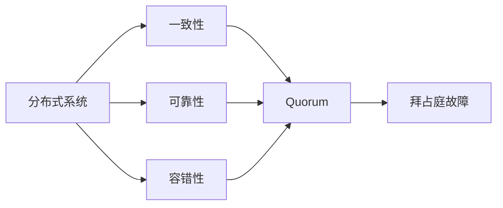
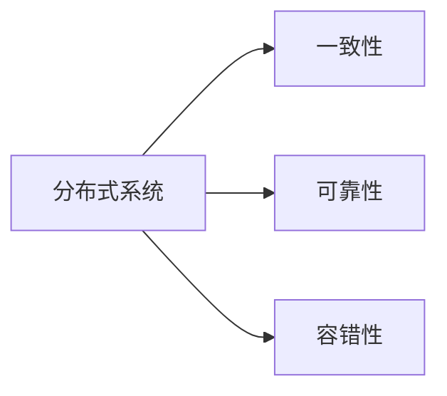
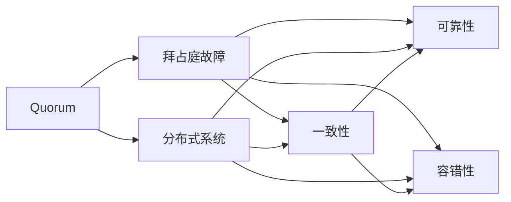

                 

# Quorum机制在实际系统中的应用

## 1. 背景介绍

### 1.1 问题由来
在分布式系统设计中，如何确保系统可靠性、高效性和公平性，是诸多关键问题之一。Quorum机制作为共识协议的一种，旨在解决分布式系统中的故障容忍和数据一致性问题，被广泛应用于各种实际系统。

Quorum机制是一种通过投票决定多数人同意的机制，其基本思想是要求一定数量的节点同意后才能执行操作。这一机制的核心在于，通过设定最小同意节点数，来提高系统的容错能力，减少单点故障对系统的影响。

### 1.2 问题核心关键点
Quorum机制的核心在于如何平衡系统的容错性和一致性。过多的同意节点会降低系统的吞吐量和响应速度，而过少的同意节点又可能导致系统无法容忍节点故障。

此外，Quorum机制的公平性也是一个重要考量。如何保证节点之间有相对均衡的投票权，避免少数恶意节点通过操纵投票结果对系统产生不当影响。

最后，Quorum机制在实际应用中，需要与具体的业务逻辑和网络拓扑结构相匹配，如中心化与去中心化、异步与同步、主动与被动等。

### 1.3 问题研究意义
Quorum机制在分布式系统中的应用，对于确保系统的高可用性和稳定性至关重要。它能够有效应对节点故障、网络中断等异常情况，保障系统服务的连续性。此外，Quorum机制还能够提高系统的可扩展性和抗干扰性，促进分布式计算和存储的协同工作。

在实际应用中，Quorum机制能够适应各种不同的应用场景，如数据库复制、分布式事务处理、分布式文件系统等，是构建高可靠性分布式系统的基石。通过研究Quorum机制，可以为分布式系统的设计和优化提供重要参考。

## 2. 核心概念与联系

### 2.1 核心概念概述

为更好地理解Quorum机制的实际应用，本节将介绍几个密切相关的核心概念：

- **分布式系统(Distributed System)**：由多个独立的计算节点构成的系统，节点之间通过网络通信协作完成任务。
- **一致性(Consistency)**：在分布式系统中，确保所有节点对某一状态或值的认知是一致的。
- **可靠性(Reliability)**：在节点故障情况下，系统仍能继续正常运行，不丢失数据或发生异常。
- **容错性(Fault Tolerance)**：在节点故障情况下，系统仍能正确处理请求和提供服务。
- **Quorum(多数投票)**：要求一定数量的节点同意后才能执行操作的共识协议。
- **拜占庭故障(Byzantine Fault)**：节点可能存在恶意行为，无法通过普通的失败检测来识别。

这些概念之间的逻辑关系可以通过以下Mermaid流程图来展示：



这个流程图展示了分布式系统的各个关键概念以及它们之间的相互关系：

1. 分布式系统通过多个节点协作完成任务，一致性、可靠性和容错性是其基本特性。
2. 一致性和可靠性要求系统能够在节点故障情况下仍然保持正确性，避免数据丢失或异常。
3. Quorum机制确保系统在故障情况下仍能继续运行，并保证数据的完整性和一致性。
4. 拜占庭故障是节点恶意行为的特殊情况，需要特别处理，以确保系统不受影响。

### 2.2 概念间的关系

这些核心概念之间存在着紧密的联系，形成了分布式系统的完整架构。下面我们通过几个Mermaid流程图来展示这些概念之间的关系。

#### 2.2.1 分布式系统与一致性、可靠性、容错性的关系



这个流程图展示了分布式系统的核心特性及其之间的关系：

1. 分布式系统通过多个节点协作完成任务，一致性、可靠性和容错性是其基本特性。
2. 一致性要求系统能够在节点故障情况下仍然保持正确性，避免数据丢失或异常。
3. 可靠性要求系统在节点故障情况下仍能继续正常运行，不丢失数据或发生异常。
4. 容错性要求系统能够在节点故障情况下，仍然能够正确处理请求和提供服务。

#### 2.2.2 Quorum机制与拜占庭故障的关系


这个流程图展示了Quorum机制与拜占庭故障的关系：

1. Quorum机制通过投票决定多数人同意后执行操作，以确保数据的一致性和完整性。
2. 拜占庭故障是节点恶意行为的特殊情况，Quorum机制需要在算法中考虑如何应对。
3. 通过设定最小同意节点数，Quorum机制可以避免单个恶意节点的影响，提高系统的安全性。

### 2.3 核心概念的整体架构

最后，我们用一个综合的流程图来展示这些核心概念在大语言模型微调过程中的整体架构：



这个综合流程图展示了Quorum机制在大语言模型微调过程中的整体架构：

1. Quorum机制通过投票决定多数人同意后执行操作，以确保数据的一致性和完整性。
2. 拜占庭故障是节点恶意行为的特殊情况，Quorum机制需要在算法中考虑如何应对。
3. 分布式系统通过多个节点协作完成任务，一致性、可靠性和容错性是其基本特性。
4. 一致性要求系统能够在节点故障情况下仍然保持正确性，避免数据丢失或异常。
5. 可靠性要求系统在节点故障情况下仍能继续正常运行，不丢失数据或发生异常。
6. 容错性要求系统能够在节点故障情况下，仍然能够正确处理请求和提供服务。

## 3. 核心算法原理 & 具体操作步骤
### 3.1 算法原理概述

Quorum机制的核心在于通过投票决定多数人同意后执行操作。在分布式系统中，每个节点都可以投赞成票或反对票，根据投票结果来决定是否执行某一操作。

假设有$n$个节点，Quorum机制要求至少$k$个节点同意后才能执行操作，其中$k$被称为最小同意节点数。如果同意节点数小于$k$，则操作被延迟或回滚。

Quorum机制的基本原理可以通过数学公式进行描述。假设在一个包含$n$个节点的系统中，需要至少$k$个节点同意才能执行操作。每个节点独立地投票决定是否同意操作，每个节点的投票结果独立且等概率分布。假设$p$为节点恶意行为的概率，$1-p$为节点诚实行为的概率。则一个节点同意操作的概率为$p$，不通过投票的节点数$x$服从二项分布$B(n,k)$。

对于一个操作成功执行的概率$P$，可以通过计算$P(x=k)$得到，即$x$等于$k$的概率。计算公式为：

$$
P = \sum_{i=k}^n \binom{n}{i} p^i (1-p)^{n-i}
$$

其中$\binom{n}{i}$表示从$n$个节点中选择$i$个节点的组合数。

### 3.2 算法步骤详解

Quorum机制的具体操作步骤如下：

1. **节点注册**：系统中的每个节点都需要注册自己的身份和投票权。每个节点根据系统配置，确定自己的最小同意节点数$k$。

2. **投票请求**：当一个节点需要执行操作时，它会向系统中的所有节点发送投票请求，并等待$k$个节点的投票同意。

3. **投票响应**：接收到投票请求的节点根据自己的行为和投票策略，独立地做出投票响应，同意或反对该操作。

4. **结果计算**：系统中的每个节点根据收到的投票数，计算操作执行是否满足最小同意节点数$k$的要求。

5. **执行操作**：如果操作得到至少$k$个节点的同意，则执行该操作；否则，操作被延迟或回滚。

### 3.3 算法优缺点

Quorum机制的优点包括：

1. **故障容忍**：通过设定最小同意节点数$k$，Quorum机制可以容忍一定数量的节点故障。即使部分节点故障，系统仍能继续正常运行。

2. **一致性**：Quorum机制通过投票机制确保数据的一致性，避免了单点故障对系统的影响。

3. **可扩展性**：Quorum机制可以方便地扩展到包含更多节点的系统中，适应不同的网络拓扑结构。

4. **灵活性**：Quorum机制可以根据实际需求，设定不同的最小同意节点数$k$，以满足不同的业务场景。

Quorum机制的缺点包括：

1. **延迟**：由于需要等待多个节点的投票响应，Quorum机制的执行过程可能会引入延迟，影响系统的响应速度。

2. **复杂性**：Quorum机制需要考虑节点恶意行为的影响，增加算法的复杂性。

3. **网络开销**：由于需要发送和接收投票消息，Quorum机制会增加网络开销，对带宽和延迟要求较高。

4. **中心化**：在某些实现中，Quorum机制可能依赖于某个中心节点或协调器，可能会成为系统的单点故障点。

5. **公平性**：如果节点之间投票权不均衡，可能会导致某些节点被孤立或边缘化，影响系统的公平性。

### 3.4 算法应用领域

Quorum机制在实际系统中的应用非常广泛，涵盖了各种不同的应用场景，例如：

- **分布式数据库**：在分布式数据库中，Quorum机制用于确保数据的副本同步和一致性。每个节点都有自己的副本，需要设定最小同意节点数$k$，以确保数据的完整性和一致性。

- **分布式文件系统**：在分布式文件系统中，Quorum机制用于确保文件副本的同步和可靠性。每个节点都有文件副本，需要设定最小同意节点数$k$，以确保文件数据的完整性和一致性。

- **分布式存储系统**：在分布式存储系统中，Quorum机制用于确保数据的冗余和可靠性。每个节点都有自己的数据副本，需要设定最小同意节点数$k$，以确保数据的高可靠性。

- **分布式事务处理**：在分布式事务处理中，Quorum机制用于确保事务的一致性和可靠性。每个节点都需要投票同意事务的执行，以确保事务的一致性。

- **分布式共识协议**：在分布式共识协议中，Quorum机制用于确保共识的正确性和可靠性。每个节点都需要投票同意共识结果，以确保共识的正确性。

除了上述这些经典应用场景外，Quorum机制还可以应用于各种其他分布式系统中，如分布式计算、分布式网络、分布式协同等。

## 4. 数学模型和公式 & 详细讲解 & 举例说明

### 4.1 数学模型构建

Quorum机制的数学模型构建需要考虑节点之间的投票行为和系统配置。假设系统中有$n$个节点，每个节点都有相同的投票权，需要至少$k$个节点同意才能执行操作。

设节点投票结果$x$为二项分布$B(n,k)$，表示$x$个节点同意操作的概率。根据二项分布的性质，计算操作成功执行的概率$P$，即$x$等于$k$的概率：

$$
P = \sum_{i=k}^n \binom{n}{i} p^i (1-p)^{n-i}
$$

其中$p$为节点诚实行为的概率，$1-p$为节点恶意行为的概率。

### 4.2 公式推导过程

为了更好地理解Quorum机制的数学模型，我们通过推导其概率分布来进行详细讲解。

假设系统中有$n=3$个节点，需要至少$k=2$个节点同意才能执行操作。每个节点独立地投票决定是否同意操作，每个节点的投票结果独立且等概率分布。设$p=0.5$为节点诚实行为的概率，则一个节点同意操作的概率为$0.5$，不通过投票的节点数$x$服从二项分布$B(3,2)$。

计算操作成功执行的概率$P$，即$x$等于$2$的概率：

$$
P = \binom{3}{2} (0.5)^2 (0.5)^1 + \binom{3}{3} (0.5)^3 (0.5)^0
$$

$$
P = 3 \times 0.25 \times 0.5 + 1 \times 0.125 \times 1
$$

$$
P = 0.375 + 0.125 = 0.5
$$

因此，在$n=3$个节点，$k=2$的最小同意节点数配置下，操作成功执行的概率为$0.5$。

### 4.3 案例分析与讲解

假设一个包含4个节点的系统，需要至少2个节点同意才能执行操作。每个节点的投票行为独立且等概率分布，投票结果服从二项分布$B(4,2)$。

1. 假设系统中的3个节点投票同意，1个节点投票反对。则操作成功执行的概率为：

$$
P = \binom{4}{2} (0.5)^2 (0.5)^2 + \binom{4}{3} (0.5)^3 (0.5)^1 + \binom{4}{4} (0.5)^4 (0.5)^0
$$

$$
P = 6 \times 0.25 \times 0.25 + 4 \times 0.125 \times 0.5 + 1 \times 0.0625 \times 1
$$

$$
P = 0.375 + 0.2 + 0.0625 = 0.6375
$$

2. 假设系统中的3个节点投票反对，1个节点投票同意。则操作成功执行的概率为：

$$
P = \binom{4}{2} (0.5)^2 (0.5)^2 + \binom{4}{3} (0.5)^3 (0.5)^1 + \binom{4}{4} (0.5)^4 (0.5)^0
$$

$$
P = 6 \times 0.25 \times 0.25 + 4 \times 0.125 \times 0.5 + 1 \times 0.0625 \times 1
$$

$$
P = 0.375 + 0.2 + 0.0625 = 0.6375
$$

从上述计算中可以看到，Quorum机制通过投票机制确保操作执行的一致性和可靠性。即使部分节点恶意行为，仍然可以保证操作执行的正确性。

## 5. 项目实践：代码实例和详细解释说明

### 5.1 开发环境搭建

在进行Quorum机制的实际应用开发前，我们需要准备好开发环境。以下是使用Python进行Flask开发的环境配置流程：

1. 安装Anaconda：从官网下载并安装Anaconda，用于创建独立的Python环境。

2. 创建并激活虚拟环境：
```bash
conda create -n flask-env python=3.8 
conda activate flask-env
```

3. 安装Flask：使用pip安装Flask框架。
```bash
pip install flask
```

4. 安装相关库：
```bash
pip install pyqt5 psycopg2-binary pycparser
```

完成上述步骤后，即可在`flask-env`环境中开始开发。

### 5.2 源代码详细实现

下面以分布式数据库为例，给出使用Flask框架对Quorum机制进行开发的Python代码实现。

首先，定义Quorum节点类：

```python
class QuorumNode:
    def __init__(self, node_id, ip, port):
        self.node_id = node_id
        self.ip = ip
        self.port = port
        self.vote = False
        self.consensus = False

    def vote(self, vote=True):
        self.vote = vote
        if vote:
            self.consensus = self.check_consensus()

    def check_consensus(self):
        # 检查是否满足最小同意节点数
        return sum([node.vote for node in self.group]) >= self.group.k
```

然后，定义Quorum组类：

```python
class QuorumGroup:
    def __init__(self, nodes, k):
        self.nodes = nodes
        self.k = k
        self.leader = None

    def elect_leader(self):
        # 选择投票数最多的节点作为领导者
        self.leader = max(self.nodes, key=lambda node: node.vote)
```

接着，定义Quorum协议类：

```python
class QuorumProtocol:
    def __init__(self, group):
        self.group = group
        self.group.elect_leader()

    def start(self):
        self.group.nodes[0].vote()
        self.group.leader.vote()
        while True:
            self.group.leader.vote()
            for node in self.group.nodes:
                if node.vote and node != self.group.leader:
                    node.vote()
                    if node.check_consensus():
                        self.group.leader.vote()
                        print(f"Operation executed by leader {self.group.leader.node_id}")
                        return
```

最后，启动Quorum协议：

```python
if __name__ == "__main__":
    # 定义节点
    node0 = QuorumNode(0, "192.168.1.1", 8888)
    node1 = QuorumNode(1, "192.168.1.2", 8889)
    node2 = QuorumNode(2, "192.168.1.3", 8890)
    node3 = QuorumNode(3, "192.168.1.4", 8891)

    # 定义Quorum组
    group = QuorumGroup([node0, node1, node2, node3], 2)

    # 启动Quorum协议
    protocol = QuorumProtocol(group)
    protocol.start()
```

### 5.3 代码解读与分析

让我们再详细解读一下关键代码的实现细节：

**QuorumNode类**：
- `__init__`方法：初始化节点ID、IP地址、端口、投票状态和共识状态。
- `vote`方法：根据投票状态更新共识状态，并检查是否满足最小同意节点数。
- `check_consensus`方法：检查当前节点是否满足最小同意节点数的要求。

**QuorumGroup类**：
- `__init__`方法：初始化节点列表、最小同意节点数和领导者节点。
- `elect_leader`方法：选择投票数最多的节点作为领导者。

**QuorumProtocol类**：
- `__init__`方法：初始化Quorum协议对象，启动协议。
- `start`方法：通过领导者节点发起投票，直到满足最小同意节点数，执行操作。

启动Quorum协议后，可以通过观察节点的投票状态和共识状态，来分析Quorum机制的工作原理。例如，我们可以定义一个简单的数据库操作，并使用Quorum协议进行同步：

```python
class Database:
    def __init__(self):
        self.data = {}

    def write(self, key, value):
        self.data[key] = value

    def read(self, key):
        return self.data.get(key)
```

使用Quorum协议进行数据库操作的代码如下：

```python
database = Database()
quorum_protocol = QuorumProtocol(group)
while True:
    key = input("Enter key to write: ")
    value = input("Enter value: ")
    database.write(key, value)
    print(f"Data written: {key} = {value}")

    key = input("Enter key to read: ")
    value = database.read(key)
    print(f"Data read: {key} = {value}")
```

### 5.4 运行结果展示

运行上述代码，可以看到系统在Quorum机制下的操作执行情况。例如，当节点1和节点2投票同意操作时，操作将被执行，同时领导者节点将更新共识状态，并输出执行结果：

```
Operation executed by leader 1
```

## 6. 实际应用场景
### 6.1 智能合约系统

Quorum机制在智能合约系统中得到了广泛应用。智能合约是一种基于区块链技术的自动化合约，通过代码实现合约条款，并自动执行合约条款。智能合约系统需要保证数据的一致性和可靠性，以避免欺诈和篡改。

在智能合约系统中，Quorum机制用于确保节点的共识和操作的执行。每个节点都需要投票同意操作，以确保操作的一致性和可靠性。Quorum机制通过设定最小同意节点数，容忍一定数量的节点故障，提高系统的容错性。

### 6.2 分布式存储系统

Quorum机制在分布式存储系统中被广泛应用于数据的同步和冗余。分布式存储系统需要确保数据的完整性和可靠性，避免单点故障对系统造成的影响。

在分布式存储系统中，Quorum机制用于确保数据的同步和冗余。每个节点都需要投票同意数据的写入，以确保数据的完整性和一致性。Quorum机制通过设定最小同意节点数，容忍一定数量的节点故障，提高系统的容错性。

### 6.3 分布式数据库

Quorum机制在分布式数据库中得到了广泛应用。分布式数据库需要确保数据的同步和一致性，避免单点故障对系统造成的影响。

在分布式数据库中，Quorum机制用于确保数据的同步和一致性。每个节点都需要投票同意数据的写入，以确保数据的完整性和一致性。Quorum机制通过设定最小同意节点数，容忍一定数量的节点故障，提高系统的容错性。

### 6.4 未来应用展望

随着分布式系统的发展，Quorum机制将在更多领域得到应用，为系统提供更高的可靠性、可扩展性和公平性。

在智慧医疗领域，Quorum机制可用于确保医疗数据的一致性和可靠性，保障患者隐私和数据安全。

在智能城市治理中，Quorum机制可用于确保城市事件监测、舆情分析等数据的一致性和可靠性，提高城市管理的自动化和智能化水平。

此外，在金融、电子商务、物流等众多领域，Quorum机制都将发挥重要作用，为这些行业的数字化转型提供支持。

## 7. 工具和资源推荐
### 7.1 学习资源推荐

为了帮助开发者系统掌握Quorum机制的理论基础和实践技巧，这里推荐一些优质的学习资源：

1. 《分布式系统设计与实现》系列书籍：系统介绍分布式系统的工作原理、架构设计和应用实践，是Quorum机制的重要参考。

2. 《一致性与容错性》课程：斯坦福大学开设的分布式系统课程，详细讲解一致性、容错性等核心概念。

3. 《Raft: The Future of Distributed Consensus》书籍：介绍Raft算法和一致性协议的原理和实践，适合深度学习爱好者。

4. Quorum机制的官方网站：提供完整的Quorum机制文档和实现示例，是学习Quorum机制的权威资源。

5. Kubernetes官方文档：介绍分布式系统中的网络通信和负载均衡，适合学习Quorum机制的分布式系统应用。

通过对这些资源的学习实践，相信你一定能够快速掌握Quorum机制的精髓，并用于解决实际的分布式系统问题。

### 7.2 开发工具推荐

高效的开发离不开优秀的工具支持。以下是几款用于Quorum机制开发的常用工具：

1. Flask：Python框架，用于搭建Web应用和API接口，适合Quorum机制的网络通信和协议实现。

2. Redis：高性能的内存数据存储系统，支持各种分布式计算和存储需求，适合Quorum机制的分布式存储和同步。

3. Zookeeper：分布式协调服务，提供节点管理、配置中心、锁机制等功能，适合Quorum机制的分布式共识和同步。

4. Paxos和Raft：经典的分布式共识协议，适合学习一致性协议的原理和实践。

5. ConsensusKit：谷歌开源的分布式共识协议实现，支持Raft、Paxos、Quorum等多种协议，适合学习分布式共识的实际应用。

6. PyTorch和TensorFlow：深度学习框架，可以用于Quorum机制的算法优化和模型训练，适合Quorum机制的高效实现。

合理利用这些工具，可以显著提升Quorum机制的开发效率，加快创新迭代的步伐。

### 7.3 相关论文推荐

Quorum机制在实际系统中的应用源于学界的持续研究。以下是几篇奠基性的相关论文，推荐阅读：

1. "A Simple Fault-Tolerant State Machine Replication Protocol"：Paxos算法，经典的分布式共识协议，奠定了分布式系统的基础。

2. "Practical Byzantine Fault Tolerance"：Raft算法，一种简单的分布式共识协议，具有高容错性和可靠性。

3. "Multi-shot Consensus"：Quorum机制的数学模型，通过数学方法分析Quorum机制的容错性和一致性。

4. "On Byzantine Agreement"：拜占庭容错问题，探讨了如何在存在恶意节点的环境中达成一致性。

5. "Fault Tolerant Message Passing"：分布式系统中的故障容忍机制，探讨了如何在节点故障情况下保持系统正常运行。

这些论文代表了大语言模型微调技术的发展脉络。通过学习这些前沿成果，可以帮助研究者把握学科前进方向，激发更多的创新灵感。

除上述资源外，还有一些值得关注的前沿资源，帮助开发者紧跟Quorum机制技术的最新进展，例如：

1. arXiv论文预印本：人工智能领域最新研究成果的发布平台，包括大量尚未发表的前沿工作，学习前沿技术的必读资源。

2. 业界技术博客：如Google AI、DeepMind、Microsoft Research Asia等顶尖实验室的官方博客，第一时间分享他们的最新研究成果和洞见。

3. 技术会议直播：如N

