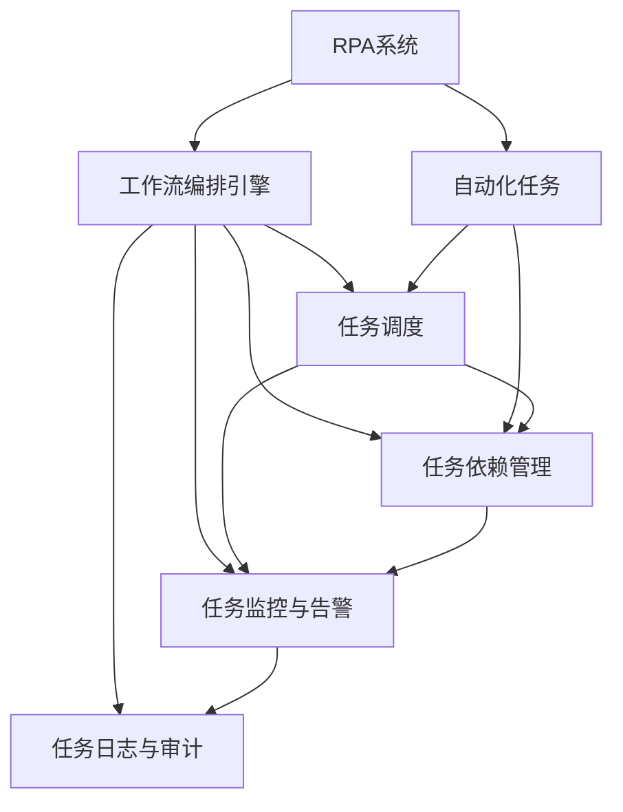

                 

## 1. 背景介绍

### 1.1 问题由来

随着自动化技术的不断进步，机器人流程自动化（Robotic Process Automation, RPA）成为企业和组织提高效率、降低成本、优化运营的重要手段。RPA的核心理念是模拟人类在计算机上的操作，通过自动化软件执行重复性、结构化任务，实现自动化和智能化管理。在实践中，RPA被广泛应用于数据处理、文档管理、客户服务等多个领域，为业务流程的智能化、数字化转型提供了强大助力。

### 1.2 问题核心关键点

RPA工作流编排是RPA系统实现自动化流程自动化、智能化的关键技术之一。它通过将多个自动化任务编排成有组织的流程，实现自动化任务的有序执行，提高RPA系统的灵活性和可扩展性。具体而言，RPA工作流编排涉及以下几个核心问题：

- **任务调度**：如何在不同的任务之间进行高效调度，以最小化等待时间和系统开销。
- **任务依赖关系**：如何定义和处理任务之间的依赖关系，确保任务的执行顺序和前置条件。
- **任务监控与告警**：如何实时监控任务执行状态，及时发现异常并采取措施。
- **任务日志与审计**：如何记录任务执行细节，提供操作审计和系统维护的依据。

### 1.3 问题研究意义

RPA工作流编排技术的发展，对于提升RPA系统的性能、灵活性和可扩展性，具有重要意义：

1. **提高效率**：通过优化任务调度，减少任务等待时间，大幅提高自动化流程的执行效率。
2. **增强灵活性**：定义和处理任务依赖关系，使得RPA系统能够灵活应对不同业务场景和需求变化。
3. **简化开发**：将复杂的自动化任务编排成流程，减少开发和维护的复杂度，降低成本。
4. **提升稳定性**：通过任务监控与告警机制，及时发现和处理异常，提高系统的稳定性和可靠性。
5. **加强审计**：详细记录任务执行日志，为系统维护和操作审计提供依据。

## 2. 核心概念与联系

### 2.1 核心概念概述

为了更好地理解RPA工作流编排的核心概念和逻辑，本节将介绍几个密切相关的核心概念：

- **RPA系统**：一种自动化技术，通过软件机器人模拟人类操作，实现自动化任务执行。RPA系统通常由自动化任务、工作流编排引擎、监控与告警系统等模块组成。

- **任务**：RPA系统中最基本的自动化单元，通常是一个脚本或函数，用于执行特定的业务操作。任务通常具有输入输出接口，定义了任务的执行逻辑和参数。

- **工作流编排引擎**：RPA系统的核心模块，负责定义、调度和执行自动化任务，实现任务之间的协调和执行。

- **依赖关系**：任务之间可能存在前置依赖关系，即一个任务的执行依赖于另一个任务的结果。这种依赖关系需要通过编排引擎进行管理和处理。

- **监控与告警系统**：用于实时监控任务执行状态，及时发现异常并生成告警信息，保障系统的稳定性和可靠性。

- **任务日志与审计**：记录任务的执行细节，包括输入输出、执行时间、异常信息等，为系统维护和操作审计提供依据。

这些核心概念之间的逻辑关系可以通过以下Mermaid流程图来展示：



这个流程图展示了RPA系统中各模块的协同工作过程：

1. **RPA系统**通过**工作流编排引擎**对**自动化任务**进行调度和管理。
2. **任务调度**和**任务依赖管理**负责处理任务的执行顺序和依赖关系。
3. **任务监控与告警系统**实时监控任务执行状态，及时发现和处理异常。
4. **任务日志与审计**记录任务执行细节，提供系统维护和操作审计的依据。

### 2.2 概念间的关系

这些核心概念之间存在着紧密的联系，形成了RPA工作流编排的完整生态系统。下面我通过几个Mermaid流程图来展示这些概念之间的关系。

#### 2.2.1 RPA系统的工作流程

```mermaid
graph LR
    A[触发器] --> B[任务1]
    B --> C[任务2]
    C --> D[任务3]
    D --> E[任务4]
    E --> F[任务5]
    F --> G[任务6]
    G --> H[任务7]
    H --> I[任务8]
    I --> J[任务9]
    J --> K[任务10]
    K --> L[任务11]
    L --> M[任务12]
    M --> N[任务13]
    N --> O[任务14]
    O --> P[任务15]
    P --> Q[任务16]
    Q --> R[任务17]
    R --> S[任务18]
    S --> T[任务19]
    T --> U[任务20]
    U --> V[任务21]
    V --> W[任务22]
    W --> X[任务23]
    X --> Y[任务24]
    Y --> Z[任务25]
    Z --> AA[任务26]
    AA --> AB[任务27]
    AB --> AC[任务28]
    AC --> AD[任务29]
    AD --> AE[任务30]
    AE --> AF[任务31]
    AF --> AG[任务32]
    AG --> AH[任务33]
    AH --> AI[任务34]
    AI --> AJ[任务35]
    AJ --> AK[任务36]
    AK --> AL[任务37]
    AL --> AM[任务38]
    AM --> AN[任务39]
    AN --> AO[任务40]
    AO --> AP[任务41]
    AP --> AQ[任务42]
    AQ --> AR[任务43]
    AR --> AS[任务44]
    AS --> AT[任务45]
    AT --> AU[任务46]
    AU --> AV[任务47]
    AV --> AW[任务48]
    AW --> AX[任务49]
    AX --> AY[任务50]
    AY --> AZ[任务51]
    AZ --> BA[任务52]
    BA --> BB[任务53]
    BB --> BC[任务54]
    BC --> BD[任务55]
    BD --> BE[任务56]
    BE --> BF[任务57]
    BF --> BG[任务58]
    BG --> BH[任务59]
    BH --> BI[任务60]
    BI --> BJ[任务61]
    BJ --> BK[任务62]
    BK --> BL[任务63]
    BL --> BM[任务64]
    BM --> BN[任务65]
    BN --> BO[任务66]
    BO --> BP[任务67]
    BP --> BQ[任务68]
    BQ --> BR[任务69]
    BR --> BS[任务70]
    BS --> BT[任务71]
    BT --> BU[任务72]
    BU --> BV[任务73]
    BV --> BW[任务74]
    BW --> BX[任务75]
    BX --> BY[任务76]
    BY --> BZ[任务77]
    BZ --> CA[任务78]
    CA --> CB[任务79]
    CB --> CC[任务80]
    CC --> CD[任务81]
    CD --> CE[任务82]
    CE --> CF[任务83]
    CF --> CG[任务84]
    CG --> CH[任务85]
    CH --> CI[任务86]
    CI --> CJ[任务87]
    CJ --> CK[任务88]
    CK --> CL[任务89]
    CL --> CM[任务90]
    CM --> CN[任务91]
    CN --> CO[任务92]
    CO --> CP[任务93]
    CP --> CQ[任务94]
    CQ --> CR[任务95]
    CR --> CS[任务96]
    CS --> CT[任务97]
    CT --> CU[任务98]
    CU --> CV[任务99]
    CV --> CW[任务100]
    CW --> CX[任务101]
    CX --> CY[任务102]
    CY --> CZ[任务103]
    CZ --> DA[任务104]
    DA --> DB[任务105]
    DB --> DC[任务106]
    DC --> DD[任务107]
    DD --> DE[任务108]
    DE --> DF[任务109]
    DF --> DG[任务110]
    DG --> DH[任务111]
    DH --> DI[任务112]
    DI --> DJ[任务113]
    DJ --> DK[任务114]
    DK --> DL[任务115]
    DL --> DM[任务116]
    DM --> DN[任务117]
    DN --> DO[任务118]
    DO --> DP[任务119]
    DP --> DQ[任务120]
    DQ --> DR[任务121]
    DR --> DS[任务122]
    DS --> DT[任务123]
    DT --> DU[任务124]
    DU --> DV[任务125]
    DV --> DW[任务126]
    DW --> DX[任务127]
    DX --> DY[任务128]
    DY --> DZ[任务129]
    DZ --> EA[任务130]
    EA --> EB[任务131]
    EB --> EC[任务132]
    EC --> ED[任务133]
    ED --> EE[任务134]
    EE --> EF[任务135]
    EF --> EG[任务136]
    EG --> EH[任务137]
    EH --> EI[任务138]
    EI --> EJ[任务139]
    EJ --> EK[任务140]
    EK --> EL[任务141]
    EL --> EM[任务142]
    EM --> EN[任务143]
    EN -->EO[任务144]
    EO --> EP[任务145]
    EP --> EQ[任务146]
    EQ --> ER[任务147]
    ER --> ES[任务148]
    ES --> ET[任务149]
    ET --> EU[任务150]
    EU --> EV[任务151]
    EV --> EW[任务152]
    EW --> EX[任务153]
    EX --> EY[任务154]
    EY --> EZ[任务155]
    EZ --> FA[任务156]
    FA --> FB[任务157]
    FB --> FC[任务158]
    FC --> FD[任务159]
    FD --> FE[任务160]
    FE --> FF[任务161]
    FF --> FG[任务162]
    FG --> FH[任务163]
    FH --> FI[任务164]
    FI --> FJ[任务165]
    FJ --> FK[任务166]
    FK --> FL[任务167]
    FL --> FM[任务168]
    FM --> FN[任务169]
    FN --> FO[任务170]
    FO --> FP[任务171]
    FP --> FQ[任务172]
    FQ --> FR[任务173]
    FR --> FS[任务174]
    FS --> FT[任务175]
    FT --> FU[任务176]
    FU --> FV[任务177]
    FV --> FW[任务178]
    FW --> FX[任务179]
    FX --> FY[任务180]
    FY --> FZ[任务181]
    FZ --> GA[任务182]
    GA --> GB[任务183]
    GB --> GC[任务184]
    GC --> GD[任务185]
    GD --> GE[任务186]
    GE --> GF[任务187]
    GF --> GG[任务188]
    GG --> GH[任务189]
    GH --> GI[任务190]
    GI --> GJ[任务191]
    GJ --> GK[任务192]
    GK --> GL[任务193]
    GL --> GM[任务194]
    GM --> GN[任务195]
    GN --> GO[任务196]
    GO --> GP[任务197]
    GP --> GQ[任务198]
    GQ --> GR[任务199]
    GR --> GS[任务200]
    GS --> GT[任务201]
    GT --> GU[任务202]
    GU -->GV[任务203]
    GV --> GW[任务204]
    GW --> GX[任务205]
    GX --> GY[任务206]
    GY --> GZ[任务207]
    GZ --> HA[任务208]
    HA --> HB[任务209]
    HB --> HC[任务210]
    HC --> HD[任务211]
    HD --> HE[任务212]
    HE --> HF[任务213]
    HF --> HG[任务214]
    HG --> HH[任务215]
    HH --> HI[任务216]
    HI --> HJ[任务217]
    HJ --> HK[任务218]
    HK --> HL[任务219]
    HL --> HM[任务220]
    HM --> HN[任务221]
    HN --> HO[任务222]
    HO --> HP[任务223]
    HP --> HQ[任务224]
    HQ --> HR[任务225]
    HR --> HS[任务226]
    HS --> HT[任务227]
    HT --> HU[任务228]
    HU --> HV[任务229]
    HV --> HW[任务230]
    HW --> HX[任务231]
    HX --> HY[任务232]
    HY --> HZ[任务233]
    HZ --> IA[任务234]
    IA --> IB[任务235]
    IB --> IC[任务236]
    IC --> ID[任务237]
    ID --> IE[任务238]
    IE --> IF[任务239]
    IF --> IG[任务240]
    IG --> IH[任务241]
    IH --> II[任务242]
    II --> IJ[任务243]
    IJ --> IK[任务244]
    IK --> IL[任务245]
    IL --> IM[任务246]
    IM --> IN[任务247]
    IN --> IO[任务248]
    IO --> IP[任务249]
    IP --> IQ[任务250]
    IQ --> IR[任务251]
    IR --> IS[任务252]
    IS --> IT[任务253]
    IT --> IU[任务254]
    IU --> IV[任务255]
    IV --> IW[任务256]
    IW --> IX[任务257]
    IX --> IY[任务258]
    IY --> IZ[任务259]
    IZ -->JA[任务260]
    JA --> JB[任务261]
    JB --> JC[任务262]
    JC --> JD[任务263]
    JD -->JE[任务264]
    JE --> JF[任务265]
    JF --> JG[任务266]
    JG --> JH[任务267]
    JH -->JI[任务268]
    JI --> JJ[任务269]
    JJ --> JK[任务270]
    JK --> JL[任务271]
    JL --> JM[任务272]
    JM --> JN[任务273]
    JN --> JO[任务274]
    JO --> JP[任务275]
    JP --> JQ[任务276]
    JQ --> JR[任务277]
    JR --> JS[任务278]
    JS --> JT[任务279]
    JT --> JU[任务280]
    JU --> JV[任务281]
    JV --> JW[任务282]
    JW --> JX[任务283]
    JX --> JY[任务284]
    JY --> JZ[任务285]
    JZ --> KA[任务286]
    KA --> KB[任务287]
    KB --> KC[任务288]
    LC --> KD[任务289]
    KD --> KE[任务290]
    KE --> KF[任务291]
    KF --> KG[任务292]
    KG --> KH[任务293]
    KH --> KI[任务294]
    KI --> KJ[任务295]
    KJ --> KK[任务296]
    KK --> KL[任务297]
    KL --> KM[任务298]
    KM --> KN[任务299]
    KN --> KO[任务300]
    KO --> KP[任务301]
    KP --> KQ[任务302]
    KQ --> KR[任务303]
    KR --> KS[任务304]
    KS --> KT[任务305]
    KT --> KU[任务306]
    KU --> KV[任务307]
    KV --> KW[任务308]
    KW --> KX[任务309]
    KX --> KY[任务310]
    KY --> KZ[任务311]
    KZ --> LA[任务312]
    LA --> LB[任务313]
    LB --> LC[任务314]
    LC --> LD[任务315]
    LD --> LE[任务316]
    LE --> LF[任务317]
    LF --> LG[任务318]
    LG --> LH[任务319]
    LH --> LI[任务320]
    LI --> LJ[任务321]
    LJ --> LK[任务322]
    LK --> LL[任务323]
    LL --> LM[任务324]
    LM --> LN[任务325]
    LN --> LO[任务326]
    LO --> LP[任务327]
    LP --> LQ[任务328]
    LQ --> LR[任务329]
    LR --> LS[任务330]
    LS --> LT[任务331]
    LT --> LU[任务332]
    LU --> LV[任务333]
    LV --> LW[任务334]
    LW --> LX[任务335]
    LX --> LY[任务336]
    LY --> LZ[任务337]
    LZ --> MA[任务338]
    MA --> MB[任务339]
    MB --> MC[任务340]
    MC --> MD[任务341]
    MD --> ME[任务342]
    ME --> MF[任务343]
    MF --> MG[任务344]
    MG --> MH[任务345]
    MH --> MI[任务346]
    MI --> MJ[任务347]
    MJ --> MK[任务348]
    MK --> ML[任务349]
    ML --> MM[任务350]
    MM --> MN[任务351]
    MN --> MO[任务352]
    MO --> MP[任务353]
    MP --> MQ[任务354]
    MQ --> MR[任务355]
    MR --> MS[任务356]
    MS --> MT[任务357]
    MT --> MU[任务358]
    MU --> MV[任务359]
    MV --> MW[任务360]
    MW --> MX[任务361]
    MX --> MY[任务362]
    MY --> MZ[任务363]
    MZ --> NA[任务364]
    NA --> NB[任务365]
    NB --> NC[任务366]
    NC --> ND[任务367]
    ND --> NE[任务368]
    NE --> NF[任务369]
    NF --> NG[任务370]
    NG --> NH[任务371]
    NH --> NI[任务372]
    NI --> NJ[任务373]
    NJ --> NK[任务374]
    NK --> NL[任务375]
    NL --> NM[任务376]
    NM --> NN[任务377]
    NN --> NO[任务378]
    NO --> NP[任务379]
    NP --> NQ[任务380]
    NQ --> NR[任务381]
    NR --> NS[任务382]
    NS --> NT[任务383]
    NT --> NU[任务384]
    NU --> NV[任务385]
    NV --> NW[任务386]
    NW --> NX[任务387]
    NX --> NY[任务388]
    NY --> NZ[任务389]
    NZ --> OA[任务390]
    OA --> OB[任务391]
    OB --> OC[任务392]
    OC --> OD[任务393]
    OD --> OE[任务394]
    OE --> OF[任务395]
    OF --> OG[任务396]
    OG --> OH[任务397]
    OH --> OI[任务398]
    OI --> OJ[任务399]
    OJ --> OK[任务400]
    OK --> OL[任务401]
    OL --> OM[任务402]
    OM --> ON[任务403]
    ON --> OO[任务404]
    OO --> OP[任务405]
    OP --> OQ[任务406]
    OQ --> OR[任务407]
    OR --> OS[任务408]
    OS --> OT[任务409]
    OT -->OU[任务410]
    OU -->OV[任务411]
    OV -->OW[任务412]
    OW -->OX[任务413]
    OX -->OY[任务414]
    OY -->OZ[任务415]
    OZ --> PA[任务416]
    PA --> PB[任务417]
    PB --> PC[任务418]
    PC --> PD[任务419]
    PD --> PE[任务420]
    PE --> PF[任务421]
    PF --> PG[任务422]
    PG --> PH[任务423]
    PH --> PI[任务424]
    PI --> PJ[任务425]
    PJ --> PK[任务426]
    PK --> PL[任务427]
    PL --> PM[任务428]
    PM --> PN[任务429]
    PN --> PO[任务430]
    PO --> PP[任务431]
    PP --> PQ[任务432]
    PQ --> PR[任务433]
    PR --> PS[任务434]
    PS --> PT[任务435]
    PT -->PU[任务436]
    PU --> PV[任务437]
    PV --> PW[任务438]
    PW --> PX[任务439]
    PX --> PY[任务440]
    PY --> PZ[任务441]
    PZ --> QA[任务442]
    QA --> QB[任务443]
    QB --> QC[任务444]
    QC --> QD[任务445]
    QD --> QE[任务446]
    QE --> QF[任务447]
    QF --> QG[任务448]
    QG --> QH[任务449]
    QH --> QI[任务450]
    QI --> QJ[任务451]
    QJ --> QK[任务452]
    QK --> QL[任务453]
    QL --> QM[任务454]
    QM --> QN[任务455]
    QN --> QO[任务456]
    QO --> QP[任务457]
    QP --> QQ[任务458]
    QQ --> QR[任务459]
    QR --> QS[任务460]
    QS --> QT[任务461]
    QT --> QU[任务462]
    QU --> QV[任务463]
    QV --> QW[任务464]
    QW --> QX[任务465]
    QX --> QY[任务466]
    QY --> QZ[任务467]
    QZ --> RA[任务468]
    RA --> RB[任务469]
    RB --> RC[任务470]
    RC --> RD[任务471]
    RD --> RE[任务472]
    RE --> RF[任务473]
    RF --> RG[任务474]
    RG --> RH[任务475]
    RH --> RI[任务476]
    RI --> RJ[任务477]
    RJ --> RK[任务478]
    RK --> RL[任务479]
    RL --> RM[任务480]
    RM --> RN[任务481]
    RN --> RO[任务482]
    RO --> RP[任务483]
    RP --> RQ[任务484]
    RQ --> RR[任务485]
    RR --> RS[任务486]
    RS --> RT[任务487]
    RT --> RU[任务488]
    RU --> RV[任务489]
    RV --> RW[任务490]
    RW --> RX[任务491]
    RX --> RY[任务492]
    RY --> RZ[任务493]
    RZ --> SA[任务494]
    SA --> SB[任务495]
    SB --> SC[任务496]
    SC --> SD[任务497]
    SD --> SE[任务498]
    SE --> SF[任务499]
    SF --> SG[任务500]
    SG --> SH[任务501]
    SH --> SI[任务502]
    SI --> SJ[任务503]
    SJ --> SK[任务504]
    SK --> SL[任务505]
    SL --> SM[任务506]
    SM --> SN[任务507]
    SN --> SO[任务508]
    SO --> SP[任务509]
    SP --> SQ[任务510]
    SQ --> SR[任务511]
    SR --> SS[任务512]
    SS --> ST[任务513]
    ST --> SU[任务514]
    SU --> SV[任务515]
    SV --> SW[任务516]
    SW --> SX[任务517]
    SX --> SY[任务518]
    SY --> SZ[任务519]
    SZ --> TA[任务520]
    TA --> TB[任务521]
    TB --> TC[任务522]
    TC --> TD[任务523]
    TD --> TE[任务524]
    TE --> TF[任务525]
    TF --> TG[任务526]
    TG --> TH[任务527]
    TH --> TI[任务528]
    TI --> TJ[任务529]
    TJ --> TK[任务530]
    TK --> TL[任务531]
    TL --> TM[任务532]
    TM --> TN[任务533]
    TN --> TO[任务534]
    TO --> TP[任务535]
    TP --> TQ[任务536]
    TQ --> TR[任务537]
    TR --> TS[任务538]
    TS --> TT[任务539]
    TT --> TU[任务540]
    TU --> TV[任务541]
    TV --> TW[任务542]
    TW --> TX[任务543]
    TX --> TY[任务544]
    TY --> TZ[任务545]
    TZ --> UA[任务546]
    UA --> UB[任务547]
    UB --> UC[任务548]
    UC --> UD[任务549]
    UD --> UE[任务550]
    UE --> UF[任务551]
    UF --> UG[任务552]
    UG --> UH[任务553]
    UH --> UI[任务554]
    UI --> UJ[任务555]
    UJ --> UK[任务556]
    UK --> UL[任务557]
    UL --> UM[任务558]
    UM --> UN[任务559]
    UN --> UO[任务560]
    UO --> UP[任务561]
    UP --> UQ[任务562]
    UQ --> UR[任务563]
    UR --> US[任务564]
    US --> UT[任务565]
    UT --> UU[任务566]
    UU --> UV[任务567]
    UV --> UW[任务568]
    UW --> UX[任务569]
    UX --> UY[任务570]
    UY --> UZ[任务571]
    UZ --> VA

