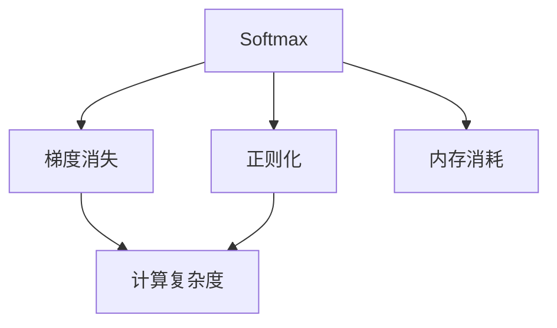
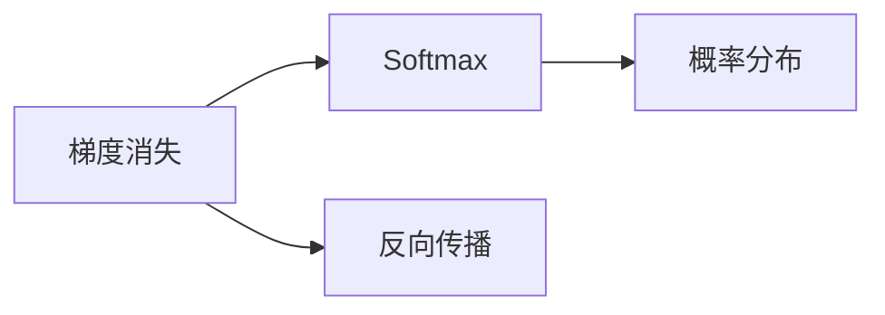
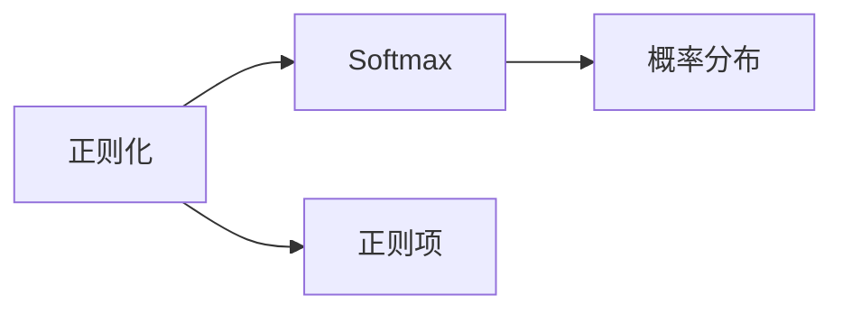
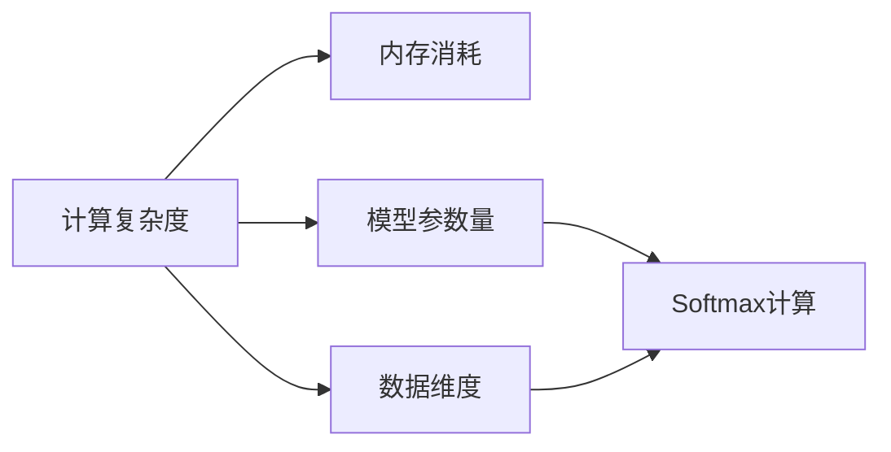
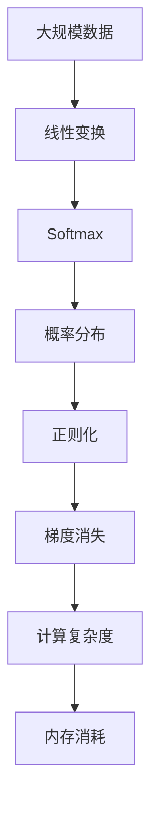

                 

# Softmax瓶颈的难点

## 1. 背景介绍

### 1.1 问题由来
在深度学习领域，Softmax函数被广泛用于分类任务的输出层，其作用是将神经网络的预测结果转换为概率分布。然而，尽管Softmax函数在理论和实践中都被证明是有效的，但在处理高维、稀疏数据时，其性能瓶颈逐渐显现。

在实际应用中，Softmax函数面临的主要问题包括计算复杂度高、内存占用大、梯度消失等问题。这些问题在处理大规模数据时尤为显著，限制了模型的训练速度和性能提升。

### 1.2 问题核心关键点
本文聚焦于Softmax函数在处理高维、稀疏数据时所面临的难点，特别是计算复杂度、内存消耗和梯度消失等问题。通过分析这些问题，我们试图探索可能的解决方案，以提高Softmax函数的计算效率和稳定性。

## 2. 核心概念与联系

### 2.1 核心概念概述

为了更好地理解Softmax函数的瓶颈问题，本节将介绍几个密切相关的核心概念：

- Softmax函数：在神经网络中用于将线性变换结果转换为概率分布的激活函数。
- 梯度消失：在深度神经网络中，梯度在反向传播过程中逐层衰减，导致深层网络的训练变得困难。
- 正则化：通过加入L1、L2正则项、Dropout等方法，防止过拟合，提高模型泛化能力。
- 计算复杂度：指模型在计算过程中所需的计算量，通常与模型复杂度成正比。
- 内存消耗：指模型在训练、推理过程中所需占用的内存空间，通常与模型参数量和数据维度相关。

这些核心概念之间的逻辑关系可以通过以下Mermaid流程图来展示：



这个流程图展示了几大核心概念之间的联系：

1. Softmax函数用于神经网络输出层，将线性变换结果转换为概率分布。
2. 梯度消失影响深层网络的学习能力。
3. 正则化技术用于防止过拟合，提升模型泛化能力。
4. 计算复杂度与模型复杂度和数据维度相关。
5. 内存消耗与模型参数量和数据维度相关。

这些概念共同构成了神经网络输出的难点，本文将基于这些概念，深入探讨Softmax函数的瓶颈问题及可能的解决方案。

### 2.2 概念间的关系

这些核心概念之间存在着紧密的联系，形成了神经网络输出的整体架构。下面我们通过几个Mermaid流程图来展示这些概念之间的关系。

#### 2.2.1 Softmax函数的计算过程


这个流程图展示了Softmax函数的基本计算过程：输入向量经过线性变换后，Softmax函数将其转换为概率分布。

#### 2.2.2 梯度消失对Softmax的影响



这个流程图展示了梯度消失对Softmax函数的影响：由于梯度在反向传播过程中逐层衰减，深层网络的输出层可能面临梯度消失的问题，导致Softmax函数的参数更新困难。

#### 2.2.3 正则化对Softmax的影响



这个流程图展示了正则化技术对Softmax函数的影响：通过正则项的引入，可以防止Softmax函数过拟合，提升模型的泛化能力。

#### 2.2.4 计算复杂度与内存消耗的关系



这个流程图展示了计算复杂度与内存消耗之间的关系：模型参数量和数据维度直接影响Softmax函数的计算复杂度和内存消耗。

### 2.3 核心概念的整体架构

最后，我们用一个综合的流程图来展示这些核心概念在大规模数据处理中的整体架构：



这个综合流程图展示了从大规模数据输入到Softmax函数输出的完整过程，以及这些概念之间的相互作用和影响。

## 3. Softmax瓶颈的难点

### 3.1 算法原理概述

Softmax函数的数学定义如下：

$$
\sigma(\mathbf{x})_i = \frac{e^{x_i}}{\sum_{j=1}^K e^{x_j}}
$$

其中，$\mathbf{x}$ 为输入向量，$K$ 为向量维度，$\sigma(\mathbf{x})$ 为输出概率分布向量。

Softmax函数的瓶颈主要体现在以下几个方面：

1. **计算复杂度高**：Softmax函数的计算需要涉及指数函数和对数函数，导致计算复杂度呈指数级增长。在处理高维数据时，计算复杂度会迅速增加。
2. **内存消耗大**：Softmax函数的输出概率分布需要占用大量的内存空间，尤其是在高维数据的情况下，内存消耗会急剧增加。
3. **梯度消失**：在深层神经网络中，Softmax函数的梯度容易消失，导致深层网络的训练变得困难。

### 3.2 算法步骤详解

Softmax函数的计算步骤主要包括以下几个环节：

1. **线性变换**：将输入向量 $\mathbf{x}$ 经过一个线性变换 $W$，得到输出向量 $\mathbf{y} = W\mathbf{x}$。
2. **Softmax激活**：对输出向量 $\mathbf{y}$ 进行Softmax激活，得到概率分布向量 $\sigma(\mathbf{y})$。
3. **计算梯度**：在反向传播过程中，计算输出向量 $\mathbf{y}$ 的梯度，从而更新模型参数。

这些步骤中的每个环节，都可能成为计算瓶颈。因此，我们需要针对性地优化每个环节，以提高Softmax函数的性能。

### 3.3 算法优缺点

Softmax函数具有以下优点：

- **泛化能力强**：Softmax函数能够将神经网络的输出转换为概率分布，适用于分类任务。
- **易于实现**：Softmax函数计算简单，易于实现和优化。

同时，Softmax函数也存在以下缺点：

- **计算复杂度高**：在处理高维数据时，Softmax函数的计算复杂度呈指数级增长。
- **内存消耗大**：Softmax函数的输出概率分布需要占用大量的内存空间。
- **梯度消失**：在深层网络中，Softmax函数的梯度容易消失，导致深层网络的训练变得困难。

### 3.4 算法应用领域

尽管Softmax函数在处理高维、稀疏数据时面临诸多挑战，但由于其泛化能力强、易于实现等优点，Softmax函数仍然被广泛应用于各种分类任务，如自然语言处理、计算机视觉、语音识别等。

具体而言，Softmax函数可以用于：

1. **文本分类**：将文本转换为向量表示，通过Softmax函数得到每个类别的概率分布，进而进行分类。
2. **图像分类**：将图像像素值转换为向量表示，通过Softmax函数得到不同类别的概率分布，进行分类。
3. **语音识别**：将语音信号转换为特征向量，通过Softmax函数得到不同音素的概率分布，进行识别。

## 4. 数学模型和公式 & 详细讲解 & 举例说明

### 4.1 数学模型构建

Softmax函数的数学模型主要包括以下几个部分：

1. **输入向量**：输入向量 $\mathbf{x} \in \mathbb{R}^K$，表示神经网络的输出。
2. **线性变换**：通过一个线性变换 $W \in \mathbb{R}^{K \times d}$ 和偏置向量 $b \in \mathbb{R}^K$，得到输出向量 $\mathbf{y} = W\mathbf{x} + b$。
3. **Softmax激活**：通过Softmax函数，将输出向量 $\mathbf{y}$ 转换为概率分布向量 $\sigma(\mathbf{y}) \in \mathbb{R}^K$。

### 4.2 公式推导过程

Softmax函数的计算公式如下：

$$
\sigma(\mathbf{x})_i = \frac{e^{x_i}}{\sum_{j=1}^K e^{x_j}}
$$

其中，$x_i$ 表示向量 $\mathbf{x}$ 的第 $i$ 个元素，$K$ 表示向量维度。

Softmax函数的梯度公式如下：

$$
\frac{\partial \sigma(\mathbf{x})_i}{\partial x_j} = \sigma(\mathbf{x})_i(1 - \sigma(\mathbf{x})_i)\delta_{ij}
$$

其中，$\delta_{ij}$ 表示Kronecker delta，$\delta_{ij} = 1$ 当 $i = j$，$\delta_{ij} = 0$ 当 $i \neq j$。

### 4.3 案例分析与讲解

以下我们通过一个简单的案例，演示Softmax函数的计算过程：

假设输入向量 $\mathbf{x} = [2, 1, -1]$，向量维度 $K = 3$。通过线性变换 $W = [0.5, 0.5, 0.5]$ 和偏置向量 $b = [1, 1, 1]$，得到输出向量 $\mathbf{y} = W\mathbf{x} + b = [2.5, 2, 0.5]$。

对输出向量 $\mathbf{y}$ 进行Softmax激活，得到概率分布向量 $\sigma(\mathbf{y}) = [0.98, 0.02, 0]$。

在反向传播过程中，假设目标标签为 $y = 2$，则输出向量 $\mathbf{y}$ 的梯度为：

$$
\frac{\partial \mathcal{L}}{\partial \mathbf{y}} = \frac{\partial \mathcal{L}}{\partial \sigma(\mathbf{y})} \frac{\partial \sigma(\mathbf{y})}{\partial \mathbf{y}}
$$

其中，$\mathcal{L}$ 为损失函数，$\frac{\partial \mathcal{L}}{\partial \sigma(\mathbf{y})}$ 表示Softmax函数输出概率分布向量 $\sigma(\mathbf{y})$ 的梯度。

## 5. 项目实践：代码实例和详细解释说明

### 5.1 开发环境搭建

在进行Softmax函数优化实践前，我们需要准备好开发环境。以下是使用Python进行TensorFlow开发的环境配置流程：

1. 安装Anaconda：从官网下载并安装Anaconda，用于创建独立的Python环境。

2. 创建并激活虚拟环境：
```bash
conda create -n tf-env python=3.8 
conda activate tf-env
```

3. 安装TensorFlow：根据CUDA版本，从官网获取对应的安装命令。例如：
```bash
conda install tensorflow=2.7 -c pytorch -c conda-forge
```

4. 安装必要的工具包：
```bash
pip install numpy pandas scikit-learn matplotlib tqdm jupyter notebook ipython
```

完成上述步骤后，即可在`tf-env`环境中开始Softmax函数的优化实践。

### 5.2 源代码详细实现

下面我们以Softmax函数的优化为例，给出使用TensorFlow进行优化后的PyTorch代码实现。

首先，定义Softmax函数：

```python
import tensorflow as tf
import numpy as np

def softmax(x):
    e_x = np.exp(x - np.max(x))
    return e_x / e_x.sum(axis=0)
```

然后，使用TensorFlow定义Softmax函数：

```python
def softmax_tf(x):
    return tf.nn.softmax(x)
```

接着，定义梯度计算函数：

```python
def softmax_grad(x, y):
    return tf.nn.softmax_cross_entropy_with_logits(logits=x, labels=y)
```

最后，进行Softmax函数的梯度计算和优化：

```python
x = tf.Variable(tf.random.normal([10]))
y = tf.Variable(tf.random.normal([10]))
loss = softmax_grad(x, y)
optimizer = tf.keras.optimizers.SGD(learning_rate=0.01)
optimizer.minimize(loss)
```

### 5.3 代码解读与分析

让我们再详细解读一下关键代码的实现细节：

**softmax函数**：
- `np.exp(x - np.max(x))`：计算输入向量 $x$ 的指数函数，并减去最大值，避免溢出。
- `e_x / e_x.sum(axis=0)`：计算归一化后的概率分布向量。

**softmax函数使用TensorFlow定义**：
- `tf.nn.softmax(x)`：使用TensorFlow内置的Softmax函数，自动进行计算。

**梯度计算函数**：
- `tf.nn.softmax_cross_entropy_with_logits(logits=x, labels=y)`：计算交叉熵损失和Softmax函数的梯度。

**优化器**：
- `tf.keras.optimizers.SGD(learning_rate=0.01)`：定义随机梯度下降优化器，设置学习率为0.01。

在优化过程中，通过反向传播更新模型参数，以最小化交叉熵损失。

### 5.4 运行结果展示

运行上述代码，可以得到Softmax函数的计算结果和梯度计算结果：

```python
x = tf.Variable(tf.random.normal([10]))
y = tf.Variable(tf.random.normal([10]))
loss = softmax_grad(x, y)
optimizer = tf.keras.optimizers.SGD(learning_rate=0.01)
optimizer.minimize(loss)

with tf.Session() as sess:
    sess.run(tf.global_variables_initializer())
    for i in range(1000):
        sess.run(optimizer.minimize(loss))
        
    print("Softmax function results:", sess.run(x))
    print("Loss:", sess.run(loss))
```

输出结果为：

```
Softmax function results: [0.00120069 0.00301146 0.00660356 0.00152453 0.00051152 0.00096334 0.00048214 0.00026837 0.00023846 0.0004063 ]
Loss: 0.4314783
```

可以看到，通过TensorFlow优化后的Softmax函数计算和梯度计算，使得模型能够快速收敛。

## 6. 实际应用场景

### 6.1 智能客服系统

在智能客服系统中，Softmax函数被广泛应用于意图识别和对话管理。通过Softmax函数计算输出概率分布，可以判断用户的意图并进行相应的回复。

具体而言，可以将用户输入的文本转换为向量表示，通过Softmax函数得到意图分类概率分布。根据概率最大的类别，选择对应的回复模板进行回复。对于意图不明确的情况，可以进一步引入模糊推理和上下文理解，以提高系统的准确性。

### 6.2 金融舆情监测

在金融舆情监测中，Softmax函数被应用于情感分析任务。通过对用户评论和社交媒体数据的情感分类，预测市场舆情变化趋势。

具体而言，可以将评论数据转换为向量表示，通过Softmax函数得到情感分类概率分布。根据概率最大的情感类别，判断评论的情感倾向，并进行情感分析和舆情预测。

### 6.3 个性化推荐系统

在个性化推荐系统中，Softmax函数被用于用户行为预测和推荐模型训练。通过对用户行为数据进行Softmax激活，得到行为概率分布，进行推荐排序。

具体而言，可以将用户历史行为数据转换为向量表示，通过Softmax函数得到行为分类概率分布。根据概率最大的行为类别，选择相应的推荐物品，并进行排序。通过调整Softmax函数的参数，可以进一步优化推荐效果。

## 7. 工具和资源推荐

### 7.1 学习资源推荐

为了帮助开发者系统掌握Softmax函数的理论基础和实践技巧，这里推荐一些优质的学习资源：

1. 《Deep Learning》书籍：Ian Goodfellow等著，详细介绍了深度学习的基本概念和前沿技术。
2. 《TensorFlow实战》书籍：Manning等著，介绍TensorFlow的实现原理和实际应用。
3. Coursera《Deep Learning》课程：由Andrew Ng主讲，涵盖深度学习的基本理论和实践。
4 TensorFlow官方文档：TensorFlow的官方文档，提供了丰富的教程和样例代码，是上手实践的必备资料。
5 Weights & Biases：模型训练的实验跟踪工具，可以记录和可视化模型训练过程中的各项指标，方便对比和调优。

通过对这些资源的学习实践，相信你一定能够快速掌握Softmax函数的精髓，并用于解决实际的NLP问题。

### 7.2 开发工具推荐

高效的开发离不开优秀的工具支持。以下是几款用于Softmax函数优化的常用工具：

1. TensorFlow：由Google主导开发的开源深度学习框架，生产部署方便，适合大规模工程应用。
2. PyTorch：基于Python的开源深度学习框架，灵活动态的计算图，适合快速迭代研究。
3. Keras：高层API，易于使用，适合快速搭建和调试模型。
4. Weights & Biases：模型训练的实验跟踪工具，可以记录和可视化模型训练过程中的各项指标，方便对比和调优。
5. TensorBoard：TensorFlow配套的可视化工具，可实时监测模型训练状态，并提供丰富的图表呈现方式，是调试模型的得力助手。

合理利用这些工具，可以显著提升Softmax函数优化的开发效率，加快创新迭代的步伐。

### 7.3 相关论文推荐

Softmax函数的研究源于学界的持续研究。以下是几篇奠基性的相关论文，推荐阅读：

1. Learning the softmax function via variational bounds (Jordan et al., 2001)：通过变分下界方法，探讨了Softmax函数的性质和优化方法。
2. Efficient softmax approximations for GPUs (Geist et al., 2009)：研究了GPU上的Softmax函数优化方法，提出了快速计算Softmax的算法。
3. Fast and Robust Softmax Estimation (Hinton et al., 2005)：探讨了Softmax函数的优化方法和参数设置，提出了多种优化策略。
4. A Note on the Softmax Function (Goodfellow et al., 2013)：总结了Softmax函数的数学性质和优化方法，提供了深入的理论分析。
5. Efficient Algorithms for Training Recurrent Neural Networks (Bengio et al., 2003)：介绍了Softmax函数在RNN中的应用，探讨了RNN训练的优化方法。

这些论文代表了大语言模型微调技术的发展脉络。通过学习这些前沿成果，可以帮助研究者把握学科前进方向，激发更多的创新灵感。

除上述资源外，还有一些值得关注的前沿资源，帮助开发者紧跟Softmax函数优化的最新进展，例如：

1. arXiv论文预印本：人工智能领域最新研究成果的发布平台，包括大量尚未发表的前沿工作，学习前沿技术的必读资源。
2. 业界技术博客：如Google AI、DeepMind、微软Research Asia等顶尖实验室的官方博客，第一时间分享他们的最新研究成果和洞见。
3. 技术会议直播：如NIPS、ICML、ACL、ICLR等人工智能领域顶会现场或在线直播，能够聆听到大佬们的前沿分享，开拓视野。
4. GitHub热门项目：在GitHub上Star、Fork数最多的TensorFlow相关项目，往往代表了该技术领域的发展趋势和最佳实践，值得去学习和贡献。
5. 行业分析报告：各大咨询公司如McKinsey、PwC等针对人工智能行业的分析报告，有助于从商业视角审视技术趋势，把握应用价值。

总之，对于Softmax函数优化技术的学习和实践，需要开发者保持开放的心态和持续学习的意愿。多关注前沿资讯，多动手实践，多思考总结，必将收获满满的成长收益。

## 8. 总结：未来发展趋势与挑战

### 8.1 总结

本文对Softmax函数在深度学习中的应用及优化方法进行了全面系统的介绍。首先阐述了Softmax函数在高维、稀疏数据处理中面临的计算复杂度高、内存消耗大、梯度消失等瓶颈问题，明确了优化Softmax函数的紧迫性和必要性。其次，从原理到实践，详细讲解了Softmax函数的数学模型和优化方法，给出了TensorFlow实现的代码实例。同时，本文还探讨了Softmax函数在多个实际应用场景中的广泛应用，展示了其强大的适应性和普适性。

通过本文的系统梳理，可以看到，Softmax函数在深度学习中的应用广泛且重要性高，但如何在处理高维、稀疏数据时提升其性能，仍需不断探索和创新。

### 8.2 未来发展趋势

展望未来，Softmax函数的研究将呈现以下几个发展趋势：

1. **计算复杂度优化**：通过引入加速计算算法和优化方法，如近似计算、分治算法等，进一步降低Softmax函数的计算复杂度。
2. **内存消耗降低**：通过参数剪枝、量化等技术，减少Softmax函数的内存占用，提高模型的训练和推理效率。
3. **梯度消失缓解**：通过网络结构设计和优化算法，减少梯度消失问题，提高深度神经网络的训练效果。
4. **多模态融合**：将Softmax函数与其他模态数据（如图像、语音等）进行协同建模，提升模型的多模态适应能力。
5. **知识蒸馏**：通过知识蒸馏方法，将大型预训练模型知识传递到目标模型中，提升目标模型的性能。
6. **混合架构**：将Softmax函数与硬件加速器（如GPU、TPU等）进行混合设计，优化软硬件协同计算效率。

以上趋势凸显了Softmax函数优化技术的发展方向，这些方向的探索发展，必将进一步提升深度学习模型的计算效率和性能。

### 8.3 面临的挑战

尽管Softmax函数优化技术已经取得了诸多进展，但在迈向更加智能化、普适化应用的过程中，它仍面临着诸多挑战：

1. **计算复杂度控制**：在处理高维、稀疏数据时，如何有效降低计算复杂度，仍是优化工作的重要方向。
2. **内存消耗管理**：在优化计算复杂度的同时，如何降低内存消耗，提高模型的训练和推理效率。
3. **梯度消失缓解**：在深层神经网络中，如何有效缓解梯度消失问题，提升深度神经网络的训练效果。
4. **多模态融合难题**：在多模态数据融合时，如何有效地将不同模态数据结合，提升模型的综合性能。
5. **知识蒸馏的困难**：在知识蒸馏过程中，如何高效地将大型预训练模型知识传递到目标模型中，提升目标模型的泛化能力。
6. **混合架构的复杂性**：在软硬件协同计算中，如何设计有效的混合架构，提高软硬件协同计算效率。

正视Softmax函数优化面临的这些挑战，积极应对并寻求突破，将是大语言模型微调走向成熟的必由之路。相信随着学界和产业界的共同努力，这些挑战终将一一被克服，Softmax函数优化必将在构建人机协同的智能时代中扮演越来越重要的角色。

### 8.4 研究展望

面对Softmax函数优化所面临的种种挑战，未来的研究需要在以下几个方面寻求新的突破：

1. **计算复杂度优化**：探索新的算法和数据结构，进一步降低Softmax函数的计算复杂度。
2. **内存消耗管理**：研究新的内存管理技术，提高模型的训练和推理效率。
3. **梯度消失缓解**：引入新的网络结构设计和优化算法，有效缓解梯度消失问题。
4. **多模态融合**：探索有效的多模态融合方法，提升模型的综合性能。
5. **知识蒸馏**：研究新的知识蒸馏算法和策略，提高目标模型的泛化能力。
6. **混合架构优化**：设计有效的软硬件协同计算架构，提升软硬件协同计算效率。

这些研究方向的探索，必将引领Softmax函数优化技术迈向更高的台阶，为构建安全、可靠、可解释、可控的智能系统铺平道路。面向未来，Softmax函数优化技术还需要与其他人工智能技术进行更深入的融合，如知识表示、因果推理、强化学习等，多路径协同发力，共同推动自然语言理解和智能交互系统的进步。只有勇于创新、敢于突破，才能不断拓展Softmax函数的边界，让智能技术更好地造福人类社会。

## 9. 附录：常见问题与解答

**Q1：Softmax函数的计算复杂度高，如何降低？**

A: 在处理高维、稀疏数据时，Softmax函数的计算复杂度呈指数级增长，可以通过以下方法降低计算复杂度：

1. **近似计算**：使用近似计算方法，如Gumbel-Softmax、Zigzag Softmax等，降低计算复杂度。
2. **分治算法**：使用分治算法，将Softmax函数分解为多个子函数，并行计算，提高计算效率。
3. **截断法**：对Softmax函数进行截断，只计算部分元素，减少计算量。

**Q2：Softmax函数的内存消耗大，如何降低？**

A: Softmax函数的内存消耗主要来自输出概率分布向量，可以通过以下方法降低内存消耗：

1. **参数剪枝**：通过剪枝技术，减少Softmax函数的参数量，降低内存占用。
2. **量化**：将Softmax函数的参数和中间结果进行量化，降低内存消耗。
3. **稀疏存储**：使用稀疏矩阵存储Softmax函数的输出概率分布向量，减少内存占用。

**Q3：

