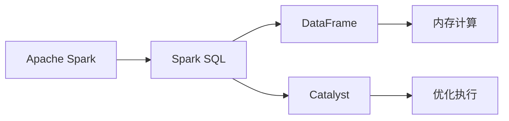

                 

## 1. 背景介绍

### 1.1 问题由来

Spark SQL是Apache Spark的核心组件之一，提供了一种高效的数据处理和查询机制。它基于SQL语法，支持结构化数据的处理、聚合计算、数据操作等，是处理大规模数据的关键工具。然而，由于其底层原理较为复杂，很多开发者在使用过程中仍存在诸多疑惑和误解。因此，本文将从Spark SQL的基本原理入手，通过案例讲解，深入分析Spark SQL的运行机制、算法原理及代码实现。

### 1.2 问题核心关键点

本文将重点探讨以下几个关键点：
- Spark SQL的基本架构和运行机制。
- Spark SQL的查询优化策略和算法原理。
- Spark SQL的具体实现细节和案例讲解。
- Spark SQL在实际应用中的具体场景和注意事项。

### 1.3 问题研究意义

Spark SQL的熟练掌握对于大数据处理、数据分析、机器学习等领域具有重要意义。掌握Spark SQL不仅能够提升数据处理效率，还能帮助开发者更好地理解和优化数据流程。同时，Spark SQL的应用也可以为其他大数据处理工具（如Flink、Hadoop等）提供借鉴。

## 2. 核心概念与联系

### 2.1 核心概念概述

Spark SQL涉及以下几个关键概念：

- **Apache Spark**：一个快速、通用的大数据处理引擎，提供内存计算、弹性分布式计算等特性，是Spark SQL的底层平台。
- **Spark SQL**：提供SQL查询和数据处理的能力，支持结构化数据的处理、聚合计算、数据操作等。
- **DataFrame**：Spark SQL的核心抽象，表示一个结构化数据集，由一组列（Column）组成。
- **Catalyst**：Spark SQL的执行引擎，负责优化和执行SQL查询。

### 2.2 概念间的关系

Spark SQL和Apache Spark的关系如下图所示：



Spark SQL基于Apache Spark的内存计算引擎，通过DataFrame和Catalyst对数据进行管理和优化，最终实现高效的数据处理和查询。

## 3. 核心算法原理 & 具体操作步骤

### 3.1 算法原理概述

Spark SQL的核心算法原理主要包括以下几个方面：

1. **查询优化**：Spark SQL通过Catalyst优化器，对SQL查询进行优化，生成高效的操作计划。
2. **内存计算**：Spark SQL利用内存计算引擎，将数据分发到集群节点上进行计算，提高数据处理效率。
3. **分布式计算**：Spark SQL支持分布式计算，通过并行处理海量数据，提升计算速度。
4. **向量化执行**：Spark SQL支持向量化执行，通过SIMD指令集提高计算效率。

### 3.2 算法步骤详解

以下是Spark SQL的基本算法步骤：

1. **查询解析**：解析SQL查询语句，生成抽象语法树（Abstract Syntax Tree, AST）。
2. **查询优化**：通过Catalyst优化器，对AST进行优化，生成操作计划。
3. **数据划分**：根据操作计划，将数据划分到集群节点上进行分布式计算。
4. **内存计算**：利用内存计算引擎，对数据进行高效计算。
5. **结果合并**：将计算结果合并，并返回最终结果。

### 3.3 算法优缺点

Spark SQL的优点主要包括：
- **高效计算**：利用内存计算和分布式计算，提升数据处理效率。
- **优化能力强**：Catalyst优化器对SQL查询进行优化，提高查询性能。
- **灵活性高**：支持多种数据源和数据格式，兼容性强。

缺点主要包括：
- **资源消耗大**：内存和计算资源消耗较大，对硬件要求较高。
- **学习曲线陡峭**：需要一定的编程和SQL知识基础。
- **延迟较大**：部分操作如聚合计算等，延迟较大。

### 3.4 算法应用领域

Spark SQL广泛应用于以下领域：

- **大数据处理**：用于处理海量数据，支持多表联接、聚合计算等操作。
- **数据分析**：用于数据清洗、统计分析、数据可视化等任务。
- **机器学习**：用于特征提取、模型训练、模型评估等任务。
- **实时数据处理**：用于实时流数据处理、实时数据查询等任务。

## 4. 数学模型和公式 & 详细讲解 & 举例说明

### 4.1 数学模型构建

Spark SQL主要基于数据流图（Dataflow Graph）进行计算。一个数据流图包含多个节点（Operator），每个节点表示一个计算操作。数据从源节点流入，经过一系列计算节点后，最终流向输出节点。

### 4.2 公式推导过程

以聚合操作（如分组、聚合、过滤等）为例，Spark SQL的计算过程如下：

1. **分区（Partitioning）**：将数据按照分区键（Partition Key）进行划分，每个分区在集群节点上独立计算。
2. **聚合（Aggregation）**：对每个分区内的数据进行聚合计算，生成中间结果。
3. **合并（Merge）**：将各分区的中间结果进行合并，生成最终结果。

### 4.3 案例分析与讲解

假设我们需要对某个数据集进行分组聚合操作，查询每个分区的平均数。

```sql
SELECT col1, AVG(col2) FROM data GROUP BY col1
```

Spark SQL的计算过程如下：

1. **解析（Parsing）**：将SQL语句解析为抽象语法树。
2. **优化（Optimization）**：对抽象语法树进行优化，生成操作计划。
3. **执行（Execution）**：根据操作计划，将数据分区，对每个分区进行聚合计算。
4. **合并（Merge）**：将各分区的聚合结果合并，生成最终结果。

## 5. 项目实践：代码实例和详细解释说明

### 5.1 开发环境搭建

1. **安装Apache Spark**：从官网下载安装Spark，并启动Spark Shell。
2. **准备数据集**：准备一个CSV格式的数据集，用于演示。
3. **创建Spark Session**：在Spark Shell中创建一个Spark Session，连接数据库。

### 5.2 源代码详细实现

```python
from pyspark.sql import SparkSession

# 创建Spark Session
spark = SparkSession.builder.appName('Spark SQL Demo').getOrCreate()

# 读取数据集
data = spark.read.csv('data.csv', header=True, inferSchema=True)

# 分组聚合
result = data.groupBy('col1').agg({'col2': 'avg'}).show()

# 关闭Spark Session
spark.stop()
```

### 5.3 代码解读与分析

1. **创建Spark Session**：通过SparkSession连接数据库，用于管理数据流和执行SQL查询。
2. **读取数据集**：使用read.csv方法读取CSV文件，生成DataFrame。
3. **分组聚合**：使用groupBy和agg方法对数据进行分组和聚合，生成新的DataFrame。
4. **显示结果**：使用show方法显示查询结果。
5. **关闭Spark Session**：完成操作后，关闭Spark Session，释放资源。

### 5.4 运行结果展示

假设数据集如下：

| col1 | col2 |
| --- | --- |
| A   | 10   |
| A   | 20   |
| B   | 30   |
| B   | 40   |

执行上述代码，结果如下：

| col1 | avg(col2) |
| --- | ---      |
| A   | 15       |
| B   | 35       |

## 6. 实际应用场景

### 6.1 数据分析

Spark SQL在数据分析领域有着广泛应用。例如，对于一个大规模的电商数据集，可以使用Spark SQL进行数据清洗、统计分析、数据可视化等操作，帮助商家更好地理解用户行为，提升运营效率。

### 6.2 实时数据处理

Spark SQL也支持实时数据处理，如实时流数据的聚合、过滤等操作。对于实时新闻推荐系统，可以使用Spark SQL进行实时流数据的聚合和分析，快速生成推荐结果。

### 6.3 机器学习

Spark SQL支持将数据直接从数据库中读取，用于特征提取、模型训练、模型评估等任务。对于大规模机器学习任务，可以使用Spark SQL进行高效的数据处理和模型训练。

## 7. 工具和资源推荐

### 7.1 学习资源推荐

1. **官方文档**：Apache Spark官方文档，提供详细的API和用法说明。
2. **Spark SQL教程**：Kaggle和Hadoop官方教程，详细讲解Spark SQL的基本操作和应用场景。
3. **Spark SQL Cheat Sheet**：Spark SQL的快速参考手册，帮助开发者快速上手。
4. **Spark SQL书籍**：《Apache Spark in Action》等书籍，提供Spark SQL的深入讲解和案例分析。

### 7.2 开发工具推荐

1. **Spark Shell**：Spark SQL的交互式Shell，方便进行SQL查询和调试。
2. **PySpark**：Python接口，方便进行数据处理和机器学习任务的开发。
3. **Spark Submit**：Spark提交命令，方便进行Spark应用的部署和管理。

### 7.3 相关论文推荐

1. **Spark SQL的设计与实现**：Spark SQL的设计和实现论文，详细讲解Spark SQL的架构和算法原理。
2. **Catalyst优化器**：Catalyst优化器的设计和技术细节，详细讲解优化过程和优化效果。
3. **Spark SQL的优化策略**：Spark SQL的优化策略和算法实现，详细讲解优化过程和优化效果。

## 8. 总结：未来发展趋势与挑战

### 8.1 研究成果总结

Spark SQL作为Apache Spark的核心组件，广泛应用于大数据处理、数据分析、机器学习等领域。Spark SQL的Catalyst优化器通过高效的算法和优化策略，极大地提升了数据处理和查询的性能，成为Spark生态系统的重要组成部分。

### 8.2 未来发展趋势

未来，Spark SQL将进一步提升优化能力和计算性能，支持更多的数据源和数据格式，优化实时数据处理和流数据处理能力，提升大规模数据处理和分析的效率。

### 8.3 面临的挑战

Spark SQL虽然功能强大，但仍面临以下挑战：

1. **资源消耗大**：内存和计算资源消耗较大，对硬件要求较高。
2. **延迟较大**：部分操作如聚合计算等，延迟较大。
3. **学习曲线陡峭**：需要一定的编程和SQL知识基础。

### 8.4 研究展望

未来，Spark SQL的研究方向将包括：

1. **优化器改进**：进一步提升Catalyst优化器的优化能力，减少查询延迟。
2. **数据源扩展**：支持更多数据源和数据格式，提升兼容性和灵活性。
3. **实时流处理**：优化实时数据处理和流数据处理能力，提升数据实时性。
4. **机器学习优化**：优化机器学习任务的计算和存储效率，提升模型训练和评估的速度。

## 9. 附录：常见问题与解答

### Q1：Spark SQL的查询优化器Catalyst如何进行优化？

A: Catalyst优化器通过以下步骤进行优化：

1. **代数转换**：将SQL查询转换为DAG（Directed Acyclic Graph，有向无环图）。
2. **代数优化**：对DAG进行优化，消除冗余操作和无效计算。
3. **分区优化**：对数据进行合理分区，提高计算效率。
4. **推断优化**：对数据类型进行推断，减少资源消耗。
5. **本地优化**：对单个操作进行本地优化，提高计算效率。

### Q2：Spark SQL的数据分区策略有哪些？

A: Spark SQL支持多种数据分区策略，包括：

1. **桶分区（Hash Partitioning）**：根据某个列进行哈希分区，提高计算效率。
2. **范围分区（Range Partitioning）**：根据某个列进行范围分区，支持动态分区。
3. **自定义分区（Custom Partitioning）**：自定义分区策略，满足特定需求。

### Q3：Spark SQL如何进行数据合并？

A: Spark SQL通过将多个分区的中间结果进行合并，生成最终结果。具体步骤如下：

1. **聚合操作**：对每个分区内的数据进行聚合计算，生成中间结果。
2. **分区合并**：将各个分区的中间结果进行合并，生成最终结果。

### Q4：Spark SQL如何在实时数据处理中优化延迟？

A: 在实时数据处理中，Spark SQL可以通过以下方法优化延迟：

1. **批量处理**：将实时数据分批次处理，减少单个操作的延迟。
2. **优化计算**：通过向量化执行和本地优化，减少计算延迟。
3. **数据流控制**：通过水mark机制和状态管理，控制数据流速度，减少延迟。

### Q5：Spark SQL如何处理大规模数据？

A: Spark SQL通过以下方法处理大规模数据：

1. **内存计算**：利用内存计算引擎，提高数据处理效率。
2. **分布式计算**：通过分布式计算，将数据并行处理，提升计算速度。
3. **数据分区**：通过合理分区，减少数据传输和计算开销。

---

作者：禅与计算机程序设计艺术 / Zen and the Art of Computer Programming

