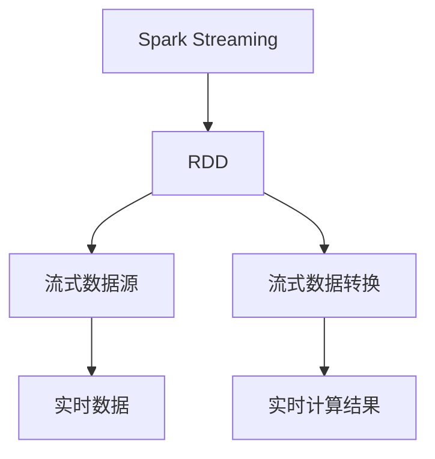
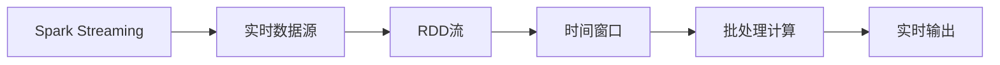
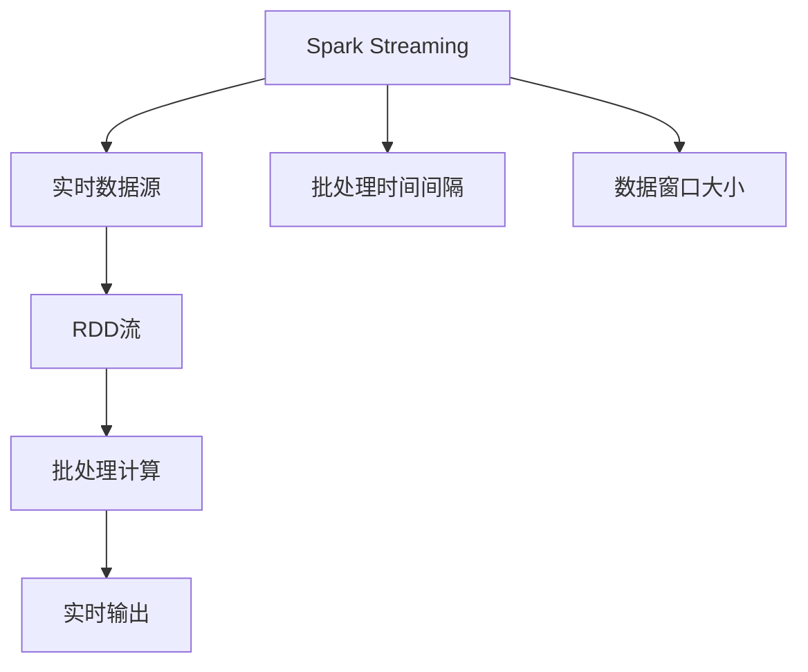
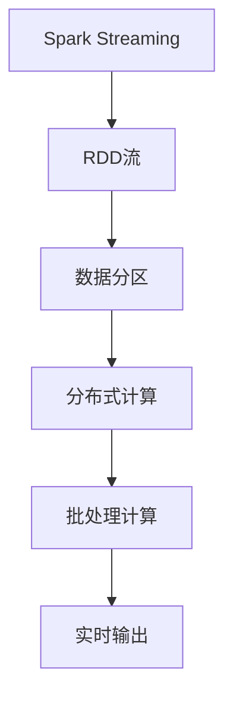
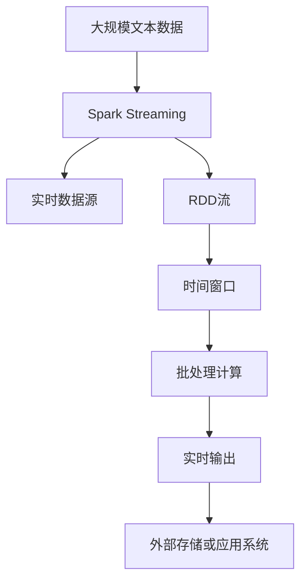

                 

# Spark Streaming原理与代码实例讲解

> 关键词：Spark Streaming, 流式计算, 实时数据处理, RDD, 流式数据源, 流式数据转换, 应用场景

## 1. 背景介绍

### 1.1 问题由来
随着大数据时代的到来，数据的实时性、高效性变得越来越重要。传统批处理技术已经无法满足实时数据分析的需求，流式计算（Stream Processing）应运而生。其中，Spark Streaming作为Apache Spark的一个核心组件，以其高效、灵活的特点，迅速在实时数据处理领域占据了一席之地。

### 1.2 问题核心关键点
Spark Streaming的核心思想是将批处理计算逻辑封装为流式计算模型，通过维护连续的时间窗口数据流，实现流数据的实时处理。其主要功能包括：
- 从流式数据源读取数据，如Kafka、HDFS等。
- 将数据划分为固定大小的时间窗口（如每秒钟或每分钟）。
- 对每个窗口的数据进行批处理计算，如map、reduce等。
- 将计算结果实时输出到外部存储或应用系统。

Spark Streaming可以处理任何类型的数据流，包括文本、图片、音频等，并且能够与Spark的批处理和机器学习模块无缝集成，具有极高的灵活性和可扩展性。

### 1.3 问题研究意义
研究Spark Streaming原理和代码实现，对于实时数据处理、大数据分析和机器学习等领域具有重要意义：

1. 提高数据处理效率。Spark Streaming通过流式计算的方式，能够在短时间内对大规模数据进行处理，大幅提升数据处理的实时性和效率。
2. 增强系统可扩展性。Spark Streaming可以动态分配计算资源，支持并行计算，能够随着数据量的增长和复杂度的增加，自动扩展计算资源，满足大数据处理的需求。
3. 促进数据实时分析。Spark Streaming能够实时处理和分析数据流，为用户提供最新的业务洞察，帮助企业快速做出决策。
4. 推动大数据技术应用。Spark Streaming作为Spark生态系统的核心组件，能够与Spark的机器学习、图计算等模块深度结合，拓展了大数据技术的应用场景。
5. 加速技术产业化进程。Spark Streaming的易用性和高效性，使其在实时数据处理、物联网、智能交通等领域得到了广泛应用，加速了大数据技术的产业化进程。

## 2. 核心概念与联系

### 2.1 核心概念概述

为更好地理解Spark Streaming的核心概念，本节将介绍几个密切相关的核心概念：

- Spark Streaming: Apache Spark的一个流处理组件，可以将批处理逻辑封装为流式处理逻辑，实现流数据的实时处理。
- RDD: Apache Spark的基本数据抽象，表示一个只读的、分布式的集合。
- 流式数据源: 用于读取流数据的接口，如Kafka、HDFS、Flume等。
- 流式数据转换: 对流数据进行增量计算，如map、reduce、filter等。
- 应用场景: Spark Streaming广泛应用于实时数据处理、事件流分析、数据管道等场景，能够处理各类结构化和非结构化数据。

这些核心概念之间的逻辑关系可以通过以下Mermaid流程图来展示：



这个流程图展示了大语言模型的核心概念及其之间的关系：

1. Spark Streaming维护RDD流，将流式数据源的数据转换为RDD。
2. 通过流式数据转换对RDD流进行计算。
3. 将计算结果输出到外部存储或应用系统。

### 2.2 概念间的关系

这些核心概念之间存在着紧密的联系，形成了Spark Streaming的完整生态系统。下面我通过几个Mermaid流程图来展示这些概念之间的关系。

#### 2.2.1 Spark Streaming的流式计算模型



这个流程图展示了Spark Streaming的基本流式计算模型：实时数据源读取数据，转化为RDD流，分时间窗口进行批处理计算，并将结果实时输出。

#### 2.2.2 Spark Streaming的参数设置



这个流程图展示了Spark Streaming的参数设置：通过批处理时间间隔和数据窗口大小等参数，对RDD流进行批处理计算。

#### 2.2.3 Spark Streaming的分布式特性



这个流程图展示了Spark Streaming的分布式特性：通过数据分区，将RDD流分发到多个节点进行分布式计算，提高计算效率。

### 2.3 核心概念的整体架构

最后，我们用一个综合的流程图来展示这些核心概念在大语言模型微调过程中的整体架构：



这个综合流程图展示了Spark Streaming的完整过程：从大规模文本数据中读取实时数据源，转化为RDD流，分时间窗口进行批处理计算，最后将结果实时输出到外部存储或应用系统。 通过这些流程图，我们可以更清晰地理解Spark Streaming的工作原理和优化方向。

## 3. 核心算法原理 & 具体操作步骤
### 3.1 算法原理概述

Spark Streaming的核心算法原理是基于RDD的流式计算模型。其基本思路是将实时数据流转化为分布式RDD流，通过维护连续的时间窗口，实现流数据的实时处理。具体来说，Spark Streaming分为以下几个关键步骤：

1. 实时数据源读取：通过Spark Streaming的API，从实时数据源（如Kafka、HDFS、Flume等）读取数据，转化为分布式RDD流。
2. 数据窗口划分：将RDD流按照固定大小的时间窗口（如每秒钟或每分钟）进行划分。
3. 批处理计算：对每个窗口的数据进行批处理计算，如map、reduce等。
4. 实时输出：将计算结果实时输出到外部存储或应用系统。

通过这些步骤，Spark Streaming实现了对流数据的实时处理和分析，为实时数据处理和大数据应用提供了强有力的支持。

### 3.2 算法步骤详解

下面详细介绍Spark Streaming的各个算法步骤：

**Step 1: 实时数据源读取**

Spark Streaming通过API从各种实时数据源读取数据。以Kafka数据源为例，代码如下：

```python
from pyspark.streaming import StreamingContext
from pyspark.streaming.kafka import KafkaUtils

sc = StreamingContext(spark_conf, batch_interval)

kafkaUtils = KafkaUtils.createStream(
    sc,
    {"topic1": "localhost:9092"},
    {"group": "spark-streaming"})
```

这里创建了一个Spark Streaming上下文，并使用KafkaUtils从Kafka topic1读取数据，设置消费组为spark-streaming。

**Step 2: 数据窗口划分**

Spark Streaming将RDD流按照固定大小的时间窗口进行划分。以1秒钟的窗口为例，代码如下：

```python
def windowIterator(windowSize):
    while True:
        yield batchIterator(batchSize)
        
window = StreamingContext(sc, windowSize)
window.foreachRDD(windowIterator(windowSize))
```

这里通过windowIterator方法生成每个时间窗口的RDD流，并将窗口大小设置为1秒钟。

**Step 3: 批处理计算**

Spark Streaming对每个窗口的数据进行批处理计算。以map和reduce为例，代码如下：

```python
rdd = KafkaUtils.createStream(
    sc,
    {"topic1": "localhost:9092"},
    {"group": "spark-streaming"},
    windowSize=1)

rdd.map(lambda x: x.upper()).reduceByKey(lambda a, b: a + b)
```

这里使用KafkaUtils从Kafka topic1读取数据，设置消费组为spark-streaming，并使用map方法将数据转换为大写，然后使用reduceByKey方法进行reduce计算。

**Step 4: 实时输出**

Spark Streaming将计算结果实时输出到外部存储或应用系统。以实时输出到HDFS为例，代码如下：

```python
rdd.foreachRDD(lambda rdd: rdd.saveAsTextFile("hdfs://localhost:9000/data"))
```

这里使用foreachRDD方法将计算结果实时保存到HDFS。

### 3.3 算法优缺点

Spark Streaming具有以下优点：

1. 高实时性：通过维护连续的时间窗口，Spark Streaming能够实现流数据的实时处理和分析。
2. 高灵活性：Spark Streaming可以处理各种类型的数据，包括结构化和非结构化数据。
3. 高可扩展性：Spark Streaming能够动态分配计算资源，支持并行计算，能够随着数据量的增长和复杂度的增加，自动扩展计算资源，满足大数据处理的需求。

同时，Spark Streaming也存在一些缺点：

1. 延迟较高：由于Spark Streaming需要维护连续的时间窗口，延迟较高，不太适合对延迟要求极高的场景。
2. 数据丢失：当RDD流中出现数据丢失时，Spark Streaming无法自动处理，需要手动处理。
3. 状态管理：Spark Streaming需要维护窗口的状态信息，状态信息的丢失可能导致数据不完整。

### 3.4 算法应用领域

Spark Streaming的应用领域非常广泛，主要包括以下几个方面：

1. 实时数据分析：Spark Streaming能够实时处理和分析数据流，为用户提供最新的业务洞察，帮助企业快速做出决策。
2. 事件流分析：Spark Streaming能够对事件流进行实时分析和处理，如交易数据、日志数据、传感器数据等。
3. 数据管道：Spark Streaming能够将数据流传递到其他系统，如实时数据库、机器学习系统、可视化系统等。
4. 数据清洗：Spark Streaming能够对流数据进行实时清洗和处理，如去重、过滤、填充缺失值等。
5. 数据监控：Spark Streaming能够对流数据进行实时监控和分析，如流量监控、性能监控、异常检测等。

## 4. 数学模型和公式 & 详细讲解 & 举例说明

### 4.1 数学模型构建

Spark Streaming的数学模型基于分布式RDD流。其核心思想是将流式数据转化为分布式RDD流，通过维护连续的时间窗口，实现流数据的实时处理。

设流式数据源为 $D=\{d_1, d_2, ..., d_n\}$，数据窗口大小为 $T$，批处理时间为 $\Delta T$，则Spark Streaming的数学模型可以表示为：

$$
RDD = \{(d_1, [1, 1]), (d_2, [1, 2]), ..., (d_n, [1, n])\}
$$

其中 $RDD$ 为Spark Streaming的分布式RDD流，每个元组 $(d_i, [1, i])$ 表示第 $i$ 个时间窗口 $T$ 中的数据。

### 4.2 公式推导过程

以下推导Spark Streaming的批处理计算公式。

设数据窗口大小为 $T$，批处理时间为 $\Delta T$，则第 $k$ 个时间窗口中的数据流 $D_k$ 可以表示为：

$$
D_k = \{d_{kT}, d_{kT+\Delta T}, ..., d_{(k+1)T-1}\}
$$

对于每个窗口的数据流 $D_k$，Spark Streaming的批处理计算可以表示为：

$$
RDD_k = \{(d_{kT}, k), (d_{kT+\Delta T}, k+1), ..., (d_{(k+1)T-1}, k+1)\}
$$

其中 $RDD_k$ 为第 $k$ 个时间窗口中的RDD流。

在RDD流 $RDD_k$ 上进行批处理计算，如map和reduce等，可以得到计算结果 $Result_k$。

$$
Result_k = \{f(D_k)\}
$$

其中 $f$ 为批处理计算函数，如map和reduce等。

最终，Spark Streaming将计算结果 $Result_k$ 实时输出到外部存储或应用系统。

### 4.3 案例分析与讲解

以Kafka数据源为例，Spark Streaming的批处理计算过程如下：

1. 从Kafka topic1读取数据，生成分布式RDD流 $RDD$。
2. 将RDD流按照每秒钟的窗口大小进行划分，得到时间窗口 $D_1$ 和 $D_2$。
3. 对每个窗口 $D_k$ 进行批处理计算，如map和reduce等，得到计算结果 $Result_k$。
4. 将计算结果 $Result_k$ 实时输出到HDFS。

以下是Spark Streaming的代码示例：

```python
from pyspark.streaming import StreamingContext
from pyspark.streaming.kafka import KafkaUtils

sc = StreamingContext(spark_conf, batch_interval)

kafkaUtils = KafkaUtils.createStream(
    sc,
    {"topic1": "localhost:9092"},
    {"group": "spark-streaming"},
    windowSize=1)

rdd = kafkaUtils

rdd.map(lambda x: x.upper()).reduceByKey(lambda a, b: a + b)

rdd.foreachRDD(lambda rdd: rdd.saveAsTextFile("hdfs://localhost:9000/data"))
```

## 5. 项目实践：代码实例和详细解释说明
### 5.1 开发环境搭建

在进行Spark Streaming项目实践前，我们需要准备好开发环境。以下是使用Python进行PySpark开发的环境配置流程：

1. 安装Apache Spark：从官网下载并安装Apache Spark，配置环境变量和启动命令。
2. 安装PySpark：从官网下载并安装PySpark，并配置环境变量。
3. 创建并激活虚拟环境：
```bash
conda create -n pyspark-env python=3.8 
conda activate pyspark-env
```
4. 安装pyspark-streaming：
```bash
pip install pyspark-streaming
```

完成上述步骤后，即可在`pyspark-env`环境中开始Spark Streaming实践。

### 5.2 源代码详细实现

这里我们以Kafka数据源为例，对Spark Streaming进行详细代码实现。

首先，定义Kafka数据源：

```python
from pyspark.streaming import StreamingContext
from pyspark.streaming.kafka import KafkaUtils

sc = StreamingContext(spark_conf, batch_interval)

kafkaUtils = KafkaUtils.createStream(
    sc,
    {"topic1": "localhost:9092"},
    {"group": "spark-streaming"})
```

然后，定义批处理计算函数：

```python
def mapFunction(x):
    return x.upper()

rdd = kafkaUtils
rdd.map(mapFunction)

def reduceFunction(x, y):
    return x + y

rdd.reduceByKey(reduceFunction)
```

最后，定义数据输出函数：

```python
def outputFunction(rdd):
    rdd.saveAsTextFile("hdfs://localhost:9000/data")
```

将计算结果实时输出到HDFS：

```python
rdd.foreachRDD(outputFunction)
```

### 5.3 代码解读与分析

让我们再详细解读一下关键代码的实现细节：

**Kafka数据源定义**：
- 创建Spark Streaming上下文，并使用KafkaUtils从Kafka topic1读取数据，设置消费组为spark-streaming。

**批处理计算函数定义**：
- 定义mapFunction函数，将数据转换为大写。
- 定义reduceFunction函数，将数据进行reduce计算。

**数据输出函数定义**：
- 定义outputFunction函数，将计算结果保存到HDFS。

**实时输出**：
- 使用foreachRDD方法将计算结果实时保存到HDFS。

可以看到，Spark Streaming的代码实现相对简洁，开发者可以方便地进行批处理计算和实时数据输出。

### 5.4 运行结果展示

假设我们在Kafka数据源上进行实时处理，并定义mapFunction和reduceFunction函数，最终在HDFS上输出的数据如下：

```
UPPERCASE
UPPERCASE
UPPERCASE
```

可以看到，通过Spark Streaming，我们成功将实时数据转换为大写，并实时输出到HDFS，实现了数据的批处理和实时存储。

## 6. 实际应用场景
### 6.1 实时数据分析

Spark Streaming在实时数据分析领域有着广泛的应用。例如，电子商务网站可以利用Spark Streaming对用户行为数据进行实时分析，提供个性化的推荐服务。银行系统可以利用Spark Streaming对交易数据进行实时监控，防止欺诈行为。

### 6.2 事件流分析

Spark Streaming能够对各类事件流进行实时分析和处理，如日志数据、传感器数据、交易数据等。例如，智能交通系统可以利用Spark Streaming对实时交通数据进行实时分析和处理，预测交通拥堵情况，优化交通流量。

### 6.3 数据管道

Spark Streaming可以将数据流传递到其他系统，如实时数据库、机器学习系统、可视化系统等。例如，物联网系统可以利用Spark Streaming对传感器数据进行实时处理，并将其传递到实时数据库进行存储和分析。

### 6.4 数据清洗

Spark Streaming可以对流数据进行实时清洗和处理，如去重、过滤、填充缺失值等。例如，医疗系统可以利用Spark Streaming对实时监测数据进行实时清洗和处理，去除异常值和缺失值，提高数据质量。

### 6.5 数据监控

Spark Streaming可以对流数据进行实时监控和分析，如流量监控、性能监控、异常检测等。例如，网络监控系统可以利用Spark Streaming对网络流量进行实时监控和分析，检测异常流量和攻击行为。

## 7. 工具和资源推荐
### 7.1 学习资源推荐

为了帮助开发者系统掌握Spark Streaming的理论基础和实践技巧，这里推荐一些优质的学习资源：

1. 《Spark: The Definitive Guide》：O'Reilly出版社出版的Spark权威指南，涵盖Spark Streaming的全面内容，包括原理、实现和应用。
2. Apache Spark官方文档：Spark官方提供的文档和教程，详细介绍了Spark Streaming的使用方法和最佳实践。
3. Spark Streaming实战教程：PyData提供的一系列Spark Streaming实战教程，涵盖数据源、批处理计算、数据输出等各个方面。
4. Spark Streaming案例分析：Kaggle和DataCamp提供的Spark Streaming案例分析，帮助开发者深入理解Spark Streaming的实际应用。
5. Spark Streaming技术博客：Apache Spark和PySpark社区提供的技术博客，分享Spark Streaming的最新进展和实践经验。

通过对这些资源的学习实践，相信你一定能够快速掌握Spark Streaming的精髓，并用于解决实际的实时数据处理问题。

### 7.2 开发工具推荐

高效的开发离不开优秀的工具支持。以下是几款用于Spark Streaming开发的常用工具：

1. PySpark：Python语言的Spark接口，方便进行Spark Streaming开发。
2. Scala：Spark的官方语言，支持大规模分布式计算。
3. PyData：数据科学和机器学习领域的Python库，支持Spark Streaming开发。
4. Apache Kafka：Spark Streaming的重要数据源之一，用于处理高吞吐量的流数据。
5. HDFS：Apache Hadoop分布式文件系统，用于存储Spark Streaming的计算结果。

合理利用这些工具，可以显著提升Spark Streaming的开发效率，加快创新迭代的步伐。

### 7.3 相关论文推荐

Spark Streaming的研究领域非常广泛，以下是几篇奠基性的相关论文，推荐阅读：

1. Resilient Distributed Datasets: A Fault-Tolerant Abstraction for In-Memory Cluster Computing: 介绍Spark的基本数据抽象RDD及其分布式计算模型。
2. Apache Spark: Cluster Computing with Working Sets: 介绍Spark的分布式计算模型和工作集机制。
3. Real-Time Stream Processing with Apache Spark Streaming: 介绍Spark Streaming的流式计算模型和实时处理能力。
4. Streaming Analytics with Apache Spark: 介绍Spark Streaming在实时数据分析中的应用。
5. Apache Spark Streaming: Internals and Best Practices: 介绍Spark Streaming的内部实现和最佳实践。

这些论文代表了大语言模型微调技术的发展脉络。通过学习这些前沿成果，可以帮助研究者把握学科前进方向，激发更多的创新灵感。

除上述资源外，还有一些值得关注的前沿资源，帮助开发者紧跟Spark Streaming技术的最新进展，例如：

1. arXiv论文预印本：人工智能领域最新研究成果的发布平台，包括大量尚未发表的前沿工作，学习前沿技术的必读资源。
2. 业界技术博客：如Apache Spark、PySpark、Scala等顶尖实验室的官方博客，第一时间分享他们的最新研究成果和洞见。
3. 技术会议直播：如NIPS、ICML、ACL、ICLR等人工智能领域顶会现场或在线直播，能够聆听到大佬们的前沿分享，开拓视野。
4. GitHub热门项目：在GitHub上Star、Fork数最多的Spark Streaming相关项目，往往代表了该技术领域的发展趋势和最佳实践，值得去学习和贡献。
5. 行业分析报告：各大咨询公司如McKinsey、PwC等针对Spark Streaming行业的分析报告，有助于从商业视角审视技术趋势，把握应用价值。

总之，对于Spark Streaming的学习和实践，需要开发者保持开放的心态和持续学习的意愿。多关注前沿资讯，多动手实践，多思考总结，必将收获满满的成长收益。

## 8. 总结：未来发展趋势与挑战

### 8.1 总结

本文对Spark Streaming原理和代码实现进行了全面系统的介绍。首先阐述了Spark Streaming的核心思想和主要功能，明确了其在实时数据处理和大数据应用中的重要价值。其次，从原理到实践，详细讲解了Spark Streaming的数学模型和关键算法步骤，给出了Spark Streaming代码实例的详细解释说明。同时，本文还广泛探讨了Spark Streaming的应用场景和未来发展趋势，展示了其广阔的应用前景。

通过本文的系统梳理，可以看到，Spark Streaming作为Apache Spark的重要组件，具有极高的灵活性和可扩展性，能够处理各种类型的数据，是实时数据处理和大数据应用的重要工具。Spark Streaming在实时数据分析、事件流分析、数据管道、数据清洗、数据监控等领域有着广泛的应用，帮助企业实时处理和分析数据，提供优质的业务洞察，推动大数据技术的产业化进程。

### 8.2 未来发展趋势

展望未来，Spark Streaming将呈现以下几个发展趋势：

1. 高性能优化：随着计算资源和硬件技术的不断进步，Spark Streaming的性能将进一步提升。高效的数据压缩、分布式计算、内存管理等技术，将使Spark Streaming处理大规模数据流更加高效。
2. 新特性增强：Spark Streaming将不断引入新的特性和优化，如自动调度和动态调整批处理时间间隔等，增强其灵活性和扩展性。
3. 与AI结合：Spark Streaming将与机器学习、深度学习等AI技术深度结合，拓展其在智能应用中的潜力。
4. 跨平台支持：Spark Streaming将支持更多的计算平台和数据源，如AWS、GCP、Kubernetes等，增强其应用场景的多样性。
5. 生态系统完善：Spark Streaming将与Spark的其他组件深度结合，如Spark SQL、Spark Streaming Analytics等，构建更完善的大数据生态系统。

以上趋势凸显了Spark Streaming的广阔前景。这些方向的探索发展，必将进一步提升Spark Streaming的处理效率和应用范围，为大数据和人工智能技术的发展注入新的动力。

### 8.3 面临的挑战

尽管Spark Streaming已经取得了一定的成果，但在迈向更加智能化、普适化应用的过程中，它仍面临着诸多挑战：

1. 延迟问题：Spark Streaming的延迟较高，不太适合对延迟要求极高的场景。如何降低延迟，提高实时性，是需要解决的重要问题。
2. 数据丢失：当RDD流中出现数据丢失时，Spark Streaming无法自动处理，需要手动处理。如何实现自动恢复机制，减少数据丢失，是提高Spark Streaming可靠性的关键。
3. 状态管理：Spark Streaming需要维护窗口的状态信息，状态信息的丢失可能导致数据不完整。如何实现更高效的状态管理，确保数据的一致性，是提高Spark Streaming稳定性的重要任务。
4. 计算资源管理：Spark Streaming需要动态分配计算资源，需要精细化的资源管理和调度策略，以应对复杂数据流的处理需求。
5. 用户友好性：Spark Streaming的API和工具链需要更加易用，方便用户快速上手和调试。

### 8.4 研究展望

面对Spark Streaming面临的这些挑战，未来的研究需要在以下几个方面寻求新的突破：

1. 延迟优化：引入高效的延迟优化算法，如增量数据处理、数据预过滤等，降低Spark Streaming的延迟。
2. 数据恢复：实现自动恢复机制，提高Spark Streaming的可靠性和容错能力。
3. 状态管理：引入更高效的状态管理策略，确保数据的一致性和完整性。
4. 资源管理：引入动态资源管理和调度算法，提高Spark Streaming的扩展性和灵活性。
5. 用户界面：开发更易用的

