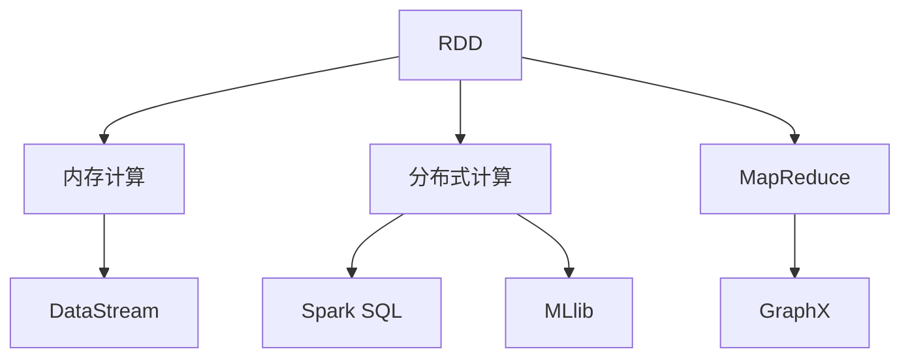
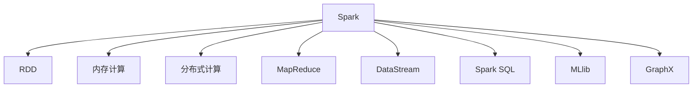
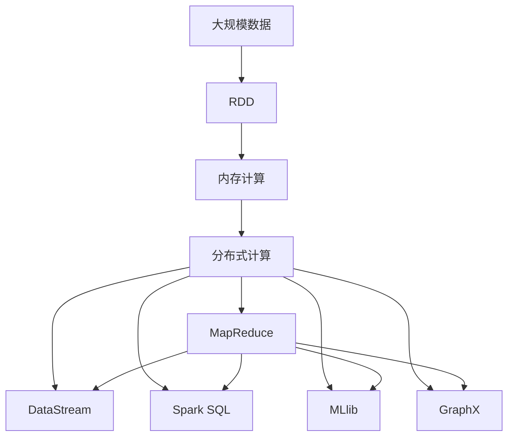

                 

# Spark内存计算引擎原理与代码实例讲解

> 关键词：Spark, 内存计算引擎, 分布式计算, MapReduce, RDD, 核心算法, 大数据, 数据处理

## 1. 背景介绍

### 1.1 问题由来

随着大数据时代的到来，数据处理的需求日益增长，传统的基于磁盘IO的计算方式已经无法满足大规模数据处理的实时性和高吞吐量的需求。为了提高计算效率，内存计算技术应运而生，尤其在数据处理领域得到了广泛应用。

在众多内存计算引擎中，Apache Spark是最具代表性的大数据处理框架之一。Spark不仅提供了内存计算能力，还支持弹性分布式数据集（RDD）模型和面向流的处理框架（DataStream），能够高效处理海量数据，并提供了丰富的API支持，适用于大规模数据处理的各个环节。

### 1.2 问题核心关键点

Spark内存计算引擎的核心在于其分布式内存计算能力和高效的内存管理策略。Spark通过将数据存储在内存中，减少了磁盘IO的延迟，大大提升了数据处理速度。同时，Spark通过自动化的内存管理，能够根据数据大小和计算需求动态调整内存使用，实现最优的内存利用率。

Spark的核心数据结构是弹性分布式数据集（RDD），RDD是一种只读的、可分布的、可分区的数据集，支持多种操作，如Map、Reduce、Join、Filter等，能够方便地进行数据处理和计算。

Spark的分布式计算框架基于MapReduce模型，将复杂的计算任务分解为多个小任务，并行地在集群中执行，通过分治策略实现高效计算。同时，Spark还支持流式计算，能够实时处理数据流，满足实时性需求。

Spark还提供了一套丰富的高层次API，如Spark SQL、Spark Streaming、MLlib、GraphX等，支持数据查询、流式处理、机器学习、图计算等操作，能够全面满足数据处理的各个需求。

### 1.3 问题研究意义

研究Spark内存计算引擎，对于提升大数据处理的效率和性能，加速数据驱动的业务决策，具有重要意义：

1. 提高数据处理速度。通过内存计算，Spark能够大幅提升数据处理的效率，加速数据驱动的业务决策和分析。
2. 降低数据处理成本。Spark能够自动管理内存和IO资源，降低计算成本和存储成本。
3. 支持多种数据处理方式。Spark提供丰富的API和计算框架，支持多种数据处理方式，满足不同业务需求。
4. 简化开发复杂度。Spark的分布式计算框架和高效内存管理，大大简化了大数据处理的开发复杂度。
5. 支持弹性计算。Spark支持动态扩展集群资源，能够根据数据量和计算需求自动调整计算资源，满足弹性计算需求。

## 2. 核心概念与联系

### 2.1 核心概念概述

为更好地理解Spark内存计算引擎，本节将介绍几个密切相关的核心概念：

- 弹性分布式数据集（RDD）：Spark的核心数据结构，支持多种操作，如Map、Reduce、Join、Filter等，能够方便地进行数据处理和计算。
- 内存计算：将数据存储在内存中，减少了磁盘IO的延迟，大大提升了数据处理速度。
- 分布式计算：将复杂的计算任务分解为多个小任务，并行地在集群中执行，通过分治策略实现高效计算。
- MapReduce模型：Spark的分布式计算框架，基于MapReduce模型实现高效计算。
- DataStream：Spark的流式计算框架，支持实时处理数据流，满足实时性需求。
- Spark SQL：Spark的数据查询API，支持SQL查询、优化器和分析器。
- MLlib：Spark的机器学习库，支持多种机器学习算法和数据处理操作。
- GraphX：Spark的图计算框架，支持图数据处理和计算。

这些核心概念之间的逻辑关系可以通过以下Mermaid流程图来展示：



这个流程图展示了他的核心概念及其之间的关系：

1. RDD作为Spark的数据处理核心，利用内存计算和分布式计算实现高效数据处理。
2. MapReduce模型是Spark的分布式计算框架，基于MapReduce实现高效计算。
3. DataStream框架支持实时处理数据流，满足实时性需求。
4. Spark SQL提供数据查询API，支持SQL查询和优化器。
5. MLlib提供机器学习算法和数据处理操作。
6. GraphX支持图数据处理和计算。

这些核心概念共同构成了Spark内存计算引擎的数据处理框架，使其能够高效处理大规模数据，满足各种业务需求。

### 2.2 概念间的关系

这些核心概念之间存在着紧密的联系，形成了Spark内存计算引擎的完整生态系统。下面我们通过几个Mermaid流程图来展示这些概念之间的关系。

#### 2.2.1 Spark内存计算引擎整体架构



这个综合流程图展示了Spark内存计算引擎的整体架构：

1. Spark作为Spark内存计算引擎的调度和管理框架，负责任务的调度和资源管理。
2. RDD作为Spark的数据处理核心，利用内存计算和分布式计算实现高效数据处理。
3. MapReduce模型是Spark的分布式计算框架，基于MapReduce实现高效计算。
4. DataStream框架支持实时处理数据流，满足实时性需求。
5. Spark SQL提供数据查询API，支持SQL查询和优化器。
6. MLlib提供机器学习算法和数据处理操作。
7. GraphX支持图数据处理和计算。

### 2.3 核心概念的整体架构

最后，我们用一个综合的流程图来展示这些核心概念在Spark内存计算引擎中的整体架构：



这个综合流程图展示了从大规模数据到最终数据处理的整个流程。Spark通过RDD将大规模数据分割为小批次数据，利用内存计算和分布式计算实现高效数据处理。MapReduce模型和DataStream框架支持多种计算需求，Spark SQL提供数据查询API，MLlib支持机器学习操作，GraphX支持图计算。

通过这些流程图，我们可以更清晰地理解Spark内存计算引擎中各个核心概念的关系和作用，为后续深入讨论具体的实现细节奠定了基础。

## 3. 核心算法原理 & 具体操作步骤

### 3.1 算法原理概述

Spark内存计算引擎的核心算法原理主要基于分布式内存计算和弹性分布式数据集（RDD）模型。其核心思想是将大规模数据分割为多个小批次数据，并行地在集群中执行计算，通过分治策略实现高效计算。

在Spark中，数据处理的过程可以分为两个阶段：计算阶段和存储阶段。计算阶段通过将数据分割为多个小批次数据，并行地在集群中执行计算，实现高效计算；存储阶段通过自动化的内存管理，将计算结果存储在内存中，减少磁盘IO的延迟，提升数据处理速度。

Spark的核心算法包括弹性分布式数据集（RDD）模型和MapReduce模型，支持多种数据处理和计算操作，如Map、Reduce、Join、Filter等。

### 3.2 算法步骤详解

Spark内存计算引擎的算法步骤主要包括以下几个关键步骤：

**Step 1: 数据预处理和存储**

在Spark中，数据预处理和存储是数据处理的第一步。Spark提供了多种数据存储格式，如文本文件、JSON、Parquet等，能够根据不同的数据源和数据格式选择合适的存储方式。

具体实现流程如下：

1. 选择合适的存储格式，如文本文件、JSON、Parquet等。
2. 通过Spark的API读取数据，将其转换为RDD或DataFrame。
3. 对数据进行预处理，如清洗、转换、分组等。
4. 将处理后的数据存储到内存中，或将计算结果存储到磁盘或分布式文件系统中。

**Step 2: 数据处理和计算**

在数据预处理和存储完成后，Spark通过分布式内存计算和RDD模型进行数据处理和计算。Spark提供了多种数据处理和计算操作，如Map、Reduce、Join、Filter等，能够高效处理大规模数据。

具体实现流程如下：

1. 将数据分割为多个小批次数据。
2. 并行地在集群中执行计算操作，如Map、Reduce、Join、Filter等。
3. 将计算结果存储在内存中，或将结果存储到磁盘或分布式文件系统中。
4. 通过分布式计算框架实现高效数据处理和计算。

**Step 3: 数据存储和优化**

在数据处理和计算完成后，Spark通过自动化的内存管理，将计算结果存储在内存中，减少磁盘IO的延迟，提升数据处理速度。Spark还支持多种数据存储优化策略，如内存优化、内存压缩、数据分区等，能够根据不同的数据量和计算需求动态调整内存使用，实现最优的内存利用率。

具体实现流程如下：

1. 通过自动化的内存管理，将计算结果存储在内存中，减少磁盘IO的延迟。
2. 根据不同的数据量和计算需求，动态调整内存使用，实现最优的内存利用率。
3. 支持多种数据存储优化策略，如内存优化、内存压缩、数据分区等。

**Step 4: 数据查询和分析**

在数据处理和计算完成后，Spark通过Spark SQL等数据查询API，对数据进行查询和分析。Spark SQL支持多种数据查询操作，如SQL查询、数据聚合、数据分组等，能够满足不同业务需求。

具体实现流程如下：

1. 通过Spark SQL等数据查询API，对数据进行查询和分析。
2. 支持多种数据查询操作，如SQL查询、数据聚合、数据分组等。
3. 提供优化器和分析器，支持高效的查询和分析操作。

### 3.3 算法优缺点

Spark内存计算引擎具有以下优点：

1. 高效的数据处理能力。通过分布式内存计算和RDD模型，Spark能够高效处理大规模数据，提升数据处理速度。
2. 自动化的内存管理。Spark通过自动化的内存管理，能够根据数据大小和计算需求动态调整内存使用，实现最优的内存利用率。
3. 丰富的API支持。Spark提供多种API，如Spark SQL、Spark Streaming、MLlib、GraphX等，支持数据查询、流式处理、机器学习、图计算等操作，满足不同业务需求。
4. 灵活的数据处理方式。Spark支持多种数据处理方式，如MapReduce、DataStream、RDD等，能够灵活应对不同的业务需求。

同时，Spark也存在一些缺点：

1. 数据存储和传输的开销较大。虽然Spark通过内存计算大幅提升数据处理速度，但在数据存储和传输过程中，仍然存在一定的开销。
2. 计算资源需求较高。Spark的分布式计算框架需要大量的计算资源，对于小型数据集可能存在资源浪费的问题。
3. 开发复杂度较高。Spark的API和计算框架较为复杂，对于初学者需要一定的学习成本。
4. 数据一致性问题。Spark通过分治策略实现高效计算，但在数据一致性方面存在一定的限制，需要特别注意数据一致性问题。

### 3.4 算法应用领域

Spark内存计算引擎在大数据处理领域得到了广泛应用，覆盖了数据预处理、数据清洗、数据存储、数据查询、数据聚合、数据分组、流式处理、机器学习、图计算等各个环节。Spark在以下领域的应用尤为突出：

1. 数据预处理和存储：Spark支持多种数据存储格式，如文本文件、JSON、Parquet等，能够根据不同的数据源和数据格式选择合适的存储方式。
2. 数据处理和计算：Spark通过分布式内存计算和RDD模型，支持多种数据处理和计算操作，如Map、Reduce、Join、Filter等，能够高效处理大规模数据。
3. 数据查询和分析：Spark通过Spark SQL等数据查询API，对数据进行查询和分析，支持多种数据查询操作，如SQL查询、数据聚合、数据分组等。
4. 流式处理：Spark的DataStream框架支持实时处理数据流，满足实时性需求。
5. 机器学习：Spark的MLlib库支持多种机器学习算法和数据处理操作，能够进行高效的数据分析和机器学习建模。
6. 图计算：Spark的GraphX框架支持图数据处理和计算，能够处理大规模的图数据。

除了上述这些应用领域外，Spark还广泛应用于金融、电商、社交网络、医疗、交通等领域，成为大数据处理的重要工具。

## 4. 数学模型和公式 & 详细讲解 & 举例说明

### 4.1 数学模型构建

Spark内存计算引擎的核心数学模型主要基于弹性分布式数据集（RDD）模型和MapReduce模型。其核心思想是将大规模数据分割为多个小批次数据，并行地在集群中执行计算，通过分治策略实现高效计算。

假设数据集为 $D=\{(x_i, y_i)\}_{i=1}^N$，其中 $x_i$ 为输入数据，$y_i$ 为标签。

在Spark中，数据处理的过程可以分为两个阶段：计算阶段和存储阶段。计算阶段通过将数据分割为多个小批次数据，并行地在集群中执行计算，实现高效计算；存储阶段通过自动化的内存管理，将计算结果存储在内存中，减少磁盘IO的延迟，提升数据处理速度。

### 4.2 公式推导过程

Spark内存计算引擎的公式推导主要基于弹性分布式数据集（RDD）模型和MapReduce模型。

#### 4.2.1 RDD模型

RDD模型是Spark的核心数据结构，其定义如下：

$$
RDD = \{(x_i, y_i)\}_{i=1}^N
$$

其中 $x_i$ 为输入数据，$y_i$ 为标签。

RDD支持多种数据操作，如Map、Reduce、Join、Filter等，能够方便地进行数据处理和计算。

#### 4.2.2 MapReduce模型

MapReduce模型是Spark的分布式计算框架，其核心思想是将大规模计算任务分解为多个小任务，并行地在集群中执行，通过分治策略实现高效计算。

MapReduce模型的公式推导如下：

1. Map阶段：将输入数据 $x$ 映射为若干个输出数据 $y$。
2. Reduce阶段：将Map阶段的输出数据 $y$ 聚合为最终结果。

MapReduce模型的具体公式推导如下：

$$
y = \sum_{i=1}^N map(x_i) reduce(map(x_i))
$$

其中 $map(x_i)$ 为Map阶段的操作，$reduce(map(x_i))$ 为Reduce阶段的操作。

### 4.3 案例分析与讲解

这里以Spark的机器学习库MLlib为例，介绍Spark内存计算引擎的实际应用。

假设我们要对一组数据进行回归分析，利用Spark的MLlib库进行建模和训练。

具体步骤如下：

1. 数据预处理和存储。将数据存储在分布式文件系统中，如HDFS、S3等，并使用Spark的API读取数据，将其转换为RDD或DataFrame。
2. 数据处理和计算。使用RDD模型和MapReduce框架，对数据进行预处理、特征提取、模型训练等操作。
3. 数据查询和分析。利用Spark SQL等数据查询API，对模型进行评估和分析，输出回归结果。

具体实现代码如下：

```python
from pyspark.mllib.regression import LinearRegressionWithSGD
from pyspark.mllib.regression import LabeledPoint
from pyspark import SparkContext

# 创建Spark上下文
sc = SparkContext()

# 读取数据集
data = sc.textFile("hdfs://localhost:9000/user/hadoop/input/data.txt")

# 将数据转换为LabeledPoint格式
data = data.map(lambda x: LabeledPoint(float(x.split(",")[0]), float(x.split(",")[1])).cache()

# 使用随机梯度下降算法训练模型
lr = LinearRegressionWithSGD.train(data, iter=10, lambda_=0.01, elasticNetParam=0.1)

# 使用模型进行预测
prediction = lr.predict(data)

# 输出回归结果
print(prediction.collect())
```

## 5. 项目实践：代码实例和详细解释说明

### 5.1 开发环境搭建

在进行Spark内存计算引擎的实践前，我们需要准备好开发环境。以下是使用Python进行Spark开发的环

