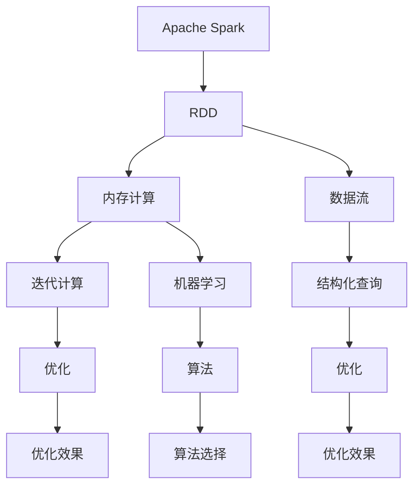
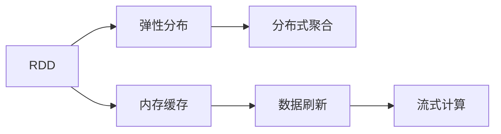
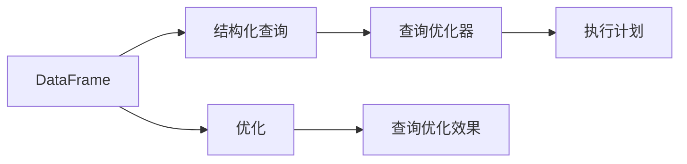
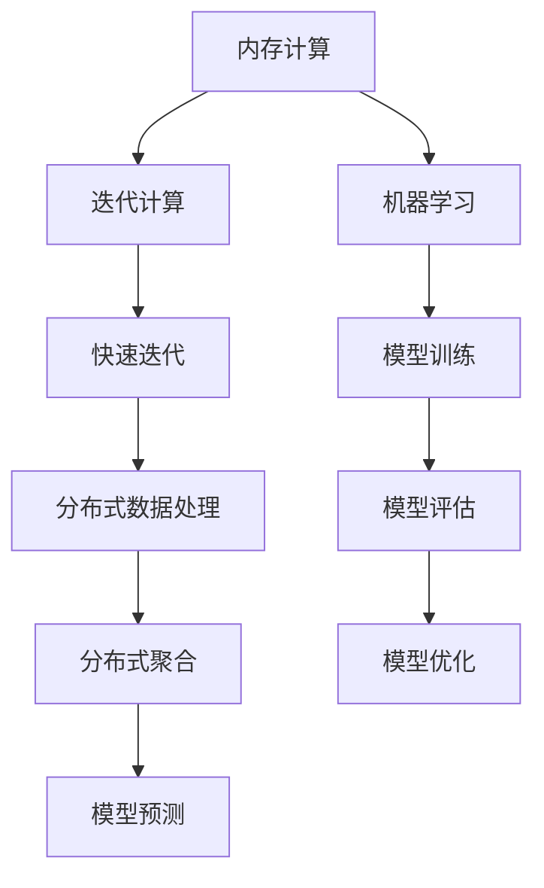
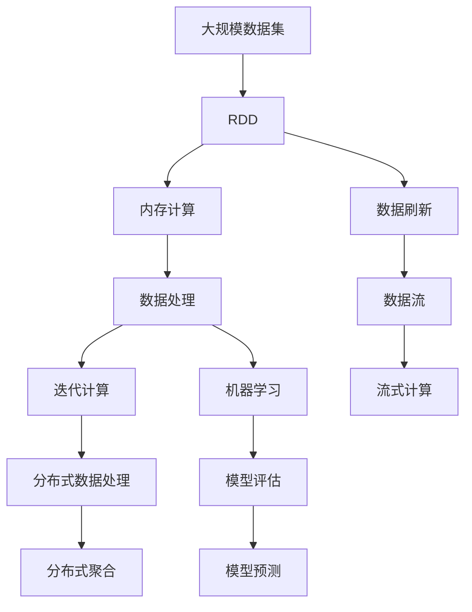

                 

# Spark原理与代码实例讲解

> 关键词：Apache Spark, 分布式计算, 弹性分布式数据集, 内存计算, 流水线调度, 机器学习, SQL查询

## 1. 背景介绍

### 1.1 问题由来

随着数据规模的不断增长，传统的关系型数据库已难以满足实时处理、大容量存储和复杂查询的需求。为了解决这一问题，Apache Spark应运而生。Apache Spark是一个快速、通用、可扩展的分布式计算系统，它支持分布式数据处理、内存计算、机器学习、图形处理等多种计算框架，已经成为大数据处理的主流技术之一。

### 1.2 问题核心关键点

Apache Spark的核心优势在于其高性能的内存计算能力和灵活的计算框架，使得大数据处理更加高效。Spark通过弹性分布式数据集（RDD）和数据流（DataFrame）等抽象，简化了分布式计算的复杂度，并且可以与其他大数据技术（如Hadoop、Hive、Cassandra等）无缝集成。

## 2. 核心概念与联系

### 2.1 核心概念概述

为更好地理解Apache Spark的原理，本节将介绍几个关键概念：

- Apache Spark：一个快速、通用、可扩展的分布式计算系统，支持内存计算、分布式数据处理、机器学习等多种计算框架。
- 弹性分布式数据集（RDD）：Spark的基本数据抽象，支持数据的弹性分布、数据缓存、分布式聚合等操作。
- 数据流（DataFrame）：Spark的高级数据抽象，支持数据的结构化查询和优化，简化了数据操作的复杂度。
- 内存计算：Spark的核心优势之一，通过将数据放到内存中，大幅提高了计算效率，特别适用于迭代计算、机器学习等场景。
- 流水线调度：Spark的计算框架，通过将任务分解成多个阶段，实现高效的流水线处理，使得Spark可以并行处理大规模数据。

这些核心概念之间的逻辑关系可以通过以下Mermaid流程图来展示：



这个流程图展示了Apache Spark的核心概念及其之间的关系：

1. Apache Spark是Spark的核心计算平台，支持多种数据处理和机器学习框架。
2. RDD是Spark的基本数据抽象，支持弹性分布和内存缓存。
3. 数据流则是Spark的高级数据抽象，支持结构化查询和优化。
4. 内存计算是Spark的核心优势之一，通过将数据放到内存中，大幅提高了计算效率。
5. 流水线调度是Spark的计算框架，通过分解任务实现高效的并行处理。

### 2.2 概念间的关系

这些核心概念之间存在着紧密的联系，形成了Spark的完整计算框架。下面我通过几个Mermaid流程图来展示这些概念之间的关系。

#### 2.2.1 RDD的流式计算



这个流程图展示了RDD的流式计算过程：

1. RDD通过弹性分布和内存缓存，实现了数据的高效处理。
2. 分布式聚合操作使得RDD可以在多个节点上并行处理。
3. 数据刷新操作可以保持内存中的数据和磁盘上的数据同步。
4. 流式计算则通过持续的流数据处理，实现了实时计算。

#### 2.2.2 数据流的优化



这个流程图展示了数据流的优化过程：

1. DataFrame是Spark的高级数据抽象，支持结构化查询。
2. 查询优化器通过查询优化，实现了高效的数据处理。
3. 查询优化效果提高了数据处理的效率。
4. 执行计划则指导了查询的执行路径。

#### 2.2.3 内存计算与分布式计算



这个流程图展示了内存计算与分布式计算的关系：

1. 内存计算通过将数据放到内存中，大幅提高了计算效率。
2. 迭代计算适用于需要多次迭代的算法，如机器学习中的梯度下降。
3. 机器学习通过迭代计算，实现了高效的模型训练。
4. 分布式数据处理通过将数据分发到多个节点，实现了并行计算。
5. 模型评估和预测通过分布式数据处理，实现了高效的数据处理。

### 2.3 核心概念的整体架构

最后，我们用一个综合的流程图来展示这些核心概念在大数据处理中的整体架构：



这个综合流程图展示了从大规模数据处理到分布式计算的完整过程。Spark通过RDD实现了数据的弹性分布和内存缓存，并通过内存计算和迭代计算大幅提高了计算效率。同时，Spark通过分布式数据处理和机器学习实现了高效的模型训练和预测。流式计算则通过持续的流数据处理，实现了实时计算。通过这些核心概念的协同工作，Spark能够高效地处理大规模数据，实现实时计算和机器学习应用。

## 3. 核心算法原理 & 具体操作步骤

### 3.1 算法原理概述

Apache Spark的核心算法原理基于弹性分布式数据集（RDD）和数据流（DataFrame）等抽象，简化了分布式计算的复杂度，并且支持多种计算框架。

### 3.2 算法步骤详解

Spark的计算过程可以简单地分为以下几个步骤：

**Step 1: 数据准备**

将数据集分割成多个分区（Partition），每个分区可以在一个节点上进行处理。Spark通过RDD将数据集分割成多个分区，每个分区可以在一个节点上进行并行处理。

**Step 2: 数据处理**

Spark提供了一系列的数据处理API，包括map、reduce、filter、join等。用户可以通过这些API对数据进行处理。例如，使用map操作对每个分区进行映射，将数据从一种形式转换为另一种形式；使用reduce操作对数据进行聚合操作，如求和、计数等。

**Step 3: 数据流处理**

Spark还提供了数据流处理API，可以对流数据进行实时处理。用户可以使用Spark Streaming框架，将实时数据流转换为RDD，并对数据流进行实时处理。

**Step 4: 内存计算**

Spark的核心优势在于其高性能的内存计算能力。Spark将数据放到内存中，通过迭代计算和机器学习等操作，实现了高效的数据处理。Spark通过将数据缓存到内存中，避免了I/O操作，提高了计算效率。

**Step 5: 分布式计算**

Spark通过弹性分布式数据集（RDD）实现了数据的分布式计算。Spark的RDD支持数据的弹性分布、内存缓存、分布式聚合等操作，简化了分布式计算的复杂度。

### 3.3 算法优缺点

Apache Spark的优点包括：

- 高性能的内存计算能力：Spark通过将数据放到内存中，大幅提高了计算效率，特别适合迭代计算和机器学习等场景。
- 灵活的计算框架：Spark支持多种计算框架，包括内存计算、分布式计算、流式计算等，可以满足不同的数据处理需求。
- 易于使用的API：Spark提供了简单易用的API，使得用户可以快速上手，进行数据分析和机器学习等操作。
- 弹性分布式数据集（RDD）：Spark的RDD实现了数据的弹性分布和内存缓存，简化了分布式计算的复杂度。

Spark的缺点包括：

- 内存限制：Spark的内存计算能力虽然强大，但仍然存在内存限制，不适合处理超大规模的数据集。
- 延迟任务（Delay Task）：Spark的延迟任务虽然能够提高计算效率，但也会导致数据处理的延迟增加。
- 资源管理：Spark的资源管理机制相对简单，在多任务并发的情况下，可能会导致资源争抢，影响性能。
- 部署复杂：Spark的部署相对复杂，需要考虑集群管理、故障恢复等问题，增加了系统的复杂度。

### 3.4 算法应用领域

Apache Spark已经广泛应用于各种大数据处理场景，包括：

- 实时数据处理：Spark Streaming可以处理实时数据流，实现实时分析和实时查询。
- 数据仓库：Spark SQL可以查询结构化数据，实现数据仓库的构建。
- 机器学习：Spark MLlib提供了多种机器学习算法，支持大规模数据训练。
- 图形处理：Spark GraphX支持图形处理和分析，用于社交网络、推荐系统等场景。
- 数据分析：Spark提供了多种数据分析API，支持数据清洗、数据聚合等操作。
- 分布式文件系统：Spark支持多种分布式文件系统，如HDFS、Ceph等，可以处理大规模数据存储。

## 4. 数学模型和公式 & 详细讲解  
### 4.1 数学模型构建

Spark的核心数学模型基于RDD和数据流（DataFrame）等抽象，简化了分布式计算的复杂度，并且支持多种计算框架。

记RDD为 $R = (P, f)$，其中 $P$ 为分区的集合， $f$ 为映射函数。RDD的基本操作包括map、reduce、join等。

Spark的数据流模型基于结构化查询语言（SQL），通过DataFrame API实现了高效的数据处理。

### 4.2 公式推导过程

以下我们以Spark的RDD操作为例，推导RDD的map操作和reduce操作的公式。

**map操作**：将RDD中的每个元素应用映射函数，生成新的RDD。假设RDD $R = (P, f)$，map操作的结果为：

$$ R' = (P', f') $$
$$ f'(x) = f(x) $$

其中 $P'$ 为新的分区集合， $f'$ 为新的映射函数。

**reduce操作**：将RDD中的元素进行聚合操作，生成新的RDD。假设RDD $R = (P, f)$，reduce操作的结果为：

$$ R' = (P', g) $$
$$ g(p) = \bigoplus_{x \in p} f(x) $$

其中 $P'$ 为新的分区集合， $g$ 为新的聚合函数。

### 4.3 案例分析与讲解

我们以Spark的机器学习框架MLlib为例，讲解Spark的机器学习算法。

Spark的MLlib提供了多种机器学习算法，包括回归、分类、聚类等。以线性回归为例，假设训练集为 $(x_i, y_i)$，其中 $x_i$ 为输入特征， $y_i$ 为标签。线性回归的模型为：

$$ y = wx + b $$

其中 $w$ 为权重， $b$ 为偏置。

线性回归的训练过程包括特征向量化、梯度下降等步骤。Spark的MLlib实现了高效的梯度下降算法，支持大规模数据训练。

## 5. 项目实践：代码实例和详细解释说明

### 5.1 开发环境搭建

在进行Spark项目实践前，我们需要准备好开发环境。以下是使用Python进行Spark开发的环境配置流程：

1. 安装Anaconda：从官网下载并安装Anaconda，用于创建独立的Python环境。

2. 创建并激活虚拟环境：
```bash
conda create -n spark-env python=3.8 
conda activate spark-env
```

3. 安装PySpark：从官网获取Spark安装包，解压后进入安装目录，运行以下命令：
```bash
export SPARK_HOME=/path/to/spark
export PYTHONPATH=$PYTHONPATH:$SPARK_HOME/python:$SPARK_HOME/python/pyspark
```

4. 安装Py4j：用于Spark与Python的互操作：
```bash
pip install py4j
```

5. 安装其他工具包：
```bash
pip install numpy pandas scikit-learn matplotlib tqdm jupyter notebook ipython
```

完成上述步骤后，即可在`spark-env`环境中开始Spark项目实践。

### 5.2 源代码详细实现

下面我们以Spark的机器学习框架MLlib为例，给出使用PySpark进行线性回归的代码实现。

首先，导入必要的PySpark库：

```python
from pyspark.sql import SparkSession
from pyspark.ml.linalg import Vectors
from pyspark.ml.regression import LinearRegression

spark = SparkSession.builder.appName("SparkMLlib").getOrCreate()
```

然后，定义训练数据和测试数据：

```python
# 训练数据
train_df = spark.createDataFrame([(Vectors.dense([1.0, 2.0]), 5.0), (Vectors.dense([2.0, 2.0]), 7.0), (Vectors.dense([3.0, 2.0]), 9.0)], ["features", "label"])

# 测试数据
test_df = spark.createDataFrame([(Vectors.dense([4.0, 2.0]), None)], ["features"])
```

接着，进行模型训练和评估：

```python
# 定义线性回归模型
lr = LinearRegression()

# 训练模型
model = lr.fit(train_df)

# 进行预测
preds = model.transform(test_df)

# 评估模型
from pyspark.ml.evaluation import RegressionEvaluator
evaluator = RegressionEvaluator(labelCol="label", predictionCol="prediction", metricName="rmse")
rmse = evaluator.evaluate(preds).rmse

print("Root Mean Squared Error (RMSE) = %g" % (rmse))
```

最后，启动Spark任务并保存模型：

```python
spark.stop()
```

以上就是使用PySpark进行线性回归的完整代码实现。可以看到，得益于Spark的高性能内存计算能力，我们能够在短短几行代码中完成模型的训练和评估，这在大规模数据处理中具有非常高的效率。

### 5.3 代码解读与分析

让我们再详细解读一下关键代码的实现细节：

**训练数据定义**：
- 使用`spark.createDataFrame`方法创建训练数据集，将输入特征和标签构建成DataFrame格式。

**模型训练**：
- 使用`LinearRegression`方法定义线性回归模型。
- 使用`fit`方法对训练数据进行模型训练，返回训练好的模型。

**模型评估**：
- 使用`RegressionEvaluator`方法定义评估器，计算模型的RMSE（Root Mean Squared Error）指标。
- 使用`evaluate`方法对测试数据进行模型评估，返回评估结果。

**运行结果展示**：
- 输出RMSE指标，用于评估模型的性能。

可以看到，使用PySpark进行机器学习任务非常简单，无需编写复杂的数据处理和模型训练代码，只需要几行代码即可实现高效的模型训练和评估。这正是Spark的强大之处。

当然，工业级的系统实现还需考虑更多因素，如模型保存和部署、超参数的自动搜索、更灵活的任务适配层等。但核心的计算流程基本与此类似。

## 6. 实际应用场景

### 6.1 金融风险管理

Spark在金融风险管理中的应用非常广泛，可以通过实时数据处理和机器学习算法，实现风险识别、信用评估、欺诈检测等任务。例如，金融机构可以通过实时监控市场舆情，识别潜在的金融风险，快速响应市场波动。

在技术实现上，可以收集金融领域的各类数据，如市场指数、财务报表、交易记录等，并使用Spark进行实时处理和分析。使用机器学习算法，可以预测市场的趋势和风险，实现智能决策支持。

### 6.2 医疗数据分析

Spark在医疗数据分析中的应用也非常广泛，可以通过实时数据处理和机器学习算法，实现患者病历分析、疾病预测、治疗效果评估等任务。例如，医院可以通过实时监控患者的生理数据，预测患者的病情发展，制定个性化的治疗方案。

在技术实现上，可以收集患者的生理数据、病历记录等，并使用Spark进行实时处理和分析。使用机器学习算法，可以预测患者的病情发展，制定个性化的治疗方案，实现智能医疗支持。

### 6.3 推荐系统

Spark在推荐系统中的应用也非常广泛，可以通过实时数据处理和机器学习算法，实现个性化推荐、用户行为分析、商品推荐等任务。例如，电商可以通过实时监控用户的购买行为，推荐用户可能感兴趣的商品，提高用户购买率和销售额。

在技术实现上，可以收集用户的浏览、点击、购买等行为数据，并使用Spark进行实时处理和分析。使用机器学习算法，可以预测用户的兴趣和行为，实现个性化推荐，提高用户粘性和销售额。

### 6.4 未来应用展望

随着Spark技术的不断演进，未来Spark将会在更多领域得到应用，为各行各业带来变革性影响。

在智慧城市治理中，Spark可以应用于城市事件监测、舆情分析、应急指挥等环节，提高城市管理的自动化和智能化水平，构建更安全、高效的未来城市。

在智慧医疗领域，Spark可以应用于患者病历分析、疾病预测、治疗效果评估等任务，实现智能医疗支持，提高医疗服务的智能化水平，辅助医生诊疗，加速新药开发进程。

在智能教育领域，Spark可以应用于学情分析、知识推荐、作业批改等任务，因材施教，促进教育公平，提高教学质量。

总之，Spark的应用场景非常广泛，未来将继续拓展其应用边界，为各行各业带来更多的智能支持和服务。

## 7. 工具和资源推荐
### 7.1 学习资源推荐

为了帮助开发者系统掌握Apache Spark的原理和实践技巧，这里推荐一些优质的学习资源：

1. Apache Spark官方文档：Spark的官方文档详细介绍了Spark的架构、API、算法等核心内容，是学习Spark的最佳资料。

2. Spark快速入门指南：Spark的官方快速入门指南，提供简单易懂的学习路径和代码示例，适合初学者快速上手。

3. Spark大数据开发实战：本书介绍了Spark在大数据处理、机器学习、图形处理等场景中的应用，适合有一定Spark基础的读者进一步学习。

4. Spark with Python by Example：本书通过Python代码示例，详细介绍了Spark的各种API和用法，适合Python开发者学习Spark。

5. Spark在线课程：如Coursera、Udacity等平台提供的Spark课程，提供系统化学习路径和实时互动教学，适合系统学习Spark。

通过对这些资源的学习实践，相信你一定能够快速掌握Apache Spark的精髓，并用于解决实际的NLP问题。

### 7.2 开发工具推荐

高效的开发离不开优秀的工具支持。以下是几款用于Spark开发的工具：

1. Apache Spark：Spark的官方开发工具，提供丰富的API和算法，适用于大数据处理和机器学习。

2. PySpark：Python API，提供简单易用的API接口，支持Spark的多种计算框架和算法。

3. Spark SQL：Spark的SQL接口，支持结构化数据处理和优化，适用于数据仓库和数据管道构建。

4. Spark Streaming：Spark的流式计算框架，支持实时数据处理和分析，适用于实时数据流处理。

5. Spark GraphX：Spark的图形处理框架，支持图形处理和分析，适用于社交网络、推荐系统等场景。

6. Spark MLlib：Spark的机器学习库，支持多种机器学习算法，适用于大规模数据训练。

合理利用这些工具，可以显著提升Spark项目开发的效率，加快创新迭代的步伐。

### 7.3 相关论文推荐

Spark的持续发展源于学界的持续研究。以下是几篇奠基性的相关论文，推荐阅读：

1. Resilient Distributed Datasets: A Fault-Tolerant Abstraction for In-Memory Cluster Computing：Spark的奠基论文，详细介绍了RDD的基本概念和设计原理。

2. Spark: Cluster Computing with Fault Tolerance：Spark的原始论文，详细介绍了Spark的核心设计思想和算法。

3. Spark: The Unified Analytics Engine：Spark的最新版本论文，详细介绍了Spark的最新进展和优化策略。

4. Fast and Fault-Tolerant Large-Scale Machine Learning：Spark的机器学习库MLlib的原始论文，详细介绍了MLlib的核心算法和优化策略。

5. GraphX: A Graph Platform for Machine Learning and Statistical Network Analysis：Spark的图形处理库GraphX的原始论文，详细介绍了GraphX的核心算法和优化策略。

这些论文代表了大数据处理技术的演进脉络。通过学习这些前沿成果，可以帮助研究者把握学科前进方向，激发更多的创新灵感。

除上述资源外，还有一些值得关注的前沿资源，帮助开发者紧跟Spark技术的最新进展，例如：

1. Apache Spark官网：Spark的官方文档、用户手册、社区讨论等，是学习Spark的重要资源。

2. Spark源代码：Spark的源代码托管在GitHub上，是学习Spark核心算法和优化策略的最佳资料。

3. Spark在线博客：如Spark的官方博客、Apache基金会博客等，提供最新的Spark开发动态和技术分享。

4. Spark论文预印本：人工智能领域最新研究成果的发布平台，包括大量尚未发表的前沿工作，学习前沿技术的必读资源。

5. 行业分析报告：各大咨询公司如McKinsey、PwC等针对Spark技术的分析报告，有助于从商业视角审视技术趋势，把握应用价值。

总之，对于Apache Spark的学习和实践，需要开发者保持开放的心态和持续学习的意愿。多关注前沿资讯，多动手实践，多思考总结，必将收获满满的成长收益。

## 8. 总结：未来发展趋势与挑战

### 8.1 总结

本文对Apache Spark的原理与代码实例进行了全面系统的介绍。首先阐述了Spark的核心优势和计算框架，详细讲解了RDD和数据流等基本概念，展示了Spark的强大计算能力。其次，从原理到实践，详细讲解了Spark的算法流程和操作步骤，给出了完整的代码实例。同时，本文还广泛探讨了Spark在金融风险管理、医疗数据分析、推荐系统等多个领域的应用前景，展示了Spark的广阔应用范围。

通过本文的系统梳理，可以看到，Apache Spark作为大数据处理的主流技术，已经广泛应用于各种计算框架和算法，可以高效地处理大规模数据，实现实时计算和机器学习应用。未来，伴随Spark技术的不断演进，其在各行各业的应用前景将更加广阔。

### 8.2 未来发展趋势

展望未来，Spark的发展趋势将呈现以下几个方向：

1. 分布式文件系统：Spark将进一步与多种分布式文件系统进行优化，支持更多的数据存储和处理需求。

2. 实时计算：Spark将进一步提升实时计算能力，支持更多的流数据处理和实时分析。

3. 机器学习：Spark将进一步提升机器学习性能，支持更多的分布式机器学习算法。

4. 可扩展性：Spark将进一步提升系统的可扩展性，支持更多的节点和数据处理需求。

5. 性能优化：Spark将进一步优化算法和计算框架，提升系统的性能和效率。

6. 社区生态：Spark将进一步加强社区生态建设，推动更多的开源项目和应用集成。

### 8.3 面临的挑战

尽管Spark已经取得了巨大成功，但在迈向更加智能化、普适化应用的过程中，它仍面临诸多挑战：

1. 内存限制：Spark的内存计算能力虽然强大，但仍然存在内存限制，不适合处理超大规模的数据集。

2. 延迟任务：Spark的延迟任务虽然能够提高计算效率，但也会导致数据处理的延迟增加。

3. 资源管理：Spark的资源管理机制相对简单，在多任务并发的情况下，可能会导致资源争抢，影响性能。

4. 部署复杂：Spark的部署相对复杂，需要考虑集群管理、故障恢复等问题，增加了系统的复杂度。

5. 可扩展性：Spark的分布式计算能力虽然强大，但仍然存在扩展性瓶颈，需要更多的优化。

### 8.4 研究展望

为了应对Spark面临的挑战，未来的研究需要在以下几个方面寻求新的突破：

1. 优化内存计算能力：开发更高效的内存计算框架，支持超大规模数据集的处理。

2. 改进延迟任务机制：优化延迟任务的调度算法，减少数据处理的延迟。

3. 加强资源管理：优化资源管理机制，提高系统的可扩展性和性能。

4. 简化部署流程：优化Spark的部署流程，减少系统的复杂度。

5. 提升可扩展性：优化Spark的分布式计算能力，支持更多的节点和数据处理需求。

这些研究方向的探索，必将引领Spark技术迈向更高的台阶，为大数据处理和机器学习带来更多的创新和突破。

## 9. 附录：常见问题与解答

**Q1：Spark与Hadoop相比，有什么优势？**

A: Spark相比Hadoop，具有以下优势：

