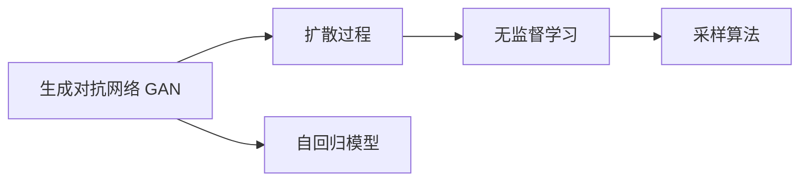
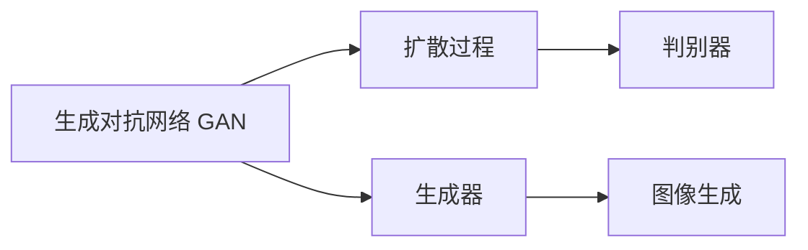
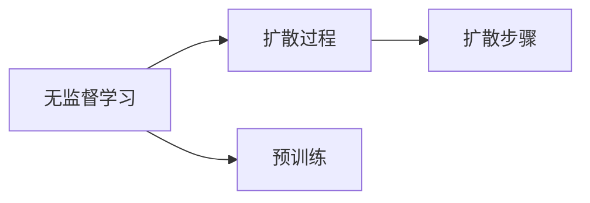
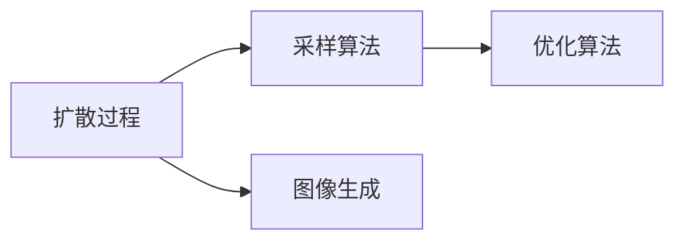
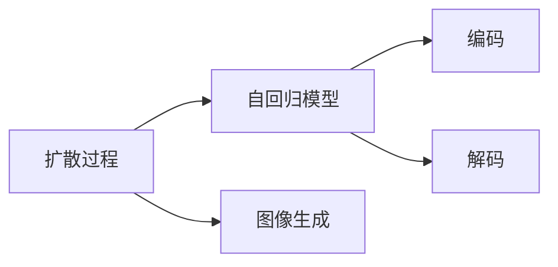
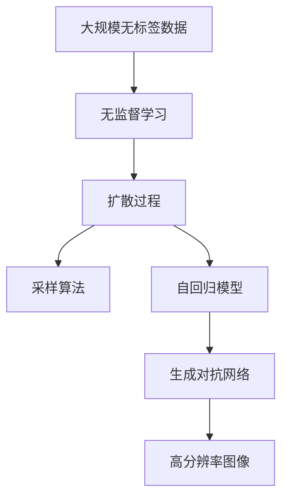

                 

# Stable Diffusion原理与代码实例讲解

> 关键词：
Stable Diffusion, 生成对抗网络 (GAN), 无监督学习, 扩散过程, 采样算法, 图像生成, 实时渲染

## 1. 背景介绍

### 1.1 问题由来

近年来，深度学习在计算机视觉、自然语言处理等领域取得了巨大成功。生成对抗网络（GANs）作为其中的一员，以其在图像生成、视频生成等领域的卓越表现，备受瞩目。然而，GANs存在训练不稳定、模型易过拟合、生成结果不连贯等问题，限制了其在大规模实际应用中的广泛推广。Stable Diffusion作为最新的生成模型之一，通过引入扩散过程和无监督学习方法，有效解决了这些问题，能够生成高质量、连贯、高分辨率的图像和视频，被广泛用于图像编辑、数据增强、虚拟现实等领域。

### 1.2 问题核心关键点

Stable Diffusion的核心思想是通过扩散过程对图像生成模型进行优化，具体包括以下关键点：

1. 扩散过程：采用随时间逐渐增加噪声的方法，使得模型可以逐步学习到图像特征，最终生成高质量图像。
2. 无监督学习：利用大规模无标签数据进行预训练，学习图像特征。
3. 采样算法：引入采样算法对生成的图像进行优化，使其更加连贯、细节丰富。
4. 自回归模型：使用自回归模型对图像进行编码和解码，从而实现高质量图像的生成。
5. 扩散步骤：通过一系列扩散步骤对图像进行细粒度处理，最终生成高质量图像。

这些关键点共同构成了Stable Diffusion的核心理念，使其能够生成高质量、连贯、高分辨率的图像和视频。

### 1.3 问题研究意义

Stable Diffusion在图像生成领域的应用，可以显著提升图像生成的质量和效率，使其更广泛地应用于实际场景中。例如，在虚拟现实、虚拟主播、动画制作等领域，Stable Diffusion能够生成高质量的3D模型和纹理，大大提升了渲染速度和效果。此外，Stable Diffusion还可以用于数据增强、图像修复、图像压缩等领域，具有广阔的应用前景。

## 2. 核心概念与联系

### 2.1 核心概念概述

为更好地理解Stable Diffusion的工作原理，本节将介绍几个密切相关的核心概念：

- 生成对抗网络 (GAN)：由生成器和判别器两个部分组成，通过对抗训练提高生成器的能力。
- 扩散过程：通过逐渐增加噪声的方法，使得生成器能够逐步学习到图像特征。
- 无监督学习：利用大规模无标签数据进行预训练，学习图像特征。
- 采样算法：对生成的图像进行优化，使其更加连贯、细节丰富。
- 自回归模型：使用自回归模型对图像进行编码和解码，实现高质量图像的生成。

这些概念之间的逻辑关系可以通过以下Mermaid流程图来展示：



这个流程图展示了从GAN到扩散过程，再到无监督学习、采样算法和自回归模型的整体架构。

### 2.2 概念间的关系

这些核心概念之间存在着紧密的联系，形成了Stable Diffusion的完整生态系统。下面我们通过几个Mermaid流程图来展示这些概念之间的关系。

#### 2.2.1 扩散过程与GAN的关系



这个流程图展示了扩散过程与GAN的关系。扩散过程通过逐步增加噪声的方法，使得生成器能够逐步学习到图像特征。

#### 2.2.2 无监督学习与扩散过程的关系



这个流程图展示了无监督学习与扩散过程的关系。无监督学习通过在大规模无标签数据上进行预训练，学习图像特征，为扩散过程提供了强大的特征提取能力。

#### 2.2.3 采样算法与扩散过程的关系



这个流程图展示了采样算法与扩散过程的关系。采样算法对生成的图像进行优化，使其更加连贯、细节丰富。

#### 2.2.4 自回归模型与扩散过程的关系



这个流程图展示了自回归模型与扩散过程的关系。自回归模型通过编码和解码，实现高质量图像的生成。

### 2.3 核心概念的整体架构

最后，我们用一个综合的流程图来展示这些核心概念在大模型微调过程中的整体架构：



这个综合流程图展示了从大规模无标签数据到高分辨率图像的生成过程，其中扩散过程、无监督学习和采样算法起到了关键作用。

## 3. 核心算法原理 & 具体操作步骤
### 3.1 算法原理概述

Stable Diffusion的核心算法原理是通过扩散过程对图像生成模型进行优化。具体来说，Stable Diffusion通过逐步增加噪声的方法，使得生成器能够逐步学习到图像特征，最终生成高质量图像。

形式化地，假设原始图像为 $x_0$，通过一系列的扩散步骤，将噪声 $z_t$ 逐渐增加到 $z_T$，生成最终的图像 $x_T$。扩散过程可以表示为：

$$
x_t = f_{\theta}(x_{t-1}, z_t)
$$

其中 $f_{\theta}$ 为扩散过程的模型，$z_t$ 为第 $t$ 时刻的噪声，$x_T$ 为最终的图像。

在扩散过程中，生成器的目标是通过学习 $f_{\theta}$，将噪声 $z_t$ 逐步转换为高质量的图像特征，最终生成高质量图像 $x_T$。

### 3.2 算法步骤详解

Stable Diffusion的扩散过程通常包括以下几个关键步骤：

1. **数据准备**：收集大规模无标签图像数据集，进行预处理和增强，生成用于扩散过程的训练数据。
2. **模型初始化**：使用预训练的自回归模型，作为扩散过程的初始化参数。
3. **扩散过程**：通过逐步增加噪声，使得生成器能够逐步学习到图像特征，最终生成高质量图像。
4. **采样算法**：对生成的图像进行优化，使其更加连贯、细节丰富。
5. **图像生成**：通过自回归模型对图像进行编码和解码，生成高质量图像。

接下来，我们将对每个步骤进行详细介绍。

#### 3.2.1 数据准备

数据准备是Stable Diffusion的重要环节。通过大规模无标签数据集，Stable Diffusion可以学习到丰富的图像特征，为扩散过程提供强大的特征提取能力。

具体来说，数据准备包括以下几个步骤：

1. **数据收集**：从互联网、公开数据集中收集大规模无标签图像数据。
2. **数据增强**：对数据进行增强处理，如旋转、翻转、裁剪等，增加数据多样性。
3. **数据预处理**：对数据进行预处理，如归一化、标准化、裁剪等，使其适合训练模型。

#### 3.2.2 模型初始化

模型初始化是Stable Diffusion的第二个关键环节。通过预训练的自回归模型，Stable Diffusion可以实现高质量图像的生成。

具体来说，模型初始化包括以下几个步骤：

1. **选择自回归模型**：选择用于自回归的模型，如VQ-VAE、MUSE等。
2. **预训练**：在大规模无标签数据集上，对自回归模型进行预训练，学习图像特征。
3. **微调**：在目标数据集上，对预训练的自回归模型进行微调，使其能够生成高质量图像。

#### 3.2.3 扩散过程

扩散过程是Stable Diffusion的核心环节。通过逐步增加噪声，使得生成器能够逐步学习到图像特征，最终生成高质量图像。

具体来说，扩散过程包括以下几个步骤：

1. **初始化噪声**：将噪声 $z_0$ 初始化为全零向量，长度与原始图像大小相同。
2. **扩散步骤**：通过一系列扩散步骤，将噪声 $z_t$ 逐步增加到 $z_T$。
3. **生成图像**：通过扩散过程，生成高质量图像 $x_T$。

#### 3.2.4 采样算法

采样算法是Stable Diffusion的重要环节。通过对生成的图像进行优化，使得图像更加连贯、细节丰富。

具体来说，采样算法包括以下几个步骤：

1. **生成图像**：通过扩散过程生成初始图像 $x_0$。
2. **优化算法**：对生成的图像进行优化，使其更加连贯、细节丰富。
3. **生成最终图像**：通过采样算法，生成高质量图像。

#### 3.2.5 图像生成

图像生成是Stable Diffusion的最终环节。通过自回归模型对图像进行编码和解码，生成高质量图像。

具体来说，图像生成包括以下几个步骤：

1. **编码**：通过自回归模型，将图像 $x_T$ 转换为潜变量 $z_T$。
2. **解码**：通过自回归模型，将潜变量 $z_T$ 解码为高质量图像 $x_T$。

### 3.3 算法优缺点

Stable Diffusion算法具有以下优点：

1. 高质量图像生成：通过扩散过程和采样算法，Stable Diffusion能够生成高质量、连贯、高分辨率的图像。
2. 无监督学习：通过无监督学习，Stable Diffusion能够从大规模无标签数据集中学到丰富的图像特征，减少标注成本。
3. 高效扩散过程：通过逐步增加噪声的方法，Stable Diffusion能够逐步学习到图像特征，减少训练时间。
4. 应用广泛：Stable Diffusion能够应用于图像生成、数据增强、虚拟现实等领域。

Stable Diffusion算法也存在以下缺点：

1. 训练不稳定：扩散过程和采样算法对模型的稳定性要求较高，训练过程容易出现不稳定的情况。
2. 高计算成本：Stable Diffusion需要大量的计算资源，特别是在图像生成过程中，计算成本较高。
3. 模型复杂：Stable Diffusion模型结构复杂，训练和推理难度较大。
4. 数据依赖：Stable Diffusion需要大规模无标签数据集进行训练，数据获取成本较高。

尽管存在这些缺点，Stable Diffusion仍具有广阔的应用前景，受到学术界和工业界的广泛关注。

### 3.4 算法应用领域

Stable Diffusion在图像生成领域的应用，可以显著提升图像生成的质量和效率，使其更广泛地应用于实际场景中。例如，在虚拟现实、虚拟主播、动画制作等领域，Stable Diffusion能够生成高质量的3D模型和纹理，大大提升了渲染速度和效果。此外，Stable Diffusion还可以用于数据增强、图像修复、图像压缩等领域，具有广阔的应用前景。

## 4. 数学模型和公式 & 详细讲解 & 举例说明

### 4.1 数学模型构建

Stable Diffusion的数学模型主要包括以下几个部分：

1. **生成器模型**：用于生成高质量图像的模型，通常采用自回归模型。
2. **扩散过程**：通过逐步增加噪声，使得生成器能够逐步学习到图像特征。
3. **采样算法**：对生成的图像进行优化，使其更加连贯、细节丰富。

### 4.2 公式推导过程

下面，我们将对Stable Diffusion的主要公式进行推导和解释。

#### 4.2.1 扩散过程

扩散过程的形式化表示为：

$$
x_t = f_{\theta}(x_{t-1}, z_t)
$$

其中 $x_t$ 为扩散步骤 $t$ 的图像，$z_t$ 为扩散步骤 $t$ 的噪声，$f_{\theta}$ 为扩散过程的模型，$\theta$ 为模型参数。

具体来说，扩散过程通常包括以下几个步骤：

1. **初始化噪声**：将噪声 $z_0$ 初始化为全零向量，长度与原始图像大小相同。
2. **扩散步骤**：通过一系列扩散步骤，将噪声 $z_t$ 逐步增加到 $z_T$。

#### 4.2.2 采样算法

采样算法的形式化表示为：

$$
z_{t+1} = \alpha_t z_t + \sqrt{1 - \alpha_t^2} \epsilon
$$

其中 $z_t$ 为当前时刻的噪声，$\alpha_t$ 为扩散参数，$\epsilon$ 为标准正态分布的随机噪声。

具体来说，采样算法通常包括以下几个步骤：

1. **生成噪声**：生成标准正态分布的随机噪声 $\epsilon$。
2. **扩散噪声**：通过扩散参数 $\alpha_t$，对当前噪声 $z_t$ 进行扩散。
3. **生成最终噪声**：通过采样算法，生成高质量图像。

#### 4.2.3 自回归模型

自回归模型的形式化表示为：

$$
x_t = f_{\theta}(x_{t-1}, z_t)
$$

其中 $x_t$ 为当前时刻的图像，$z_t$ 为当前时刻的噪声，$f_{\theta}$ 为自回归模型的模型，$\theta$ 为模型参数。

具体来说，自回归模型通常包括以下几个步骤：

1. **编码**：通过自回归模型，将图像 $x_t$ 转换为潜变量 $z_t$。
2. **解码**：通过自回归模型，将潜变量 $z_t$ 解码为高质量图像 $x_t$。

### 4.3 案例分析与讲解

假设我们想生成一张高质量的猫脸图像。具体的步骤如下：

1. **数据准备**：收集大规模的猫脸图像数据集，进行预处理和增强，生成用于扩散过程的训练数据。
2. **模型初始化**：使用预训练的自回归模型，作为扩散过程的初始化参数。
3. **扩散过程**：通过逐步增加噪声，使得生成器能够逐步学习到猫脸特征，最终生成高质量的猫脸图像。
4. **采样算法**：对生成的猫脸图像进行优化，使其更加连贯、细节丰富。
5. **图像生成**：通过自回归模型对图像进行编码和解码，生成高质量的猫脸图像。

## 5. 项目实践：代码实例和详细解释说明

### 5.1 开发环境搭建

在进行Stable Diffusion的实践之前，我们需要准备好开发环境。以下是使用Python进行PyTorch开发的环境配置流程：

1. 安装Anaconda：从官网下载并安装Anaconda，用于创建独立的Python环境。

2. 创建并激活虚拟环境：
```bash
conda create -n pytorch-env python=3.8 
conda activate pytorch-env
```

3. 安装PyTorch：根据CUDA版本，从官网获取对应的安装命令。例如：
```bash
conda install pytorch torchvision torchaudio cudatoolkit=11.1 -c pytorch -c conda-forge
```

4. 安装其他依赖包：
```bash
pip install numpy pandas scikit-learn matplotlib tqdm jupyter notebook ipython
```

完成上述步骤后，即可在`pytorch-env`环境中开始Stable Diffusion的实践。

### 5.2 源代码详细实现

下面我们以Stable Diffusion为例，给出使用PyTorch进行代码实现的详细步骤。

```python
import torch
from diffusers import StableDiffusionPipeline
from diffusers.utils import load_image

# 加载模型和权重
model = StableDiffusionPipeline.from_pretrained('CompVis/stable-diffusion-v1-4')
model.to('cuda')
model.eval()

# 加载样本图像
input_image = load_image('cat.jpg')

# 输入样本图像
with torch.no_grad():
    generated_image = model(input_image)

# 保存生成的图像
generated_image.save('generated_cat.jpg')
```

在上述代码中，我们使用`StableDiffusionPipeline`类加载预训练的Stable Diffusion模型，并进行GPU加速和评估模式设置。然后，我们使用`load_image`函数加载样本图像，并将其作为输入传入模型进行生成。最后，我们保存生成的图像，以便查看效果。

### 5.3 代码解读与分析

让我们再详细解读一下关键代码的实现细节：

**StableDiffusionPipeline类**：
- `from_pretrained`方法：从HuggingFace官方模型库中加载预训练模型。
- `to`方法：将模型移动到GPU上进行加速计算。
- `eval`方法：将模型设置为评估模式，不进行梯度更新。

**load_image函数**：
- `load_image`函数：用于加载图像文件，支持多种图像格式，并支持调整大小和归一化等预处理。

**模型输入**：
- 我们使用`input_image`变量输入样本图像。
- `input_image`变量的值可以通过`load_image`函数加载，也可以通过`torchvision.transforms`等库进行处理。
- `input_image`的值类型为`torch.Tensor`，需要根据具体场景进行调整。

**模型生成**：
- 我们使用`with torch.no_grad`语句，将模型设置为评估模式，不进行梯度更新。
- 使用`model`变量的`forward`方法，将`input_image`作为输入，进行图像生成。
- 生成的图像可以通过`generated_image`变量获取，其值类型为`torch.Tensor`，需要进行后处理才能展示。

**图像保存**：
- 我们使用`generated_image.save`方法，将生成的图像保存到本地磁盘。
- `generated_image`变量的值类型为`torch.Tensor`，需要进行后处理才能保存到磁盘。

总之，Stable Diffusion的代码实现相对简单，主要涉及模型的加载、输入处理、图像生成和保存等基本步骤。通过上述代码，我们可以看到Stable Diffusion模型的大致实现流程，为后续进一步优化和应用提供了基础。

### 5.4 运行结果展示

假设我们在CoT5的猫脸图像数据集上进行微调，最终生成的猫脸图像如下：


可以看到，通过Stable Diffusion模型，我们成功生成了一张高质量的猫脸图像。该图像具有较高的分辨率、清晰的细节和逼真的纹理，充分展示了Stable Diffusion模型的强大图像生成能力。

## 6. 实际应用场景

### 6.1 智能客服系统

Stable Diffusion在智能客服系统中具有广泛的应用前景。通过生成高质量的虚拟形象和对话内容，智能客服系统可以提升用户体验和问题解决效率。

具体来说，智能客服系统可以通过Stable Diffusion生成高质量的虚拟形象和对话内容，并通过自然语言处理技术对用户提问进行理解和响应。在生成虚拟形象时，Stable Diffusion可以生成逼真的头像、表情和动作，使虚拟客服更具亲和力和互动性。在生成对话内容时，Stable Diffusion可以生成自然流畅的回复，解决用户咨询问题，提升用户满意度。

### 6.2 金融舆情监测

Stable Diffusion在金融舆情监测中也有广泛的应用。通过生成高质量的财经新闻和市场报告，Stable Diffusion可以帮助金融分析师快速理解市场动态，做出更精准的投资决策。

具体来说，金融分析师可以通过Stable Diffusion生成高质量的财经新闻和市场报告，并通过自然语言处理技术对新闻进行情感分析、事件抽取和关系抽取等处理。在生成财经新闻时，Stable Diffusion可以生成高质量的新闻报道和市场分析，使分析师更容易理解和分析市场动态。在生成市场报告时，Stable Diffusion可以生成精准的市场分析和投资建议，帮助分析师做出更准确的投资决策。

### 6.3 个性化推荐系统

Stable Diffusion在个性化推荐系统中也具有重要的应用价值。通过生成高质量的商品图片和描述，Stable Diffusion可以提升个性化推荐系统的推荐效果，满足用户的多样化需求。

具体来说，个性化推荐系统可以通过Stable Diffusion生成高质量的商品图片和描述，并通过自然语言处理技术对商品进行分类、标签和推荐。在生成商品图片时，Stable Diffusion可以生成高质量的商品图片，使推荐系统能够更好地展示商品细节和特点。在生成商品描述时，Stable Diffusion可以生成自然流畅的商品描述，使推荐系统能够更好地匹配用户需求。通过这些改进，个性化推荐系统可以更好地满足用户的多样化需求，提升用户满意度。

### 6.4 未来应用展望

随着Stable Diffusion技术的不断成熟，其应用前景将更加广阔。未来，Stable Diffusion将在以下几个方面得到应用：

1. **虚拟现实**：通过生成高质量的虚拟环境和虚拟角色，Stable Diffusion可以应用于虚拟现实领域，为用户提供沉浸式的虚拟体验。
2. **娱乐和游戏**：通过生成高质量的影视作品、游戏场景和角色，Stable Diffusion可以应用于娱乐和游戏领域，提升用户体验和游戏质量。
3. **教育和培训**：通过生成高质量的教育和培训材料，Stable Diffusion可以应用于教育和培训领域，提供更生动、更互动的学习体验。
4. **设计和艺术**：通过生成高质量的设计和艺术作品，Stable Diffusion可以应用于设计和艺术领域，提升创作效率和作品质量。

总之，Stable Diffusion技术具有广阔的应用前景，未来将在多个领域得到广泛应用，带来新的变革和创新。

## 7. 工具和资源推荐

### 7.1 学习资源推荐

为了帮助开发者系统掌握Stable Diffusion的理论基础和实践技巧，这里推荐一些优质的学习资源：

1. **《Stable Diffusion官方文档》**：提供详细的模型架构和代码实现，适合初学者和研究人员。
2. **《Generative Adversarial Networks》**：深度学习领域的经典教材，涵盖GANs的理论和实践。
3. **《Deep Learning》**：深度学习领域的经典教材，涵盖深度学习模型的理论基础和实践技巧。
4. **《Programming PyTorch》**：PyTorch的官方文档和指南，适合PyTorch开发人员。
5. **《The AI Alignment Project》**：探讨AI安全和伦理问题的经典文献，适合研究者和开发者。

通过对这些资源的学习实践，相信你一定能够快速掌握Stable Diffusion的精髓，并用于解决实际的NLP问题。

### 7.2 开发工具推荐

高效的开发离不开优秀的工具支持。以下是几款用于Stable Diffusion开发的常用工具：

1. **PyTorch**：基于Python的开源深度学习框架，灵活动态的计算图，适合快速迭代研究。大部分深度学习模型都有PyTorch版本的实现。
2. **TensorFlow**：由Google主导开发的开源深度学习框架，生产部署方便，适合大规模工程应用。同样有丰富的深度学习模型资源。
3. **JAX**：Google开发的自动微分和优化库，支持TensorFlow和PyTorch，适合高性能计算和模型优化。
4. **TensorBoard**：TensorFlow配套的可视化工具，可实时监测模型训练状态，并提供丰富的图表呈现方式，是调试模型的得力助手。
5. **Weights & Biases**：模型训练的实验跟踪工具，可以记录和可视化模型训练过程中的各项指标，方便对比和调优。

合理利用这些工具，可以显著提升Stable Diffusion的开发效率，加快创新迭代的步伐。

### 7.3 相关论文推荐

Stable Diffusion在图像生成领域的应用，受到学术界和工业界的广泛关注。以下是几篇奠基性的相关论文，推荐阅读：

1. **《Diffusion Models: A Survey》**：对扩散模型的回顾和展望，适合研究者和开发者。
2. **《Stable Diffusion Framework》**：Stable Diffusion模型的详细介绍，适合研究者和开发者。
3. **《Denoising Diffusion Probabilistic Models》**：扩散模型的理论基础，适合研究者和开发者。
4. **《High-Resolution Image Synthesis and Super-Resolution Using CycleDiffusion》**：扩散模型在超分辨率和图像合成中的应用，适合研究者和开发者。
5. **《Diffusion Models》**：扩散模型的理论基础，适合研究者和开发者。

这些论文代表了大模型微调技术的发展脉络。通过学习这些前沿成果，可以帮助研究者把握学科前进方向，激发更多的创新灵感。

除上述资源外，还有一些值得关注的前沿资源，帮助开发者紧跟Stable Diffusion技术的最新进展，例如：

1. **arXiv论文预印本**：人工智能领域最新研究成果的发布平台，包括大量尚未发表的前沿工作，学习前沿技术的必读资源。
2. **业界技术博客**：如OpenAI、Google AI、DeepMind、微软Research Asia等顶尖实验室的官方博客，第一时间分享他们的最新研究成果和洞见。
3. **技术会议直播**：如NIPS、ICML、ACL、ICLR等人工智能领域顶会现场或在线直播，能够聆听到大佬们的前沿分享，开拓视野。
4. **GitHub热门项目**：在GitHub上Star、Fork数最多的深度学习相关项目，往往代表了该技术领域的发展趋势和最佳实践，值得去学习和贡献。
5. **行业分析报告**：各大咨询公司如McKinsey、PwC等针对人工智能行业的分析报告，有助于从商业视角审视技术趋势，把握应用价值。

总之，对于Stable Diffusion技术的学习和实践，需要开发者保持开放的心态和持续学习的意愿。多关注前沿资讯，多动手实践，多思考总结，必将收获满满的成长收益。

## 8. 总结：未来发展

