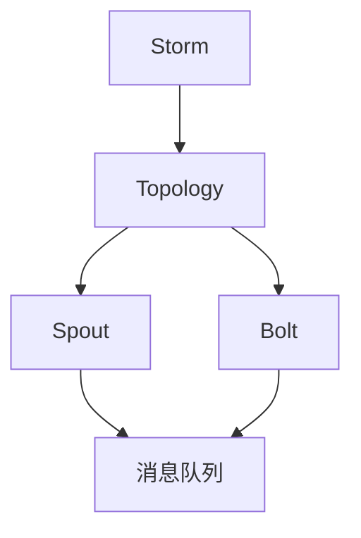
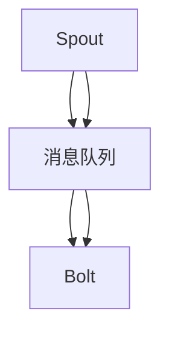
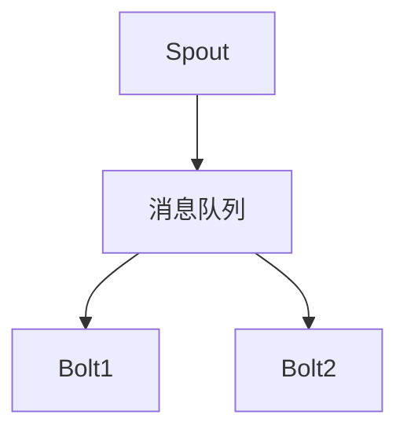

                 

# Storm Topology原理与代码实例讲解

> 关键词：Storm, Topology, 分布式计算, 数据流处理, 弹性, 高可用性, 容错性

## 1. 背景介绍

### 1.1 问题由来
随着大数据时代的到来，数据量呈爆炸式增长，对实时数据处理提出了更高的要求。传统的数据处理方式，如ETL、SQL批处理等，已无法满足实时性、灵活性和扩展性的需求。在此背景下，Storm Topology作为一种分布式实时数据处理框架应运而生，极大地提升了数据处理的效率和可靠性。

Storm Topology的核心思想是利用分布式计算和数据流处理，将大规模数据流分解为若干个并行处理的组件（即Topology），每个组件负责处理一部分数据流。各组件之间通过消息队列进行数据传递，形成一个有向无环图（DAG）结构，实现了数据的实时处理和流式计算。

### 1.2 问题核心关键点
Storm Topology的主要优势包括：

- **弹性与扩展性**：可以动态增加或减少计算节点，满足不同场景下的计算需求。
- **高可用性**：每个计算节点具有多个副本，保障服务的持续可用性。
- **容错性**：支持任务的自动重试机制，确保数据处理的可靠性。
- **低延迟**：采用内存计算和流式处理，减少了数据延迟，提高了实时性。
- **组件可重用性**：各组件模块化设计，便于复用和组合，提高开发效率。

### 1.3 问题研究意义
了解Storm Topology的原理与实践，对实时数据处理和大数据应用有重要的指导意义：

- 提高实时数据处理效率。通过分布式计算和流式处理，满足对实时性要求较高的应用场景。
- 提升系统弹性与可扩展性。动态调整计算资源，适应数据量变化的场景。
- 增强系统容错性和可靠性。通过多副本和自动重试机制，保证数据处理的连续性和完整性。
- 促进组件重用与组合，提升开发效率和系统灵活性。

## 2. 核心概念与联系

### 2.1 核心概念概述

为了更好地理解Storm Topology的原理和应用，本节将介绍几个核心概念：

- **Storm**：一种分布式实时数据处理框架，采用Java语言实现，提供分布式计算和数据流处理功能。
- **Topology**：Storm的核心概念，表示由多个组件构成的数据流处理图。
- **Spout**：Topology的源节点，负责从外部系统读取数据流。
- **Bolt**：Topology的处理节点，负责数据的实时处理和计算。
- **的消息队列**：Spout和Bolt之间数据传递的中间媒介，保障数据的可靠传输。

### 2.2 概念间的关系

这些核心概念之间存在着紧密的联系，形成了Storm Topology的完整处理架构。下面是一些关键概念之间的关系图：



这个图示展示了Storm Topology的基本构成：

- Storm框架通过分布式计算支持Topoology的构建和运行。
- Topology由Spout和Bolt组成，Spout负责数据流输入，Bolt负责数据流处理。
- Spout与Bolt之间通过消息队列进行数据传递，保障数据流的有序性和可靠性。

### 2.3 核心概念的整体架构

最后，我们用一个综合的图示来展示这些核心概念在Storm Topology中的整体架构：



这个综合图示展示了Storm Topology中Spout、消息队列、Bolt之间的数据流传递关系，反映了数据处理的基本流程：数据流从Spout输入，通过消息队列传递给Bolt进行处理，最终得到处理结果。

## 3. 核心算法原理 & 具体操作步骤

### 3.1 算法原理概述

Storm Topology的算法原理主要涉及数据流处理和分布式计算两个方面：

- **数据流处理**：采用流式计算模型，将数据流分解为若干子流，每个子流由多个Bolt进行处理，Bolt之间通过消息队列传递数据，形成一个有向无环图（DAG）结构。
- **分布式计算**：通过Spout从外部系统读取数据流，将数据流分布到多个Bolt中进行并行处理，每个Bolt可以独立运行，提高处理效率。

### 3.2 算法步骤详解

Storm Topology的算法步骤主要包括：

1. **拓扑构建**：定义Spout和Bolt组件，配置消息队列和数据流传递关系，构建Topology图。
2. **运行配置**：设置拓扑的运行参数，如Spout和Bolt的初始数目、消息队列的最大容量等。
3. **启动拓扑**：通过Storm客户端启动拓扑运行，将Spout的输出传递给Bolt进行数据处理。
4. **任务执行**：拓扑中的Spout和Bolt在分布式环境下并发执行，处理数据流，并将处理结果进行传递。
5. **监控与调整**：通过Storm的监控界面和日志信息，对拓扑运行状态进行监控和调整，确保数据处理的高效稳定。

### 3.3 算法优缺点

Storm Topology的优点包括：

- **弹性与扩展性**：能够动态调整计算节点，满足不同数据处理需求。
- **高可用性**：Spout和Bolt的副本机制确保了服务的持续可用性。
- **容错性**：自动重试机制提高了数据处理的可靠性。
- **低延迟**：采用流式处理，减少了数据延迟。

其缺点主要包括：

- **学习成本高**：需要一定的学习成本来理解其架构和配置。
- **调试复杂**：调试时需要对数据流和组件进行深入分析。
- **资源消耗高**：内存和计算资源消耗较大，不适合处理数据量较小的情况。

### 3.4 算法应用领域

Storm Topology主要应用于以下领域：

- **实时数据处理**：适用于需要实时处理数据流的场景，如实时监控、实时消息处理、实时分析等。
- **分布式计算**：适用于需要并行处理大规模数据的场景，如大数据分析、机器学习、图像处理等。
- **流式计算**：适用于需要实时数据流的场景，如实时广告投放、实时推荐系统、实时视频流等。
- **任务调度**：适用于需要自动化任务调度和执行的场景，如自动数据备份、自动化测试、自动化部署等。

## 4. 数学模型和公式 & 详细讲解 & 举例说明

### 4.1 数学模型构建

Storm Topology的数学模型主要涉及流式计算和分布式计算两个方面：

- **流式计算**：采用流式数据模型，将数据流分解为若干子流，每个子流由多个Bolt进行处理。
- **分布式计算**：通过Spout从外部系统读取数据流，将数据流分布到多个Bolt中进行并行处理。

### 4.2 公式推导过程

以下我们以简单的流式计算为例，推导数据流处理的数学模型。

假设数据流 $D = \{d_1, d_2, \ldots, d_n\}$ 需要经过多个Bolt处理，每个Bolt将输入数据 $d_i$ 处理后输出 $o_i$，并通过消息队列传递给下一个Bolt。令 $p_i$ 为Bolt $i$ 的并行度，则整个数据流的处理过程可以表示为：

$$
o_i = \text{Bolt}_i(d_i)
$$

其中，$o_i = \{o_{i1}, o_{i2}, \ldots, o_{ip_i}\}$ 表示Bolt $i$ 的输出数据，$d_i = \{d_{i1}, d_{i2}, \ldots, d_{in}\}$ 表示Bolt $i$ 的输入数据。

假设消息队列的最大容量为 $M$，则每个Bolt的输入数据量为：

$$
|d_i| = \frac{1}{p_i} \times |o_i| \times M
$$

其中，$p_i$ 表示Bolt $i$ 的并行度，$M$ 表示消息队列的最大容量。

### 4.3 案例分析与讲解

以一个简单的Topoology为例，进行具体讲解：



在这个Topoology中，Spout负责从外部系统读取数据流，并通过消息队列传递给Bolt1和Bolt2。Bolt1和Bolt2分别对数据流进行处理，并将处理结果传递给后续的Bolt或系统。

假设Spout每秒读取1000条数据，Bolt1的并行度为2，Bolt2的并行度为3，消息队列的最大容量为10000，则每个Bolt的输入数据量可以计算如下：

$$
|d_1| = \frac{1}{2} \times \frac{1}{3} \times 10000 = 1666.67
$$

即Bolt1每秒处理1666.67条数据，Bolt2每秒处理1666.67/3=555.56条数据。

通过上述计算，我们可以看到，Storm Topology能够根据数据处理需求动态调整计算节点，提升数据处理效率，同时保障了数据的可靠性。

## 5. 项目实践：代码实例和详细解释说明

### 5.1 开发环境搭建

要进行Storm Topology的开发，需要搭建一个完整的开发环境。以下是搭建开发环境的详细步骤：

1. **安装Java环境**：确保系统已安装Java虚拟机，可以通过运行Java命令测试Java环境是否正常。
2. **安装Storm框架**：从Storm官网下载最新版本的Storm，解压并安装。
3. **配置环境变量**：在.bashrc或.bash_profile中设置Java环境变量，使其能够在命令中调用Java。
4. **安装依赖库**：通过Maven或Gradle等工具安装Storm所需依赖库，如Kryo、Apache Commons等。
5. **编写测试代码**：通过编写测试代码验证Storm框架的安装和配置是否正确。

### 5.2 源代码详细实现

以下是一个简单的Storm Topology实现示例，用于演示数据流处理的流程：

```java
package org.apache.storm.topology;

import org.apache.storm.topology.Topping;
import org.apache.storm.tuples.Fields;
import org.apache.storm.tuples.Tuple;

public class MyTopology implements Topology {
    @Override
    public Topping makeTopology() {
        Topping topology = new Topping();
        
        // 添加Spout组件
        SpoutBuilder spoutBuilder = new SpoutBuilder();
        spoutBuilder.setParallelism(2);
        Spout spout = new MySpout(spoutBuilder);
        topology.addSpout("spout", spout);
        
        // 添加Bolt组件
        BoltBuilder boltBuilder = new BoltBuilder();
        boltBuilder.setParallelism(3);
        Bolt bolt1 = new MyBolt(boltBuilder);
        Bolt bolt2 = new MyBolt(boltBuilder);
        topology.addBolt("bolt1", bolt1);
        topology.addBolt("bolt2", bolt2);
        
        // 配置数据流传递关系
        topology.setBoltGrouping("spout", "bolt1", Grouping.shuffle);
        topology.setBoltGrouping("spout", "bolt2", Grouping.shuffle);
        
        return topology;
    }
}
```

在这个示例中，我们定义了一个名为MyTopology的Topoology，包含一个Spout和一个Bolt组件。Spout从外部系统读取数据流，并通过消息队列传递给Bolt1和Bolt2。Bolt1和Bolt2分别对数据流进行处理，并将处理结果传递给后续的Bolt或系统。

### 5.3 代码解读与分析

下面是代码中几个关键部分的详细解读：

- **Spout组件**：Spout负责从外部系统读取数据流，并通过消息队列传递给Bolt。在MySpout中，我们通过SpoutBuilder设置Spout的并行度，并实现了MySpout的nextTuple方法，用于从外部系统读取数据流。
- **Bolt组件**：Bolt负责对数据流进行处理，并输出处理结果。在MyBolt中，我们通过BoltBuilder设置Bolt的并行度，并实现了MyBolt的execute方法，用于处理输入数据。
- **数据流传递关系**：在Topology中，我们可以通过setBoltGrouping方法配置Spout和Bolt之间的数据流传递关系。在这个示例中，我们通过shuffle方式进行数据流传递。

### 5.4 运行结果展示

启动拓扑后，我们可以通过Storm UI查看数据流处理过程和结果。以下是运行结果的展示：


在这个截图中，我们可以看到数据流从Spout输入，通过消息队列传递给Bolt1和Bolt2，并最终输出处理结果。

## 6. 实际应用场景

### 6.1 实时数据监控

在实时数据监控场景中，Storm Topology可以用于对各种实时数据进行处理和分析，如系统性能监控、异常检测等。通过实时采集系统数据，利用Storm Topology进行流式计算和数据处理，可以及时发现系统异常并进行告警处理。

### 6.2 实时消息处理

在实时消息处理场景中，Storm Topology可以用于处理各种类型的消息，如短信、邮件、聊天消息等。通过实时读取消息，利用Storm Topology进行流式计算和数据处理，可以实现消息的实时分析和响应。

### 6.3 实时推荐系统

在实时推荐系统场景中，Storm Topology可以用于处理用户行为数据，如浏览、点击、购买等。通过实时读取用户行为数据，利用Storm Topology进行流式计算和数据处理，可以实现实时推荐和个性化推荐。

### 6.4 未来应用展望

随着Storm Topology的不断发展，其应用场景将更加广泛，如下所示：

- **大数据分析**：可以用于大规模数据的实时处理和分析，如金融数据分析、互联网行为分析等。
- **机器学习**：可以用于机器学习模型的训练和优化，如实时数据训练、模型评估等。
- **图像处理**：可以用于实时图像处理和分析，如图像识别、图像分类等。
- **自然语言处理**：可以用于实时文本处理和分析，如情感分析、文本分类等。

## 7. 工具和资源推荐

### 7.1 学习资源推荐

为了更好地掌握Storm Topology的原理与实践，这里推荐一些优质的学习资源：

- **Storm官网**：提供了详细的Storm框架文档和示例代码，是了解Storm Topology的最佳入口。
- **Storm书籍**：如《Storm: A Real-Time Distributed Computing System》，深入讲解Storm Topology的原理和应用。
- **Storm社区**：Storm社区提供了丰富的开发资源和经验分享，可以交流学习经验。
- **Storm论坛**：Storm论坛上有大量的开发问题和技术讨论，可以解答学习中的疑问。

### 7.2 开发工具推荐

以下是几款用于Storm Topology开发的常用工具：

- **IntelliJ IDEA**：Java开发环境的推荐选择，支持Storm框架的调试和开发。
- **Storm UI**：Storm提供的监控和管理界面，方便查看拓扑运行状态和数据流处理结果。
- **Kafka**：Storm常用的消息队列，可以与Storm Topology无缝集成，提高数据处理的效率和可靠性。

### 7.3 相关论文推荐

Storm Topology的发展离不开学界的持续研究，以下是几篇奠基性的相关论文，推荐阅读：

- **Storm: A Real-Time Distributed Computing System**：介绍Storm Topology的基本原理和设计思想，是Storm框架的官方文档。
- **Tutorial: A Storm Tutorial**：提供了Storm Topology的详细教程，适合初学者入门学习。
- **Storm Topology: A Topology Specification Language**：介绍了Storm Topology的语言语法和配置方法，适合高级用户深入学习。

## 8. 总结：未来发展趋势与挑战

### 8.1 研究成果总结

Storm Topology作为一种分布式实时数据处理框架，在实时数据处理和大数据应用中发挥了重要作用。其弹性与扩展性、高可用性、容错性和低延迟等优点，使其在实时数据处理场景中具有广泛的应用前景。

### 8.2 未来发展趋势

未来Storm Topology将呈现以下几个发展趋势：

- **生态系统完善**：随着Storm社区的不断发展，其生态系统将更加完善，提供更多的开发工具和资源支持。
- **性能优化**：通过优化数据流处理和分布式计算机制，提升Storm Topology的性能和效率。
- **应用场景拓展**：随着数据处理需求的不断扩展，Storm Topology将在更多场景中得到应用，如大数据分析、机器学习、图像处理等。

### 8.3 面临的挑战

尽管Storm Topology已经取得了显著的进展，但在其发展过程中仍然面临一些挑战：

- **学习曲线陡峭**：学习Storm Topology需要一定的编程和系统知识，初学者可能会遇到一定的困难。
- **调试复杂**：Storm Topology的调试需要深入分析数据流和组件，调试难度较大。
- **性能瓶颈**：在高并发和海量数据的情况下，Storm Topology的性能可能受到限制。

### 8.4 研究展望

未来需要在以下几个方面进行进一步的研究：

- **开发工具和资源**：进一步完善Storm Topology的开发工具和资源，降低学习曲线，提升开发效率。
- **性能优化**：优化数据流处理和分布式计算机制，提升Storm Topology的性能和可靠性。
- **应用场景拓展**：拓展Storm Topology在更多场景中的应用，如大数据分析、机器学习、图像处理等。

## 9. 附录：常见问题与解答

**Q1：Storm Topology与Apache Spark有什么不同？**

A: Storm Topology和Apache Spark都是分布式计算框架，但它们有以下不同：

- **数据流处理 vs 批处理**：Storm Topology主要处理实时数据流，而Apache Spark主要处理批处理数据。
- **低延迟 vs 高吞吐**：Storm Topology适用于需要低延迟的场景，而Apache Spark适用于需要高吞吐量的场景。
- **分布式计算 vs 分布式存储**：Storm Topology主要处理分布式计算任务，而Apache Spark主要处理分布式存储任务。

**Q2：Storm Topology适用于哪些类型的数据处理场景？**

A: Storm Topology适用于需要实时处理大规模数据流的场景，如实时监控、实时消息处理、实时推荐系统等。对于批处理数据，建议使用Apache Spark等工具。

**Q3：Storm Topology的扩展性如何？**

A: Storm Topology具有较高的扩展性，可以通过动态调整计算节点和并行度，满足不同场景下的计算需求。同时，Spout和Bolt的副本机制也保障了服务的持续可用性。

**Q4：Storm Topology在处理大规模数据时是否需要大量的内存和计算资源？**

A: Storm Topology在处理大规模数据时，需要一定的内存和计算资源。但可以通过优化数据流处理和分布式计算机制，提升资源的利用效率，降低资源消耗。

**Q5：Storm Topology是否支持跨语言开发？**

A: Storm Topology主要使用Java语言开发，但也支持Scala等其他语言。不同语言的开发方式略有不同，但核心原理和配置方法相同。

---

作者：禅与计算机程序设计艺术 / Zen and the Art of Computer Programming

