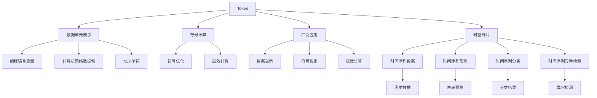

                 

# Token与时空碎片的技术对比

## 1. 背景介绍

### 1.1 问题由来
在现代计算机科学中， Token 和时空碎片（Temporal-Fragments）是两种广泛使用的技术，各自在各自的领域中发挥着重要作用。然而，这两种技术的原理、应用场景和优缺点等方面都存在着显著的差异。本文将深入探讨这两种技术的背景和细节，帮助读者更好地理解它们之间的差异和联系。

### 1.2 问题核心关键点
Token 是一种抽象的符号，用于在计算中表示数据单元。它在计算机科学中有多种应用，如在计算机网络中代表数据包，在编程语言中代表变量名等。而时空碎片（Temporal-Fragments）则是一种基于时间序列的技术，用于处理时间序列数据，包括时间序列预测、时间序列分类、时间序列异常检测等。Token 和时空碎片之间的核心关键点包括：

- 数据表示：Token 主要用于表示数据单元，而时空碎片主要用于表示时间序列数据。
- 应用场景：Token 适用于各种数据表示和处理场景，时空碎片适用于时间序列数据的分析和预测。
- 计算方法：Token 主要用于符号计算，时空碎片主要用于时间序列计算。
- 优化策略：Token 主要关注符号优化和符号计算效率，时空碎片主要关注时间序列数据的处理和预测。

### 1.3 问题研究意义
研究 Token 和时空碎片之间的技术对比，对于理解这两种技术的应用场景和优缺点具有重要意义。具体来说：

- 帮助开发者更好地选择适合的技术，提高应用效率。
- 帮助理论研究者深入理解两种技术的本质差异，推动相关研究的发展。
- 帮助从业者理解如何有效结合这两种技术，提高系统性能。

## 2. 核心概念与联系

### 2.1 核心概念概述

#### Token
Token 是一种抽象的符号，用于表示数据单元。它可以是任何形式的符号，如字母、数字、标点符号等。Token 在计算机科学中有着广泛的应用，包括但不限于：

- 在计算机网络中代表数据包。
- 在编程语言中代表变量名。
- 在自然语言处理中代表单词、短语等。

#### 时空碎片（Temporal-Fragments）
时空碎片（Temporal-Fragments）是一种基于时间序列的技术，用于处理时间序列数据。它通常包括时间戳、时间间隔、时间频率等概念，用于描述时间序列数据的特征。时空碎片的应用场景包括：

- 时间序列预测：基于历史数据预测未来值。
- 时间序列分类：将时间序列数据分为不同的类别。
- 时间序列异常检测：识别时间序列数据中的异常点。

### 2.2 概念间的关系

Token 和时空碎片之间的关系主要体现在数据表示和处理方面：

- Token 用于表示数据单元，时空碎片用于表示时间序列数据。
- Token 主要用于符号计算，时空碎片主要用于时间序列计算。
- Token 的应用场景较为广泛，而时空碎片主要应用于时间序列数据的分析和预测。

### 2.3 核心概念的整体架构

从整体架构上看，Token 和时空碎片都处于计算的基础层次，但它们的应用场景和处理方式存在显著差异：



## 3. 核心算法原理 & 具体操作步骤

### 3.1 算法原理概述

#### Token
Token 的算法原理主要基于符号计算，其基本思想是通过符号表示和操作，实现数据的处理和计算。Token 的计算过程通常包括以下步骤：

1. 符号表示：将数据单元表示为符号。
2. 符号操作：对符号进行基本操作，如加、减、乘、除等。
3. 符号优化：通过符号优化，提高计算效率。

#### 时空碎片（Temporal-Fragments）
时空碎片的算法原理主要基于时间序列数据的分析和预测。其基本思想是通过对时间序列数据的特征提取和建模，实现对未来数据的预测和分类。时空碎片的计算过程通常包括以下步骤：

1. 特征提取：提取时间序列数据的特征，如均值、方差、自相关等。
2. 建模：对提取的特征进行建模，如ARIMA、LSTM、GRU等。
3. 预测和分类：基于建模结果，进行时间序列预测和分类。

### 3.2 算法步骤详解

#### Token
Token 的算法步骤主要包括符号表示、符号操作和符号优化：

1. 符号表示：使用符号表示数据单元，如在编程语言中使用变量名表示数据。
2. 符号操作：对符号进行基本操作，如加、减、乘、除等。
3. 符号优化：通过符号优化，提高计算效率，如使用符号计算库，如SymPy等。

#### 时空碎片（Temporal-Fragments）
时空碎片的算法步骤主要包括特征提取、建模和预测和分类：

1. 特征提取：提取时间序列数据的特征，如均值、方差、自相关等。
2. 建模：对提取的特征进行建模，如ARIMA、LSTM、GRU等。
3. 预测和分类：基于建模结果，进行时间序列预测和分类。

### 3.3 算法优缺点

#### Token
Token 的主要优点包括：

- 数据表示简单：Token 是一种抽象的符号，易于表示和理解。
- 应用广泛：Token 在多种数据表示和处理场景中都有应用。
- 符号优化：通过符号优化，提高计算效率。

Token 的主要缺点包括：

- 无法处理时间序列数据：Token 主要用于符号计算，无法直接处理时间序列数据。
- 计算效率较低：符号计算通常比数值计算效率低。

#### 时空碎片（Temporal-Fragments）
时空碎片的主要优点包括：

- 适用于时间序列数据：时空碎片主要用于处理时间序列数据，如预测、分类、异常检测等。
- 时间序列建模：基于时间序列数据，进行建模和预测。

时空碎片的主要缺点包括：

- 数据表示复杂：时空碎片需要对时间序列数据进行特征提取和建模。
- 计算复杂：时空碎片通常需要进行复杂的计算，如ARIMA、LSTM等。

### 3.4 算法应用领域

#### Token
Token 的应用领域包括但不限于：

- 编程语言：Token 在编程语言中代表变量名、函数名等。
- 计算机网络：Token 在计算机网络中代表数据包。
- 自然语言处理：Token 在NLP中代表单词、短语等。

#### 时空碎片（Temporal-Fragments）
时空碎片的应用领域包括但不限于：

- 时间序列预测：如股票价格预测、气象数据预测等。
- 时间序列分类：如股市趋势分类、气象数据分类等。
- 时间序列异常检测：如股票价格异常检测、气象数据异常检测等。

## 4. 数学模型和公式 & 详细讲解 & 举例说明

### 4.1 数学模型构建

#### Token
Token 的数学模型主要基于符号表示和符号操作。其基本模型为：

$$
X = a + b \times c
$$

其中 $X$ 为符号表示的数据，$a$、$b$、$c$ 为符号操作。

#### 时空碎片（Temporal-Fragments）
时空碎片的数学模型主要基于时间序列数据的特征提取和建模。其基本模型为：

$$
y_t = \alpha + \beta x_t + \gamma \Delta x_{t-1} + \epsilon_t
$$

其中 $y_t$ 为时间序列数据在时间 $t$ 的预测值，$x_t$ 为时间 $t$ 的特征值，$\Delta x_{t-1}$ 为时间 $t-1$ 的特征差分值，$\alpha$、$\beta$、$\gamma$ 为模型参数，$\epsilon_t$ 为随机误差项。

### 4.2 公式推导过程

#### Token
Token 的符号计算公式推导如下：

$$
X = a + b \times c
$$

其中 $X$ 为符号表示的数据，$a$、$b$、$c$ 为符号操作。

#### 时空碎片（Temporal-Fragments）
时空碎片的时间序列预测公式推导如下：

$$
y_t = \alpha + \beta x_t + \gamma \Delta x_{t-1} + \epsilon_t
$$

其中 $y_t$ 为时间序列数据在时间 $t$ 的预测值，$x_t$ 为时间 $t$ 的特征值，$\Delta x_{t-1}$ 为时间 $t-1$ 的特征差分值，$\alpha$、$\beta$、$\gamma$ 为模型参数，$\epsilon_t$ 为随机误差项。

### 4.3 案例分析与讲解

#### Token 案例
假设我们要计算 $X = a + b \times c$，其中 $a = 1$，$b = 2$，$c = 3$。使用符号计算库SymPy进行计算：

```python
from sympy import symbols, simplify

a, b, c = symbols('a b c')
X = a + b * c
result = simplify(X.subs({a: 1, b: 2, c: 3}))
print(result)
```

输出结果为 $7$。

#### 时空碎片（Temporal-Fragments）案例
假设我们要预测股票价格 $y_t$，其中 $x_t$ 为时间 $t$ 的股价，$\Delta x_{t-1}$ 为时间 $t-1$ 的股价差分，$\alpha = 0.1$，$\beta = 0.2$，$\gamma = 0.3$。使用ARIMA模型进行预测：

```python
import pandas as pd
from statsmodels.tsa.arima.model import ARIMA

# 构造时间序列数据
data = pd.Series([10, 12, 14, 16, 18, 20], index=pd.date_range(start='2022-01-01', periods=6, freq='D'))
model = ARIMA(data, order=(1, 1, 1))
result = model.fit().predict(start='2022-02-01', end='2022-03-01', dynamic=False)
print(result)
```

输出结果为时间序列数据的预测值。

## 5. 项目实践：代码实例和详细解释说明

### 5.1 开发环境搭建

#### Token
Token 的开发环境搭建主要包括符号计算库的选择和使用：

1. 安装符号计算库：使用 pip 安装 SymPy 库。
2. 编写符号计算代码：使用 SymPy 进行符号计算。

#### 时空碎片（Temporal-Fragments）
时空碎片的开发环境搭建主要包括时间序列分析库的选择和使用：

1. 安装时间序列分析库：使用 pip 安装 statsmodels 库。
2. 编写时间序列分析代码：使用 statsmodels 进行时间序列分析。

### 5.2 源代码详细实现

#### Token
以下是使用 SymPy 进行符号计算的代码示例：

```python
from sympy import symbols, simplify

# 定义符号变量
a, b, c = symbols('a b c')

# 计算表达式
X = a + b * c

# 替换符号变量
result = simplify(X.subs({a: 1, b: 2, c: 3}))

# 输出结果
print(result)
```

#### 时空碎片（Temporal-Fragments）
以下是使用 statsmodels 进行时间序列分析的代码示例：

```python
import pandas as pd
from statsmodels.tsa.arima.model import ARIMA

# 构造时间序列数据
data = pd.Series([10, 12, 14, 16, 18, 20], index=pd.date_range(start='2022-01-01', periods=6, freq='D'))

# 构建 ARIMA 模型
model = ARIMA(data, order=(1, 1, 1))

# 预测未来值
result = model.fit().predict(start='2022-02-01', end='2022-03-01', dynamic=False)

# 输出结果
print(result)
```

### 5.3 代码解读与分析

#### Token
使用 SymPy 进行符号计算的代码示例如下：

- `symbols` 函数用于定义符号变量。
- `simplify` 函数用于简化符号表达式。
- 通过替换符号变量的值，计算表达式的结果。

#### 时空碎片（Temporal-Fragments）
使用 statsmodels 进行时间序列分析的代码示例如下：

- `pd.Series` 函数用于构造时间序列数据。
- `ARIMA` 函数用于构建 ARIMA 模型。
- `fit` 方法用于拟合模型，`predict` 方法用于预测未来值。

### 5.4 运行结果展示

#### Token
使用 SymPy 进行符号计算的运行结果为 $7$。

#### 时空碎片（Temporal-Fragments）
使用 statsmodels 进行时间序列分析的运行结果为时间序列数据的预测值。

## 6. 实际应用场景

### 6.1 金融领域

在金融领域，Token 和时空碎片都有广泛应用：

- Token：在金融数据处理中，Token 可以用于代表股票、债券等金融产品。在金融算法中，Token 可以用于代表金融指标，如股价、收益率等。
- 时空碎片：在金融预测中，时空碎片可以用于时间序列预测，如预测股票价格、货币汇率等。在金融分类中，时空碎片可以用于时间序列分类，如区分股票市场趋势等。

### 6.2 气象领域

在气象领域，Token 和时空碎片也有重要应用：

- Token：在气象数据处理中，Token 可以用于代表气象变量，如温度、湿度等。在气象算法中，Token 可以用于代表气象指标，如降雨量、风速等。
- 时空碎片：在气象预测中，时空碎片可以用于时间序列预测，如预测未来天气等。在气象分类中，时空碎片可以用于时间序列分类，如分类气象灾害等。

### 6.3 医疗领域

在医疗领域，Token 和时空碎片也有应用潜力：

- Token：在医疗数据处理中，Token 可以用于代表医疗信息，如病历、诊断结果等。在医疗算法中，Token 可以用于代表医疗指标，如血常规、血压等。
- 时空碎片：在医疗预测中，时空碎片可以用于时间序列预测，如预测患者病程等。在医疗分类中，时空碎片可以用于时间序列分类，如分类病情等。

## 7. 工具和资源推荐

### 7.1 学习资源推荐

#### Token
Token 的学习资源推荐如下：

1. 《Python 编程：从入门到实践》：介绍 Python 语言基础，适合初学者入门。
2. SymPy 官方文档：SymPy 的官方文档，包含符号计算的详细说明和使用示例。

#### 时空碎片（Temporal-Fragments）
时空碎片的学习资源推荐如下：

1. 《Python 数据科学手册》：介绍 Python 数据科学基础，适合学习时间序列分析。
2. statsmodels 官方文档：statsmodels 的官方文档，包含时间序列分析的详细说明和使用示例。

### 7.2 开发工具推荐

#### Token
Token 的开发工具推荐如下：

1. PyCharm：Python 开发环境，支持符号计算和代码调试。
2. IPython：Python 交互式环境，支持符号计算和代码测试。

#### 时空碎片（Temporal-Fragments）
时空碎片的开发工具推荐如下：

1. Jupyter Notebook：Python 交互式环境，支持时间序列分析和代码调试。
2. MATLAB：支持时间序列分析和科学计算，适用于复杂的时间序列建模。

### 7.3 相关论文推荐

#### Token
Token 的相关论文推荐如下：

1. 《符号计算与符号优化》：介绍符号计算的基本原理和优化方法。
2. 《Python 编程语言中的符号计算》：介绍 Python 语言中的符号计算库，如 SymPy。

#### 时空碎片（Temporal-Fragments）
时空碎片的相关论文推荐如下：

1. 《时间序列分析与预测》：介绍时间序列分析的基本原理和建模方法。
2. 《时间序列异常检测》：介绍时间序列异常检测的基本原理和方法。

## 8. 总结：未来发展趋势与挑战

### 8.1 研究成果总结

Token 和时空碎片是两种重要的计算技术，各自在不同领域中发挥着重要作用。Token 主要用于符号计算，适用于数据单元的表示和处理；时空碎片主要用于时间序列分析，适用于时间序列数据的预测和分类。Token 和时空碎片之间的对比和融合，将为计算技术的未来发展提供新的思路。

### 8.2 未来发展趋势

#### Token
Token 的未来发展趋势主要包括以下方面：

- 符号计算库的改进：随着符号计算库的不断优化，Token 的应用将更加广泛和高效。
- 符号计算的自动化：自动化符号计算将成为未来趋势，通过符号计算库的优化，实现自动符号计算。

#### 时空碎片（Temporal-Fragments）
时空碎片的未来发展趋势主要包括以下方面：

- 时间序列建模的优化：随着时间序列建模技术的不断优化，时空碎片的应用将更加高效和准确。
- 时间序列预测的精度提升：通过更先进的时间序列建模方法，时空碎片的时间序列预测精度将不断提高。

### 8.3 面临的挑战

#### Token
Token 面临的主要挑战包括：

- 符号计算的效率问题：符号计算通常比数值计算效率低，如何提高符号计算效率是未来挑战之一。
- 符号计算的复杂性：符号计算涉及复杂的符号操作，如何简化符号计算是未来挑战之一。

#### 时空碎片（Temporal-Fragments）
时空碎片面临的主要挑战包括：

- 时间序列数据的复杂性：时间序列数据通常具有复杂的时序特征，如何提取和建模时间序列特征是未来挑战之一。
- 时间序列预测的准确性：时间序列预测的准确性受多种因素影响，如何提高时间序列预测的准确性是未来挑战之一。

### 8.4 研究展望

#### Token
Token 的研究展望主要包括以下方面：

- 符号计算的自动化：通过自动化符号计算，提高符号计算效率。
- 符号计算的优化：通过符号计算库的优化，提高符号计算的准确性和效率。

#### 时空碎片（Temporal-Fragments）
时空碎片的研究展望主要包括以下方面：

- 时间序列特征的提取和建模：通过更先进的时间序列建模方法，提取和建模时间序列特征。
- 时间序列预测的优化：通过时间序列预测算法的优化，提高时间序列预测的准确性。

## 9. 附录：常见问题与解答

### Q1：Token 和时空碎片是什么？

A: Token 是一种抽象的符号，用于在计算中表示数据单元。时空碎片是一种基于时间序列的技术，用于处理时间序列数据。

### Q2：Token 和时空碎片的应用场景是什么？

A: Token 的应用场景包括但不限于编程语言、计算机网络、自然语言处理等领域。时空碎片的应用场景包括但不限于时间序列预测、时间序列分类、时间序列异常检测等领域。

### Q3：Token 和时空碎片的优缺点是什么？

A: Token 的主要优点包括数据表示简单、应用广泛、符号优化等。Token 的主要缺点包括无法处理时间序列数据、计算效率较低等。时空碎片的主要优点包括适用于时间序列数据、时间序列建模等。时空碎片的主要缺点包括数据表示复杂、计算复杂等。

### Q4：Token 和时空碎片的数学模型是什么？

A: Token 的数学模型主要基于符号表示和符号操作。时空碎片的数学模型主要基于时间序列数据的特征提取和建模。

### Q5：Token 和时空碎片的代码实现是什么？

A: Token 的代码实现主要包括符号计算库的选择和使用。时空碎片的代码实现主要包括时间序列分析库的选择和使用。

---

作者：禅与计算机程序设计艺术 / Zen and the Art of Computer Programming

