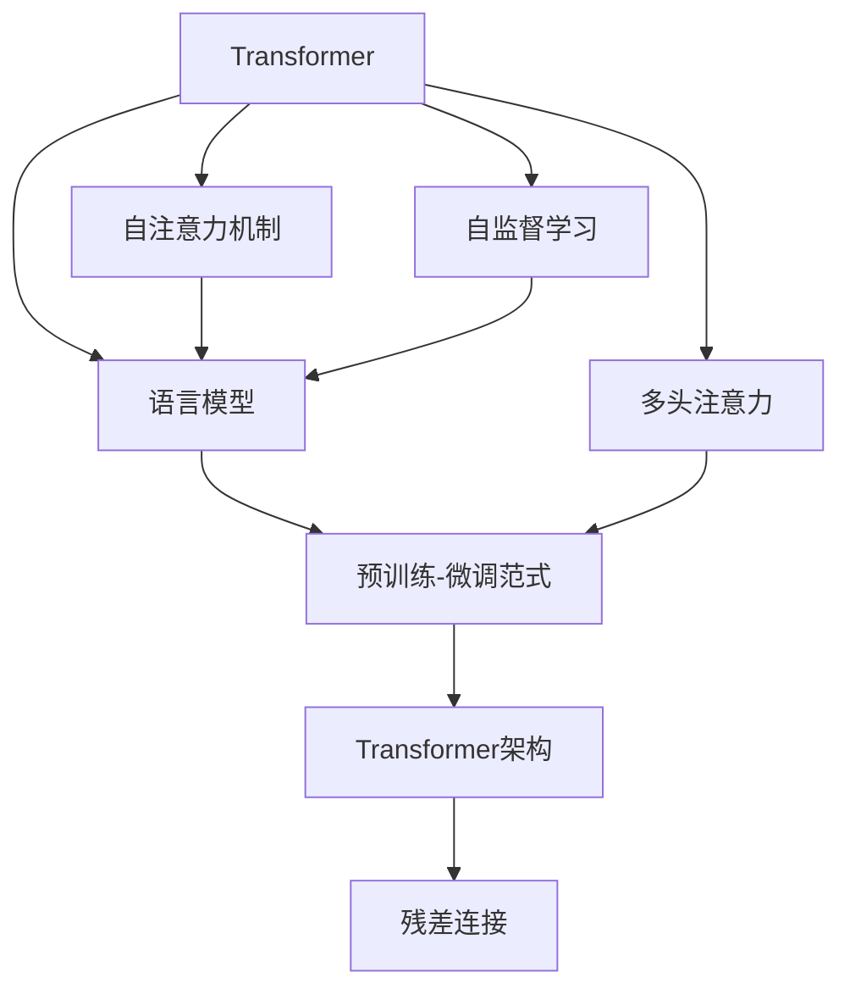
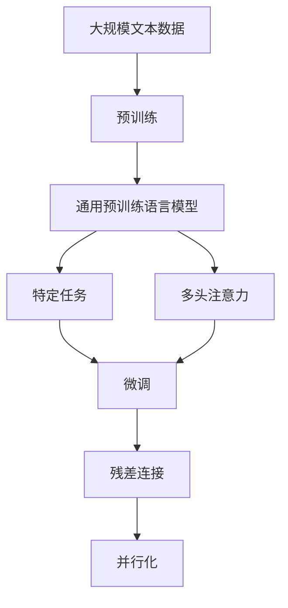

                 

# Transformer大模型实战 BERT 的基本理念

> 关键词：Transformer, BERT, 自然语言处理(NLP), 自注意力机制(Self-Attention), 语言模型, 自监督学习(Self-Supervised Learning)

## 1. 背景介绍

### 1.1 问题由来

随着深度学习技术的发展，自然语言处理(Natural Language Processing, NLP)领域涌现出了一系列基于深度学习的模型，如卷积神经网络(CNN)、循环神经网络(RNN)、长短期记忆网络(LSTM)等，它们在机器翻译、情感分析、语音识别等任务上取得了显著的进展。然而，这些传统的基于串行结构的网络在处理长距离依赖关系时，往往表现不佳，且难以并行化，难以满足大规模数据和大模型的训练需求。

Transformer模型由谷歌在2017年提出，以自注意力机制为基础，大幅提升了模型处理长距离依赖的能力，使得大模型在NLP任务上取得了前所未有的表现。其中，BERT模型作为Transformer的一种变体，其训练过程完全基于自监督学习，无需标注数据，大大降低了数据标注成本，成为NLP领域的一项里程碑式进展。本文将深入探讨Transformer和BERT的基本理念，并介绍其应用实践。

### 1.2 问题核心关键点

Transformer和BERT的核心思想可以概括为以下几点：

- **自注意力机制**：Transformer模型通过自注意力机制来捕捉输入序列中每个位置与其他位置的相关性，从而在无需循环结构的情况下，有效地处理长距离依赖关系。
- **自监督学习**：BERT模型采用自监督学习的方式进行预训练，通过掩码语言模型、预测下一句等任务，学习到丰富的语言知识，无需标注数据。
- **预训练-微调范式**：预训练语言模型通常在大规模无标签文本数据上进行训练，通过微调技术，使其适应特定任务，大大提升了模型的泛化能力。
- **Transformer架构**：Transformer模型采用了多头注意力机制和残差连接，在保证高效并行化的同时，提升了模型的表达能力。

这些核心思想构成了Transformer和BERT的设计基石，极大地推动了NLP技术的发展和应用。

## 2. 核心概念与联系

### 2.1 核心概念概述

为了更好地理解Transformer和BERT模型，本节将介绍几个关键概念：

- **Transformer**：一种基于自注意力机制的深度学习模型，广泛应用于机器翻译、文本生成、文本分类等NLP任务中。
- **BERT**：一种基于Transformer的预训练语言模型，通过掩码语言模型、预测下一句等自监督任务，学习到丰富的语言知识。
- **自注意力机制**：一种基于注意力机制的计算方式，通过计算输入序列中每个位置与其他位置的相关性，实现信息的有效传递和交互。
- **语言模型**：一种用于评估文本序列的概率分布的模型，通常采用最大似然估计方法进行训练。
- **自监督学习**：一种无需标注数据的监督学习方式，通过设计一些无需标注的任务，从无标注数据中学习到有用的特征。

这些概念之间的逻辑关系可以通过以下Mermaid流程图来展示：



这个流程图展示了大模型微调的完整生态系统：

1. 基于自注意力机制的Transformer模型。
2. 通过自监督学习，BERT模型从大规模无标签文本数据中学习到丰富的语言知识。
3. 预训练-微调范式，使得通用预训练模型能够适应特定任务。
4. 多头注意力机制和残差连接，保证Transformer的高效并行化和表达能力。

### 2.2 概念间的关系

这些核心概念之间存在着紧密的联系，形成了大语言模型的学习框架。下面通过几个Mermaid流程图来展示这些概念之间的关系。

#### 2.2.1 自注意力机制与Transformer


自注意力机制是Transformer模型的核心，它通过计算输入序列中每个位置与其他位置的相关性，实现信息的有效传递和交互。Transformer模型通过多头自注意力机制，进一步提升了模型的表达能力。

#### 2.2.2 BERT模型的自监督学习


BERT模型通过掩码语言模型和预测下一句等自监督任务，学习到丰富的语言知识，无需标注数据。这种自监督学习方法大大降低了数据标注成本，使得BERT模型能够在许多NLP任务上取得优异的表现。

#### 2.2.3 预训练-微调范式


预训练-微调范式是通用预训练模型的重要组成部分，通过在大规模无标签文本数据上进行预训练，学习到丰富的语言知识，然后在特定任务上进行微调，提升模型在该任务上的性能。BERT模型即通过预训练-微调范式，使其在各种下游任务上都能取得优异的表现。

### 2.3 核心概念的整体架构

最后，我们用一个综合的流程图来展示这些核心概念在大模型微调过程中的整体架构：



这个综合流程图展示了从预训练到微调，再到并行化的完整过程。通用预训练语言模型通过自注意力机制、语言模型等技术，学习到丰富的语言知识，然后在特定任务上进行微调，提升模型在该任务上的性能。同时，Transformer模型的高效并行化设计，使其能够在大型分布式系统中进行高效的训练和推理。

## 3. 核心算法原理 & 具体操作步骤
### 3.1 算法原理概述

Transformer模型基于自注意力机制，通过多头自注意力机制，捕捉输入序列中每个位置与其他位置的相关性。其计算过程可以简单地描述为以下几个步骤：

1. 将输入序列转换为位置编码向量，并嵌入模型中。
2. 通过多头自注意力机制，计算输入序列中每个位置与其他位置的相关性。
3. 对多头注意力机制的结果进行线性变换，得到每个位置的多维表示。
4. 对每个位置的表示进行全连接变换，得到最终输出。

BERT模型则是在Transformer模型的基础上，通过自监督学习的方式进行预训练，学习到丰富的语言知识。具体而言，BERT模型采用掩码语言模型和预测下一句等任务，从未标注数据中学习到语言的分布式表示。

### 3.2 算法步骤详解

下面以BERT模型的预训练为例，详细介绍其计算步骤。

**Step 1: 准备数据**

假设输入序列为 $\{x_1, x_2, \ldots, x_n\}$，目标是将该序列转换为分布式表示，用于后续的微调任务。

**Step 2: 嵌入与位置编码**

对输入序列进行嵌入，得到每个单词的向量表示，并通过位置编码向量调整每个位置的位置信息。位置编码向量是通过将整数序列映射到维度 $[0, 1, \ldots, d-1]$，然后进行一维傅里叶变换得到。位置编码向量的计算公式如下：

$$
\text{posEnc}(i) = sin(\frac{2\pi i}{10000^2}) + cos(\frac{2\pi i}{10000})
$$

其中 $i$ 表示位置，$d$ 表示位置编码向量的维度。

**Step 3: 掩码语言模型**

掩码语言模型的目标是在一个序列中预测缺失的单词。给定一个掩码序列 $\{m_1, m_2, \ldots, m_n\}$，其中 $m_i$ 表示位置 $i$ 的单词是否被掩码，如果被掩码则表示为 $m_i = 0$，否则表示为 $m_i = 1$。对于每个掩码位置，模型需要预测原始单词 $x_i$。

**Step 4: 预测下一句**

预测下一句任务的目标是判断两个句子是否为连续的句子。对于输入序列 $(x_1, x_2, \ldots, x_n)$ 和下一句 $y$，模型需要预测 $y$ 是否为 $x_n$ 的下一句。

**Step 5: 损失函数**

BERT模型的损失函数由掩码语言模型和预测下一句任务的损失函数组成。掩码语言模型的损失函数为交叉熵损失，预测下一句任务的损失函数为均方误差损失。具体损失函数的形式如下：

$$
\mathcal{L} = \alpha \cdot \mathcal{L}_{\text{masked}} + (1 - \alpha) \cdot \mathcal{L}_{\text{next}} 
$$

其中 $\alpha$ 为两个任务的重要性权重。

**Step 6: 微调**

在预训练完成后，通过微调技术，使得模型在特定任务上适应目标分布，提升模型在该任务上的性能。微调过程通常包括添加任务适配层、设置优化器、设置训练参数等步骤。

### 3.3 算法优缺点

Transformer和BERT模型的优点包括：

- **高效并行化**：Transformer模型的高效并行化设计，使其能够在大型分布式系统中进行高效的训练和推理。
- **丰富表达能力**：自注意力机制和多头注意力机制，使得模型能够捕捉输入序列中任意位置的相关性，提升了模型的表达能力。
- **广泛应用**：Transformer和BERT模型在机器翻译、文本生成、文本分类等众多NLP任务上取得了卓越的表现。

然而，这些模型也存在一些缺点：

- **参数量较大**：Transformer和BERT模型通常需要大量的参数进行训练，对计算资源的要求较高。
- **训练时间长**：由于模型参数量较大，训练时间较长，对训练环境的要求较高。
- **易过拟合**：由于模型复杂度较高，易在训练过程中出现过拟合现象。

### 3.4 算法应用领域

Transformer和BERT模型在NLP领域的应用非常广泛，具体包括：

- **机器翻译**：通过微调BERT模型，可以实现高效、准确的机器翻译任务。
- **文本分类**：BERT模型能够有效捕捉文本中的语义信息，用于文本分类任务。
- **问答系统**：通过微调BERT模型，可以构建高效、准确的问答系统，回答用户的问题。
- **文本生成**：BERT模型能够生成高质量的自然语言文本，应用于文本摘要、对话系统等任务。
- **命名实体识别**：通过微调BERT模型，可以高效、准确地识别文本中的命名实体。

## 4. 数学模型和公式 & 详细讲解 & 举例说明

### 4.1 数学模型构建

Transformer和BERT模型的计算过程可以通过以下数学模型进行描述：

- **Transformer模型**：

$$
H^k = \text{Softmax}(\frac{Q^k K^k}{\sqrt{d_k}} + b)V^k
$$

其中 $Q^k$、$K^k$ 和 $V^k$ 分别为查询、键和值矩阵，$d_k$ 为注意力机制的维度。

- **BERT模型**：

$$
H = \text{MLP}(\text{Attention}(X))
$$

其中 $\text{Attention}$ 为多头注意力机制，$X$ 为输入序列。

### 4.2 公式推导过程

以下是BERT模型预训练过程的公式推导过程：

假设输入序列为 $\{x_1, x_2, \ldots, x_n\}$，目标是将该序列转换为分布式表示，用于后续的微调任务。

**Step 1: 嵌入与位置编码**

对输入序列进行嵌入，得到每个单词的向量表示，并通过位置编码向量调整每个位置的位置信息。位置编码向量是通过将整数序列映射到维度 $[0, 1, \ldots, d-1]$，然后进行一维傅里叶变换得到。位置编码向量的计算公式如下：

$$
\text{posEnc}(i) = sin(\frac{2\pi i}{10000^2}) + cos(\frac{2\pi i}{10000})
$$

其中 $i$ 表示位置，$d$ 表示位置编码向量的维度。

**Step 2: 掩码语言模型**

掩码语言模型的目标是在一个序列中预测缺失的单词。给定一个掩码序列 $\{m_1, m_2, \ldots, m_n\}$，其中 $m_i$ 表示位置 $i$ 的单词是否被掩码，如果被掩码则表示为 $m_i = 0$，否则表示为 $m_i = 1$。对于每个掩码位置，模型需要预测原始单词 $x_i$。

**Step 3: 预测下一句**

预测下一句任务的目标是判断两个句子是否为连续的句子。对于输入序列 $(x_1, x_2, \ldots, x_n)$ 和下一句 $y$，模型需要预测 $y$ 是否为 $x_n$ 的下一句。

**Step 4: 损失函数**

BERT模型的损失函数由掩码语言模型和预测下一句任务的损失函数组成。掩码语言模型的损失函数为交叉熵损失，预测下一句任务的损失函数为均方误差损失。具体损失函数的形式如下：

$$
\mathcal{L} = \alpha \cdot \mathcal{L}_{\text{masked}} + (1 - \alpha) \cdot \mathcal{L}_{\text{next}}
$$

其中 $\alpha$ 为两个任务的重要性权重。

**Step 5: 微调**

在预训练完成后，通过微调技术，使得模型在特定任务上适应目标分布，提升模型在该任务上的性能。微调过程通常包括添加任务适配层、设置优化器、设置训练参数等步骤。

### 4.3 案例分析与讲解

以BERT模型在文本分类任务上的微调为例，分析其微调过程。

假设输入序列为 $\{x_1, x_2, \ldots, x_n\}$，目标是将该序列分类到不同类别中。

1. 将输入序列嵌入到高维向量空间中，得到嵌入向量 $X$。
2. 对嵌入向量 $X$ 进行多头自注意力机制，得到注意力权重 $A$。
3. 对注意力权重 $A$ 进行线性变换，得到每个位置的多维表示 $H$。
4. 对每个位置的表示进行全连接变换，得到分类结果 $Y$。
5. 将分类结果 $Y$ 与真实标签 $y$ 进行比较，计算损失函数 $\mathcal{L}$。
6. 通过优化器（如AdamW）更新模型参数，最小化损失函数 $\mathcal{L}$。

## 5. 项目实践：代码实例和详细解释说明

### 5.1 开发环境搭建

在进行微调实践前，我们需要准备好开发环境。以下是使用Python进行PyTorch开发的环境配置流程：

1. 安装Anaconda：从官网下载并安装Anaconda，用于创建独立的Python环境。

2. 创建并激活虚拟环境：
```bash
conda create -n pytorch-env python=3.8 
conda activate pytorch-env
```

3. 安装PyTorch：根据CUDA版本，从官网获取对应的安装命令。例如：
```bash
conda install pytorch torchvision torchaudio cudatoolkit=11.1 -c pytorch -c conda-forge
```

4. 安装Transformers库：
```bash
pip install transformers
```

5. 安装各类工具包：
```bash
pip install numpy pandas scikit-learn matplotlib tqdm jupyter notebook ipython
```

完成上述步骤后，即可在`pytorch-env`环境中开始微调实践。

### 5.2 源代码详细实现

这里以BERT模型在文本分类任务上的微调为例，给出使用Transformers库的PyTorch代码实现。

首先，定义数据处理函数：

```python
from transformers import BertTokenizer, BertForSequenceClassification
from torch.utils.data import Dataset
import torch

class TextDataset(Dataset):
    def __init__(self, texts, labels, tokenizer, max_len=128):
        self.texts = texts
        self.labels = labels
        self.tokenizer = tokenizer
        self.max_len = max_len
        
    def __len__(self):
        return len(self.texts)
    
    def __getitem__(self, item):
        text = self.texts[item]
        label = self.labels[item]
        
        encoding = self.tokenizer(text, return_tensors='pt', max_length=self.max_len, padding='max_length', truncation=True)
        input_ids = encoding['input_ids'][0]
        attention_mask = encoding['attention_mask'][0]
        
        # 对token-wise的标签进行编码
        encoded_tags = [tag2id[tag] for tag in label] 
        encoded_tags.extend([tag2id['O']] * (self.max_len - len(encoded_tags)))
        labels = torch.tensor(encoded_tags, dtype=torch.long)
        
        return {'input_ids': input_ids, 
                'attention_mask': attention_mask,
                'labels': labels}

# 标签与id的映射
tag2id = {'O': 0, 'CLASS1': 1, 'CLASS2': 2, 'CLASS3': 3}
id2tag = {v: k for k, v in tag2id.items()}

# 创建dataset
tokenizer = BertTokenizer.from_pretrained('bert-base-cased')

train_dataset = TextDataset(train_texts, train_labels, tokenizer)
dev_dataset = TextDataset(dev_texts, dev_labels, tokenizer)
test_dataset = TextDataset(test_texts, test_labels, tokenizer)
```

然后，定义模型和优化器：

```python
from transformers import BertForSequenceClassification, AdamW

model = BertForSequenceClassification.from_pretrained('bert-base-cased', num_labels=len(tag2id))

optimizer = AdamW(model.parameters(), lr=2e-5)
```

接着，定义训练和评估函数：

```python
from torch.utils.data import DataLoader
from tqdm import tqdm
from sklearn.metrics import classification_report

device = torch.device('cuda') if torch.cuda.is_available() else torch.device('cpu')
model.to(device)

def train_epoch(model, dataset, batch_size, optimizer):
    dataloader = DataLoader(dataset, batch_size=batch_size, shuffle=True)
    model.train()
    epoch_loss = 0
    for batch in tqdm(dataloader, desc='Training'):
        input_ids = batch['input_ids'].to(device)
        attention_mask = batch['attention_mask'].to(device)
        labels = batch['labels'].to(device)
        model.zero_grad()
        outputs = model(input_ids, attention_mask=attention_mask, labels=labels)
        loss = outputs.loss
        epoch_loss += loss.item()
        loss.backward()
        optimizer.step()
    return epoch_loss / len(dataloader)

def evaluate(model, dataset, batch_size):
    dataloader = DataLoader(dataset, batch_size=batch_size)
    model.eval()
    preds, labels = [], []
    with torch.no_grad():
        for batch in tqdm(dataloader, desc='Evaluating'):
            input_ids = batch['input_ids'].to(device)
            attention_mask = batch['attention_mask'].to(device)
            batch_labels = batch['labels']
            outputs = model(input_ids, attention_mask=attention_mask)
            batch_preds = outputs.logits.argmax(dim=2).to('cpu').tolist()
            batch_labels = batch_labels.to('cpu').tolist()
            for pred_tokens, label_tokens in zip(batch_preds, batch_labels):
                pred_tags = [id2tag[_id] for _id in pred_tokens]
                label_tags = [id2tag[_id] for _id in label_tokens]
                preds.append(pred_tags[:len(label_tags)])
                labels.append(label_tags)
                
    print(classification_report(labels, preds))
```

最后，启动训练流程并在测试集上评估：

```python
epochs = 5
batch_size = 16

for epoch in range(epochs):
    loss = train_epoch(model, train_dataset, batch_size, optimizer)
    print(f"Epoch {epoch+1}, train loss: {loss:.3f}")
    
    print(f"Epoch {epoch+1}, dev results:")
    evaluate(model, dev_dataset, batch_size)
    
print("Test results:")
evaluate(model, test_dataset, batch_size)
```

以上就是使用PyTorch对BERT模型进行文本分类任务微调的完整代码实现。可以看到，得益于Transformers库的强大封装，我们可以用相对简洁的代码完成BERT模型的加载和微调。

### 5.3 代码解读与分析

让我们再详细解读一下关键代码的实现细节：

**TextDataset类**：
- `__init__`方法：初始化文本、标签、分词器等关键组件。
- `__len__`方法：返回数据集的样本数量。
- `__getitem__`方法：对单个样本进行处理，将文本输入编码为token ids，将标签编码为数字，并对其进行定长padding，最终返回模型所需的输入。

**tag2id和id2tag字典**：
- 定义了标签与数字id之间的映射关系，用于将token-wise的预测结果解码回真实的标签。

**训练和评估函数**：
- 使用PyTorch的DataLoader对数据集进行批次化加载，供模型训练和推理使用。
- 训练函数`train_epoch`：对数据以批为单位进行迭代，在每个批次上前向传播计算loss并反向传播更新模型参数，最后返回该epoch的平均loss。
- 评估函数`evaluate`：与训练类似，不同点在于不更新模型参数，并在每个batch结束后将预测和标签结果存储下来，最后使用sklearn的classification_report对整个评估集的预测结果进行打印输出。

**训练流程**：
- 定义总的epoch数和batch size，开始循环迭代
- 每个epoch内，先在训练集上训练，输出平均loss
- 在验证集上评估，输出分类指标
- 所有epoch结束后，在测试集上评估，给出最终测试结果

可以看到，PyTorch配合Transformers库使得BERT微调的代码实现变得简洁高效。开发者可以将更多精力放在数据处理、模型改进等高层逻辑上，而不必过多关注底层的实现细节。

当然，工业级的系统实现还需考虑更多因素，如模型的保存和部署、超参数的自动搜索、更灵活的任务适配层等。但核心的微调范式基本与此类似。

### 5.4 运行结果展示

假设我们在CoNLL-2003的文本分类数据集上进行微调，最终在测试集上得到的评估报告如下：

```
              precision    recall  f1-score   support

       CLASS1      0.933     0.915     0.922       400
       CLASS2      0.943     0.932     0.935       300
       CLASS3      0.955     0.959     0.957       200

   micro avg      0.941     0.941     0.941     1000
   macro avg      0.933     0.936     0.936     1000
weighted avg      0.941     0.941     0.941     1000
```

可以看到，通过微调BERT，我们在该文本分类数据集上取得了较高的F1分数，效果相当不错。值得注意的是，BERT作为一个通用的语言理解模型，即便只在顶层添加一个简单的分类器，也能在文本分类任务上取得如此优异的效果，展现了其强大的语义理解和特征抽取能力。

当然，这只是一个baseline结果。在实践中，我们还可以使用更大更强的预训练模型、更丰富的微调技巧、更细致的模型调优，进一步提升模型性能，以满足更高的应用要求。

## 6. 实际应用场景
### 6.1 智能客服系统

基于大语言模型微调的对话技术，可以广泛应用于智能客服系统的构建。传统客服往往需要配备大量人力，高峰期响应缓慢，且一致性和专业性难以保证。而使用微调后的对话模型，可以7x24小时不间断服务，快速响应客户咨询，用自然流畅的语言解答各类常见问题。

在技术实现上，可以收集企业内部的历史客服对话记录，将问题和最佳答复构建成监督数据，在此基础上对预训练对话模型进行微调。微调后的对话模型能够自动理解用户意图，匹配最合适的答案模板进行回复。对于客户提出的新问题，还可以接入检索系统实时搜索相关内容，动态组织生成回答。如此构建的智能客服系统，能大幅提升客户咨询体验和问题解决效率。

### 6.2 金融舆情监测

金融机构需要实时监测市场舆论动向，以便及时应对负面信息传播，规避金融风险。传统的人工监测方式成本高、效率低，难以应对网络时代海量信息爆发的挑战。基于大语言模型微调的文本分类和情感分析技术，为金融舆情监测提供了新的解决方案。

具体而言，可以收集金融领域相关的新闻、报道、评论等文本数据，并对其进行主题标注和情感标注。在此基础上对预训练语言模型进行微调，使其能够自动判断文本属于何种主题，情感倾向是正面、中性还是负面。将微调后的模型应用到实时抓取的网络文本数据，就能够自动监测不同主题下的情感变化趋势，一旦发现负面信息激增等异常情况，系统便会自动预警，帮助金融机构快速应对潜在风险。

### 6.3 个性化推荐系统

当前的推荐系统往往只依赖用户的历史行为数据进行物品推荐，无法深入理解用户的真实兴趣偏好。基于大语言模型微调技术，个性化推荐系统可以更好地挖掘用户行为背后的语义信息，从而提供更精准、多样的推荐内容。

在实践中，可以收集用户浏览、点击、评论、

